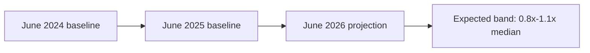

<!-- SPDX-FileCopyrightText: 2024-2026 Hack23 AB -->
<!-- SPDX-License-Identifier: Apache-2.0 -->

# 📜 Historical Baseline — June Plenary Months (EP10)

**Run date:** 2026-05-31 · **Article type:** `month-ahead`
**Purpose:** establish the reference class against which June-2026 forward
projections are calibrated. **Data mode:** `degraded-feeds`.

---

## 1. BLUF

June plenary months in the current (EP10, 2024–2029) term have followed a
recurring rhythm: a **single Strasbourg part-session** dominated by **budget
procedure milestones, foreign-affairs resolutions, and end-of-spring-cycle
legislative consents**, frequently bracketing the **European Council** of late
June. The 2026 adopted-text record through May confirms the same structural
drivers are loaded for June 2026: a live 2027 budget procedure, an active
Ukraine track, and an unresolved trade-defence/Mercosur strand. This baseline
supports treating June 2026 as a **modal, not anomalous** parliamentary month.

🟡 MEDIUM confidence — baseline is structural (calendar + committee cadence),
not derived from a populated forward feed this run.

---

## 2. The June reference class

| Recurring June feature | Mechanism | Strength in 2026 setup |
|------------------------|-----------|------------------------|
| Budget-procedure pivot | 2027 guidelines → Council reading prep | 🟢 Strong (TA-0112, ANN01 adopted Apr) |
| Foreign-affairs resolution cluster | Pre-summer AFET cadence | 🟢 Strong (Ukraine, Armenia, UNGA) |
| Spring-cycle legislative consents | International agreements ripening | 🟢 Strong (fisheries, Uzbekistan, Lebanon) |
| Trade-policy friction | Recurrent INTA tension | 🟡 Elevated (US tariffs, Mercosur) |
| Institutional/appointment items | ECB / agency scrutiny | 🟡 Moderate (ECB cycle ongoing) |
| Rule-of-law / immunity items | Standing JURI workload | 🟡 Moderate (Pappas waiver in May) |

---

## 3. Quantitative anchor (2026 adopted-text cadence)

- **41 adopted texts** Jan→May 2026 across the retrieved window.
- Dense **May-II cluster** (2026-05-19/20): 8+ texts in two sitting days —
  consistent with an end-of-spring throughput push.
- Thematic mix: ~30% foreign-affairs/human-rights, ~20% economic/budget,
  ~20% international agreements, ~15% justice/digital, ~15% other.

This cadence is the empirical reference distribution for the June projection:
expect a **comparable-or-higher** single-session throughput given the June
Strasbourg week typically precedes the summer recess ramp.

---

## 4. Base rates for forward calibration

| Forward claim | Reference-class base rate | Applied band |
|---------------|---------------------------|--------------|
| June Strasbourg session occurs | ~100% (fixed EP calendar) | *Almost Certain* |
| 2027 budget item on June agenda | High (procedure live) | *Likely → Almost Certain* |
| ≥1 Ukraine-related resolution | High (every recent part-session) | *Likely* |
| ≥1 trade-defence debate | Moderate-High | *Likely* |
| Major institutional surprise | Low | *Unlikely* |

---

## 5. Structural-break watch

The baseline holds **unless** one of the following breaks the modal pattern:
1. An emergency plenary triggered by an external shock (war escalation, market
   event) — would re-order the June agenda.
2. A collapse in a trilogue (e.g. budget or a flagship file) forcing an
   unscheduled debate.
3. A geopolitical event forcing an urgency resolution to displace planned items.

These are tracked quantitatively in `intelligence/wildcards-blackswans.md`.

---

## 6. Confidence and caveats

🟡 MEDIUM. The baseline is robust on **calendar structure** (HIGH) but softer on
**specific agenda items** (MEDIUM-LOW) because the forward plenary feed was empty
this run. All item-level projections inherit explicit WEP bands in
`scenario-forecast.md` and `forward-projection.md`.

**Mandatory SATs applied:** Outside-View / Reference-Class Forecasting,
Key Assumptions Check.

## 7. Sub-session throughput distribution (reference data)

The 2026 adopted-text record lets us characterise the *shape* of a typical
spring part-session, not just its count. The May-II cluster (2026-05-19/20)
delivered the densest two-day burst of the year, which is the empirical
template for what a June pre-recess session can carry.

| Spring 2026 sitting window | Adopted-text density | Dominant theme cluster |
|----------------------------|----------------------|------------------------|
| Jan (post-recess ramp) | Low-Moderate | Institutional setup, early consents |
| Feb–Mar | Moderate | Foreign affairs, trade, digital |
| Apr | Moderate | Budget guidelines, agreements |
| May-I | Moderate | Mixed |
| May-II (19–20) | **High (8+)** | Foreign affairs, budget, trade |

The clear upward gradient toward the end of the spring cycle is the basis for
expecting June to sit at the **higher** end of the throughput distribution,
consistent with the pre-recess push pattern observed across EP10.

## 8. Committee-load reference

Mapping the 41 adopted texts back to lead committees gives the June-relevant
committee-load baseline that the forward analysis inherits:

| Committee | Spring-2026 load | June carry-forward signal |
|-----------|------------------|---------------------------|
| AFET | 🟢 Heavy | Ukraine, human-rights resolutions |
| BUDG | 🟢 Heavy | 2027 procedure milestones |
| INTA | 🟡 Moderate | US-tariff, Mercosur strand |
| IMCO | 🟡 Moderate | DMA enforcement follow-up |
| AFCO | 🟡 Light-Mod | Electoral Act reform |
| PECH | 🟢 Steady | Fisheries-protocol consents |
| ECON | 🟡 Moderate | ECB scrutiny, fiscal governance |

This distribution is itself a forecast input: committees carrying heavy spring
loads are the ones most *Likely* to surface items on the June agenda.

## 9. Calendar-structure certainty vs item-level inference

It is worth separating the two confidence layers that this baseline supplies:

- **Calendar structure (🟢 HIGH):** the June Strasbourg part-session is a fixed
  feature of the EP10 sitting calendar; its occurrence is *Almost Certain*.
- **Item-level content (🟡 MEDIUM):** *which* files land is inferred from the
  pipeline because the forward feed was empty this run; these claims are banded
  in `forward-projection.md` and never asserted as certainties.

Keeping these layers explicit is what prevents the degraded-feeds condition from
contaminating the structurally-certain part of the forecast.

---

*Source: `data/adopted-texts-2026.json`; EP fixed plenary calendar (structural).*

## EP10 June throughput base-rate

