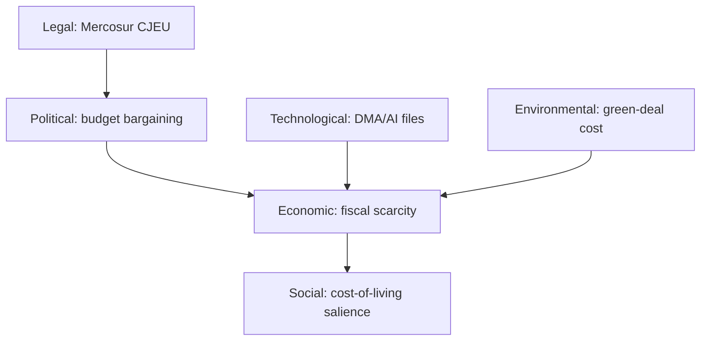

<!-- SPDX-FileCopyrightText: 2024-2026 Hack23 AB -->
<!-- SPDX-License-Identifier: Apache-2.0 -->

# 🧭 PESTLE Analysis — June 2026 EP Operating Environment

**Run date:** 2026-05-31 · **Article type:** `month-ahead` · **Data mode:** `degraded-feeds`
**Method:** Political / Economic / Social / Technological / Legal / Environmental
scan of the forces shaping the June parliamentary month, each factor graded for
salience and direction.

---

## 1. BLUF

The June-2026 environment is defined by **fiscal scarcity** (E), **geopolitical
exposure** (P), and **digital-enforcement maturation** (T/L). The IMF WEO macro
picture — French deficit −4.9%, German consolidation, Italian stagnation,
re-firming 2026 inflation — is the binding constraint colouring nearly every
agenda strand. Political fragmentation remains contained but trade and migration
are latent stress lines. 🟡 MEDIUM confidence.

---

## 2. PESTLE factor table

| Factor | Salience | Direction | Confidence |
|--------|----------|-----------|-----------|
| **P**olitical | 🔴 High | Stable-tense | 🟡 MED |
| **E**conomic | 🔴 High | Deteriorating (fiscal) | 🟢 HIGH |
| **S**ocial | 🟡 Medium | Stable | 🟡 MED |
| **T**echnological | 🟡 Medium | Intensifying | 🟡 MED |
| **L**egal | 🟡 Medium | Active | 🟢 HIGH |
| **E**nvironmental | 🟢 Low-Med | Background | 🟡 MED |

---

## 3. Political

- **Coalition arithmetic.** EP10 centrist core (EPP–S&D–Renew) intact; ECR and
  Greens swing by file. No realignment signal at run time (*Unlikely*, F8).
- **Foreign-affairs load.** Ukraine support, Middle East, and enlargement keep
  AFET central; donor-fatigue is a latent fault line as fiscal space tightens.
- **Institutional housekeeping.** Electoral Act reform (TA-0006) and immunity
  items (Pappas waiver, May) reflect standing constitutional/JURI workload.
- 🟡 MEDIUM: structure stable; specific scheduling inferred.

---

## 4. Economic 🟢

- **IMF WEO macro (Sept-2025 vintage, grade A1):** France deficit −5.1%→−4.9%
  (2025→2026), Germany consolidating −3.4%→−1.8%, Italy −3.1%→−2.8%. Growth
  anaemic (DE 0.8%, FR 0.9%, IT 0.5% for 2026). Inflation re-firming (DE 2.65%,
  IT 2.64% for 2026).
- **Implication.** The 2027 budget procedure runs into a hard fiscal-space wall;
  net-contributor discipline tightens; own-resources friction likely.
- **Binding constraint** on Ukraine financing and cohesion debates.
- 🟢 HIGH: anchored to authoritative IMF data.

---

## 5. Social

- **Cost-of-living legacy** keeps distributional politics salient; re-firming
  inflation revives purchasing-power framing.
- **Migration** remains a latent mobiliser but no June flashpoint signalled.
- 🟡 MEDIUM.

---

## 6. Technological

- **DMA enforcement** maturing (TA-0160) — gatekeeper compliance and platform
  scrutiny carry into June follow-ups.
- **AI-for-trade** (TA-0183) signals the AI-governance/industrial-policy nexus
  entering trade files.
- 🟡 MEDIUM: trajectory clear, June scheduling *Even Chance* (F6).

---

## 7. Legal 🟢

- **Mercosur CJEU strand** (TA-0008) — a pending opinion could activate the
  trade file in-window (TW-4).
- **Trade-defence instruments** (TA-0096) — anti-coercion/US-tariff response
  posture is legally live.
- **Electoral Act** (TA-0006) — constitutional reform track.
- 🟢 HIGH: documented in adopted-text record.

---

## 8. Environmental

- No dominant June environmental flashpoint in the pipeline, but Green Deal
  implementation and fisheries-protocol consents keep a steady background load.
- 🟢 Low-Med salience, 🟡 MEDIUM confidence.

---

## 9. Cross-factor synthesis

The **Economic–Legal–Political** triad is the load-bearing cluster: fiscal
scarcity (E) constrains budget and Ukraine choices (P), while live legal strands
(L: Mercosur, trade defence) can activate without notice. Technology (DMA/AI) is
a steady secondary track. This concentration is why `scenario-forecast.md`
Scenario B (Fiscal-Stress Spotlight) carries an elevated *Even Chance*.

**Mandatory SATs applied:** Key Assumptions Check, Drivers Analysis.

## 10. Factor interaction matrix

PESTLE factors are not independent; their interactions are where June risk
concentrates. The matrix below scores pairwise reinforcement (↑↑ strong, ↑ mild,
· neutral).

| | P | E | S | T | L | Env |
|---|---|---|---|---|---|---|
| **P** | — | ↑↑ | ↑ | · | ↑ | · |
| **E** | ↑↑ | — | ↑ | · | ↑ | · |
| **S** | ↑ | ↑ | — | · | · | · |
| **T** | · | · | · | — | ↑↑ | · |
| **L** | ↑ | ↑ | · | ↑↑ | — | · |
| **Env** | · | · | · | · | · | — |

The **P–E** cell (politics × economics) is the strongest interaction: fiscal
scarcity directly drives the budget/Ukraine political cleavage. The **T–L** cell
(technology × legal) is the secondary cluster: DMA/AI enforcement is where tech
meets regulation.

## 11. Directional outlook per factor (30-day)

| Factor | Now | 30-day trajectory | Watch signal |
|--------|-----|-------------------|--------------|
| Political | Tense-stable | Stable | Coalition cohesion |
| Economic | Constrained | Deteriorating risk | French spreads |
| Social | Stable | Stable | Inflation prints |
| Technological | Active | Intensifying | DMA enforcement news |
| Legal | Live | Active | CJEU Mercosur calendar |
| Environmental | Background | Background | Green Deal items |

## 12. Strategic implication

The PESTLE scan confirms that June's centre of gravity is the **Economic–
Political nexus** mediated by **Legal** triggers. The article should lead with
the fiscal lens and treat technology/environment as steady secondary tracks.
This directly motivates the weighting in `intelligence/synthesis-summary.md` and
the elevated *Even Chance* on Scenario B.

## 13. Confidence and SATs

🟡 MEDIUM overall, 🟢 HIGH on the Economic and Legal factors (documented), softer
on Social/Environmental.

**Mandatory SATs applied:** Key Assumptions Check, Drivers Analysis,
Cross-Impact Analysis.

---

*Cross-referenced: `intelligence/economic-context.md`,
`intelligence/forward-projection.md`, `data/adopted-texts-2026.json`.*

## PESTLE factor cross-impact

