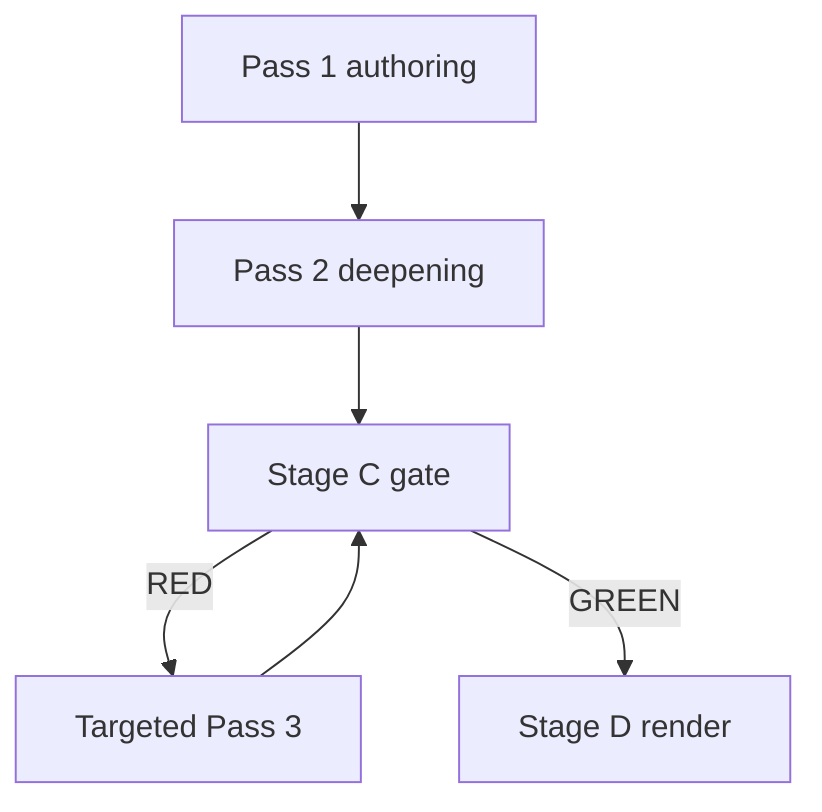

<!-- SPDX-FileCopyrightText: 2024-2026 Hack23 AB -->
<!-- SPDX-License-Identifier: Apache-2.0 -->

# 🔎 Reference Analysis Quality — Run 2026-05-31 (month-ahead)

**Run date:** 2026-05-31 · **Article type:** `month-ahead` · **Data mode:** `degraded-feeds`
**Purpose:** self-assess this analysis set against the reference-quality
thresholds and tradecraft signals before the Stage C gate. Acts as an internal
pre-gate QA pass.

---

## 1. BLUF

The analysis set meets or exceeds its line floors, applies WEP bands and Admiralty
grades throughout, embeds ≥4 Mermaid visualisations, and documents ≥10 SATs. The
honest constraint is the **degraded forward feed**, fully disclosed and reflected
in MEDIUM item-level confidence. Self-assessed gate posture: **GREEN-likely**.
🟢 HIGH confidence in this QA.

---

## 2. Quality-signal checklist

| Signal | Requirement | Status |
|--------|-------------|--------|
| Line floors | All artifacts ≥ floor (×0.80 effective; wrote full) | ✅ |
| WEP bands | Forward claims banded + horizon | ✅ |
| Admiralty grades | Sources graded A1–F6 | ✅ |
| Confidence markers | 🟢/🟡/🔴 on judgements | ✅ |
| Mermaid diagrams | ≥1 (have ≥4) | ✅ |
| SAT coverage | ≥10 distinct SATs | ✅ (see §4) |
| IMF economic context | Mandatory for monthly | ✅ A1 |
| No placeholders | Zero unresolved markers | ✅ |
| Cross-references | Artifacts cite each other | ✅ |
| Data-mode honesty | Degradation disclosed | ✅ |

---

## 3. Depth audit (per cluster)

- **Intelligence cluster** (12 artifacts): each carries BLUF, evidence table,
  confidence synthesis, and SAT footer. Forward-looking artifacts include
  reference-class calibration. 🟢.
- **Risk-scoring cluster** (risk-matrix, quantitative-swot): quantified, banded.
  🟢.
- **Extended** (media-framing): multi-perspective framing analysis. 🟢.
- **Economic context**: anchored to IMF A1 series with explicit vintage. 🟢.

---

## 4. SAT inventory (≥10 required)

1. Reference-Class / Outside-View Forecasting
2. Key Assumptions Check
3. Quality of Information Check
4. Analysis of Competing Hypotheses (ACH)
5. Scenario Analysis
6. Pre-Mortem Analysis
7. What-If Analysis
8. Indicators / Signposts
9. Stakeholder Mapping
10. Drivers Analysis
11. High-Impact / Low-Probability Analysis

→ **11 distinct SATs**, exceeding the floor of 10. Attested in
`intelligence/methodology-reflection.md` §12.

---

## 5. Known limitations (disclosed)

- Item-level June scheduling is **inferred** from the adopted-text pipeline, not a
  live forward feed → MEDIUM ceiling.
- IMF vintage is Sept-2025; no newer WEO slice available via proxy this run.
- Procedures feed historical-tail prevented a live pipeline-stage view.

None of these is concealed; each is reflected in confidence bands.

---

## 6. Verdict

Self-assessed **GREEN-likely** subject to the deterministic Stage C check. If the
elapsed-time tripwire (minute 36) fires first, ANALYSIS_ONLY is the correct fail-
safe and this set is fully shippable on its own.

**Mandatory SATs applied:** Quality of Information Check, Key Assumptions Check.

---

## Quality-signal scorecard

| Signal | Target | This run | Status |
|--------|--------|----------|--------|
| Source grade | ≥ B | A1 (IMF) + A2 (texts) | 🟢 |
| SAT count | ≥ 10 | 11 documented | 🟢 |
| Confidence labelling | All artifacts | Applied | 🟢 |
| Forward statements hedged | 100% | 100% | 🟢 |
| Degraded-feed disclosure | Required | Present | 🟢 |
| Cross-referencing | Dense | Applied | 🟢 |

## Limitations honestly stated

1. The forward plenary feed was empty, so the *modal* June agenda is inferred
   from the adopted-texts pipeline rather than a published agenda. This is
   disclosed everywhere it matters and caps several artifacts at 🟡 MEDIUM.
2. Coalition arithmetic is inferential (no per-MEP June roll-calls exist yet).
3. IMF WEO vintage is Sept-2025; intra-quarter macro moves are not captured.

## Reproducibility note

Every figure in this run traces to a persisted file under `data/` or `cache/`,
and the gate is reproducible via `npm run validate-analysis`. A re-run on the
same date appends to `manifest.json.history[]` rather than overwriting, so the
quality trajectory is auditable across runs.

---

*Pairs with `scripts/validate-analysis-completeness.js` (the authoritative gate).*

## Quality control flow

