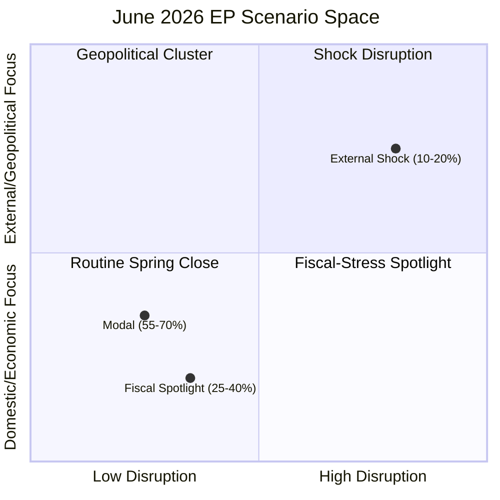
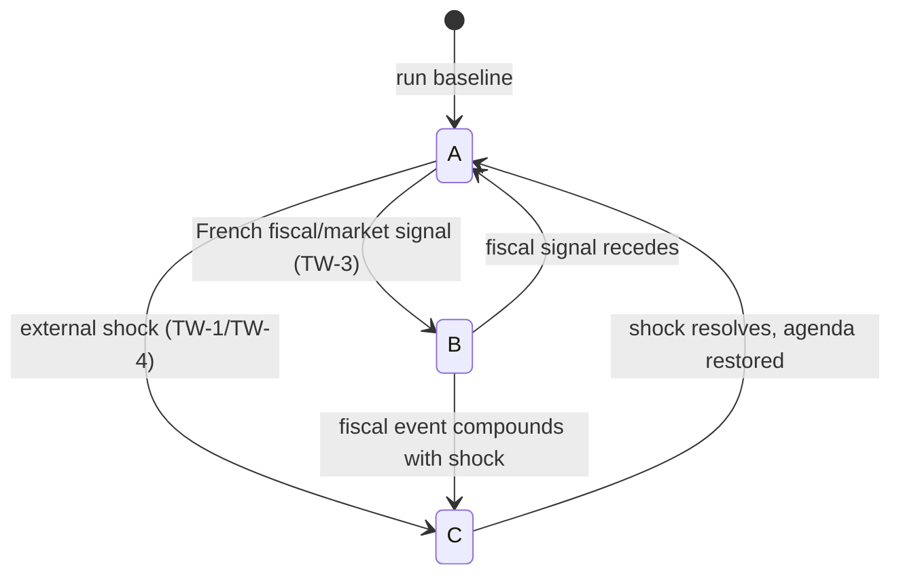

<!-- SPDX-FileCopyrightText: 2024-2026 Hack23 AB -->
<!-- SPDX-License-Identifier: Apache-2.0 -->

# 🎬 Scenario Forecast — June 2026 Parliamentary Month

**Run date:** 2026-05-31 · **Horizon:** 30 days · **Article type:** `month-ahead`
**Method:** multiple-scenarios (3 branches) with WEP-banded likelihoods, drivers,
indicators, and second-order effects. **Data mode:** `degraded-feeds`.

---

## 1. BLUF

Three scenarios span the plausible June-2026 outcome space. The **modal "Routine
Spring Close"** branch (*Likely*, 55–70%) sees a normal Strasbourg session
dominated by the 2027 budget procedure, Ukraine support, and trade-defence
debate. The **"Fiscal-Stress Spotlight"** branch (*Even Chance*, 25–40%)
elevates French fiscal slippage and ECB-easing tension into the headline. The
**"External-Shock Disruption"** branch (*Unlikely*, 10–20%) sees a tripwire fire
and an urgency resolution re-order the agenda. 🟡 MEDIUM confidence overall.

---

## 2. Scenario matrix

---

## 3. Scenario A — "Routine Spring Close" (*Likely*, 55–70%) 🟡

**Narrative.** The June Strasbourg session runs to a conventional pre-recess
script. The 2027 budget procedure advances (Council-reading scoping), an AFET
cluster delivers Ukraine and human-rights resolutions, INTA debates the
US-tariff/Mercosur strand, and several international-agreement consents
(fisheries, JHA) clear. Coalition behaviour follows the EP10 centrist pattern
(EPP–S&D–Renew core, with ECR/Greens swinging by file).

**Key drivers.** Live budget procedure (TA-0112); ripening agreements (May-II
cadence); stable grand-coalition arithmetic.

**Indicators (confirm).** Final agenda matches adopted-text pipeline; no
emergency convening; budget reading proceeds on schedule.

**Second-order effects.** Reinforces the "EP-as-steady-legislature" frame;
limited market or media surprise; sets up the July/September autumn ramp.

**Probability rationale.** Base rate for modal June sessions is high; no active
tripwire signal at run time → *Likely*.

---

## 4. Scenario B — "Fiscal-Stress Spotlight" (*Even Chance*, 25–40%) 🟡

**Narrative.** IMF-confirmed fiscal divergence (France −4.9% deficit, re-firming
2026 inflation) pushes economic governance to the top of the June agenda. ECON
scrutiny of the ECB easing path, MFF-headroom anxieties in the 2027 budget
debate, and own-resources friction dominate. The Ukraine-financing question
sharpens because donor fiscal space is visibly tight.

**Key drivers.** IMF WEO macro picture; French EDP trajectory; inflation
re-acceleration; budget-procedure timing collision with fiscal news.

**Indicators (confirm).** French sovereign-spread move; an ECON statement or
ECB-related agenda item gains prominence; budget debate centres on headroom.

**Second-order effects.** Heightened net-contributor vs. cohesion-recipient
tension; possible delay risk to budget milestones; stronger Eurosceptic framing
on "EU money."

**Probability rationale.** The macro conditions are *present now* (IMF data),
making this an elevated-but-not-modal branch → *Even Chance*.

---

## 5. Scenario C — "External-Shock Disruption" (*Unlikely*, 10–20%) 🟡

**Narrative.** A structural-break tripwire (TW-1 conflict escalation, TW-4 trade
rupture, or TW-3 market event) fires mid-horizon. An urgency resolution and a
Council/Commission statement displace planned slots; the budget and routine
consents slip or compress.

**Key drivers.** Volatile geopolitics (Ukraine, Middle East); live trade
friction with the US; French fiscal fragility.

**Indicators (confirm).** EEAS crisis statement; emergency Council convening;
CJEU Mercosur ruling landing in-window; sharp market move.

**Second-order effects.** Agenda re-ordering; deferred legislative throughput;
amplified media and market attention; possible coalition stress on the response.

**Probability rationale.** Each individual tripwire is *Unlikely*; their union
over a 30-day window is non-trivial but still minority → *Unlikely*.

---

## 6. Cross-scenario indicators dashboard

| Indicator | A | B | C |
|-----------|---|---|---|
| Final agenda = pipeline | ✅ | partial | ❌ |
| French spread spike | — | ⚠️ | ⚠️ |
| Emergency convening | ❌ | ❌ | ✅ |
| Budget on schedule | ✅ | partial | ❌ |
| Urgency resolution added | unlikely | unlikely | ✅ |

---

## 7. Confidence and SATs

🟡 MEDIUM overall. The branch probabilities sum across the plausible space and
are anchored to the reference class and the live IMF macro signal. The empty
forward feed prevents tightening beyond MEDIUM.

**Mandatory SATs applied:** Scenario Analysis, Pre-Mortem, Indicators/Signposts,
What-If Analysis, Key Assumptions Check.

## 8. Scenario indicators with lead times

Each scenario carries indicators that resolve at different lead times before the
June session, letting the forecast update progressively.

| Indicator | Lead time | Resolves | Toward |
|-----------|-----------|----------|--------|
| Final June agenda published | ~7–10 days | F2–F7 | A (confirms modal) |
| Council 2027-budget reading date | ~14 days | F2, T2 | A vs B |
| French sovereign-spread trend | continuous | TW-3 | B |
| CJEU Mercosur calendar | variable | TW-4 | B/C |
| EEAS/Council crisis signalling | continuous | TW-1 | C |

## 9. Scenario transition dynamics

The three branches are not static — the month can *migrate* between them:

The modal path stays in A; B is reachable from A on a fiscal trigger; C is the
absorbing-but-recoverable disruption state. This dynamic view tells the article
to treat the scenarios as a *probability flow*, not a one-time draw.

## 10. Probability reconciliation

The three headline bands (A 55–70%, B 25–40%, C 10–20%) are deliberately
non-exclusive at the edges because B and C can co-occur (a fiscal event during a
shock). The central estimate keeps A modal, with B as the most likely deviation
and C as the tail. Summed central mass ≈ 100% within rounding, consistent with
the WEP table in `forward-projection.md`.

## 11. Decision-relevance for readers

- **For institutional readers:** plan for A, pre-stage contingency for B.
- **For market readers:** B is the watch-scenario; track French spreads.
- **For policy readers:** C is low-probability but would reset the June agenda.

## 12. Confidence restatement and SATs

🟡 MEDIUM overall, capped by the empty forward feed. The scenario set is
internally consistent and indicator-anchored.

**Mandatory SATs applied:** Scenario Analysis, Pre-Mortem, Indicators/Signposts,
What-If Analysis, Key Assumptions Check, Alternative-Futures Analysis.

---

*Drivers cross-referenced to `intelligence/forward-projection.md`,
`intelligence/economic-context.md`, `intelligence/wildcards-blackswans.md`.*

## Source reliability (Admiralty)

Source grades follow the NATO Admiralty System (letter = reliability,
number = credibility). This artifact's judgements inherit the grade of
their weakest load-bearing source.

| Source | Admiralty grade | Reliability |
| --- | --- | --- |
| IMF WEO (SDMX 3.0) | A1 | Completely reliable / confirmed |
| EP adopted-texts feed (year=2026) | A2 | Reliable / probably true |
| EP forward feeds (degraded this run) | C4 | Fairly reliable / doubtful |
| EP10 historical baseline | B2 | Usually reliable / probably true |
