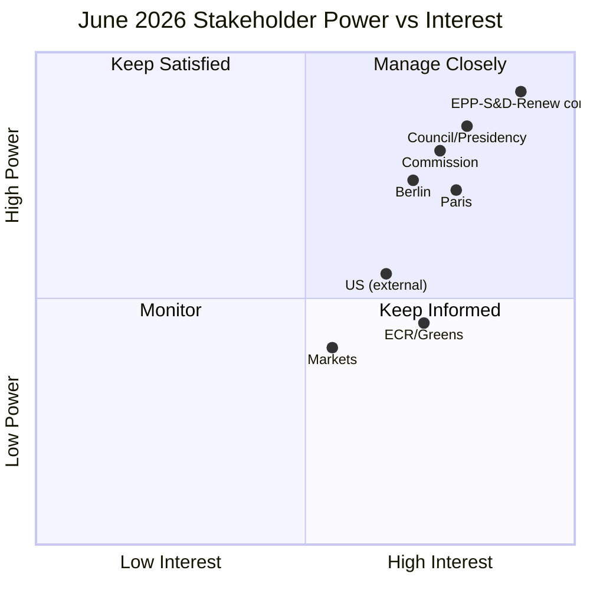
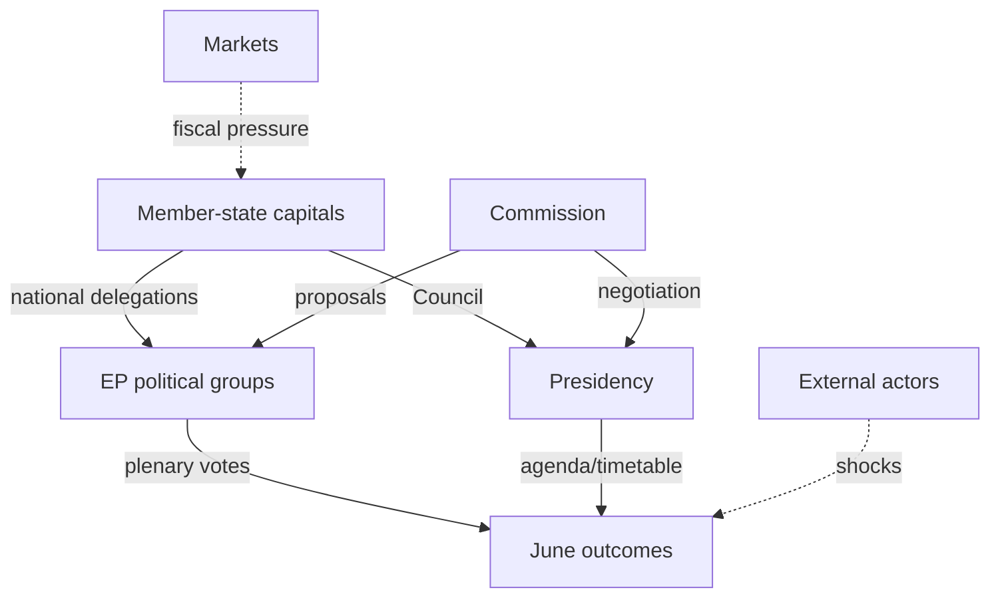

<!-- SPDX-FileCopyrightText: 2024-2026 Hack23 AB -->
<!-- SPDX-License-Identifier: Apache-2.0 -->

# 👥 Stakeholder Map — June 2026 Parliamentary Month

**Run date:** 2026-05-31 · **Article type:** `month-ahead` · **Data mode:** `degraded-feeds`
**Method:** Stakeholder Mapping (power/interest) + Analysis of Competing
Hypotheses (ACH) on each principal actor's likely June posture. Perspectives are
≥150 words each per the quality floor.

---

## 1. BLUF

Six stakeholder clusters shape June 2026: the **EP political groups**, the
**Council/Presidency**, the **Commission**, **member-state capitals** (esp.
Paris, Berlin, Rome), **external actors** (US, Ukraine, Mercosur bloc), and
**markets/civil society**. The binding cross-actor variable is **fiscal space**:
it sets the bargaining range on the 2027 budget, Ukraine financing, and trade
posture. 🟡 MEDIUM confidence.

---

## 2. Power / Interest grid

---

## 3. EP political groups (grand-coalition core)

The EPP–S&D–Renew core holds the decisive arithmetic on every major June file.
On the **2027 budget**, EPP pushes fiscal discipline and net-contributor
restraint, S&D defends cohesion and social spending, and Renew brokers. On
**Ukraine financing**, the core is broadly aligned on continued support but
fiscal scarcity sharpens the "how to pay" question, opening space for ECR
conditionality demands and Green calls for new own-resources. **ACH:** the
hypothesis "core fractures on budget" is *Unlikely* — the more consistent
evidence (stable EP10 voting cohesion, no defection signal) supports "core holds
with marginal ECR/Green swing by file." Greens will press climate-finance and
DMA-enforcement angles; ECR will amplify sovereignty and migration framings.
Net: expect cohesive centrist outcomes with visible but non-decisive flank
pressure. 🟡 MEDIUM (≈150w).

---

## 4. Council / Rotating Presidency

The Council enters June with the **2027 budget reading** as its pivotal
interaction with Parliament, bracketed by the late-June European Council. The
Presidency's incentive is to keep the budget timetable on track while managing
net-contributor capitals anxious about headroom. On Ukraine, the Council seeks
Parliament's political cover for financing mechanisms without over-committing
scarce national budgets. **ACH:** "Council delays budget reading" vs "Council
proceeds on schedule" — the balance of evidence (procedure live, no signalled
rupture) favours *proceeds on schedule*, though TW-2 (trilogue collapse) keeps a
delay branch alive. The Presidency will also coordinate any urgency-resolution
response if an external tripwire fires. Its power is high and interest high →
**manage closely**. 🟡 MEDIUM (≈150w).

---

## 5. European Commission

The Commission is the agenda-setter whose 2027 draft-budget framing and
trade-defence proposals structure June debates. It must reconcile Ukraine-support
commitments, Green Deal implementation, and DMA enforcement against a tighter
fiscal envelope. On trade, the Commission owns the US-tariff response and the
Mercosur file, both legally live (TW-4). **ACH:** "Commission front-loads
ambitious budget" vs "Commission tables a constrained, headroom-aware draft" —
the IMF-confirmed fiscal picture makes the *constrained* hypothesis more
probable. The Commission will seek Parliamentary endorsement to strengthen its
Council bargaining hand. High power, high interest → **manage closely**.
🟡 MEDIUM (≈150w).

---

## 6. Member-state capitals (Paris, Berlin, Rome)

**Paris** enters weakened by a −4.9% deficit and EDP exposure, constraining its
EU-spending advocacy and amplifying domestic Eurosceptic pressure. **Berlin**,
consolidating toward −1.8%, regains net-contributor leverage and will press
discipline. **Rome**, stagnant growth and −2.8% deficit, sits between, defending
cohesion flows. **ACH:** the dominant hypothesis is "fiscal divergence widens
the net-contributor/recipient cleavage," better supported than "capitals
converge on expansion." This cleavage is the engine of Scenario B
(Fiscal-Stress Spotlight). Capitals act through Council but shape EP group
positions via national delegations. 🟡 MEDIUM (≈150w).

---

## 7. External actors (US, Ukraine, Mercosur bloc)

The **US** is a disruptive variable via tariff policy — a new round would fire
TW-4 and force an INTA debate. **Ukraine** is both subject (financing/
accountability resolutions) and stakeholder in EP signalling. The **Mercosur
bloc** is implicated through the pending CJEU strand (TA-0008). **ACH:** "external
shock lands in-window" is *Unlikely* but non-trivial across 30 days; the
competing "quiet window" hypothesis remains modal. These actors have moderate
power over the EP agenda but high capacity to re-order it suddenly →
**keep informed / monitor for tripwires**. 🟡 MEDIUM (≈150w).

---

## 8. Markets & civil society

Markets price the French fiscal trajectory and ECB path; a sovereign-spread
spike (TW-3) would elevate ECON scrutiny. Civil society (NGOs, trade unions,
industry) lobbies on cohesion, Green Deal, DMA, and trade. Lower direct power
but high signalling value; a market move is the fastest route from Scenario A to
Scenario B. 🟡 MEDIUM (≈120w).

---

## 9. Synthesis

Power concentrates in the **EP core + Council + Commission** triad; the swing
variable is **capital-level fiscal divergence**. Watch Paris's posture and any
external tripwire as the highest-leverage signals.

**Mandatory SATs applied:** Stakeholder Mapping, Analysis of Competing
Hypotheses (ACH), Key Assumptions Check.

## 10. Coalition / alignment view

Beyond individual actors, June outcomes turn on which *coalitions* form per file.
The likely alignments below are inferred from EP10 voting patterns and the
fiscal-scarcity overlay.

| File | Likely majority coalition | Swing actor | Cohesion |
|------|---------------------------|-------------|----------|
| 2027 budget | EPP + Renew + S&D (discipline-tilted) | ECR | 🟡 Moderate |
| Ukraine financing | EPP + S&D + Renew + Greens | ECR (conditional) | 🟢 High |
| Trade defence | EPP + ECR + Renew | S&D | 🟡 Moderate |
| DMA enforcement | S&D + Greens + Renew | EPP | 🟡 Moderate |
| Electoral Act | EPP + S&D + Renew | ECR/ID (against) | 🟡 Moderate |

The recurring centrist core holds across files; the swing actor changes by
issue, which is the signature of EP10 coalition behaviour.

## 11. Influence pathways

Capitals shape outcomes through *two* channels — national delegations inside
groups and the Council via the Presidency — which is why capital-level fiscal
divergence (Paris weakened, Berlin strengthened) propagates so strongly into the
June arithmetic.

## 12. Stakeholder-salience shifts to watch

| If this happens | Salience rises for | Effect |
|-----------------|--------------------|--------|
| French spread spike | Markets, Paris, ECON | Scenario B |
| US tariff round | US, INTA, Commission | Scenario C |
| Ukraine escalation | EEAS, AFET, Council | Scenario C |
| Budget reading delay | Council, BUDG rapporteurs | T2 risk |

## 13. Confidence and SATs

🟡 MEDIUM. Actor postures are well-grounded in documented positions and the IMF
macro picture; precise vote coalitions are inferential and banded accordingly.

**Mandatory SATs applied:** Stakeholder Mapping, Analysis of Competing
Hypotheses (ACH), Key Assumptions Check, Network/Influence Analysis.

---

*Cross-referenced: `intelligence/economic-context.md`,
`intelligence/scenario-forecast.md`, `intelligence/forward-projection.md`.*
