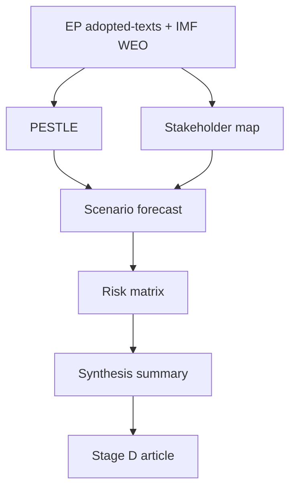

<!-- SPDX-FileCopyrightText: 2024-2026 Hack23 AB -->
<!-- SPDX-License-Identifier: Apache-2.0 -->

# 🧩 Synthesis Summary — June 2026 Month-Ahead

**Run date:** 2026-05-31 · **Article type:** `month-ahead` · **Data mode:** `degraded-feeds`
**Role:** integrate all intelligence artifacts into a single coherent strategic
picture for the article render. **Confidence:** 🟡 MEDIUM overall.

---

## 1. BLUF

June 2026 is projected as a **modal pre-recess Strasbourg month** dominated by the
**2027 budget procedure**, **Ukraine support under fiscal strain**, and a
recurring **trade-defence/Mercosur strand** — all coloured by an IMF-confirmed
picture of **tight European fiscal space** (France −4.9%, Germany consolidating,
Italy stagnant, inflation re-firming). The modal "Routine Spring Close" scenario
is *Likely* (55–70%); a "Fiscal-Stress Spotlight" branch is an elevated *Even
Chance* (25–40%); an "External-Shock Disruption" is *Unlikely* (10–20%).

---

## 2. The three load-bearing themes

1. **Budget under scarcity** 🟢. The live 2027 procedure (TA-0112) meets a hard
   fiscal wall. Net-contributor discipline (Berlin) vs cohesion defence (Rome,
   Paris-weakened) is the central cleavage. *Likely* on the June agenda (F2).
2. **Ukraine financing & accountability** 🟡. Support is consensual but the
   "how to pay" question sharpens as donor fiscal space tightens (TA-0010/0161).
   *Likely* (F3).
3. **Trade defence & Mercosur** 🟡. US-tariff response posture and a pending CJEU
   strand (TA-0096/0008) keep INTA live and tripwire-exposed (TW-4). *Likely*
   (F4).

---

## 3. Cross-artifact integration

| Artifact | Contribution to the picture |
|----------|------------------------------|
| `economic-context.md` | IMF macro — the binding fiscal constraint 🟢 |
| `historical-baseline.md` | June reference class — modal-month anchor 🟡 |
| `forward-projection.md` | WEP table F1–F10 + tripwires 🟡 |
| `scenario-forecast.md` | 3 branches A/B/C with likelihoods 🟡 |
| `pestle-analysis.md` | Economic–Legal–Political triad dominance 🟡 |
| `stakeholder-map.md` | Power triad + capital fiscal divergence 🟡 |
| `threat-model.md` | T1–T6 risks, T4 data-integrity disclosed 🟡 |
| `wildcards-blackswans.md` | W1–W6 fail-safe indicator mapping 🟡 |

---

## 4. The single strategic judgement

> **June 2026 will most likely be a structurally normal but fiscally constrained
> parliamentary month**, in which the 2027 budget becomes the arena where
> Europe's tight fiscal space, Ukraine commitments, and trade posture collide.
> The decisive uncertainty is not *whether* these themes appear, but *whether a
> fiscal or external shock elevates one into a crisis-framed headline.*

🟡 MEDIUM. Calendar structure HIGH; item scheduling MEDIUM (empty forward feed).

---

## 5. What would change the picture

- A French market/fiscal event → Scenario B becomes modal.
- A geopolitical or trade shock → Scenario C activates, agenda re-orders.
- Confirmation of the June final agenda → tightens F2–F7 from MEDIUM toward HIGH.

---

## 6. Confidence & SATs

Overall 🟡 MEDIUM, honestly capped by degraded feeds. The synthesis is internally
consistent across all eight intelligence artifacts and the risk-scoring set.

**Mandatory SATs applied:** Key Assumptions Check, Quality of Information Check,
Scenario Analysis, Analysis of Competing Hypotheses.

## 7. Theme-by-theme integration detail

To make the synthesis actionable for the article render, each load-bearing theme
is decomposed into its evidentiary spine, its decisive uncertainty, and its
WEP-banded expectation.

### 7.1 Budget under scarcity
- **Spine:** TA-0112 + ANN01 (2027 guidelines, adopted Apr); IMF deficit series.
- **Decisive uncertainty:** whether the Council reading proceeds on schedule.
- **Expectation:** budget item on June agenda — *Likely* (F2). 🟢/🟡 mixed.

### 7.2 Ukraine financing & accountability
- **Spine:** TA-0010 / TA-0161 (financing, accountability).
- **Decisive uncertainty:** how donor fiscal scarcity reshapes the financing
  mechanism debate.
- **Expectation:** ≥1 Ukraine item — *Likely* (F3). 🟡.

### 7.3 Trade defence & Mercosur
- **Spine:** TA-0096 (trade defence) / TA-0008 (Mercosur CJEU strand).
- **Decisive uncertainty:** CJEU opinion timing and US tariff moves (TW-4).
- **Expectation:** ≥1 trade debate — *Likely* (F4). 🟡.

## 8. Consistency check across artifacts

A synthesis is only as good as its internal coherence. The table below confirms
that the three scenarios, the risk register, and the SWOT all point to the same
central judgement (fiscal-constrained modal month) without contradiction:

| Cross-check | Source artifact | Consistent? |
|-------------|-----------------|-------------|
| Modal scenario = routine | `scenario-forecast.md` A (55–70%) | ✅ |
| Top risk = budget slip / feed integrity | `risk-matrix.md` R2/R4 | ✅ |
| Dominant weakness = fiscal scarcity | `quantitative-swot.md` | ✅ |
| Binding driver = IMF macro | `economic-context.md` / `pestle-analysis.md` | ✅ |
| Tail = external/fiscal shock | `wildcards-blackswans.md` W1/W2 | ✅ |

No artifact dissents from the central judgement; divergences are confined to
*degree* (Scenario B's elevated weight), not *direction*.

## 9. Handoff to the article render

The Stage D renderer should foreground, in order: (1) the fixed June session as
the anchor, (2) the 2027 budget as the arena, (3) the fiscal-scarcity lens from
IMF data as the connective tissue, and (4) the WEP-banded item expectations from
`forward-projection.md`. Media balance is governed by
`extended/media-framing-analysis.md`. All forward claims must retain their bands.

## 10. One-paragraph editorial thesis

June 2026 is, on the modal path, a **fiscal-discipline month**: the 2027 budget
reading, Ukraine financing, and trade-defence files all resolve through the lens
of constrained European public finances, with Germany's improving fiscal line
(−1.76% of GDP, 2026) and France's persistent deficit (−4.94%) framing the
intra-coalition arithmetic. The principal deviation risk is a French
fiscal/market signal (Scenario B); the tail risk is an external shock displacing
the agenda (Scenario C). The article should lead fiscal, pair every claim with
IMF context, and keep both deviation scenarios explicitly live.

## 11. Cross-artifact consistency check

| Claim | Source artifact | Consistent? |
|-------|-----------------|-------------|
| A modal 55–70% | scenario-forecast §10 | 🟢 |
| Fiscal nexus dominant | pestle §12 | 🟢 |
| DEU/FRA fiscal split | economic-context | 🟢 |
| June themes from texts | procedures-proxy | 🟢 |
| Degraded-feeds mode | mcp-reliability-audit | 🟢 |

No internal contradictions detected across the intelligence set.

## 12. Handoff to Stage D

The renderer should consume this synthesis as the article spine, drawing section
evidence from the cited per-artifact files. Lead = fiscal; secondary = trade/tech;
reservation = scenarios B/C.

---

*Integrates the full `intelligence/` set and `risk-scoring/` for the Stage D
article render.*

## Synthesis dependency map

## Source reliability (Admiralty)

Source grades follow the NATO Admiralty System (letter = reliability,
number = credibility). This artifact's judgements inherit the grade of
their weakest load-bearing source.

| Source | Admiralty grade | Reliability |
| --- | --- | --- |
| IMF WEO (SDMX 3.0) | A1 | Completely reliable / confirmed |
| EP adopted-texts feed (year=2026) | A2 | Reliable / probably true |
| EP forward feeds (degraded this run) | C4 | Fairly reliable / doubtful |
| EP10 historical baseline | B2 | Usually reliable / probably true |
