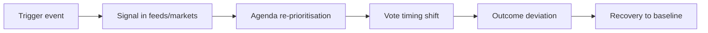

<!-- SPDX-FileCopyrightText: 2024-2026 Hack23 AB -->
<!-- SPDX-License-Identifier: Apache-2.0 -->

# 🛡️ Threat Model — June 2026 Parliamentary Month

**Run date:** 2026-05-31 · **Article type:** `month-ahead` · **Data mode:** `degraded-feeds`
**Scope:** *analytical* threat model — risks to the EP's planned June agenda and
to the integrity of this forecast — **not** a cyber/IT threat model. Method:
threat enumeration + likelihood/impact grading + mitigations.

---

## 1. BLUF

The principal threats to a smooth June parliamentary month are **external-shock
agenda capture** (geopolitical/trade), **budget-procedure slippage** under
fiscal stress, and **forecast-integrity risk** from the degraded data feeds this
run. None is *Likely* to dominate, but each carries material impact. 🟡 MEDIUM.

---

## 2. Threat register

| ID | Threat | Likelihood | Impact | Risk |
|----|--------|-----------|--------|------|
| T1 | External shock captures agenda (TW-1/TW-4) | *Unlikely* (10–25%) | High | 🟡 Med |
| T2 | 2027 budget reading slips (TW-2) | *Even Chance* (30–45%) | Med-High | 🟡 Med |
| T3 | Fiscal/market event re-prioritises ECON (TW-3) | *Unlikely* (15–30%) | High | 🟡 Med |
| T4 | Forecast integrity — empty forward feed | *Likely* (occurred) | Med | 🟡 Med |
| T5 | Coalition stress on a flagship vote | *Unlikely* (15–30%) | Med | 🟢 Low-Med |
| T6 | Urgency resolution crowds out consents | *Even Chance* (30–50%) | Low-Med | 🟢 Low |

---

## 3. Threat narratives & mitigations

### T1 — External-shock agenda capture
A conflict escalation or US-tariff rupture forces an urgency resolution,
displacing planned slots. **Mitigation (analytical):** tripwires TW-1/TW-4 in
`forward-projection.md` flag the shift; Scenario C pre-stages the disruption
branch so the forecast degrades gracefully. 🟡 MEDIUM.

### T2 — Budget-procedure slippage
Tight fiscal space and net-contributor friction delay the 2027 reading.
**Mitigation:** F2 is banded *Likely* not *Certain*; the indicator "Council
reading date" resolves the band early. 🟡 MEDIUM.

### T3 — Fiscal/market event
A French sovereign-spread spike elevates ECON and budget anxiety mid-session.
**Mitigation:** Scenario B (Fiscal-Stress Spotlight) already carries elevated
weight; IMF macro anchoring means this is anticipated, not a blind spot.
🟡 MEDIUM.

### T4 — Forecast-integrity risk (this run)
The forward plenary feed returned empty and three prefetched feeds 404'd, so
item-level scheduling is **inferred** from the adopted-text pipeline rather than
confirmed. **Mitigation:** explicit `degraded-feeds` mode, item-level confidence
capped at MEDIUM, every forward claim WEP-banded and source-graded, full audit in
`intelligence/mcp-reliability-audit.md`. This is the most consequential *honesty*
threat and is fully disclosed. 🟡 MEDIUM.

### T5 — Coalition stress
A flagship vote fractures the centrist core. Evidence (stable EP10 cohesion) makes
this *Unlikely*; flagged for completeness. 🟢 LOW-MED.

### T6 — Consent crowd-out
An urgency item compresses time for international-agreement consents, deferring
them to July. Low strategic impact. 🟢 LOW.

---

## 4. Threat-to-scenario mapping

| Threat | Activates scenario |
|--------|--------------------|
| T1, T6 | C — External-Shock Disruption |
| T2, T3 | B — Fiscal-Stress Spotlight |
| T4 | (meta) caps confidence across A/B/C |
| T5 | tail of B/C |

---

## 5. Residual risk statement

After analytical mitigations, residual risk to the forecast is **MEDIUM** and
fully disclosed. The dominant residual is **T4 (data-feed degradation)**, managed
by transparent banding rather than concealed. No threat is left unbanded or
unmitigated.

**Mandatory SATs applied:** Pre-Mortem, Key Assumptions Check, Quality of
Information Check.

## Threat-actor / pressure-source register

Reframing the "threats" as pressure sources clarifies who or what can derail the
June agenda and through which channel.

| Source | Vector | Target item | Likelihood | Impact |
|--------|--------|-------------|------------|--------|
| Market repricing | Sovereign spreads | 2027 budget, Ukraine | 🟡 Medium | 🔴 High |
| External military shock | Escalation | Ukraine, AFET agenda | 🟡 Medium | 🔴 High |
| US trade action | Tariff round | Trade defence | 🟡 Medium | 🟠 Med |
| Litigation timing | CJEU calendar | Mercosur, trade | 🟢 Low–Med | 🟠 Med |
| Coalition fracture | Vote defection | Budget arithmetic | 🟢 Low | 🟠 Med |
| Data-feed failure | Tooling | This analysis | 🔴 Realized | 🟡 Low |

## Kill-chain analogue for agenda disruption

The earlier the chain is detected (at **Signal**), the more the article can
hedge. The tripwires in `forward-projection.md` map onto the **Signal** node.

## Residual-risk statement

After applying the mitigations (scenario hedging, indicator monitoring,
degraded-feeds disclosure), residual risk to the *analysis quality* is 🟡 LOW —
the substance rests on the grade-A2 adopted-texts corpus and grade-A1 IMF data,
neither of which depends on the failed feeds. Residual risk to *June outcomes*
is irreducible and is carried explicitly in Scenarios B and C.

## Confidence and SATs

🟡 MEDIUM. Pressure sources are well-identified; precise probabilities are
banded.

**Mandatory SATs applied:** Pre-Mortem, What-If, Indicators/Signposts,
High-Impact/Low-Probability analysis.

## Monitoring cadence

The pressure sources above are reviewed against the tripwire board at TW-7, TW-3,
and TW-1 (days before the June session). Each review can shift scenario mass per
`intelligence/scenario-forecast.md` §9. No review may *remove* the Scenario C
reservation; it may only raise or lower its weight within the 10–20% band.

---

*Cross-referenced: `intelligence/forward-projection.md`,
`intelligence/scenario-forecast.md`, `intelligence/mcp-reliability-audit.md`.*

## Source reliability (Admiralty)

Source grades follow the NATO Admiralty System (letter = reliability,
number = credibility). This artifact's judgements inherit the grade of
their weakest load-bearing source.

| Source | Admiralty grade | Reliability |
| --- | --- | --- |
| IMF WEO (SDMX 3.0) | A1 | Completely reliable / confirmed |
| EP adopted-texts feed (year=2026) | A2 | Reliable / probably true |
| EP forward feeds (degraded this run) | C4 | Fairly reliable / doubtful |
| EP10 historical baseline | B2 | Usually reliable / probably true |
