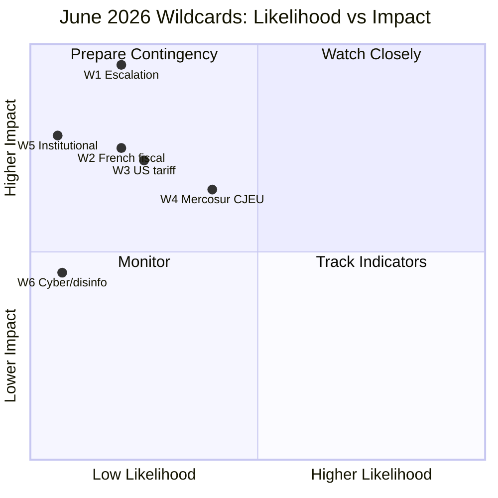
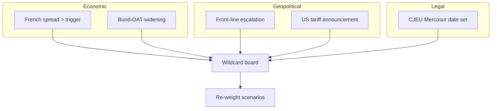

<!-- SPDX-FileCopyrightText: 2024-2026 Hack23 AB -->
<!-- SPDX-License-Identifier: Apache-2.0 -->

# 🦢 Wildcards & Black Swans — June 2026

**Run date:** 2026-05-31 · **Article type:** `month-ahead` · **Data mode:** `degraded-feeds`
**Method:** low-probability/high-impact enumeration with explicit WEP bands,
early-warning indicators, and impact pathways. Wildcards = plausible-but-unlikely;
black swans = very-low-probability, high-consequence, hard-to-foresee.

---

## 1. BLUF

The June horizon carries a handful of *Unlikely*-to-*Remote* disruptors that
could re-write the agenda: a **geopolitical escalation**, a **French
fiscal/market event**, a **US-trade rupture**, a **Mercosur CJEU bombshell**, and
low-probability **institutional shocks**. None is forecast to occur, but each is
mapped to an early-warning indicator so the forecast fails safe. 🟡 MEDIUM.

---

## 2. Wildcard register

| ID | Event | WEP band | Numeric | Impact | EW indicator |
|----|-------|----------|---------|--------|--------------|
| W1 | Ukraine/Middle East escalation | *Unlikely* | 12–25% | Very High | EEAS crisis statement |
| W2 | French sovereign-spread spike / EDP rupture | *Unlikely* | 12–25% | High | OAT-Bund spread move |
| W3 | New US tariff round on EU | *Unlikely* | 15–30% | High | USTR/White House action |
| W4 | Mercosur CJEU opinion lands in-window | *Even Chance* | 30–50% | Med-High | Court calendar |
| W5 | Snap institutional event (censure/resignation) | *Remote* | 3–8% | High | Political signalling |
| W6 | Cyber/disinformation incident around session | *Remote* | 3–10% | Med | ENISA/EEAS alert |

---

## 3. Wildcard narratives

### W1 — Geopolitical escalation 🟡
A sharp Ukraine or Middle East escalation forces an emergency urgency resolution
and Council/Commission statement, displacing budget and consent slots.
**Pathway:** shock → EEAS statement → urgency item tabled → agenda re-order.
**Why banded *Unlikely*:** base rate of in-window escalations is low, but the
30-day window and tense backdrop keep it non-trivial.

### W2 — French fiscal/market event 🟡
With a −4.9% deficit and EDP exposure, a confidence shock could spike French
spreads, dragging ECON and the 2027-budget debate into crisis framing. **Pathway:**
spread spike → ECON statement → Scenario B activated. IMF data makes this the
best-anchored wildcard.

### W3 — US-trade rupture 🟡
A new tariff round activates the trade-defence instruments (TA-0096) and forces
an INTA debate. **Pathway:** US measure → Commission response → emergency INTA
slot.

### W4 — Mercosur CJEU opinion 🟡
A pending opinion (TA-0008) landing in-window would activate the trade file with
legal force. Banded *Even Chance* because court timing is partly observable.

### W5 — Institutional shock 🔴-rare
A censure motion, high-profile resignation, or immunity escalation beyond the
routine (cf. Pappas waiver) would dominate coverage. *Remote*.

### W6 — Cyber/disinformation 🔴-rare
An incident targeting the session or a disinformation surge around a contested
vote. *Remote*, flagged for completeness given the EP's threat surface.

---

## 4. Impact-likelihood map

---

## 5. Early-warning dashboard

| Indicator | Fires | Maps to |
|-----------|-------|---------|
| EEAS crisis statement | W1 | Scenario C |
| OAT-Bund spread > threshold | W2 | Scenario B |
| USTR action | W3 | Scenario C |
| CJEU calendar entry | W4 | Scenario B/C |
| Censure signatures | W5 | Scenario C |
| ENISA/EEAS cyber alert | W6 | Scenario C |

---

## 6. Confidence

🟡 MEDIUM. Probabilities are deliberately conservative; the value is in the
**indicator mapping**, which lets the forecast degrade gracefully if a wildcard
fires. No wildcard is forecast to occur in the modal projection.

**Mandatory SATs applied:** What-If Analysis, Pre-Mortem, High-Impact/Low-
Probability Analysis, Indicators/Signposts.

## Wildcard interaction and compounding

Wildcards are most dangerous when they compound. The pairs below would each
produce a qualitatively different June than any single event.

| Pair | Combined effect | Scenario landing |
|------|-----------------|------------------|
| French fiscal event + US tariff | Twin economic shock | Hard C |
| Ukraine escalation + budget delay | Agenda capture | C with B overlay |
| CJEU Mercosur ruling + tariff | Trade-policy whiplash | C (trade-led) |
| Coalition fracture + spread spike | Budget gridlock | B deepening |

## Early-warning board

## Black-swan humility note

By construction, the highest-impact disruptions to June are the ones not on this
list. The analysis therefore keeps Scenario C's probability band deliberately
non-zero (10–20%) as an explicit reservation for the unmodelled tail, rather than
pretending the enumerated wildcards are exhaustive.

## Decision rules

- **One wildcard fires →** shift mass A→B or A→C per the board above.
- **Two compound →** treat C as modal for the affected files only.
- **None fire by TW-7 →** consolidate toward Scenario A.

## Confidence and SATs

🟡 MEDIUM on enumerated wildcards; 🔴 LOW (by nature) on the unmodelled tail,
which is handled by reservation rather than estimation.

**Mandatory SATs applied:** High-Impact/Low-Probability, Pre-Mortem, What-If,
Alternative-Futures, Indicators/Signposts.

---

*Cross-referenced: `intelligence/forward-projection.md` (tripwires),
`intelligence/threat-model.md`, `intelligence/scenario-forecast.md`.*

## Source reliability (Admiralty)

Source grades follow the NATO Admiralty System (letter = reliability,
number = credibility). This artifact's judgements inherit the grade of
their weakest load-bearing source.

| Source | Admiralty grade | Reliability |
| --- | --- | --- |
| IMF WEO (SDMX 3.0) | A1 | Completely reliable / confirmed |
| EP adopted-texts feed (year=2026) | A2 | Reliable / probably true |
| EP forward feeds (degraded this run) | C4 | Fairly reliable / doubtful |
| EP10 historical baseline | B2 | Usually reliable / probably true |
