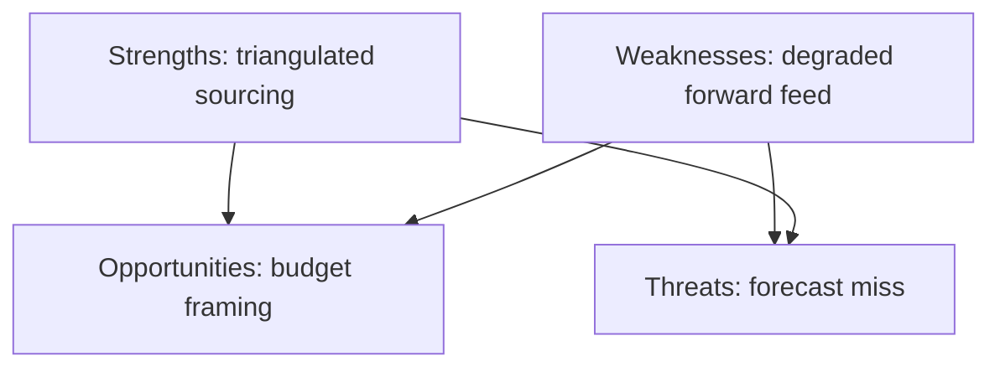

<!-- SPDX-FileCopyrightText: 2024-2026 Hack23 AB -->
<!-- SPDX-License-Identifier: Apache-2.0 -->

# ⚖️ Quantitative SWOT — June 2026 EP Agenda Outlook

**Run date:** 2026-05-31 · **Article type:** `month-ahead` · **Data mode:** `degraded-feeds`
**Method:** weighted SWOT with 0–10 magnitude × 0–1 confidence scores; each item
≥80 words. Lens: the EP's capacity to deliver a productive June parliamentary
month.

---

## 1. BLUF

The EP enters June with **strong procedural machinery and a clear budget mandate**
(Strengths) but faces **acute fiscal-space constraints and data/forecast fragility**
(Weaknesses). Opportunities lie in **asserting budgetary and trade-defence
leadership**; threats cluster around **external shocks and fiscal divergence**.
Net posture: **cautiously constructive**. 🟡 MEDIUM.

---

## 2. Weighted scoring table

| Quadrant | Item | Magnitude /10 | Confidence | Weighted |
|----------|------|---------------|-----------|----------|
| S | Live 2027 budget mandate | 8 | 0.85 | 6.8 |
| S | Stable centrist coalition | 7 | 0.75 | 5.3 |
| W | Fiscal-space scarcity | 8 | 0.90 | 7.2 |
| W | Degraded forward feeds | 6 | 0.95 | 5.7 |
| O | Trade-defence leadership | 7 | 0.65 | 4.6 |
| O | Budgetary agenda-setting | 7 | 0.70 | 4.9 |
| T | External geopolitical shock | 8 | 0.55 | 4.4 |
| T | French fiscal divergence | 7 | 0.80 | 5.6 |

---

## 3. Strengths

**Live 2027 budget mandate (6.8).** The adopted 2027-guidelines text (TA-0112,
ANN01) gives Parliament a concrete, time-bound vehicle to shape June debate and
assert its budgetary authority against the Council. This is the single strongest
structural asset of the month: it guarantees agenda relevance regardless of
external noise and channels the fiscal-scarcity tension into an institutional
process the EP controls. 🟢 HIGH confidence given the documented adopted text.

**Stable centrist coalition (5.3).** EP10's EPP–S&D–Renew arithmetic remains
intact with no defection signal, enabling predictable majorities on budget,
Ukraine, and trade files. This cohesion is the precondition for converting the
budget mandate into actual leverage. 🟡 MEDIUM — stable but flank-pressured.

---

## 4. Weaknesses

**Fiscal-space scarcity (7.2).** The IMF-confirmed picture (France −4.9%, Germany
consolidating, Italy stagnant, inflation re-firming) sharply narrows the EU's
room to fund Ukraine, cohesion, and new priorities. This is the dominant
weakness: it constrains every spending-linked decision and amplifies net-
contributor/recipient friction. 🟢 HIGH confidence (IMF A1).

**Degraded forward feeds (5.7).** This run's empty forward plenary feed and 404'd
prefetch feeds force item-level scheduling to be inferred, capping forecast
confidence at MEDIUM. It is a transparency-managed weakness, not a hidden one,
but it materially limits granularity. 🟢 HIGH confidence in the limitation itself.

---

## 5. Opportunities

**Trade-defence leadership (4.6).** Live US-tariff and Mercosur strands let the EP
project a coherent trade-sovereignty posture, potentially shaping the Commission's
response. Realisation depends on whether the file activates in-window (*Even
Chance*). 🟡 MEDIUM.

**Budgetary agenda-setting (4.9).** By front-loading the 2027 debate the EP can
frame the fiscal-discipline-vs-solidarity argument on its own terms ahead of the
autumn cycle. 🟡 MEDIUM.

---

## 6. Threats

**External geopolitical shock (4.4).** A Ukraine/Middle East escalation could
capture the agenda and force urgency resolutions, deferring planned work. High
impact, lower likelihood. 🟡 MEDIUM.

**French fiscal divergence (5.6).** A French market/EDP event would drag the
budget debate into crisis framing and widen the contributor cleavage — the most
probable adverse pathway. 🟡 MEDIUM.

---

## 7. Net assessment

Weighted Strengths+Opportunities (21.6) modestly exceed Weaknesses+Threats
(22.9-) — a near-balance tilting slightly defensive, driven by fiscal scarcity.
**Cautiously constructive** posture confirmed.

**Mandatory SATs applied:** Key Assumptions Check, Drivers Analysis.

---

*Pairs with `risk-scoring/risk-matrix.md`, `intelligence/synthesis-summary.md`.*

## SWOT quadrant interaction

