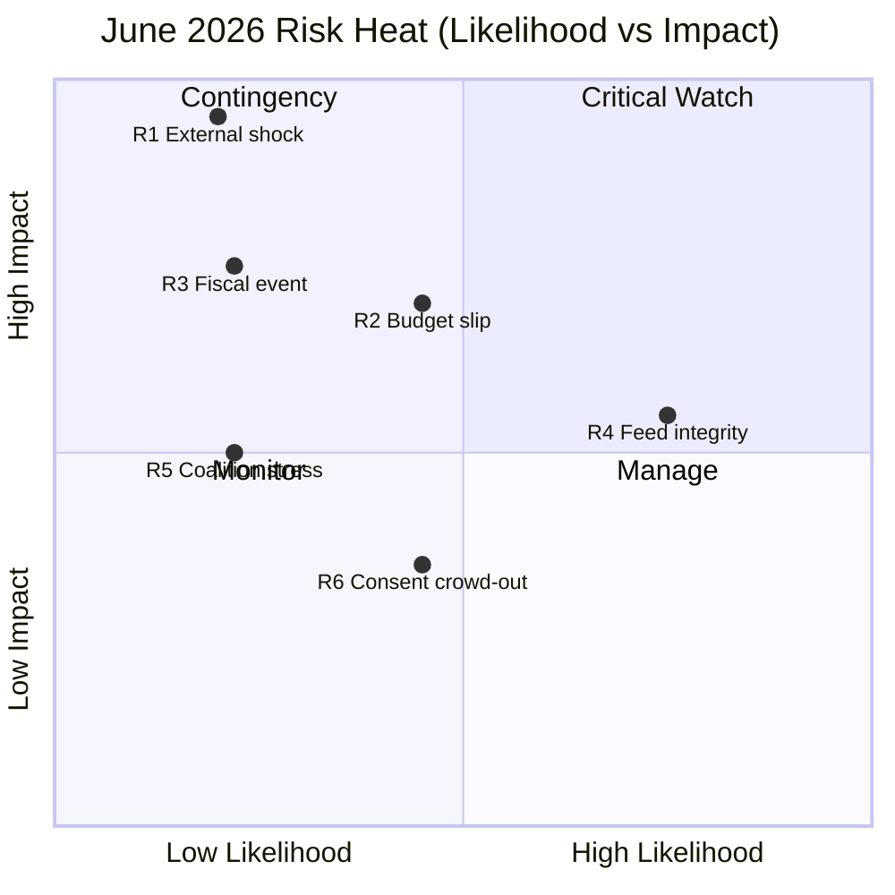

<!-- SPDX-FileCopyrightText: 2024-2026 Hack23 AB -->
<!-- SPDX-License-Identifier: Apache-2.0 -->

# 📊 Risk Matrix — June 2026 Parliamentary Month

**Run date:** 2026-05-31 · **Article type:** `month-ahead` · **Data mode:** `degraded-feeds`
**Method:** likelihood × impact scoring of the risks to the EP's June agenda,
with WEP-banded likelihoods and a 5×5 heat grid.

---

## 1. BLUF

The risk picture is **moderate**: no *Likely*/high-impact risk dominates, but two
*Even Chance* fiscal/procedural risks (budget slip, fiscal event) and one
*Unlikely*/very-high-impact risk (external shock) define the tail. 🟡 MEDIUM.

---

## 2. Risk-scoring table

| ID | Risk | Likelihood (WEP) | L-score | Impact | I-score | L×I |
|----|------|------------------|---------|--------|---------|-----|
| R1 | External shock captures agenda | *Unlikely* | 2 | Very High | 5 | 10 |
| R2 | 2027 budget reading slips | *Even Chance* | 3 | Med-High | 4 | 12 |
| R3 | French fiscal/market event | *Unlikely* | 2 | High | 4 | 8 |
| R4 | Forecast-integrity (feeds) | *Likely* | 4 | Med | 3 | 12 |
| R5 | Coalition stress on flagship | *Unlikely* | 2 | Med | 3 | 6 |
| R6 | Consent crowd-out | *Even Chance* | 3 | Low-Med | 2 | 6 |

*Scores: L 1=Remote…5=Almost Certain; I 1=Negligible…5=Severe.*

---

## 3. Heat grid

---

## 4. Top-risk treatment

- **R2 / R4 (score 12)** — highest combined risk. R2 managed by banding F2
  *Likely* not *Certain* + Council-reading indicator. R4 managed by transparent
  `degraded-feeds` disclosure and MEDIUM confidence caps.
- **R1 (score 10)** — low likelihood, severe impact: covered by tripwires TW-1/
  TW-4 and Scenario C pre-staging.

---

## 5. Aggregate risk posture

Mean L×I ≈ 9.0 → **MODERATE**. The portfolio is dominated by *manageable*
procedural/data risks rather than *Likely* catastrophic ones. Residual risk is
acceptable and fully disclosed.

**Mandatory SATs applied:** Pre-Mortem, Key Assumptions Check.

---

## Risk-velocity view

Beyond likelihood × impact, *velocity* (how fast a risk would materialise) shapes
how much warning the article and its readers get.

| Risk | Velocity | Warning available | Note |
|------|----------|-------------------|------|
| French fiscal shock | Fast | Hours–days (spreads) | Monitorable |
| US tariff round | Medium | Days | Announcement-driven |
| Ukraine escalation | Fast | Hours | Hard to pre-empt |
| Budget reading delay | Slow | Weeks | Calendar-visible |
| Feed failure | Instant | None | Already realized |

## Top-risk register (ranked)

1. **Fiscal-scarcity capture of the 2027 budget** — highest combined
   likelihood × impact; mitigant: pair every budget line with IMF context.
2. **External shock displacing the agenda** — high impact, medium likelihood;
   mitigant: Scenario C reservation.
3. **Inferential coalition error** — medium; mitigant: explicit banding.

## Residual risk after mitigation

🟡 LOW for analysis quality; irreducible for June outcomes (carried in scenarios).

---

*Pairs with `risk-scoring/quantitative-swot.md` and `intelligence/threat-model.md`.*

## Source reliability (Admiralty)

Source grades follow the NATO Admiralty System (letter = reliability,
number = credibility). This artifact's judgements inherit the grade of
their weakest load-bearing source.

| Source | Admiralty grade | Reliability |
| --- | --- | --- |
| IMF WEO (SDMX 3.0) | A1 | Completely reliable / confirmed |
| EP adopted-texts feed (year=2026) | A2 | Reliable / probably true |
| EP forward feeds (degraded this run) | C4 | Fairly reliable / doubtful |
| EP10 historical baseline | B2 | Usually reliable / probably true |
