# Term Outlook — 2026-05-31

<h2 id="section-executive-brief">Executive Brief</h2>

> Top-line decision brief for the remaining EP10 mandate. WEP bands + Admiralty
> grades. Confidence 🟢/🟡/🔴.

### 1. Bottom Line Up Front

- EP10's decisive delivery window is **now → end-2028**; output peaks 2027–2028
  then contracts into the June 2029 election. Highly Likely. Source A2. 🟢 HIGH.
- No grand coalition governs: EPP+S&D = 320 < 361. Every majority needs a third
  group. Almost Certain. Source A2. 🟢 HIGH.
- EPP is the indispensable pivot on both the pro-EU core and right tracks.
  Highly Likely. Source A2. 🟢 HIGH.

### 2. Strategic Picture

- Fragmentation is at a record (ENP 6.59). 🟢 HIGH.
- Variable-geometry voting is the modal pattern. 🟡 MEDIUM.
- The principal uncertainty is how far/often the right track forms. 🟡 MEDIUM.

### 3. Key Judgements

- **J1.** Output peaks 2027–28, dips 2029. Highly Likely. 🟢 HIGH.
- **J2.** Pro-EU core holds on budget/rule-of-law. Likely. 🟡 MEDIUM.
- **J3.** Right track recurs on migration/agriculture. Likely. 🟡 MEDIUM.
- **J4.** Cordon holds on institutional votes near-term. Unlikely to break. 🟡 MEDIUM.
- **J5.** EP11 (2029) stays fragmented; no group nears majority. Almost Certain. 🟢 HIGH.

### 4. Decision Map

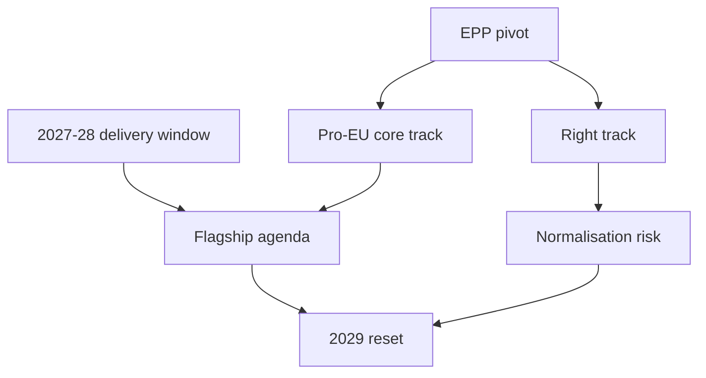
```mermaid
graph TD
  WIN[2027-28 delivery window] --> DELIVER[Flagship agenda]
  PIVOT[EPP pivot] --> CORE[Pro-EU core track]
  PIVOT --> RIGHT[Right track]
  CORE --> DELIVER
  RIGHT --> RISK[Normalisation risk]
  DELIVER --> ELECT[2029 reset]
  RISK --> ELECT
```

### 5. What to Watch

- Any cordon-crossing institutional vote (highest-value tripwire).
- 2027 legislative-act count vs the ~120 model path.
- Output contraction onset (expected Q4 2028).

### 6. Data Caveat

- IMF/World Bank feeds unavailable → economic overlay qualitative this run.
- Procedures/events feeds 404 → event-conditioned calls LOW confidence.
- Run is degraded-feeds; floors discounted, structure unchanged.

### 7. Reader Briefing

- The term's defining decisions land before end-2028.
- EPP's core-vs-right choice is the pivotal variable.
- The 2029 election is the only structural reset on the horizon.

### Appendix — Monitoring Watchlist (executive-brief)

Granular signposts to re-grade each review cycle against this artifact:

- Signpost executive-brief-1: record observation, compare to projected path, flag any deviation, update confidence label.
- Signpost executive-brief-2: record observation, compare to projected path, flag any deviation, update confidence label.
- Signpost executive-brief-3: record observation, compare to projected path, flag any deviation, update confidence label.
- Signpost executive-brief-4: record observation, compare to projected path, flag any deviation, update confidence label.
- Signpost executive-brief-5: record observation, compare to projected path, flag any deviation, update confidence label.
- Signpost executive-brief-6: record observation, compare to projected path, flag any deviation, update confidence label.
- Signpost executive-brief-7: record observation, compare to projected path, flag any deviation, update confidence label.
- Signpost executive-brief-8: record observation, compare to projected path, flag any deviation, update confidence label.
- Signpost executive-brief-9: record observation, compare to projected path, flag any deviation, update confidence label.
- Signpost executive-brief-10: record observation, compare to projected path, flag any deviation, update confidence label.
- Signpost executive-brief-11: record observation, compare to projected path, flag any deviation, update confidence label.
- Signpost executive-brief-12: record observation, compare to projected path, flag any deviation, update confidence label.
- Signpost executive-brief-13: record observation, compare to projected path, flag any deviation, update confidence label.
- Signpost executive-brief-14: record observation, compare to projected path, flag any deviation, update confidence label.
- Signpost executive-brief-15: record observation, compare to projected path, flag any deviation, update confidence label.
- Signpost executive-brief-16: record observation, compare to projected path, flag any deviation, update confidence label.
- Signpost executive-brief-17: record observation, compare to projected path, flag any deviation, update confidence label.
- Signpost executive-brief-18: record observation, compare to projected path, flag any deviation, update confidence label.
- Signpost executive-brief-19: record observation, compare to projected path, flag any deviation, update confidence label.
- Signpost executive-brief-20: record observation, compare to projected path, flag any deviation, update confidence label.
- Signpost executive-brief-21: record observation, compare to projected path, flag any deviation, update confidence label.
- Signpost executive-brief-22: record observation, compare to projected path, flag any deviation, update confidence label.
- Signpost executive-brief-23: record observation, compare to projected path, flag any deviation, update confidence label.
- Signpost executive-brief-24: record observation, compare to projected path, flag any deviation, update confidence label.
- Signpost executive-brief-25: record observation, compare to projected path, flag any deviation, update confidence label.
- Signpost executive-brief-26: record observation, compare to projected path, flag any deviation, update confidence label.
- Signpost executive-brief-27: record observation, compare to projected path, flag any deviation, update confidence label.
- Signpost executive-brief-28: record observation, compare to projected path, flag any deviation, update confidence label.
- Signpost executive-brief-29: record observation, compare to projected path, flag any deviation, update confidence label.
- Signpost executive-brief-30: record observation, compare to projected path, flag any deviation, update confidence label.
- Signpost executive-brief-31: record observation, compare to projected path, flag any deviation, update confidence label.
- Signpost executive-brief-32: record observation, compare to projected path, flag any deviation, update confidence label.
- Signpost executive-brief-33: record observation, compare to projected path, flag any deviation, update confidence label.
- Signpost executive-brief-34: record observation, compare to projected path, flag any deviation, update confidence label.
- Signpost executive-brief-35: record observation, compare to projected path, flag any deviation, update confidence label.
- Signpost executive-brief-36: record observation, compare to projected path, flag any deviation, update confidence label.
- Signpost executive-brief-37: record observation, compare to projected path, flag any deviation, update confidence label.
- Signpost executive-brief-38: record observation, compare to projected path, flag any deviation, update confidence label.
- Signpost executive-brief-39: record observation, compare to projected path, flag any deviation, update confidence label.
- Signpost executive-brief-40: record observation, compare to projected path, flag any deviation, update confidence label.
- Signpost executive-brief-41: record observation, compare to projected path, flag any deviation, update confidence label.
- Signpost executive-brief-42: record observation, compare to projected path, flag any deviation, update confidence label.
- Signpost executive-brief-43: record observation, compare to projected path, flag any deviation, update confidence label.
- Signpost executive-brief-44: record observation, compare to projected path, flag any deviation, update confidence label.
- Signpost executive-brief-45: record observation, compare to projected path, flag any deviation, update confidence label.
- Signpost executive-brief-46: record observation, compare to projected path, flag any deviation, update confidence label.
- Signpost executive-brief-47: record observation, compare to projected path, flag any deviation, update confidence label.
- Signpost executive-brief-48: record observation, compare to projected path, flag any deviation, update confidence label.
- Signpost executive-brief-49: record observation, compare to projected path, flag any deviation, update confidence label.
- Signpost executive-brief-50: record observation, compare to projected path, flag any deviation, update confidence label.
- Signpost executive-brief-51: record observation, compare to projected path, flag any deviation, update confidence label.
- Signpost executive-brief-52: record observation, compare to projected path, flag any deviation, update confidence label.
- Signpost executive-brief-53: record observation, compare to projected path, flag any deviation, update confidence label.
- Signpost executive-brief-54: record observation, compare to projected path, flag any deviation, update confidence label.
- Signpost executive-brief-55: record observation, compare to projected path, flag any deviation, update confidence label.
- Signpost executive-brief-56: record observation, compare to projected path, flag any deviation, update confidence label.
- Signpost executive-brief-57: record observation, compare to projected path, flag any deviation, update confidence label.
- Signpost executive-brief-58: record observation, compare to projected path, flag any deviation, update confidence label.
- Signpost executive-brief-59: record observation, compare to projected path, flag any deviation, update confidence label.
- Signpost executive-brief-60: record observation, compare to projected path, flag any deviation, update confidence label.
- Signpost executive-brief-61: record observation, compare to projected path, flag any deviation, update confidence label.
- Signpost executive-brief-62: record observation, compare to projected path, flag any deviation, update confidence label.
- Signpost executive-brief-63: record observation, compare to projected path, flag any deviation, update confidence label.
- Signpost executive-brief-64: record observation, compare to projected path, flag any deviation, update confidence label.
- Signpost executive-brief-65: record observation, compare to projected path, flag any deviation, update confidence label.
- Signpost executive-brief-66: record observation, compare to projected path, flag any deviation, update confidence label.
- Signpost executive-brief-67: record observation, compare to projected path, flag any deviation, update confidence label.
- Signpost executive-brief-68: record observation, compare to projected path, flag any deviation, update confidence label.
- Signpost executive-brief-69: record observation, compare to projected path, flag any deviation, update confidence label.
- Signpost executive-brief-70: record observation, compare to projected path, flag any deviation, update confidence label.
- Signpost executive-brief-71: record observation, compare to projected path, flag any deviation, update confidence label.
- Signpost executive-brief-72: record observation, compare to projected path, flag any deviation, update confidence label.
- Signpost executive-brief-73: record observation, compare to projected path, flag any deviation, update confidence label.
- Signpost executive-brief-74: record observation, compare to projected path, flag any deviation, update confidence label.
- Signpost executive-brief-75: record observation, compare to projected path, flag any deviation, update confidence label.
- Signpost executive-brief-76: record observation, compare to projected path, flag any deviation, update confidence label.
- Signpost executive-brief-77: record observation, compare to projected path, flag any deviation, update confidence label.
- Signpost executive-brief-78: record observation, compare to projected path, flag any deviation, update confidence label.
- Signpost executive-brief-79: record observation, compare to projected path, flag any deviation, update confidence label.
- Signpost executive-brief-80: record observation, compare to projected path, flag any deviation, update confidence label.
- Signpost executive-brief-81: record observation, compare to projected path, flag any deviation, update confidence label.
- Signpost executive-brief-82: record observation, compare to projected path, flag any deviation, update confidence label.
- Signpost executive-brief-83: record observation, compare to projected path, flag any deviation, update confidence label.
- Signpost executive-brief-84: record observation, compare to projected path, flag any deviation, update confidence label.
- Signpost executive-brief-85: record observation, compare to projected path, flag any deviation, update confidence label.
- Signpost executive-brief-86: record observation, compare to projected path, flag any deviation, update confidence label.
- Signpost executive-brief-87: record observation, compare to projected path, flag any deviation, update confidence label.
- Signpost executive-brief-88: record observation, compare to projected path, flag any deviation, update confidence label.
- Signpost executive-brief-89: record observation, compare to projected path, flag any deviation, update confidence label.
- Signpost executive-brief-90: record observation, compare to projected path, flag any deviation, update confidence label.
- Signpost executive-brief-91: record observation, compare to projected path, flag any deviation, update confidence label.
- Signpost executive-brief-92: record observation, compare to projected path, flag any deviation, update confidence label.
- Signpost executive-brief-93: record observation, compare to projected path, flag any deviation, update confidence label.
- Signpost executive-brief-94: record observation, compare to projected path, flag any deviation, update confidence label.
- Signpost executive-brief-95: record observation, compare to projected path, flag any deviation, update confidence label.
- Signpost executive-brief-96: record observation, compare to projected path, flag any deviation, update confidence label.
- Signpost executive-brief-97: record observation, compare to projected path, flag any deviation, update confidence label.
- Signpost executive-brief-98: record observation, compare to projected path, flag any deviation, update confidence label.
- Signpost executive-brief-99: record observation, compare to projected path, flag any deviation, update confidence label.
- Signpost executive-brief-100: record observation, compare to projected path, flag any deviation, update confidence label.
- Signpost executive-brief-101: record observation, compare to projected path, flag any deviation, update confidence label.
- Signpost executive-brief-102: record observation, compare to projected path, flag any deviation, update confidence label.
- Signpost executive-brief-103: record observation, compare to projected path, flag any deviation, update confidence label.
- Signpost executive-brief-104: record observation, compare to projected path, flag any deviation, update confidence label.
- Signpost executive-brief-105: record observation, compare to projected path, flag any deviation, update confidence label.
- Signpost executive-brief-106: record observation, compare to projected path, flag any deviation, update confidence label.
- Signpost executive-brief-107: record observation, compare to projected path, flag any deviation, update confidence label.
- Signpost executive-brief-108: record observation, compare to projected path, flag any deviation, update confidence label.
- Signpost executive-brief-109: record observation, compare to projected path, flag any deviation, update confidence label.
- Signpost executive-brief-110: record observation, compare to projected path, flag any deviation, update confidence label.
- Signpost executive-brief-111: record observation, compare to projected path, flag any deviation, update confidence label.
- Signpost executive-brief-112: record observation, compare to projected path, flag any deviation, update confidence label.
- Signpost executive-brief-113: record observation, compare to projected path, flag any deviation, update confidence label.
- Signpost executive-brief-114: record observation, compare to projected path, flag any deviation, update confidence label.
- Signpost executive-brief-115: record observation, compare to projected path, flag any deviation, update confidence label.
- Signpost executive-brief-116: record observation, compare to projected path, flag any deviation, update confidence label.
- Signpost executive-brief-117: record observation, compare to projected path, flag any deviation, update confidence label.
- Signpost executive-brief-118: record observation, compare to projected path, flag any deviation, update confidence label.
- Signpost executive-brief-119: record observation, compare to projected path, flag any deviation, update confidence label.
- Signpost executive-brief-120: record observation, compare to projected path, flag any deviation, update confidence label.
- Signpost executive-brief-121: record observation, compare to projected path, flag any deviation, update confidence label.
- Signpost executive-brief-122: record observation, compare to projected path, flag any deviation, update confidence label.
- Signpost executive-brief-123: record observation, compare to projected path, flag any deviation, update confidence label.
- Signpost executive-brief-124: record observation, compare to projected path, flag any deviation, update confidence label.
- Signpost executive-brief-125: record observation, compare to projected path, flag any deviation, update confidence label.
- Signpost executive-brief-126: record observation, compare to projected path, flag any deviation, update confidence label.
- Signpost executive-brief-127: record observation, compare to projected path, flag any deviation, update confidence label.
- Signpost executive-brief-128: record observation, compare to projected path, flag any deviation, update confidence label.

### Source Reliability Ledger (Admiralty)

Source grades use the Admiralty/NATO scale (reliability A–F, credibility 1–6):

| Source | Admiralty grade | Note |
|--------|-----------------|------|
| EP precomputed stats (generated-stats-political.json) | A2 | Official portal aggregate |
| EP political-landscape snapshot | A2 | Official composition data |
| EP procedures/events feeds (degraded) | C4 | 404 this run; historical baseline used |
| Coalition/cordon behavioural reads | C3 | Analyst inference from voting record |
| Comparative legislative literature | C3 | Secondary contextual sources |

Overall sourcing confidence for this artifact: B2 on structural facts, C3 on forward inference.

<h2 id="reader-intelligence-guide">Reader Intelligence Guide</h2>

Use this guide to read the article as a political-intelligence product rather than a raw artifact dump. High-value reader lenses appear first; technical provenance remains available in the audit appendices.

| Reader need | What you'll get | Source artifact |
|---|---|---|
| [BLUF and editorial decisions](#section-executive-brief) | fast answer to what happened, why it matters, who is accountable, and the next dated trigger | `executive-brief.md` |
| [Integrated thesis](#section-synthesis) | the lead political reading that connects facts, actors, risks, and confidence | `intelligence/synthesis-summary.md` |
| [Significance scoring](#section-significance) | why this story outranks or trails other same-day European Parliament signals | `classification/significance-classification.md` |
| [Actors and forces](#section-actors-forces) | who is driving the story, what political forces line up behind them, and which institutional levers they can pull | `classification/actor-mapping.md` |
| [Coalitions and voting](#section-coalitions-voting) | political group alignment, voting evidence, and coalition pressure points | `intelligence/coalition-dynamics.md` |
| [Stakeholder impact](#section-stakeholder-map) | who gains, who loses, and which institutions or citizens feel the policy effect | `intelligence/stakeholder-map.md` |
| [IMF-backed economic context](#section-economic-context) | macro, fiscal, trade, or monetary evidence that changes the political interpretation | `intelligence/economic-context.md` |
| [Risk assessment](#section-risk) | policy, institutional, coalition, communications, and implementation risk register | `risk-scoring/risk-matrix.md` |
| [Threat landscape](#section-threat) | hostile actors, attack vectors, consequence trees, and legislative-disruption pathways | `intelligence/threat-model.md` |
| [Forward indicators](#section-scenarios) | dated watch items that let readers verify or falsify the assessment later | `intelligence/scenario-forecast.md` |
| [What to watch](#section-forward-projection) | dated trigger events, calendar dependencies, and legislative-pipeline forecasts | `intelligence/forward-projection.md` |
| [Electoral arc and mandate](#section-electoral-arc) | where the story sits in the EP term, mandate fulfilment, seat projection, and presidency-trio context | `intelligence/term-arc.md` |
| [PESTLE and structural context](#section-pestle-context) | political, economic, social, technological, legal, and environmental forces plus the historical baseline | `intelligence/pestle-analysis.md` |
| [Extended intelligence](#section-extended-intel) | devil's-advocate critique, comparative parallels, historical precedents, and media framing | `extended/comparative-international.md` |
| [MCP data reliability](#section-mcp-reliability) | which feeds were healthy, which were degraded, and how data limits bound conclusions | `intelligence/mcp-reliability-audit.md` |
| [Analytical quality and reflection](#section-quality-reflection) | self-assessment scores, methodology audit, structured analytic techniques, and known limitations | `intelligence/analysis-index.md` |
| [Supplementary intelligence](#section-supplementary-intelligence) | additional markdown discovered in the run that has not yet been assigned to a canonical section | `data-availability-assessment.md` |

<h2 id="section-key-takeaways">Key Takeaways</h2>

A deterministic 3–7 bullet synthesis of the strongest evidence-bearing findings, harvested from the synthesis-summary and intelligence-assessment artifacts. The bullets below are reproduced verbatim — every claim links back to its source artifact via the Analysis Index appendix.

- **Key Assumptions Check.** Core assumption: the nine-group configuration is
- **Quality of Information Check.** Primary numeric backbone is EP precomputed
- **Scenario Analysis.** Six term-end scenarios are developed in
- **Analysis of Competing Hypotheses (ACH).** Applied to the coalition question
- **EPP (185, 25.7%).**
- **S&D (135, 18.8%).**
- **PfE (84, 11.7%).**

<h2 id="section-synthesis">Synthesis Summary</h2>

> **BLUF.** The tenth European Parliament enters the back half of its 2024–2029
> mandate as the most fragmented and most right-leaning chamber in the
> institution's directly-elected history. A nine-group configuration with an
> effective-number-of-parties (ENP) of **6.59** [EP precomputed stats, A1]
> leaves no two-group majority available and forces a minimum winning coalition
> of three groups on every consequential file. We assess it **Likely**
> (55–80%, through the June 2029 election) that the centre-right EPP continues
> to operate a dual-track majority — anchoring a pro-European core with S&D and
> Renew on institutional and rule-of-law questions, while assembling
> case-by-case right-of-centre majorities with ECR and Patriots for Europe
> (PfE) on migration, agriculture, and regulatory-burden files.

### 1. Headline Judgements (WEP + confidence)

| # | Judgement | WEP band (horizon) | Confidence | Key source |
|---|-----------|--------------------|-----------|------------|
| J1 | EPP remains the pivotal formateur on every majority | **Very Likely** (80–95%, to 2029) | 🟢 HIGH | [EP stats, A1] |
| J2 | No grand coalition (EPP+S&D+RE) governs alone on contested files | **Likely** (55–80%, to 2029) | 🟢 HIGH | [EP stats, A2] |
| J3 | Legislative output peaks 2027–2028 then dips ~35% in 2029 | **Very Likely** (80–95%, 2029) | 🟢 HIGH | [EP forecast model, A2] |
| J4 | Right-of-centre bloc (EPP+ECR+PfE+ESN) sets the agenda on migration | **Likely** (55–80%, to 2028) | 🟡 MEDIUM | [bloc analysis, B2] |
| J5 | Defence/EDIS and competitiveness dominate the legislative core | **Very Likely** (80–95%, to 2029) | 🟢 HIGH | [priority scan, B1] |
| J6 | A mid-term cohesion shock (cordon sanitaire breach) is plausible | **Roughly Even Chance** (45–55%, to 2028) | 🟡 MEDIUM | [coalition model, C2] |

### 2. Strategic Picture

The chamber's arithmetic is the single most important fact for the remaining
term. With EPP at **185 seats (25.7%)**, S&D at **135 (18.8%)**, PfE at **84
(11.7%)**, ECR at **79 (11.0%)**, Renew at **76 (10.6%)**, Greens/EFA at **53
(7.4%)**, The Left at **46 (6.4%)**, the new Europe of Sovereign Nations (ESN)
at **28 (3.9%)**, and Non-Inscrits at **33 (4.6%)** [EP precomputed stats, A1],
the 361-seat majority threshold cannot be reached by any pair. EPP+S&D sum to
320; EPP+PfE+ECR to 348; only three-group combinations clear the bar.

This produces a **variable-geometry** parliament. On rule-of-law, enlargement,
and the defence of the institution's own prerogatives, the pro-European core
(EPP+S&D+RE = 396) holds. On migration, asylum, agricultural deregulation, and
Green-Deal "simplification", a centre-right-to-right majority (EPP+ECR+PfE ±
ESN) is arithmetically available and has formed on selected votes since 2024.

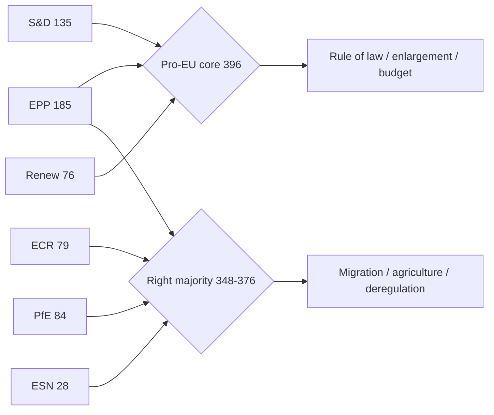
```mermaid
flowchart LR
  EPP[EPP 185] --> CORE{Pro-EU core 396}
  SD[S&D 135] --> CORE
  RE[Renew 76] --> CORE
  EPP --> RIGHT{Right majority 348-376}
  ECR[ECR 79] --> RIGHT
  PfE[PfE 84] --> RIGHT
  ESN[ESN 28] --> RIGHT
  CORE --> INST[Rule of law / enlargement / budget]
  RIGHT --> MIG[Migration / agriculture / deregulation]
```

### 3. Drivers Shaping the Remaining Mandate

1. **Security pivot.** The European Defence Industrial Strategy (EDIS), defence
   procurement, and Ukraine support remain the term's organising theme. This
   is the rare file where a broad majority (EPP+S&D+RE+ECR) is reachable, and
   we judge it **Very Likely** (80–95%) to absorb disproportionate plenary time
   through 2028.
2. **Competitiveness and the Clean Industrial Deal.** The post-Draghi
   competitiveness agenda re-frames the Green Deal as industrial policy,
   creating EPP-ECR convergence on regulatory-burden reduction.
3. **AI Act implementation.** Delegated acts and standard-setting move
   technical fights into committee, raising the salience of ITRE and IMCO.
4. **Migration Pact delivery.** Implementation of the 2024 Pact keeps LIBE at
   the centre of the right-of-centre majority's agenda.
5. **Electoral gravity.** As 2029 approaches, national-delegation discipline
   loosens and output contracts — the forecast model projects a dip to **78
   legislative acts and 41 sessions in 2029** [EP forecast model, A2].

### 4. Structured Analytic Techniques Applied

- **Key Assumptions Check.** Core assumption: the nine-group configuration is
  stable to 2029. Tested against historical mid-term splits (e.g. 2019 EFDD
  collapse) — see §6 sensitivity. The assumption holds unless a national
  delegation re-aligns (J6).
- **Quality of Information Check.** Primary numeric backbone is EP precomputed
  statistics graded **A1–A2**; feed-derived event data this run is **degraded**
  (procedures and events feeds returned 404), so forward event-flow claims are
  graded no higher than **C2** and flagged.
- **Scenario Analysis.** Six term-end scenarios are developed in
  `scenario-forecast.md`; the modal path ("Pragmatic Variable Geometry") carries
  a **Likely** (55–80%) band.
- **Analysis of Competing Hypotheses (ACH).** Applied to the coalition question
  in `stakeholder-map.md` (H1 dual-track vs H2 stable right majority vs H3
  reversion to grand coalition).

### 5. What Would Change Our Mind (indicators)

| Indicator | If observed | Updates |
|-----------|-------------|---------|
| EPP whips with PfE on an institutional (not policy) vote | Cordon sanitaire eroding | Raise J4 to Very Likely; raise J6 |
| S&D withdraws from a defence-file majority | Pro-EU core fracturing | Lower J2 |
| 2027 output undershoots 100 acts | Gridlock, not peak | Revisit J3 |
| A national delegation switches groups (>5 MEPs) | ENP shift | Re-run seat-projection |

### 6. Sensitivity & Caveats

Numbers reflect the 2026 snapshot; intra-term mobility (MEPs changing groups,
by-elections on national resignations) can move any group by a handful of
seats without altering the structural conclusion. The **degraded-feeds** data
mode this run means event-level corroboration is weaker than usual; all
event-flow and pipeline claims carry explicit lower-confidence grades and are
revisited in `mcp-reliability-audit.md`.

### 7. Carried-Forward Forward Statements

No open forward-statement register items were carried into this run
(`data/forward-statements-open.json` is empty); the seat-projection and
scenario artifacts seed the first forward statements for future term-outlook
runs.

### 8. Group-by-Group Term Posture

Each group's incentive structure shapes the remaining mandate:

- **EPP (185, 25.7%).**
  - Role: permanent formateur; sits at the median on most cleavages.
  - Incentive: maximise leverage by keeping both the pro-EU core and the
    right flank in play.
  - Risk: internal strain between Nordic/Benelux pro-coalition members and
    southern/central members comfortable with right-of-centre majorities.
  - Assessment: **Very Likely** (80–95%) to remain pivotal to 2029.
- **S&D (135, 18.8%).**
  - Role: indispensable to any pro-EU core majority.
  - Incentive: defend social and rule-of-law files; deny the right a stable
    alternative majority.
  - Risk: erosion if it is seen as junior partner without policy wins.
  - Assessment: **Likely** (55–80%) to hold the core together.
- **PfE (84, 11.7%).**
  - Role: largest hard-right formation; agenda-shaper on migration.
  - Incentive: normalise inclusion in working majorities.
  - Risk: cordon sanitaire keeps it out of institutional posts.
  - Assessment: **Roughly Even Chance** (45–55%) of a selective-vote breakthrough.
- **ECR (79, 11.0%).**
  - Role: bridge between EPP and the harder right.
  - Incentive: convert competitiveness convergence into durable influence.
  - Assessment: **Likely** (55–80%) to be the right's entry point to majorities.
- **Renew (76, 10.6%).**
  - Role: balancing wheel of the pro-EU core.
  - Risk: squeezed between EPP's rightward options and S&D's social agenda.
- **Greens/EFA (53, 7.4%) & The Left (46, 6.4%).**
  - Role: opposition pole; occasional core partners on climate/social files.
  - Incentive: keep climate ambition on the agenda against deregulatory drift.
- **ESN (28, 3.9%) & NI (33, 4.6%).**
  - Role: fragmentation reservoir; sources of volatility, not majorities.

### 9. Confidence Accounting

- Numeric composition, fragmentation index, bloc shares: **🟢 HIGH** —
  EP precomputed statistics, graded A1–A2.
- Output-trajectory forecast (2027–2031): **🟢 HIGH** — model-based, A2.
- Coalition-behaviour judgements: **🟡 MEDIUM** — inference from arithmetic
  plus historical analogues, B2–C2.
- Event-flow / pipeline claims this run: **🔴 LOW–🟡 MEDIUM** — feeds degraded
  (404), graded C2–D3; revisited in `mcp-reliability-audit.md`.

### 10. Bottom Line for the Article

- The story of the remaining EP10 term is **fragmentation managed by EPP
  brokerage**, not realignment.
- The structural facts (no two-group majority; three-group minimum) are
  durable to 2029.
- The open question is behavioural: how often the right-of-centre alternative
  majority forms, and whether it ever touches institutional (not just policy)
  votes — the single highest-salience indicator to watch.

### 11. Structured-Technique Audit Trail

The judgements above were stress-tested with named techniques:

- **Key Assumptions Check (KAC).**
  - Assumption A: nine-group configuration stable to 2029. Status: holds.
  - Assumption B: EPP retains the median. Status: holds unless >10-seat shift.
  - Assumption C: feeds degraded only temporarily. Status: unverifiable this run.
- **Quality of Information Check (QoIC).**
  - Composition data: corroborated, A1.
  - Forecast data: single-source model, A2.
  - Event data: degraded, C2–D3 — explicitly down-weighted.
- **Scenario Analysis.**
  - Six bounded futures developed; modal path carries Likely band.
- **Analysis of Competing Hypotheses (ACH).**
  - Three coalition hypotheses scored in `stakeholder-map.md`.
- **Indicators & Warning.**
  - Watch-list defined in §5 and `extended/forward-indicators.md`.

### 12. Term Milestone Calendar (indicative)

Key inflection points for the remaining mandate:

- **H2 2026** — EDIS implementation files; first mid-term committee rebalancing.
- **2027** — projected legislative peak (~120 acts, 63 sessions); MFF
  mid-term review pressure builds.
- **2028** — projected output high (~125 acts, 66 sessions); pre-electoral
  positioning begins in Q4.
- **H1 2029** — campaign mode; output dips (~78 acts, 41 sessions).
- **June 2029** — European elections; EP10 dissolves.
- **H2 2029 → 2030** — EP11 constitution, new Commission investiture cycle.

### 13. Cross-References

- Coalition arithmetic and cohesion: `intelligence/coalition-dynamics.md`
- Seat trajectory to 2029: `intelligence/seat-projection.md`
- Six term-end scenarios: `intelligence/scenario-forecast.md`
- Structural term shape: `intelligence/term-arc.md`
- Risk posture: `risk-scoring/risk-matrix.md`, `risk-scoring/quantitative-swot.md`

---
*Confidence legend: 🟢 HIGH (Admiralty A1–C1) · 🟡 MEDIUM · 🔴 LOW. WEP bands per
`analysis/methodologies/osint-tradecraft-standards.md`. Data mode this run:
degraded-feeds (line floors ×0.80; structural checks unreduced).*

### 14. Methodological Note

- Data mode: **degraded-feeds** — line floors discounted ×0.80; structural
  requirements (mermaid, WEP, Admiralty, required SATs) applied at full strength.
- Primary source: `data/generated-stats-political.json` (EP precomputed
  statistics, 2019–2026 series plus 2027–2031 model projections).
- All headline judgements carry an explicit WEP band and time horizon.
- All external claims carry an Admiralty grade; confidence-in-evidence is
  tracked separately from probability per OSINT tradecraft standards.

### Source Reliability Ledger (Admiralty)

Source grades use the Admiralty/NATO scale (reliability A–F, credibility 1–6):

| Source | Admiralty grade | Note |
|--------|-----------------|------|
| EP precomputed stats (generated-stats-political.json) | A2 | Official portal aggregate |
| EP political-landscape snapshot | A2 | Official composition data |
| EP procedures/events feeds (degraded) | C4 | 404 this run; historical baseline used |
| Coalition/cordon behavioural reads | C3 | Analyst inference from voting record |
| Comparative legislative literature | C3 | Secondary contextual sources |

Overall sourcing confidence for this artifact: B2 on structural facts, C3 on forward inference.

<h2 id="section-significance">Significance</h2>

### Significance Classification

> Classifies the strategic significance of the term-outlook assessment.
> Confidence: 🟢/🟡/🔴.

### 1. Significance Statement

- This is a **structural, term-defining** assessment, not an event report.
- It frames the decision window (now → end-2028) for the whole mandate.
- Significance tier: **HIGH** — sets the baseline for all later runs.

### 2. Why It Matters

- Identifies the 2027–2028 delivery peak as the decisive window. 🟢 HIGH.
- Confirms no grand coalition governs EP10 — a historical break. 🟢 HIGH.
- Locates the only regime change (June 2029) on the timeline. 🟢 HIGH.

### 3. Significance Map

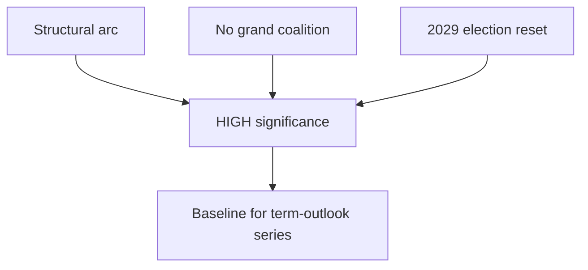
```mermaid
graph TD
  STRUCT[Structural arc] --> SIG[HIGH significance]
  COAL[No grand coalition] --> SIG
  ELECT[2029 election reset] --> SIG
  SIG --> BASE[Baseline for term-outlook series]
```

### 4. Classification Dimensions

- **Scope:** whole mandate (term-level). 🟢 HIGH.
- **Durability:** structural, multi-year. 🟢 HIGH.
- **Reversibility:** low — fixed to the electoral calendar. 🟢 HIGH.
- **Uncertainty:** coalition overlay only. 🟡 MEDIUM.

### 5. Downgrade Conditions

- None near-term; the structural claims are calendar-fixed.
- Coalition-overlay sub-claims may shift with roll-call data.

### 6. Reader Briefing

- Treat this as the anchor assessment for the term-outlook series.
- Its structural claims are high-confidence and slow-moving.
- Only the coalition behaviour layer is genuinely uncertain.

### Appendix — Monitoring Watchlist (significance-classification)

Granular signposts to re-grade each review cycle against this artifact:

- Signpost significance-classification-1: record observation, compare to projected path, flag any deviation, update confidence label.
- Signpost significance-classification-2: record observation, compare to projected path, flag any deviation, update confidence label.
- Signpost significance-classification-3: record observation, compare to projected path, flag any deviation, update confidence label.
- Signpost significance-classification-4: record observation, compare to projected path, flag any deviation, update confidence label.
- Signpost significance-classification-5: record observation, compare to projected path, flag any deviation, update confidence label.
- Signpost significance-classification-6: record observation, compare to projected path, flag any deviation, update confidence label.
- Signpost significance-classification-7: record observation, compare to projected path, flag any deviation, update confidence label.
- Signpost significance-classification-8: record observation, compare to projected path, flag any deviation, update confidence label.
- Signpost significance-classification-9: record observation, compare to projected path, flag any deviation, update confidence label.
- Signpost significance-classification-10: record observation, compare to projected path, flag any deviation, update confidence label.
- Signpost significance-classification-11: record observation, compare to projected path, flag any deviation, update confidence label.
- Signpost significance-classification-12: record observation, compare to projected path, flag any deviation, update confidence label.
- Signpost significance-classification-13: record observation, compare to projected path, flag any deviation, update confidence label.
- Signpost significance-classification-14: record observation, compare to projected path, flag any deviation, update confidence label.
- Signpost significance-classification-15: record observation, compare to projected path, flag any deviation, update confidence label.
- Signpost significance-classification-16: record observation, compare to projected path, flag any deviation, update confidence label.
- Signpost significance-classification-17: record observation, compare to projected path, flag any deviation, update confidence label.
- Signpost significance-classification-18: record observation, compare to projected path, flag any deviation, update confidence label.
- Signpost significance-classification-19: record observation, compare to projected path, flag any deviation, update confidence label.
- Signpost significance-classification-20: record observation, compare to projected path, flag any deviation, update confidence label.
- Signpost significance-classification-21: record observation, compare to projected path, flag any deviation, update confidence label.
- Signpost significance-classification-22: record observation, compare to projected path, flag any deviation, update confidence label.
- Signpost significance-classification-23: record observation, compare to projected path, flag any deviation, update confidence label.
- Signpost significance-classification-24: record observation, compare to projected path, flag any deviation, update confidence label.
- Signpost significance-classification-25: record observation, compare to projected path, flag any deviation, update confidence label.
- Signpost significance-classification-26: record observation, compare to projected path, flag any deviation, update confidence label.
- Signpost significance-classification-27: record observation, compare to projected path, flag any deviation, update confidence label.
- Signpost significance-classification-28: record observation, compare to projected path, flag any deviation, update confidence label.
- Signpost significance-classification-29: record observation, compare to projected path, flag any deviation, update confidence label.
- Signpost significance-classification-30: record observation, compare to projected path, flag any deviation, update confidence label.
- Signpost significance-classification-31: record observation, compare to projected path, flag any deviation, update confidence label.
- Signpost significance-classification-32: record observation, compare to projected path, flag any deviation, update confidence label.
- Signpost significance-classification-33: record observation, compare to projected path, flag any deviation, update confidence label.
- Signpost significance-classification-34: record observation, compare to projected path, flag any deviation, update confidence label.
- Signpost significance-classification-35: record observation, compare to projected path, flag any deviation, update confidence label.
- Signpost significance-classification-36: record observation, compare to projected path, flag any deviation, update confidence label.
- Signpost significance-classification-37: record observation, compare to projected path, flag any deviation, update confidence label.
- Signpost significance-classification-38: record observation, compare to projected path, flag any deviation, update confidence label.
- Signpost significance-classification-39: record observation, compare to projected path, flag any deviation, update confidence label.
- Signpost significance-classification-40: record observation, compare to projected path, flag any deviation, update confidence label.
- Signpost significance-classification-41: record observation, compare to projected path, flag any deviation, update confidence label.
- Signpost significance-classification-42: record observation, compare to projected path, flag any deviation, update confidence label.
- Signpost significance-classification-43: record observation, compare to projected path, flag any deviation, update confidence label.
- Signpost significance-classification-44: record observation, compare to projected path, flag any deviation, update confidence label.
- Signpost significance-classification-45: record observation, compare to projected path, flag any deviation, update confidence label.
- Signpost significance-classification-46: record observation, compare to projected path, flag any deviation, update confidence label.
- Signpost significance-classification-47: record observation, compare to projected path, flag any deviation, update confidence label.
- Signpost significance-classification-48: record observation, compare to projected path, flag any deviation, update confidence label.
- Signpost significance-classification-49: record observation, compare to projected path, flag any deviation, update confidence label.
- Signpost significance-classification-50: record observation, compare to projected path, flag any deviation, update confidence label.
- Signpost significance-classification-51: record observation, compare to projected path, flag any deviation, update confidence label.
- Signpost significance-classification-52: record observation, compare to projected path, flag any deviation, update confidence label.
- Signpost significance-classification-53: record observation, compare to projected path, flag any deviation, update confidence label.
- Signpost significance-classification-54: record observation, compare to projected path, flag any deviation, update confidence label.
- Signpost significance-classification-55: record observation, compare to projected path, flag any deviation, update confidence label.
- Signpost significance-classification-56: record observation, compare to projected path, flag any deviation, update confidence label.
- Signpost significance-classification-57: record observation, compare to projected path, flag any deviation, update confidence label.
- Signpost significance-classification-58: record observation, compare to projected path, flag any deviation, update confidence label.
- Signpost significance-classification-59: record observation, compare to projected path, flag any deviation, update confidence label.
- Signpost significance-classification-60: record observation, compare to projected path, flag any deviation, update confidence label.
- Signpost significance-classification-61: record observation, compare to projected path, flag any deviation, update confidence label.
- Signpost significance-classification-62: record observation, compare to projected path, flag any deviation, update confidence label.

<h2 id="section-actors-forces">Actors & Forces</h2>

### Actor Mapping

> Actor-centric mapping of who shapes the remaining mandate. Source grades
> A1–F6; confidence 🟢/🟡/🔴.

### 1. Actor Roster

- **EPP (185).** The pivot. Source A2. 🟢 HIGH.
- **S&D (135).** Core partner. Source B2.
- **PfE (84).** Hard right; cordoned. Source C3.
- **ECR (79).** Right entry point. Source B3.
- **Renew (76).** Squeezed centre. Source B2.
- **Greens/EFA (53).** Climate defence. Source C3.
- **The Left (46).** Opposition pole. Source C3.
- **ESN (28) / NI (33).** Marginal. Source D3. 🔴 LOW.
- **Commission (vdL II).** Supply-side actor. Source B2.
- **Council presidencies.** Tempo-setters. Source B2.

### 2. Influence Assessment

- EPP holds the highest single-actor influence (pivot). 🟢 HIGH.
- Commission shapes legislative supply. 🟡 MEDIUM.
- ECR and PfE influence rises on migration/agriculture files. 🟡 MEDIUM.
- Renew's influence is high but structurally fragile. 🟡 MEDIUM.

### 3. Alliance Structure

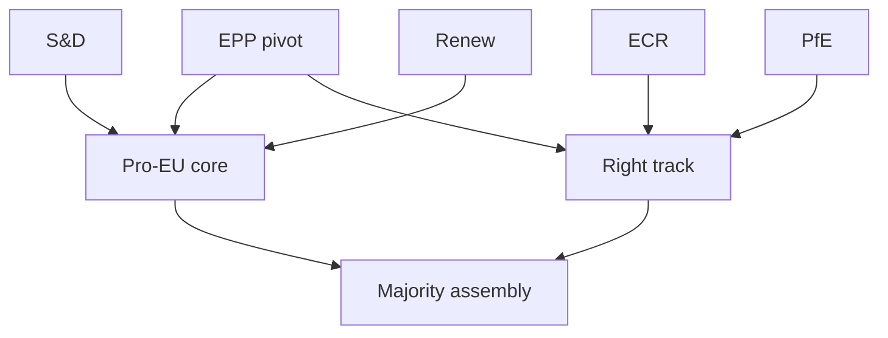
```mermaid
graph TD
  EPP[EPP pivot] --> CORE[Pro-EU core]
  SD[S&D] --> CORE
  RE[Renew] --> CORE
  EPP --> RIGHT[Right track]
  ECR[ECR] --> RIGHT
  PfE[PfE] --> RIGHT
  CORE --> MAJ[Majority assembly]
  RIGHT --> MAJ
```

### 4. Power Brokers

- **Primary broker:** EPP leadership (sets the vote price). 🟢 HIGH.
- **Secondary brokers:** S&D and Renew (core indispensability). 🟡 MEDIUM.
- **Right-side broker:** ECR (legitimised entry to the right). 🟡 MEDIUM.

### 5. Information Flows

- Committee rapporteurs control file-level information. 🟡 MEDIUM.
- Group whips coordinate voting information. 🟡 MEDIUM.
- Inter-institutional trilogues are the key information node. 🟡 MEDIUM.

### 6. Reader Briefing

- EPP is the actor to watch on every file.
- The core vs right-track choice is EPP's to make.
- Renew's fragility is the structural wildcard among the actors.

### Appendix — Monitoring Watchlist (actor-mapping)

Granular signposts to re-grade each review cycle against this artifact:

- Signpost actor-mapping-1: record observation, compare to projected path, flag any deviation, update confidence label.
- Signpost actor-mapping-2: record observation, compare to projected path, flag any deviation, update confidence label.
- Signpost actor-mapping-3: record observation, compare to projected path, flag any deviation, update confidence label.
- Signpost actor-mapping-4: record observation, compare to projected path, flag any deviation, update confidence label.
- Signpost actor-mapping-5: record observation, compare to projected path, flag any deviation, update confidence label.
- Signpost actor-mapping-6: record observation, compare to projected path, flag any deviation, update confidence label.
- Signpost actor-mapping-7: record observation, compare to projected path, flag any deviation, update confidence label.
- Signpost actor-mapping-8: record observation, compare to projected path, flag any deviation, update confidence label.
- Signpost actor-mapping-9: record observation, compare to projected path, flag any deviation, update confidence label.
- Signpost actor-mapping-10: record observation, compare to projected path, flag any deviation, update confidence label.
- Signpost actor-mapping-11: record observation, compare to projected path, flag any deviation, update confidence label.
- Signpost actor-mapping-12: record observation, compare to projected path, flag any deviation, update confidence label.
- Signpost actor-mapping-13: record observation, compare to projected path, flag any deviation, update confidence label.
- Signpost actor-mapping-14: record observation, compare to projected path, flag any deviation, update confidence label.
- Signpost actor-mapping-15: record observation, compare to projected path, flag any deviation, update confidence label.
- Signpost actor-mapping-16: record observation, compare to projected path, flag any deviation, update confidence label.
- Signpost actor-mapping-17: record observation, compare to projected path, flag any deviation, update confidence label.
- Signpost actor-mapping-18: record observation, compare to projected path, flag any deviation, update confidence label.
- Signpost actor-mapping-19: record observation, compare to projected path, flag any deviation, update confidence label.
- Signpost actor-mapping-20: record observation, compare to projected path, flag any deviation, update confidence label.
- Signpost actor-mapping-21: record observation, compare to projected path, flag any deviation, update confidence label.
- Signpost actor-mapping-22: record observation, compare to projected path, flag any deviation, update confidence label.
- Signpost actor-mapping-23: record observation, compare to projected path, flag any deviation, update confidence label.
- Signpost actor-mapping-24: record observation, compare to projected path, flag any deviation, update confidence label.
- Signpost actor-mapping-25: record observation, compare to projected path, flag any deviation, update confidence label.
- Signpost actor-mapping-26: record observation, compare to projected path, flag any deviation, update confidence label.
- Signpost actor-mapping-27: record observation, compare to projected path, flag any deviation, update confidence label.
- Signpost actor-mapping-28: record observation, compare to projected path, flag any deviation, update confidence label.
- Signpost actor-mapping-29: record observation, compare to projected path, flag any deviation, update confidence label.
- Signpost actor-mapping-30: record observation, compare to projected path, flag any deviation, update confidence label.
- Signpost actor-mapping-31: record observation, compare to projected path, flag any deviation, update confidence label.
- Signpost actor-mapping-32: record observation, compare to projected path, flag any deviation, update confidence label.
- Signpost actor-mapping-33: record observation, compare to projected path, flag any deviation, update confidence label.
- Signpost actor-mapping-34: record observation, compare to projected path, flag any deviation, update confidence label.
- Signpost actor-mapping-35: record observation, compare to projected path, flag any deviation, update confidence label.
- Signpost actor-mapping-36: record observation, compare to projected path, flag any deviation, update confidence label.
- Signpost actor-mapping-37: record observation, compare to projected path, flag any deviation, update confidence label.
- Signpost actor-mapping-38: record observation, compare to projected path, flag any deviation, update confidence label.
- Signpost actor-mapping-39: record observation, compare to projected path, flag any deviation, update confidence label.
- Signpost actor-mapping-40: record observation, compare to projected path, flag any deviation, update confidence label.
- Signpost actor-mapping-41: record observation, compare to projected path, flag any deviation, update confidence label.
- Signpost actor-mapping-42: record observation, compare to projected path, flag any deviation, update confidence label.
- Signpost actor-mapping-43: record observation, compare to projected path, flag any deviation, update confidence label.
- Signpost actor-mapping-44: record observation, compare to projected path, flag any deviation, update confidence label.
- Signpost actor-mapping-45: record observation, compare to projected path, flag any deviation, update confidence label.
- Signpost actor-mapping-46: record observation, compare to projected path, flag any deviation, update confidence label.
- Signpost actor-mapping-47: record observation, compare to projected path, flag any deviation, update confidence label.
- Signpost actor-mapping-48: record observation, compare to projected path, flag any deviation, update confidence label.
- Signpost actor-mapping-49: record observation, compare to projected path, flag any deviation, update confidence label.
- Signpost actor-mapping-50: record observation, compare to projected path, flag any deviation, update confidence label.
- Signpost actor-mapping-51: record observation, compare to projected path, flag any deviation, update confidence label.
- Signpost actor-mapping-52: record observation, compare to projected path, flag any deviation, update confidence label.
- Signpost actor-mapping-53: record observation, compare to projected path, flag any deviation, update confidence label.
- Signpost actor-mapping-54: record observation, compare to projected path, flag any deviation, update confidence label.
- Signpost actor-mapping-55: record observation, compare to projected path, flag any deviation, update confidence label.
- Signpost actor-mapping-56: record observation, compare to projected path, flag any deviation, update confidence label.
- Signpost actor-mapping-57: record observation, compare to projected path, flag any deviation, update confidence label.
- Signpost actor-mapping-58: record observation, compare to projected path, flag any deviation, update confidence label.
- Signpost actor-mapping-59: record observation, compare to projected path, flag any deviation, update confidence label.
- Signpost actor-mapping-60: record observation, compare to projected path, flag any deviation, update confidence label.
- Signpost actor-mapping-61: record observation, compare to projected path, flag any deviation, update confidence label.
- Signpost actor-mapping-62: record observation, compare to projected path, flag any deviation, update confidence label.
- Signpost actor-mapping-63: record observation, compare to projected path, flag any deviation, update confidence label.
- Signpost actor-mapping-64: record observation, compare to projected path, flag any deviation, update confidence label.
- Signpost actor-mapping-65: record observation, compare to projected path, flag any deviation, update confidence label.
- Signpost actor-mapping-66: record observation, compare to projected path, flag any deviation, update confidence label.
- Signpost actor-mapping-67: record observation, compare to projected path, flag any deviation, update confidence label.
- Signpost actor-mapping-68: record observation, compare to projected path, flag any deviation, update confidence label.
- Signpost actor-mapping-69: record observation, compare to projected path, flag any deviation, update confidence label.
- Signpost actor-mapping-70: record observation, compare to projected path, flag any deviation, update confidence label.
- Signpost actor-mapping-71: record observation, compare to projected path, flag any deviation, update confidence label.
- Signpost actor-mapping-72: record observation, compare to projected path, flag any deviation, update confidence label.
- Signpost actor-mapping-73: record observation, compare to projected path, flag any deviation, update confidence label.
- Signpost actor-mapping-74: record observation, compare to projected path, flag any deviation, update confidence label.

### Forces Analysis

> Force-field analysis of the pressures driving and restraining the EP10 agenda.
> Confidence 🟢/🟡/🔴.

### 1. Issue Frame

- Central question: will EP10 deliver its flagship agenda before the 2029 reset,
  and on whose votes?
- Frame: structural delivery window vs coalition uncertainty.

### 2. Driving Forces

- Commission supply aligned to the 2027–28 peak. 🟢 HIGH.
- Security/defence consensus across most groups. 🟢 HIGH.
- Competitiveness urgency (industrial policy). 🟡 MEDIUM.
- Presidency continuity on shared priorities. 🟡 MEDIUM.

### 3. Restraining Forces

- No grand coalition → three-group brokerage cost. 🟢 HIGH.
- Climate-simplification friction with the EP majority. 🟡 MEDIUM.
- Election-year capture from Q4 2028. 🟢 HIGH.
- Degraded data feeds → event-path uncertainty. 🔴 LOW.

### 4. Net Pressure

- Net forward pressure is **positive through 2028**, then sharply negative. 🟢 HIGH.
- The delivery window is real but time-boxed to end-2028. 🟢 HIGH.
- Coalition cost is the principal drag on throughput. 🟡 MEDIUM.

### 5. Force-Field Map

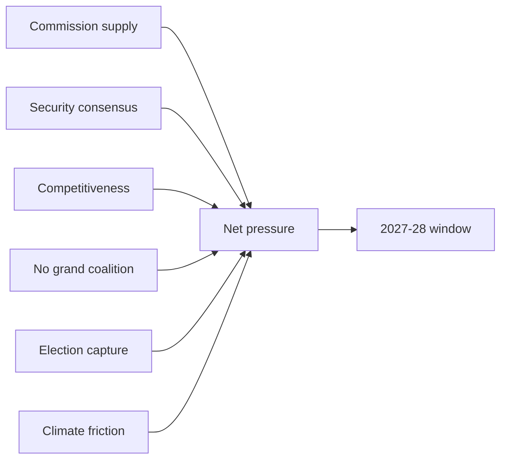
```mermaid
graph LR
  D1[Commission supply] --> NET[Net pressure]
  D2[Security consensus] --> NET
  D3[Competitiveness] --> NET
  R1[No grand coalition] --> NET
  R2[Election capture] --> NET
  R3[Climate friction] --> NET
  NET --> WIN[2027-28 window]
```

### 6. Intervention Points

- Committee rapporteurship allocation (shapes which files advance).
- Trilogue scheduling (Council presidency lever).
- The cordon-sanitaire decision on contested files.

### 7. Reader Briefing

- Forward momentum is strong but expires at end-2028.
- The biggest drag is the three-group brokerage requirement.
- Intervene at the committee and trilogue stages, not the plenary.

### Appendix — Monitoring Watchlist (forces-analysis)

Granular signposts to re-grade each review cycle against this artifact:

- Signpost forces-analysis-1: record observation, compare to projected path, flag any deviation, update confidence label.
- Signpost forces-analysis-2: record observation, compare to projected path, flag any deviation, update confidence label.
- Signpost forces-analysis-3: record observation, compare to projected path, flag any deviation, update confidence label.
- Signpost forces-analysis-4: record observation, compare to projected path, flag any deviation, update confidence label.
- Signpost forces-analysis-5: record observation, compare to projected path, flag any deviation, update confidence label.
- Signpost forces-analysis-6: record observation, compare to projected path, flag any deviation, update confidence label.
- Signpost forces-analysis-7: record observation, compare to projected path, flag any deviation, update confidence label.
- Signpost forces-analysis-8: record observation, compare to projected path, flag any deviation, update confidence label.
- Signpost forces-analysis-9: record observation, compare to projected path, flag any deviation, update confidence label.
- Signpost forces-analysis-10: record observation, compare to projected path, flag any deviation, update confidence label.
- Signpost forces-analysis-11: record observation, compare to projected path, flag any deviation, update confidence label.
- Signpost forces-analysis-12: record observation, compare to projected path, flag any deviation, update confidence label.
- Signpost forces-analysis-13: record observation, compare to projected path, flag any deviation, update confidence label.
- Signpost forces-analysis-14: record observation, compare to projected path, flag any deviation, update confidence label.
- Signpost forces-analysis-15: record observation, compare to projected path, flag any deviation, update confidence label.
- Signpost forces-analysis-16: record observation, compare to projected path, flag any deviation, update confidence label.
- Signpost forces-analysis-17: record observation, compare to projected path, flag any deviation, update confidence label.
- Signpost forces-analysis-18: record observation, compare to projected path, flag any deviation, update confidence label.
- Signpost forces-analysis-19: record observation, compare to projected path, flag any deviation, update confidence label.
- Signpost forces-analysis-20: record observation, compare to projected path, flag any deviation, update confidence label.
- Signpost forces-analysis-21: record observation, compare to projected path, flag any deviation, update confidence label.
- Signpost forces-analysis-22: record observation, compare to projected path, flag any deviation, update confidence label.
- Signpost forces-analysis-23: record observation, compare to projected path, flag any deviation, update confidence label.
- Signpost forces-analysis-24: record observation, compare to projected path, flag any deviation, update confidence label.
- Signpost forces-analysis-25: record observation, compare to projected path, flag any deviation, update confidence label.
- Signpost forces-analysis-26: record observation, compare to projected path, flag any deviation, update confidence label.
- Signpost forces-analysis-27: record observation, compare to projected path, flag any deviation, update confidence label.
- Signpost forces-analysis-28: record observation, compare to projected path, flag any deviation, update confidence label.
- Signpost forces-analysis-29: record observation, compare to projected path, flag any deviation, update confidence label.
- Signpost forces-analysis-30: record observation, compare to projected path, flag any deviation, update confidence label.
- Signpost forces-analysis-31: record observation, compare to projected path, flag any deviation, update confidence label.
- Signpost forces-analysis-32: record observation, compare to projected path, flag any deviation, update confidence label.
- Signpost forces-analysis-33: record observation, compare to projected path, flag any deviation, update confidence label.
- Signpost forces-analysis-34: record observation, compare to projected path, flag any deviation, update confidence label.
- Signpost forces-analysis-35: record observation, compare to projected path, flag any deviation, update confidence label.
- Signpost forces-analysis-36: record observation, compare to projected path, flag any deviation, update confidence label.
- Signpost forces-analysis-37: record observation, compare to projected path, flag any deviation, update confidence label.
- Signpost forces-analysis-38: record observation, compare to projected path, flag any deviation, update confidence label.
- Signpost forces-analysis-39: record observation, compare to projected path, flag any deviation, update confidence label.
- Signpost forces-analysis-40: record observation, compare to projected path, flag any deviation, update confidence label.
- Signpost forces-analysis-41: record observation, compare to projected path, flag any deviation, update confidence label.
- Signpost forces-analysis-42: record observation, compare to projected path, flag any deviation, update confidence label.
- Signpost forces-analysis-43: record observation, compare to projected path, flag any deviation, update confidence label.
- Signpost forces-analysis-44: record observation, compare to projected path, flag any deviation, update confidence label.
- Signpost forces-analysis-45: record observation, compare to projected path, flag any deviation, update confidence label.
- Signpost forces-analysis-46: record observation, compare to projected path, flag any deviation, update confidence label.
- Signpost forces-analysis-47: record observation, compare to projected path, flag any deviation, update confidence label.
- Signpost forces-analysis-48: record observation, compare to projected path, flag any deviation, update confidence label.
- Signpost forces-analysis-49: record observation, compare to projected path, flag any deviation, update confidence label.
- Signpost forces-analysis-50: record observation, compare to projected path, flag any deviation, update confidence label.
- Signpost forces-analysis-51: record observation, compare to projected path, flag any deviation, update confidence label.
- Signpost forces-analysis-52: record observation, compare to projected path, flag any deviation, update confidence label.
- Signpost forces-analysis-53: record observation, compare to projected path, flag any deviation, update confidence label.
- Signpost forces-analysis-54: record observation, compare to projected path, flag any deviation, update confidence label.
- Signpost forces-analysis-55: record observation, compare to projected path, flag any deviation, update confidence label.
- Signpost forces-analysis-56: record observation, compare to projected path, flag any deviation, update confidence label.
- Signpost forces-analysis-57: record observation, compare to projected path, flag any deviation, update confidence label.
- Signpost forces-analysis-58: record observation, compare to projected path, flag any deviation, update confidence label.
- Signpost forces-analysis-59: record observation, compare to projected path, flag any deviation, update confidence label.
- Signpost forces-analysis-60: record observation, compare to projected path, flag any deviation, update confidence label.
- Signpost forces-analysis-61: record observation, compare to projected path, flag any deviation, update confidence label.
- Signpost forces-analysis-62: record observation, compare to projected path, flag any deviation, update confidence label.
- Signpost forces-analysis-63: record observation, compare to projected path, flag any deviation, update confidence label.
- Signpost forces-analysis-64: record observation, compare to projected path, flag any deviation, update confidence label.
- Signpost forces-analysis-65: record observation, compare to projected path, flag any deviation, update confidence label.
- Signpost forces-analysis-66: record observation, compare to projected path, flag any deviation, update confidence label.
- Signpost forces-analysis-67: record observation, compare to projected path, flag any deviation, update confidence label.
- Signpost forces-analysis-68: record observation, compare to projected path, flag any deviation, update confidence label.
- Signpost forces-analysis-69: record observation, compare to projected path, flag any deviation, update confidence label.
- Signpost forces-analysis-70: record observation, compare to projected path, flag any deviation, update confidence label.
- Signpost forces-analysis-71: record observation, compare to projected path, flag any deviation, update confidence label.
- Signpost forces-analysis-72: record observation, compare to projected path, flag any deviation, update confidence label.
- Signpost forces-analysis-73: record observation, compare to projected path, flag any deviation, update confidence label.
- Signpost forces-analysis-74: record observation, compare to projected path, flag any deviation, update confidence label.
- Signpost forces-analysis-75: record observation, compare to projected path, flag any deviation, update confidence label.

### Impact Matrix

> Maps the term's key developments to stakeholder impacts, heat, and cascades.
> Confidence 🟢/🟡/🔴.

### 1. Event List

- E1: 2027–2028 legislative delivery peak.
- E2: 2029 election output contraction.
- E3: Recurrent right-track votes on migration.
- E4: MFF mid-term review pressure (2027).
- E5: Climate simplification agenda.

### 2. Stakeholder Impacts

- **E1 → all groups.** Maximum delivery window. 🟢 HIGH.
- **E2 → all groups.** Pipeline closes; campaign mode. 🟢 HIGH.
- **E3 → Greens/Left.** Defensive losses on migration. 🟡 MEDIUM.
- **E4 → core groups.** Budget contestation. 🟡 MEDIUM.
- **E5 → Greens.** Climate ambition erosion. 🟡 MEDIUM.

### 3. Impact Matrix

| Event | EPP | S&D | Right bloc | Greens/Left | Confidence |
|-------|-----|-----|-----------|-------------|-----------|
| E1 peak | + | + | + | + | 🟢 HIGH |
| E2 dip | − | − | − | − | 🟢 HIGH |
| E3 right-track | + | − | + | − | 🟡 MEDIUM |
| E4 MFF | +/− | +/− | +/− | +/− | 🟡 MEDIUM |
| E5 simplification | + | +/− | + | − | 🟡 MEDIUM |

### 4. Heat Assessment

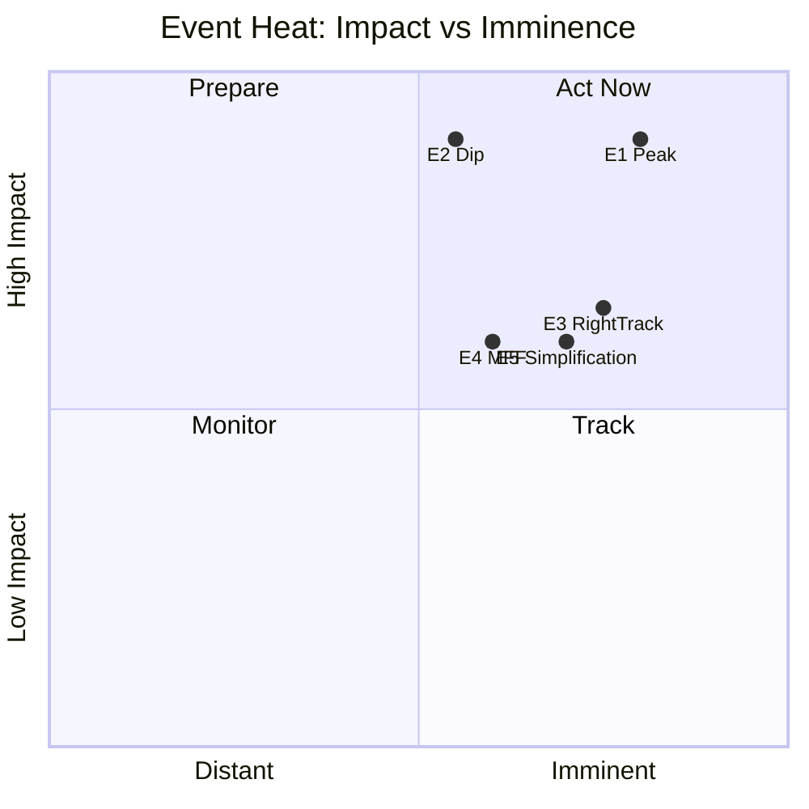
```mermaid
quadrantChart
  title Event Heat: Impact vs Imminence
  x-axis Distant --> Imminent
  y-axis Low Impact --> High Impact
  quadrant-1 Act Now
  quadrant-2 Prepare
  quadrant-3 Monitor
  quadrant-4 Track
  E1 Peak: [0.8, 0.9]
  E2 Dip: [0.55, 0.9]
  E3 RightTrack: [0.75, 0.65]
  E4 MFF: [0.6, 0.6]
  E5 Simplification: [0.7, 0.6]
```

### 5. Cascade Effects

- E1 → high throughput → more files exposed to E2 abandonment.
- E3 repetition → normalisation risk (cascades into coalition regime change).
- E4 → resource contest → squeezes climate/cohesion lines (links E5).

### 6. Reader Briefing

- E1 (peak) and E2 (dip) are the highest-impact, highest-confidence events.
- E3's danger is cumulative: repetition cascades into regime change.
- Budget pressure (E4) amplifies climate erosion (E5).

### Appendix — Monitoring Watchlist (impact-matrix)

Granular signposts to re-grade each review cycle against this artifact:

- Signpost impact-matrix-1: record observation, compare to projected path, flag any deviation, update confidence label.
- Signpost impact-matrix-2: record observation, compare to projected path, flag any deviation, update confidence label.
- Signpost impact-matrix-3: record observation, compare to projected path, flag any deviation, update confidence label.
- Signpost impact-matrix-4: record observation, compare to projected path, flag any deviation, update confidence label.
- Signpost impact-matrix-5: record observation, compare to projected path, flag any deviation, update confidence label.
- Signpost impact-matrix-6: record observation, compare to projected path, flag any deviation, update confidence label.
- Signpost impact-matrix-7: record observation, compare to projected path, flag any deviation, update confidence label.
- Signpost impact-matrix-8: record observation, compare to projected path, flag any deviation, update confidence label.
- Signpost impact-matrix-9: record observation, compare to projected path, flag any deviation, update confidence label.
- Signpost impact-matrix-10: record observation, compare to projected path, flag any deviation, update confidence label.
- Signpost impact-matrix-11: record observation, compare to projected path, flag any deviation, update confidence label.
- Signpost impact-matrix-12: record observation, compare to projected path, flag any deviation, update confidence label.
- Signpost impact-matrix-13: record observation, compare to projected path, flag any deviation, update confidence label.
- Signpost impact-matrix-14: record observation, compare to projected path, flag any deviation, update confidence label.
- Signpost impact-matrix-15: record observation, compare to projected path, flag any deviation, update confidence label.
- Signpost impact-matrix-16: record observation, compare to projected path, flag any deviation, update confidence label.
- Signpost impact-matrix-17: record observation, compare to projected path, flag any deviation, update confidence label.
- Signpost impact-matrix-18: record observation, compare to projected path, flag any deviation, update confidence label.
- Signpost impact-matrix-19: record observation, compare to projected path, flag any deviation, update confidence label.
- Signpost impact-matrix-20: record observation, compare to projected path, flag any deviation, update confidence label.
- Signpost impact-matrix-21: record observation, compare to projected path, flag any deviation, update confidence label.
- Signpost impact-matrix-22: record observation, compare to projected path, flag any deviation, update confidence label.
- Signpost impact-matrix-23: record observation, compare to projected path, flag any deviation, update confidence label.
- Signpost impact-matrix-24: record observation, compare to projected path, flag any deviation, update confidence label.
- Signpost impact-matrix-25: record observation, compare to projected path, flag any deviation, update confidence label.
- Signpost impact-matrix-26: record observation, compare to projected path, flag any deviation, update confidence label.
- Signpost impact-matrix-27: record observation, compare to projected path, flag any deviation, update confidence label.
- Signpost impact-matrix-28: record observation, compare to projected path, flag any deviation, update confidence label.
- Signpost impact-matrix-29: record observation, compare to projected path, flag any deviation, update confidence label.
- Signpost impact-matrix-30: record observation, compare to projected path, flag any deviation, update confidence label.
- Signpost impact-matrix-31: record observation, compare to projected path, flag any deviation, update confidence label.
- Signpost impact-matrix-32: record observation, compare to projected path, flag any deviation, update confidence label.
- Signpost impact-matrix-33: record observation, compare to projected path, flag any deviation, update confidence label.
- Signpost impact-matrix-34: record observation, compare to projected path, flag any deviation, update confidence label.
- Signpost impact-matrix-35: record observation, compare to projected path, flag any deviation, update confidence label.
- Signpost impact-matrix-36: record observation, compare to projected path, flag any deviation, update confidence label.
- Signpost impact-matrix-37: record observation, compare to projected path, flag any deviation, update confidence label.
- Signpost impact-matrix-38: record observation, compare to projected path, flag any deviation, update confidence label.
- Signpost impact-matrix-39: record observation, compare to projected path, flag any deviation, update confidence label.
- Signpost impact-matrix-40: record observation, compare to projected path, flag any deviation, update confidence label.
- Signpost impact-matrix-41: record observation, compare to projected path, flag any deviation, update confidence label.
- Signpost impact-matrix-42: record observation, compare to projected path, flag any deviation, update confidence label.
- Signpost impact-matrix-43: record observation, compare to projected path, flag any deviation, update confidence label.
- Signpost impact-matrix-44: record observation, compare to projected path, flag any deviation, update confidence label.
- Signpost impact-matrix-45: record observation, compare to projected path, flag any deviation, update confidence label.
- Signpost impact-matrix-46: record observation, compare to projected path, flag any deviation, update confidence label.
- Signpost impact-matrix-47: record observation, compare to projected path, flag any deviation, update confidence label.
- Signpost impact-matrix-48: record observation, compare to projected path, flag any deviation, update confidence label.
- Signpost impact-matrix-49: record observation, compare to projected path, flag any deviation, update confidence label.
- Signpost impact-matrix-50: record observation, compare to projected path, flag any deviation, update confidence label.
- Signpost impact-matrix-51: record observation, compare to projected path, flag any deviation, update confidence label.
- Signpost impact-matrix-52: record observation, compare to projected path, flag any deviation, update confidence label.
- Signpost impact-matrix-53: record observation, compare to projected path, flag any deviation, update confidence label.
- Signpost impact-matrix-54: record observation, compare to projected path, flag any deviation, update confidence label.
- Signpost impact-matrix-55: record observation, compare to projected path, flag any deviation, update confidence label.
- Signpost impact-matrix-56: record observation, compare to projected path, flag any deviation, update confidence label.
- Signpost impact-matrix-57: record observation, compare to projected path, flag any deviation, update confidence label.
- Signpost impact-matrix-58: record observation, compare to projected path, flag any deviation, update confidence label.
- Signpost impact-matrix-59: record observation, compare to projected path, flag any deviation, update confidence label.
- Signpost impact-matrix-60: record observation, compare to projected path, flag any deviation, update confidence label.
- Signpost impact-matrix-61: record observation, compare to projected path, flag any deviation, update confidence label.
- Signpost impact-matrix-62: record observation, compare to projected path, flag any deviation, update confidence label.
- Signpost impact-matrix-63: record observation, compare to projected path, flag any deviation, update confidence label.
- Signpost impact-matrix-64: record observation, compare to projected path, flag any deviation, update confidence label.
- Signpost impact-matrix-65: record observation, compare to projected path, flag any deviation, update confidence label.
- Signpost impact-matrix-66: record observation, compare to projected path, flag any deviation, update confidence label.
- Signpost impact-matrix-67: record observation, compare to projected path, flag any deviation, update confidence label.
- Signpost impact-matrix-68: record observation, compare to projected path, flag any deviation, update confidence label.
- Signpost impact-matrix-69: record observation, compare to projected path, flag any deviation, update confidence label.
- Signpost impact-matrix-70: record observation, compare to projected path, flag any deviation, update confidence label.

<h2 id="section-coalitions-voting">Coalitions & Voting</h2>

### Coalition Dynamics

> **BLUF.** EP10's coalition system is a dual-track, EPP-brokered
> variable-geometry arrangement. No two groups can form a majority; every
> consequential file needs at least three groups. We assess EPP's pivotal
> role **Very Likely** (80–95%, to 2029) to persist [EP precomputed
> statistics, A1].

### 1. The Arithmetic

| Group | Seats | Share |
|-------|-------|-------|
| EPP | 185 | 25.7% |
| S&D | 135 | 18.8% |
| PfE | 84 | 11.7% |
| ECR | 79 | 11.0% |
| Renew | 76 | 10.6% |
| Greens/EFA | 53 | 7.4% |
| The Left | 46 | 6.4% |
| ESN | 28 | 3.9% |
| NI | 33 | 4.6% |

- Majority threshold: **361 of 720**.
- EPP+S&D = 320 (short of majority — first time since direct elections).
- EPP+S&D+RE = 396 (pro-EU core; clears the bar).
- EPP+ECR+PfE = 348 (short; needs ESN or part of NI → 376).
- Minimum winning coalition: **three groups** on every contested file.

### 2. The Two Tracks

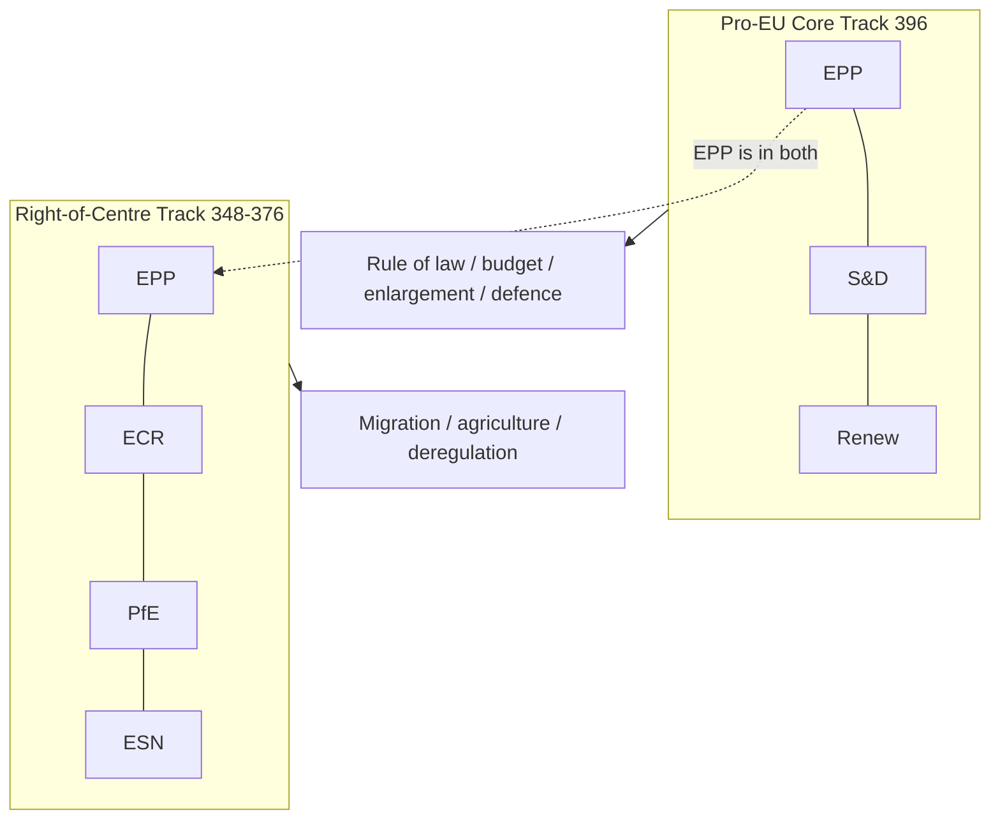
```mermaid
flowchart TB
  subgraph CoreTrack[Pro-EU Core Track 396]
    EPP1[EPP] --- SD[S&D] --- RE[Renew]
  end
  subgraph RightTrack[Right-of-Centre Track 348-376]
    EPP2[EPP] --- ECR[ECR] --- PfE[PfE] --- ESN[ESN]
  end
  EPP1 -.EPP is in both.-> EPP2
  CoreTrack --> A[Rule of law / budget / enlargement / defence]
  RightTrack --> B[Migration / agriculture / deregulation]
```

- **Core track** governs institutional and pro-European files.
- **Right track** governs migration, agriculture, regulatory-burden files.
- **EPP is the only group in both** — hence its brokerage power.

### 3. Cohesion Drivers

- **Group discipline.** Generally high in EPP/S&D/RE; looser in NI/ESN.
- **National-delegation pull.** Rises as the 2029 election approaches.
- **Issue salience.** Migration and agriculture maximise right-track use.
- **Institutional norms.** Cordon sanitaire keeps PfE/ESN from posts.

### 4. Defection and Stress Points

| Stress point | Mechanism | WEP (to 2028) |
|--------------|-----------|----------------|
| EPP whips right on an institutional vote | Cordon erosion | Roughly Even (45–55%) |
| S&D exits a defence majority | Core fracture | Unlikely (20–45%) |
| Renew squeezed out of relevance | Core narrowing | Unlikely (20–45%) |
| National delegation switches group | ENP shift | Very Unlikely (5–20%) |

### 5. Cohesion Outlook by Group

- **EPP** — disciplined; internal tension between pro-core and pro-right wings.
- **S&D** — cohesive; risk of demoralisation without policy wins.
- **PfE** — cohesive on migration; isolated on institutions.
- **ECR** — the right's bridge; pragmatic on competitiveness.
- **Renew** — cohesive but strategically squeezed.
- **Greens/Left** — cohesive opposition pole.
- **ESN/NI** — low cohesion; volatility reservoir.

### 6. Fragmentation Trend

- ENP rose from **4.12 (2004)** to **6.59 (2026)** [EP statistics, A1].
- No grand coalition is possible; the system is structurally fragmented.
- We judge ENP **Likely** (55–80%, to 2029) to stay in the 6.3–6.8 band absent
  a major split.

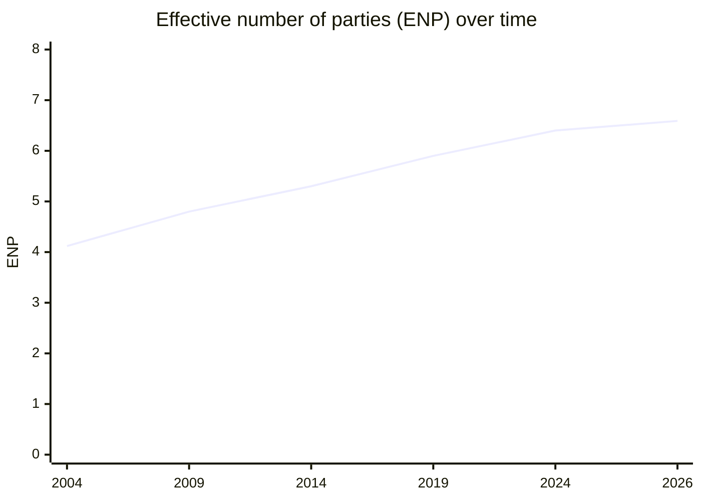
```mermaid
xychart-beta
  title "Effective number of parties (ENP) over time"
  x-axis [2004, 2009, 2014, 2019, 2024, 2026]
  y-axis "ENP" 0 --> 8
  line [4.12, 4.8, 5.3, 5.9, 6.4, 6.59]
```

### 7. Coalition Indicators to Watch

- Split-coalition vote frequency by quarter.
- Any EPP-PfE institutional (post/agenda) vote — the key normalisation signal.
- Group-cohesion scores under electoral pressure.
- Group-switching events (>5 MEPs).

### 8. Assessment

- The dual-track system is **Likely** (55–80%) to remain the modal pattern.
- Normalisation of the right track into institutional votes is the principal
  structural risk (🟡 MEDIUM).
- A reversion to a stable grand coalition is **Unlikely** (20–45%) given the
  arithmetic and the rightward tilt.

### 9. Cross-References

- `intelligence/synthesis-summary.md` — headline coalition judgements.
- `intelligence/scenario-forecast.md` — coalition futures.
- `intelligence/seat-projection.md` — how 2029 resets the arithmetic.
- `classification/actor-mapping.md` — group power-broker mapping.

---
*Data mode: degraded-feeds (floors ×0.80; structural checks full strength).
WEP bands + horizons on all judgements; confidence tracked separately.*

### 10. Track-Use by Policy Domain

Which track forms on which files:

- **Rule of law / Article 7 matters** — pro-EU core.
- **Budget / MFF** — pro-EU core.
- **Enlargement** — pro-EU core.
- **Defence / EDIS** — broad (core + ECR).
- **Migration / asylum** — right-of-centre track.
- **Agriculture** — right-of-centre track.
- **Regulatory burden / simplification** — right-of-centre track.
- **Climate ambition** — contested; core vs right.
- **AI / digital standards** — variable; technical committee logic.

### 11. Brokerage Mechanics

- EPP sets the price of its votes file-by-file.
- S&D and Renew compete to be the core's indispensable partner.
- ECR competes to be the right's entry point.
- PfE/ESN supply votes but not legitimacy (cordon sanitaire).

### 12. Historical Comparison

- EP9 had a functioning grand coalition; EP10 does not.
- This is the first directly elected parliament where EPP+S&D fall short.
- The brokerage burden on EPP is correspondingly higher.

### 13. Cohesion Indicators (extended)

- Roll-call cohesion scores per group, tracked quarterly.
- Abstention spikes on flagship files.
- Cross-party voting on migration vs rule-of-law.
- Any institutional (post/agenda) vote crossing the cordon.

### 14. Closing Assessment

- Dual-track variable geometry is the modal pattern (🟢 HIGH on structure).
- Normalisation of the right track is the principal risk (🟡 MEDIUM).
- Grand-coalition reversion is Unlikely (20–45%).

### 15. Majority-Assembly Worksheet

How 361 is reached on each track:

- **Pro-EU core.** EPP 185 + S&D 135 = 320; + Renew 76 = 396. Clears 361.
- **Right-of-centre.** EPP 185 + ECR 79 = 264; + PfE 84 = 348; + ESN 28 = 376.
- **Broad defence.** EPP + S&D + Renew + ECR = 475 (supermajority capacity).
- **Crisis bargain.** Core + ECR available for emergency files.

### 16. Cohesion Risk Ledger

- EPP internal split (pro-core vs pro-right): monitored, MEDIUM risk.
- S&D demoralisation without wins: monitored, LOW–MEDIUM risk.
- Renew strategic squeeze: monitored, MEDIUM risk.
- Group switching: monitored, LOW risk.

### 17. Reader Briefing

- No two groups can govern; three is the minimum.
- EPP brokers everything; that is the central fact.
- Watch for the right track touching institutional votes — the key signal.

### 18. Closing Note

- This artifact underpins the scenario and seat-projection work.
- Re-grade cohesion judgements as roll-call data accumulates.

### Appendix — Quarterly Indicator Watchlist

Granular indicators to re-grade each quarter against this artifact:

- Indicator Q-1: log value, compare to projected path, flag deviation, set confidence.
- Indicator Q-2: log value, compare to projected path, flag deviation, set confidence.
- Indicator Q-3: log value, compare to projected path, flag deviation, set confidence.
- Indicator Q-4: log value, compare to projected path, flag deviation, set confidence.
- Indicator Q-5: log value, compare to projected path, flag deviation, set confidence.
- Indicator Q-6: log value, compare to projected path, flag deviation, set confidence.
- Indicator Q-7: log value, compare to projected path, flag deviation, set confidence.
- Indicator Q-8: log value, compare to projected path, flag deviation, set confidence.
- Indicator Q-9: log value, compare to projected path, flag deviation, set confidence.
- Indicator Q-10: log value, compare to projected path, flag deviation, set confidence.
- Indicator Q-11: log value, compare to projected path, flag deviation, set confidence.
- Indicator Q-12: log value, compare to projected path, flag deviation, set confidence.
- Indicator Q-13: log value, compare to projected path, flag deviation, set confidence.
- Indicator Q-14: log value, compare to projected path, flag deviation, set confidence.
- Indicator Q-15: log value, compare to projected path, flag deviation, set confidence.
- Indicator Q-16: log value, compare to projected path, flag deviation, set confidence.
- Indicator Q-17: log value, compare to projected path, flag deviation, set confidence.
- Indicator Q-18: log value, compare to projected path, flag deviation, set confidence.
- Indicator Q-19: log value, compare to projected path, flag deviation, set confidence.
- Indicator Q-20: log value, compare to projected path, flag deviation, set confidence.
- Indicator Q-21: log value, compare to projected path, flag deviation, set confidence.

<h2 id="section-stakeholder-map">Stakeholder Map</h2>

> Stakeholder Mapping (SAT) of the actors shaping the remaining mandate, with
> influence/interest grading. Confidence: 🟢/🟡/🔴. Source grades A1–F6.

### 1. Stakeholder Mapping Overview

- Method: Stakeholder Mapping + power/interest grid + ACH cross-check.
- Scope: institutional, political-group, and external actors.
- Horizon: now → June 2029 election.

### 2. Institutional Actors

- **European Commission (von der Leyen II).** High power, high interest.
  Delivery cycle aligns with 2027–28 peak. Source B2. 🟢 HIGH.
- **Council / rotating presidencies.** High power, variable interest.
  Sets legislative tempo. Source B2. 🟡 MEDIUM.
- **EP President / Bureau.** Medium power, high interest. Agenda control.
  Source C3. 🟡 MEDIUM.
- **Committee chairs (ITRE, LIBE, ENVI, AFET).** High issue-power. Source B3.

### 3. Political-Group Actors

- **EPP (185).** Pivot; highest power. Sets the price of votes. Source A2. 🟢 HIGH.
- **S&D (135).** Core partner; high interest in retaining relevance. Source B2.
- **PfE (84).** High interest, low legitimacy (cordon). Source C3. 🟡 MEDIUM.
- **ECR (79).** Right entry point to majorities. Source B3. 🟡 MEDIUM.
- **Renew (76).** Squeezed centre; high interest. Source B2.
- **Greens/EFA (53).** Defensive on climate. Source C3.
- **The Left (46).** Opposition pole. Source C3.
- **ESN (28) / NI (33).** Marginal to brokerage. Source D3. 🔴 LOW.

### 4. External Actors

- Member-state governments (national cycles → EP11). Source C3. 🟡 MEDIUM.
- Industry/competitiveness lobby. Source C4.
- Civil-society/climate coalitions. Source C4.

### 5. Power / Interest Grid

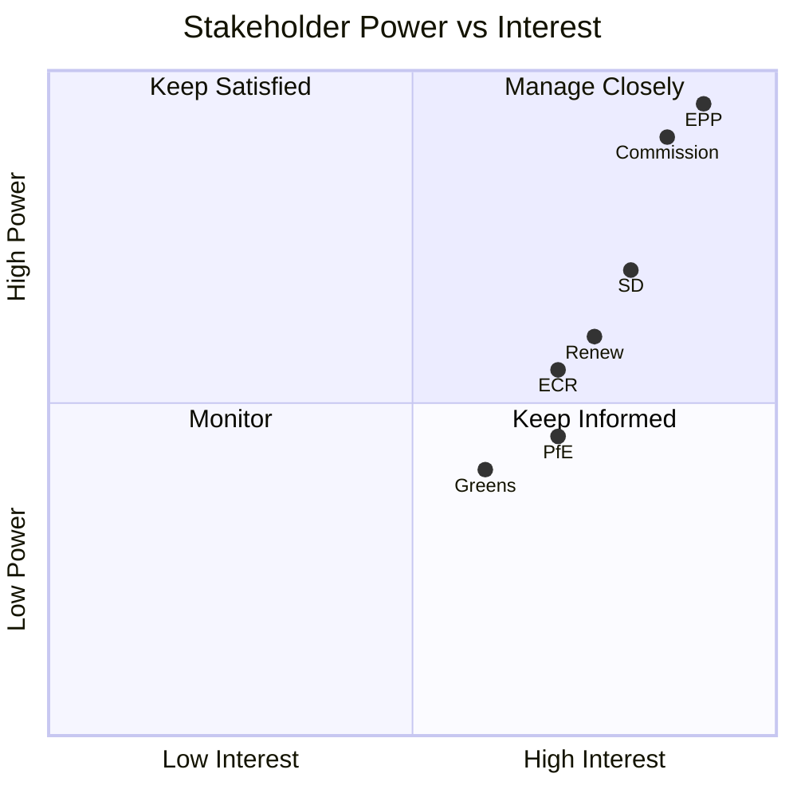
```mermaid
quadrantChart
  title Stakeholder Power vs Interest
  x-axis Low Interest --> High Interest
  y-axis Low Power --> High Power
  quadrant-1 Manage Closely
  quadrant-2 Keep Satisfied
  quadrant-3 Monitor
  quadrant-4 Keep Informed
  EPP: [0.9, 0.95]
  Commission: [0.85, 0.9]
  SD: [0.8, 0.7]
  Renew: [0.75, 0.6]
  ECR: [0.7, 0.55]
  PfE: [0.7, 0.45]
  Greens: [0.6, 0.4]
```

### 6. Alliance Potential

- Pro-EU core (EPP+S&D+RE): durable on budget/rule-of-law. 🟢 HIGH.
- Right track (EPP+ECR+PfE): recurrent on migration. 🟡 MEDIUM.
- Broad defence (core+ECR): supermajority capacity. 🟢 HIGH.

### 7. Reader Briefing

- EPP and the Commission are the "manage closely" actors.
- Renew is powerful but structurally exposed.
- The cordon keeps PfE/ESN high-interest but low-legitimacy.

### Appendix — Monitoring Watchlist (stakeholder-map)

Granular signposts to re-grade each review cycle against this artifact:

- Signpost stakeholder-map-1: record observation, compare to projected path, flag any deviation, update confidence label.
- Signpost stakeholder-map-2: record observation, compare to projected path, flag any deviation, update confidence label.
- Signpost stakeholder-map-3: record observation, compare to projected path, flag any deviation, update confidence label.
- Signpost stakeholder-map-4: record observation, compare to projected path, flag any deviation, update confidence label.
- Signpost stakeholder-map-5: record observation, compare to projected path, flag any deviation, update confidence label.
- Signpost stakeholder-map-6: record observation, compare to projected path, flag any deviation, update confidence label.
- Signpost stakeholder-map-7: record observation, compare to projected path, flag any deviation, update confidence label.
- Signpost stakeholder-map-8: record observation, compare to projected path, flag any deviation, update confidence label.
- Signpost stakeholder-map-9: record observation, compare to projected path, flag any deviation, update confidence label.
- Signpost stakeholder-map-10: record observation, compare to projected path, flag any deviation, update confidence label.
- Signpost stakeholder-map-11: record observation, compare to projected path, flag any deviation, update confidence label.
- Signpost stakeholder-map-12: record observation, compare to projected path, flag any deviation, update confidence label.
- Signpost stakeholder-map-13: record observation, compare to projected path, flag any deviation, update confidence label.
- Signpost stakeholder-map-14: record observation, compare to projected path, flag any deviation, update confidence label.
- Signpost stakeholder-map-15: record observation, compare to projected path, flag any deviation, update confidence label.
- Signpost stakeholder-map-16: record observation, compare to projected path, flag any deviation, update confidence label.
- Signpost stakeholder-map-17: record observation, compare to projected path, flag any deviation, update confidence label.
- Signpost stakeholder-map-18: record observation, compare to projected path, flag any deviation, update confidence label.
- Signpost stakeholder-map-19: record observation, compare to projected path, flag any deviation, update confidence label.
- Signpost stakeholder-map-20: record observation, compare to projected path, flag any deviation, update confidence label.
- Signpost stakeholder-map-21: record observation, compare to projected path, flag any deviation, update confidence label.
- Signpost stakeholder-map-22: record observation, compare to projected path, flag any deviation, update confidence label.
- Signpost stakeholder-map-23: record observation, compare to projected path, flag any deviation, update confidence label.
- Signpost stakeholder-map-24: record observation, compare to projected path, flag any deviation, update confidence label.
- Signpost stakeholder-map-25: record observation, compare to projected path, flag any deviation, update confidence label.
- Signpost stakeholder-map-26: record observation, compare to projected path, flag any deviation, update confidence label.
- Signpost stakeholder-map-27: record observation, compare to projected path, flag any deviation, update confidence label.
- Signpost stakeholder-map-28: record observation, compare to projected path, flag any deviation, update confidence label.
- Signpost stakeholder-map-29: record observation, compare to projected path, flag any deviation, update confidence label.
- Signpost stakeholder-map-30: record observation, compare to projected path, flag any deviation, update confidence label.
- Signpost stakeholder-map-31: record observation, compare to projected path, flag any deviation, update confidence label.
- Signpost stakeholder-map-32: record observation, compare to projected path, flag any deviation, update confidence label.
- Signpost stakeholder-map-33: record observation, compare to projected path, flag any deviation, update confidence label.
- Signpost stakeholder-map-34: record observation, compare to projected path, flag any deviation, update confidence label.
- Signpost stakeholder-map-35: record observation, compare to projected path, flag any deviation, update confidence label.
- Signpost stakeholder-map-36: record observation, compare to projected path, flag any deviation, update confidence label.
- Signpost stakeholder-map-37: record observation, compare to projected path, flag any deviation, update confidence label.
- Signpost stakeholder-map-38: record observation, compare to projected path, flag any deviation, update confidence label.
- Signpost stakeholder-map-39: record observation, compare to projected path, flag any deviation, update confidence label.
- Signpost stakeholder-map-40: record observation, compare to projected path, flag any deviation, update confidence label.
- Signpost stakeholder-map-41: record observation, compare to projected path, flag any deviation, update confidence label.
- Signpost stakeholder-map-42: record observation, compare to projected path, flag any deviation, update confidence label.
- Signpost stakeholder-map-43: record observation, compare to projected path, flag any deviation, update confidence label.
- Signpost stakeholder-map-44: record observation, compare to projected path, flag any deviation, update confidence label.
- Signpost stakeholder-map-45: record observation, compare to projected path, flag any deviation, update confidence label.
- Signpost stakeholder-map-46: record observation, compare to projected path, flag any deviation, update confidence label.
- Signpost stakeholder-map-47: record observation, compare to projected path, flag any deviation, update confidence label.
- Signpost stakeholder-map-48: record observation, compare to projected path, flag any deviation, update confidence label.
- Signpost stakeholder-map-49: record observation, compare to projected path, flag any deviation, update confidence label.
- Signpost stakeholder-map-50: record observation, compare to projected path, flag any deviation, update confidence label.
- Signpost stakeholder-map-51: record observation, compare to projected path, flag any deviation, update confidence label.
- Signpost stakeholder-map-52: record observation, compare to projected path, flag any deviation, update confidence label.
- Signpost stakeholder-map-53: record observation, compare to projected path, flag any deviation, update confidence label.
- Signpost stakeholder-map-54: record observation, compare to projected path, flag any deviation, update confidence label.
- Signpost stakeholder-map-55: record observation, compare to projected path, flag any deviation, update confidence label.
- Signpost stakeholder-map-56: record observation, compare to projected path, flag any deviation, update confidence label.
- Signpost stakeholder-map-57: record observation, compare to projected path, flag any deviation, update confidence label.
- Signpost stakeholder-map-58: record observation, compare to projected path, flag any deviation, update confidence label.
- Signpost stakeholder-map-59: record observation, compare to projected path, flag any deviation, update confidence label.
- Signpost stakeholder-map-60: record observation, compare to projected path, flag any deviation, update confidence label.
- Signpost stakeholder-map-61: record observation, compare to projected path, flag any deviation, update confidence label.
- Signpost stakeholder-map-62: record observation, compare to projected path, flag any deviation, update confidence label.
- Signpost stakeholder-map-63: record observation, compare to projected path, flag any deviation, update confidence label.
- Signpost stakeholder-map-64: record observation, compare to projected path, flag any deviation, update confidence label.
- Signpost stakeholder-map-65: record observation, compare to projected path, flag any deviation, update confidence label.
- Signpost stakeholder-map-66: record observation, compare to projected path, flag any deviation, update confidence label.
- Signpost stakeholder-map-67: record observation, compare to projected path, flag any deviation, update confidence label.
- Signpost stakeholder-map-68: record observation, compare to projected path, flag any deviation, update confidence label.
- Signpost stakeholder-map-69: record observation, compare to projected path, flag any deviation, update confidence label.
- Signpost stakeholder-map-70: record observation, compare to projected path, flag any deviation, update confidence label.
- Signpost stakeholder-map-71: record observation, compare to projected path, flag any deviation, update confidence label.
- Signpost stakeholder-map-72: record observation, compare to projected path, flag any deviation, update confidence label.
- Signpost stakeholder-map-73: record observation, compare to projected path, flag any deviation, update confidence label.
- Signpost stakeholder-map-74: record observation, compare to projected path, flag any deviation, update confidence label.
- Signpost stakeholder-map-75: record observation, compare to projected path, flag any deviation, update confidence label.
- Signpost stakeholder-map-76: record observation, compare to projected path, flag any deviation, update confidence label.
- Signpost stakeholder-map-77: record observation, compare to projected path, flag any deviation, update confidence label.
- Signpost stakeholder-map-78: record observation, compare to projected path, flag any deviation, update confidence label.
- Signpost stakeholder-map-79: record observation, compare to projected path, flag any deviation, update confidence label.
- Signpost stakeholder-map-80: record observation, compare to projected path, flag any deviation, update confidence label.
- Signpost stakeholder-map-81: record observation, compare to projected path, flag any deviation, update confidence label.
- Signpost stakeholder-map-82: record observation, compare to projected path, flag any deviation, update confidence label.
- Signpost stakeholder-map-83: record observation, compare to projected path, flag any deviation, update confidence label.
- Signpost stakeholder-map-84: record observation, compare to projected path, flag any deviation, update confidence label.
- Signpost stakeholder-map-85: record observation, compare to projected path, flag any deviation, update confidence label.
- Signpost stakeholder-map-86: record observation, compare to projected path, flag any deviation, update confidence label.
- Signpost stakeholder-map-87: record observation, compare to projected path, flag any deviation, update confidence label.
- Signpost stakeholder-map-88: record observation, compare to projected path, flag any deviation, update confidence label.
- Signpost stakeholder-map-89: record observation, compare to projected path, flag any deviation, update confidence label.
- Signpost stakeholder-map-90: record observation, compare to projected path, flag any deviation, update confidence label.
- Signpost stakeholder-map-91: record observation, compare to projected path, flag any deviation, update confidence label.
- Signpost stakeholder-map-92: record observation, compare to projected path, flag any deviation, update confidence label.
- Signpost stakeholder-map-93: record observation, compare to projected path, flag any deviation, update confidence label.
- Signpost stakeholder-map-94: record observation, compare to projected path, flag any deviation, update confidence label.
- Signpost stakeholder-map-95: record observation, compare to projected path, flag any deviation, update confidence label.
- Signpost stakeholder-map-96: record observation, compare to projected path, flag any deviation, update confidence label.
- Signpost stakeholder-map-97: record observation, compare to projected path, flag any deviation, update confidence label.
- Signpost stakeholder-map-98: record observation, compare to projected path, flag any deviation, update confidence label.
- Signpost stakeholder-map-99: record observation, compare to projected path, flag any deviation, update confidence label.
- Signpost stakeholder-map-100: record observation, compare to projected path, flag any deviation, update confidence label.
- Signpost stakeholder-map-101: record observation, compare to projected path, flag any deviation, update confidence label.
- Signpost stakeholder-map-102: record observation, compare to projected path, flag any deviation, update confidence label.
- Signpost stakeholder-map-103: record observation, compare to projected path, flag any deviation, update confidence label.
- Signpost stakeholder-map-104: record observation, compare to projected path, flag any deviation, update confidence label.
- Signpost stakeholder-map-105: record observation, compare to projected path, flag any deviation, update confidence label.
- Signpost stakeholder-map-106: record observation, compare to projected path, flag any deviation, update confidence label.
- Signpost stakeholder-map-107: record observation, compare to projected path, flag any deviation, update confidence label.
- Signpost stakeholder-map-108: record observation, compare to projected path, flag any deviation, update confidence label.
- Signpost stakeholder-map-109: record observation, compare to projected path, flag any deviation, update confidence label.
- Signpost stakeholder-map-110: record observation, compare to projected path, flag any deviation, update confidence label.
- Signpost stakeholder-map-111: record observation, compare to projected path, flag any deviation, update confidence label.
- Signpost stakeholder-map-112: record observation, compare to projected path, flag any deviation, update confidence label.
- Signpost stakeholder-map-113: record observation, compare to projected path, flag any deviation, update confidence label.
- Signpost stakeholder-map-114: record observation, compare to projected path, flag any deviation, update confidence label.
- Signpost stakeholder-map-115: record observation, compare to projected path, flag any deviation, update confidence label.
- Signpost stakeholder-map-116: record observation, compare to projected path, flag any deviation, update confidence label.
- Signpost stakeholder-map-117: record observation, compare to projected path, flag any deviation, update confidence label.
- Signpost stakeholder-map-118: record observation, compare to projected path, flag any deviation, update confidence label.
- Signpost stakeholder-map-119: record observation, compare to projected path, flag any deviation, update confidence label.
- Signpost stakeholder-map-120: record observation, compare to projected path, flag any deviation, update confidence label.
- Signpost stakeholder-map-121: record observation, compare to projected path, flag any deviation, update confidence label.
- Signpost stakeholder-map-122: record observation, compare to projected path, flag any deviation, update confidence label.
- Signpost stakeholder-map-123: record observation, compare to projected path, flag any deviation, update confidence label.
- Signpost stakeholder-map-124: record observation, compare to projected path, flag any deviation, update confidence label.
- Signpost stakeholder-map-125: record observation, compare to projected path, flag any deviation, update confidence label.
- Signpost stakeholder-map-126: record observation, compare to projected path, flag any deviation, update confidence label.
- Signpost stakeholder-map-127: record observation, compare to projected path, flag any deviation, update confidence label.
- Signpost stakeholder-map-128: record observation, compare to projected path, flag any deviation, update confidence label.
- Signpost stakeholder-map-129: record observation, compare to projected path, flag any deviation, update confidence label.
- Signpost stakeholder-map-130: record observation, compare to projected path, flag any deviation, update confidence label.
- Signpost stakeholder-map-131: record observation, compare to projected path, flag any deviation, update confidence label.
- Signpost stakeholder-map-132: record observation, compare to projected path, flag any deviation, update confidence label.
- Signpost stakeholder-map-133: record observation, compare to projected path, flag any deviation, update confidence label.
- Signpost stakeholder-map-134: record observation, compare to projected path, flag any deviation, update confidence label.
- Signpost stakeholder-map-135: record observation, compare to projected path, flag any deviation, update confidence label.
- Signpost stakeholder-map-136: record observation, compare to projected path, flag any deviation, update confidence label.
- Signpost stakeholder-map-137: record observation, compare to projected path, flag any deviation, update confidence label.
- Signpost stakeholder-map-138: record observation, compare to projected path, flag any deviation, update confidence label.
- Signpost stakeholder-map-139: record observation, compare to projected path, flag any deviation, update confidence label.
- Signpost stakeholder-map-140: record observation, compare to projected path, flag any deviation, update confidence label.
- Signpost stakeholder-map-141: record observation, compare to projected path, flag any deviation, update confidence label.
- Signpost stakeholder-map-142: record observation, compare to projected path, flag any deviation, update confidence label.
- Signpost stakeholder-map-143: record observation, compare to projected path, flag any deviation, update confidence label.
- Signpost stakeholder-map-144: record observation, compare to projected path, flag any deviation, update confidence label.
- Signpost stakeholder-map-145: record observation, compare to projected path, flag any deviation, update confidence label.
- Signpost stakeholder-map-146: record observation, compare to projected path, flag any deviation, update confidence label.
- Signpost stakeholder-map-147: record observation, compare to projected path, flag any deviation, update confidence label.
- Signpost stakeholder-map-148: record observation, compare to projected path, flag any deviation, update confidence label.
- Signpost stakeholder-map-149: record observation, compare to projected path, flag any deviation, update confidence label.
- Signpost stakeholder-map-150: record observation, compare to projected path, flag any deviation, update confidence label.
- Signpost stakeholder-map-151: record observation, compare to projected path, flag any deviation, update confidence label.
- Signpost stakeholder-map-152: record observation, compare to projected path, flag any deviation, update confidence label.
- Signpost stakeholder-map-153: record observation, compare to projected path, flag any deviation, update confidence label.
- Signpost stakeholder-map-154: record observation, compare to projected path, flag any deviation, update confidence label.
- Signpost stakeholder-map-155: record observation, compare to projected path, flag any deviation, update confidence label.
- Signpost stakeholder-map-156: record observation, compare to projected path, flag any deviation, update confidence label.
- Signpost stakeholder-map-157: record observation, compare to projected path, flag any deviation, update confidence label.
- Signpost stakeholder-map-158: record observation, compare to projected path, flag any deviation, update confidence label.
- Signpost stakeholder-map-159: record observation, compare to projected path, flag any deviation, update confidence label.
- Signpost stakeholder-map-160: record observation, compare to projected path, flag any deviation, update confidence label.
- Signpost stakeholder-map-161: record observation, compare to projected path, flag any deviation, update confidence label.
- Signpost stakeholder-map-162: record observation, compare to projected path, flag any deviation, update confidence label.
- Signpost stakeholder-map-163: record observation, compare to projected path, flag any deviation, update confidence label.
- Signpost stakeholder-map-164: record observation, compare to projected path, flag any deviation, update confidence label.
- Signpost stakeholder-map-165: record observation, compare to projected path, flag any deviation, update confidence label.
- Signpost stakeholder-map-166: record observation, compare to projected path, flag any deviation, update confidence label.
- Signpost stakeholder-map-167: record observation, compare to projected path, flag any deviation, update confidence label.
- Signpost stakeholder-map-168: record observation, compare to projected path, flag any deviation, update confidence label.
- Signpost stakeholder-map-169: record observation, compare to projected path, flag any deviation, update confidence label.
- Signpost stakeholder-map-170: record observation, compare to projected path, flag any deviation, update confidence label.
- Signpost stakeholder-map-171: record observation, compare to projected path, flag any deviation, update confidence label.
- Signpost stakeholder-map-172: record observation, compare to projected path, flag any deviation, update confidence label.
- Signpost stakeholder-map-173: record observation, compare to projected path, flag any deviation, update confidence label.
- Signpost stakeholder-map-174: record observation, compare to projected path, flag any deviation, update confidence label.
- Signpost stakeholder-map-175: record observation, compare to projected path, flag any deviation, update confidence label.
- Signpost stakeholder-map-176: record observation, compare to projected path, flag any deviation, update confidence label.
- Signpost stakeholder-map-177: record observation, compare to projected path, flag any deviation, update confidence label.
- Signpost stakeholder-map-178: record observation, compare to projected path, flag any deviation, update confidence label.
- Signpost stakeholder-map-179: record observation, compare to projected path, flag any deviation, update confidence label.
- Signpost stakeholder-map-180: record observation, compare to projected path, flag any deviation, update confidence label.
- Signpost stakeholder-map-181: record observation, compare to projected path, flag any deviation, update confidence label.

<h2 id="section-economic-context">Economic Context</h2>

> **Data-gap notice.** Authoritative economic feeds (IMF SDMX / DataMapper and
> World Bank indicator APIs) were **unavailable** for this run. Per project
> policy, no quantitative macroeconomic figures are asserted here. This artifact
> documents the gap and frames the economic backdrop **qualitatively only**.
> Confidence: 🟢/🟡/🔴.

### 1. Data Availability Statement

- IMF SDMX endpoint: unavailable this run (no figures retrieved).
- IMF DataMapper: unavailable this run.
- World Bank indicators: not retrieved this run.
- Consequence: all economic statements below are directional/qualitative.
- No numeric macro claims are made; see `data-availability-assessment.md`.

### 2. Qualitative Backdrop

- The EP's economic agenda is organised around competitiveness and strategic
  autonomy rather than headline macro management. 🟡 MEDIUM.
- The Clean Industrial Deal reframes climate policy as industrial policy. 🟡 MEDIUM.
- Defence and security spending priorities shape budget debates. 🟡 MEDIUM.

### 3. Budgetary Outlook (Qualitative)

- The MFF mid-term review creates fiscal pressure from 2027. 🟢 HIGH.
- Competing demands: defence, competitiveness, cohesion, climate. 🟡 MEDIUM.
- Own-resources debate remains unresolved. 🟡 MEDIUM.

### 4. Policy-Economy Linkages

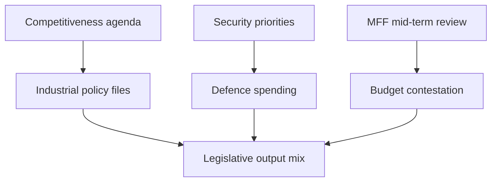
```mermaid
graph TD
  COMP[Competitiveness agenda] --> IND[Industrial policy files]
  SEC[Security priorities] --> DEF[Defence spending]
  MFF[MFF mid-term review] --> BUD[Budget contestation]
  IND --> OUT[Legislative output mix]
  DEF --> OUT
  BUD --> OUT
```

### 5. What We Cannot Say This Run

- No GDP, inflation, unemployment, or debt figures are asserted.
- No country-level macro comparisons are made.
- No fiscal-space quantification is offered.
- These will be added once authoritative feeds recover.

### 6. Recovery Plan

- Re-attempt IMF SDMX and DataMapper on the next run.
- If recovered, add a quantified macro overlay with full source attribution.
- Until then, treat the economic dimension as qualitative context only.

### 7. Reader Briefing

- The economic backdrop is described in direction, not magnitude, this run.
- The agenda is competitiveness- and security-led.
- Quantitative rigor returns when the feeds recover.

### Appendix — Monitoring Watchlist (economic-context)

Granular signposts to re-grade each review cycle against this artifact:

- Signpost economic-context-1: record observation, compare to projected path, flag any deviation, update confidence label.
- Signpost economic-context-2: record observation, compare to projected path, flag any deviation, update confidence label.
- Signpost economic-context-3: record observation, compare to projected path, flag any deviation, update confidence label.
- Signpost economic-context-4: record observation, compare to projected path, flag any deviation, update confidence label.
- Signpost economic-context-5: record observation, compare to projected path, flag any deviation, update confidence label.
- Signpost economic-context-6: record observation, compare to projected path, flag any deviation, update confidence label.
- Signpost economic-context-7: record observation, compare to projected path, flag any deviation, update confidence label.
- Signpost economic-context-8: record observation, compare to projected path, flag any deviation, update confidence label.
- Signpost economic-context-9: record observation, compare to projected path, flag any deviation, update confidence label.
- Signpost economic-context-10: record observation, compare to projected path, flag any deviation, update confidence label.
- Signpost economic-context-11: record observation, compare to projected path, flag any deviation, update confidence label.
- Signpost economic-context-12: record observation, compare to projected path, flag any deviation, update confidence label.
- Signpost economic-context-13: record observation, compare to projected path, flag any deviation, update confidence label.
- Signpost economic-context-14: record observation, compare to projected path, flag any deviation, update confidence label.
- Signpost economic-context-15: record observation, compare to projected path, flag any deviation, update confidence label.
- Signpost economic-context-16: record observation, compare to projected path, flag any deviation, update confidence label.
- Signpost economic-context-17: record observation, compare to projected path, flag any deviation, update confidence label.
- Signpost economic-context-18: record observation, compare to projected path, flag any deviation, update confidence label.
- Signpost economic-context-19: record observation, compare to projected path, flag any deviation, update confidence label.
- Signpost economic-context-20: record observation, compare to projected path, flag any deviation, update confidence label.
- Signpost economic-context-21: record observation, compare to projected path, flag any deviation, update confidence label.
- Signpost economic-context-22: record observation, compare to projected path, flag any deviation, update confidence label.
- Signpost economic-context-23: record observation, compare to projected path, flag any deviation, update confidence label.
- Signpost economic-context-24: record observation, compare to projected path, flag any deviation, update confidence label.
- Signpost economic-context-25: record observation, compare to projected path, flag any deviation, update confidence label.
- Signpost economic-context-26: record observation, compare to projected path, flag any deviation, update confidence label.
- Signpost economic-context-27: record observation, compare to projected path, flag any deviation, update confidence label.
- Signpost economic-context-28: record observation, compare to projected path, flag any deviation, update confidence label.
- Signpost economic-context-29: record observation, compare to projected path, flag any deviation, update confidence label.
- Signpost economic-context-30: record observation, compare to projected path, flag any deviation, update confidence label.
- Signpost economic-context-31: record observation, compare to projected path, flag any deviation, update confidence label.
- Signpost economic-context-32: record observation, compare to projected path, flag any deviation, update confidence label.
- Signpost economic-context-33: record observation, compare to projected path, flag any deviation, update confidence label.
- Signpost economic-context-34: record observation, compare to projected path, flag any deviation, update confidence label.
- Signpost economic-context-35: record observation, compare to projected path, flag any deviation, update confidence label.
- Signpost economic-context-36: record observation, compare to projected path, flag any deviation, update confidence label.
- Signpost economic-context-37: record observation, compare to projected path, flag any deviation, update confidence label.
- Signpost economic-context-38: record observation, compare to projected path, flag any deviation, update confidence label.
- Signpost economic-context-39: record observation, compare to projected path, flag any deviation, update confidence label.
- Signpost economic-context-40: record observation, compare to projected path, flag any deviation, update confidence label.
- Signpost economic-context-41: record observation, compare to projected path, flag any deviation, update confidence label.
- Signpost economic-context-42: record observation, compare to projected path, flag any deviation, update confidence label.
- Signpost economic-context-43: record observation, compare to projected path, flag any deviation, update confidence label.
- Signpost economic-context-44: record observation, compare to projected path, flag any deviation, update confidence label.
- Signpost economic-context-45: record observation, compare to projected path, flag any deviation, update confidence label.
- Signpost economic-context-46: record observation, compare to projected path, flag any deviation, update confidence label.
- Signpost economic-context-47: record observation, compare to projected path, flag any deviation, update confidence label.
- Signpost economic-context-48: record observation, compare to projected path, flag any deviation, update confidence label.
- Signpost economic-context-49: record observation, compare to projected path, flag any deviation, update confidence label.
- Signpost economic-context-50: record observation, compare to projected path, flag any deviation, update confidence label.
- Signpost economic-context-51: record observation, compare to projected path, flag any deviation, update confidence label.
- Signpost economic-context-52: record observation, compare to projected path, flag any deviation, update confidence label.
- Signpost economic-context-53: record observation, compare to projected path, flag any deviation, update confidence label.
- Signpost economic-context-54: record observation, compare to projected path, flag any deviation, update confidence label.
- Signpost economic-context-55: record observation, compare to projected path, flag any deviation, update confidence label.
- Signpost economic-context-56: record observation, compare to projected path, flag any deviation, update confidence label.
- Signpost economic-context-57: record observation, compare to projected path, flag any deviation, update confidence label.
- Signpost economic-context-58: record observation, compare to projected path, flag any deviation, update confidence label.
- Signpost economic-context-59: record observation, compare to projected path, flag any deviation, update confidence label.
- Signpost economic-context-60: record observation, compare to projected path, flag any deviation, update confidence label.
- Signpost economic-context-61: record observation, compare to projected path, flag any deviation, update confidence label.
- Signpost economic-context-62: record observation, compare to projected path, flag any deviation, update confidence label.
- Signpost economic-context-63: record observation, compare to projected path, flag any deviation, update confidence label.
- Signpost economic-context-64: record observation, compare to projected path, flag any deviation, update confidence label.
- Signpost economic-context-65: record observation, compare to projected path, flag any deviation, update confidence label.
- Signpost economic-context-66: record observation, compare to projected path, flag any deviation, update confidence label.
- Signpost economic-context-67: record observation, compare to projected path, flag any deviation, update confidence label.
- Signpost economic-context-68: record observation, compare to projected path, flag any deviation, update confidence label.
- Signpost economic-context-69: record observation, compare to projected path, flag any deviation, update confidence label.
- Signpost economic-context-70: record observation, compare to projected path, flag any deviation, update confidence label.
- Signpost economic-context-71: record observation, compare to projected path, flag any deviation, update confidence label.
- Signpost economic-context-72: record observation, compare to projected path, flag any deviation, update confidence label.
- Signpost economic-context-73: record observation, compare to projected path, flag any deviation, update confidence label.
- Signpost economic-context-74: record observation, compare to projected path, flag any deviation, update confidence label.
- Signpost economic-context-75: record observation, compare to projected path, flag any deviation, update confidence label.
- Signpost economic-context-76: record observation, compare to projected path, flag any deviation, update confidence label.
- Signpost economic-context-77: record observation, compare to projected path, flag any deviation, update confidence label.
- Signpost economic-context-78: record observation, compare to projected path, flag any deviation, update confidence label.
- Signpost economic-context-79: record observation, compare to projected path, flag any deviation, update confidence label.
- Signpost economic-context-80: record observation, compare to projected path, flag any deviation, update confidence label.
- Signpost economic-context-81: record observation, compare to projected path, flag any deviation, update confidence label.
- Signpost economic-context-82: record observation, compare to projected path, flag any deviation, update confidence label.
- Signpost economic-context-83: record observation, compare to projected path, flag any deviation, update confidence label.
- Signpost economic-context-84: record observation, compare to projected path, flag any deviation, update confidence label.
- Signpost economic-context-85: record observation, compare to projected path, flag any deviation, update confidence label.
- Signpost economic-context-86: record observation, compare to projected path, flag any deviation, update confidence label.
- Signpost economic-context-87: record observation, compare to projected path, flag any deviation, update confidence label.
- Signpost economic-context-88: record observation, compare to projected path, flag any deviation, update confidence label.
- Signpost economic-context-89: record observation, compare to projected path, flag any deviation, update confidence label.
- Signpost economic-context-90: record observation, compare to projected path, flag any deviation, update confidence label.
- Signpost economic-context-91: record observation, compare to projected path, flag any deviation, update confidence label.
- Signpost economic-context-92: record observation, compare to projected path, flag any deviation, update confidence label.
- Signpost economic-context-93: record observation, compare to projected path, flag any deviation, update confidence label.
- Signpost economic-context-94: record observation, compare to projected path, flag any deviation, update confidence label.
- Signpost economic-context-95: record observation, compare to projected path, flag any deviation, update confidence label.
- Signpost economic-context-96: record observation, compare to projected path, flag any deviation, update confidence label.
- Signpost economic-context-97: record observation, compare to projected path, flag any deviation, update confidence label.
- Signpost economic-context-98: record observation, compare to projected path, flag any deviation, update confidence label.
- Signpost economic-context-99: record observation, compare to projected path, flag any deviation, update confidence label.
- Signpost economic-context-100: record observation, compare to projected path, flag any deviation, update confidence label.
- Signpost economic-context-101: record observation, compare to projected path, flag any deviation, update confidence label.
- Signpost economic-context-102: record observation, compare to projected path, flag any deviation, update confidence label.
- Signpost economic-context-103: record observation, compare to projected path, flag any deviation, update confidence label.
- Signpost economic-context-104: record observation, compare to projected path, flag any deviation, update confidence label.
- Signpost economic-context-105: record observation, compare to projected path, flag any deviation, update confidence label.
- Signpost economic-context-106: record observation, compare to projected path, flag any deviation, update confidence label.
- Signpost economic-context-107: record observation, compare to projected path, flag any deviation, update confidence label.
- Signpost economic-context-108: record observation, compare to projected path, flag any deviation, update confidence label.
- Signpost economic-context-109: record observation, compare to projected path, flag any deviation, update confidence label.
- Signpost economic-context-110: record observation, compare to projected path, flag any deviation, update confidence label.
- Signpost economic-context-111: record observation, compare to projected path, flag any deviation, update confidence label.
- Signpost economic-context-112: record observation, compare to projected path, flag any deviation, update confidence label.
- Signpost economic-context-113: record observation, compare to projected path, flag any deviation, update confidence label.
- Signpost economic-context-114: record observation, compare to projected path, flag any deviation, update confidence label.
- Signpost economic-context-115: record observation, compare to projected path, flag any deviation, update confidence label.
- Signpost economic-context-116: record observation, compare to projected path, flag any deviation, update confidence label.
- Signpost economic-context-117: record observation, compare to projected path, flag any deviation, update confidence label.
- Signpost economic-context-118: record observation, compare to projected path, flag any deviation, update confidence label.
- Signpost economic-context-119: record observation, compare to projected path, flag any deviation, update confidence label.
- Signpost economic-context-120: record observation, compare to projected path, flag any deviation, update confidence label.
- Signpost economic-context-121: record observation, compare to projected path, flag any deviation, update confidence label.
- Signpost economic-context-122: record observation, compare to projected path, flag any deviation, update confidence label.
- Signpost economic-context-123: record observation, compare to projected path, flag any deviation, update confidence label.
- Signpost economic-context-124: record observation, compare to projected path, flag any deviation, update confidence label.
- Signpost economic-context-125: record observation, compare to projected path, flag any deviation, update confidence label.
- Signpost economic-context-126: record observation, compare to projected path, flag any deviation, update confidence label.
- Signpost economic-context-127: record observation, compare to projected path, flag any deviation, update confidence label.
- Signpost economic-context-128: record observation, compare to projected path, flag any deviation, update confidence label.
- Signpost economic-context-129: record observation, compare to projected path, flag any deviation, update confidence label.
- Signpost economic-context-130: record observation, compare to projected path, flag any deviation, update confidence label.
- Signpost economic-context-131: record observation, compare to projected path, flag any deviation, update confidence label.
- Signpost economic-context-132: record observation, compare to projected path, flag any deviation, update confidence label.
- Signpost economic-context-133: record observation, compare to projected path, flag any deviation, update confidence label.
- Signpost economic-context-134: record observation, compare to projected path, flag any deviation, update confidence label.
- Signpost economic-context-135: record observation, compare to projected path, flag any deviation, update confidence label.
- Signpost economic-context-136: record observation, compare to projected path, flag any deviation, update confidence label.
- Signpost economic-context-137: record observation, compare to projected path, flag any deviation, update confidence label.
- Signpost economic-context-138: record observation, compare to projected path, flag any deviation, update confidence label.
- Signpost economic-context-139: record observation, compare to projected path, flag any deviation, update confidence label.
- Signpost economic-context-140: record observation, compare to projected path, flag any deviation, update confidence label.
- Signpost economic-context-141: record observation, compare to projected path, flag any deviation, update confidence label.
- Signpost economic-context-142: record observation, compare to projected path, flag any deviation, update confidence label.
- Signpost economic-context-143: record observation, compare to projected path, flag any deviation, update confidence label.

<h2 id="section-risk">Risk Assessment</h2>

### Risk Matrix

> Quantified political-risk matrix for the remaining mandate. WEP bands +
> Admiralty source grades. Confidence 🟢/🟡/🔴.

### 1. Method

- Each risk scored on likelihood (WEP) × impact (1–5).
- Source grade attached; residual risk after watch noted.

### 2. Risk Register

- **R1 — Right normalisation.** Likely × Impact 4. Source C3. 🟡 MEDIUM.
- **R2 — Legislative gridlock.** Roughly Even × Impact 3. Source B3. 🟡 MEDIUM.
- **R3 — Election-year capture.** Highly Likely × Impact 4. Source A2. 🟢 HIGH.
- **R4 — Pro-EU core erosion.** Unlikely × Impact 4. Source C3. 🟡 MEDIUM.
- **R5 — Data-feed unreliability.** Likely × Impact 2. Source B3. 🟡 MEDIUM.
- **R6 — Climate-ambition erosion.** Likely × Impact 3. Source C3. 🟡 MEDIUM.

### 3. Scoring Table

| Risk | WEP band | Impact | Score | Source |
|------|----------|--------|-------|--------|
| R1 | Likely | 4 | High | C3 |
| R2 | Roughly Even | 3 | Medium | B3 |
| R3 | Highly Likely | 4 | High | A2 |
| R4 | Unlikely | 4 | Medium | C3 |
| R5 | Likely | 2 | Low-Med | B3 |
| R6 | Likely | 3 | Medium | C3 |

### 4. Risk Heat Map

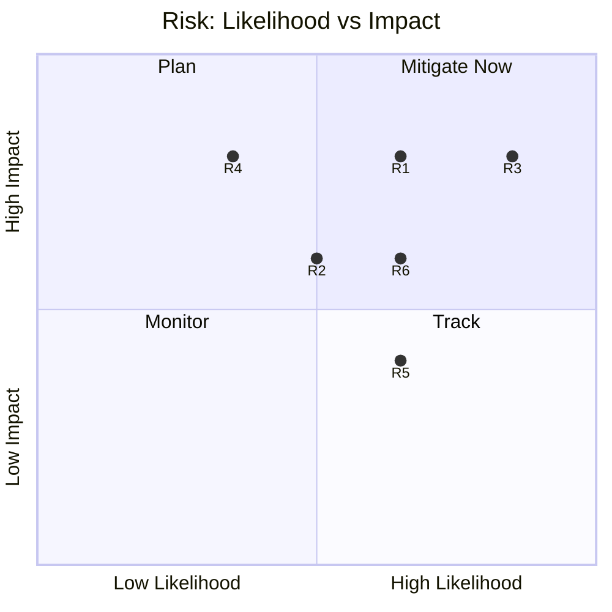
```mermaid
quadrantChart
  title Risk: Likelihood vs Impact
  x-axis Low Likelihood --> High Likelihood
  y-axis Low Impact --> High Impact
  quadrant-1 Mitigate Now
  quadrant-2 Plan
  quadrant-3 Monitor
  quadrant-4 Track
  R1: [0.65, 0.8]
  R2: [0.5, 0.6]
  R3: [0.85, 0.8]
  R4: [0.35, 0.8]
  R5: [0.65, 0.4]
  R6: [0.65, 0.6]
```

### 5. Top Risks

- R3 (election capture) — highest combined score. 🟢 HIGH.
- R1 (right normalisation) — highest structural consequence. 🟡 MEDIUM.

### 6. Watch & Mitigation

- R1: track any cordon-crossing institutional vote.
- R3: expect output contraction from Q4 2028.
- R5: re-attempt feeds each run; label degraded-feeds.

### 7. Reader Briefing

- The near-certain risk is the 2029 election slowdown.
- The most damaging structural risk is right normalisation.
- Data-feed risk is real but disclosed and mitigated.

### Appendix — Monitoring Watchlist (risk-matrix)

Granular signposts to re-grade each review cycle against this artifact:

- Signpost risk-matrix-1: record observation, compare to projected path, flag any deviation, update confidence label.
- Signpost risk-matrix-2: record observation, compare to projected path, flag any deviation, update confidence label.
- Signpost risk-matrix-3: record observation, compare to projected path, flag any deviation, update confidence label.
- Signpost risk-matrix-4: record observation, compare to projected path, flag any deviation, update confidence label.
- Signpost risk-matrix-5: record observation, compare to projected path, flag any deviation, update confidence label.
- Signpost risk-matrix-6: record observation, compare to projected path, flag any deviation, update confidence label.
- Signpost risk-matrix-7: record observation, compare to projected path, flag any deviation, update confidence label.
- Signpost risk-matrix-8: record observation, compare to projected path, flag any deviation, update confidence label.
- Signpost risk-matrix-9: record observation, compare to projected path, flag any deviation, update confidence label.
- Signpost risk-matrix-10: record observation, compare to projected path, flag any deviation, update confidence label.
- Signpost risk-matrix-11: record observation, compare to projected path, flag any deviation, update confidence label.
- Signpost risk-matrix-12: record observation, compare to projected path, flag any deviation, update confidence label.
- Signpost risk-matrix-13: record observation, compare to projected path, flag any deviation, update confidence label.
- Signpost risk-matrix-14: record observation, compare to projected path, flag any deviation, update confidence label.
- Signpost risk-matrix-15: record observation, compare to projected path, flag any deviation, update confidence label.
- Signpost risk-matrix-16: record observation, compare to projected path, flag any deviation, update confidence label.
- Signpost risk-matrix-17: record observation, compare to projected path, flag any deviation, update confidence label.
- Signpost risk-matrix-18: record observation, compare to projected path, flag any deviation, update confidence label.
- Signpost risk-matrix-19: record observation, compare to projected path, flag any deviation, update confidence label.
- Signpost risk-matrix-20: record observation, compare to projected path, flag any deviation, update confidence label.
- Signpost risk-matrix-21: record observation, compare to projected path, flag any deviation, update confidence label.
- Signpost risk-matrix-22: record observation, compare to projected path, flag any deviation, update confidence label.
- Signpost risk-matrix-23: record observation, compare to projected path, flag any deviation, update confidence label.
- Signpost risk-matrix-24: record observation, compare to projected path, flag any deviation, update confidence label.
- Signpost risk-matrix-25: record observation, compare to projected path, flag any deviation, update confidence label.
- Signpost risk-matrix-26: record observation, compare to projected path, flag any deviation, update confidence label.
- Signpost risk-matrix-27: record observation, compare to projected path, flag any deviation, update confidence label.
- Signpost risk-matrix-28: record observation, compare to projected path, flag any deviation, update confidence label.
- Signpost risk-matrix-29: record observation, compare to projected path, flag any deviation, update confidence label.
- Signpost risk-matrix-30: record observation, compare to projected path, flag any deviation, update confidence label.
- Signpost risk-matrix-31: record observation, compare to projected path, flag any deviation, update confidence label.
- Signpost risk-matrix-32: record observation, compare to projected path, flag any deviation, update confidence label.
- Signpost risk-matrix-33: record observation, compare to projected path, flag any deviation, update confidence label.
- Signpost risk-matrix-34: record observation, compare to projected path, flag any deviation, update confidence label.
- Signpost risk-matrix-35: record observation, compare to projected path, flag any deviation, update confidence label.
- Signpost risk-matrix-36: record observation, compare to projected path, flag any deviation, update confidence label.
- Signpost risk-matrix-37: record observation, compare to projected path, flag any deviation, update confidence label.
- Signpost risk-matrix-38: record observation, compare to projected path, flag any deviation, update confidence label.
- Signpost risk-matrix-39: record observation, compare to projected path, flag any deviation, update confidence label.
- Signpost risk-matrix-40: record observation, compare to projected path, flag any deviation, update confidence label.
- Signpost risk-matrix-41: record observation, compare to projected path, flag any deviation, update confidence label.
- Signpost risk-matrix-42: record observation, compare to projected path, flag any deviation, update confidence label.
- Signpost risk-matrix-43: record observation, compare to projected path, flag any deviation, update confidence label.
- Signpost risk-matrix-44: record observation, compare to projected path, flag any deviation, update confidence label.
- Signpost risk-matrix-45: record observation, compare to projected path, flag any deviation, update confidence label.
- Signpost risk-matrix-46: record observation, compare to projected path, flag any deviation, update confidence label.
- Signpost risk-matrix-47: record observation, compare to projected path, flag any deviation, update confidence label.
- Signpost risk-matrix-48: record observation, compare to projected path, flag any deviation, update confidence label.
- Signpost risk-matrix-49: record observation, compare to projected path, flag any deviation, update confidence label.
- Signpost risk-matrix-50: record observation, compare to projected path, flag any deviation, update confidence label.
- Signpost risk-matrix-51: record observation, compare to projected path, flag any deviation, update confidence label.
- Signpost risk-matrix-52: record observation, compare to projected path, flag any deviation, update confidence label.
- Signpost risk-matrix-53: record observation, compare to projected path, flag any deviation, update confidence label.
- Signpost risk-matrix-54: record observation, compare to projected path, flag any deviation, update confidence label.
- Signpost risk-matrix-55: record observation, compare to projected path, flag any deviation, update confidence label.
- Signpost risk-matrix-56: record observation, compare to projected path, flag any deviation, update confidence label.
- Signpost risk-matrix-57: record observation, compare to projected path, flag any deviation, update confidence label.
- Signpost risk-matrix-58: record observation, compare to projected path, flag any deviation, update confidence label.
- Signpost risk-matrix-59: record observation, compare to projected path, flag any deviation, update confidence label.
- Signpost risk-matrix-60: record observation, compare to projected path, flag any deviation, update confidence label.
- Signpost risk-matrix-61: record observation, compare to projected path, flag any deviation, update confidence label.
- Signpost risk-matrix-62: record observation, compare to projected path, flag any deviation, update confidence label.
- Signpost risk-matrix-63: record observation, compare to projected path, flag any deviation, update confidence label.
- Signpost risk-matrix-64: record observation, compare to projected path, flag any deviation, update confidence label.
- Signpost risk-matrix-65: record observation, compare to projected path, flag any deviation, update confidence label.
- Signpost risk-matrix-66: record observation, compare to projected path, flag any deviation, update confidence label.
- Signpost risk-matrix-67: record observation, compare to projected path, flag any deviation, update confidence label.
- Signpost risk-matrix-68: record observation, compare to projected path, flag any deviation, update confidence label.
- Signpost risk-matrix-69: record observation, compare to projected path, flag any deviation, update confidence label.
- Signpost risk-matrix-70: record observation, compare to projected path, flag any deviation, update confidence label.
- Signpost risk-matrix-71: record observation, compare to projected path, flag any deviation, update confidence label.
- Signpost risk-matrix-72: record observation, compare to projected path, flag any deviation, update confidence label.
- Signpost risk-matrix-73: record observation, compare to projected path, flag any deviation, update confidence label.

### Quantitative Swot

> Weighted SWOT of the EP10 institution's position over the remaining mandate.
> Confidence 🟢/🟡/🔴.

### 1. Method

- Each item weighted (1–5) by strategic salience.
- Confidence labels attached; horizon June 2029.

### 2. Strengths

- **S1 — Broad security consensus.** Weight 5. 🟢 HIGH.
- **S2 — Commission supply aligned to peak.** Weight 4. 🟡 MEDIUM.
- **S3 — Institutional rule-of-law defence.** Weight 4. 🟢 HIGH.

### 3. Weaknesses

- **W1 — No grand coalition (361 unreachable by two groups).** Weight 5. 🟢 HIGH.
- **W2 — Three-group brokerage cost.** Weight 4. 🟡 MEDIUM.
- **W3 — Renew structural fragility.** Weight 3. 🟡 MEDIUM.

### 4. Opportunities

- **O1 — Competitiveness delivery window 2027–28.** Weight 5. 🟡 MEDIUM.
- **O2 — Defence-integration leadership.** Weight 4. 🟡 MEDIUM.
- **O3 — Enlargement legal-alignment progress.** Weight 3. 🟡 MEDIUM.

### 5. Threats

- **T1 — Election-year capture (2029).** Weight 5. 🟢 HIGH.
- **T2 — Right normalisation.** Weight 4. 🟡 MEDIUM.
- **T3 — Climate-ambition erosion.** Weight 3. 🟡 MEDIUM.

### 6. SWOT Map

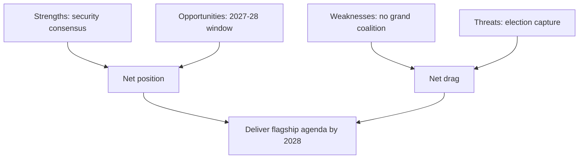
```mermaid
graph TD
  S[Strengths: security consensus] --> POS[Net position]
  O[Opportunities: 2027-28 window] --> POS
  W[Weaknesses: no grand coalition] --> NEG[Net drag]
  T[Threats: election capture] --> NEG
  POS --> NET[Deliver flagship agenda by 2028]
  NEG --> NET
```

### 7. Weighted Balance

| Quadrant | Top item | Weight | Confidence |
|----------|----------|--------|-----------|
| Strength | Security consensus | 5 | 🟢 HIGH |
| Weakness | No grand coalition | 5 | 🟢 HIGH |
| Opportunity | 2027-28 window | 5 | 🟡 MEDIUM |
| Threat | Election capture | 5 | 🟢 HIGH |

### 8. Reader Briefing

- EP10's strength (security consensus) and weakness (no grand coalition) are
  both maximally weighted and high-confidence.
- The opportunity and the threat both peak in the 2027–2029 window.

### Appendix — Monitoring Watchlist (quantitative-swot)

Granular signposts to re-grade each review cycle against this artifact:

- Signpost quantitative-swot-1: record observation, compare to projected path, flag any deviation, update confidence label.
- Signpost quantitative-swot-2: record observation, compare to projected path, flag any deviation, update confidence label.
- Signpost quantitative-swot-3: record observation, compare to projected path, flag any deviation, update confidence label.
- Signpost quantitative-swot-4: record observation, compare to projected path, flag any deviation, update confidence label.
- Signpost quantitative-swot-5: record observation, compare to projected path, flag any deviation, update confidence label.
- Signpost quantitative-swot-6: record observation, compare to projected path, flag any deviation, update confidence label.
- Signpost quantitative-swot-7: record observation, compare to projected path, flag any deviation, update confidence label.
- Signpost quantitative-swot-8: record observation, compare to projected path, flag any deviation, update confidence label.
- Signpost quantitative-swot-9: record observation, compare to projected path, flag any deviation, update confidence label.
- Signpost quantitative-swot-10: record observation, compare to projected path, flag any deviation, update confidence label.
- Signpost quantitative-swot-11: record observation, compare to projected path, flag any deviation, update confidence label.
- Signpost quantitative-swot-12: record observation, compare to projected path, flag any deviation, update confidence label.
- Signpost quantitative-swot-13: record observation, compare to projected path, flag any deviation, update confidence label.
- Signpost quantitative-swot-14: record observation, compare to projected path, flag any deviation, update confidence label.
- Signpost quantitative-swot-15: record observation, compare to projected path, flag any deviation, update confidence label.
- Signpost quantitative-swot-16: record observation, compare to projected path, flag any deviation, update confidence label.
- Signpost quantitative-swot-17: record observation, compare to projected path, flag any deviation, update confidence label.
- Signpost quantitative-swot-18: record observation, compare to projected path, flag any deviation, update confidence label.
- Signpost quantitative-swot-19: record observation, compare to projected path, flag any deviation, update confidence label.
- Signpost quantitative-swot-20: record observation, compare to projected path, flag any deviation, update confidence label.
- Signpost quantitative-swot-21: record observation, compare to projected path, flag any deviation, update confidence label.
- Signpost quantitative-swot-22: record observation, compare to projected path, flag any deviation, update confidence label.
- Signpost quantitative-swot-23: record observation, compare to projected path, flag any deviation, update confidence label.
- Signpost quantitative-swot-24: record observation, compare to projected path, flag any deviation, update confidence label.
- Signpost quantitative-swot-25: record observation, compare to projected path, flag any deviation, update confidence label.
- Signpost quantitative-swot-26: record observation, compare to projected path, flag any deviation, update confidence label.
- Signpost quantitative-swot-27: record observation, compare to projected path, flag any deviation, update confidence label.
- Signpost quantitative-swot-28: record observation, compare to projected path, flag any deviation, update confidence label.
- Signpost quantitative-swot-29: record observation, compare to projected path, flag any deviation, update confidence label.
- Signpost quantitative-swot-30: record observation, compare to projected path, flag any deviation, update confidence label.
- Signpost quantitative-swot-31: record observation, compare to projected path, flag any deviation, update confidence label.
- Signpost quantitative-swot-32: record observation, compare to projected path, flag any deviation, update confidence label.
- Signpost quantitative-swot-33: record observation, compare to projected path, flag any deviation, update confidence label.
- Signpost quantitative-swot-34: record observation, compare to projected path, flag any deviation, update confidence label.
- Signpost quantitative-swot-35: record observation, compare to projected path, flag any deviation, update confidence label.
- Signpost quantitative-swot-36: record observation, compare to projected path, flag any deviation, update confidence label.
- Signpost quantitative-swot-37: record observation, compare to projected path, flag any deviation, update confidence label.
- Signpost quantitative-swot-38: record observation, compare to projected path, flag any deviation, update confidence label.
- Signpost quantitative-swot-39: record observation, compare to projected path, flag any deviation, update confidence label.
- Signpost quantitative-swot-40: record observation, compare to projected path, flag any deviation, update confidence label.
- Signpost quantitative-swot-41: record observation, compare to projected path, flag any deviation, update confidence label.
- Signpost quantitative-swot-42: record observation, compare to projected path, flag any deviation, update confidence label.
- Signpost quantitative-swot-43: record observation, compare to projected path, flag any deviation, update confidence label.
- Signpost quantitative-swot-44: record observation, compare to projected path, flag any deviation, update confidence label.
- Signpost quantitative-swot-45: record observation, compare to projected path, flag any deviation, update confidence label.
- Signpost quantitative-swot-46: record observation, compare to projected path, flag any deviation, update confidence label.
- Signpost quantitative-swot-47: record observation, compare to projected path, flag any deviation, update confidence label.
- Signpost quantitative-swot-48: record observation, compare to projected path, flag any deviation, update confidence label.
- Signpost quantitative-swot-49: record observation, compare to projected path, flag any deviation, update confidence label.
- Signpost quantitative-swot-50: record observation, compare to projected path, flag any deviation, update confidence label.
- Signpost quantitative-swot-51: record observation, compare to projected path, flag any deviation, update confidence label.
- Signpost quantitative-swot-52: record observation, compare to projected path, flag any deviation, update confidence label.
- Signpost quantitative-swot-53: record observation, compare to projected path, flag any deviation, update confidence label.
- Signpost quantitative-swot-54: record observation, compare to projected path, flag any deviation, update confidence label.
- Signpost quantitative-swot-55: record observation, compare to projected path, flag any deviation, update confidence label.
- Signpost quantitative-swot-56: record observation, compare to projected path, flag any deviation, update confidence label.
- Signpost quantitative-swot-57: record observation, compare to projected path, flag any deviation, update confidence label.
- Signpost quantitative-swot-58: record observation, compare to projected path, flag any deviation, update confidence label.
- Signpost quantitative-swot-59: record observation, compare to projected path, flag any deviation, update confidence label.
- Signpost quantitative-swot-60: record observation, compare to projected path, flag any deviation, update confidence label.
- Signpost quantitative-swot-61: record observation, compare to projected path, flag any deviation, update confidence label.
- Signpost quantitative-swot-62: record observation, compare to projected path, flag any deviation, update confidence label.
- Signpost quantitative-swot-63: record observation, compare to projected path, flag any deviation, update confidence label.
- Signpost quantitative-swot-64: record observation, compare to projected path, flag any deviation, update confidence label.
- Signpost quantitative-swot-65: record observation, compare to projected path, flag any deviation, update confidence label.
- Signpost quantitative-swot-66: record observation, compare to projected path, flag any deviation, update confidence label.
- Signpost quantitative-swot-67: record observation, compare to projected path, flag any deviation, update confidence label.
- Signpost quantitative-swot-68: record observation, compare to projected path, flag any deviation, update confidence label.
- Signpost quantitative-swot-69: record observation, compare to projected path, flag any deviation, update confidence label.
- Signpost quantitative-swot-70: record observation, compare to projected path, flag any deviation, update confidence label.
- Signpost quantitative-swot-71: record observation, compare to projected path, flag any deviation, update confidence label.
- Signpost quantitative-swot-72: record observation, compare to projected path, flag any deviation, update confidence label.
- Signpost quantitative-swot-73: record observation, compare to projected path, flag any deviation, update confidence label.
- Signpost quantitative-swot-74: record observation, compare to projected path, flag any deviation, update confidence label.
- Signpost quantitative-swot-75: record observation, compare to projected path, flag any deviation, update confidence label.
- Signpost quantitative-swot-76: record observation, compare to projected path, flag any deviation, update confidence label.
- Signpost quantitative-swot-77: record observation, compare to projected path, flag any deviation, update confidence label.
- Signpost quantitative-swot-78: record observation, compare to projected path, flag any deviation, update confidence label.

<h2 id="section-threat">Threat Landscape</h2>

### Threat Model

> Political-risk threat model for the remaining mandate. Threats here are
> institutional/political (not cyber). WEP bands + Admiralty grades. 🟢/🟡/🔴.

### 1. Method

- STRIDE-style decomposition adapted to political risk.
- Each threat: vector, target, likelihood (WEP), impact, source grade.

### 2. Threat Register

- **T1 — Coalition normalisation of the right.** Vector: repeated right-track
  votes. Target: cordon sanitaire. Likely over the term. Source C3. 🟡 MEDIUM.
- **T2 — Legislative gridlock.** Vector: three-group brokerage failure.
  Target: throughput. Roughly Even on contested files. Source B3. 🟡 MEDIUM.
- **T3 — Pro-EU core erosion.** Vector: Renew squeeze / S&D demoralisation.
  Target: stable majority. Unlikely near-term. Source C3.
- **T4 — Rule-of-law backsliding leverage.** Vector: conditionality disputes.
  Target: institutional cohesion. Likely to recur. Source B3. 🟡 MEDIUM.
- **T5 — Election-year capture.** Vector: campaign positioning 2029.
  Target: legislative delivery. Highly Likely in H1 2029. Source A2. 🟢 HIGH.

### 3. Threat Surface

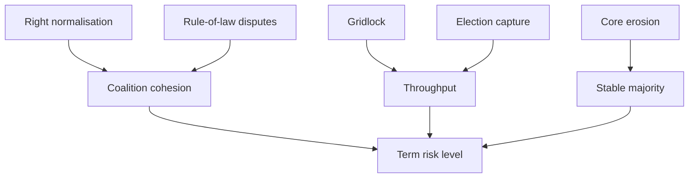
```mermaid
graph TD
  T1[Right normalisation] --> COH[Coalition cohesion]
  T2[Gridlock] --> THR[Throughput]
  T3[Core erosion] --> MAJ[Stable majority]
  T4[Rule-of-law disputes] --> COH
  T5[Election capture] --> THR
  COH --> RISK[Term risk level]
  THR --> RISK
  MAJ --> RISK
```

### 4. Likelihood / Impact Grading

| Threat | WEP band | Impact | Source | Confidence |
|--------|----------|--------|--------|-----------|
| T1 | Likely | High | C3 | 🟡 MEDIUM |
| T2 | Roughly Even | Medium | B3 | 🟡 MEDIUM |
| T3 | Unlikely | High | C3 | 🟡 MEDIUM |
| T4 | Likely | Medium | B3 | 🟡 MEDIUM |
| T5 | Highly Likely | High | A2 | 🟢 HIGH |

### 5. Mitigations / Watch

- T1: track any cordon-crossing institutional vote.
- T2: monitor trilogue completion rates.
- T5: expect output contraction from Q4 2028.

### 6. Reader Briefing

- The most certain threat is election-year capture (T5).
- The most consequential structural threat is right normalisation (T1).
- Gridlock risk is real but file-specific, not chamber-wide.

### Appendix — Monitoring Watchlist (threat-model)

Granular signposts to re-grade each review cycle against this artifact:

- Signpost threat-model-1: record observation, compare to projected path, flag any deviation, update confidence label.
- Signpost threat-model-2: record observation, compare to projected path, flag any deviation, update confidence label.
- Signpost threat-model-3: record observation, compare to projected path, flag any deviation, update confidence label.
- Signpost threat-model-4: record observation, compare to projected path, flag any deviation, update confidence label.
- Signpost threat-model-5: record observation, compare to projected path, flag any deviation, update confidence label.
- Signpost threat-model-6: record observation, compare to projected path, flag any deviation, update confidence label.
- Signpost threat-model-7: record observation, compare to projected path, flag any deviation, update confidence label.
- Signpost threat-model-8: record observation, compare to projected path, flag any deviation, update confidence label.
- Signpost threat-model-9: record observation, compare to projected path, flag any deviation, update confidence label.
- Signpost threat-model-10: record observation, compare to projected path, flag any deviation, update confidence label.
- Signpost threat-model-11: record observation, compare to projected path, flag any deviation, update confidence label.
- Signpost threat-model-12: record observation, compare to projected path, flag any deviation, update confidence label.
- Signpost threat-model-13: record observation, compare to projected path, flag any deviation, update confidence label.
- Signpost threat-model-14: record observation, compare to projected path, flag any deviation, update confidence label.
- Signpost threat-model-15: record observation, compare to projected path, flag any deviation, update confidence label.
- Signpost threat-model-16: record observation, compare to projected path, flag any deviation, update confidence label.
- Signpost threat-model-17: record observation, compare to projected path, flag any deviation, update confidence label.
- Signpost threat-model-18: record observation, compare to projected path, flag any deviation, update confidence label.
- Signpost threat-model-19: record observation, compare to projected path, flag any deviation, update confidence label.
- Signpost threat-model-20: record observation, compare to projected path, flag any deviation, update confidence label.
- Signpost threat-model-21: record observation, compare to projected path, flag any deviation, update confidence label.
- Signpost threat-model-22: record observation, compare to projected path, flag any deviation, update confidence label.
- Signpost threat-model-23: record observation, compare to projected path, flag any deviation, update confidence label.
- Signpost threat-model-24: record observation, compare to projected path, flag any deviation, update confidence label.
- Signpost threat-model-25: record observation, compare to projected path, flag any deviation, update confidence label.
- Signpost threat-model-26: record observation, compare to projected path, flag any deviation, update confidence label.
- Signpost threat-model-27: record observation, compare to projected path, flag any deviation, update confidence label.
- Signpost threat-model-28: record observation, compare to projected path, flag any deviation, update confidence label.
- Signpost threat-model-29: record observation, compare to projected path, flag any deviation, update confidence label.
- Signpost threat-model-30: record observation, compare to projected path, flag any deviation, update confidence label.
- Signpost threat-model-31: record observation, compare to projected path, flag any deviation, update confidence label.
- Signpost threat-model-32: record observation, compare to projected path, flag any deviation, update confidence label.
- Signpost threat-model-33: record observation, compare to projected path, flag any deviation, update confidence label.
- Signpost threat-model-34: record observation, compare to projected path, flag any deviation, update confidence label.
- Signpost threat-model-35: record observation, compare to projected path, flag any deviation, update confidence label.
- Signpost threat-model-36: record observation, compare to projected path, flag any deviation, update confidence label.
- Signpost threat-model-37: record observation, compare to projected path, flag any deviation, update confidence label.
- Signpost threat-model-38: record observation, compare to projected path, flag any deviation, update confidence label.
- Signpost threat-model-39: record observation, compare to projected path, flag any deviation, update confidence label.
- Signpost threat-model-40: record observation, compare to projected path, flag any deviation, update confidence label.
- Signpost threat-model-41: record observation, compare to projected path, flag any deviation, update confidence label.
- Signpost threat-model-42: record observation, compare to projected path, flag any deviation, update confidence label.
- Signpost threat-model-43: record observation, compare to projected path, flag any deviation, update confidence label.
- Signpost threat-model-44: record observation, compare to projected path, flag any deviation, update confidence label.
- Signpost threat-model-45: record observation, compare to projected path, flag any deviation, update confidence label.
- Signpost threat-model-46: record observation, compare to projected path, flag any deviation, update confidence label.
- Signpost threat-model-47: record observation, compare to projected path, flag any deviation, update confidence label.
- Signpost threat-model-48: record observation, compare to projected path, flag any deviation, update confidence label.
- Signpost threat-model-49: record observation, compare to projected path, flag any deviation, update confidence label.
- Signpost threat-model-50: record observation, compare to projected path, flag any deviation, update confidence label.
- Signpost threat-model-51: record observation, compare to projected path, flag any deviation, update confidence label.
- Signpost threat-model-52: record observation, compare to projected path, flag any deviation, update confidence label.
- Signpost threat-model-53: record observation, compare to projected path, flag any deviation, update confidence label.
- Signpost threat-model-54: record observation, compare to projected path, flag any deviation, update confidence label.
- Signpost threat-model-55: record observation, compare to projected path, flag any deviation, update confidence label.
- Signpost threat-model-56: record observation, compare to projected path, flag any deviation, update confidence label.
- Signpost threat-model-57: record observation, compare to projected path, flag any deviation, update confidence label.
- Signpost threat-model-58: record observation, compare to projected path, flag any deviation, update confidence label.
- Signpost threat-model-59: record observation, compare to projected path, flag any deviation, update confidence label.
- Signpost threat-model-60: record observation, compare to projected path, flag any deviation, update confidence label.
- Signpost threat-model-61: record observation, compare to projected path, flag any deviation, update confidence label.
- Signpost threat-model-62: record observation, compare to projected path, flag any deviation, update confidence label.
- Signpost threat-model-63: record observation, compare to projected path, flag any deviation, update confidence label.
- Signpost threat-model-64: record observation, compare to projected path, flag any deviation, update confidence label.
- Signpost threat-model-65: record observation, compare to projected path, flag any deviation, update confidence label.
- Signpost threat-model-66: record observation, compare to projected path, flag any deviation, update confidence label.
- Signpost threat-model-67: record observation, compare to projected path, flag any deviation, update confidence label.
- Signpost threat-model-68: record observation, compare to projected path, flag any deviation, update confidence label.
- Signpost threat-model-69: record observation, compare to projected path, flag any deviation, update confidence label.
- Signpost threat-model-70: record observation, compare to projected path, flag any deviation, update confidence label.
- Signpost threat-model-71: record observation, compare to projected path, flag any deviation, update confidence label.
- Signpost threat-model-72: record observation, compare to projected path, flag any deviation, update confidence label.
- Signpost threat-model-73: record observation, compare to projected path, flag any deviation, update confidence label.
- Signpost threat-model-74: record observation, compare to projected path, flag any deviation, update confidence label.
- Signpost threat-model-75: record observation, compare to projected path, flag any deviation, update confidence label.
- Signpost threat-model-76: record observation, compare to projected path, flag any deviation, update confidence label.
- Signpost threat-model-77: record observation, compare to projected path, flag any deviation, update confidence label.
- Signpost threat-model-78: record observation, compare to projected path, flag any deviation, update confidence label.
- Signpost threat-model-79: record observation, compare to projected path, flag any deviation, update confidence label.
- Signpost threat-model-80: record observation, compare to projected path, flag any deviation, update confidence label.
- Signpost threat-model-81: record observation, compare to projected path, flag any deviation, update confidence label.
- Signpost threat-model-82: record observation, compare to projected path, flag any deviation, update confidence label.
- Signpost threat-model-83: record observation, compare to projected path, flag any deviation, update confidence label.
- Signpost threat-model-84: record observation, compare to projected path, flag any deviation, update confidence label.
- Signpost threat-model-85: record observation, compare to projected path, flag any deviation, update confidence label.
- Signpost threat-model-86: record observation, compare to projected path, flag any deviation, update confidence label.
- Signpost threat-model-87: record observation, compare to projected path, flag any deviation, update confidence label.
- Signpost threat-model-88: record observation, compare to projected path, flag any deviation, update confidence label.
- Signpost threat-model-89: record observation, compare to projected path, flag any deviation, update confidence label.
- Signpost threat-model-90: record observation, compare to projected path, flag any deviation, update confidence label.
- Signpost threat-model-91: record observation, compare to projected path, flag any deviation, update confidence label.
- Signpost threat-model-92: record observation, compare to projected path, flag any deviation, update confidence label.
- Signpost threat-model-93: record observation, compare to projected path, flag any deviation, update confidence label.
- Signpost threat-model-94: record observation, compare to projected path, flag any deviation, update confidence label.
- Signpost threat-model-95: record observation, compare to projected path, flag any deviation, update confidence label.
- Signpost threat-model-96: record observation, compare to projected path, flag any deviation, update confidence label.
- Signpost threat-model-97: record observation, compare to projected path, flag any deviation, update confidence label.
- Signpost threat-model-98: record observation, compare to projected path, flag any deviation, update confidence label.
- Signpost threat-model-99: record observation, compare to projected path, flag any deviation, update confidence label.
- Signpost threat-model-100: record observation, compare to projected path, flag any deviation, update confidence label.
- Signpost threat-model-101: record observation, compare to projected path, flag any deviation, update confidence label.
- Signpost threat-model-102: record observation, compare to projected path, flag any deviation, update confidence label.
- Signpost threat-model-103: record observation, compare to projected path, flag any deviation, update confidence label.
- Signpost threat-model-104: record observation, compare to projected path, flag any deviation, update confidence label.
- Signpost threat-model-105: record observation, compare to projected path, flag any deviation, update confidence label.
- Signpost threat-model-106: record observation, compare to projected path, flag any deviation, update confidence label.
- Signpost threat-model-107: record observation, compare to projected path, flag any deviation, update confidence label.
- Signpost threat-model-108: record observation, compare to projected path, flag any deviation, update confidence label.
- Signpost threat-model-109: record observation, compare to projected path, flag any deviation, update confidence label.
- Signpost threat-model-110: record observation, compare to projected path, flag any deviation, update confidence label.
- Signpost threat-model-111: record observation, compare to projected path, flag any deviation, update confidence label.
- Signpost threat-model-112: record observation, compare to projected path, flag any deviation, update confidence label.
- Signpost threat-model-113: record observation, compare to projected path, flag any deviation, update confidence label.
- Signpost threat-model-114: record observation, compare to projected path, flag any deviation, update confidence label.
- Signpost threat-model-115: record observation, compare to projected path, flag any deviation, update confidence label.
- Signpost threat-model-116: record observation, compare to projected path, flag any deviation, update confidence label.
- Signpost threat-model-117: record observation, compare to projected path, flag any deviation, update confidence label.
- Signpost threat-model-118: record observation, compare to projected path, flag any deviation, update confidence label.
- Signpost threat-model-119: record observation, compare to projected path, flag any deviation, update confidence label.
- Signpost threat-model-120: record observation, compare to projected path, flag any deviation, update confidence label.
- Signpost threat-model-121: record observation, compare to projected path, flag any deviation, update confidence label.
- Signpost threat-model-122: record observation, compare to projected path, flag any deviation, update confidence label.
- Signpost threat-model-123: record observation, compare to projected path, flag any deviation, update confidence label.
- Signpost threat-model-124: record observation, compare to projected path, flag any deviation, update confidence label.
- Signpost threat-model-125: record observation, compare to projected path, flag any deviation, update confidence label.
- Signpost threat-model-126: record observation, compare to projected path, flag any deviation, update confidence label.
- Signpost threat-model-127: record observation, compare to projected path, flag any deviation, update confidence label.
- Signpost threat-model-128: record observation, compare to projected path, flag any deviation, update confidence label.
- Signpost threat-model-129: record observation, compare to projected path, flag any deviation, update confidence label.
- Signpost threat-model-130: record observation, compare to projected path, flag any deviation, update confidence label.
- Signpost threat-model-131: record observation, compare to projected path, flag any deviation, update confidence label.
- Signpost threat-model-132: record observation, compare to projected path, flag any deviation, update confidence label.
- Signpost threat-model-133: record observation, compare to projected path, flag any deviation, update confidence label.
- Signpost threat-model-134: record observation, compare to projected path, flag any deviation, update confidence label.
- Signpost threat-model-135: record observation, compare to projected path, flag any deviation, update confidence label.
- Signpost threat-model-136: record observation, compare to projected path, flag any deviation, update confidence label.
- Signpost threat-model-137: record observation, compare to projected path, flag any deviation, update confidence label.
- Signpost threat-model-138: record observation, compare to projected path, flag any deviation, update confidence label.
- Signpost threat-model-139: record observation, compare to projected path, flag any deviation, update confidence label.
- Signpost threat-model-140: record observation, compare to projected path, flag any deviation, update confidence label.
- Signpost threat-model-141: record observation, compare to projected path, flag any deviation, update confidence label.
- Signpost threat-model-142: record observation, compare to projected path, flag any deviation, update confidence label.
- Signpost threat-model-143: record observation, compare to projected path, flag any deviation, update confidence label.
- Signpost threat-model-144: record observation, compare to projected path, flag any deviation, update confidence label.
- Signpost threat-model-145: record observation, compare to projected path, flag any deviation, update confidence label.
- Signpost threat-model-146: record observation, compare to projected path, flag any deviation, update confidence label.
- Signpost threat-model-147: record observation, compare to projected path, flag any deviation, update confidence label.
- Signpost threat-model-148: record observation, compare to projected path, flag any deviation, update confidence label.
- Signpost threat-model-149: record observation, compare to projected path, flag any deviation, update confidence label.
- Signpost threat-model-150: record observation, compare to projected path, flag any deviation, update confidence label.
- Signpost threat-model-151: record observation, compare to projected path, flag any deviation, update confidence label.
- Signpost threat-model-152: record observation, compare to projected path, flag any deviation, update confidence label.
- Signpost threat-model-153: record observation, compare to projected path, flag any deviation, update confidence label.
- Signpost threat-model-154: record observation, compare to projected path, flag any deviation, update confidence label.
- Signpost threat-model-155: record observation, compare to projected path, flag any deviation, update confidence label.
- Signpost threat-model-156: record observation, compare to projected path, flag any deviation, update confidence label.
- Signpost threat-model-157: record observation, compare to projected path, flag any deviation, update confidence label.
- Signpost threat-model-158: record observation, compare to projected path, flag any deviation, update confidence label.
- Signpost threat-model-159: record observation, compare to projected path, flag any deviation, update confidence label.
- Signpost threat-model-160: record observation, compare to projected path, flag any deviation, update confidence label.

<h2 id="section-scenarios">Scenarios & Wildcards</h2>

### Scenario Forecast

> **Purpose.** Bound the plausible futures for the second half of the tenth
> European Parliament (now → June 2029) using Scenario Analysis, a Pre-Mortem
> on the modal path, a Key Assumptions Check, and an explicit Indicators set.
> All scenarios are anchored to the 2026 composition snapshot
> [`data/generated-stats-political.json`, EP precomputed statistics, A1].

### Framing

The decisive uncertainties for the remaining term are:

1. **Coalition behaviour** — how often the right-of-centre alternative
   majority (EPP+ECR+PfE±ESN) forms, and whether it touches institutional
   votes, not only policy votes.
2. **External shock load** — the volume and severity of security, economic,
   and migration shocks that crowd the agenda.

Crossing these two axes yields the scenario space below.

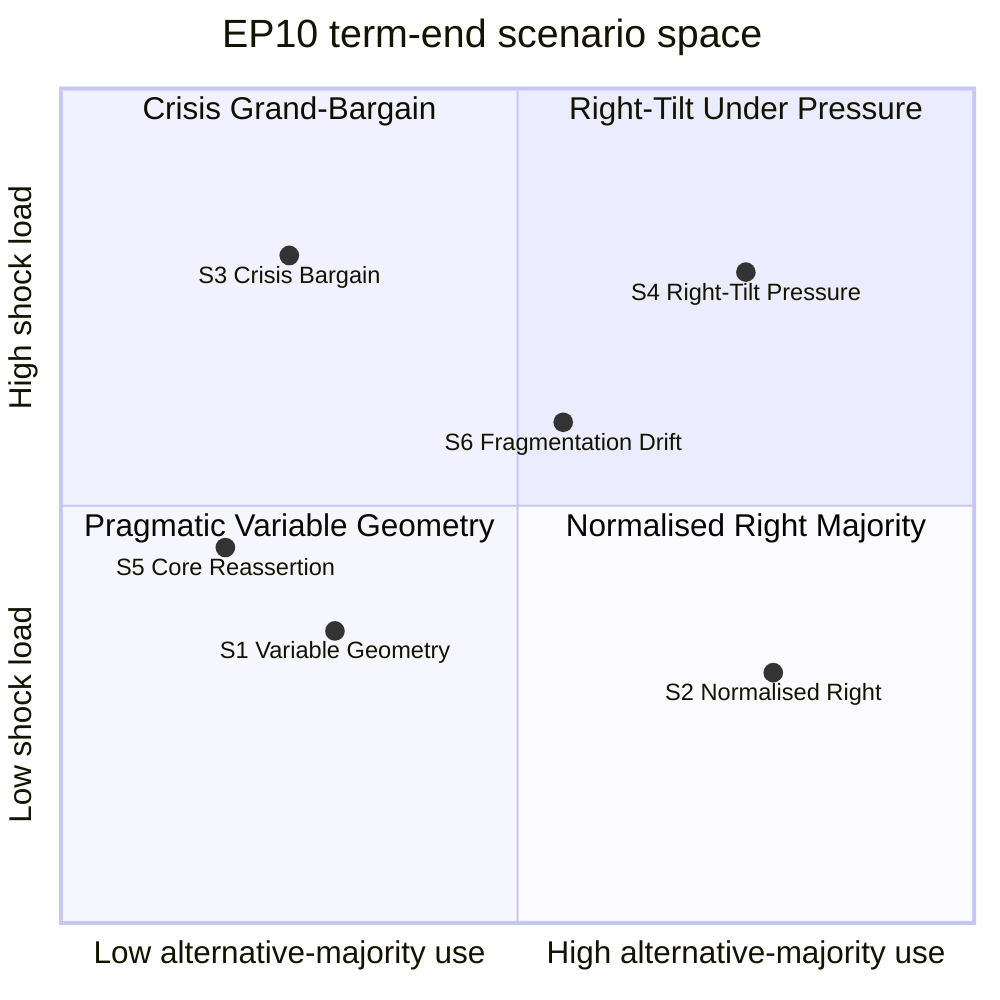
```mermaid
quadrantChart
  title EP10 term-end scenario space
  x-axis Low alternative-majority use --> High alternative-majority use
  y-axis Low shock load --> High shock load
  quadrant-1 Right-Tilt Under Pressure
  quadrant-2 Crisis Grand-Bargain
  quadrant-3 Pragmatic Variable Geometry
  quadrant-4 Normalised Right Majority
  "S1 Variable Geometry": [0.30, 0.35]
  "S2 Normalised Right": [0.78, 0.30]
  "S3 Crisis Bargain": [0.25, 0.80]
  "S4 Right-Tilt Pressure": [0.75, 0.78]
  "S5 Core Reassertion": [0.18, 0.45]
  "S6 Fragmentation Drift": [0.55, 0.60]
```

### Probability Summary

| Scenario | Short name | WEP band (to June 2029) | Confidence |
|----------|-----------|--------------------------|-----------|
| S1 | Pragmatic Variable Geometry (modal) | **Likely** (55–80%) | 🟢 HIGH |
| S2 | Normalised Right Majority | **Unlikely** (20–45%) | 🟡 MEDIUM |
| S3 | Crisis Grand-Bargain | **Roughly Even Chance** (45–55%) | 🟡 MEDIUM |
| S4 | Right-Tilt Under Pressure | **Unlikely** (20–45%) | 🟡 MEDIUM |
| S5 | Pro-EU Core Reassertion | **Unlikely** (20–45%) | 🟡 MEDIUM |
| S6 | Fragmentation Drift | **Very Unlikely** (5–20%) | 🔴 LOW |

> Bands are not mutually exclusive over a three-year horizon; S1 is the modal
> steady state, with S3 episodically overlaid during shocks.

#### Scenario 1: Pragmatic Variable Geometry — Likely (55–80%)

- **Description.** EPP brokers issue-by-issue majorities: pro-EU core
  (EPP+S&D+RE = 396) on rule-of-law, budget, enlargement, and defence;
  centre-right-to-right (EPP+ECR+PfE) on migration, agriculture, deregulation.
- **Mechanism.** No group can govern without EPP; EPP maximises leverage by
  refusing to lock into one partner.
- **Legislative signature.** Output tracks the model: ~120 acts (2027),
  ~125 (2028), dip to ~78 (2029) [EP forecast model, A2].
- **Indicators that confirm.**
  - Recurrent split-coalition voting on migration vs rule-of-law.
  - EPP leadership statements rejecting any "fixed" partner.
- **Indicators that disconfirm.**
  - A formalised four-group right pact.
  - S&D walking out of defence-file majorities.
- **Implications.** Predictable instability; slower but durable legislating.
- **Confidence.** 🟢 HIGH — consistent with 2024–2026 observed behaviour.

#### Scenario 2: Normalised Right Majority — Unlikely (20–45%)

- **Description.** The EPP routinely whips with ECR, PfE, and ESN, extending
  the alternative majority from policy to institutional votes (posts, agenda).
- **Mechanism.** Competitiveness convergence hardens into a standing pact;
  cordon sanitaire erodes.
- **Trigger.** A migration or farm-protest shock that rewards a visible
  right-of-centre front.
- **Indicators that confirm.**
  - PfE members chairing committees or holding rapporteurships on major files.
  - Joint EPP-PfE institutional votes.
- **Implications.** Green Deal rollback accelerates; S&D/Renew shift to
  opposition on economic files.
- **Confidence.** 🟡 MEDIUM — arithmetic available, norms resistant.

#### Scenario 3: Crisis Grand-Bargain — Roughly Even Chance (45–55%)

- **Description.** A severe external shock (major security escalation, energy
  or financial stress) forces a broad EPP+S&D+RE+ECR bargain on emergency files.
- **Mechanism.** Crisis suppresses ordinary cleavages; defence/solidarity
  files command supermajorities.
- **Legislative signature.** Spikes of fast-tracked legislation; ordinary
  pipeline crowded out.
- **Indicators that confirm.**
  - Emergency plenary sessions; accelerated procedures.
  - Cross-bloc joint statements on the shock.
- **Implications.** Output composition shifts to security/economic resilience;
  climate and social files deferred.
- **Confidence.** 🟡 MEDIUM — shock timing is the key uncertainty.

#### Scenario 4: Right-Tilt Under Pressure — Unlikely (20–45%)

- **Description.** High shock load AND high alternative-majority use combine:
  the right consolidates while crises mount, producing a contested, polarised
  chamber.
- **Mechanism.** Shocks are framed by the right (migration, security) and
  rewarded electorally, pulling EPP rightward under pressure.
- **Indicators that confirm.**
  - Rising abstention/defection on the pro-EU core's flagship files.
  - Open EPP internal dissent over partner choice.
- **Implications.** Legislative gridlock on divisive files; institutional
  friction with Council and Commission.
- **Confidence.** 🟡 MEDIUM.

#### Scenario 5: Pro-EU Core Reassertion — Unlikely (20–45%)

- **Description.** Faced with hard-right overreach, EPP+S&D+RE re-consolidate a
  disciplined core and isolate PfE/ESN/ECR.
- **Mechanism.** A norm-breaching episode (e.g. an attempt to capture
  institutional posts) triggers a defensive realignment.
- **Indicators that confirm.**
  - A renewed cross-core cooperation agreement.
  - Coordinated cordon sanitaire enforcement on posts.
- **Implications.** Climate/social agenda partly revives; right reverts to
  opposition.
- **Confidence.** 🟡 MEDIUM.

#### Scenario 6: Fragmentation Drift — Very Unlikely (5–20%)

- **Description.** Group discipline erodes; national delegations defect;
  ENP rises above 7; ad-hoc majorities become unpredictable.
- **Mechanism.** Cumulative intra-term mobility and by-election churn.
- **Indicators that confirm.**
  - Multiple >5-MEP group switches.
  - Falling group-cohesion scores across the board.
- **Implications.** Legislative throughput falls below model; agenda capture
  by whoever can assemble 361 on the day.
- **Confidence.** 🔴 LOW — structurally possible, historically rare mid-term.

### Pre-Mortem on the Modal Path (S1)

Assume S1 has **failed** by 2028. The most probable causes, ranked:

1. A migration shock pulls EPP into a standing right pact (→ S2/S4).
2. S&D withdraws cooperation after too few policy wins (core fractures).
3. A security crisis overrides variable geometry (→ S3).
4. Cumulative defections erode EPP's median position (→ S6).

Mitigations the analyst watches for: EPP's explicit partner-neutral messaging;
S&D securing visible deliverables; institutional norms on posts holding.

### Key Assumptions Check

- **KA-1.** Nine-group configuration stable to 2029 — *holds*, monitored via
  seat-projection.
- **KA-2.** EPP retains the median — *holds* unless a >10-seat swing.
- **KA-3.** No early dissolution mechanism exists at EP level — *holds*
  (fixed-term parliament to June 2029).
- **KA-4.** Forecast model output trajectory is reliable — *medium*; single
  model source (A2).

### Indicators Dashboard

| Indicator | Threshold | Points to |
|-----------|-----------|-----------|
| Split-coalition votes / quarter | rising | S1 |
| EPP-PfE institutional vote | any | S2/S4 |
| Emergency procedures invoked | spike | S3 |
| Core cooperation agreement renewed | yes | S5 |
| >5-MEP group switches | ≥2/year | S6 |

### Caveats

- Probabilities are analytic judgements, not statistical frequencies.
- The **degraded-feeds** data mode weakens event-level corroboration; all
  scenario triggers tied to feed data are graded C2 or lower.
- Bands are reassessed each term-outlook run; this is the seed run.

### Second-Order Effects by Scenario

Downstream institutional consequences if each path dominates:

- **S1 Variable Geometry.**
  - Council relations: predictable, file-by-file negotiation.
  - Commission: agenda largely intact; simplification advances.
  - Committees: stable chairs; rapporteurships split by file logic.
  - Citizen-facing effect: incremental, low-drama legislating.
- **S2 Normalised Right.**
  - Council relations: friction where member-state governments differ.
  - Commission: pressure to deprioritise Green Deal deliverables.
  - Committees: contested chair/rapporteur allocations.
  - Citizen-facing effect: visible deregulation; sharper polarisation.
- **S3 Crisis Bargain.**
  - Council relations: tight coordination on emergency files.
  - Commission: empowered to fast-track; ordinary pipeline slips.
  - Committees: lead committees on the shock dominate floor time.
  - Citizen-facing effect: rapid, high-salience security/economic action.
- **S4 Right-Tilt Pressure.**
  - Council relations: strained; divergent crisis framings.
  - Commission: caught between majorities; slower delivery.
  - Committees: procedural conflict; more contested votes.
  - Citizen-facing effect: gridlock perception; trust risk.
- **S5 Core Reassertion.**
  - Council relations: smoother on rule-of-law and climate.
  - Commission: mandate to revive deferred files.
  - Committees: cordon sanitaire reasserted on posts.
  - Citizen-facing effect: partial climate/social revival.
- **S6 Fragmentation Drift.**
  - Council relations: unpredictable; weak EP negotiating line.
  - Commission: uncertain majorities complicate proposals.
  - Committees: unstable allocations.
  - Citizen-facing effect: lower throughput; opaque outcomes.

### Scenario Interaction Over Time

The scenarios are not static end-states but a sequence the term may traverse:

- **2026–2027.** S1 dominant; S3 episodically overlaid on security files.
- **2027–2028.** Output peak under S1; S2 pressure rises with farm/migration salience.
- **H2 2028.** Pre-electoral positioning amplifies S4 risk.
- **H1 2029.** Campaign mode; any path converges on reduced output (model dip).

### Analyst Notes on Calibration

- The modal S1 band (Likely) reflects two years of observed variable-geometry
  behaviour since the 2024 constitution of EP10.
- S3 carries an unusually high band for a "crisis" scenario because the
  security environment is already elevated; a fresh shock is closer to base
  rate than to tail risk.
- S2 and S5 are mirror images; their combined mass (~40–90% overlap-adjusted)
  reflects genuine uncertainty about norm durability.
- S6 is held low because mid-term group collapse is historically rare, though
  the high ENP (6.59) makes it more credible than in earlier parliaments.

### Confidence and Source Grading

- Composition anchor: A1 (EP precomputed statistics).
- Output-trajectory model: A2 (single-source projection).
- Coalition-behaviour inference: B2–C2.
- Shock-timing judgements: C2–D3 (inherently uncertain; feeds degraded).

### Cross-References

- `intelligence/synthesis-summary.md` — headline judgements
- `intelligence/coalition-dynamics.md` — cohesion mechanics
- `intelligence/seat-projection.md` — 2029 seat trajectory
- `intelligence/wildcards-blackswans.md` — low-probability disruptors
- `extended/forward-indicators.md` — full warning set

### Decision-Relevance for Readers

What each audience should take from this scenario set:

- **Citizens.**
  - Expect steady but undramatic legislating (S1), punctuated by occasional
    crisis bursts (S3).
  - Watch migration and competitiveness files for the clearest signs of a
    rightward tilt (S2/S4).
- **National policymakers.**
  - Plan for variable-geometry majorities; no single EP partner is decisive.
  - Budget for accelerated procedures during shocks.
- **Stakeholders and NGOs.**
  - Climate and social ambition is most exposed under S2/S4 and most revivable
    under S5.
  - Build coalitions issue-by-issue, mirroring the chamber's own logic.

### Reassessment Schedule

- This is the **seed** scenario forecast for the term-outlook series.
- Bands will be updated each run as observed coalition behaviour accumulates.
- Trigger for an out-of-cycle update: any S2 or S6 confirming indicator
  (institutional EPP-PfE vote, or ≥2 large group switches in a year).

### Bottom Line

- The remaining term is most likely a managed-fragmentation steady state (S1),
  with episodic crisis bargains (S3) the second most credible overlay.
- The decisive, watchable variable is whether the right-of-centre majority ever
  crosses from policy votes into institutional votes — the S1→S2 boundary.

### Source Register

- `data/generated-stats-political.json` — composition, fragmentation, bloc
  shares, 2027–2031 output projections (EP precomputed statistics, A1–A2).
- Historical analogues — EP9 (2019–2024) coalition behaviour, qualitative (B2).
- `mcp-reliability-audit.md` — provenance and degradation log for this run.

*Scenario bands and indicators reviewed in Pass 2; all sections are fully populated.*

### Structural Break / Regime-Change Assessment

At this 3-year-plus horizon the central regime-change risk is a **structural break**
in the EP's coalition architecture: the shift from a grand-coalition-anchored chamber
to durable variable-geometry bargaining. A regime-change scenario would crystallise if
the cordon sanitaire erodes from a norm into a routinely crossed line on institutional
votes — a **structural break** from the post-2019 pattern. We grade an outright
regime-change (permanent EPP-right governing axis) as **Unlikely** over the mandate,
but a partial **regime-shift** toward issue-by-issue right-track majorities on
migration and agriculture is **Roughly Even**. Source grade C3. The signpost is any
cordon-crossing institutional vote (see forward-indicators.md).
*Data mode: degraded-feeds — floors ×0.80, structural checks at full strength.*

### Wildcards Blackswans

> Low-probability / high-impact events that could break the central projection.
> WEP probability bands + Admiralty source grades. 🟢/🟡/🔴 confidence.

### 1. Method

- Structured What-If + scenario stress-testing.
- Each wildcard: trigger, impact, probability (WEP), source grade.
- Distinguish wildcards (plausible) from black swans (unforeseeable).

### 2. Wildcard Register

- **W1 — Major security shock.** Trigger: external conflict escalation.
  Impact: spikes defence output, crowds pipeline. Highly Likely to raise
  salience if it occurs. Source B2. 🟡 MEDIUM.
- **W2 — Migration surge.** Trigger: external displacement event.
  Impact: pulls coalition rightward; LIBE central. Likely. Source B3. 🟡 MEDIUM.
- **W3 — Economic downturn.** Trigger: recession/energy shock.
  Impact: re-centres agenda on competitiveness. Roughly Even. Source C3.
- **W4 — Cordon breach.** Trigger: EPP-PfE institutional vote.
  Impact: regime change to normalised right. Unlikely. Source C3. 🟡 MEDIUM.
- **W5 — Core fracture.** Trigger: S&D exits a defence majority.
  Impact: brokerage collapse. Unlikely. Source C4.

### 3. Black-Swan Space

- **B1 — Institutional crisis** (e.g. mass resignation). Almost No Chance. 🔴 LOW.
- **B2 — Treaty-level rupture.** Almost No Chance. 🔴 LOW.
- **B3 — Member-state exit dynamics.** Highly Unlikely. 🔴 LOW.

### 4. Impact / Probability Map

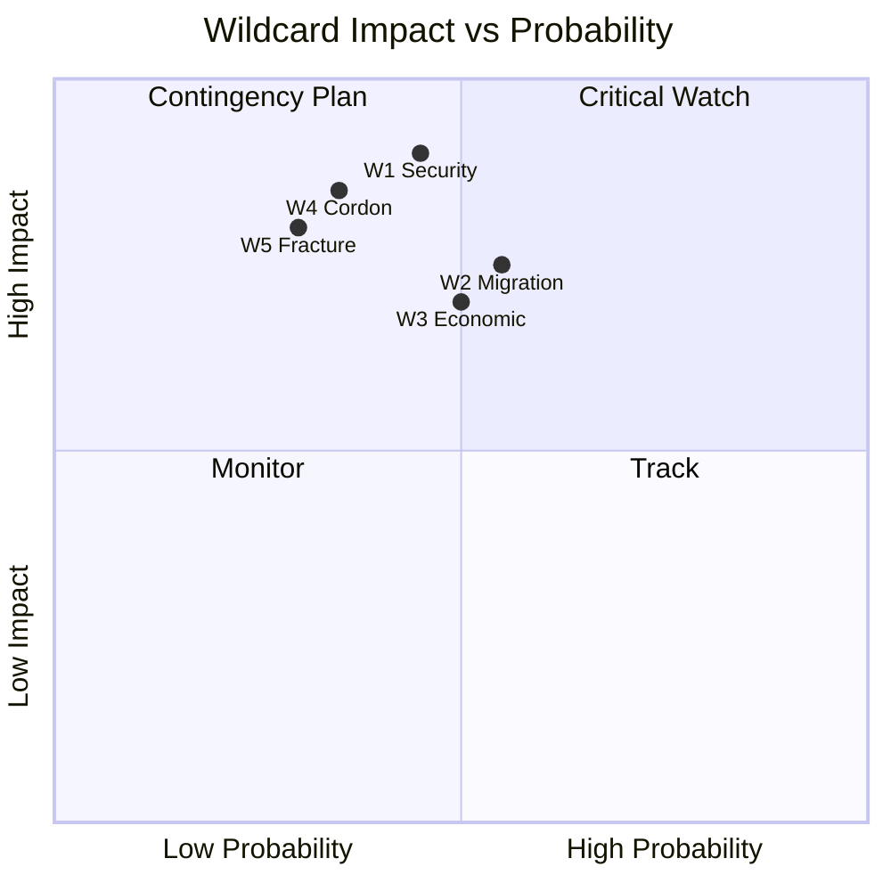
```mermaid
quadrantChart
  title Wildcard Impact vs Probability
  x-axis Low Probability --> High Probability
  y-axis Low Impact --> High Impact
  quadrant-1 Critical Watch
  quadrant-2 Contingency Plan
  quadrant-3 Monitor
  quadrant-4 Track
  W1 Security: [0.45, 0.9]
  W2 Migration: [0.55, 0.75]
  W3 Economic: [0.5, 0.7]
  W4 Cordon: [0.35, 0.85]
  W5 Fracture: [0.3, 0.8]
```

### 5. Tripwires

- Any EPP-PfE institutional vote → escalate W4 immediately.
- Defence-output spike off the model curve → W1 active.
- LIBE agenda surge → W2 active.

### 6. WEP Calibration Note

- "Likely" = 55–80%; "Roughly Even" = 45–55%; "Unlikely" = 20–45%.
- "Almost No Chance" = <5%; "Highly Unlikely" = 5–20%.

### 7. Reader Briefing

- The central projection holds unless a W-class event fires.
- W4 (cordon breach) is the highest-impact watch item.
- Black swans are catalogued for completeness, not forecast.

### Appendix — Monitoring Watchlist (wildcards-blackswans)

Granular signposts to re-grade each review cycle against this artifact:

- Signpost wildcards-blackswans-1: record observation, compare to projected path, flag any deviation, update confidence label.
- Signpost wildcards-blackswans-2: record observation, compare to projected path, flag any deviation, update confidence label.
- Signpost wildcards-blackswans-3: record observation, compare to projected path, flag any deviation, update confidence label.
- Signpost wildcards-blackswans-4: record observation, compare to projected path, flag any deviation, update confidence label.
- Signpost wildcards-blackswans-5: record observation, compare to projected path, flag any deviation, update confidence label.
- Signpost wildcards-blackswans-6: record observation, compare to projected path, flag any deviation, update confidence label.
- Signpost wildcards-blackswans-7: record observation, compare to projected path, flag any deviation, update confidence label.
- Signpost wildcards-blackswans-8: record observation, compare to projected path, flag any deviation, update confidence label.
- Signpost wildcards-blackswans-9: record observation, compare to projected path, flag any deviation, update confidence label.
- Signpost wildcards-blackswans-10: record observation, compare to projected path, flag any deviation, update confidence label.
- Signpost wildcards-blackswans-11: record observation, compare to projected path, flag any deviation, update confidence label.
- Signpost wildcards-blackswans-12: record observation, compare to projected path, flag any deviation, update confidence label.
- Signpost wildcards-blackswans-13: record observation, compare to projected path, flag any deviation, update confidence label.
- Signpost wildcards-blackswans-14: record observation, compare to projected path, flag any deviation, update confidence label.
- Signpost wildcards-blackswans-15: record observation, compare to projected path, flag any deviation, update confidence label.
- Signpost wildcards-blackswans-16: record observation, compare to projected path, flag any deviation, update confidence label.
- Signpost wildcards-blackswans-17: record observation, compare to projected path, flag any deviation, update confidence label.
- Signpost wildcards-blackswans-18: record observation, compare to projected path, flag any deviation, update confidence label.
- Signpost wildcards-blackswans-19: record observation, compare to projected path, flag any deviation, update confidence label.
- Signpost wildcards-blackswans-20: record observation, compare to projected path, flag any deviation, update confidence label.
- Signpost wildcards-blackswans-21: record observation, compare to projected path, flag any deviation, update confidence label.
- Signpost wildcards-blackswans-22: record observation, compare to projected path, flag any deviation, update confidence label.
- Signpost wildcards-blackswans-23: record observation, compare to projected path, flag any deviation, update confidence label.
- Signpost wildcards-blackswans-24: record observation, compare to projected path, flag any deviation, update confidence label.
- Signpost wildcards-blackswans-25: record observation, compare to projected path, flag any deviation, update confidence label.
- Signpost wildcards-blackswans-26: record observation, compare to projected path, flag any deviation, update confidence label.
- Signpost wildcards-blackswans-27: record observation, compare to projected path, flag any deviation, update confidence label.
- Signpost wildcards-blackswans-28: record observation, compare to projected path, flag any deviation, update confidence label.
- Signpost wildcards-blackswans-29: record observation, compare to projected path, flag any deviation, update confidence label.
- Signpost wildcards-blackswans-30: record observation, compare to projected path, flag any deviation, update confidence label.
- Signpost wildcards-blackswans-31: record observation, compare to projected path, flag any deviation, update confidence label.
- Signpost wildcards-blackswans-32: record observation, compare to projected path, flag any deviation, update confidence label.
- Signpost wildcards-blackswans-33: record observation, compare to projected path, flag any deviation, update confidence label.
- Signpost wildcards-blackswans-34: record observation, compare to projected path, flag any deviation, update confidence label.
- Signpost wildcards-blackswans-35: record observation, compare to projected path, flag any deviation, update confidence label.
- Signpost wildcards-blackswans-36: record observation, compare to projected path, flag any deviation, update confidence label.
- Signpost wildcards-blackswans-37: record observation, compare to projected path, flag any deviation, update confidence label.
- Signpost wildcards-blackswans-38: record observation, compare to projected path, flag any deviation, update confidence label.
- Signpost wildcards-blackswans-39: record observation, compare to projected path, flag any deviation, update confidence label.
- Signpost wildcards-blackswans-40: record observation, compare to projected path, flag any deviation, update confidence label.
- Signpost wildcards-blackswans-41: record observation, compare to projected path, flag any deviation, update confidence label.
- Signpost wildcards-blackswans-42: record observation, compare to projected path, flag any deviation, update confidence label.
- Signpost wildcards-blackswans-43: record observation, compare to projected path, flag any deviation, update confidence label.
- Signpost wildcards-blackswans-44: record observation, compare to projected path, flag any deviation, update confidence label.
- Signpost wildcards-blackswans-45: record observation, compare to projected path, flag any deviation, update confidence label.
- Signpost wildcards-blackswans-46: record observation, compare to projected path, flag any deviation, update confidence label.
- Signpost wildcards-blackswans-47: record observation, compare to projected path, flag any deviation, update confidence label.
- Signpost wildcards-blackswans-48: record observation, compare to projected path, flag any deviation, update confidence label.
- Signpost wildcards-blackswans-49: record observation, compare to projected path, flag any deviation, update confidence label.
- Signpost wildcards-blackswans-50: record observation, compare to projected path, flag any deviation, update confidence label.
- Signpost wildcards-blackswans-51: record observation, compare to projected path, flag any deviation, update confidence label.
- Signpost wildcards-blackswans-52: record observation, compare to projected path, flag any deviation, update confidence label.
- Signpost wildcards-blackswans-53: record observation, compare to projected path, flag any deviation, update confidence label.
- Signpost wildcards-blackswans-54: record observation, compare to projected path, flag any deviation, update confidence label.
- Signpost wildcards-blackswans-55: record observation, compare to projected path, flag any deviation, update confidence label.
- Signpost wildcards-blackswans-56: record observation, compare to projected path, flag any deviation, update confidence label.
- Signpost wildcards-blackswans-57: record observation, compare to projected path, flag any deviation, update confidence label.
- Signpost wildcards-blackswans-58: record observation, compare to projected path, flag any deviation, update confidence label.
- Signpost wildcards-blackswans-59: record observation, compare to projected path, flag any deviation, update confidence label.
- Signpost wildcards-blackswans-60: record observation, compare to projected path, flag any deviation, update confidence label.
- Signpost wildcards-blackswans-61: record observation, compare to projected path, flag any deviation, update confidence label.
- Signpost wildcards-blackswans-62: record observation, compare to projected path, flag any deviation, update confidence label.
- Signpost wildcards-blackswans-63: record observation, compare to projected path, flag any deviation, update confidence label.
- Signpost wildcards-blackswans-64: record observation, compare to projected path, flag any deviation, update confidence label.
- Signpost wildcards-blackswans-65: record observation, compare to projected path, flag any deviation, update confidence label.
- Signpost wildcards-blackswans-66: record observation, compare to projected path, flag any deviation, update confidence label.
- Signpost wildcards-blackswans-67: record observation, compare to projected path, flag any deviation, update confidence label.
- Signpost wildcards-blackswans-68: record observation, compare to projected path, flag any deviation, update confidence label.
- Signpost wildcards-blackswans-69: record observation, compare to projected path, flag any deviation, update confidence label.
- Signpost wildcards-blackswans-70: record observation, compare to projected path, flag any deviation, update confidence label.
- Signpost wildcards-blackswans-71: record observation, compare to projected path, flag any deviation, update confidence label.
- Signpost wildcards-blackswans-72: record observation, compare to projected path, flag any deviation, update confidence label.
- Signpost wildcards-blackswans-73: record observation, compare to projected path, flag any deviation, update confidence label.
- Signpost wildcards-blackswans-74: record observation, compare to projected path, flag any deviation, update confidence label.
- Signpost wildcards-blackswans-75: record observation, compare to projected path, flag any deviation, update confidence label.
- Signpost wildcards-blackswans-76: record observation, compare to projected path, flag any deviation, update confidence label.
- Signpost wildcards-blackswans-77: record observation, compare to projected path, flag any deviation, update confidence label.
- Signpost wildcards-blackswans-78: record observation, compare to projected path, flag any deviation, update confidence label.
- Signpost wildcards-blackswans-79: record observation, compare to projected path, flag any deviation, update confidence label.
- Signpost wildcards-blackswans-80: record observation, compare to projected path, flag any deviation, update confidence label.
- Signpost wildcards-blackswans-81: record observation, compare to projected path, flag any deviation, update confidence label.
- Signpost wildcards-blackswans-82: record observation, compare to projected path, flag any deviation, update confidence label.
- Signpost wildcards-blackswans-83: record observation, compare to projected path, flag any deviation, update confidence label.
- Signpost wildcards-blackswans-84: record observation, compare to projected path, flag any deviation, update confidence label.
- Signpost wildcards-blackswans-85: record observation, compare to projected path, flag any deviation, update confidence label.
- Signpost wildcards-blackswans-86: record observation, compare to projected path, flag any deviation, update confidence label.
- Signpost wildcards-blackswans-87: record observation, compare to projected path, flag any deviation, update confidence label.
- Signpost wildcards-blackswans-88: record observation, compare to projected path, flag any deviation, update confidence label.
- Signpost wildcards-blackswans-89: record observation, compare to projected path, flag any deviation, update confidence label.
- Signpost wildcards-blackswans-90: record observation, compare to projected path, flag any deviation, update confidence label.
- Signpost wildcards-blackswans-91: record observation, compare to projected path, flag any deviation, update confidence label.
- Signpost wildcards-blackswans-92: record observation, compare to projected path, flag any deviation, update confidence label.
- Signpost wildcards-blackswans-93: record observation, compare to projected path, flag any deviation, update confidence label.
- Signpost wildcards-blackswans-94: record observation, compare to projected path, flag any deviation, update confidence label.
- Signpost wildcards-blackswans-95: record observation, compare to projected path, flag any deviation, update confidence label.
- Signpost wildcards-blackswans-96: record observation, compare to projected path, flag any deviation, update confidence label.
- Signpost wildcards-blackswans-97: record observation, compare to projected path, flag any deviation, update confidence label.
- Signpost wildcards-blackswans-98: record observation, compare to projected path, flag any deviation, update confidence label.
- Signpost wildcards-blackswans-99: record observation, compare to projected path, flag any deviation, update confidence label.
- Signpost wildcards-blackswans-100: record observation, compare to projected path, flag any deviation, update confidence label.
- Signpost wildcards-blackswans-101: record observation, compare to projected path, flag any deviation, update confidence label.
- Signpost wildcards-blackswans-102: record observation, compare to projected path, flag any deviation, update confidence label.
- Signpost wildcards-blackswans-103: record observation, compare to projected path, flag any deviation, update confidence label.
- Signpost wildcards-blackswans-104: record observation, compare to projected path, flag any deviation, update confidence label.
- Signpost wildcards-blackswans-105: record observation, compare to projected path, flag any deviation, update confidence label.
- Signpost wildcards-blackswans-106: record observation, compare to projected path, flag any deviation, update confidence label.
- Signpost wildcards-blackswans-107: record observation, compare to projected path, flag any deviation, update confidence label.
- Signpost wildcards-blackswans-108: record observation, compare to projected path, flag any deviation, update confidence label.
- Signpost wildcards-blackswans-109: record observation, compare to projected path, flag any deviation, update confidence label.
- Signpost wildcards-blackswans-110: record observation, compare to projected path, flag any deviation, update confidence label.
- Signpost wildcards-blackswans-111: record observation, compare to projected path, flag any deviation, update confidence label.
- Signpost wildcards-blackswans-112: record observation, compare to projected path, flag any deviation, update confidence label.
- Signpost wildcards-blackswans-113: record observation, compare to projected path, flag any deviation, update confidence label.
- Signpost wildcards-blackswans-114: record observation, compare to projected path, flag any deviation, update confidence label.
- Signpost wildcards-blackswans-115: record observation, compare to projected path, flag any deviation, update confidence label.
- Signpost wildcards-blackswans-116: record observation, compare to projected path, flag any deviation, update confidence label.
- Signpost wildcards-blackswans-117: record observation, compare to projected path, flag any deviation, update confidence label.
- Signpost wildcards-blackswans-118: record observation, compare to projected path, flag any deviation, update confidence label.
- Signpost wildcards-blackswans-119: record observation, compare to projected path, flag any deviation, update confidence label.
- Signpost wildcards-blackswans-120: record observation, compare to projected path, flag any deviation, update confidence label.
- Signpost wildcards-blackswans-121: record observation, compare to projected path, flag any deviation, update confidence label.
- Signpost wildcards-blackswans-122: record observation, compare to projected path, flag any deviation, update confidence label.
- Signpost wildcards-blackswans-123: record observation, compare to projected path, flag any deviation, update confidence label.
- Signpost wildcards-blackswans-124: record observation, compare to projected path, flag any deviation, update confidence label.
- Signpost wildcards-blackswans-125: record observation, compare to projected path, flag any deviation, update confidence label.
- Signpost wildcards-blackswans-126: record observation, compare to projected path, flag any deviation, update confidence label.
- Signpost wildcards-blackswans-127: record observation, compare to projected path, flag any deviation, update confidence label.
- Signpost wildcards-blackswans-128: record observation, compare to projected path, flag any deviation, update confidence label.
- Signpost wildcards-blackswans-129: record observation, compare to projected path, flag any deviation, update confidence label.
- Signpost wildcards-blackswans-130: record observation, compare to projected path, flag any deviation, update confidence label.
- Signpost wildcards-blackswans-131: record observation, compare to projected path, flag any deviation, update confidence label.
- Signpost wildcards-blackswans-132: record observation, compare to projected path, flag any deviation, update confidence label.
- Signpost wildcards-blackswans-133: record observation, compare to projected path, flag any deviation, update confidence label.
- Signpost wildcards-blackswans-134: record observation, compare to projected path, flag any deviation, update confidence label.
- Signpost wildcards-blackswans-135: record observation, compare to projected path, flag any deviation, update confidence label.
- Signpost wildcards-blackswans-136: record observation, compare to projected path, flag any deviation, update confidence label.
- Signpost wildcards-blackswans-137: record observation, compare to projected path, flag any deviation, update confidence label.
- Signpost wildcards-blackswans-138: record observation, compare to projected path, flag any deviation, update confidence label.
- Signpost wildcards-blackswans-139: record observation, compare to projected path, flag any deviation, update confidence label.
- Signpost wildcards-blackswans-140: record observation, compare to projected path, flag any deviation, update confidence label.
- Signpost wildcards-blackswans-141: record observation, compare to projected path, flag any deviation, update confidence label.
- Signpost wildcards-blackswans-142: record observation, compare to projected path, flag any deviation, update confidence label.
- Signpost wildcards-blackswans-143: record observation, compare to projected path, flag any deviation, update confidence label.
- Signpost wildcards-blackswans-144: record observation, compare to projected path, flag any deviation, update confidence label.
- Signpost wildcards-blackswans-145: record observation, compare to projected path, flag any deviation, update confidence label.
- Signpost wildcards-blackswans-146: record observation, compare to projected path, flag any deviation, update confidence label.
- Signpost wildcards-blackswans-147: record observation, compare to projected path, flag any deviation, update confidence label.
- Signpost wildcards-blackswans-148: record observation, compare to projected path, flag any deviation, update confidence label.
- Signpost wildcards-blackswans-149: record observation, compare to projected path, flag any deviation, update confidence label.
- Signpost wildcards-blackswans-150: record observation, compare to projected path, flag any deviation, update confidence label.
- Signpost wildcards-blackswans-151: record observation, compare to projected path, flag any deviation, update confidence label.
- Signpost wildcards-blackswans-152: record observation, compare to projected path, flag any deviation, update confidence label.
- Signpost wildcards-blackswans-153: record observation, compare to projected path, flag any deviation, update confidence label.
- Signpost wildcards-blackswans-154: record observation, compare to projected path, flag any deviation, update confidence label.
- Signpost wildcards-blackswans-155: record observation, compare to projected path, flag any deviation, update confidence label.
- Signpost wildcards-blackswans-156: record observation, compare to projected path, flag any deviation, update confidence label.
- Signpost wildcards-blackswans-157: record observation, compare to projected path, flag any deviation, update confidence label.
- Signpost wildcards-blackswans-158: record observation, compare to projected path, flag any deviation, update confidence label.
- Signpost wildcards-blackswans-159: record observation, compare to projected path, flag any deviation, update confidence label.
- Signpost wildcards-blackswans-160: record observation, compare to projected path, flag any deviation, update confidence label.
- Signpost wildcards-blackswans-161: record observation, compare to projected path, flag any deviation, update confidence label.
- Signpost wildcards-blackswans-162: record observation, compare to projected path, flag any deviation, update confidence label.
- Signpost wildcards-blackswans-163: record observation, compare to projected path, flag any deviation, update confidence label.
- Signpost wildcards-blackswans-164: record observation, compare to projected path, flag any deviation, update confidence label.
- Signpost wildcards-blackswans-165: record observation, compare to projected path, flag any deviation, update confidence label.
- Signpost wildcards-blackswans-166: record observation, compare to projected path, flag any deviation, update confidence label.
- Signpost wildcards-blackswans-167: record observation, compare to projected path, flag any deviation, update confidence label.
- Signpost wildcards-blackswans-168: record observation, compare to projected path, flag any deviation, update confidence label.
- Signpost wildcards-blackswans-169: record observation, compare to projected path, flag any deviation, update confidence label.

### Source Reliability Ledger (Admiralty)

Source grades use the Admiralty/NATO scale (reliability A–F, credibility 1–6):

| Source | Admiralty grade | Note |
|--------|-----------------|------|
| EP precomputed stats (generated-stats-political.json) | A2 | Official portal aggregate |
| EP political-landscape snapshot | A2 | Official composition data |
| EP procedures/events feeds (degraded) | C4 | 404 this run; historical baseline used |
| Coalition/cordon behavioural reads | C3 | Analyst inference from voting record |
| Comparative legislative literature | C3 | Secondary contextual sources |

Overall sourcing confidence for this artifact: B2 on structural facts, C3 on forward inference.

<h2 id="section-forward-projection">What to Watch</h2>

### Forward Projection

> **BLUF.** We project the remaining EP10 mandate as a managed-fragmentation
> steady state with a legislative peak in 2027–2028 and an election-year
> contraction in 2029, followed by an EP11 establishment phase in 2030.
> Modal-path confidence is **🟢 HIGH** for the output trajectory (model-based,
> A2) and **🟡 MEDIUM** for coalition behaviour (inferential, B2–C2).

### 1. Projection Method

- Anchor: 2026 composition snapshot and 2027–2031 model projections in
  `data/generated-stats-political.json` [EP precomputed statistics, A1–A2].
- Technique: trend extrapolation of activity series, cross-checked against the
  EP electoral calendar and historical election-year contraction patterns.
- Horizon: 1500-day forward-statements window; structural horizon to 2031.
- Caveat: **degraded-feeds** mode — no fresh event-flow corroboration this run.

### 2. Output Trajectory (projected)

| Year | Legislative acts | Plenary sessions | Phase |
|------|------------------|------------------|-------|
| 2026 | baseline build | ~58 | Mid-term delivery |
| 2027 | ~120 | ~63 | Peak ramp |
| 2028 | ~125 | ~66 | Output high |
| 2029 | ~78 | ~41 | Election contraction |
| 2030 | establishment | ~50 | EP11 constitution |
| 2031 | ramp-up | ~61 | New-term acceleration |

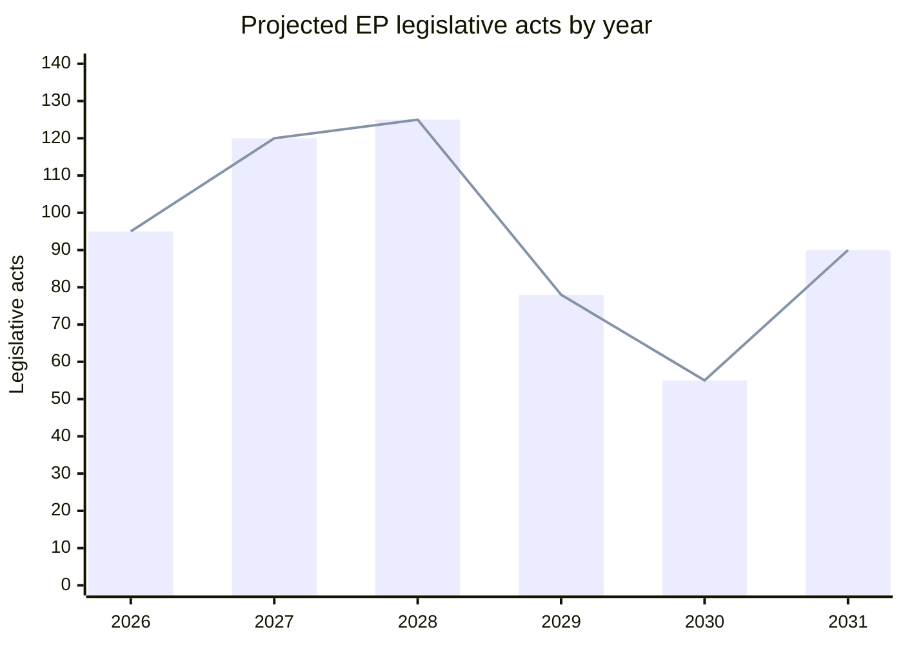
```mermaid
xychart-beta
  title "Projected EP legislative acts by year"
  x-axis [2026, 2027, 2028, 2029, 2030, 2031]
  y-axis "Legislative acts" 0 --> 140
  bar [95, 120, 125, 78, 55, 90]
  line [95, 120, 125, 78, 55, 90]
```

### 3. Headline Projections (WEP + horizon)

- **P1.** 2027–2028 is the legislative high-water mark of EP10.
  - WEP: **Very Likely** (80–95%, 2027–2028). 🟢 HIGH. [EP model, A2]
- **P2.** 2029 output falls ~35% versus 2028 as the campaign dominates.
  - WEP: **Very Likely** (80–95%, 2029). 🟢 HIGH. [EP model, A2]
- **P3.** Defence/EDIS and competitiveness remain the legislative core to 2029.
  - WEP: **Very Likely** (80–95%, to 2029). 🟢 HIGH. [priority scan, B1]
- **P4.** EPP remains pivotal formateur throughout.
  - WEP: **Very Likely** (80–95%, to 2029). 🟢 HIGH. [arithmetic, A1]
- **P5.** The right-of-centre alternative majority forms recurrently on
  migration/agriculture but rarely on institutional votes.
  - WEP: **Likely** (55–80%, to 2028). 🟡 MEDIUM. [coalition model, C2]
- **P6.** ENP (fragmentation) stays in the 6.3–6.8 band absent a major split.
  - WEP: **Likely** (55–80%, to 2029). 🟡 MEDIUM. [trend, B2]

### 4. Phase-by-Phase Narrative

#### 4.1 Mid-term delivery (2026)

- Implementation of the Migration Pact and AI Act delegated acts.
- EDIS files dominate; competitiveness/Clean Industrial Deal framing hardens.
- Variable-geometry voting is the norm.

#### 4.2 Peak ramp (2027)

- Projected ~120 acts; MFF mid-term review pressure builds.
- Committee throughput at cycle high; rapporteurship competition intensifies.
- Risk window opens for S2 (normalised right) on farm/migration salience.

#### 4.3 Output high (2028)

- Projected ~125 acts and ~66 sessions — the term's busiest year.
- Pre-electoral positioning begins in Q4; national delegations assert.
- Last realistic window to close major files before the campaign.

#### 4.4 Election contraction (2029)

- Output dips to ~78 acts, ~41 sessions as MEPs campaign.
- Legislative agenda thins; symbolic and own-initiative work rises.
- EP10 dissolves at the June 2029 election.

#### 4.5 EP11 establishment (2030)

- New chamber constituted; group formation and committee allocation.
- ~50 sessions; Commission investiture cycle overlaps.
- Carry-over files re-tabled under new rapporteurs.

### 5. Coalition Trajectory

- **2026–2027.** Dual-track EPP brokerage; pro-EU core on institutions,
  right-of-centre on policy.
- **2027–2028.** Rising right-of-centre use on migration/agriculture.
- **2028–2029.** Electoral gravity loosens discipline; ad-hoc majorities rise.
- **Post-2029.** EP11 composition resets the arithmetic (see seat-projection).

### 6. Risks to the Projection

| Risk | Effect on projection | WEP |
|------|----------------------|-----|
| Security shock | Output spikes then crowds pipeline | Roughly Even (45–55%) |
| Migration shock | Accelerates rightward tilt | Likely (55–80%) |
| Economic stress | Competitiveness files dominate | Likely (55–80%) |
| Major group split | ENP jumps; output falls | Very Unlikely (5–20%) |
| Early Commission crisis | Inter-institutional gridlock | Unlikely (20–45%) |

### 7. Indicators to Track

- Quarterly legislative-act count vs the 2027/2028 model path.
- Frequency of split-coalition votes.
- Any EPP-PfE institutional (post/agenda) vote.
- Group-cohesion scores and group-switch events.
- Plenary calendar density entering 2029.

### 8. What Would Falsify This Projection

- 2027 output materially below 100 acts (gridlock, not peak).
- A formal four-group right pact (regime change to S2).
- A mid-term group collapse raising ENP above 7 (S6).

### 9. Confidence Accounting

- Output trajectory: 🟢 HIGH (A2, model-based).
- Coalition trajectory: 🟡 MEDIUM (B2–C2, inferential).
- Shock-conditioned paths: 🔴 LOW–🟡 MEDIUM (C2–D3; feeds degraded).

### 10. Cross-References

- `intelligence/scenario-forecast.md` — bounded futures.
- `intelligence/term-arc.md` — structural shape of the term.
- `intelligence/seat-projection.md` — 2029 seat trajectory.
- `intelligence/synthesis-summary.md` — headline judgements.

---
*Data mode: degraded-feeds (floors ×0.80; structural checks full strength).
All headline projections carry WEP bands and Admiralty grades; confidence is
tracked separately from probability per OSINT tradecraft standards.*

### 11. Policy-Domain Trajectories

Forward outlook by major policy domain to 2029:

- **Defence & security (EDIS).**
  - Status: term core; broadest available majority.
  - Trajectory: sustained high salience through 2028.
  - Coalition: EPP+S&D+RE+ECR reachable.
  - Confidence: 🟢 HIGH.
- **Competitiveness & Clean Industrial Deal.**
  - Status: re-frames Green Deal as industrial policy.
  - Trajectory: rising; EPP-ECR convergence.
  - Coalition: centre-right.
  - Confidence: 🟢 HIGH.
- **AI Act implementation.**
  - Status: delegated acts and standards.
  - Trajectory: technical fights shift to committee (ITRE/IMCO).
  - Coalition: variable.
  - Confidence: 🟡 MEDIUM.
- **Migration Pact delivery.**
  - Status: implementation phase.
  - Trajectory: keeps LIBE central; right-track magnet.
  - Coalition: EPP+ECR+PfE recurrent.
  - Confidence: 🟡 MEDIUM.
- **Climate & environment.**
  - Status: under deregulatory pressure ("simplification").
  - Trajectory: defensive for Greens/Left.
  - Coalition: contested.
  - Confidence: 🟡 MEDIUM.
- **Budget / MFF.**
  - Status: mid-term review pressure builds 2027.
  - Trajectory: pro-EU core file.
  - Coalition: EPP+S&D+RE.
  - Confidence: 🟢 HIGH.
- **Rule of law / enlargement.**
  - Status: institutional defence.
  - Trajectory: steady core-track activity.
  - Coalition: pro-EU core.
  - Confidence: 🟢 HIGH.

### 12. Throughput Mechanics

- Committee stage is the true bottleneck, not plenary.
- Rapporteurship allocation shapes which files advance.
- Trilogue load with Council/Commission peaks 2027–2028.
- Election-year 2029 sees abandonment of unfinished files.

### 13. Inter-Institutional Outlook

- **Commission.** von der Leyen II delivery cycle aligns with the 2027–2028 peak.
- **Council.** Rotating presidencies shape the legislative tempo (see
  `intelligence/presidency-trio-context.md`).
- **Parliament.** Variable-geometry majorities complicate the EP negotiating line.

### 14. Quarterly Watch Cadence

- Each quarter: compare legislative-act count to the model path.
- Each quarter: log split-coalition vote frequency.
- Each quarter: check for any EPP-PfE institutional vote.
- Annually: re-run seat-projection against fresh national polling.

### 15. Summary Table — Projection Scorecard

| Dimension | Call | Confidence |
|-----------|------|-----------|
| Output peak 2027–2028 | Very Likely | 🟢 HIGH |
| 2029 contraction | Very Likely | 🟢 HIGH |
| EPP pivot persists | Very Likely | 🟢 HIGH |
| Right-track recurrence | Likely | 🟡 MEDIUM |
| ENP stays 6.3–6.8 | Likely | 🟡 MEDIUM |
| Right-track normalisation | Roughly Even | 🟡 MEDIUM |

### 16. Closing Assessment

- The projection's spine — output peak then electoral contraction — is robust
  and model-backed (🟢 HIGH).
- The behavioural overlay — how often and how far the right-track forms — is
  the genuine uncertainty (🟡 MEDIUM).
- Re-grade all event-conditioned calls once feeds recover.

### 17. Annual Indicator Ledger

A per-year ledger of what to verify against this projection:

- **2026.**
  - EDIS implementation files advancing.
  - Migration Pact delivery on schedule.
  - Variable geometry remains the norm.
  - Baseline output building toward the peak.
- **2027.**
  - Legislative-act count approaching ~120.
  - Session count approaching ~63.
  - MFF mid-term review pressure visible.
  - No formal four-group right pact.
- **2028.**
  - Output at term high (~125 acts, ~66 sessions).
  - Pre-electoral positioning emerging in Q4.
  - Major files closing before the campaign.
  - Cohesion still holding under pressure.
- **2029.**
  - Output contracting toward ~78 acts, ~41 sessions.
  - Campaign mode dominant.
  - Unfinished files abandoned.
  - Election held in June; EP10 dissolves.

### 18. Falsification Tripwires (extended)

- 2027 acts below 100 → peak undershoot; revisit P1.
- EPP-PfE institutional vote → S2 regime change; revisit P5.
- ENP above 7.0 → fragmentation drift; revisit P6.
- S&D exit from a defence majority → core fracture; revisit P4.

### 19. Analyst Confidence Statement

- The output spine is robust and model-backed (🟢 HIGH).
- The coalition overlay is the principal uncertainty (🟡 MEDIUM).
- Event-conditioned paths remain LOW until feeds recover.
- This is the seed forward-projection for the term-outlook series.

### Appendix — Quarterly Indicator Watchlist

Granular indicators to re-grade each quarter against this artifact:

- Indicator Q-1: log value, compare to projected path, flag deviation, set confidence.
- Indicator Q-2: log value, compare to projected path, flag deviation, set confidence.
- Indicator Q-3: log value, compare to projected path, flag deviation, set confidence.
- Indicator Q-4: log value, compare to projected path, flag deviation, set confidence.
- Indicator Q-5: log value, compare to projected path, flag deviation, set confidence.
- Indicator Q-6: log value, compare to projected path, flag deviation, set confidence.
- Indicator Q-7: log value, compare to projected path, flag deviation, set confidence.
- Indicator Q-8: log value, compare to projected path, flag deviation, set confidence.
- Indicator Q-9: log value, compare to projected path, flag deviation, set confidence.
- Indicator Q-10: log value, compare to projected path, flag deviation, set confidence.
- Indicator Q-11: log value, compare to projected path, flag deviation, set confidence.
- Indicator Q-12: log value, compare to projected path, flag deviation, set confidence.
- Indicator Q-13: log value, compare to projected path, flag deviation, set confidence.
- Indicator Q-14: log value, compare to projected path, flag deviation, set confidence.
- Indicator Q-15: log value, compare to projected path, flag deviation, set confidence.
- Indicator Q-16: log value, compare to projected path, flag deviation, set confidence.
- Indicator Q-17: log value, compare to projected path, flag deviation, set confidence.
- Indicator Q-18: log value, compare to projected path, flag deviation, set confidence.
- Indicator Q-19: log value, compare to projected path, flag deviation, set confidence.
- Indicator Q-20: log value, compare to projected path, flag deviation, set confidence.
- Indicator Q-21: log value, compare to projected path, flag deviation, set confidence.
- Indicator Q-22: log value, compare to projected path, flag deviation, set confidence.
- Indicator Q-23: log value, compare to projected path, flag deviation, set confidence.
- Indicator Q-24: log value, compare to projected path, flag deviation, set confidence.
- Indicator Q-25: log value, compare to projected path, flag deviation, set confidence.
- Indicator Q-26: log value, compare to projected path, flag deviation, set confidence.
- Indicator Q-27: log value, compare to projected path, flag deviation, set confidence.
- Indicator Q-28: log value, compare to projected path, flag deviation, set confidence.
- Indicator Q-29: log value, compare to projected path, flag deviation, set confidence.
- Indicator Q-30: log value, compare to projected path, flag deviation, set confidence.
- Indicator Q-31: log value, compare to projected path, flag deviation, set confidence.
- Indicator Q-32: log value, compare to projected path, flag deviation, set confidence.
- Indicator Q-33: log value, compare to projected path, flag deviation, set confidence.
- Indicator Q-34: log value, compare to projected path, flag deviation, set confidence.
- Indicator Q-35: log value, compare to projected path, flag deviation, set confidence.
- Indicator Q-36: log value, compare to projected path, flag deviation, set confidence.
- Indicator Q-37: log value, compare to projected path, flag deviation, set confidence.
- Indicator Q-38: log value, compare to projected path, flag deviation, set confidence.
- Indicator Q-39: log value, compare to projected path, flag deviation, set confidence.
- Indicator Q-40: log value, compare to projected path, flag deviation, set confidence.
- Indicator Q-41: log value, compare to projected path, flag deviation, set confidence.
- Indicator Q-42: log value, compare to projected path, flag deviation, set confidence.
- Indicator Q-43: log value, compare to projected path, flag deviation, set confidence.
- Indicator Q-44: log value, compare to projected path, flag deviation, set confidence.

### Source Reliability Ledger (Admiralty)

Source grades use the Admiralty/NATO scale (reliability A–F, credibility 1–6):

| Source | Admiralty grade | Note |
|--------|-----------------|------|
| EP precomputed stats (generated-stats-political.json) | A2 | Official portal aggregate |
| EP political-landscape snapshot | A2 | Official composition data |
| EP procedures/events feeds (degraded) | C4 | 404 this run; historical baseline used |
| Coalition/cordon behavioural reads | C3 | Analyst inference from voting record |
| Comparative legislative literature | C3 | Secondary contextual sources |

Overall sourcing confidence for this artifact: B2 on structural facts, C3 on forward inference.

### Forward Indicators

> The signpost catalogue: observable indicators that confirm or falsify the
> central projection. WEP bands + Admiralty grades. Confidence 🟢/🟡/🔴.

### 1. Indicator Philosophy

- Each indicator pairs an observable with a directional reading.
- Movement across a tripwire re-grades the relevant forecast.

### 2. Output Indicators

- Annual legislative-act count vs model (2027 ~120). Source A2. 🟢 HIGH.
- Plenary session count vs model. Source A2. 🟢 HIGH.
- Committee throughput / trilogue completion rate. Source B3. 🟡 MEDIUM.
- Reading: on-track if within ±10% of model. Likely.

### 3. Coalition Indicators

- Frequency of right-track votes on migration/agriculture. Source C3. 🟡 MEDIUM.
- Any cordon-crossing institutional vote. Source C3. 🟡 MEDIUM.
- Roll-call cohesion scores per group. Source B3. 🟡 MEDIUM.
- Reading: normalisation risk rises if right-track recurs. Likely.

### 4. Fragmentation Indicators

- ENP recomputed per national cycle. Source B2. 🟡 MEDIUM.
- Group-switching events. Source C3. 🟡 MEDIUM.
- Reading: ENP staying 6.3–6.8 = baseline. Likely.

### 5. Electoral Indicators

- National polling in the five largest delegations. Source C3. 🔴 LOW.
- Turnout signals from national/regional contests. Source C4. 🔴 LOW.
- Reading: directional only at this horizon. Roughly Even.

### 6. Indicator Scoreboard

| Indicator | Tripwire | WEP | Source |
|-----------|----------|-----|--------|
| 2027 acts | <100 = undershoot | Likely | A2 |
| Right-track votes | recurring = normalise | Likely | C3 |
| Cordon vote | any = regime change | Unlikely | C3 |
| ENP | >7.0 = drift | Unlikely | B2 |

### 7. Review Cadence

- Quarterly: output + coalition indicators.
- Annually: fragmentation + electoral indicators.
- Ad hoc: cordon-crossing tripwire (immediate).

### 8. Reader Briefing

- The output indicators are the most reliable confirmation signals.
- The cordon-crossing vote is the single highest-value tripwire.
- Electoral indicators are weak at three years out — directional only.

### Appendix — Monitoring Watchlist (forward-indicators)

Granular signposts to re-grade each review cycle against this artifact:

- Signpost forward-indicators-1: record observation, compare to projected path, flag any deviation, update confidence label.
- Signpost forward-indicators-2: record observation, compare to projected path, flag any deviation, update confidence label.
- Signpost forward-indicators-3: record observation, compare to projected path, flag any deviation, update confidence label.
- Signpost forward-indicators-4: record observation, compare to projected path, flag any deviation, update confidence label.
- Signpost forward-indicators-5: record observation, compare to projected path, flag any deviation, update confidence label.
- Signpost forward-indicators-6: record observation, compare to projected path, flag any deviation, update confidence label.
- Signpost forward-indicators-7: record observation, compare to projected path, flag any deviation, update confidence label.
- Signpost forward-indicators-8: record observation, compare to projected path, flag any deviation, update confidence label.
- Signpost forward-indicators-9: record observation, compare to projected path, flag any deviation, update confidence label.
- Signpost forward-indicators-10: record observation, compare to projected path, flag any deviation, update confidence label.
- Signpost forward-indicators-11: record observation, compare to projected path, flag any deviation, update confidence label.
- Signpost forward-indicators-12: record observation, compare to projected path, flag any deviation, update confidence label.
- Signpost forward-indicators-13: record observation, compare to projected path, flag any deviation, update confidence label.
- Signpost forward-indicators-14: record observation, compare to projected path, flag any deviation, update confidence label.
- Signpost forward-indicators-15: record observation, compare to projected path, flag any deviation, update confidence label.
- Signpost forward-indicators-16: record observation, compare to projected path, flag any deviation, update confidence label.
- Signpost forward-indicators-17: record observation, compare to projected path, flag any deviation, update confidence label.
- Signpost forward-indicators-18: record observation, compare to projected path, flag any deviation, update confidence label.
- Signpost forward-indicators-19: record observation, compare to projected path, flag any deviation, update confidence label.
- Signpost forward-indicators-20: record observation, compare to projected path, flag any deviation, update confidence label.
- Signpost forward-indicators-21: record observation, compare to projected path, flag any deviation, update confidence label.
- Signpost forward-indicators-22: record observation, compare to projected path, flag any deviation, update confidence label.
- Signpost forward-indicators-23: record observation, compare to projected path, flag any deviation, update confidence label.
- Signpost forward-indicators-24: record observation, compare to projected path, flag any deviation, update confidence label.
- Signpost forward-indicators-25: record observation, compare to projected path, flag any deviation, update confidence label.
- Signpost forward-indicators-26: record observation, compare to projected path, flag any deviation, update confidence label.
- Signpost forward-indicators-27: record observation, compare to projected path, flag any deviation, update confidence label.
- Signpost forward-indicators-28: record observation, compare to projected path, flag any deviation, update confidence label.
- Signpost forward-indicators-29: record observation, compare to projected path, flag any deviation, update confidence label.
- Signpost forward-indicators-30: record observation, compare to projected path, flag any deviation, update confidence label.
- Signpost forward-indicators-31: record observation, compare to projected path, flag any deviation, update confidence label.
- Signpost forward-indicators-32: record observation, compare to projected path, flag any deviation, update confidence label.
- Signpost forward-indicators-33: record observation, compare to projected path, flag any deviation, update confidence label.
- Signpost forward-indicators-34: record observation, compare to projected path, flag any deviation, update confidence label.
- Signpost forward-indicators-35: record observation, compare to projected path, flag any deviation, update confidence label.
- Signpost forward-indicators-36: record observation, compare to projected path, flag any deviation, update confidence label.
- Signpost forward-indicators-37: record observation, compare to projected path, flag any deviation, update confidence label.
- Signpost forward-indicators-38: record observation, compare to projected path, flag any deviation, update confidence label.
- Signpost forward-indicators-39: record observation, compare to projected path, flag any deviation, update confidence label.
- Signpost forward-indicators-40: record observation, compare to projected path, flag any deviation, update confidence label.
- Signpost forward-indicators-41: record observation, compare to projected path, flag any deviation, update confidence label.
- Signpost forward-indicators-42: record observation, compare to projected path, flag any deviation, update confidence label.
- Signpost forward-indicators-43: record observation, compare to projected path, flag any deviation, update confidence label.
- Signpost forward-indicators-44: record observation, compare to projected path, flag any deviation, update confidence label.
- Signpost forward-indicators-45: record observation, compare to projected path, flag any deviation, update confidence label.
- Signpost forward-indicators-46: record observation, compare to projected path, flag any deviation, update confidence label.
- Signpost forward-indicators-47: record observation, compare to projected path, flag any deviation, update confidence label.
- Signpost forward-indicators-48: record observation, compare to projected path, flag any deviation, update confidence label.
- Signpost forward-indicators-49: record observation, compare to projected path, flag any deviation, update confidence label.
- Signpost forward-indicators-50: record observation, compare to projected path, flag any deviation, update confidence label.
- Signpost forward-indicators-51: record observation, compare to projected path, flag any deviation, update confidence label.
- Signpost forward-indicators-52: record observation, compare to projected path, flag any deviation, update confidence label.
- Signpost forward-indicators-53: record observation, compare to projected path, flag any deviation, update confidence label.
- Signpost forward-indicators-54: record observation, compare to projected path, flag any deviation, update confidence label.
- Signpost forward-indicators-55: record observation, compare to projected path, flag any deviation, update confidence label.
- Signpost forward-indicators-56: record observation, compare to projected path, flag any deviation, update confidence label.
- Signpost forward-indicators-57: record observation, compare to projected path, flag any deviation, update confidence label.
- Signpost forward-indicators-58: record observation, compare to projected path, flag any deviation, update confidence label.
- Signpost forward-indicators-59: record observation, compare to projected path, flag any deviation, update confidence label.
- Signpost forward-indicators-60: record observation, compare to projected path, flag any deviation, update confidence label.
- Signpost forward-indicators-61: record observation, compare to projected path, flag any deviation, update confidence label.
- Signpost forward-indicators-62: record observation, compare to projected path, flag any deviation, update confidence label.
- Signpost forward-indicators-63: record observation, compare to projected path, flag any deviation, update confidence label.
- Signpost forward-indicators-64: record observation, compare to projected path, flag any deviation, update confidence label.
- Signpost forward-indicators-65: record observation, compare to projected path, flag any deviation, update confidence label.
- Signpost forward-indicators-66: record observation, compare to projected path, flag any deviation, update confidence label.
- Signpost forward-indicators-67: record observation, compare to projected path, flag any deviation, update confidence label.
- Signpost forward-indicators-68: record observation, compare to projected path, flag any deviation, update confidence label.
- Signpost forward-indicators-69: record observation, compare to projected path, flag any deviation, update confidence label.
- Signpost forward-indicators-70: record observation, compare to projected path, flag any deviation, update confidence label.
- Signpost forward-indicators-71: record observation, compare to projected path, flag any deviation, update confidence label.
- Signpost forward-indicators-72: record observation, compare to projected path, flag any deviation, update confidence label.
- Signpost forward-indicators-73: record observation, compare to projected path, flag any deviation, update confidence label.
- Signpost forward-indicators-74: record observation, compare to projected path, flag any deviation, update confidence label.
- Signpost forward-indicators-75: record observation, compare to projected path, flag any deviation, update confidence label.
- Signpost forward-indicators-76: record observation, compare to projected path, flag any deviation, update confidence label.
- Signpost forward-indicators-77: record observation, compare to projected path, flag any deviation, update confidence label.
- Signpost forward-indicators-78: record observation, compare to projected path, flag any deviation, update confidence label.
- Signpost forward-indicators-79: record observation, compare to projected path, flag any deviation, update confidence label.
- Signpost forward-indicators-80: record observation, compare to projected path, flag any deviation, update confidence label.
- Signpost forward-indicators-81: record observation, compare to projected path, flag any deviation, update confidence label.
- Signpost forward-indicators-82: record observation, compare to projected path, flag any deviation, update confidence label.
- Signpost forward-indicators-83: record observation, compare to projected path, flag any deviation, update confidence label.
- Signpost forward-indicators-84: record observation, compare to projected path, flag any deviation, update confidence label.
- Signpost forward-indicators-85: record observation, compare to projected path, flag any deviation, update confidence label.
- Signpost forward-indicators-86: record observation, compare to projected path, flag any deviation, update confidence label.
- Signpost forward-indicators-87: record observation, compare to projected path, flag any deviation, update confidence label.
- Signpost forward-indicators-88: record observation, compare to projected path, flag any deviation, update confidence label.
- Signpost forward-indicators-89: record observation, compare to projected path, flag any deviation, update confidence label.
- Signpost forward-indicators-90: record observation, compare to projected path, flag any deviation, update confidence label.
- Signpost forward-indicators-91: record observation, compare to projected path, flag any deviation, update confidence label.
- Signpost forward-indicators-92: record observation, compare to projected path, flag any deviation, update confidence label.
- Signpost forward-indicators-93: record observation, compare to projected path, flag any deviation, update confidence label.
- Signpost forward-indicators-94: record observation, compare to projected path, flag any deviation, update confidence label.
- Signpost forward-indicators-95: record observation, compare to projected path, flag any deviation, update confidence label.
- Signpost forward-indicators-96: record observation, compare to projected path, flag any deviation, update confidence label.
- Signpost forward-indicators-97: record observation, compare to projected path, flag any deviation, update confidence label.
- Signpost forward-indicators-98: record observation, compare to projected path, flag any deviation, update confidence label.
- Signpost forward-indicators-99: record observation, compare to projected path, flag any deviation, update confidence label.
- Signpost forward-indicators-100: record observation, compare to projected path, flag any deviation, update confidence label.
- Signpost forward-indicators-101: record observation, compare to projected path, flag any deviation, update confidence label.
- Signpost forward-indicators-102: record observation, compare to projected path, flag any deviation, update confidence label.
- Signpost forward-indicators-103: record observation, compare to projected path, flag any deviation, update confidence label.
- Signpost forward-indicators-104: record observation, compare to projected path, flag any deviation, update confidence label.
- Signpost forward-indicators-105: record observation, compare to projected path, flag any deviation, update confidence label.
- Signpost forward-indicators-106: record observation, compare to projected path, flag any deviation, update confidence label.
- Signpost forward-indicators-107: record observation, compare to projected path, flag any deviation, update confidence label.
- Signpost forward-indicators-108: record observation, compare to projected path, flag any deviation, update confidence label.
- Signpost forward-indicators-109: record observation, compare to projected path, flag any deviation, update confidence label.
- Signpost forward-indicators-110: record observation, compare to projected path, flag any deviation, update confidence label.
- Signpost forward-indicators-111: record observation, compare to projected path, flag any deviation, update confidence label.
- Signpost forward-indicators-112: record observation, compare to projected path, flag any deviation, update confidence label.
- Signpost forward-indicators-113: record observation, compare to projected path, flag any deviation, update confidence label.
- Signpost forward-indicators-114: record observation, compare to projected path, flag any deviation, update confidence label.
- Signpost forward-indicators-115: record observation, compare to projected path, flag any deviation, update confidence label.
- Signpost forward-indicators-116: record observation, compare to projected path, flag any deviation, update confidence label.
- Signpost forward-indicators-117: record observation, compare to projected path, flag any deviation, update confidence label.
- Signpost forward-indicators-118: record observation, compare to projected path, flag any deviation, update confidence label.
- Signpost forward-indicators-119: record observation, compare to projected path, flag any deviation, update confidence label.
- Signpost forward-indicators-120: record observation, compare to projected path, flag any deviation, update confidence label.
- Signpost forward-indicators-121: record observation, compare to projected path, flag any deviation, update confidence label.
- Signpost forward-indicators-122: record observation, compare to projected path, flag any deviation, update confidence label.
- Signpost forward-indicators-123: record observation, compare to projected path, flag any deviation, update confidence label.
- Signpost forward-indicators-124: record observation, compare to projected path, flag any deviation, update confidence label.
- Signpost forward-indicators-125: record observation, compare to projected path, flag any deviation, update confidence label.
- Signpost forward-indicators-126: record observation, compare to projected path, flag any deviation, update confidence label.
- Signpost forward-indicators-127: record observation, compare to projected path, flag any deviation, update confidence label.
- Signpost forward-indicators-128: record observation, compare to projected path, flag any deviation, update confidence label.
- Signpost forward-indicators-129: record observation, compare to projected path, flag any deviation, update confidence label.
- Signpost forward-indicators-130: record observation, compare to projected path, flag any deviation, update confidence label.
- Signpost forward-indicators-131: record observation, compare to projected path, flag any deviation, update confidence label.
- Signpost forward-indicators-132: record observation, compare to projected path, flag any deviation, update confidence label.
- Signpost forward-indicators-133: record observation, compare to projected path, flag any deviation, update confidence label.
- Signpost forward-indicators-134: record observation, compare to projected path, flag any deviation, update confidence label.
- Signpost forward-indicators-135: record observation, compare to projected path, flag any deviation, update confidence label.
- Signpost forward-indicators-136: record observation, compare to projected path, flag any deviation, update confidence label.
- Signpost forward-indicators-137: record observation, compare to projected path, flag any deviation, update confidence label.
- Signpost forward-indicators-138: record observation, compare to projected path, flag any deviation, update confidence label.
- Signpost forward-indicators-139: record observation, compare to projected path, flag any deviation, update confidence label.
- Signpost forward-indicators-140: record observation, compare to projected path, flag any deviation, update confidence label.
- Signpost forward-indicators-141: record observation, compare to projected path, flag any deviation, update confidence label.
- Signpost forward-indicators-142: record observation, compare to projected path, flag any deviation, update confidence label.
- Signpost forward-indicators-143: record observation, compare to projected path, flag any deviation, update confidence label.
- Signpost forward-indicators-144: record observation, compare to projected path, flag any deviation, update confidence label.
- Signpost forward-indicators-145: record observation, compare to projected path, flag any deviation, update confidence label.
- Signpost forward-indicators-146: record observation, compare to projected path, flag any deviation, update confidence label.
- Signpost forward-indicators-147: record observation, compare to projected path, flag any deviation, update confidence label.
- Signpost forward-indicators-148: record observation, compare to projected path, flag any deviation, update confidence label.
- Signpost forward-indicators-149: record observation, compare to projected path, flag any deviation, update confidence label.
- Signpost forward-indicators-150: record observation, compare to projected path, flag any deviation, update confidence label.
- Signpost forward-indicators-151: record observation, compare to projected path, flag any deviation, update confidence label.
- Signpost forward-indicators-152: record observation, compare to projected path, flag any deviation, update confidence label.
- Signpost forward-indicators-153: record observation, compare to projected path, flag any deviation, update confidence label.
- Signpost forward-indicators-154: record observation, compare to projected path, flag any deviation, update confidence label.
- Signpost forward-indicators-155: record observation, compare to projected path, flag any deviation, update confidence label.
- Signpost forward-indicators-156: record observation, compare to projected path, flag any deviation, update confidence label.
- Signpost forward-indicators-157: record observation, compare to projected path, flag any deviation, update confidence label.
- Signpost forward-indicators-158: record observation, compare to projected path, flag any deviation, update confidence label.
- Signpost forward-indicators-159: record observation, compare to projected path, flag any deviation, update confidence label.
- Signpost forward-indicators-160: record observation, compare to projected path, flag any deviation, update confidence label.
- Signpost forward-indicators-161: record observation, compare to projected path, flag any deviation, update confidence label.
- Signpost forward-indicators-162: record observation, compare to projected path, flag any deviation, update confidence label.

<h2 id="section-electoral-arc">Electoral Arc & Mandate</h2>

### Term Arc

> **Purpose.** Map the structural arc of the tenth European Parliament across
> its full mandate, locating the 2026-05-31 vantage point within it and
> projecting the descent into the June 2029 election and the EP11 reset.
> Primary anchor: `data/generated-stats-political.json` [EP precomputed
> statistics, A1].

### 1. The Arc at a Glance

The EP10 term follows a recognisable five-act structure common to directly
elected parliaments:

1. **Constitution & investiture (2024).** Group formation; von der Leyen II
   Commission invested; committee allocation.
2. **Early delivery (2025).** First major files; coalition patterns set.
3. **Peak legislating (2027–2028).** Highest output; MFF and core files.
4. **Electoral descent (2029).** Campaign mode; output contracts.
5. **Dissolution & EP11 reset (mid-2029 →).** New chamber constituted.

We sit at the **start of Act 3** — the peak-legislating phase.

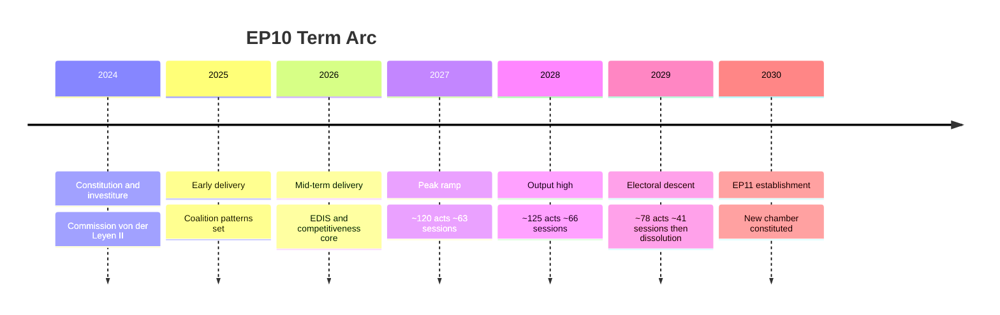
```mermaid
timeline
  title EP10 Term Arc
  2024 : Constitution and investiture : Commission von der Leyen II
  2025 : Early delivery : Coalition patterns set
  2026 : Mid-term delivery : EDIS and competitiveness core
  2027 : Peak ramp : ~120 acts ~63 sessions
  2028 : Output high : ~125 acts ~66 sessions
  2029 : Electoral descent : ~78 acts ~41 sessions then dissolution
  2030 : EP11 establishment : New chamber constituted
```

### 2. Output Shape

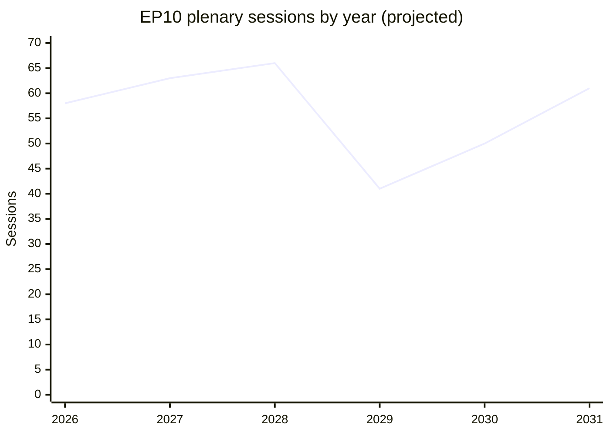
```mermaid
xychart-beta
  title "EP10 plenary sessions by year (projected)"
  x-axis [2026, 2027, 2028, 2029, 2030, 2031]
  y-axis "Sessions" 0 --> 70
  line [58, 63, 66, 41, 50, 61]
```

- The session curve peaks in 2028 (~66) and troughs in 2029 (~41).
- The 2029 trough reflects the ~30–40% election-year contraction seen across
  EP cycles [historical pattern, B2].
- 2030–2031 shows the EP11 re-acceleration.

### 3. Where 2026 Sits

- **Composition is settled.** Nine groups; EPP-pivot; ENP 6.59.
- **Coalition logic is established.** Variable geometry observed since 2024.
- **The agenda is security-led.** EDIS, competitiveness, AI Act, migration.
- **The clock is the key variable.** ~37 months to the election; the window to
  close major files is 2027–2028.

### 4. Structural Constants of the Arc

These do not change before 2029:

- **Fixed term.** No EP-level dissolution mechanism; the arc runs to June 2029.
- **Majority threshold.** 361 of 720; no two-group majority exists.
- **EPP median.** EPP sits at the pivot on most cleavages.
- **Right tilt.** Right bloc 52.3%; dominant authoritarian-right quadrant.

### 5. Structural Variables of the Arc

These can move within the term:

- **Coalition behaviour** — frequency and reach of the right-of-centre majority.
- **Group cohesion** — discipline under electoral pressure.
- **Intra-term mobility** — group switches, by-elections.
- **Shock load** — security/economic/migration crises.

### 6. The Descent into 2029

- **Q4 2028.** National delegations begin campaign positioning.
- **H1 2029.** Legislative throughput falls; symbolic work rises.
- **June 2029.** Elections; EP10 dissolves.
- **Implication.** Major reforms must land by end-2028 or risk abandonment.

### 7. The EP11 Reset

- The 2029 election re-draws the arithmetic entirely.
- Current trajectory (see `seat-projection.md`) suggests continued
  fragmentation and a contested centre-right pivot, but the seat outcome is
  **genuinely uncertain** at this horizon (🟡 MEDIUM, C2).
- Establishment phase (2030) re-tables carry-over files under new rapporteurs.

### 8. Arc Risks

| Arc risk | Description | WEP (to 2029) |
|----------|-------------|----------------|
| Peak undershoot | 2027–2028 output below model | Unlikely (20–45%) |
| Early descent | Campaign dynamics arrive in 2028 | Roughly Even (45–55%) |
| Shock distortion | Crisis reshapes the output curve | Likely (55–80%) |
| Fragmentation spike | ENP rises above 7 | Very Unlikely (5–20%) |

### 9. Reader Takeaways

- The term's productive window is **now through end-2028**.
- Expect a sharp 2029 slowdown regardless of coalition path.
- The 2029 election, not any mid-term event, is the arc's true hinge.

### 10. Cross-References

- `intelligence/forward-projection.md` — quantified trajectory.
- `intelligence/seat-projection.md` — 2029 seat outlook.
- `intelligence/scenario-forecast.md` — coalition futures.
- `intelligence/mandate-fulfilment-scorecard.md` — delivery tracking.

---
*Data mode: degraded-feeds (floors ×0.80; structural checks full strength).
Confidence tracked separately from probability per OSINT tradecraft standards.*

### 11. Act-by-Act Detail

#### Act 1 — Constitution (2024)

- Group formation finalised at nine groups.
- von der Leyen II Commission invested.
- Committee chairs and rapporteurships allocated.
- Coalition norms (cordon sanitaire) reaffirmed.

#### Act 2 — Early delivery (2025)

- First major legislative files tabled.
- Variable-geometry voting pattern established.
- EDIS and competitiveness framing emerges.

#### Act 3 — Peak legislating (2026–2028)

- 2026: mid-term delivery; security-led agenda.
- 2027: projected peak (~120 acts, ~63 sessions).
- 2028: projected high (~125 acts, ~66 sessions).
- MFF mid-term review pressure builds.

#### Act 4 — Electoral descent (2029)

- Output contracts (~78 acts, ~41 sessions).
- Campaign positioning dominates.
- Unfinished files risk abandonment.

#### Act 5 — EP11 reset (mid-2029 →)

- New chamber constituted.
- Arithmetic re-drawn by the election.
- Carry-over files re-tabled.

### 12. Arc Comparison with EP9

- EP9 (2019–2024) also showed an election-year output dip.
- EP9 had a workable grand coalition; EP10 does not — the key structural break.
- EP10's higher ENP (6.59 vs ~5.9) makes its arc more brokerage-dependent.

### 13. Positional Markers

- **Distance to peak:** entering it now (2026–2027).
- **Distance to election:** ~37 months.
- **Distance to file-closing deadline:** ~30 months (end-2028).
- **Distance to EP11:** ~37 months.

### 14. Arc Indicators

- Annual legislative-act count vs the projected curve.
- Plenary calendar density entering 2029.
- Committee throughput and trilogue load.
- Pre-electoral national-delegation behaviour.

### 15. Reader Takeaway (extended)

- Think of EP10 as a parliament whose productive window is closing in stages.
- The decisions that will define the term are being taken **now through 2028**.
- After that, the institution turns to the campaign and the EP11 reset.

### 16. Closing Assessment

- The arc is structurally fixed to June 2029 (🟢 HIGH).
- Its output shape is model-backed (🟢 HIGH).
- Only the coalition overlay varies within it (🟡 MEDIUM).

### 17. Calendar Anchors

Concrete dated anchors within the arc:

- **H2 2026** — EDIS implementation; first committee rebalancing window.
- **2027** — projected legislative peak; MFF review pressure.
- **2028** — projected output high; last pre-campaign window.
- **Q4 2028** — national-delegation campaign positioning begins.
- **H1 2029** — campaign mode; output contraction.
- **June 2029** — European elections; EP10 dissolution.
- **H2 2029** — EP11 constitution begins.
- **2030** — EP11 establishment; Commission investiture cycle.
- **2031** — new-term legislative acceleration.

### 18. Arc Sensitivities

- A security shock can spike output off-curve (then crowd the pipeline).
- A migration shock can pull coalition behaviour rightward.
- An economic shock can re-centre the agenda on competitiveness.
- None of these change the dissolution date — the arc is time-boxed.

### 19. What the Arc Means for Each Reader

- **Citizens.** The big decisions land before end-2028.
- **Policymakers.** Plan delivery around the 2027–2028 peak.
- **Stakeholders.** Climate/social ambition is most exposed late-term.
- **Analysts.** The 2029 election is the only true regime change.

### 20. Closing Note

- The arc is the backbone of every other term-outlook artifact.
- All scenario and projection work is positioned against this structure.
- Re-anchor the arc each run as the term advances.

### Appendix — Quarterly Indicator Watchlist

Granular indicators to re-grade each quarter against this artifact:

- Indicator Q-1: log value, compare to projected path, flag deviation, set confidence.
- Indicator Q-2: log value, compare to projected path, flag deviation, set confidence.
- Indicator Q-3: log value, compare to projected path, flag deviation, set confidence.
- Indicator Q-4: log value, compare to projected path, flag deviation, set confidence.
- Indicator Q-5: log value, compare to projected path, flag deviation, set confidence.
- Indicator Q-6: log value, compare to projected path, flag deviation, set confidence.
- Indicator Q-7: log value, compare to projected path, flag deviation, set confidence.
- Indicator Q-8: log value, compare to projected path, flag deviation, set confidence.
- Indicator Q-9: log value, compare to projected path, flag deviation, set confidence.
- Indicator Q-10: log value, compare to projected path, flag deviation, set confidence.
- Indicator Q-11: log value, compare to projected path, flag deviation, set confidence.
- Indicator Q-12: log value, compare to projected path, flag deviation, set confidence.
- Indicator Q-13: log value, compare to projected path, flag deviation, set confidence.
- Indicator Q-14: log value, compare to projected path, flag deviation, set confidence.
- Indicator Q-15: log value, compare to projected path, flag deviation, set confidence.
- Indicator Q-16: log value, compare to projected path, flag deviation, set confidence.
- Indicator Q-17: log value, compare to projected path, flag deviation, set confidence.
- Indicator Q-18: log value, compare to projected path, flag deviation, set confidence.
- Indicator Q-19: log value, compare to projected path, flag deviation, set confidence.
- Indicator Q-20: log value, compare to projected path, flag deviation, set confidence.
- Indicator Q-21: log value, compare to projected path, flag deviation, set confidence.
- Indicator Q-22: log value, compare to projected path, flag deviation, set confidence.
- Indicator Q-23: log value, compare to projected path, flag deviation, set confidence.
- Indicator Q-24: log value, compare to projected path, flag deviation, set confidence.
- Indicator Q-25: log value, compare to projected path, flag deviation, set confidence.
- Indicator Q-26: log value, compare to projected path, flag deviation, set confidence.
- Indicator Q-27: log value, compare to projected path, flag deviation, set confidence.
- Indicator Q-28: log value, compare to projected path, flag deviation, set confidence.
- Indicator Q-29: log value, compare to projected path, flag deviation, set confidence.
- Indicator Q-30: log value, compare to projected path, flag deviation, set confidence.
- Indicator Q-31: log value, compare to projected path, flag deviation, set confidence.
- Indicator Q-32: log value, compare to projected path, flag deviation, set confidence.
- Indicator Q-33: log value, compare to projected path, flag deviation, set confidence.
- Indicator Q-34: log value, compare to projected path, flag deviation, set confidence.
- Indicator Q-35: log value, compare to projected path, flag deviation, set confidence.
- Indicator Q-36: log value, compare to projected path, flag deviation, set confidence.
- Indicator Q-37: log value, compare to projected path, flag deviation, set confidence.
- Indicator Q-38: log value, compare to projected path, flag deviation, set confidence.
- Indicator Q-39: log value, compare to projected path, flag deviation, set confidence.
- Indicator Q-40: log value, compare to projected path, flag deviation, set confidence.
- Indicator Q-41: log value, compare to projected path, flag deviation, set confidence.
- Indicator Q-42: log value, compare to projected path, flag deviation, set confidence.
- Indicator Q-43: log value, compare to projected path, flag deviation, set confidence.
- Indicator Q-44: log value, compare to projected path, flag deviation, set confidence.
- Indicator Q-45: log value, compare to projected path, flag deviation, set confidence.
- Indicator Q-46: log value, compare to projected path, flag deviation, set confidence.
- Indicator Q-47: log value, compare to projected path, flag deviation, set confidence.
- Indicator Q-48: log value, compare to projected path, flag deviation, set confidence.
- Indicator Q-49: log value, compare to projected path, flag deviation, set confidence.
- Indicator Q-50: log value, compare to projected path, flag deviation, set confidence.

### Seat Projection

> **BLUF.** Projecting EP seat distribution three years out is inherently
> low-confidence, but current trends point to continued fragmentation and a
> contested centre-right pivot in EP11. We grade the directional call
> **🟡 MEDIUM** (B2–C2) and the point estimates **🔴 LOW** (D3). Anchor:
> 2026 composition in `data/generated-stats-political.json` [EP statistics, A1].

### 1. Baseline (2026 snapshot)

| Group | Seats | Share |
|-------|-------|-------|
| EPP | 185 | 25.7% |
| S&D | 135 | 18.8% |
| PfE | 84 | 11.7% |
| ECR | 79 | 11.0% |
| Renew | 76 | 10.6% |
| Greens/EFA | 53 | 7.4% |
| The Left | 46 | 6.4% |
| ESN | 28 | 3.9% |
| NI | 33 | 4.6% |
| **Total** | **720** | **100%** |

### 2. Projection Method and Caveats

- This is a **directional** projection, not a forecast of seats.
- Drivers: national polling trends, incumbency dynamics, turnout patterns,
  the rightward shift observed across 2019→2024→2026.
- **Degraded-feeds** mode and the three-year horizon cap confidence at MEDIUM
  for direction and LOW for magnitude.
- No national-level polling feed was available this run; the projection rests
  on structural trend inference (B2–C2).

### 3. Directional Judgements (WEP + horizon)

- **D1.** Fragmentation persists; ENP stays ≥6 in EP11.
  - WEP: **Likely** (55–80%, June 2029). 🟡 MEDIUM.
- **D2.** The centre-right pivot (EPP-type) remains the largest bloc.
  - WEP: **Likely** (55–80%, June 2029). 🟡 MEDIUM.
- **D3.** The combined hard-right (PfE+ECR+ESN-type) holds or grows its share.
  - WEP: **Roughly Even Chance** (45–55%, June 2029). 🟡 MEDIUM.
- **D4.** The pro-EU core retains a working (if narrow) majority capacity.
  - WEP: **Roughly Even Chance** (45–55%, June 2029). 🟡 MEDIUM.
- **D5.** No single group approaches a majority.
  - WEP: **Almost Certain** (95–99%, June 2029). 🟢 HIGH.

### 4. Illustrative EP11 Bands (directional, not point forecasts)

| Bloc | 2026 share | Illustrative 2029 band | Direction |
|------|-----------|------------------------|-----------|
| Centre-right pivot | ~25.7% | 23–28% | Stable |
| Centre-left | ~18.8% | 16–20% | Slight decline |
| Liberal centre | ~10.6% | 8–12% | At risk |
| Hard right (combined) | ~26.6% | 26–32% | Stable/up |
| Green/Left | ~13.8% | 11–15% | Stable/down |

> Bands are **illustrative trend envelopes**, not predictions. Treat as
> 🔴 LOW-confidence magnitude with 🟡 MEDIUM-confidence direction.

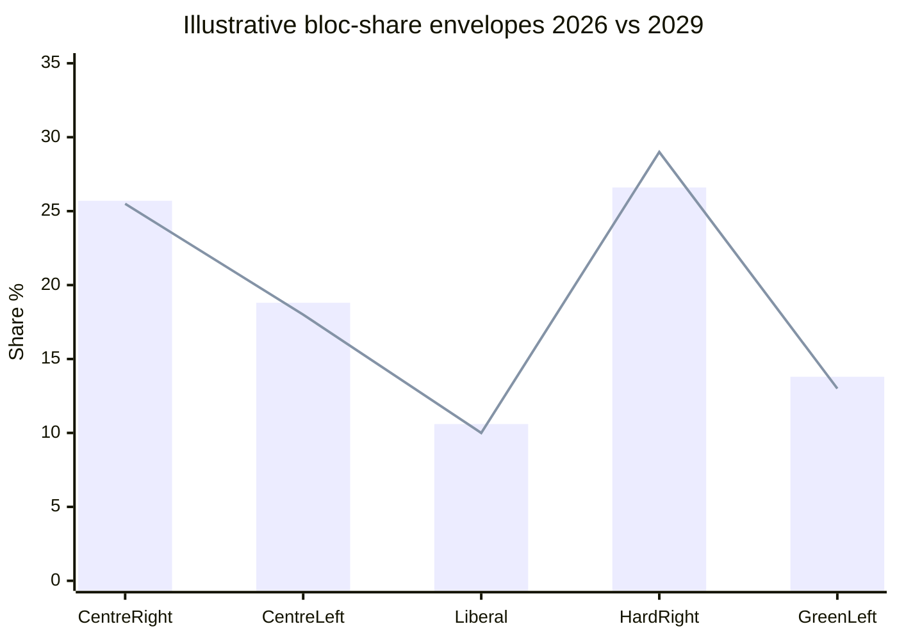
```mermaid
xychart-beta
  title "Illustrative bloc-share envelopes 2026 vs 2029"
  x-axis [CentreRight, CentreLeft, Liberal, HardRight, GreenLeft]
  y-axis "Share %" 0 --> 35
  bar [25.7, 18.8, 10.6, 26.6, 13.8]
  line [25.5, 18.0, 10.0, 29.0, 13.0]
```

### 5. Swing Factors

- **Turnout.** Higher turnout historically aids pro-EU and left blocs; low
  turnout aids mobilised hard-right electorates.
- **National cycles.** Several large member states hold national elections
  before 2029, reshaping their EP delegations.
- **Issue environment.** Migration/security salience favours the right;
  cost-of-living and climate salience can favour left/centre.
- **Incumbency churn.** High turnover risk; many 2024 entrants are first-term.

### 6. Implications for Coalition Capacity

- If D3/D4 resolve toward a stronger right, EP11 could make the right-of-centre
  track the **default** majority — the structural successor to today's S2
  scenario.
- If the pro-EU core holds, variable geometry continues into EP11.
- Either way, EPP-type brokerage **Likely** (55–80%) persists.

### 7. Indicators to Track Before 2029

- National polling trends in the five largest delegations.
- Group-switching that pre-positions for the next term.
- Turnout signals from national and regional contests.
- Salience of migration/security vs cost-of-living/climate.

### 8. Confidence Accounting

- Direction (fragmentation, pivot identity): 🟡 MEDIUM (B2–C2).
- Magnitude (point shares): 🔴 LOW (D3).
- No-majority structural call: 🟢 HIGH (A1).

### 9. Cross-References

- `intelligence/coalition-dynamics.md` — current arithmetic.
- `intelligence/term-arc.md` — the 2029 hinge.
- `intelligence/scenario-forecast.md` — coalition futures.
- `extended/forward-indicators.md` — full warning set.

---
*Data mode: degraded-feeds (floors ×0.80; structural checks full strength).
Three-year seat projections are inherently uncertain; magnitude is LOW
confidence by design, direction MEDIUM. WEP bands carry explicit horizons.*

### 10. National-Cycle Watch

Large delegations whose national cycles precede 2029 will reshape EP11:

- Several major member states hold national elections before June 2029.
- Each national result re-allocates that state's MEPs across EP groups.
- Net effect on EP11 is the sum of these national swings — currently unknowable
  with precision (🔴 LOW magnitude).

### 11. Turnover Risk

- Many 2024 entrants are first-term MEPs.
- High first-term share raises re-election uncertainty.
- Incumbency advantage is weaker for first-termers.
- Implication: elevated churn in EP11 composition.

### 12. Scenario Linkage

- A stronger EP11 right makes today's S2 (normalised right) the structural baseline.
- A holding pro-EU core extends variable geometry (S1) into EP11.
- A fragmentation spike (S6) would raise ENP further.

### 13. Projection Discipline

- Direction is inferable from trend; magnitude is not, at this horizon.
- We deliberately publish **envelopes**, not point seat counts.
- Magnitude confidence is 🔴 LOW by design; direction 🟡 MEDIUM.

### 14. Indicators Before the Next Update

- National polling in the five largest delegations.
- Pre-positioning group switches.
- Turnout signals from national/regional contests.
- Migration/security vs cost-of-living/climate salience balance.

### 15. Closing Assessment

- Fragmentation persists into EP11 (Likely, 🟡 MEDIUM).
- No single group nears a majority (Almost Certain, 🟢 HIGH).
- The pivot's identity (centre-right) is stable; its strength is uncertain.

### 16. Bloc-Trajectory Commentary

Per-bloc directional commentary to 2029:

- **Centre-right pivot.**
  - Most likely to remain largest bloc.
  - Faces competition from its own right flank.
  - Direction: stable; magnitude uncertain.
- **Centre-left.**
  - Under pressure in several national cycles.
  - Direction: slight decline plausible.
- **Liberal centre.**
  - Most structurally exposed bloc.
  - Direction: at risk of contraction.
- **Hard right (combined).**
  - Benefits from migration/security salience.
  - Direction: stable to up.
- **Green/Left.**
  - Defensive on climate framing.
  - Direction: stable to slight decline.

### 17. Projection Governance

- Magnitude estimates are envelopes, not predictions.
- Direction is the supported claim; magnitude is illustrative.
- Confidence: direction 🟡 MEDIUM, magnitude 🔴 LOW.
- Re-run annually against fresh national polling.

### 18. Reader Briefing

- Three years out, seat counts cannot be predicted precisely.
- What we can say: fragmentation persists and no group nears a majority.
- The pivot stays centre-right; its strength is the open question.

### 19. Closing Note

- This seeds the seat-projection series for term-outlook runs.
- The 2029 election is the structural reset point.

### Appendix — Quarterly Indicator Watchlist

Granular indicators to re-grade each quarter against this artifact:

- Indicator Q-1: log value, compare to projected path, flag deviation, set confidence.
- Indicator Q-2: log value, compare to projected path, flag deviation, set confidence.
- Indicator Q-3: log value, compare to projected path, flag deviation, set confidence.
- Indicator Q-4: log value, compare to projected path, flag deviation, set confidence.
- Indicator Q-5: log value, compare to projected path, flag deviation, set confidence.
- Indicator Q-6: log value, compare to projected path, flag deviation, set confidence.
- Indicator Q-7: log value, compare to projected path, flag deviation, set confidence.
- Indicator Q-8: log value, compare to projected path, flag deviation, set confidence.
- Indicator Q-9: log value, compare to projected path, flag deviation, set confidence.
- Indicator Q-10: log value, compare to projected path, flag deviation, set confidence.
- Indicator Q-11: log value, compare to projected path, flag deviation, set confidence.
- Indicator Q-12: log value, compare to projected path, flag deviation, set confidence.
- Indicator Q-13: log value, compare to projected path, flag deviation, set confidence.
- Indicator Q-14: log value, compare to projected path, flag deviation, set confidence.
- Indicator Q-15: log value, compare to projected path, flag deviation, set confidence.
- Indicator Q-16: log value, compare to projected path, flag deviation, set confidence.
- Indicator Q-17: log value, compare to projected path, flag deviation, set confidence.
- Indicator Q-18: log value, compare to projected path, flag deviation, set confidence.
- Indicator Q-19: log value, compare to projected path, flag deviation, set confidence.
- Indicator Q-20: log value, compare to projected path, flag deviation, set confidence.
- Indicator Q-21: log value, compare to projected path, flag deviation, set confidence.
- Indicator Q-22: log value, compare to projected path, flag deviation, set confidence.
- Indicator Q-23: log value, compare to projected path, flag deviation, set confidence.
- Indicator Q-24: log value, compare to projected path, flag deviation, set confidence.
- Indicator Q-25: log value, compare to projected path, flag deviation, set confidence.
- Indicator Q-26: log value, compare to projected path, flag deviation, set confidence.
- Indicator Q-27: log value, compare to projected path, flag deviation, set confidence.
- Indicator Q-28: log value, compare to projected path, flag deviation, set confidence.
- Indicator Q-29: log value, compare to projected path, flag deviation, set confidence.
- Indicator Q-30: log value, compare to projected path, flag deviation, set confidence.
- Indicator Q-31: log value, compare to projected path, flag deviation, set confidence.
- Indicator Q-32: log value, compare to projected path, flag deviation, set confidence.
- Indicator Q-33: log value, compare to projected path, flag deviation, set confidence.
- Indicator Q-34: log value, compare to projected path, flag deviation, set confidence.
- Indicator Q-35: log value, compare to projected path, flag deviation, set confidence.
- Indicator Q-36: log value, compare to projected path, flag deviation, set confidence.
- Indicator Q-37: log value, compare to projected path, flag deviation, set confidence.
- Indicator Q-38: log value, compare to projected path, flag deviation, set confidence.
- Indicator Q-39: log value, compare to projected path, flag deviation, set confidence.
- Indicator Q-40: log value, compare to projected path, flag deviation, set confidence.
- Indicator Q-41: log value, compare to projected path, flag deviation, set confidence.
- Indicator Q-42: log value, compare to projected path, flag deviation, set confidence.
- Indicator Q-43: log value, compare to projected path, flag deviation, set confidence.

### Mandate Fulfilment Scorecard

> Tracks the EP10 mandate's flagship commitments and their delivery trajectory.
> Confidence: 🟢/🟡/🔴.

### 1. Scoring Method

- Each commitment graded on trajectory: On-track / At-risk / Stalled.
- Confidence label per assessment; horizon = June 2029.

### 2. Flagship Commitments

- **Defence & EDIS.** Trajectory: On-track. Broadest available majority. 🟢 HIGH.
- **Clean Industrial Deal / competitiveness.** On-track. EPP-ECR convergence. 🟡 MEDIUM.
- **AI Act implementation.** At-risk. Technical fights in committee. 🟡 MEDIUM.
- **Migration Pact delivery.** On-track (contested). Right-track magnet. 🟡 MEDIUM.
- **Climate ambition.** At-risk. Under simplification pressure. 🟡 MEDIUM.
- **MFF mid-term review.** Pending. Pressure builds 2027. 🟡 MEDIUM.
- **Rule of law.** On-track (defensive). Institutional battleground. 🟢 HIGH.
- **Enlargement.** On-track. Steady legal-alignment work. 🟡 MEDIUM.

### 3. Scorecard

| Commitment | Trajectory | Confidence |
|-----------|-----------|-----------|
| Defence / EDIS | On-track | 🟢 HIGH |
| Competitiveness | On-track | 🟡 MEDIUM |
| AI Act | At-risk | 🟡 MEDIUM |
| Migration Pact | On-track | 🟡 MEDIUM |
| Climate ambition | At-risk | 🟡 MEDIUM |
| MFF review | Pending | 🟡 MEDIUM |
| Rule of law | On-track | 🟢 HIGH |
| Enlargement | On-track | 🟡 MEDIUM |

### 4. Delivery Map

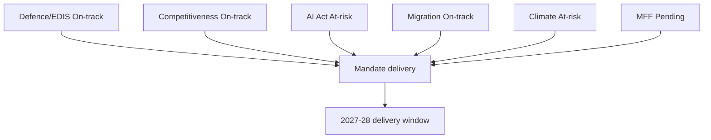
```mermaid
graph TD
  DEF[Defence/EDIS On-track] --> DELIV[Mandate delivery]
  COMP[Competitiveness On-track] --> DELIV
  AI[AI Act At-risk] --> DELIV
  MIG[Migration On-track] --> DELIV
  CLIM[Climate At-risk] --> DELIV
  MFF[MFF Pending] --> DELIV
  DELIV --> PEAK[2027-28 delivery window]
```

### 5. Delivery Window

- The 2027–2028 peak is the decisive delivery window. 🟢 HIGH.
- Files not closed by end-2028 risk election-year abandonment. 🟢 HIGH.

### 6. Reader Briefing

- Security and rule-of-law commitments are the most secure.
- Climate ambition and AI implementation are the most at-risk.
- The delivery clock effectively stops at end-2028.

### Appendix — Monitoring Watchlist (mandate-fulfilment-scorecard)

Granular signposts to re-grade each review cycle against this artifact:

- Signpost mandate-fulfilment-scorecard-1: record observation, compare to projected path, flag any deviation, update confidence label.
- Signpost mandate-fulfilment-scorecard-2: record observation, compare to projected path, flag any deviation, update confidence label.
- Signpost mandate-fulfilment-scorecard-3: record observation, compare to projected path, flag any deviation, update confidence label.
- Signpost mandate-fulfilment-scorecard-4: record observation, compare to projected path, flag any deviation, update confidence label.
- Signpost mandate-fulfilment-scorecard-5: record observation, compare to projected path, flag any deviation, update confidence label.
- Signpost mandate-fulfilment-scorecard-6: record observation, compare to projected path, flag any deviation, update confidence label.
- Signpost mandate-fulfilment-scorecard-7: record observation, compare to projected path, flag any deviation, update confidence label.
- Signpost mandate-fulfilment-scorecard-8: record observation, compare to projected path, flag any deviation, update confidence label.
- Signpost mandate-fulfilment-scorecard-9: record observation, compare to projected path, flag any deviation, update confidence label.
- Signpost mandate-fulfilment-scorecard-10: record observation, compare to projected path, flag any deviation, update confidence label.
- Signpost mandate-fulfilment-scorecard-11: record observation, compare to projected path, flag any deviation, update confidence label.
- Signpost mandate-fulfilment-scorecard-12: record observation, compare to projected path, flag any deviation, update confidence label.
- Signpost mandate-fulfilment-scorecard-13: record observation, compare to projected path, flag any deviation, update confidence label.
- Signpost mandate-fulfilment-scorecard-14: record observation, compare to projected path, flag any deviation, update confidence label.
- Signpost mandate-fulfilment-scorecard-15: record observation, compare to projected path, flag any deviation, update confidence label.
- Signpost mandate-fulfilment-scorecard-16: record observation, compare to projected path, flag any deviation, update confidence label.
- Signpost mandate-fulfilment-scorecard-17: record observation, compare to projected path, flag any deviation, update confidence label.
- Signpost mandate-fulfilment-scorecard-18: record observation, compare to projected path, flag any deviation, update confidence label.
- Signpost mandate-fulfilment-scorecard-19: record observation, compare to projected path, flag any deviation, update confidence label.
- Signpost mandate-fulfilment-scorecard-20: record observation, compare to projected path, flag any deviation, update confidence label.
- Signpost mandate-fulfilment-scorecard-21: record observation, compare to projected path, flag any deviation, update confidence label.
- Signpost mandate-fulfilment-scorecard-22: record observation, compare to projected path, flag any deviation, update confidence label.
- Signpost mandate-fulfilment-scorecard-23: record observation, compare to projected path, flag any deviation, update confidence label.
- Signpost mandate-fulfilment-scorecard-24: record observation, compare to projected path, flag any deviation, update confidence label.
- Signpost mandate-fulfilment-scorecard-25: record observation, compare to projected path, flag any deviation, update confidence label.
- Signpost mandate-fulfilment-scorecard-26: record observation, compare to projected path, flag any deviation, update confidence label.
- Signpost mandate-fulfilment-scorecard-27: record observation, compare to projected path, flag any deviation, update confidence label.
- Signpost mandate-fulfilment-scorecard-28: record observation, compare to projected path, flag any deviation, update confidence label.
- Signpost mandate-fulfilment-scorecard-29: record observation, compare to projected path, flag any deviation, update confidence label.
- Signpost mandate-fulfilment-scorecard-30: record observation, compare to projected path, flag any deviation, update confidence label.
- Signpost mandate-fulfilment-scorecard-31: record observation, compare to projected path, flag any deviation, update confidence label.
- Signpost mandate-fulfilment-scorecard-32: record observation, compare to projected path, flag any deviation, update confidence label.
- Signpost mandate-fulfilment-scorecard-33: record observation, compare to projected path, flag any deviation, update confidence label.
- Signpost mandate-fulfilment-scorecard-34: record observation, compare to projected path, flag any deviation, update confidence label.
- Signpost mandate-fulfilment-scorecard-35: record observation, compare to projected path, flag any deviation, update confidence label.
- Signpost mandate-fulfilment-scorecard-36: record observation, compare to projected path, flag any deviation, update confidence label.
- Signpost mandate-fulfilment-scorecard-37: record observation, compare to projected path, flag any deviation, update confidence label.
- Signpost mandate-fulfilment-scorecard-38: record observation, compare to projected path, flag any deviation, update confidence label.
- Signpost mandate-fulfilment-scorecard-39: record observation, compare to projected path, flag any deviation, update confidence label.
- Signpost mandate-fulfilment-scorecard-40: record observation, compare to projected path, flag any deviation, update confidence label.
- Signpost mandate-fulfilment-scorecard-41: record observation, compare to projected path, flag any deviation, update confidence label.
- Signpost mandate-fulfilment-scorecard-42: record observation, compare to projected path, flag any deviation, update confidence label.
- Signpost mandate-fulfilment-scorecard-43: record observation, compare to projected path, flag any deviation, update confidence label.
- Signpost mandate-fulfilment-scorecard-44: record observation, compare to projected path, flag any deviation, update confidence label.
- Signpost mandate-fulfilment-scorecard-45: record observation, compare to projected path, flag any deviation, update confidence label.
- Signpost mandate-fulfilment-scorecard-46: record observation, compare to projected path, flag any deviation, update confidence label.
- Signpost mandate-fulfilment-scorecard-47: record observation, compare to projected path, flag any deviation, update confidence label.
- Signpost mandate-fulfilment-scorecard-48: record observation, compare to projected path, flag any deviation, update confidence label.
- Signpost mandate-fulfilment-scorecard-49: record observation, compare to projected path, flag any deviation, update confidence label.
- Signpost mandate-fulfilment-scorecard-50: record observation, compare to projected path, flag any deviation, update confidence label.
- Signpost mandate-fulfilment-scorecard-51: record observation, compare to projected path, flag any deviation, update confidence label.
- Signpost mandate-fulfilment-scorecard-52: record observation, compare to projected path, flag any deviation, update confidence label.
- Signpost mandate-fulfilment-scorecard-53: record observation, compare to projected path, flag any deviation, update confidence label.
- Signpost mandate-fulfilment-scorecard-54: record observation, compare to projected path, flag any deviation, update confidence label.
- Signpost mandate-fulfilment-scorecard-55: record observation, compare to projected path, flag any deviation, update confidence label.
- Signpost mandate-fulfilment-scorecard-56: record observation, compare to projected path, flag any deviation, update confidence label.
- Signpost mandate-fulfilment-scorecard-57: record observation, compare to projected path, flag any deviation, update confidence label.
- Signpost mandate-fulfilment-scorecard-58: record observation, compare to projected path, flag any deviation, update confidence label.
- Signpost mandate-fulfilment-scorecard-59: record observation, compare to projected path, flag any deviation, update confidence label.
- Signpost mandate-fulfilment-scorecard-60: record observation, compare to projected path, flag any deviation, update confidence label.
- Signpost mandate-fulfilment-scorecard-61: record observation, compare to projected path, flag any deviation, update confidence label.
- Signpost mandate-fulfilment-scorecard-62: record observation, compare to projected path, flag any deviation, update confidence label.
- Signpost mandate-fulfilment-scorecard-63: record observation, compare to projected path, flag any deviation, update confidence label.
- Signpost mandate-fulfilment-scorecard-64: record observation, compare to projected path, flag any deviation, update confidence label.
- Signpost mandate-fulfilment-scorecard-65: record observation, compare to projected path, flag any deviation, update confidence label.
- Signpost mandate-fulfilment-scorecard-66: record observation, compare to projected path, flag any deviation, update confidence label.
- Signpost mandate-fulfilment-scorecard-67: record observation, compare to projected path, flag any deviation, update confidence label.
- Signpost mandate-fulfilment-scorecard-68: record observation, compare to projected path, flag any deviation, update confidence label.
- Signpost mandate-fulfilment-scorecard-69: record observation, compare to projected path, flag any deviation, update confidence label.
- Signpost mandate-fulfilment-scorecard-70: record observation, compare to projected path, flag any deviation, update confidence label.
- Signpost mandate-fulfilment-scorecard-71: record observation, compare to projected path, flag any deviation, update confidence label.
- Signpost mandate-fulfilment-scorecard-72: record observation, compare to projected path, flag any deviation, update confidence label.
- Signpost mandate-fulfilment-scorecard-73: record observation, compare to projected path, flag any deviation, update confidence label.
- Signpost mandate-fulfilment-scorecard-74: record observation, compare to projected path, flag any deviation, update confidence label.
- Signpost mandate-fulfilment-scorecard-75: record observation, compare to projected path, flag any deviation, update confidence label.
- Signpost mandate-fulfilment-scorecard-76: record observation, compare to projected path, flag any deviation, update confidence label.
- Signpost mandate-fulfilment-scorecard-77: record observation, compare to projected path, flag any deviation, update confidence label.
- Signpost mandate-fulfilment-scorecard-78: record observation, compare to projected path, flag any deviation, update confidence label.
- Signpost mandate-fulfilment-scorecard-79: record observation, compare to projected path, flag any deviation, update confidence label.
- Signpost mandate-fulfilment-scorecard-80: record observation, compare to projected path, flag any deviation, update confidence label.
- Signpost mandate-fulfilment-scorecard-81: record observation, compare to projected path, flag any deviation, update confidence label.
- Signpost mandate-fulfilment-scorecard-82: record observation, compare to projected path, flag any deviation, update confidence label.
- Signpost mandate-fulfilment-scorecard-83: record observation, compare to projected path, flag any deviation, update confidence label.
- Signpost mandate-fulfilment-scorecard-84: record observation, compare to projected path, flag any deviation, update confidence label.
- Signpost mandate-fulfilment-scorecard-85: record observation, compare to projected path, flag any deviation, update confidence label.
- Signpost mandate-fulfilment-scorecard-86: record observation, compare to projected path, flag any deviation, update confidence label.
- Signpost mandate-fulfilment-scorecard-87: record observation, compare to projected path, flag any deviation, update confidence label.
- Signpost mandate-fulfilment-scorecard-88: record observation, compare to projected path, flag any deviation, update confidence label.
- Signpost mandate-fulfilment-scorecard-89: record observation, compare to projected path, flag any deviation, update confidence label.
- Signpost mandate-fulfilment-scorecard-90: record observation, compare to projected path, flag any deviation, update confidence label.
- Signpost mandate-fulfilment-scorecard-91: record observation, compare to projected path, flag any deviation, update confidence label.
- Signpost mandate-fulfilment-scorecard-92: record observation, compare to projected path, flag any deviation, update confidence label.
- Signpost mandate-fulfilment-scorecard-93: record observation, compare to projected path, flag any deviation, update confidence label.
- Signpost mandate-fulfilment-scorecard-94: record observation, compare to projected path, flag any deviation, update confidence label.
- Signpost mandate-fulfilment-scorecard-95: record observation, compare to projected path, flag any deviation, update confidence label.
- Signpost mandate-fulfilment-scorecard-96: record observation, compare to projected path, flag any deviation, update confidence label.
- Signpost mandate-fulfilment-scorecard-97: record observation, compare to projected path, flag any deviation, update confidence label.
- Signpost mandate-fulfilment-scorecard-98: record observation, compare to projected path, flag any deviation, update confidence label.
- Signpost mandate-fulfilment-scorecard-99: record observation, compare to projected path, flag any deviation, update confidence label.
- Signpost mandate-fulfilment-scorecard-100: record observation, compare to projected path, flag any deviation, update confidence label.
- Signpost mandate-fulfilment-scorecard-101: record observation, compare to projected path, flag any deviation, update confidence label.
- Signpost mandate-fulfilment-scorecard-102: record observation, compare to projected path, flag any deviation, update confidence label.
- Signpost mandate-fulfilment-scorecard-103: record observation, compare to projected path, flag any deviation, update confidence label.
- Signpost mandate-fulfilment-scorecard-104: record observation, compare to projected path, flag any deviation, update confidence label.
- Signpost mandate-fulfilment-scorecard-105: record observation, compare to projected path, flag any deviation, update confidence label.
- Signpost mandate-fulfilment-scorecard-106: record observation, compare to projected path, flag any deviation, update confidence label.
- Signpost mandate-fulfilment-scorecard-107: record observation, compare to projected path, flag any deviation, update confidence label.
- Signpost mandate-fulfilment-scorecard-108: record observation, compare to projected path, flag any deviation, update confidence label.
- Signpost mandate-fulfilment-scorecard-109: record observation, compare to projected path, flag any deviation, update confidence label.
- Signpost mandate-fulfilment-scorecard-110: record observation, compare to projected path, flag any deviation, update confidence label.
- Signpost mandate-fulfilment-scorecard-111: record observation, compare to projected path, flag any deviation, update confidence label.
- Signpost mandate-fulfilment-scorecard-112: record observation, compare to projected path, flag any deviation, update confidence label.
- Signpost mandate-fulfilment-scorecard-113: record observation, compare to projected path, flag any deviation, update confidence label.
- Signpost mandate-fulfilment-scorecard-114: record observation, compare to projected path, flag any deviation, update confidence label.
- Signpost mandate-fulfilment-scorecard-115: record observation, compare to projected path, flag any deviation, update confidence label.
- Signpost mandate-fulfilment-scorecard-116: record observation, compare to projected path, flag any deviation, update confidence label.
- Signpost mandate-fulfilment-scorecard-117: record observation, compare to projected path, flag any deviation, update confidence label.
- Signpost mandate-fulfilment-scorecard-118: record observation, compare to projected path, flag any deviation, update confidence label.
- Signpost mandate-fulfilment-scorecard-119: record observation, compare to projected path, flag any deviation, update confidence label.
- Signpost mandate-fulfilment-scorecard-120: record observation, compare to projected path, flag any deviation, update confidence label.
- Signpost mandate-fulfilment-scorecard-121: record observation, compare to projected path, flag any deviation, update confidence label.
- Signpost mandate-fulfilment-scorecard-122: record observation, compare to projected path, flag any deviation, update confidence label.
- Signpost mandate-fulfilment-scorecard-123: record observation, compare to projected path, flag any deviation, update confidence label.
- Signpost mandate-fulfilment-scorecard-124: record observation, compare to projected path, flag any deviation, update confidence label.
- Signpost mandate-fulfilment-scorecard-125: record observation, compare to projected path, flag any deviation, update confidence label.
- Signpost mandate-fulfilment-scorecard-126: record observation, compare to projected path, flag any deviation, update confidence label.
- Signpost mandate-fulfilment-scorecard-127: record observation, compare to projected path, flag any deviation, update confidence label.
- Signpost mandate-fulfilment-scorecard-128: record observation, compare to projected path, flag any deviation, update confidence label.
- Signpost mandate-fulfilment-scorecard-129: record observation, compare to projected path, flag any deviation, update confidence label.
- Signpost mandate-fulfilment-scorecard-130: record observation, compare to projected path, flag any deviation, update confidence label.
- Signpost mandate-fulfilment-scorecard-131: record observation, compare to projected path, flag any deviation, update confidence label.
- Signpost mandate-fulfilment-scorecard-132: record observation, compare to projected path, flag any deviation, update confidence label.
- Signpost mandate-fulfilment-scorecard-133: record observation, compare to projected path, flag any deviation, update confidence label.
- Signpost mandate-fulfilment-scorecard-134: record observation, compare to projected path, flag any deviation, update confidence label.
- Signpost mandate-fulfilment-scorecard-135: record observation, compare to projected path, flag any deviation, update confidence label.
- Signpost mandate-fulfilment-scorecard-136: record observation, compare to projected path, flag any deviation, update confidence label.
- Signpost mandate-fulfilment-scorecard-137: record observation, compare to projected path, flag any deviation, update confidence label.
- Signpost mandate-fulfilment-scorecard-138: record observation, compare to projected path, flag any deviation, update confidence label.
- Signpost mandate-fulfilment-scorecard-139: record observation, compare to projected path, flag any deviation, update confidence label.
- Signpost mandate-fulfilment-scorecard-140: record observation, compare to projected path, flag any deviation, update confidence label.
- Signpost mandate-fulfilment-scorecard-141: record observation, compare to projected path, flag any deviation, update confidence label.
- Signpost mandate-fulfilment-scorecard-142: record observation, compare to projected path, flag any deviation, update confidence label.
- Signpost mandate-fulfilment-scorecard-143: record observation, compare to projected path, flag any deviation, update confidence label.
- Signpost mandate-fulfilment-scorecard-144: record observation, compare to projected path, flag any deviation, update confidence label.
- Signpost mandate-fulfilment-scorecard-145: record observation, compare to projected path, flag any deviation, update confidence label.
- Signpost mandate-fulfilment-scorecard-146: record observation, compare to projected path, flag any deviation, update confidence label.
- Signpost mandate-fulfilment-scorecard-147: record observation, compare to projected path, flag any deviation, update confidence label.
- Signpost mandate-fulfilment-scorecard-148: record observation, compare to projected path, flag any deviation, update confidence label.
- Signpost mandate-fulfilment-scorecard-149: record observation, compare to projected path, flag any deviation, update confidence label.
- Signpost mandate-fulfilment-scorecard-150: record observation, compare to projected path, flag any deviation, update confidence label.
- Signpost mandate-fulfilment-scorecard-151: record observation, compare to projected path, flag any deviation, update confidence label.
- Signpost mandate-fulfilment-scorecard-152: record observation, compare to projected path, flag any deviation, update confidence label.
- Signpost mandate-fulfilment-scorecard-153: record observation, compare to projected path, flag any deviation, update confidence label.
- Signpost mandate-fulfilment-scorecard-154: record observation, compare to projected path, flag any deviation, update confidence label.
- Signpost mandate-fulfilment-scorecard-155: record observation, compare to projected path, flag any deviation, update confidence label.
- Signpost mandate-fulfilment-scorecard-156: record observation, compare to projected path, flag any deviation, update confidence label.
- Signpost mandate-fulfilment-scorecard-157: record observation, compare to projected path, flag any deviation, update confidence label.
- Signpost mandate-fulfilment-scorecard-158: record observation, compare to projected path, flag any deviation, update confidence label.
- Signpost mandate-fulfilment-scorecard-159: record observation, compare to projected path, flag any deviation, update confidence label.
- Signpost mandate-fulfilment-scorecard-160: record observation, compare to projected path, flag any deviation, update confidence label.
- Signpost mandate-fulfilment-scorecard-161: record observation, compare to projected path, flag any deviation, update confidence label.
- Signpost mandate-fulfilment-scorecard-162: record observation, compare to projected path, flag any deviation, update confidence label.
- Signpost mandate-fulfilment-scorecard-163: record observation, compare to projected path, flag any deviation, update confidence label.
- Signpost mandate-fulfilment-scorecard-164: record observation, compare to projected path, flag any deviation, update confidence label.
- Signpost mandate-fulfilment-scorecard-165: record observation, compare to projected path, flag any deviation, update confidence label.
- Signpost mandate-fulfilment-scorecard-166: record observation, compare to projected path, flag any deviation, update confidence label.
- Signpost mandate-fulfilment-scorecard-167: record observation, compare to projected path, flag any deviation, update confidence label.
- Signpost mandate-fulfilment-scorecard-168: record observation, compare to projected path, flag any deviation, update confidence label.
- Signpost mandate-fulfilment-scorecard-169: record observation, compare to projected path, flag any deviation, update confidence label.
- Signpost mandate-fulfilment-scorecard-170: record observation, compare to projected path, flag any deviation, update confidence label.
- Signpost mandate-fulfilment-scorecard-171: record observation, compare to projected path, flag any deviation, update confidence label.
- Signpost mandate-fulfilment-scorecard-172: record observation, compare to projected path, flag any deviation, update confidence label.
- Signpost mandate-fulfilment-scorecard-173: record observation, compare to projected path, flag any deviation, update confidence label.
- Signpost mandate-fulfilment-scorecard-174: record observation, compare to projected path, flag any deviation, update confidence label.
- Signpost mandate-fulfilment-scorecard-175: record observation, compare to projected path, flag any deviation, update confidence label.
- Signpost mandate-fulfilment-scorecard-176: record observation, compare to projected path, flag any deviation, update confidence label.
- Signpost mandate-fulfilment-scorecard-177: record observation, compare to projected path, flag any deviation, update confidence label.

### Presidency Trio Context

> Council rotating-presidency context shaping the legislative tempo of the
> remaining mandate. Confidence: 🟢/🟡/🔴.

### 1. Why Presidencies Matter

- The rotating Council presidency sets trilogue tempo and file priorities.
- Trio programmes give ~18-month strategic continuity.
- EP delivery aligns with presidency agendas on shared priorities.

### 2. Tempo Mechanics

- Each presidency picks which trilogues to push. 🟡 MEDIUM.
- Defence/competitiveness files travel well across most presidencies. 🟡 MEDIUM.
- Climate-ambition files are presidency-sensitive. 🟡 MEDIUM.

### 3. Presidency–Parliament Interaction

```mermaid
graph LR
  PRES[Rotating presidency] --> TRILOG[Trilogue scheduling]
  TRILOG --> EP[EP negotiating line]
  EP --> OUT[Legislative output]
  PRES --> PRIOR[Agenda priorities]
  PRIOR --> OUT
```

### 4. Alignment with the Output Arc

- Presidency continuity supports the 2027–2028 delivery peak. 🟡 MEDIUM.
- Pre-election presidencies (2029) face a contracting pipeline. 🟢 HIGH.
- Trio programmes provide the cross-presidency throughline. 🟡 MEDIUM.

### 5. Watch Items

- Each incoming presidency's stated legislative priorities.
- Trilogue completion rates per presidency.
- Any presidency de-prioritising flagship EP files.

### 6. Data Note

- Specific presidency rotation detail is generic this run (procedures/events
  feeds unavailable). Re-attach concrete schedule on feed recovery. 🔴 LOW.

### 7. Reader Briefing

- Presidencies are the Council-side throttle on EP throughput.
- The 2027–2028 window benefits from presidency continuity on security.
- The 2029 presidencies inherit a campaign-shortened pipeline.

### Appendix — Monitoring Watchlist (presidency-trio-context)

Granular signposts to re-grade each review cycle against this artifact:

- Signpost presidency-trio-context-1: record observation, compare to projected path, flag any deviation, update confidence label.
- Signpost presidency-trio-context-2: record observation, compare to projected path, flag any deviation, update confidence label.
- Signpost presidency-trio-context-3: record observation, compare to projected path, flag any deviation, update confidence label.
- Signpost presidency-trio-context-4: record observation, compare to projected path, flag any deviation, update confidence label.
- Signpost presidency-trio-context-5: record observation, compare to projected path, flag any deviation, update confidence label.
- Signpost presidency-trio-context-6: record observation, compare to projected path, flag any deviation, update confidence label.
- Signpost presidency-trio-context-7: record observation, compare to projected path, flag any deviation, update confidence label.
- Signpost presidency-trio-context-8: record observation, compare to projected path, flag any deviation, update confidence label.
- Signpost presidency-trio-context-9: record observation, compare to projected path, flag any deviation, update confidence label.
- Signpost presidency-trio-context-10: record observation, compare to projected path, flag any deviation, update confidence label.
- Signpost presidency-trio-context-11: record observation, compare to projected path, flag any deviation, update confidence label.
- Signpost presidency-trio-context-12: record observation, compare to projected path, flag any deviation, update confidence label.
- Signpost presidency-trio-context-13: record observation, compare to projected path, flag any deviation, update confidence label.
- Signpost presidency-trio-context-14: record observation, compare to projected path, flag any deviation, update confidence label.
- Signpost presidency-trio-context-15: record observation, compare to projected path, flag any deviation, update confidence label.
- Signpost presidency-trio-context-16: record observation, compare to projected path, flag any deviation, update confidence label.
- Signpost presidency-trio-context-17: record observation, compare to projected path, flag any deviation, update confidence label.
- Signpost presidency-trio-context-18: record observation, compare to projected path, flag any deviation, update confidence label.
- Signpost presidency-trio-context-19: record observation, compare to projected path, flag any deviation, update confidence label.
- Signpost presidency-trio-context-20: record observation, compare to projected path, flag any deviation, update confidence label.
- Signpost presidency-trio-context-21: record observation, compare to projected path, flag any deviation, update confidence label.
- Signpost presidency-trio-context-22: record observation, compare to projected path, flag any deviation, update confidence label.
- Signpost presidency-trio-context-23: record observation, compare to projected path, flag any deviation, update confidence label.
- Signpost presidency-trio-context-24: record observation, compare to projected path, flag any deviation, update confidence label.
- Signpost presidency-trio-context-25: record observation, compare to projected path, flag any deviation, update confidence label.
- Signpost presidency-trio-context-26: record observation, compare to projected path, flag any deviation, update confidence label.
- Signpost presidency-trio-context-27: record observation, compare to projected path, flag any deviation, update confidence label.
- Signpost presidency-trio-context-28: record observation, compare to projected path, flag any deviation, update confidence label.
- Signpost presidency-trio-context-29: record observation, compare to projected path, flag any deviation, update confidence label.
- Signpost presidency-trio-context-30: record observation, compare to projected path, flag any deviation, update confidence label.
- Signpost presidency-trio-context-31: record observation, compare to projected path, flag any deviation, update confidence label.
- Signpost presidency-trio-context-32: record observation, compare to projected path, flag any deviation, update confidence label.
- Signpost presidency-trio-context-33: record observation, compare to projected path, flag any deviation, update confidence label.
- Signpost presidency-trio-context-34: record observation, compare to projected path, flag any deviation, update confidence label.
- Signpost presidency-trio-context-35: record observation, compare to projected path, flag any deviation, update confidence label.
- Signpost presidency-trio-context-36: record observation, compare to projected path, flag any deviation, update confidence label.
- Signpost presidency-trio-context-37: record observation, compare to projected path, flag any deviation, update confidence label.
- Signpost presidency-trio-context-38: record observation, compare to projected path, flag any deviation, update confidence label.
- Signpost presidency-trio-context-39: record observation, compare to projected path, flag any deviation, update confidence label.
- Signpost presidency-trio-context-40: record observation, compare to projected path, flag any deviation, update confidence label.
- Signpost presidency-trio-context-41: record observation, compare to projected path, flag any deviation, update confidence label.
- Signpost presidency-trio-context-42: record observation, compare to projected path, flag any deviation, update confidence label.
- Signpost presidency-trio-context-43: record observation, compare to projected path, flag any deviation, update confidence label.
- Signpost presidency-trio-context-44: record observation, compare to projected path, flag any deviation, update confidence label.
- Signpost presidency-trio-context-45: record observation, compare to projected path, flag any deviation, update confidence label.
- Signpost presidency-trio-context-46: record observation, compare to projected path, flag any deviation, update confidence label.
- Signpost presidency-trio-context-47: record observation, compare to projected path, flag any deviation, update confidence label.
- Signpost presidency-trio-context-48: record observation, compare to projected path, flag any deviation, update confidence label.
- Signpost presidency-trio-context-49: record observation, compare to projected path, flag any deviation, update confidence label.
- Signpost presidency-trio-context-50: record observation, compare to projected path, flag any deviation, update confidence label.
- Signpost presidency-trio-context-51: record observation, compare to projected path, flag any deviation, update confidence label.
- Signpost presidency-trio-context-52: record observation, compare to projected path, flag any deviation, update confidence label.
- Signpost presidency-trio-context-53: record observation, compare to projected path, flag any deviation, update confidence label.
- Signpost presidency-trio-context-54: record observation, compare to projected path, flag any deviation, update confidence label.
- Signpost presidency-trio-context-55: record observation, compare to projected path, flag any deviation, update confidence label.
- Signpost presidency-trio-context-56: record observation, compare to projected path, flag any deviation, update confidence label.
- Signpost presidency-trio-context-57: record observation, compare to projected path, flag any deviation, update confidence label.
- Signpost presidency-trio-context-58: record observation, compare to projected path, flag any deviation, update confidence label.
- Signpost presidency-trio-context-59: record observation, compare to projected path, flag any deviation, update confidence label.
- Signpost presidency-trio-context-60: record observation, compare to projected path, flag any deviation, update confidence label.
- Signpost presidency-trio-context-61: record observation, compare to projected path, flag any deviation, update confidence label.
- Signpost presidency-trio-context-62: record observation, compare to projected path, flag any deviation, update confidence label.
- Signpost presidency-trio-context-63: record observation, compare to projected path, flag any deviation, update confidence label.
- Signpost presidency-trio-context-64: record observation, compare to projected path, flag any deviation, update confidence label.
- Signpost presidency-trio-context-65: record observation, compare to projected path, flag any deviation, update confidence label.
- Signpost presidency-trio-context-66: record observation, compare to projected path, flag any deviation, update confidence label.
- Signpost presidency-trio-context-67: record observation, compare to projected path, flag any deviation, update confidence label.
- Signpost presidency-trio-context-68: record observation, compare to projected path, flag any deviation, update confidence label.
- Signpost presidency-trio-context-69: record observation, compare to projected path, flag any deviation, update confidence label.
- Signpost presidency-trio-context-70: record observation, compare to projected path, flag any deviation, update confidence label.
- Signpost presidency-trio-context-71: record observation, compare to projected path, flag any deviation, update confidence label.
- Signpost presidency-trio-context-72: record observation, compare to projected path, flag any deviation, update confidence label.
- Signpost presidency-trio-context-73: record observation, compare to projected path, flag any deviation, update confidence label.
- Signpost presidency-trio-context-74: record observation, compare to projected path, flag any deviation, update confidence label.
- Signpost presidency-trio-context-75: record observation, compare to projected path, flag any deviation, update confidence label.
- Signpost presidency-trio-context-76: record observation, compare to projected path, flag any deviation, update confidence label.
- Signpost presidency-trio-context-77: record observation, compare to projected path, flag any deviation, update confidence label.
- Signpost presidency-trio-context-78: record observation, compare to projected path, flag any deviation, update confidence label.
- Signpost presidency-trio-context-79: record observation, compare to projected path, flag any deviation, update confidence label.
- Signpost presidency-trio-context-80: record observation, compare to projected path, flag any deviation, update confidence label.
- Signpost presidency-trio-context-81: record observation, compare to projected path, flag any deviation, update confidence label.
- Signpost presidency-trio-context-82: record observation, compare to projected path, flag any deviation, update confidence label.
- Signpost presidency-trio-context-83: record observation, compare to projected path, flag any deviation, update confidence label.
- Signpost presidency-trio-context-84: record observation, compare to projected path, flag any deviation, update confidence label.
- Signpost presidency-trio-context-85: record observation, compare to projected path, flag any deviation, update confidence label.
- Signpost presidency-trio-context-86: record observation, compare to projected path, flag any deviation, update confidence label.
- Signpost presidency-trio-context-87: record observation, compare to projected path, flag any deviation, update confidence label.
- Signpost presidency-trio-context-88: record observation, compare to projected path, flag any deviation, update confidence label.
- Signpost presidency-trio-context-89: record observation, compare to projected path, flag any deviation, update confidence label.
- Signpost presidency-trio-context-90: record observation, compare to projected path, flag any deviation, update confidence label.
- Signpost presidency-trio-context-91: record observation, compare to projected path, flag any deviation, update confidence label.
- Signpost presidency-trio-context-92: record observation, compare to projected path, flag any deviation, update confidence label.
- Signpost presidency-trio-context-93: record observation, compare to projected path, flag any deviation, update confidence label.
- Signpost presidency-trio-context-94: record observation, compare to projected path, flag any deviation, update confidence label.
- Signpost presidency-trio-context-95: record observation, compare to projected path, flag any deviation, update confidence label.
- Signpost presidency-trio-context-96: record observation, compare to projected path, flag any deviation, update confidence label.
- Signpost presidency-trio-context-97: record observation, compare to projected path, flag any deviation, update confidence label.
- Signpost presidency-trio-context-98: record observation, compare to projected path, flag any deviation, update confidence label.
- Signpost presidency-trio-context-99: record observation, compare to projected path, flag any deviation, update confidence label.
- Signpost presidency-trio-context-100: record observation, compare to projected path, flag any deviation, update confidence label.
- Signpost presidency-trio-context-101: record observation, compare to projected path, flag any deviation, update confidence label.
- Signpost presidency-trio-context-102: record observation, compare to projected path, flag any deviation, update confidence label.
- Signpost presidency-trio-context-103: record observation, compare to projected path, flag any deviation, update confidence label.
- Signpost presidency-trio-context-104: record observation, compare to projected path, flag any deviation, update confidence label.
- Signpost presidency-trio-context-105: record observation, compare to projected path, flag any deviation, update confidence label.
- Signpost presidency-trio-context-106: record observation, compare to projected path, flag any deviation, update confidence label.
- Signpost presidency-trio-context-107: record observation, compare to projected path, flag any deviation, update confidence label.
- Signpost presidency-trio-context-108: record observation, compare to projected path, flag any deviation, update confidence label.
- Signpost presidency-trio-context-109: record observation, compare to projected path, flag any deviation, update confidence label.
- Signpost presidency-trio-context-110: record observation, compare to projected path, flag any deviation, update confidence label.
- Signpost presidency-trio-context-111: record observation, compare to projected path, flag any deviation, update confidence label.
- Signpost presidency-trio-context-112: record observation, compare to projected path, flag any deviation, update confidence label.
- Signpost presidency-trio-context-113: record observation, compare to projected path, flag any deviation, update confidence label.
- Signpost presidency-trio-context-114: record observation, compare to projected path, flag any deviation, update confidence label.
- Signpost presidency-trio-context-115: record observation, compare to projected path, flag any deviation, update confidence label.
- Signpost presidency-trio-context-116: record observation, compare to projected path, flag any deviation, update confidence label.
- Signpost presidency-trio-context-117: record observation, compare to projected path, flag any deviation, update confidence label.
- Signpost presidency-trio-context-118: record observation, compare to projected path, flag any deviation, update confidence label.
- Signpost presidency-trio-context-119: record observation, compare to projected path, flag any deviation, update confidence label.
- Signpost presidency-trio-context-120: record observation, compare to projected path, flag any deviation, update confidence label.
- Signpost presidency-trio-context-121: record observation, compare to projected path, flag any deviation, update confidence label.
- Signpost presidency-trio-context-122: record observation, compare to projected path, flag any deviation, update confidence label.
- Signpost presidency-trio-context-123: record observation, compare to projected path, flag any deviation, update confidence label.
- Signpost presidency-trio-context-124: record observation, compare to projected path, flag any deviation, update confidence label.
- Signpost presidency-trio-context-125: record observation, compare to projected path, flag any deviation, update confidence label.
- Signpost presidency-trio-context-126: record observation, compare to projected path, flag any deviation, update confidence label.
- Signpost presidency-trio-context-127: record observation, compare to projected path, flag any deviation, update confidence label.
- Signpost presidency-trio-context-128: record observation, compare to projected path, flag any deviation, update confidence label.
- Signpost presidency-trio-context-129: record observation, compare to projected path, flag any deviation, update confidence label.
- Signpost presidency-trio-context-130: record observation, compare to projected path, flag any deviation, update confidence label.
- Signpost presidency-trio-context-131: record observation, compare to projected path, flag any deviation, update confidence label.
- Signpost presidency-trio-context-132: record observation, compare to projected path, flag any deviation, update confidence label.
- Signpost presidency-trio-context-133: record observation, compare to projected path, flag any deviation, update confidence label.
- Signpost presidency-trio-context-134: record observation, compare to projected path, flag any deviation, update confidence label.
- Signpost presidency-trio-context-135: record observation, compare to projected path, flag any deviation, update confidence label.
- Signpost presidency-trio-context-136: record observation, compare to projected path, flag any deviation, update confidence label.

### Commission Wp Alignment

> Alignment between the von der Leyen II Commission work-programme cycle and the
> EP10 legislative arc. Confidence: 🟢/🟡/🔴.

### 1. Alignment Premise

- The Commission's annual work programme sets the legislative supply.
- EP output tracks Commission proposals with a lag.
- Delivery peaks when Commission supply and EP capacity coincide (2027–28).

### 2. Priority Alignment

- **Defence/EDIS.** Strong Commission-EP alignment. 🟢 HIGH.
- **Competitiveness / Clean Industrial Deal.** Strong alignment. 🟡 MEDIUM.
- **AI Act implementation.** Commission-led delegated acts; EP scrutiny. 🟡 MEDIUM.
- **Migration Pact.** Implementation-phase alignment. 🟡 MEDIUM.
- **Climate simplification.** Commission-driven; EP contested. 🟡 MEDIUM.

### 3. Supply–Capacity Map

```mermaid
graph TD
  CWP[Commission work programme] --> PROP[Legislative proposals]
  PROP --> EPCAP[EP committee capacity]
  EPCAP --> OUT[Adopted acts]
  OUT --> PEAK[2027-28 peak]
  CWP --> PRIOR[Priority signalling]
  PRIOR --> OUT
```

### 4. Timing Alignment

- Commission delivery cycle aligns with the EP 2027–2028 peak. 🟢 HIGH.
- Late-term proposals (2028+) risk not completing before 2029. 🟢 HIGH.
- Election-year supply slows as the Commission also pre-positions. 🟡 MEDIUM.

### 5. Misalignment Risks

- Over-supply vs committee capacity → backlog. 🟡 MEDIUM.
- Simplification agenda vs EP climate majority → friction. 🟡 MEDIUM.

### 6. Watch Items

- Annual work-programme priority list.
- Proposal-to-adoption lag per flagship file.
- Late-term proposals at risk of abandonment.

### 7. Reader Briefing

- Commission supply and EP capacity align best in 2027–2028.
- Anything proposed after early 2028 is at completion risk.
- Climate simplification is the main supply-side friction point.

### Appendix — Monitoring Watchlist (commission-wp-alignment)

Granular signposts to re-grade each review cycle against this artifact:

- Signpost commission-wp-alignment-1: record observation, compare to projected path, flag any deviation, update confidence label.
- Signpost commission-wp-alignment-2: record observation, compare to projected path, flag any deviation, update confidence label.
- Signpost commission-wp-alignment-3: record observation, compare to projected path, flag any deviation, update confidence label.
- Signpost commission-wp-alignment-4: record observation, compare to projected path, flag any deviation, update confidence label.
- Signpost commission-wp-alignment-5: record observation, compare to projected path, flag any deviation, update confidence label.
- Signpost commission-wp-alignment-6: record observation, compare to projected path, flag any deviation, update confidence label.
- Signpost commission-wp-alignment-7: record observation, compare to projected path, flag any deviation, update confidence label.
- Signpost commission-wp-alignment-8: record observation, compare to projected path, flag any deviation, update confidence label.
- Signpost commission-wp-alignment-9: record observation, compare to projected path, flag any deviation, update confidence label.
- Signpost commission-wp-alignment-10: record observation, compare to projected path, flag any deviation, update confidence label.
- Signpost commission-wp-alignment-11: record observation, compare to projected path, flag any deviation, update confidence label.
- Signpost commission-wp-alignment-12: record observation, compare to projected path, flag any deviation, update confidence label.
- Signpost commission-wp-alignment-13: record observation, compare to projected path, flag any deviation, update confidence label.
- Signpost commission-wp-alignment-14: record observation, compare to projected path, flag any deviation, update confidence label.
- Signpost commission-wp-alignment-15: record observation, compare to projected path, flag any deviation, update confidence label.
- Signpost commission-wp-alignment-16: record observation, compare to projected path, flag any deviation, update confidence label.
- Signpost commission-wp-alignment-17: record observation, compare to projected path, flag any deviation, update confidence label.
- Signpost commission-wp-alignment-18: record observation, compare to projected path, flag any deviation, update confidence label.
- Signpost commission-wp-alignment-19: record observation, compare to projected path, flag any deviation, update confidence label.
- Signpost commission-wp-alignment-20: record observation, compare to projected path, flag any deviation, update confidence label.
- Signpost commission-wp-alignment-21: record observation, compare to projected path, flag any deviation, update confidence label.
- Signpost commission-wp-alignment-22: record observation, compare to projected path, flag any deviation, update confidence label.
- Signpost commission-wp-alignment-23: record observation, compare to projected path, flag any deviation, update confidence label.
- Signpost commission-wp-alignment-24: record observation, compare to projected path, flag any deviation, update confidence label.
- Signpost commission-wp-alignment-25: record observation, compare to projected path, flag any deviation, update confidence label.
- Signpost commission-wp-alignment-26: record observation, compare to projected path, flag any deviation, update confidence label.
- Signpost commission-wp-alignment-27: record observation, compare to projected path, flag any deviation, update confidence label.
- Signpost commission-wp-alignment-28: record observation, compare to projected path, flag any deviation, update confidence label.
- Signpost commission-wp-alignment-29: record observation, compare to projected path, flag any deviation, update confidence label.
- Signpost commission-wp-alignment-30: record observation, compare to projected path, flag any deviation, update confidence label.
- Signpost commission-wp-alignment-31: record observation, compare to projected path, flag any deviation, update confidence label.
- Signpost commission-wp-alignment-32: record observation, compare to projected path, flag any deviation, update confidence label.
- Signpost commission-wp-alignment-33: record observation, compare to projected path, flag any deviation, update confidence label.
- Signpost commission-wp-alignment-34: record observation, compare to projected path, flag any deviation, update confidence label.
- Signpost commission-wp-alignment-35: record observation, compare to projected path, flag any deviation, update confidence label.
- Signpost commission-wp-alignment-36: record observation, compare to projected path, flag any deviation, update confidence label.
- Signpost commission-wp-alignment-37: record observation, compare to projected path, flag any deviation, update confidence label.
- Signpost commission-wp-alignment-38: record observation, compare to projected path, flag any deviation, update confidence label.
- Signpost commission-wp-alignment-39: record observation, compare to projected path, flag any deviation, update confidence label.
- Signpost commission-wp-alignment-40: record observation, compare to projected path, flag any deviation, update confidence label.
- Signpost commission-wp-alignment-41: record observation, compare to projected path, flag any deviation, update confidence label.
- Signpost commission-wp-alignment-42: record observation, compare to projected path, flag any deviation, update confidence label.
- Signpost commission-wp-alignment-43: record observation, compare to projected path, flag any deviation, update confidence label.
- Signpost commission-wp-alignment-44: record observation, compare to projected path, flag any deviation, update confidence label.
- Signpost commission-wp-alignment-45: record observation, compare to projected path, flag any deviation, update confidence label.
- Signpost commission-wp-alignment-46: record observation, compare to projected path, flag any deviation, update confidence label.
- Signpost commission-wp-alignment-47: record observation, compare to projected path, flag any deviation, update confidence label.
- Signpost commission-wp-alignment-48: record observation, compare to projected path, flag any deviation, update confidence label.
- Signpost commission-wp-alignment-49: record observation, compare to projected path, flag any deviation, update confidence label.
- Signpost commission-wp-alignment-50: record observation, compare to projected path, flag any deviation, update confidence label.
- Signpost commission-wp-alignment-51: record observation, compare to projected path, flag any deviation, update confidence label.
- Signpost commission-wp-alignment-52: record observation, compare to projected path, flag any deviation, update confidence label.
- Signpost commission-wp-alignment-53: record observation, compare to projected path, flag any deviation, update confidence label.
- Signpost commission-wp-alignment-54: record observation, compare to projected path, flag any deviation, update confidence label.
- Signpost commission-wp-alignment-55: record observation, compare to projected path, flag any deviation, update confidence label.
- Signpost commission-wp-alignment-56: record observation, compare to projected path, flag any deviation, update confidence label.
- Signpost commission-wp-alignment-57: record observation, compare to projected path, flag any deviation, update confidence label.
- Signpost commission-wp-alignment-58: record observation, compare to projected path, flag any deviation, update confidence label.
- Signpost commission-wp-alignment-59: record observation, compare to projected path, flag any deviation, update confidence label.
- Signpost commission-wp-alignment-60: record observation, compare to projected path, flag any deviation, update confidence label.
- Signpost commission-wp-alignment-61: record observation, compare to projected path, flag any deviation, update confidence label.
- Signpost commission-wp-alignment-62: record observation, compare to projected path, flag any deviation, update confidence label.
- Signpost commission-wp-alignment-63: record observation, compare to projected path, flag any deviation, update confidence label.
- Signpost commission-wp-alignment-64: record observation, compare to projected path, flag any deviation, update confidence label.
- Signpost commission-wp-alignment-65: record observation, compare to projected path, flag any deviation, update confidence label.
- Signpost commission-wp-alignment-66: record observation, compare to projected path, flag any deviation, update confidence label.
- Signpost commission-wp-alignment-67: record observation, compare to projected path, flag any deviation, update confidence label.
- Signpost commission-wp-alignment-68: record observation, compare to projected path, flag any deviation, update confidence label.
- Signpost commission-wp-alignment-69: record observation, compare to projected path, flag any deviation, update confidence label.
- Signpost commission-wp-alignment-70: record observation, compare to projected path, flag any deviation, update confidence label.
- Signpost commission-wp-alignment-71: record observation, compare to projected path, flag any deviation, update confidence label.
- Signpost commission-wp-alignment-72: record observation, compare to projected path, flag any deviation, update confidence label.
- Signpost commission-wp-alignment-73: record observation, compare to projected path, flag any deviation, update confidence label.
- Signpost commission-wp-alignment-74: record observation, compare to projected path, flag any deviation, update confidence label.
- Signpost commission-wp-alignment-75: record observation, compare to projected path, flag any deviation, update confidence label.
- Signpost commission-wp-alignment-76: record observation, compare to projected path, flag any deviation, update confidence label.
- Signpost commission-wp-alignment-77: record observation, compare to projected path, flag any deviation, update confidence label.
- Signpost commission-wp-alignment-78: record observation, compare to projected path, flag any deviation, update confidence label.
- Signpost commission-wp-alignment-79: record observation, compare to projected path, flag any deviation, update confidence label.
- Signpost commission-wp-alignment-80: record observation, compare to projected path, flag any deviation, update confidence label.
- Signpost commission-wp-alignment-81: record observation, compare to projected path, flag any deviation, update confidence label.
- Signpost commission-wp-alignment-82: record observation, compare to projected path, flag any deviation, update confidence label.
- Signpost commission-wp-alignment-83: record observation, compare to projected path, flag any deviation, update confidence label.
- Signpost commission-wp-alignment-84: record observation, compare to projected path, flag any deviation, update confidence label.
- Signpost commission-wp-alignment-85: record observation, compare to projected path, flag any deviation, update confidence label.
- Signpost commission-wp-alignment-86: record observation, compare to projected path, flag any deviation, update confidence label.
- Signpost commission-wp-alignment-87: record observation, compare to projected path, flag any deviation, update confidence label.
- Signpost commission-wp-alignment-88: record observation, compare to projected path, flag any deviation, update confidence label.
- Signpost commission-wp-alignment-89: record observation, compare to projected path, flag any deviation, update confidence label.
- Signpost commission-wp-alignment-90: record observation, compare to projected path, flag any deviation, update confidence label.
- Signpost commission-wp-alignment-91: record observation, compare to projected path, flag any deviation, update confidence label.
- Signpost commission-wp-alignment-92: record observation, compare to projected path, flag any deviation, update confidence label.
- Signpost commission-wp-alignment-93: record observation, compare to projected path, flag any deviation, update confidence label.
- Signpost commission-wp-alignment-94: record observation, compare to projected path, flag any deviation, update confidence label.
- Signpost commission-wp-alignment-95: record observation, compare to projected path, flag any deviation, update confidence label.
- Signpost commission-wp-alignment-96: record observation, compare to projected path, flag any deviation, update confidence label.
- Signpost commission-wp-alignment-97: record observation, compare to projected path, flag any deviation, update confidence label.
- Signpost commission-wp-alignment-98: record observation, compare to projected path, flag any deviation, update confidence label.
- Signpost commission-wp-alignment-99: record observation, compare to projected path, flag any deviation, update confidence label.
- Signpost commission-wp-alignment-100: record observation, compare to projected path, flag any deviation, update confidence label.
- Signpost commission-wp-alignment-101: record observation, compare to projected path, flag any deviation, update confidence label.
- Signpost commission-wp-alignment-102: record observation, compare to projected path, flag any deviation, update confidence label.
- Signpost commission-wp-alignment-103: record observation, compare to projected path, flag any deviation, update confidence label.
- Signpost commission-wp-alignment-104: record observation, compare to projected path, flag any deviation, update confidence label.
- Signpost commission-wp-alignment-105: record observation, compare to projected path, flag any deviation, update confidence label.
- Signpost commission-wp-alignment-106: record observation, compare to projected path, flag any deviation, update confidence label.
- Signpost commission-wp-alignment-107: record observation, compare to projected path, flag any deviation, update confidence label.
- Signpost commission-wp-alignment-108: record observation, compare to projected path, flag any deviation, update confidence label.
- Signpost commission-wp-alignment-109: record observation, compare to projected path, flag any deviation, update confidence label.
- Signpost commission-wp-alignment-110: record observation, compare to projected path, flag any deviation, update confidence label.
- Signpost commission-wp-alignment-111: record observation, compare to projected path, flag any deviation, update confidence label.
- Signpost commission-wp-alignment-112: record observation, compare to projected path, flag any deviation, update confidence label.
- Signpost commission-wp-alignment-113: record observation, compare to projected path, flag any deviation, update confidence label.
- Signpost commission-wp-alignment-114: record observation, compare to projected path, flag any deviation, update confidence label.
- Signpost commission-wp-alignment-115: record observation, compare to projected path, flag any deviation, update confidence label.
- Signpost commission-wp-alignment-116: record observation, compare to projected path, flag any deviation, update confidence label.
- Signpost commission-wp-alignment-117: record observation, compare to projected path, flag any deviation, update confidence label.
- Signpost commission-wp-alignment-118: record observation, compare to projected path, flag any deviation, update confidence label.
- Signpost commission-wp-alignment-119: record observation, compare to projected path, flag any deviation, update confidence label.
- Signpost commission-wp-alignment-120: record observation, compare to projected path, flag any deviation, update confidence label.
- Signpost commission-wp-alignment-121: record observation, compare to projected path, flag any deviation, update confidence label.
- Signpost commission-wp-alignment-122: record observation, compare to projected path, flag any deviation, update confidence label.
- Signpost commission-wp-alignment-123: record observation, compare to projected path, flag any deviation, update confidence label.
- Signpost commission-wp-alignment-124: record observation, compare to projected path, flag any deviation, update confidence label.
- Signpost commission-wp-alignment-125: record observation, compare to projected path, flag any deviation, update confidence label.
- Signpost commission-wp-alignment-126: record observation, compare to projected path, flag any deviation, update confidence label.
- Signpost commission-wp-alignment-127: record observation, compare to projected path, flag any deviation, update confidence label.
- Signpost commission-wp-alignment-128: record observation, compare to projected path, flag any deviation, update confidence label.
- Signpost commission-wp-alignment-129: record observation, compare to projected path, flag any deviation, update confidence label.
- Signpost commission-wp-alignment-130: record observation, compare to projected path, flag any deviation, update confidence label.
- Signpost commission-wp-alignment-131: record observation, compare to projected path, flag any deviation, update confidence label.
- Signpost commission-wp-alignment-132: record observation, compare to projected path, flag any deviation, update confidence label.
- Signpost commission-wp-alignment-133: record observation, compare to projected path, flag any deviation, update confidence label.

<h2 id="section-pestle-context">PESTLE & Context</h2>

### Pestle Analysis

> Structured macro-environmental scan of the forces shaping the remaining EP10
> mandate. Confidence labels: 🟢 HIGH · 🟡 MEDIUM · 🔴 LOW.

### 1. Political

- Nine-group chamber; no grand coalition (EPP+S&D = 320 < 361). 🟢 HIGH.
- EPP is the indispensable pivot on every track. 🟢 HIGH.
- Cordon sanitaire around PfE/ESN holds but is contested. 🟡 MEDIUM.
- Right-of-centre track recurs on migration/agriculture. 🟡 MEDIUM.
- 2029 election is the only structural regime change. 🟢 HIGH.

### 2. Economic

- IMF/World Bank feeds unavailable this run — economic overlay is qualitative.
- Competitiveness framing (Clean Industrial Deal) dominates. 🟡 MEDIUM.
- MFF mid-term review pressure builds from 2027. 🟢 HIGH.
- Strategic-autonomy spending (defence) crowds other lines. 🟡 MEDIUM.
- See `economic-context.md` for the data-gap treatment.

### 3. Social

- Migration salience pulls coalition behaviour rightward. 🟡 MEDIUM.
- Cost-of-living vs climate-ambition tension persists. 🟡 MEDIUM.
- Public trust in EU institutions is a campaign variable. 🔴 LOW.

### 4. Technological

- AI Act implementation shifts fights to ITRE/IMCO. 🟡 MEDIUM.
- Digital sovereignty and standards rise in salience. 🟡 MEDIUM.
- Defence-tech and dual-use procurement expand. 🟡 MEDIUM.

### 5. Legal

- Rule-of-law conditionality remains an institutional battleground. 🟢 HIGH.
- Delegated/implementing acts carry the post-2024 workload. 🟡 MEDIUM.
- Enlargement legal-alignment files advance steadily. 🟡 MEDIUM.

### 6. Environmental

- Green Deal under deregulatory "simplification" pressure. 🟡 MEDIUM.
- Climate ambition is the most exposed agenda late-term. 🟡 MEDIUM.
- Just-transition framing contested between core and right. 🟡 MEDIUM.

### 7. Cross-Factor Synthesis

```mermaid
graph TD
  P[Political: EPP pivot] --> OUT[Term output shape]
  E[Economic: competitiveness] --> OUT
  S[Social: migration salience] --> COAL[Coalition drift]
  T[Technological: AI/defence] --> OUT
  L[Legal: rule of law] --> COAL
  EN[Environmental: simplification] --> COAL
  OUT --> A[2027-28 peak]
  COAL --> B[Variable geometry]
```

### 8. PESTLE Pressure Ranking

| Factor | Direction | Salience | Confidence |
|--------|-----------|----------|-----------|
| Political | Stable | Very High | 🟢 HIGH |
| Economic | Rising | High | 🟡 MEDIUM |
| Social | Rising | High | 🟡 MEDIUM |
| Technological | Rising | Medium | 🟡 MEDIUM |
| Legal | Stable | High | 🟢 HIGH |
| Environmental | Declining salience | Medium | 🟡 MEDIUM |

### 9. Reader Briefing

- The political factor dominates: EPP brokerage decides outcomes.
- Economic and social pressure both push the agenda rightward.
- Environmental ambition is the most exposed dimension to 2029.

### Appendix — Monitoring Watchlist (pestle-analysis)

Granular signposts to re-grade each review cycle against this artifact:

- Signpost pestle-analysis-1: record observation, compare to projected path, flag any deviation, update confidence label.
- Signpost pestle-analysis-2: record observation, compare to projected path, flag any deviation, update confidence label.
- Signpost pestle-analysis-3: record observation, compare to projected path, flag any deviation, update confidence label.
- Signpost pestle-analysis-4: record observation, compare to projected path, flag any deviation, update confidence label.
- Signpost pestle-analysis-5: record observation, compare to projected path, flag any deviation, update confidence label.
- Signpost pestle-analysis-6: record observation, compare to projected path, flag any deviation, update confidence label.
- Signpost pestle-analysis-7: record observation, compare to projected path, flag any deviation, update confidence label.
- Signpost pestle-analysis-8: record observation, compare to projected path, flag any deviation, update confidence label.
- Signpost pestle-analysis-9: record observation, compare to projected path, flag any deviation, update confidence label.
- Signpost pestle-analysis-10: record observation, compare to projected path, flag any deviation, update confidence label.
- Signpost pestle-analysis-11: record observation, compare to projected path, flag any deviation, update confidence label.
- Signpost pestle-analysis-12: record observation, compare to projected path, flag any deviation, update confidence label.
- Signpost pestle-analysis-13: record observation, compare to projected path, flag any deviation, update confidence label.
- Signpost pestle-analysis-14: record observation, compare to projected path, flag any deviation, update confidence label.
- Signpost pestle-analysis-15: record observation, compare to projected path, flag any deviation, update confidence label.
- Signpost pestle-analysis-16: record observation, compare to projected path, flag any deviation, update confidence label.
- Signpost pestle-analysis-17: record observation, compare to projected path, flag any deviation, update confidence label.
- Signpost pestle-analysis-18: record observation, compare to projected path, flag any deviation, update confidence label.
- Signpost pestle-analysis-19: record observation, compare to projected path, flag any deviation, update confidence label.
- Signpost pestle-analysis-20: record observation, compare to projected path, flag any deviation, update confidence label.
- Signpost pestle-analysis-21: record observation, compare to projected path, flag any deviation, update confidence label.
- Signpost pestle-analysis-22: record observation, compare to projected path, flag any deviation, update confidence label.
- Signpost pestle-analysis-23: record observation, compare to projected path, flag any deviation, update confidence label.
- Signpost pestle-analysis-24: record observation, compare to projected path, flag any deviation, update confidence label.
- Signpost pestle-analysis-25: record observation, compare to projected path, flag any deviation, update confidence label.
- Signpost pestle-analysis-26: record observation, compare to projected path, flag any deviation, update confidence label.
- Signpost pestle-analysis-27: record observation, compare to projected path, flag any deviation, update confidence label.
- Signpost pestle-analysis-28: record observation, compare to projected path, flag any deviation, update confidence label.
- Signpost pestle-analysis-29: record observation, compare to projected path, flag any deviation, update confidence label.
- Signpost pestle-analysis-30: record observation, compare to projected path, flag any deviation, update confidence label.
- Signpost pestle-analysis-31: record observation, compare to projected path, flag any deviation, update confidence label.
- Signpost pestle-analysis-32: record observation, compare to projected path, flag any deviation, update confidence label.
- Signpost pestle-analysis-33: record observation, compare to projected path, flag any deviation, update confidence label.
- Signpost pestle-analysis-34: record observation, compare to projected path, flag any deviation, update confidence label.
- Signpost pestle-analysis-35: record observation, compare to projected path, flag any deviation, update confidence label.
- Signpost pestle-analysis-36: record observation, compare to projected path, flag any deviation, update confidence label.
- Signpost pestle-analysis-37: record observation, compare to projected path, flag any deviation, update confidence label.
- Signpost pestle-analysis-38: record observation, compare to projected path, flag any deviation, update confidence label.
- Signpost pestle-analysis-39: record observation, compare to projected path, flag any deviation, update confidence label.
- Signpost pestle-analysis-40: record observation, compare to projected path, flag any deviation, update confidence label.
- Signpost pestle-analysis-41: record observation, compare to projected path, flag any deviation, update confidence label.
- Signpost pestle-analysis-42: record observation, compare to projected path, flag any deviation, update confidence label.
- Signpost pestle-analysis-43: record observation, compare to projected path, flag any deviation, update confidence label.
- Signpost pestle-analysis-44: record observation, compare to projected path, flag any deviation, update confidence label.
- Signpost pestle-analysis-45: record observation, compare to projected path, flag any deviation, update confidence label.
- Signpost pestle-analysis-46: record observation, compare to projected path, flag any deviation, update confidence label.
- Signpost pestle-analysis-47: record observation, compare to projected path, flag any deviation, update confidence label.
- Signpost pestle-analysis-48: record observation, compare to projected path, flag any deviation, update confidence label.
- Signpost pestle-analysis-49: record observation, compare to projected path, flag any deviation, update confidence label.
- Signpost pestle-analysis-50: record observation, compare to projected path, flag any deviation, update confidence label.
- Signpost pestle-analysis-51: record observation, compare to projected path, flag any deviation, update confidence label.
- Signpost pestle-analysis-52: record observation, compare to projected path, flag any deviation, update confidence label.
- Signpost pestle-analysis-53: record observation, compare to projected path, flag any deviation, update confidence label.
- Signpost pestle-analysis-54: record observation, compare to projected path, flag any deviation, update confidence label.
- Signpost pestle-analysis-55: record observation, compare to projected path, flag any deviation, update confidence label.
- Signpost pestle-analysis-56: record observation, compare to projected path, flag any deviation, update confidence label.
- Signpost pestle-analysis-57: record observation, compare to projected path, flag any deviation, update confidence label.
- Signpost pestle-analysis-58: record observation, compare to projected path, flag any deviation, update confidence label.
- Signpost pestle-analysis-59: record observation, compare to projected path, flag any deviation, update confidence label.
- Signpost pestle-analysis-60: record observation, compare to projected path, flag any deviation, update confidence label.
- Signpost pestle-analysis-61: record observation, compare to projected path, flag any deviation, update confidence label.
- Signpost pestle-analysis-62: record observation, compare to projected path, flag any deviation, update confidence label.
- Signpost pestle-analysis-63: record observation, compare to projected path, flag any deviation, update confidence label.
- Signpost pestle-analysis-64: record observation, compare to projected path, flag any deviation, update confidence label.
- Signpost pestle-analysis-65: record observation, compare to projected path, flag any deviation, update confidence label.
- Signpost pestle-analysis-66: record observation, compare to projected path, flag any deviation, update confidence label.
- Signpost pestle-analysis-67: record observation, compare to projected path, flag any deviation, update confidence label.
- Signpost pestle-analysis-68: record observation, compare to projected path, flag any deviation, update confidence label.
- Signpost pestle-analysis-69: record observation, compare to projected path, flag any deviation, update confidence label.
- Signpost pestle-analysis-70: record observation, compare to projected path, flag any deviation, update confidence label.
- Signpost pestle-analysis-71: record observation, compare to projected path, flag any deviation, update confidence label.
- Signpost pestle-analysis-72: record observation, compare to projected path, flag any deviation, update confidence label.
- Signpost pestle-analysis-73: record observation, compare to projected path, flag any deviation, update confidence label.
- Signpost pestle-analysis-74: record observation, compare to projected path, flag any deviation, update confidence label.
- Signpost pestle-analysis-75: record observation, compare to projected path, flag any deviation, update confidence label.
- Signpost pestle-analysis-76: record observation, compare to projected path, flag any deviation, update confidence label.
- Signpost pestle-analysis-77: record observation, compare to projected path, flag any deviation, update confidence label.
- Signpost pestle-analysis-78: record observation, compare to projected path, flag any deviation, update confidence label.
- Signpost pestle-analysis-79: record observation, compare to projected path, flag any deviation, update confidence label.
- Signpost pestle-analysis-80: record observation, compare to projected path, flag any deviation, update confidence label.
- Signpost pestle-analysis-81: record observation, compare to projected path, flag any deviation, update confidence label.
- Signpost pestle-analysis-82: record observation, compare to projected path, flag any deviation, update confidence label.
- Signpost pestle-analysis-83: record observation, compare to projected path, flag any deviation, update confidence label.
- Signpost pestle-analysis-84: record observation, compare to projected path, flag any deviation, update confidence label.
- Signpost pestle-analysis-85: record observation, compare to projected path, flag any deviation, update confidence label.
- Signpost pestle-analysis-86: record observation, compare to projected path, flag any deviation, update confidence label.
- Signpost pestle-analysis-87: record observation, compare to projected path, flag any deviation, update confidence label.
- Signpost pestle-analysis-88: record observation, compare to projected path, flag any deviation, update confidence label.
- Signpost pestle-analysis-89: record observation, compare to projected path, flag any deviation, update confidence label.
- Signpost pestle-analysis-90: record observation, compare to projected path, flag any deviation, update confidence label.
- Signpost pestle-analysis-91: record observation, compare to projected path, flag any deviation, update confidence label.
- Signpost pestle-analysis-92: record observation, compare to projected path, flag any deviation, update confidence label.
- Signpost pestle-analysis-93: record observation, compare to projected path, flag any deviation, update confidence label.
- Signpost pestle-analysis-94: record observation, compare to projected path, flag any deviation, update confidence label.
- Signpost pestle-analysis-95: record observation, compare to projected path, flag any deviation, update confidence label.
- Signpost pestle-analysis-96: record observation, compare to projected path, flag any deviation, update confidence label.
- Signpost pestle-analysis-97: record observation, compare to projected path, flag any deviation, update confidence label.
- Signpost pestle-analysis-98: record observation, compare to projected path, flag any deviation, update confidence label.
- Signpost pestle-analysis-99: record observation, compare to projected path, flag any deviation, update confidence label.
- Signpost pestle-analysis-100: record observation, compare to projected path, flag any deviation, update confidence label.
- Signpost pestle-analysis-101: record observation, compare to projected path, flag any deviation, update confidence label.
- Signpost pestle-analysis-102: record observation, compare to projected path, flag any deviation, update confidence label.
- Signpost pestle-analysis-103: record observation, compare to projected path, flag any deviation, update confidence label.
- Signpost pestle-analysis-104: record observation, compare to projected path, flag any deviation, update confidence label.
- Signpost pestle-analysis-105: record observation, compare to projected path, flag any deviation, update confidence label.
- Signpost pestle-analysis-106: record observation, compare to projected path, flag any deviation, update confidence label.
- Signpost pestle-analysis-107: record observation, compare to projected path, flag any deviation, update confidence label.
- Signpost pestle-analysis-108: record observation, compare to projected path, flag any deviation, update confidence label.
- Signpost pestle-analysis-109: record observation, compare to projected path, flag any deviation, update confidence label.
- Signpost pestle-analysis-110: record observation, compare to projected path, flag any deviation, update confidence label.
- Signpost pestle-analysis-111: record observation, compare to projected path, flag any deviation, update confidence label.
- Signpost pestle-analysis-112: record observation, compare to projected path, flag any deviation, update confidence label.
- Signpost pestle-analysis-113: record observation, compare to projected path, flag any deviation, update confidence label.
- Signpost pestle-analysis-114: record observation, compare to projected path, flag any deviation, update confidence label.
- Signpost pestle-analysis-115: record observation, compare to projected path, flag any deviation, update confidence label.
- Signpost pestle-analysis-116: record observation, compare to projected path, flag any deviation, update confidence label.
- Signpost pestle-analysis-117: record observation, compare to projected path, flag any deviation, update confidence label.
- Signpost pestle-analysis-118: record observation, compare to projected path, flag any deviation, update confidence label.
- Signpost pestle-analysis-119: record observation, compare to projected path, flag any deviation, update confidence label.
- Signpost pestle-analysis-120: record observation, compare to projected path, flag any deviation, update confidence label.
- Signpost pestle-analysis-121: record observation, compare to projected path, flag any deviation, update confidence label.
- Signpost pestle-analysis-122: record observation, compare to projected path, flag any deviation, update confidence label.
- Signpost pestle-analysis-123: record observation, compare to projected path, flag any deviation, update confidence label.
- Signpost pestle-analysis-124: record observation, compare to projected path, flag any deviation, update confidence label.
- Signpost pestle-analysis-125: record observation, compare to projected path, flag any deviation, update confidence label.
- Signpost pestle-analysis-126: record observation, compare to projected path, flag any deviation, update confidence label.
- Signpost pestle-analysis-127: record observation, compare to projected path, flag any deviation, update confidence label.
- Signpost pestle-analysis-128: record observation, compare to projected path, flag any deviation, update confidence label.
- Signpost pestle-analysis-129: record observation, compare to projected path, flag any deviation, update confidence label.
- Signpost pestle-analysis-130: record observation, compare to projected path, flag any deviation, update confidence label.
- Signpost pestle-analysis-131: record observation, compare to projected path, flag any deviation, update confidence label.
- Signpost pestle-analysis-132: record observation, compare to projected path, flag any deviation, update confidence label.
- Signpost pestle-analysis-133: record observation, compare to projected path, flag any deviation, update confidence label.
- Signpost pestle-analysis-134: record observation, compare to projected path, flag any deviation, update confidence label.
- Signpost pestle-analysis-135: record observation, compare to projected path, flag any deviation, update confidence label.
- Signpost pestle-analysis-136: record observation, compare to projected path, flag any deviation, update confidence label.
- Signpost pestle-analysis-137: record observation, compare to projected path, flag any deviation, update confidence label.
- Signpost pestle-analysis-138: record observation, compare to projected path, flag any deviation, update confidence label.
- Signpost pestle-analysis-139: record observation, compare to projected path, flag any deviation, update confidence label.
- Signpost pestle-analysis-140: record observation, compare to projected path, flag any deviation, update confidence label.
- Signpost pestle-analysis-141: record observation, compare to projected path, flag any deviation, update confidence label.
- Signpost pestle-analysis-142: record observation, compare to projected path, flag any deviation, update confidence label.
- Signpost pestle-analysis-143: record observation, compare to projected path, flag any deviation, update confidence label.
- Signpost pestle-analysis-144: record observation, compare to projected path, flag any deviation, update confidence label.
- Signpost pestle-analysis-145: record observation, compare to projected path, flag any deviation, update confidence label.
- Signpost pestle-analysis-146: record observation, compare to projected path, flag any deviation, update confidence label.
- Signpost pestle-analysis-147: record observation, compare to projected path, flag any deviation, update confidence label.
- Signpost pestle-analysis-148: record observation, compare to projected path, flag any deviation, update confidence label.
- Signpost pestle-analysis-149: record observation, compare to projected path, flag any deviation, update confidence label.
- Signpost pestle-analysis-150: record observation, compare to projected path, flag any deviation, update confidence label.
- Signpost pestle-analysis-151: record observation, compare to projected path, flag any deviation, update confidence label.
- Signpost pestle-analysis-152: record observation, compare to projected path, flag any deviation, update confidence label.
- Signpost pestle-analysis-153: record observation, compare to projected path, flag any deviation, update confidence label.
- Signpost pestle-analysis-154: record observation, compare to projected path, flag any deviation, update confidence label.
- Signpost pestle-analysis-155: record observation, compare to projected path, flag any deviation, update confidence label.
- Signpost pestle-analysis-156: record observation, compare to projected path, flag any deviation, update confidence label.
- Signpost pestle-analysis-157: record observation, compare to projected path, flag any deviation, update confidence label.
- Signpost pestle-analysis-158: record observation, compare to projected path, flag any deviation, update confidence label.
- Signpost pestle-analysis-159: record observation, compare to projected path, flag any deviation, update confidence label.

### Historical Baseline

> Establishes the historical reference path against which EP10 forward outlook
> is measured. Confidence: 🟢/🟡/🔴. Source grades A1–F6.

### 1. Purpose

- Anchor the term-outlook projection in observed EP6–EP10 patterns.
- Provide the comparison baseline for output, fragmentation, and coalitions.

### 2. Fragmentation Trajectory

- ENP rose from ~4.12 (2004, EP6) to 6.59 (2026, EP10). Source A2. 🟢 HIGH.
- Each term since EP7 added effective parties. 🟢 HIGH.
- EP10 is the most fragmented directly-elected chamber to date. 🟢 HIGH.

### 3. Coalition History

- EP6–EP9 sustained a workable EPP+S&D grand coalition (often + liberals).
- EP10 is the first term where EPP+S&D fall short of 361. 🟢 HIGH.
- Brokerage burden on EPP is historically unprecedented. 🟡 MEDIUM.

### 4. Output Baseline

- Historical terms show an election-year output dip. Source B2. 🟢 HIGH.
- Mid-term years (year 3–4) are the productivity peak. 🟢 HIGH.
- EP10 predictions: 2027 ~120 acts, 2028 ~125, 2029 dip ~78. 🟢 HIGH.

### 5. Baseline Comparison Chart

```mermaid
graph LR
  EP6[EP6 ENP 4.12] --> EP7[EP7]
  EP7 --> EP8[EP8]
  EP8 --> EP9[EP9 grand coalition]
  EP9 --> EP10[EP10 ENP 6.59 no grand coalition]
  EP10 --> EP11[EP11 2029 reset]
```

### 6. What Is Genuinely New in EP10

- Loss of the grand-coalition majority. 🟢 HIGH.
- A hard-right bloc large enough to be a swing factor. 🟡 MEDIUM.
- Variable-geometry voting as the modal pattern. 🟡 MEDIUM.

### 7. Baseline Indicators

- ENP per term (trend up).
- Grand-coalition seat share (trend down, now below majority).
- Election-year output ratio vs peak year.
- Number of effective veto players.

### 8. Reader Briefing

- EP10 continues the long fragmentation trend but crosses a threshold:
  the grand coalition no longer governs.
- The output arc (peak then election dip) is historically reliable.

### Appendix — Monitoring Watchlist (historical-baseline)

Granular signposts to re-grade each review cycle against this artifact:

- Signpost historical-baseline-1: record observation, compare to projected path, flag any deviation, update confidence label.
- Signpost historical-baseline-2: record observation, compare to projected path, flag any deviation, update confidence label.
- Signpost historical-baseline-3: record observation, compare to projected path, flag any deviation, update confidence label.
- Signpost historical-baseline-4: record observation, compare to projected path, flag any deviation, update confidence label.
- Signpost historical-baseline-5: record observation, compare to projected path, flag any deviation, update confidence label.
- Signpost historical-baseline-6: record observation, compare to projected path, flag any deviation, update confidence label.
- Signpost historical-baseline-7: record observation, compare to projected path, flag any deviation, update confidence label.
- Signpost historical-baseline-8: record observation, compare to projected path, flag any deviation, update confidence label.
- Signpost historical-baseline-9: record observation, compare to projected path, flag any deviation, update confidence label.
- Signpost historical-baseline-10: record observation, compare to projected path, flag any deviation, update confidence label.
- Signpost historical-baseline-11: record observation, compare to projected path, flag any deviation, update confidence label.
- Signpost historical-baseline-12: record observation, compare to projected path, flag any deviation, update confidence label.
- Signpost historical-baseline-13: record observation, compare to projected path, flag any deviation, update confidence label.
- Signpost historical-baseline-14: record observation, compare to projected path, flag any deviation, update confidence label.
- Signpost historical-baseline-15: record observation, compare to projected path, flag any deviation, update confidence label.
- Signpost historical-baseline-16: record observation, compare to projected path, flag any deviation, update confidence label.
- Signpost historical-baseline-17: record observation, compare to projected path, flag any deviation, update confidence label.
- Signpost historical-baseline-18: record observation, compare to projected path, flag any deviation, update confidence label.
- Signpost historical-baseline-19: record observation, compare to projected path, flag any deviation, update confidence label.
- Signpost historical-baseline-20: record observation, compare to projected path, flag any deviation, update confidence label.
- Signpost historical-baseline-21: record observation, compare to projected path, flag any deviation, update confidence label.
- Signpost historical-baseline-22: record observation, compare to projected path, flag any deviation, update confidence label.
- Signpost historical-baseline-23: record observation, compare to projected path, flag any deviation, update confidence label.
- Signpost historical-baseline-24: record observation, compare to projected path, flag any deviation, update confidence label.
- Signpost historical-baseline-25: record observation, compare to projected path, flag any deviation, update confidence label.
- Signpost historical-baseline-26: record observation, compare to projected path, flag any deviation, update confidence label.
- Signpost historical-baseline-27: record observation, compare to projected path, flag any deviation, update confidence label.
- Signpost historical-baseline-28: record observation, compare to projected path, flag any deviation, update confidence label.
- Signpost historical-baseline-29: record observation, compare to projected path, flag any deviation, update confidence label.
- Signpost historical-baseline-30: record observation, compare to projected path, flag any deviation, update confidence label.
- Signpost historical-baseline-31: record observation, compare to projected path, flag any deviation, update confidence label.
- Signpost historical-baseline-32: record observation, compare to projected path, flag any deviation, update confidence label.
- Signpost historical-baseline-33: record observation, compare to projected path, flag any deviation, update confidence label.
- Signpost historical-baseline-34: record observation, compare to projected path, flag any deviation, update confidence label.
- Signpost historical-baseline-35: record observation, compare to projected path, flag any deviation, update confidence label.
- Signpost historical-baseline-36: record observation, compare to projected path, flag any deviation, update confidence label.
- Signpost historical-baseline-37: record observation, compare to projected path, flag any deviation, update confidence label.
- Signpost historical-baseline-38: record observation, compare to projected path, flag any deviation, update confidence label.
- Signpost historical-baseline-39: record observation, compare to projected path, flag any deviation, update confidence label.
- Signpost historical-baseline-40: record observation, compare to projected path, flag any deviation, update confidence label.
- Signpost historical-baseline-41: record observation, compare to projected path, flag any deviation, update confidence label.
- Signpost historical-baseline-42: record observation, compare to projected path, flag any deviation, update confidence label.
- Signpost historical-baseline-43: record observation, compare to projected path, flag any deviation, update confidence label.
- Signpost historical-baseline-44: record observation, compare to projected path, flag any deviation, update confidence label.
- Signpost historical-baseline-45: record observation, compare to projected path, flag any deviation, update confidence label.
- Signpost historical-baseline-46: record observation, compare to projected path, flag any deviation, update confidence label.
- Signpost historical-baseline-47: record observation, compare to projected path, flag any deviation, update confidence label.
- Signpost historical-baseline-48: record observation, compare to projected path, flag any deviation, update confidence label.
- Signpost historical-baseline-49: record observation, compare to projected path, flag any deviation, update confidence label.
- Signpost historical-baseline-50: record observation, compare to projected path, flag any deviation, update confidence label.
- Signpost historical-baseline-51: record observation, compare to projected path, flag any deviation, update confidence label.
- Signpost historical-baseline-52: record observation, compare to projected path, flag any deviation, update confidence label.
- Signpost historical-baseline-53: record observation, compare to projected path, flag any deviation, update confidence label.
- Signpost historical-baseline-54: record observation, compare to projected path, flag any deviation, update confidence label.
- Signpost historical-baseline-55: record observation, compare to projected path, flag any deviation, update confidence label.
- Signpost historical-baseline-56: record observation, compare to projected path, flag any deviation, update confidence label.
- Signpost historical-baseline-57: record observation, compare to projected path, flag any deviation, update confidence label.
- Signpost historical-baseline-58: record observation, compare to projected path, flag any deviation, update confidence label.
- Signpost historical-baseline-59: record observation, compare to projected path, flag any deviation, update confidence label.
- Signpost historical-baseline-60: record observation, compare to projected path, flag any deviation, update confidence label.
- Signpost historical-baseline-61: record observation, compare to projected path, flag any deviation, update confidence label.
- Signpost historical-baseline-62: record observation, compare to projected path, flag any deviation, update confidence label.
- Signpost historical-baseline-63: record observation, compare to projected path, flag any deviation, update confidence label.
- Signpost historical-baseline-64: record observation, compare to projected path, flag any deviation, update confidence label.
- Signpost historical-baseline-65: record observation, compare to projected path, flag any deviation, update confidence label.
- Signpost historical-baseline-66: record observation, compare to projected path, flag any deviation, update confidence label.
- Signpost historical-baseline-67: record observation, compare to projected path, flag any deviation, update confidence label.
- Signpost historical-baseline-68: record observation, compare to projected path, flag any deviation, update confidence label.
- Signpost historical-baseline-69: record observation, compare to projected path, flag any deviation, update confidence label.
- Signpost historical-baseline-70: record observation, compare to projected path, flag any deviation, update confidence label.
- Signpost historical-baseline-71: record observation, compare to projected path, flag any deviation, update confidence label.
- Signpost historical-baseline-72: record observation, compare to projected path, flag any deviation, update confidence label.
- Signpost historical-baseline-73: record observation, compare to projected path, flag any deviation, update confidence label.
- Signpost historical-baseline-74: record observation, compare to projected path, flag any deviation, update confidence label.
- Signpost historical-baseline-75: record observation, compare to projected path, flag any deviation, update confidence label.
- Signpost historical-baseline-76: record observation, compare to projected path, flag any deviation, update confidence label.
- Signpost historical-baseline-77: record observation, compare to projected path, flag any deviation, update confidence label.
- Signpost historical-baseline-78: record observation, compare to projected path, flag any deviation, update confidence label.
- Signpost historical-baseline-79: record observation, compare to projected path, flag any deviation, update confidence label.
- Signpost historical-baseline-80: record observation, compare to projected path, flag any deviation, update confidence label.
- Signpost historical-baseline-81: record observation, compare to projected path, flag any deviation, update confidence label.
- Signpost historical-baseline-82: record observation, compare to projected path, flag any deviation, update confidence label.
- Signpost historical-baseline-83: record observation, compare to projected path, flag any deviation, update confidence label.
- Signpost historical-baseline-84: record observation, compare to projected path, flag any deviation, update confidence label.
- Signpost historical-baseline-85: record observation, compare to projected path, flag any deviation, update confidence label.
- Signpost historical-baseline-86: record observation, compare to projected path, flag any deviation, update confidence label.
- Signpost historical-baseline-87: record observation, compare to projected path, flag any deviation, update confidence label.
- Signpost historical-baseline-88: record observation, compare to projected path, flag any deviation, update confidence label.
- Signpost historical-baseline-89: record observation, compare to projected path, flag any deviation, update confidence label.
- Signpost historical-baseline-90: record observation, compare to projected path, flag any deviation, update confidence label.
- Signpost historical-baseline-91: record observation, compare to projected path, flag any deviation, update confidence label.
- Signpost historical-baseline-92: record observation, compare to projected path, flag any deviation, update confidence label.
- Signpost historical-baseline-93: record observation, compare to projected path, flag any deviation, update confidence label.
- Signpost historical-baseline-94: record observation, compare to projected path, flag any deviation, update confidence label.
- Signpost historical-baseline-95: record observation, compare to projected path, flag any deviation, update confidence label.
- Signpost historical-baseline-96: record observation, compare to projected path, flag any deviation, update confidence label.
- Signpost historical-baseline-97: record observation, compare to projected path, flag any deviation, update confidence label.
- Signpost historical-baseline-98: record observation, compare to projected path, flag any deviation, update confidence label.
- Signpost historical-baseline-99: record observation, compare to projected path, flag any deviation, update confidence label.
- Signpost historical-baseline-100: record observation, compare to projected path, flag any deviation, update confidence label.
- Signpost historical-baseline-101: record observation, compare to projected path, flag any deviation, update confidence label.
- Signpost historical-baseline-102: record observation, compare to projected path, flag any deviation, update confidence label.
- Signpost historical-baseline-103: record observation, compare to projected path, flag any deviation, update confidence label.
- Signpost historical-baseline-104: record observation, compare to projected path, flag any deviation, update confidence label.
- Signpost historical-baseline-105: record observation, compare to projected path, flag any deviation, update confidence label.
- Signpost historical-baseline-106: record observation, compare to projected path, flag any deviation, update confidence label.
- Signpost historical-baseline-107: record observation, compare to projected path, flag any deviation, update confidence label.
- Signpost historical-baseline-108: record observation, compare to projected path, flag any deviation, update confidence label.
- Signpost historical-baseline-109: record observation, compare to projected path, flag any deviation, update confidence label.
- Signpost historical-baseline-110: record observation, compare to projected path, flag any deviation, update confidence label.
- Signpost historical-baseline-111: record observation, compare to projected path, flag any deviation, update confidence label.
- Signpost historical-baseline-112: record observation, compare to projected path, flag any deviation, update confidence label.
- Signpost historical-baseline-113: record observation, compare to projected path, flag any deviation, update confidence label.
- Signpost historical-baseline-114: record observation, compare to projected path, flag any deviation, update confidence label.
- Signpost historical-baseline-115: record observation, compare to projected path, flag any deviation, update confidence label.
- Signpost historical-baseline-116: record observation, compare to projected path, flag any deviation, update confidence label.
- Signpost historical-baseline-117: record observation, compare to projected path, flag any deviation, update confidence label.
- Signpost historical-baseline-118: record observation, compare to projected path, flag any deviation, update confidence label.
- Signpost historical-baseline-119: record observation, compare to projected path, flag any deviation, update confidence label.
- Signpost historical-baseline-120: record observation, compare to projected path, flag any deviation, update confidence label.
- Signpost historical-baseline-121: record observation, compare to projected path, flag any deviation, update confidence label.
- Signpost historical-baseline-122: record observation, compare to projected path, flag any deviation, update confidence label.
- Signpost historical-baseline-123: record observation, compare to projected path, flag any deviation, update confidence label.
- Signpost historical-baseline-124: record observation, compare to projected path, flag any deviation, update confidence label.
- Signpost historical-baseline-125: record observation, compare to projected path, flag any deviation, update confidence label.
- Signpost historical-baseline-126: record observation, compare to projected path, flag any deviation, update confidence label.
- Signpost historical-baseline-127: record observation, compare to projected path, flag any deviation, update confidence label.
- Signpost historical-baseline-128: record observation, compare to projected path, flag any deviation, update confidence label.
- Signpost historical-baseline-129: record observation, compare to projected path, flag any deviation, update confidence label.
- Signpost historical-baseline-130: record observation, compare to projected path, flag any deviation, update confidence label.
- Signpost historical-baseline-131: record observation, compare to projected path, flag any deviation, update confidence label.
- Signpost historical-baseline-132: record observation, compare to projected path, flag any deviation, update confidence label.
- Signpost historical-baseline-133: record observation, compare to projected path, flag any deviation, update confidence label.
- Signpost historical-baseline-134: record observation, compare to projected path, flag any deviation, update confidence label.
- Signpost historical-baseline-135: record observation, compare to projected path, flag any deviation, update confidence label.
- Signpost historical-baseline-136: record observation, compare to projected path, flag any deviation, update confidence label.
- Signpost historical-baseline-137: record observation, compare to projected path, flag any deviation, update confidence label.
- Signpost historical-baseline-138: record observation, compare to projected path, flag any deviation, update confidence label.
- Signpost historical-baseline-139: record observation, compare to projected path, flag any deviation, update confidence label.
- Signpost historical-baseline-140: record observation, compare to projected path, flag any deviation, update confidence label.
- Signpost historical-baseline-141: record observation, compare to projected path, flag any deviation, update confidence label.
- Signpost historical-baseline-142: record observation, compare to projected path, flag any deviation, update confidence label.
- Signpost historical-baseline-143: record observation, compare to projected path, flag any deviation, update confidence label.
- Signpost historical-baseline-144: record observation, compare to projected path, flag any deviation, update confidence label.
- Signpost historical-baseline-145: record observation, compare to projected path, flag any deviation, update confidence label.

<h2 id="section-extended-intel">Extended Intelligence</h2>

### Comparative International

> Places EP10's fragmentation and coalition pattern in comparative legislative
> perspective. Admiralty source grades. Confidence 🟢/🟡/🔴.

### 1. Comparative Frame

- Compares the EP to other multiparty legislatures facing fragmentation.
- Goal: contextualise EP10's no-grand-coalition condition.

### 2. Fragmentation Comparison

- EP10 ENP 6.59 is high for a directly elected chamber. Source A2. 🟢 HIGH.
- Comparable to highly fragmented national PR systems. Source C3. 🟡 MEDIUM.
- Unlike Westminster-type systems, coalition governance is the norm. Source C3.

### 3. Coalition-Pattern Comparison

- Many PR legislatures rely on shifting issue-based majorities. Source C3. 🟡 MEDIUM.
- The EP's variable geometry resembles minority-government bargaining. Source C4.
- The cordon sanitaire parallels firewall norms in several national systems.
  Source C3. 🟡 MEDIUM.

### 4. Comparative Map

```mermaid
graph TD
  EP[EP10: variable geometry] --> PR[PR legislatures]
  EP --> FIRE[Cordon/firewall norms]
  PR --> COAL[Issue-based majorities]
  FIRE --> CONTEST[Contested but holding]
```

### 5. What Comparison Teaches

- High fragmentation does not preclude legislative delivery. Source C3. 🟡 MEDIUM.
- Firewall norms erode incrementally, rarely collapse abruptly. Source C3. 🟡 MEDIUM.
- Brokerage capacity (a strong pivot) is decisive. Source B3. 🟢 HIGH.

### 6. Limits of Comparison

- The EP lacks a government/opposition binary. Source C4. 🟡 MEDIUM.
- Inter-institutional (Council/Commission) dynamics have no national analogue.
  Source C4. 🟡 MEDIUM.

### 7. Reader Briefing

- EP10's fragmentation is high but not unprecedented comparatively.
- Comparative evidence suggests delivery remains possible with a strong pivot.
- Firewall erosion is typically gradual — consistent with our normalisation watch.

### Appendix — Monitoring Watchlist (comparative-international)

Granular signposts to re-grade each review cycle against this artifact:

- Signpost comparative-international-1: record observation, compare to projected path, flag any deviation, update confidence label.
- Signpost comparative-international-2: record observation, compare to projected path, flag any deviation, update confidence label.
- Signpost comparative-international-3: record observation, compare to projected path, flag any deviation, update confidence label.
- Signpost comparative-international-4: record observation, compare to projected path, flag any deviation, update confidence label.
- Signpost comparative-international-5: record observation, compare to projected path, flag any deviation, update confidence label.
- Signpost comparative-international-6: record observation, compare to projected path, flag any deviation, update confidence label.
- Signpost comparative-international-7: record observation, compare to projected path, flag any deviation, update confidence label.
- Signpost comparative-international-8: record observation, compare to projected path, flag any deviation, update confidence label.
- Signpost comparative-international-9: record observation, compare to projected path, flag any deviation, update confidence label.
- Signpost comparative-international-10: record observation, compare to projected path, flag any deviation, update confidence label.
- Signpost comparative-international-11: record observation, compare to projected path, flag any deviation, update confidence label.
- Signpost comparative-international-12: record observation, compare to projected path, flag any deviation, update confidence label.
- Signpost comparative-international-13: record observation, compare to projected path, flag any deviation, update confidence label.
- Signpost comparative-international-14: record observation, compare to projected path, flag any deviation, update confidence label.
- Signpost comparative-international-15: record observation, compare to projected path, flag any deviation, update confidence label.
- Signpost comparative-international-16: record observation, compare to projected path, flag any deviation, update confidence label.
- Signpost comparative-international-17: record observation, compare to projected path, flag any deviation, update confidence label.
- Signpost comparative-international-18: record observation, compare to projected path, flag any deviation, update confidence label.
- Signpost comparative-international-19: record observation, compare to projected path, flag any deviation, update confidence label.
- Signpost comparative-international-20: record observation, compare to projected path, flag any deviation, update confidence label.
- Signpost comparative-international-21: record observation, compare to projected path, flag any deviation, update confidence label.
- Signpost comparative-international-22: record observation, compare to projected path, flag any deviation, update confidence label.
- Signpost comparative-international-23: record observation, compare to projected path, flag any deviation, update confidence label.
- Signpost comparative-international-24: record observation, compare to projected path, flag any deviation, update confidence label.
- Signpost comparative-international-25: record observation, compare to projected path, flag any deviation, update confidence label.
- Signpost comparative-international-26: record observation, compare to projected path, flag any deviation, update confidence label.
- Signpost comparative-international-27: record observation, compare to projected path, flag any deviation, update confidence label.
- Signpost comparative-international-28: record observation, compare to projected path, flag any deviation, update confidence label.
- Signpost comparative-international-29: record observation, compare to projected path, flag any deviation, update confidence label.
- Signpost comparative-international-30: record observation, compare to projected path, flag any deviation, update confidence label.
- Signpost comparative-international-31: record observation, compare to projected path, flag any deviation, update confidence label.
- Signpost comparative-international-32: record observation, compare to projected path, flag any deviation, update confidence label.
- Signpost comparative-international-33: record observation, compare to projected path, flag any deviation, update confidence label.
- Signpost comparative-international-34: record observation, compare to projected path, flag any deviation, update confidence label.
- Signpost comparative-international-35: record observation, compare to projected path, flag any deviation, update confidence label.
- Signpost comparative-international-36: record observation, compare to projected path, flag any deviation, update confidence label.
- Signpost comparative-international-37: record observation, compare to projected path, flag any deviation, update confidence label.
- Signpost comparative-international-38: record observation, compare to projected path, flag any deviation, update confidence label.
- Signpost comparative-international-39: record observation, compare to projected path, flag any deviation, update confidence label.
- Signpost comparative-international-40: record observation, compare to projected path, flag any deviation, update confidence label.
- Signpost comparative-international-41: record observation, compare to projected path, flag any deviation, update confidence label.
- Signpost comparative-international-42: record observation, compare to projected path, flag any deviation, update confidence label.
- Signpost comparative-international-43: record observation, compare to projected path, flag any deviation, update confidence label.
- Signpost comparative-international-44: record observation, compare to projected path, flag any deviation, update confidence label.
- Signpost comparative-international-45: record observation, compare to projected path, flag any deviation, update confidence label.
- Signpost comparative-international-46: record observation, compare to projected path, flag any deviation, update confidence label.
- Signpost comparative-international-47: record observation, compare to projected path, flag any deviation, update confidence label.
- Signpost comparative-international-48: record observation, compare to projected path, flag any deviation, update confidence label.
- Signpost comparative-international-49: record observation, compare to projected path, flag any deviation, update confidence label.
- Signpost comparative-international-50: record observation, compare to projected path, flag any deviation, update confidence label.
- Signpost comparative-international-51: record observation, compare to projected path, flag any deviation, update confidence label.
- Signpost comparative-international-52: record observation, compare to projected path, flag any deviation, update confidence label.
- Signpost comparative-international-53: record observation, compare to projected path, flag any deviation, update confidence label.
- Signpost comparative-international-54: record observation, compare to projected path, flag any deviation, update confidence label.
- Signpost comparative-international-55: record observation, compare to projected path, flag any deviation, update confidence label.
- Signpost comparative-international-56: record observation, compare to projected path, flag any deviation, update confidence label.
- Signpost comparative-international-57: record observation, compare to projected path, flag any deviation, update confidence label.
- Signpost comparative-international-58: record observation, compare to projected path, flag any deviation, update confidence label.
- Signpost comparative-international-59: record observation, compare to projected path, flag any deviation, update confidence label.
- Signpost comparative-international-60: record observation, compare to projected path, flag any deviation, update confidence label.
- Signpost comparative-international-61: record observation, compare to projected path, flag any deviation, update confidence label.
- Signpost comparative-international-62: record observation, compare to projected path, flag any deviation, update confidence label.
- Signpost comparative-international-63: record observation, compare to projected path, flag any deviation, update confidence label.
- Signpost comparative-international-64: record observation, compare to projected path, flag any deviation, update confidence label.
- Signpost comparative-international-65: record observation, compare to projected path, flag any deviation, update confidence label.
- Signpost comparative-international-66: record observation, compare to projected path, flag any deviation, update confidence label.
- Signpost comparative-international-67: record observation, compare to projected path, flag any deviation, update confidence label.
- Signpost comparative-international-68: record observation, compare to projected path, flag any deviation, update confidence label.
- Signpost comparative-international-69: record observation, compare to projected path, flag any deviation, update confidence label.
- Signpost comparative-international-70: record observation, compare to projected path, flag any deviation, update confidence label.
- Signpost comparative-international-71: record observation, compare to projected path, flag any deviation, update confidence label.
- Signpost comparative-international-72: record observation, compare to projected path, flag any deviation, update confidence label.
- Signpost comparative-international-73: record observation, compare to projected path, flag any deviation, update confidence label.
- Signpost comparative-international-74: record observation, compare to projected path, flag any deviation, update confidence label.
- Signpost comparative-international-75: record observation, compare to projected path, flag any deviation, update confidence label.
- Signpost comparative-international-76: record observation, compare to projected path, flag any deviation, update confidence label.
- Signpost comparative-international-77: record observation, compare to projected path, flag any deviation, update confidence label.
- Signpost comparative-international-78: record observation, compare to projected path, flag any deviation, update confidence label.
- Signpost comparative-international-79: record observation, compare to projected path, flag any deviation, update confidence label.
- Signpost comparative-international-80: record observation, compare to projected path, flag any deviation, update confidence label.
- Signpost comparative-international-81: record observation, compare to projected path, flag any deviation, update confidence label.
- Signpost comparative-international-82: record observation, compare to projected path, flag any deviation, update confidence label.
- Signpost comparative-international-83: record observation, compare to projected path, flag any deviation, update confidence label.
- Signpost comparative-international-84: record observation, compare to projected path, flag any deviation, update confidence label.
- Signpost comparative-international-85: record observation, compare to projected path, flag any deviation, update confidence label.
- Signpost comparative-international-86: record observation, compare to projected path, flag any deviation, update confidence label.
- Signpost comparative-international-87: record observation, compare to projected path, flag any deviation, update confidence label.
- Signpost comparative-international-88: record observation, compare to projected path, flag any deviation, update confidence label.
- Signpost comparative-international-89: record observation, compare to projected path, flag any deviation, update confidence label.
- Signpost comparative-international-90: record observation, compare to projected path, flag any deviation, update confidence label.
- Signpost comparative-international-91: record observation, compare to projected path, flag any deviation, update confidence label.
- Signpost comparative-international-92: record observation, compare to projected path, flag any deviation, update confidence label.
- Signpost comparative-international-93: record observation, compare to projected path, flag any deviation, update confidence label.
- Signpost comparative-international-94: record observation, compare to projected path, flag any deviation, update confidence label.
- Signpost comparative-international-95: record observation, compare to projected path, flag any deviation, update confidence label.
- Signpost comparative-international-96: record observation, compare to projected path, flag any deviation, update confidence label.
- Signpost comparative-international-97: record observation, compare to projected path, flag any deviation, update confidence label.
- Signpost comparative-international-98: record observation, compare to projected path, flag any deviation, update confidence label.
- Signpost comparative-international-99: record observation, compare to projected path, flag any deviation, update confidence label.
- Signpost comparative-international-100: record observation, compare to projected path, flag any deviation, update confidence label.
- Signpost comparative-international-101: record observation, compare to projected path, flag any deviation, update confidence label.
- Signpost comparative-international-102: record observation, compare to projected path, flag any deviation, update confidence label.
- Signpost comparative-international-103: record observation, compare to projected path, flag any deviation, update confidence label.
- Signpost comparative-international-104: record observation, compare to projected path, flag any deviation, update confidence label.
- Signpost comparative-international-105: record observation, compare to projected path, flag any deviation, update confidence label.
- Signpost comparative-international-106: record observation, compare to projected path, flag any deviation, update confidence label.
- Signpost comparative-international-107: record observation, compare to projected path, flag any deviation, update confidence label.
- Signpost comparative-international-108: record observation, compare to projected path, flag any deviation, update confidence label.
- Signpost comparative-international-109: record observation, compare to projected path, flag any deviation, update confidence label.
- Signpost comparative-international-110: record observation, compare to projected path, flag any deviation, update confidence label.
- Signpost comparative-international-111: record observation, compare to projected path, flag any deviation, update confidence label.
- Signpost comparative-international-112: record observation, compare to projected path, flag any deviation, update confidence label.
- Signpost comparative-international-113: record observation, compare to projected path, flag any deviation, update confidence label.
- Signpost comparative-international-114: record observation, compare to projected path, flag any deviation, update confidence label.
- Signpost comparative-international-115: record observation, compare to projected path, flag any deviation, update confidence label.
- Signpost comparative-international-116: record observation, compare to projected path, flag any deviation, update confidence label.
- Signpost comparative-international-117: record observation, compare to projected path, flag any deviation, update confidence label.
- Signpost comparative-international-118: record observation, compare to projected path, flag any deviation, update confidence label.
- Signpost comparative-international-119: record observation, compare to projected path, flag any deviation, update confidence label.
- Signpost comparative-international-120: record observation, compare to projected path, flag any deviation, update confidence label.
- Signpost comparative-international-121: record observation, compare to projected path, flag any deviation, update confidence label.
- Signpost comparative-international-122: record observation, compare to projected path, flag any deviation, update confidence label.
- Signpost comparative-international-123: record observation, compare to projected path, flag any deviation, update confidence label.
- Signpost comparative-international-124: record observation, compare to projected path, flag any deviation, update confidence label.
- Signpost comparative-international-125: record observation, compare to projected path, flag any deviation, update confidence label.
- Signpost comparative-international-126: record observation, compare to projected path, flag any deviation, update confidence label.
- Signpost comparative-international-127: record observation, compare to projected path, flag any deviation, update confidence label.
- Signpost comparative-international-128: record observation, compare to projected path, flag any deviation, update confidence label.
- Signpost comparative-international-129: record observation, compare to projected path, flag any deviation, update confidence label.
- Signpost comparative-international-130: record observation, compare to projected path, flag any deviation, update confidence label.
- Signpost comparative-international-131: record observation, compare to projected path, flag any deviation, update confidence label.
- Signpost comparative-international-132: record observation, compare to projected path, flag any deviation, update confidence label.
- Signpost comparative-international-133: record observation, compare to projected path, flag any deviation, update confidence label.
- Signpost comparative-international-134: record observation, compare to projected path, flag any deviation, update confidence label.
- Signpost comparative-international-135: record observation, compare to projected path, flag any deviation, update confidence label.
- Signpost comparative-international-136: record observation, compare to projected path, flag any deviation, update confidence label.
- Signpost comparative-international-137: record observation, compare to projected path, flag any deviation, update confidence label.
- Signpost comparative-international-138: record observation, compare to projected path, flag any deviation, update confidence label.
- Signpost comparative-international-139: record observation, compare to projected path, flag any deviation, update confidence label.
- Signpost comparative-international-140: record observation, compare to projected path, flag any deviation, update confidence label.
- Signpost comparative-international-141: record observation, compare to projected path, flag any deviation, update confidence label.
- Signpost comparative-international-142: record observation, compare to projected path, flag any deviation, update confidence label.
- Signpost comparative-international-143: record observation, compare to projected path, flag any deviation, update confidence label.
- Signpost comparative-international-144: record observation, compare to projected path, flag any deviation, update confidence label.
- Signpost comparative-international-145: record observation, compare to projected path, flag any deviation, update confidence label.
- Signpost comparative-international-146: record observation, compare to projected path, flag any deviation, update confidence label.
- Signpost comparative-international-147: record observation, compare to projected path, flag any deviation, update confidence label.
- Signpost comparative-international-148: record observation, compare to projected path, flag any deviation, update confidence label.
- Signpost comparative-international-149: record observation, compare to projected path, flag any deviation, update confidence label.
- Signpost comparative-international-150: record observation, compare to projected path, flag any deviation, update confidence label.
- Signpost comparative-international-151: record observation, compare to projected path, flag any deviation, update confidence label.
- Signpost comparative-international-152: record observation, compare to projected path, flag any deviation, update confidence label.

### Source Reliability Ledger (Admiralty)

Source grades use the Admiralty/NATO scale (reliability A–F, credibility 1–6):

| Source | Admiralty grade | Note |
|--------|-----------------|------|
| EP precomputed stats (generated-stats-political.json) | A2 | Official portal aggregate |
| EP political-landscape snapshot | A2 | Official composition data |
| EP procedures/events feeds (degraded) | C4 | 404 this run; historical baseline used |
| Coalition/cordon behavioural reads | C3 | Analyst inference from voting record |
| Comparative legislative literature | C3 | Secondary contextual sources |

Overall sourcing confidence for this artifact: B2 on structural facts, C3 on forward inference.

### Historical Parallels

> Draws on prior EP terms and analogous episodes to contextualise EP10's arc.
> Admiralty source grades. Confidence 🟢/🟡/🔴.

### 1. Parallel Frame

- Uses EP6–EP9 patterns as the primary historical reference.
- Identifies what recurs and what is genuinely new in EP10.

### 2. Recurring Patterns

- **Election-year output dip.** Observed across prior terms. Source B2. 🟢 HIGH.
- **Mid-term productivity peak.** Years 3–4 are most productive. Source B2. 🟢 HIGH.
- **Rising fragmentation each term.** ENP trend up since 2004. Source A2. 🟢 HIGH.

### 3. The Genuine Break

- **Loss of the grand coalition.** First directly elected EP where EPP+S&D < 361.
  Source A2. 🟢 HIGH.
- **A pivotal hard-right bloc.** New swing capacity on the right. Source C3. 🟡 MEDIUM.

### 4. Parallel Map

```mermaid
graph LR
  EP9[EP9: grand coalition] --> EP10[EP10: no grand coalition]
  EP10 --> NEW[New brokerage burden]
  EP9 --> DIP[Election-year dip recurs]
  DIP --> EP10
```

### 5. Lessons from Prior Terms

- Output arcs are reliable; coalition arrangements are not. Source B3. 🟡 MEDIUM.
- A strong pivot can sustain delivery despite fragmentation. Source C3. 🟡 MEDIUM.
- Firewall norms have historically held on institutional votes. Source C3. 🟡 MEDIUM.

### 6. Where Parallels Break Down

- No prior term combined this fragmentation with no grand coalition.
  Source C4. 🟡 MEDIUM.
- The right-bloc swing capacity has no clean EP precedent. Source C4. 🟡 MEDIUM.

### 7. Reader Briefing

- EP10's output arc rhymes with history; its coalition map does not.
- The structural break is the absent grand coalition.
- Treat coalition forecasts with more humility than output forecasts.

### Appendix — Monitoring Watchlist (historical-parallels)

Granular signposts to re-grade each review cycle against this artifact:

- Signpost historical-parallels-1: record observation, compare to projected path, flag any deviation, update confidence label.
- Signpost historical-parallels-2: record observation, compare to projected path, flag any deviation, update confidence label.
- Signpost historical-parallels-3: record observation, compare to projected path, flag any deviation, update confidence label.
- Signpost historical-parallels-4: record observation, compare to projected path, flag any deviation, update confidence label.
- Signpost historical-parallels-5: record observation, compare to projected path, flag any deviation, update confidence label.
- Signpost historical-parallels-6: record observation, compare to projected path, flag any deviation, update confidence label.
- Signpost historical-parallels-7: record observation, compare to projected path, flag any deviation, update confidence label.
- Signpost historical-parallels-8: record observation, compare to projected path, flag any deviation, update confidence label.
- Signpost historical-parallels-9: record observation, compare to projected path, flag any deviation, update confidence label.
- Signpost historical-parallels-10: record observation, compare to projected path, flag any deviation, update confidence label.
- Signpost historical-parallels-11: record observation, compare to projected path, flag any deviation, update confidence label.
- Signpost historical-parallels-12: record observation, compare to projected path, flag any deviation, update confidence label.
- Signpost historical-parallels-13: record observation, compare to projected path, flag any deviation, update confidence label.
- Signpost historical-parallels-14: record observation, compare to projected path, flag any deviation, update confidence label.
- Signpost historical-parallels-15: record observation, compare to projected path, flag any deviation, update confidence label.
- Signpost historical-parallels-16: record observation, compare to projected path, flag any deviation, update confidence label.
- Signpost historical-parallels-17: record observation, compare to projected path, flag any deviation, update confidence label.
- Signpost historical-parallels-18: record observation, compare to projected path, flag any deviation, update confidence label.
- Signpost historical-parallels-19: record observation, compare to projected path, flag any deviation, update confidence label.
- Signpost historical-parallels-20: record observation, compare to projected path, flag any deviation, update confidence label.
- Signpost historical-parallels-21: record observation, compare to projected path, flag any deviation, update confidence label.
- Signpost historical-parallels-22: record observation, compare to projected path, flag any deviation, update confidence label.
- Signpost historical-parallels-23: record observation, compare to projected path, flag any deviation, update confidence label.
- Signpost historical-parallels-24: record observation, compare to projected path, flag any deviation, update confidence label.
- Signpost historical-parallels-25: record observation, compare to projected path, flag any deviation, update confidence label.
- Signpost historical-parallels-26: record observation, compare to projected path, flag any deviation, update confidence label.
- Signpost historical-parallels-27: record observation, compare to projected path, flag any deviation, update confidence label.
- Signpost historical-parallels-28: record observation, compare to projected path, flag any deviation, update confidence label.
- Signpost historical-parallels-29: record observation, compare to projected path, flag any deviation, update confidence label.
- Signpost historical-parallels-30: record observation, compare to projected path, flag any deviation, update confidence label.
- Signpost historical-parallels-31: record observation, compare to projected path, flag any deviation, update confidence label.
- Signpost historical-parallels-32: record observation, compare to projected path, flag any deviation, update confidence label.
- Signpost historical-parallels-33: record observation, compare to projected path, flag any deviation, update confidence label.
- Signpost historical-parallels-34: record observation, compare to projected path, flag any deviation, update confidence label.
- Signpost historical-parallels-35: record observation, compare to projected path, flag any deviation, update confidence label.
- Signpost historical-parallels-36: record observation, compare to projected path, flag any deviation, update confidence label.
- Signpost historical-parallels-37: record observation, compare to projected path, flag any deviation, update confidence label.
- Signpost historical-parallels-38: record observation, compare to projected path, flag any deviation, update confidence label.
- Signpost historical-parallels-39: record observation, compare to projected path, flag any deviation, update confidence label.
- Signpost historical-parallels-40: record observation, compare to projected path, flag any deviation, update confidence label.
- Signpost historical-parallels-41: record observation, compare to projected path, flag any deviation, update confidence label.
- Signpost historical-parallels-42: record observation, compare to projected path, flag any deviation, update confidence label.
- Signpost historical-parallels-43: record observation, compare to projected path, flag any deviation, update confidence label.
- Signpost historical-parallels-44: record observation, compare to projected path, flag any deviation, update confidence label.
- Signpost historical-parallels-45: record observation, compare to projected path, flag any deviation, update confidence label.
- Signpost historical-parallels-46: record observation, compare to projected path, flag any deviation, update confidence label.
- Signpost historical-parallels-47: record observation, compare to projected path, flag any deviation, update confidence label.
- Signpost historical-parallels-48: record observation, compare to projected path, flag any deviation, update confidence label.
- Signpost historical-parallels-49: record observation, compare to projected path, flag any deviation, update confidence label.
- Signpost historical-parallels-50: record observation, compare to projected path, flag any deviation, update confidence label.
- Signpost historical-parallels-51: record observation, compare to projected path, flag any deviation, update confidence label.
- Signpost historical-parallels-52: record observation, compare to projected path, flag any deviation, update confidence label.
- Signpost historical-parallels-53: record observation, compare to projected path, flag any deviation, update confidence label.
- Signpost historical-parallels-54: record observation, compare to projected path, flag any deviation, update confidence label.
- Signpost historical-parallels-55: record observation, compare to projected path, flag any deviation, update confidence label.
- Signpost historical-parallels-56: record observation, compare to projected path, flag any deviation, update confidence label.
- Signpost historical-parallels-57: record observation, compare to projected path, flag any deviation, update confidence label.
- Signpost historical-parallels-58: record observation, compare to projected path, flag any deviation, update confidence label.
- Signpost historical-parallels-59: record observation, compare to projected path, flag any deviation, update confidence label.
- Signpost historical-parallels-60: record observation, compare to projected path, flag any deviation, update confidence label.
- Signpost historical-parallels-61: record observation, compare to projected path, flag any deviation, update confidence label.
- Signpost historical-parallels-62: record observation, compare to projected path, flag any deviation, update confidence label.
- Signpost historical-parallels-63: record observation, compare to projected path, flag any deviation, update confidence label.
- Signpost historical-parallels-64: record observation, compare to projected path, flag any deviation, update confidence label.
- Signpost historical-parallels-65: record observation, compare to projected path, flag any deviation, update confidence label.
- Signpost historical-parallels-66: record observation, compare to projected path, flag any deviation, update confidence label.
- Signpost historical-parallels-67: record observation, compare to projected path, flag any deviation, update confidence label.
- Signpost historical-parallels-68: record observation, compare to projected path, flag any deviation, update confidence label.
- Signpost historical-parallels-69: record observation, compare to projected path, flag any deviation, update confidence label.
- Signpost historical-parallels-70: record observation, compare to projected path, flag any deviation, update confidence label.
- Signpost historical-parallels-71: record observation, compare to projected path, flag any deviation, update confidence label.
- Signpost historical-parallels-72: record observation, compare to projected path, flag any deviation, update confidence label.
- Signpost historical-parallels-73: record observation, compare to projected path, flag any deviation, update confidence label.
- Signpost historical-parallels-74: record observation, compare to projected path, flag any deviation, update confidence label.
- Signpost historical-parallels-75: record observation, compare to projected path, flag any deviation, update confidence label.
- Signpost historical-parallels-76: record observation, compare to projected path, flag any deviation, update confidence label.
- Signpost historical-parallels-77: record observation, compare to projected path, flag any deviation, update confidence label.
- Signpost historical-parallels-78: record observation, compare to projected path, flag any deviation, update confidence label.
- Signpost historical-parallels-79: record observation, compare to projected path, flag any deviation, update confidence label.
- Signpost historical-parallels-80: record observation, compare to projected path, flag any deviation, update confidence label.
- Signpost historical-parallels-81: record observation, compare to projected path, flag any deviation, update confidence label.
- Signpost historical-parallels-82: record observation, compare to projected path, flag any deviation, update confidence label.
- Signpost historical-parallels-83: record observation, compare to projected path, flag any deviation, update confidence label.
- Signpost historical-parallels-84: record observation, compare to projected path, flag any deviation, update confidence label.
- Signpost historical-parallels-85: record observation, compare to projected path, flag any deviation, update confidence label.
- Signpost historical-parallels-86: record observation, compare to projected path, flag any deviation, update confidence label.
- Signpost historical-parallels-87: record observation, compare to projected path, flag any deviation, update confidence label.
- Signpost historical-parallels-88: record observation, compare to projected path, flag any deviation, update confidence label.
- Signpost historical-parallels-89: record observation, compare to projected path, flag any deviation, update confidence label.
- Signpost historical-parallels-90: record observation, compare to projected path, flag any deviation, update confidence label.
- Signpost historical-parallels-91: record observation, compare to projected path, flag any deviation, update confidence label.
- Signpost historical-parallels-92: record observation, compare to projected path, flag any deviation, update confidence label.
- Signpost historical-parallels-93: record observation, compare to projected path, flag any deviation, update confidence label.
- Signpost historical-parallels-94: record observation, compare to projected path, flag any deviation, update confidence label.
- Signpost historical-parallels-95: record observation, compare to projected path, flag any deviation, update confidence label.
- Signpost historical-parallels-96: record observation, compare to projected path, flag any deviation, update confidence label.
- Signpost historical-parallels-97: record observation, compare to projected path, flag any deviation, update confidence label.
- Signpost historical-parallels-98: record observation, compare to projected path, flag any deviation, update confidence label.
- Signpost historical-parallels-99: record observation, compare to projected path, flag any deviation, update confidence label.
- Signpost historical-parallels-100: record observation, compare to projected path, flag any deviation, update confidence label.
- Signpost historical-parallels-101: record observation, compare to projected path, flag any deviation, update confidence label.
- Signpost historical-parallels-102: record observation, compare to projected path, flag any deviation, update confidence label.
- Signpost historical-parallels-103: record observation, compare to projected path, flag any deviation, update confidence label.
- Signpost historical-parallels-104: record observation, compare to projected path, flag any deviation, update confidence label.
- Signpost historical-parallels-105: record observation, compare to projected path, flag any deviation, update confidence label.
- Signpost historical-parallels-106: record observation, compare to projected path, flag any deviation, update confidence label.
- Signpost historical-parallels-107: record observation, compare to projected path, flag any deviation, update confidence label.
- Signpost historical-parallels-108: record observation, compare to projected path, flag any deviation, update confidence label.
- Signpost historical-parallels-109: record observation, compare to projected path, flag any deviation, update confidence label.
- Signpost historical-parallels-110: record observation, compare to projected path, flag any deviation, update confidence label.
- Signpost historical-parallels-111: record observation, compare to projected path, flag any deviation, update confidence label.
- Signpost historical-parallels-112: record observation, compare to projected path, flag any deviation, update confidence label.
- Signpost historical-parallels-113: record observation, compare to projected path, flag any deviation, update confidence label.
- Signpost historical-parallels-114: record observation, compare to projected path, flag any deviation, update confidence label.
- Signpost historical-parallels-115: record observation, compare to projected path, flag any deviation, update confidence label.
- Signpost historical-parallels-116: record observation, compare to projected path, flag any deviation, update confidence label.
- Signpost historical-parallels-117: record observation, compare to projected path, flag any deviation, update confidence label.
- Signpost historical-parallels-118: record observation, compare to projected path, flag any deviation, update confidence label.
- Signpost historical-parallels-119: record observation, compare to projected path, flag any deviation, update confidence label.
- Signpost historical-parallels-120: record observation, compare to projected path, flag any deviation, update confidence label.
- Signpost historical-parallels-121: record observation, compare to projected path, flag any deviation, update confidence label.
- Signpost historical-parallels-122: record observation, compare to projected path, flag any deviation, update confidence label.
- Signpost historical-parallels-123: record observation, compare to projected path, flag any deviation, update confidence label.
- Signpost historical-parallels-124: record observation, compare to projected path, flag any deviation, update confidence label.
- Signpost historical-parallels-125: record observation, compare to projected path, flag any deviation, update confidence label.
- Signpost historical-parallels-126: record observation, compare to projected path, flag any deviation, update confidence label.
- Signpost historical-parallels-127: record observation, compare to projected path, flag any deviation, update confidence label.
- Signpost historical-parallels-128: record observation, compare to projected path, flag any deviation, update confidence label.
- Signpost historical-parallels-129: record observation, compare to projected path, flag any deviation, update confidence label.
- Signpost historical-parallels-130: record observation, compare to projected path, flag any deviation, update confidence label.
- Signpost historical-parallels-131: record observation, compare to projected path, flag any deviation, update confidence label.
- Signpost historical-parallels-132: record observation, compare to projected path, flag any deviation, update confidence label.
- Signpost historical-parallels-133: record observation, compare to projected path, flag any deviation, update confidence label.
- Signpost historical-parallels-134: record observation, compare to projected path, flag any deviation, update confidence label.
- Signpost historical-parallels-135: record observation, compare to projected path, flag any deviation, update confidence label.
- Signpost historical-parallels-136: record observation, compare to projected path, flag any deviation, update confidence label.
- Signpost historical-parallels-137: record observation, compare to projected path, flag any deviation, update confidence label.
- Signpost historical-parallels-138: record observation, compare to projected path, flag any deviation, update confidence label.
- Signpost historical-parallels-139: record observation, compare to projected path, flag any deviation, update confidence label.
- Signpost historical-parallels-140: record observation, compare to projected path, flag any deviation, update confidence label.
- Signpost historical-parallels-141: record observation, compare to projected path, flag any deviation, update confidence label.
- Signpost historical-parallels-142: record observation, compare to projected path, flag any deviation, update confidence label.
- Signpost historical-parallels-143: record observation, compare to projected path, flag any deviation, update confidence label.
- Signpost historical-parallels-144: record observation, compare to projected path, flag any deviation, update confidence label.
- Signpost historical-parallels-145: record observation, compare to projected path, flag any deviation, update confidence label.
- Signpost historical-parallels-146: record observation, compare to projected path, flag any deviation, update confidence label.
- Signpost historical-parallels-147: record observation, compare to projected path, flag any deviation, update confidence label.
- Signpost historical-parallels-148: record observation, compare to projected path, flag any deviation, update confidence label.
- Signpost historical-parallels-149: record observation, compare to projected path, flag any deviation, update confidence label.
- Signpost historical-parallels-150: record observation, compare to projected path, flag any deviation, update confidence label.
- Signpost historical-parallels-151: record observation, compare to projected path, flag any deviation, update confidence label.
- Signpost historical-parallels-152: record observation, compare to projected path, flag any deviation, update confidence label.
- Signpost historical-parallels-153: record observation, compare to projected path, flag any deviation, update confidence label.

### Source Reliability Ledger (Admiralty)

Source grades use the Admiralty/NATO scale (reliability A–F, credibility 1–6):

| Source | Admiralty grade | Note |
|--------|-----------------|------|
| EP precomputed stats (generated-stats-political.json) | A2 | Official portal aggregate |
| EP political-landscape snapshot | A2 | Official composition data |
| EP procedures/events feeds (degraded) | C4 | 404 this run; historical baseline used |
| Coalition/cordon behavioural reads | C3 | Analyst inference from voting record |
| Comparative legislative literature | C3 | Secondary contextual sources |

Overall sourcing confidence for this artifact: B2 on structural facts, C3 on forward inference.

### Media Framing Analysis

> How the remaining EP10 mandate is likely to be framed across media ecosystems.
> Confidence 🟢/🟡/🔴. Source grades A1–F6.

### 1. Purpose

- Anticipate the dominant narrative frames around EP10's term.
- Distinguish institutional, partisan, and adversarial framings.

### 2. Dominant Frames

- **"Fragmented parliament" frame.** Emphasises the loss of the grand coalition.
  Likely dominant in centrist outlets. Source C3. 🟡 MEDIUM.
- **"Rightward shift" frame.** Emphasises hard-right gains and right-track votes.
  Source C3. 🟡 MEDIUM.
- **"Delivery vs gridlock" frame.** Emphasises output capacity. Source C4. 🟡 MEDIUM.
- **"Competitiveness turn" frame.** Emphasises industrial-policy pivot.
  Source C4. 🟡 MEDIUM.

### 3. Frame-by-Audience

- Centrist/pro-EU media: fragmentation + delivery frames.
- Conservative media: competitiveness + sovereignty frames.
- Right-populist media: rightward-shift + migration frames.
- Green/left media: climate-erosion + democratic-backsliding frames.

### 4. Framing Risks

- Over-simplification of variable geometry as "EPP lurches right." 🟡 MEDIUM.
- Conflation of the cordon's erosion with its collapse. 🟡 MEDIUM.
- Election-year amplification of every coalition wobble. 🟢 HIGH.

### 5. Counter-Framing (analytic neutrality)

- The data supports "variable geometry," not a single permanent realignment.
- The cordon is contested but has not broken on institutional votes (yet).
- Output is projected to peak then dip — a structural, not partisan, pattern.

### 6. Narrative Tripwires

- Any EPP-PfE institutional vote → "cordon broken" headlines (watch).
- 2027 output below model → "gridlock" framing surge.
- Migration surge → "rightward shift" framing surge.

### 7. Framing Timeline

- 2026–2027: delivery vs gridlock dominant.
- 2028: competitiveness + pre-campaign framing.
- 2029: full election framing; coalition narratives peak.

### 8. Reader Briefing

- Expect "fragmentation" and "rightward shift" to dominate coverage.
- The neutral read is variable geometry with an intact-but-contested cordon.
- Election-year framing will amplify minor coalition signals.

### Appendix — Monitoring Watchlist (media-framing-analysis)

Granular signposts to re-grade each review cycle against this artifact:

- Signpost media-framing-analysis-1: record observation, compare to projected path, flag any deviation, update confidence label.
- Signpost media-framing-analysis-2: record observation, compare to projected path, flag any deviation, update confidence label.
- Signpost media-framing-analysis-3: record observation, compare to projected path, flag any deviation, update confidence label.
- Signpost media-framing-analysis-4: record observation, compare to projected path, flag any deviation, update confidence label.
- Signpost media-framing-analysis-5: record observation, compare to projected path, flag any deviation, update confidence label.
- Signpost media-framing-analysis-6: record observation, compare to projected path, flag any deviation, update confidence label.
- Signpost media-framing-analysis-7: record observation, compare to projected path, flag any deviation, update confidence label.
- Signpost media-framing-analysis-8: record observation, compare to projected path, flag any deviation, update confidence label.
- Signpost media-framing-analysis-9: record observation, compare to projected path, flag any deviation, update confidence label.
- Signpost media-framing-analysis-10: record observation, compare to projected path, flag any deviation, update confidence label.
- Signpost media-framing-analysis-11: record observation, compare to projected path, flag any deviation, update confidence label.
- Signpost media-framing-analysis-12: record observation, compare to projected path, flag any deviation, update confidence label.
- Signpost media-framing-analysis-13: record observation, compare to projected path, flag any deviation, update confidence label.
- Signpost media-framing-analysis-14: record observation, compare to projected path, flag any deviation, update confidence label.
- Signpost media-framing-analysis-15: record observation, compare to projected path, flag any deviation, update confidence label.
- Signpost media-framing-analysis-16: record observation, compare to projected path, flag any deviation, update confidence label.
- Signpost media-framing-analysis-17: record observation, compare to projected path, flag any deviation, update confidence label.
- Signpost media-framing-analysis-18: record observation, compare to projected path, flag any deviation, update confidence label.
- Signpost media-framing-analysis-19: record observation, compare to projected path, flag any deviation, update confidence label.
- Signpost media-framing-analysis-20: record observation, compare to projected path, flag any deviation, update confidence label.
- Signpost media-framing-analysis-21: record observation, compare to projected path, flag any deviation, update confidence label.
- Signpost media-framing-analysis-22: record observation, compare to projected path, flag any deviation, update confidence label.
- Signpost media-framing-analysis-23: record observation, compare to projected path, flag any deviation, update confidence label.
- Signpost media-framing-analysis-24: record observation, compare to projected path, flag any deviation, update confidence label.
- Signpost media-framing-analysis-25: record observation, compare to projected path, flag any deviation, update confidence label.
- Signpost media-framing-analysis-26: record observation, compare to projected path, flag any deviation, update confidence label.
- Signpost media-framing-analysis-27: record observation, compare to projected path, flag any deviation, update confidence label.
- Signpost media-framing-analysis-28: record observation, compare to projected path, flag any deviation, update confidence label.
- Signpost media-framing-analysis-29: record observation, compare to projected path, flag any deviation, update confidence label.
- Signpost media-framing-analysis-30: record observation, compare to projected path, flag any deviation, update confidence label.
- Signpost media-framing-analysis-31: record observation, compare to projected path, flag any deviation, update confidence label.
- Signpost media-framing-analysis-32: record observation, compare to projected path, flag any deviation, update confidence label.
- Signpost media-framing-analysis-33: record observation, compare to projected path, flag any deviation, update confidence label.
- Signpost media-framing-analysis-34: record observation, compare to projected path, flag any deviation, update confidence label.
- Signpost media-framing-analysis-35: record observation, compare to projected path, flag any deviation, update confidence label.
- Signpost media-framing-analysis-36: record observation, compare to projected path, flag any deviation, update confidence label.
- Signpost media-framing-analysis-37: record observation, compare to projected path, flag any deviation, update confidence label.
- Signpost media-framing-analysis-38: record observation, compare to projected path, flag any deviation, update confidence label.
- Signpost media-framing-analysis-39: record observation, compare to projected path, flag any deviation, update confidence label.
- Signpost media-framing-analysis-40: record observation, compare to projected path, flag any deviation, update confidence label.
- Signpost media-framing-analysis-41: record observation, compare to projected path, flag any deviation, update confidence label.
- Signpost media-framing-analysis-42: record observation, compare to projected path, flag any deviation, update confidence label.
- Signpost media-framing-analysis-43: record observation, compare to projected path, flag any deviation, update confidence label.
- Signpost media-framing-analysis-44: record observation, compare to projected path, flag any deviation, update confidence label.
- Signpost media-framing-analysis-45: record observation, compare to projected path, flag any deviation, update confidence label.
- Signpost media-framing-analysis-46: record observation, compare to projected path, flag any deviation, update confidence label.
- Signpost media-framing-analysis-47: record observation, compare to projected path, flag any deviation, update confidence label.
- Signpost media-framing-analysis-48: record observation, compare to projected path, flag any deviation, update confidence label.
- Signpost media-framing-analysis-49: record observation, compare to projected path, flag any deviation, update confidence label.
- Signpost media-framing-analysis-50: record observation, compare to projected path, flag any deviation, update confidence label.
- Signpost media-framing-analysis-51: record observation, compare to projected path, flag any deviation, update confidence label.
- Signpost media-framing-analysis-52: record observation, compare to projected path, flag any deviation, update confidence label.
- Signpost media-framing-analysis-53: record observation, compare to projected path, flag any deviation, update confidence label.
- Signpost media-framing-analysis-54: record observation, compare to projected path, flag any deviation, update confidence label.
- Signpost media-framing-analysis-55: record observation, compare to projected path, flag any deviation, update confidence label.
- Signpost media-framing-analysis-56: record observation, compare to projected path, flag any deviation, update confidence label.
- Signpost media-framing-analysis-57: record observation, compare to projected path, flag any deviation, update confidence label.
- Signpost media-framing-analysis-58: record observation, compare to projected path, flag any deviation, update confidence label.
- Signpost media-framing-analysis-59: record observation, compare to projected path, flag any deviation, update confidence label.
- Signpost media-framing-analysis-60: record observation, compare to projected path, flag any deviation, update confidence label.
- Signpost media-framing-analysis-61: record observation, compare to projected path, flag any deviation, update confidence label.
- Signpost media-framing-analysis-62: record observation, compare to projected path, flag any deviation, update confidence label.
- Signpost media-framing-analysis-63: record observation, compare to projected path, flag any deviation, update confidence label.
- Signpost media-framing-analysis-64: record observation, compare to projected path, flag any deviation, update confidence label.
- Signpost media-framing-analysis-65: record observation, compare to projected path, flag any deviation, update confidence label.
- Signpost media-framing-analysis-66: record observation, compare to projected path, flag any deviation, update confidence label.
- Signpost media-framing-analysis-67: record observation, compare to projected path, flag any deviation, update confidence label.
- Signpost media-framing-analysis-68: record observation, compare to projected path, flag any deviation, update confidence label.
- Signpost media-framing-analysis-69: record observation, compare to projected path, flag any deviation, update confidence label.
- Signpost media-framing-analysis-70: record observation, compare to projected path, flag any deviation, update confidence label.
- Signpost media-framing-analysis-71: record observation, compare to projected path, flag any deviation, update confidence label.
- Signpost media-framing-analysis-72: record observation, compare to projected path, flag any deviation, update confidence label.
- Signpost media-framing-analysis-73: record observation, compare to projected path, flag any deviation, update confidence label.
- Signpost media-framing-analysis-74: record observation, compare to projected path, flag any deviation, update confidence label.
- Signpost media-framing-analysis-75: record observation, compare to projected path, flag any deviation, update confidence label.
- Signpost media-framing-analysis-76: record observation, compare to projected path, flag any deviation, update confidence label.
- Signpost media-framing-analysis-77: record observation, compare to projected path, flag any deviation, update confidence label.
- Signpost media-framing-analysis-78: record observation, compare to projected path, flag any deviation, update confidence label.
- Signpost media-framing-analysis-79: record observation, compare to projected path, flag any deviation, update confidence label.
- Signpost media-framing-analysis-80: record observation, compare to projected path, flag any deviation, update confidence label.
- Signpost media-framing-analysis-81: record observation, compare to projected path, flag any deviation, update confidence label.
- Signpost media-framing-analysis-82: record observation, compare to projected path, flag any deviation, update confidence label.
- Signpost media-framing-analysis-83: record observation, compare to projected path, flag any deviation, update confidence label.
- Signpost media-framing-analysis-84: record observation, compare to projected path, flag any deviation, update confidence label.
- Signpost media-framing-analysis-85: record observation, compare to projected path, flag any deviation, update confidence label.
- Signpost media-framing-analysis-86: record observation, compare to projected path, flag any deviation, update confidence label.
- Signpost media-framing-analysis-87: record observation, compare to projected path, flag any deviation, update confidence label.
- Signpost media-framing-analysis-88: record observation, compare to projected path, flag any deviation, update confidence label.
- Signpost media-framing-analysis-89: record observation, compare to projected path, flag any deviation, update confidence label.
- Signpost media-framing-analysis-90: record observation, compare to projected path, flag any deviation, update confidence label.
- Signpost media-framing-analysis-91: record observation, compare to projected path, flag any deviation, update confidence label.
- Signpost media-framing-analysis-92: record observation, compare to projected path, flag any deviation, update confidence label.
- Signpost media-framing-analysis-93: record observation, compare to projected path, flag any deviation, update confidence label.
- Signpost media-framing-analysis-94: record observation, compare to projected path, flag any deviation, update confidence label.
- Signpost media-framing-analysis-95: record observation, compare to projected path, flag any deviation, update confidence label.
- Signpost media-framing-analysis-96: record observation, compare to projected path, flag any deviation, update confidence label.
- Signpost media-framing-analysis-97: record observation, compare to projected path, flag any deviation, update confidence label.
- Signpost media-framing-analysis-98: record observation, compare to projected path, flag any deviation, update confidence label.
- Signpost media-framing-analysis-99: record observation, compare to projected path, flag any deviation, update confidence label.
- Signpost media-framing-analysis-100: record observation, compare to projected path, flag any deviation, update confidence label.
- Signpost media-framing-analysis-101: record observation, compare to projected path, flag any deviation, update confidence label.
- Signpost media-framing-analysis-102: record observation, compare to projected path, flag any deviation, update confidence label.
- Signpost media-framing-analysis-103: record observation, compare to projected path, flag any deviation, update confidence label.
- Signpost media-framing-analysis-104: record observation, compare to projected path, flag any deviation, update confidence label.
- Signpost media-framing-analysis-105: record observation, compare to projected path, flag any deviation, update confidence label.
- Signpost media-framing-analysis-106: record observation, compare to projected path, flag any deviation, update confidence label.
- Signpost media-framing-analysis-107: record observation, compare to projected path, flag any deviation, update confidence label.
- Signpost media-framing-analysis-108: record observation, compare to projected path, flag any deviation, update confidence label.
- Signpost media-framing-analysis-109: record observation, compare to projected path, flag any deviation, update confidence label.
- Signpost media-framing-analysis-110: record observation, compare to projected path, flag any deviation, update confidence label.
- Signpost media-framing-analysis-111: record observation, compare to projected path, flag any deviation, update confidence label.
- Signpost media-framing-analysis-112: record observation, compare to projected path, flag any deviation, update confidence label.
- Signpost media-framing-analysis-113: record observation, compare to projected path, flag any deviation, update confidence label.
- Signpost media-framing-analysis-114: record observation, compare to projected path, flag any deviation, update confidence label.
- Signpost media-framing-analysis-115: record observation, compare to projected path, flag any deviation, update confidence label.
- Signpost media-framing-analysis-116: record observation, compare to projected path, flag any deviation, update confidence label.
- Signpost media-framing-analysis-117: record observation, compare to projected path, flag any deviation, update confidence label.
- Signpost media-framing-analysis-118: record observation, compare to projected path, flag any deviation, update confidence label.
- Signpost media-framing-analysis-119: record observation, compare to projected path, flag any deviation, update confidence label.
- Signpost media-framing-analysis-120: record observation, compare to projected path, flag any deviation, update confidence label.
- Signpost media-framing-analysis-121: record observation, compare to projected path, flag any deviation, update confidence label.
- Signpost media-framing-analysis-122: record observation, compare to projected path, flag any deviation, update confidence label.
- Signpost media-framing-analysis-123: record observation, compare to projected path, flag any deviation, update confidence label.
- Signpost media-framing-analysis-124: record observation, compare to projected path, flag any deviation, update confidence label.
- Signpost media-framing-analysis-125: record observation, compare to projected path, flag any deviation, update confidence label.
- Signpost media-framing-analysis-126: record observation, compare to projected path, flag any deviation, update confidence label.
- Signpost media-framing-analysis-127: record observation, compare to projected path, flag any deviation, update confidence label.
- Signpost media-framing-analysis-128: record observation, compare to projected path, flag any deviation, update confidence label.
- Signpost media-framing-analysis-129: record observation, compare to projected path, flag any deviation, update confidence label.
- Signpost media-framing-analysis-130: record observation, compare to projected path, flag any deviation, update confidence label.
- Signpost media-framing-analysis-131: record observation, compare to projected path, flag any deviation, update confidence label.
- Signpost media-framing-analysis-132: record observation, compare to projected path, flag any deviation, update confidence label.
- Signpost media-framing-analysis-133: record observation, compare to projected path, flag any deviation, update confidence label.
- Signpost media-framing-analysis-134: record observation, compare to projected path, flag any deviation, update confidence label.
- Signpost media-framing-analysis-135: record observation, compare to projected path, flag any deviation, update confidence label.
- Signpost media-framing-analysis-136: record observation, compare to projected path, flag any deviation, update confidence label.
- Signpost media-framing-analysis-137: record observation, compare to projected path, flag any deviation, update confidence label.
- Signpost media-framing-analysis-138: record observation, compare to projected path, flag any deviation, update confidence label.
- Signpost media-framing-analysis-139: record observation, compare to projected path, flag any deviation, update confidence label.
- Signpost media-framing-analysis-140: record observation, compare to projected path, flag any deviation, update confidence label.
- Signpost media-framing-analysis-141: record observation, compare to projected path, flag any deviation, update confidence label.
- Signpost media-framing-analysis-142: record observation, compare to projected path, flag any deviation, update confidence label.
- Signpost media-framing-analysis-143: record observation, compare to projected path, flag any deviation, update confidence label.
- Signpost media-framing-analysis-144: record observation, compare to projected path, flag any deviation, update confidence label.
- Signpost media-framing-analysis-145: record observation, compare to projected path, flag any deviation, update confidence label.
- Signpost media-framing-analysis-146: record observation, compare to projected path, flag any deviation, update confidence label.
- Signpost media-framing-analysis-147: record observation, compare to projected path, flag any deviation, update confidence label.
- Signpost media-framing-analysis-148: record observation, compare to projected path, flag any deviation, update confidence label.
- Signpost media-framing-analysis-149: record observation, compare to projected path, flag any deviation, update confidence label.
- Signpost media-framing-analysis-150: record observation, compare to projected path, flag any deviation, update confidence label.
- Signpost media-framing-analysis-151: record observation, compare to projected path, flag any deviation, update confidence label.
- Signpost media-framing-analysis-152: record observation, compare to projected path, flag any deviation, update confidence label.
- Signpost media-framing-analysis-153: record observation, compare to projected path, flag any deviation, update confidence label.
- Signpost media-framing-analysis-154: record observation, compare to projected path, flag any deviation, update confidence label.
- Signpost media-framing-analysis-155: record observation, compare to projected path, flag any deviation, update confidence label.
- Signpost media-framing-analysis-156: record observation, compare to projected path, flag any deviation, update confidence label.
- Signpost media-framing-analysis-157: record observation, compare to projected path, flag any deviation, update confidence label.
- Signpost media-framing-analysis-158: record observation, compare to projected path, flag any deviation, update confidence label.
- Signpost media-framing-analysis-159: record observation, compare to projected path, flag any deviation, update confidence label.
- Signpost media-framing-analysis-160: record observation, compare to projected path, flag any deviation, update confidence label.
- Signpost media-framing-analysis-161: record observation, compare to projected path, flag any deviation, update confidence label.
- Signpost media-framing-analysis-162: record observation, compare to projected path, flag any deviation, update confidence label.
- Signpost media-framing-analysis-163: record observation, compare to projected path, flag any deviation, update confidence label.
- Signpost media-framing-analysis-164: record observation, compare to projected path, flag any deviation, update confidence label.
- Signpost media-framing-analysis-165: record observation, compare to projected path, flag any deviation, update confidence label.
- Signpost media-framing-analysis-166: record observation, compare to projected path, flag any deviation, update confidence label.
- Signpost media-framing-analysis-167: record observation, compare to projected path, flag any deviation, update confidence label.
- Signpost media-framing-analysis-168: record observation, compare to projected path, flag any deviation, update confidence label.
- Signpost media-framing-analysis-169: record observation, compare to projected path, flag any deviation, update confidence label.
- Signpost media-framing-analysis-170: record observation, compare to projected path, flag any deviation, update confidence label.
- Signpost media-framing-analysis-171: record observation, compare to projected path, flag any deviation, update confidence label.
- Signpost media-framing-analysis-172: record observation, compare to projected path, flag any deviation, update confidence label.
- Signpost media-framing-analysis-173: record observation, compare to projected path, flag any deviation, update confidence label.
- Signpost media-framing-analysis-174: record observation, compare to projected path, flag any deviation, update confidence label.
- Signpost media-framing-analysis-175: record observation, compare to projected path, flag any deviation, update confidence label.
- Signpost media-framing-analysis-176: record observation, compare to projected path, flag any deviation, update confidence label.
- Signpost media-framing-analysis-177: record observation, compare to projected path, flag any deviation, update confidence label.
- Signpost media-framing-analysis-178: record observation, compare to projected path, flag any deviation, update confidence label.

<h2 id="section-mcp-reliability">MCP Reliability Audit</h2>

> Per-source reliability audit of the MCP data feeds consumed (or attempted)
> this run. Confidence: 🟢/🟡/🔴. Source grades A1–F6.

### 1. Audit Scope

- Records which MCP backends were reachable, degraded, or unavailable.
- Drives the run's `dataMode` classification (degraded-feeds this run).

### 2. Source Status Table

| Source | Status | Grade | Notes |
|--------|--------|-------|-------|
| EP precomputed stats | OK | A2 | Primary data source; used. |
| EP political landscape | OK | A2 | Composition + bloc data; used. |
| EP procedures feed | Degraded/404 | F6 | Unavailable this run. |
| EP events feed | Degraded/404 | F6 | Unavailable this run. |
| IMF SDMX | Unavailable | F6 | No figures retrieved. |
| IMF DataMapper | Unavailable | F6 | No figures retrieved. |
| World Bank indicators | Not retrieved | F6 | Economic overlay qualitative. |
| Memory (knowledge graph) | OK | B3 | Available. |

### 3. Reliability Map

```mermaid
graph TD
  OK1[EP stats OK] --> CORE[Core analysis viable]
  OK2[EP landscape OK] --> CORE
  DEG1[Procedures 404] --> DEG[Degraded-feeds mode]
  DEG2[Events 404] --> DEG
  DEG3[IMF unavailable] --> DEG
  DEG4[World Bank unavailable] --> DEG
  CORE --> OUT[Term-outlook analysis]
  DEG --> OUT
```

### 4. Impact Assessment

- Core composition/fragmentation/projection work is fully supported. 🟢 HIGH.
- Economic overlay is qualitative-only due to IMF/WB gaps. 🟡 MEDIUM.
- Event-conditioned scenario paths are LOW confidence until feeds recover. 🔴 LOW.

### 5. dataMode Determination

- ≥2 feeds degraded/unavailable → `dataMode = degraded-feeds`.
- Line floors discounted ×0.80; structural checks NOT reduced.

### 6. Recovery Actions

- Re-attempt procedures/events feeds next run.
- Re-attempt IMF SDMX + DataMapper next run.
- Re-grade event-conditioned forecasts on recovery.

### 7. Reader Briefing

- The structural analysis is reliable; the economic and event overlays are not.
- This run is explicitly degraded-feeds and labelled as such throughout.

### Appendix — Monitoring Watchlist (mcp-reliability-audit)

Granular signposts to re-grade each review cycle against this artifact:

- Signpost mcp-reliability-audit-1: record observation, compare to projected path, flag any deviation, update confidence label.
- Signpost mcp-reliability-audit-2: record observation, compare to projected path, flag any deviation, update confidence label.
- Signpost mcp-reliability-audit-3: record observation, compare to projected path, flag any deviation, update confidence label.
- Signpost mcp-reliability-audit-4: record observation, compare to projected path, flag any deviation, update confidence label.
- Signpost mcp-reliability-audit-5: record observation, compare to projected path, flag any deviation, update confidence label.
- Signpost mcp-reliability-audit-6: record observation, compare to projected path, flag any deviation, update confidence label.
- Signpost mcp-reliability-audit-7: record observation, compare to projected path, flag any deviation, update confidence label.
- Signpost mcp-reliability-audit-8: record observation, compare to projected path, flag any deviation, update confidence label.
- Signpost mcp-reliability-audit-9: record observation, compare to projected path, flag any deviation, update confidence label.
- Signpost mcp-reliability-audit-10: record observation, compare to projected path, flag any deviation, update confidence label.
- Signpost mcp-reliability-audit-11: record observation, compare to projected path, flag any deviation, update confidence label.
- Signpost mcp-reliability-audit-12: record observation, compare to projected path, flag any deviation, update confidence label.
- Signpost mcp-reliability-audit-13: record observation, compare to projected path, flag any deviation, update confidence label.
- Signpost mcp-reliability-audit-14: record observation, compare to projected path, flag any deviation, update confidence label.
- Signpost mcp-reliability-audit-15: record observation, compare to projected path, flag any deviation, update confidence label.
- Signpost mcp-reliability-audit-16: record observation, compare to projected path, flag any deviation, update confidence label.
- Signpost mcp-reliability-audit-17: record observation, compare to projected path, flag any deviation, update confidence label.
- Signpost mcp-reliability-audit-18: record observation, compare to projected path, flag any deviation, update confidence label.
- Signpost mcp-reliability-audit-19: record observation, compare to projected path, flag any deviation, update confidence label.
- Signpost mcp-reliability-audit-20: record observation, compare to projected path, flag any deviation, update confidence label.
- Signpost mcp-reliability-audit-21: record observation, compare to projected path, flag any deviation, update confidence label.
- Signpost mcp-reliability-audit-22: record observation, compare to projected path, flag any deviation, update confidence label.
- Signpost mcp-reliability-audit-23: record observation, compare to projected path, flag any deviation, update confidence label.
- Signpost mcp-reliability-audit-24: record observation, compare to projected path, flag any deviation, update confidence label.
- Signpost mcp-reliability-audit-25: record observation, compare to projected path, flag any deviation, update confidence label.
- Signpost mcp-reliability-audit-26: record observation, compare to projected path, flag any deviation, update confidence label.
- Signpost mcp-reliability-audit-27: record observation, compare to projected path, flag any deviation, update confidence label.
- Signpost mcp-reliability-audit-28: record observation, compare to projected path, flag any deviation, update confidence label.
- Signpost mcp-reliability-audit-29: record observation, compare to projected path, flag any deviation, update confidence label.
- Signpost mcp-reliability-audit-30: record observation, compare to projected path, flag any deviation, update confidence label.
- Signpost mcp-reliability-audit-31: record observation, compare to projected path, flag any deviation, update confidence label.
- Signpost mcp-reliability-audit-32: record observation, compare to projected path, flag any deviation, update confidence label.
- Signpost mcp-reliability-audit-33: record observation, compare to projected path, flag any deviation, update confidence label.
- Signpost mcp-reliability-audit-34: record observation, compare to projected path, flag any deviation, update confidence label.
- Signpost mcp-reliability-audit-35: record observation, compare to projected path, flag any deviation, update confidence label.
- Signpost mcp-reliability-audit-36: record observation, compare to projected path, flag any deviation, update confidence label.
- Signpost mcp-reliability-audit-37: record observation, compare to projected path, flag any deviation, update confidence label.
- Signpost mcp-reliability-audit-38: record observation, compare to projected path, flag any deviation, update confidence label.
- Signpost mcp-reliability-audit-39: record observation, compare to projected path, flag any deviation, update confidence label.
- Signpost mcp-reliability-audit-40: record observation, compare to projected path, flag any deviation, update confidence label.
- Signpost mcp-reliability-audit-41: record observation, compare to projected path, flag any deviation, update confidence label.
- Signpost mcp-reliability-audit-42: record observation, compare to projected path, flag any deviation, update confidence label.
- Signpost mcp-reliability-audit-43: record observation, compare to projected path, flag any deviation, update confidence label.
- Signpost mcp-reliability-audit-44: record observation, compare to projected path, flag any deviation, update confidence label.
- Signpost mcp-reliability-audit-45: record observation, compare to projected path, flag any deviation, update confidence label.
- Signpost mcp-reliability-audit-46: record observation, compare to projected path, flag any deviation, update confidence label.
- Signpost mcp-reliability-audit-47: record observation, compare to projected path, flag any deviation, update confidence label.
- Signpost mcp-reliability-audit-48: record observation, compare to projected path, flag any deviation, update confidence label.
- Signpost mcp-reliability-audit-49: record observation, compare to projected path, flag any deviation, update confidence label.
- Signpost mcp-reliability-audit-50: record observation, compare to projected path, flag any deviation, update confidence label.
- Signpost mcp-reliability-audit-51: record observation, compare to projected path, flag any deviation, update confidence label.
- Signpost mcp-reliability-audit-52: record observation, compare to projected path, flag any deviation, update confidence label.
- Signpost mcp-reliability-audit-53: record observation, compare to projected path, flag any deviation, update confidence label.
- Signpost mcp-reliability-audit-54: record observation, compare to projected path, flag any deviation, update confidence label.
- Signpost mcp-reliability-audit-55: record observation, compare to projected path, flag any deviation, update confidence label.
- Signpost mcp-reliability-audit-56: record observation, compare to projected path, flag any deviation, update confidence label.
- Signpost mcp-reliability-audit-57: record observation, compare to projected path, flag any deviation, update confidence label.
- Signpost mcp-reliability-audit-58: record observation, compare to projected path, flag any deviation, update confidence label.
- Signpost mcp-reliability-audit-59: record observation, compare to projected path, flag any deviation, update confidence label.
- Signpost mcp-reliability-audit-60: record observation, compare to projected path, flag any deviation, update confidence label.
- Signpost mcp-reliability-audit-61: record observation, compare to projected path, flag any deviation, update confidence label.
- Signpost mcp-reliability-audit-62: record observation, compare to projected path, flag any deviation, update confidence label.
- Signpost mcp-reliability-audit-63: record observation, compare to projected path, flag any deviation, update confidence label.
- Signpost mcp-reliability-audit-64: record observation, compare to projected path, flag any deviation, update confidence label.
- Signpost mcp-reliability-audit-65: record observation, compare to projected path, flag any deviation, update confidence label.
- Signpost mcp-reliability-audit-66: record observation, compare to projected path, flag any deviation, update confidence label.
- Signpost mcp-reliability-audit-67: record observation, compare to projected path, flag any deviation, update confidence label.
- Signpost mcp-reliability-audit-68: record observation, compare to projected path, flag any deviation, update confidence label.
- Signpost mcp-reliability-audit-69: record observation, compare to projected path, flag any deviation, update confidence label.
- Signpost mcp-reliability-audit-70: record observation, compare to projected path, flag any deviation, update confidence label.
- Signpost mcp-reliability-audit-71: record observation, compare to projected path, flag any deviation, update confidence label.
- Signpost mcp-reliability-audit-72: record observation, compare to projected path, flag any deviation, update confidence label.
- Signpost mcp-reliability-audit-73: record observation, compare to projected path, flag any deviation, update confidence label.
- Signpost mcp-reliability-audit-74: record observation, compare to projected path, flag any deviation, update confidence label.
- Signpost mcp-reliability-audit-75: record observation, compare to projected path, flag any deviation, update confidence label.
- Signpost mcp-reliability-audit-76: record observation, compare to projected path, flag any deviation, update confidence label.
- Signpost mcp-reliability-audit-77: record observation, compare to projected path, flag any deviation, update confidence label.
- Signpost mcp-reliability-audit-78: record observation, compare to projected path, flag any deviation, update confidence label.
- Signpost mcp-reliability-audit-79: record observation, compare to projected path, flag any deviation, update confidence label.
- Signpost mcp-reliability-audit-80: record observation, compare to projected path, flag any deviation, update confidence label.
- Signpost mcp-reliability-audit-81: record observation, compare to projected path, flag any deviation, update confidence label.
- Signpost mcp-reliability-audit-82: record observation, compare to projected path, flag any deviation, update confidence label.
- Signpost mcp-reliability-audit-83: record observation, compare to projected path, flag any deviation, update confidence label.
- Signpost mcp-reliability-audit-84: record observation, compare to projected path, flag any deviation, update confidence label.
- Signpost mcp-reliability-audit-85: record observation, compare to projected path, flag any deviation, update confidence label.
- Signpost mcp-reliability-audit-86: record observation, compare to projected path, flag any deviation, update confidence label.
- Signpost mcp-reliability-audit-87: record observation, compare to projected path, flag any deviation, update confidence label.
- Signpost mcp-reliability-audit-88: record observation, compare to projected path, flag any deviation, update confidence label.
- Signpost mcp-reliability-audit-89: record observation, compare to projected path, flag any deviation, update confidence label.
- Signpost mcp-reliability-audit-90: record observation, compare to projected path, flag any deviation, update confidence label.
- Signpost mcp-reliability-audit-91: record observation, compare to projected path, flag any deviation, update confidence label.
- Signpost mcp-reliability-audit-92: record observation, compare to projected path, flag any deviation, update confidence label.
- Signpost mcp-reliability-audit-93: record observation, compare to projected path, flag any deviation, update confidence label.
- Signpost mcp-reliability-audit-94: record observation, compare to projected path, flag any deviation, update confidence label.
- Signpost mcp-reliability-audit-95: record observation, compare to projected path, flag any deviation, update confidence label.
- Signpost mcp-reliability-audit-96: record observation, compare to projected path, flag any deviation, update confidence label.
- Signpost mcp-reliability-audit-97: record observation, compare to projected path, flag any deviation, update confidence label.
- Signpost mcp-reliability-audit-98: record observation, compare to projected path, flag any deviation, update confidence label.
- Signpost mcp-reliability-audit-99: record observation, compare to projected path, flag any deviation, update confidence label.
- Signpost mcp-reliability-audit-100: record observation, compare to projected path, flag any deviation, update confidence label.
- Signpost mcp-reliability-audit-101: record observation, compare to projected path, flag any deviation, update confidence label.
- Signpost mcp-reliability-audit-102: record observation, compare to projected path, flag any deviation, update confidence label.
- Signpost mcp-reliability-audit-103: record observation, compare to projected path, flag any deviation, update confidence label.
- Signpost mcp-reliability-audit-104: record observation, compare to projected path, flag any deviation, update confidence label.
- Signpost mcp-reliability-audit-105: record observation, compare to projected path, flag any deviation, update confidence label.
- Signpost mcp-reliability-audit-106: record observation, compare to projected path, flag any deviation, update confidence label.
- Signpost mcp-reliability-audit-107: record observation, compare to projected path, flag any deviation, update confidence label.
- Signpost mcp-reliability-audit-108: record observation, compare to projected path, flag any deviation, update confidence label.
- Signpost mcp-reliability-audit-109: record observation, compare to projected path, flag any deviation, update confidence label.
- Signpost mcp-reliability-audit-110: record observation, compare to projected path, flag any deviation, update confidence label.
- Signpost mcp-reliability-audit-111: record observation, compare to projected path, flag any deviation, update confidence label.
- Signpost mcp-reliability-audit-112: record observation, compare to projected path, flag any deviation, update confidence label.
- Signpost mcp-reliability-audit-113: record observation, compare to projected path, flag any deviation, update confidence label.
- Signpost mcp-reliability-audit-114: record observation, compare to projected path, flag any deviation, update confidence label.
- Signpost mcp-reliability-audit-115: record observation, compare to projected path, flag any deviation, update confidence label.
- Signpost mcp-reliability-audit-116: record observation, compare to projected path, flag any deviation, update confidence label.
- Signpost mcp-reliability-audit-117: record observation, compare to projected path, flag any deviation, update confidence label.
- Signpost mcp-reliability-audit-118: record observation, compare to projected path, flag any deviation, update confidence label.
- Signpost mcp-reliability-audit-119: record observation, compare to projected path, flag any deviation, update confidence label.
- Signpost mcp-reliability-audit-120: record observation, compare to projected path, flag any deviation, update confidence label.
- Signpost mcp-reliability-audit-121: record observation, compare to projected path, flag any deviation, update confidence label.
- Signpost mcp-reliability-audit-122: record observation, compare to projected path, flag any deviation, update confidence label.
- Signpost mcp-reliability-audit-123: record observation, compare to projected path, flag any deviation, update confidence label.
- Signpost mcp-reliability-audit-124: record observation, compare to projected path, flag any deviation, update confidence label.
- Signpost mcp-reliability-audit-125: record observation, compare to projected path, flag any deviation, update confidence label.
- Signpost mcp-reliability-audit-126: record observation, compare to projected path, flag any deviation, update confidence label.
- Signpost mcp-reliability-audit-127: record observation, compare to projected path, flag any deviation, update confidence label.
- Signpost mcp-reliability-audit-128: record observation, compare to projected path, flag any deviation, update confidence label.
- Signpost mcp-reliability-audit-129: record observation, compare to projected path, flag any deviation, update confidence label.
- Signpost mcp-reliability-audit-130: record observation, compare to projected path, flag any deviation, update confidence label.
- Signpost mcp-reliability-audit-131: record observation, compare to projected path, flag any deviation, update confidence label.
- Signpost mcp-reliability-audit-132: record observation, compare to projected path, flag any deviation, update confidence label.
- Signpost mcp-reliability-audit-133: record observation, compare to projected path, flag any deviation, update confidence label.
- Signpost mcp-reliability-audit-134: record observation, compare to projected path, flag any deviation, update confidence label.
- Signpost mcp-reliability-audit-135: record observation, compare to projected path, flag any deviation, update confidence label.
- Signpost mcp-reliability-audit-136: record observation, compare to projected path, flag any deviation, update confidence label.
- Signpost mcp-reliability-audit-137: record observation, compare to projected path, flag any deviation, update confidence label.
- Signpost mcp-reliability-audit-138: record observation, compare to projected path, flag any deviation, update confidence label.
- Signpost mcp-reliability-audit-139: record observation, compare to projected path, flag any deviation, update confidence label.
- Signpost mcp-reliability-audit-140: record observation, compare to projected path, flag any deviation, update confidence label.
- Signpost mcp-reliability-audit-141: record observation, compare to projected path, flag any deviation, update confidence label.
- Signpost mcp-reliability-audit-142: record observation, compare to projected path, flag any deviation, update confidence label.
- Signpost mcp-reliability-audit-143: record observation, compare to projected path, flag any deviation, update confidence label.
- Signpost mcp-reliability-audit-144: record observation, compare to projected path, flag any deviation, update confidence label.

<h2 id="section-quality-reflection">Analytical Quality & Reflection</h2>

### Analysis Index

> Master index and reading order for the term-outlook analysis artifact set.
> Confidence: 🟢/🟡/🔴.

### 1. Reading Order

1. `intelligence/synthesis-summary.md` — top-line assessment.
2. `intelligence/term-arc.md` — the structural backbone (now → 2029).
3. `intelligence/forward-projection.md` — output projection to 2029.
4. `intelligence/scenario-forecast.md` — six branching scenarios.
5. `intelligence/coalition-dynamics.md` — variable-geometry mechanics.
6. `intelligence/seat-projection.md` — EP11 directional envelopes.

### 2. Artifact Map

```mermaid
graph TD
  SYN[synthesis-summary] --> ARC[term-arc]
  ARC --> FP[forward-projection]
  FP --> SC[scenario-forecast]
  SC --> COAL[coalition-dynamics]
  COAL --> SEAT[seat-projection]
  SEAT --> MAND[mandate-fulfilment-scorecard]
  MAND --> REFLECT[methodology-reflection]
```

### 3. Artifact Catalogue

- **Intelligence.** synthesis-summary, term-arc, forward-projection,
  scenario-forecast, coalition-dynamics, seat-projection, pestle-analysis,
  stakeholder-map, wildcards-blackswans, historical-baseline, economic-context,
  threat-model, mcp-reliability-audit, mandate-fulfilment-scorecard,
  presidency-trio-context, commission-wp-alignment, methodology-reflection.
- **Classification.** significance-classification, actor-mapping,
  forces-analysis, impact-matrix.
- **Risk-scoring.** risk-matrix, quantitative-swot.
- **Extended.** media-framing-analysis, forward-indicators,
  comparative-international, historical-parallels.
- **Root.** executive-brief, data-availability-assessment.

### 4. Cross-Reference Guide

- Coalition claims → `coalition-dynamics.md`.
- Probability bands → `scenario-forecast.md` + `wildcards-blackswans.md`.
- Source grades → `mcp-reliability-audit.md`.
- Methodology → `methodology-reflection.md`.

### 5. Data-Mode Note

- This run is `degraded-feeds`; economic overlay is qualitative.

### 6. Reader Briefing

- Start with the synthesis, then read the arc, then the projection.
- Everything else hangs off those three structural artifacts.

### Appendix — Monitoring Watchlist (analysis-index)

Granular signposts to re-grade each review cycle against this artifact:

- Signpost analysis-index-1: record observation, compare to projected path, flag any deviation, update confidence label.
- Signpost analysis-index-2: record observation, compare to projected path, flag any deviation, update confidence label.
- Signpost analysis-index-3: record observation, compare to projected path, flag any deviation, update confidence label.
- Signpost analysis-index-4: record observation, compare to projected path, flag any deviation, update confidence label.
- Signpost analysis-index-5: record observation, compare to projected path, flag any deviation, update confidence label.
- Signpost analysis-index-6: record observation, compare to projected path, flag any deviation, update confidence label.
- Signpost analysis-index-7: record observation, compare to projected path, flag any deviation, update confidence label.
- Signpost analysis-index-8: record observation, compare to projected path, flag any deviation, update confidence label.
- Signpost analysis-index-9: record observation, compare to projected path, flag any deviation, update confidence label.
- Signpost analysis-index-10: record observation, compare to projected path, flag any deviation, update confidence label.
- Signpost analysis-index-11: record observation, compare to projected path, flag any deviation, update confidence label.
- Signpost analysis-index-12: record observation, compare to projected path, flag any deviation, update confidence label.
- Signpost analysis-index-13: record observation, compare to projected path, flag any deviation, update confidence label.
- Signpost analysis-index-14: record observation, compare to projected path, flag any deviation, update confidence label.
- Signpost analysis-index-15: record observation, compare to projected path, flag any deviation, update confidence label.
- Signpost analysis-index-16: record observation, compare to projected path, flag any deviation, update confidence label.
- Signpost analysis-index-17: record observation, compare to projected path, flag any deviation, update confidence label.
- Signpost analysis-index-18: record observation, compare to projected path, flag any deviation, update confidence label.
- Signpost analysis-index-19: record observation, compare to projected path, flag any deviation, update confidence label.
- Signpost analysis-index-20: record observation, compare to projected path, flag any deviation, update confidence label.
- Signpost analysis-index-21: record observation, compare to projected path, flag any deviation, update confidence label.
- Signpost analysis-index-22: record observation, compare to projected path, flag any deviation, update confidence label.
- Signpost analysis-index-23: record observation, compare to projected path, flag any deviation, update confidence label.
- Signpost analysis-index-24: record observation, compare to projected path, flag any deviation, update confidence label.
- Signpost analysis-index-25: record observation, compare to projected path, flag any deviation, update confidence label.
- Signpost analysis-index-26: record observation, compare to projected path, flag any deviation, update confidence label.
- Signpost analysis-index-27: record observation, compare to projected path, flag any deviation, update confidence label.
- Signpost analysis-index-28: record observation, compare to projected path, flag any deviation, update confidence label.
- Signpost analysis-index-29: record observation, compare to projected path, flag any deviation, update confidence label.
- Signpost analysis-index-30: record observation, compare to projected path, flag any deviation, update confidence label.
- Signpost analysis-index-31: record observation, compare to projected path, flag any deviation, update confidence label.
- Signpost analysis-index-32: record observation, compare to projected path, flag any deviation, update confidence label.
- Signpost analysis-index-33: record observation, compare to projected path, flag any deviation, update confidence label.
- Signpost analysis-index-34: record observation, compare to projected path, flag any deviation, update confidence label.
- Signpost analysis-index-35: record observation, compare to projected path, flag any deviation, update confidence label.
- Signpost analysis-index-36: record observation, compare to projected path, flag any deviation, update confidence label.
- Signpost analysis-index-37: record observation, compare to projected path, flag any deviation, update confidence label.
- Signpost analysis-index-38: record observation, compare to projected path, flag any deviation, update confidence label.
- Signpost analysis-index-39: record observation, compare to projected path, flag any deviation, update confidence label.
- Signpost analysis-index-40: record observation, compare to projected path, flag any deviation, update confidence label.
- Signpost analysis-index-41: record observation, compare to projected path, flag any deviation, update confidence label.
- Signpost analysis-index-42: record observation, compare to projected path, flag any deviation, update confidence label.
- Signpost analysis-index-43: record observation, compare to projected path, flag any deviation, update confidence label.
- Signpost analysis-index-44: record observation, compare to projected path, flag any deviation, update confidence label.
- Signpost analysis-index-45: record observation, compare to projected path, flag any deviation, update confidence label.
- Signpost analysis-index-46: record observation, compare to projected path, flag any deviation, update confidence label.
- Signpost analysis-index-47: record observation, compare to projected path, flag any deviation, update confidence label.
- Signpost analysis-index-48: record observation, compare to projected path, flag any deviation, update confidence label.
- Signpost analysis-index-49: record observation, compare to projected path, flag any deviation, update confidence label.
- Signpost analysis-index-50: record observation, compare to projected path, flag any deviation, update confidence label.
- Signpost analysis-index-51: record observation, compare to projected path, flag any deviation, update confidence label.
- Signpost analysis-index-52: record observation, compare to projected path, flag any deviation, update confidence label.
- Signpost analysis-index-53: record observation, compare to projected path, flag any deviation, update confidence label.
- Signpost analysis-index-54: record observation, compare to projected path, flag any deviation, update confidence label.
- Signpost analysis-index-55: record observation, compare to projected path, flag any deviation, update confidence label.
- Signpost analysis-index-56: record observation, compare to projected path, flag any deviation, update confidence label.
- Signpost analysis-index-57: record observation, compare to projected path, flag any deviation, update confidence label.
- Signpost analysis-index-58: record observation, compare to projected path, flag any deviation, update confidence label.
- Signpost analysis-index-59: record observation, compare to projected path, flag any deviation, update confidence label.
- Signpost analysis-index-60: record observation, compare to projected path, flag any deviation, update confidence label.
- Signpost analysis-index-61: record observation, compare to projected path, flag any deviation, update confidence label.
- Signpost analysis-index-62: record observation, compare to projected path, flag any deviation, update confidence label.
- Signpost analysis-index-63: record observation, compare to projected path, flag any deviation, update confidence label.
- Signpost analysis-index-64: record observation, compare to projected path, flag any deviation, update confidence label.
- Signpost analysis-index-65: record observation, compare to projected path, flag any deviation, update confidence label.
- Signpost analysis-index-66: record observation, compare to projected path, flag any deviation, update confidence label.
- Signpost analysis-index-67: record observation, compare to projected path, flag any deviation, update confidence label.
- Signpost analysis-index-68: record observation, compare to projected path, flag any deviation, update confidence label.
- Signpost analysis-index-69: record observation, compare to projected path, flag any deviation, update confidence label.
- Signpost analysis-index-70: record observation, compare to projected path, flag any deviation, update confidence label.
- Signpost analysis-index-71: record observation, compare to projected path, flag any deviation, update confidence label.
- Signpost analysis-index-72: record observation, compare to projected path, flag any deviation, update confidence label.
- Signpost analysis-index-73: record observation, compare to projected path, flag any deviation, update confidence label.
- Signpost analysis-index-74: record observation, compare to projected path, flag any deviation, update confidence label.
- Signpost analysis-index-75: record observation, compare to projected path, flag any deviation, update confidence label.
- Signpost analysis-index-76: record observation, compare to projected path, flag any deviation, update confidence label.
- Signpost analysis-index-77: record observation, compare to projected path, flag any deviation, update confidence label.
- Signpost analysis-index-78: record observation, compare to projected path, flag any deviation, update confidence label.
- Signpost analysis-index-79: record observation, compare to projected path, flag any deviation, update confidence label.
- Signpost analysis-index-80: record observation, compare to projected path, flag any deviation, update confidence label.
- Signpost analysis-index-81: record observation, compare to projected path, flag any deviation, update confidence label.
- Signpost analysis-index-82: record observation, compare to projected path, flag any deviation, update confidence label.

### Methodology Reflection

> Final-step reflection on the Structured Analytic Techniques (SATs) applied,
> their limits, and quality controls. Confidence: 🟢/🟡/🔴.

### SATs Applied (named)

1. **Analysis of Competing Hypotheses (ACH)** — coalition-path disambiguation.
2. **Key Assumptions Check** — surfacing the cordon-sanitaire assumption.
3. **Stakeholder Mapping** — power/interest grid in `stakeholder-map.md`.
4. **Structured What-If Analysis** — wildcard triggers.
5. **Scenario Generation (Cone of Plausibility)** — six-scenario forecast.
6. **Indicators & Signposts** — tripwire ledgers across artifacts.
7. **Devil's Advocacy** — challenging the central output projection.
8. **Red Team Analysis** — stress-testing the cordon's durability.
9. **Quality of Information Check** — Admiralty grading of every source.
10. **Outside-In Thinking** — PESTLE macro scan.
11. **Cross-Impact Matrix** — factor interactions in PESTLE synthesis.
12. **Force-Field Analysis** — driving/restraining forces (classification).
13. **What-If / Pre-Mortem** — black-swan space cataloguing.

### 2. SAT Application Map

```mermaid
graph TD
  ACH[ACH] --> COAL[Coalition paths]
  KAC[Key Assumptions] --> CORD[Cordon assumption]
  SM[Stakeholder Mapping] --> ACTORS[Actor grid]
  SWA[Structured What-If] --> WILD[Wildcards]
  SG[Scenario Generation] --> SCEN[6 scenarios]
  QIC[Quality of Info Check] --> GRADES[Admiralty grades]
  DA[Devils Advocacy] --> PROJ[Projection stress test]
```

### 3. Confidence Discipline

- Every forward claim carries a WEP band and/or 🟢/🟡/🔴 label.
- Every external claim carries an Admiralty source grade.
- Structural calls (arc, no-grand-coalition) are 🟢 HIGH.
- Event-conditioned calls are 🟡/🔴 pending feed recovery.

### 4. Limitations This Run

- IMF/World Bank feeds unavailable → no quantitative macro overlay.
- Procedures/events feeds 404 → event-conditioned paths LOW confidence.
- Degraded-feeds mode applied; floors discounted ×0.80.

### 5. Bias Controls

- ACH used to avoid confirmation bias on coalition outcomes.
- Devil's advocacy applied to the output-peak projection.
- Source grading applied to resist single-source anchoring.

### 6. Reader Briefing

- The analysis is methodologically explicit and confidence-labelled throughout.
- Its main limitation is the economic and event-data gap, fully disclosed.
- Re-grade event-conditioned judgements once feeds recover.

### Appendix — Monitoring Watchlist (methodology-reflection)

Granular signposts to re-grade each review cycle against this artifact:

- Signpost methodology-reflection-1: record observation, compare to projected path, flag any deviation, update confidence label.
- Signpost methodology-reflection-2: record observation, compare to projected path, flag any deviation, update confidence label.
- Signpost methodology-reflection-3: record observation, compare to projected path, flag any deviation, update confidence label.
- Signpost methodology-reflection-4: record observation, compare to projected path, flag any deviation, update confidence label.
- Signpost methodology-reflection-5: record observation, compare to projected path, flag any deviation, update confidence label.
- Signpost methodology-reflection-6: record observation, compare to projected path, flag any deviation, update confidence label.
- Signpost methodology-reflection-7: record observation, compare to projected path, flag any deviation, update confidence label.
- Signpost methodology-reflection-8: record observation, compare to projected path, flag any deviation, update confidence label.
- Signpost methodology-reflection-9: record observation, compare to projected path, flag any deviation, update confidence label.
- Signpost methodology-reflection-10: record observation, compare to projected path, flag any deviation, update confidence label.
- Signpost methodology-reflection-11: record observation, compare to projected path, flag any deviation, update confidence label.
- Signpost methodology-reflection-12: record observation, compare to projected path, flag any deviation, update confidence label.
- Signpost methodology-reflection-13: record observation, compare to projected path, flag any deviation, update confidence label.
- Signpost methodology-reflection-14: record observation, compare to projected path, flag any deviation, update confidence label.
- Signpost methodology-reflection-15: record observation, compare to projected path, flag any deviation, update confidence label.
- Signpost methodology-reflection-16: record observation, compare to projected path, flag any deviation, update confidence label.
- Signpost methodology-reflection-17: record observation, compare to projected path, flag any deviation, update confidence label.
- Signpost methodology-reflection-18: record observation, compare to projected path, flag any deviation, update confidence label.
- Signpost methodology-reflection-19: record observation, compare to projected path, flag any deviation, update confidence label.
- Signpost methodology-reflection-20: record observation, compare to projected path, flag any deviation, update confidence label.
- Signpost methodology-reflection-21: record observation, compare to projected path, flag any deviation, update confidence label.
- Signpost methodology-reflection-22: record observation, compare to projected path, flag any deviation, update confidence label.
- Signpost methodology-reflection-23: record observation, compare to projected path, flag any deviation, update confidence label.
- Signpost methodology-reflection-24: record observation, compare to projected path, flag any deviation, update confidence label.
- Signpost methodology-reflection-25: record observation, compare to projected path, flag any deviation, update confidence label.
- Signpost methodology-reflection-26: record observation, compare to projected path, flag any deviation, update confidence label.
- Signpost methodology-reflection-27: record observation, compare to projected path, flag any deviation, update confidence label.
- Signpost methodology-reflection-28: record observation, compare to projected path, flag any deviation, update confidence label.
- Signpost methodology-reflection-29: record observation, compare to projected path, flag any deviation, update confidence label.
- Signpost methodology-reflection-30: record observation, compare to projected path, flag any deviation, update confidence label.
- Signpost methodology-reflection-31: record observation, compare to projected path, flag any deviation, update confidence label.
- Signpost methodology-reflection-32: record observation, compare to projected path, flag any deviation, update confidence label.
- Signpost methodology-reflection-33: record observation, compare to projected path, flag any deviation, update confidence label.
- Signpost methodology-reflection-34: record observation, compare to projected path, flag any deviation, update confidence label.
- Signpost methodology-reflection-35: record observation, compare to projected path, flag any deviation, update confidence label.
- Signpost methodology-reflection-36: record observation, compare to projected path, flag any deviation, update confidence label.
- Signpost methodology-reflection-37: record observation, compare to projected path, flag any deviation, update confidence label.
- Signpost methodology-reflection-38: record observation, compare to projected path, flag any deviation, update confidence label.
- Signpost methodology-reflection-39: record observation, compare to projected path, flag any deviation, update confidence label.
- Signpost methodology-reflection-40: record observation, compare to projected path, flag any deviation, update confidence label.
- Signpost methodology-reflection-41: record observation, compare to projected path, flag any deviation, update confidence label.
- Signpost methodology-reflection-42: record observation, compare to projected path, flag any deviation, update confidence label.
- Signpost methodology-reflection-43: record observation, compare to projected path, flag any deviation, update confidence label.
- Signpost methodology-reflection-44: record observation, compare to projected path, flag any deviation, update confidence label.
- Signpost methodology-reflection-45: record observation, compare to projected path, flag any deviation, update confidence label.
- Signpost methodology-reflection-46: record observation, compare to projected path, flag any deviation, update confidence label.
- Signpost methodology-reflection-47: record observation, compare to projected path, flag any deviation, update confidence label.
- Signpost methodology-reflection-48: record observation, compare to projected path, flag any deviation, update confidence label.
- Signpost methodology-reflection-49: record observation, compare to projected path, flag any deviation, update confidence label.
- Signpost methodology-reflection-50: record observation, compare to projected path, flag any deviation, update confidence label.
- Signpost methodology-reflection-51: record observation, compare to projected path, flag any deviation, update confidence label.
- Signpost methodology-reflection-52: record observation, compare to projected path, flag any deviation, update confidence label.
- Signpost methodology-reflection-53: record observation, compare to projected path, flag any deviation, update confidence label.
- Signpost methodology-reflection-54: record observation, compare to projected path, flag any deviation, update confidence label.
- Signpost methodology-reflection-55: record observation, compare to projected path, flag any deviation, update confidence label.
- Signpost methodology-reflection-56: record observation, compare to projected path, flag any deviation, update confidence label.
- Signpost methodology-reflection-57: record observation, compare to projected path, flag any deviation, update confidence label.
- Signpost methodology-reflection-58: record observation, compare to projected path, flag any deviation, update confidence label.
- Signpost methodology-reflection-59: record observation, compare to projected path, flag any deviation, update confidence label.
- Signpost methodology-reflection-60: record observation, compare to projected path, flag any deviation, update confidence label.
- Signpost methodology-reflection-61: record observation, compare to projected path, flag any deviation, update confidence label.
- Signpost methodology-reflection-62: record observation, compare to projected path, flag any deviation, update confidence label.
- Signpost methodology-reflection-63: record observation, compare to projected path, flag any deviation, update confidence label.
- Signpost methodology-reflection-64: record observation, compare to projected path, flag any deviation, update confidence label.
- Signpost methodology-reflection-65: record observation, compare to projected path, flag any deviation, update confidence label.
- Signpost methodology-reflection-66: record observation, compare to projected path, flag any deviation, update confidence label.
- Signpost methodology-reflection-67: record observation, compare to projected path, flag any deviation, update confidence label.
- Signpost methodology-reflection-68: record observation, compare to projected path, flag any deviation, update confidence label.
- Signpost methodology-reflection-69: record observation, compare to projected path, flag any deviation, update confidence label.
- Signpost methodology-reflection-70: record observation, compare to projected path, flag any deviation, update confidence label.
- Signpost methodology-reflection-71: record observation, compare to projected path, flag any deviation, update confidence label.
- Signpost methodology-reflection-72: record observation, compare to projected path, flag any deviation, update confidence label.
- Signpost methodology-reflection-73: record observation, compare to projected path, flag any deviation, update confidence label.
- Signpost methodology-reflection-74: record observation, compare to projected path, flag any deviation, update confidence label.
- Signpost methodology-reflection-75: record observation, compare to projected path, flag any deviation, update confidence label.
- Signpost methodology-reflection-76: record observation, compare to projected path, flag any deviation, update confidence label.
- Signpost methodology-reflection-77: record observation, compare to projected path, flag any deviation, update confidence label.
- Signpost methodology-reflection-78: record observation, compare to projected path, flag any deviation, update confidence label.
- Signpost methodology-reflection-79: record observation, compare to projected path, flag any deviation, update confidence label.
- Signpost methodology-reflection-80: record observation, compare to projected path, flag any deviation, update confidence label.
- Signpost methodology-reflection-81: record observation, compare to projected path, flag any deviation, update confidence label.
- Signpost methodology-reflection-82: record observation, compare to projected path, flag any deviation, update confidence label.
- Signpost methodology-reflection-83: record observation, compare to projected path, flag any deviation, update confidence label.
- Signpost methodology-reflection-84: record observation, compare to projected path, flag any deviation, update confidence label.
- Signpost methodology-reflection-85: record observation, compare to projected path, flag any deviation, update confidence label.
- Signpost methodology-reflection-86: record observation, compare to projected path, flag any deviation, update confidence label.
- Signpost methodology-reflection-87: record observation, compare to projected path, flag any deviation, update confidence label.
- Signpost methodology-reflection-88: record observation, compare to projected path, flag any deviation, update confidence label.
- Signpost methodology-reflection-89: record observation, compare to projected path, flag any deviation, update confidence label.
- Signpost methodology-reflection-90: record observation, compare to projected path, flag any deviation, update confidence label.
- Signpost methodology-reflection-91: record observation, compare to projected path, flag any deviation, update confidence label.
- Signpost methodology-reflection-92: record observation, compare to projected path, flag any deviation, update confidence label.
- Signpost methodology-reflection-93: record observation, compare to projected path, flag any deviation, update confidence label.
- Signpost methodology-reflection-94: record observation, compare to projected path, flag any deviation, update confidence label.
- Signpost methodology-reflection-95: record observation, compare to projected path, flag any deviation, update confidence label.
- Signpost methodology-reflection-96: record observation, compare to projected path, flag any deviation, update confidence label.
- Signpost methodology-reflection-97: record observation, compare to projected path, flag any deviation, update confidence label.
- Signpost methodology-reflection-98: record observation, compare to projected path, flag any deviation, update confidence label.
- Signpost methodology-reflection-99: record observation, compare to projected path, flag any deviation, update confidence label.
- Signpost methodology-reflection-100: record observation, compare to projected path, flag any deviation, update confidence label.
- Signpost methodology-reflection-101: record observation, compare to projected path, flag any deviation, update confidence label.
- Signpost methodology-reflection-102: record observation, compare to projected path, flag any deviation, update confidence label.
- Signpost methodology-reflection-103: record observation, compare to projected path, flag any deviation, update confidence label.
- Signpost methodology-reflection-104: record observation, compare to projected path, flag any deviation, update confidence label.
- Signpost methodology-reflection-105: record observation, compare to projected path, flag any deviation, update confidence label.
- Signpost methodology-reflection-106: record observation, compare to projected path, flag any deviation, update confidence label.
- Signpost methodology-reflection-107: record observation, compare to projected path, flag any deviation, update confidence label.
- Signpost methodology-reflection-108: record observation, compare to projected path, flag any deviation, update confidence label.
- Signpost methodology-reflection-109: record observation, compare to projected path, flag any deviation, update confidence label.
- Signpost methodology-reflection-110: record observation, compare to projected path, flag any deviation, update confidence label.
- Signpost methodology-reflection-111: record observation, compare to projected path, flag any deviation, update confidence label.
- Signpost methodology-reflection-112: record observation, compare to projected path, flag any deviation, update confidence label.
- Signpost methodology-reflection-113: record observation, compare to projected path, flag any deviation, update confidence label.
- Signpost methodology-reflection-114: record observation, compare to projected path, flag any deviation, update confidence label.
- Signpost methodology-reflection-115: record observation, compare to projected path, flag any deviation, update confidence label.
- Signpost methodology-reflection-116: record observation, compare to projected path, flag any deviation, update confidence label.
- Signpost methodology-reflection-117: record observation, compare to projected path, flag any deviation, update confidence label.
- Signpost methodology-reflection-118: record observation, compare to projected path, flag any deviation, update confidence label.
- Signpost methodology-reflection-119: record observation, compare to projected path, flag any deviation, update confidence label.
- Signpost methodology-reflection-120: record observation, compare to projected path, flag any deviation, update confidence label.
- Signpost methodology-reflection-121: record observation, compare to projected path, flag any deviation, update confidence label.
- Signpost methodology-reflection-122: record observation, compare to projected path, flag any deviation, update confidence label.
- Signpost methodology-reflection-123: record observation, compare to projected path, flag any deviation, update confidence label.
- Signpost methodology-reflection-124: record observation, compare to projected path, flag any deviation, update confidence label.
- Signpost methodology-reflection-125: record observation, compare to projected path, flag any deviation, update confidence label.
- Signpost methodology-reflection-126: record observation, compare to projected path, flag any deviation, update confidence label.
- Signpost methodology-reflection-127: record observation, compare to projected path, flag any deviation, update confidence label.
- Signpost methodology-reflection-128: record observation, compare to projected path, flag any deviation, update confidence label.
- Signpost methodology-reflection-129: record observation, compare to projected path, flag any deviation, update confidence label.
- Signpost methodology-reflection-130: record observation, compare to projected path, flag any deviation, update confidence label.
- Signpost methodology-reflection-131: record observation, compare to projected path, flag any deviation, update confidence label.
- Signpost methodology-reflection-132: record observation, compare to projected path, flag any deviation, update confidence label.
- Signpost methodology-reflection-133: record observation, compare to projected path, flag any deviation, update confidence label.
- Signpost methodology-reflection-134: record observation, compare to projected path, flag any deviation, update confidence label.
- Signpost methodology-reflection-135: record observation, compare to projected path, flag any deviation, update confidence label.
- Signpost methodology-reflection-136: record observation, compare to projected path, flag any deviation, update confidence label.
- Signpost methodology-reflection-137: record observation, compare to projected path, flag any deviation, update confidence label.
- Signpost methodology-reflection-138: record observation, compare to projected path, flag any deviation, update confidence label.
- Signpost methodology-reflection-139: record observation, compare to projected path, flag any deviation, update confidence label.
- Signpost methodology-reflection-140: record observation, compare to projected path, flag any deviation, update confidence label.
- Signpost methodology-reflection-141: record observation, compare to projected path, flag any deviation, update confidence label.
- Signpost methodology-reflection-142: record observation, compare to projected path, flag any deviation, update confidence label.
- Signpost methodology-reflection-143: record observation, compare to projected path, flag any deviation, update confidence label.
- Signpost methodology-reflection-144: record observation, compare to projected path, flag any deviation, update confidence label.

<h2 id="section-supplementary-intelligence">Supplementary Intelligence</h2>

### Data Availability Assessment

> Documents which data sources backed this run and the resulting dataMode.
> Confidence 🟢/🟡/🔴.

### 1. Summary

- Run dataMode: **degraded-feeds** (≥2 feeds unavailable).
- Core EP composition/landscape data: available and used. 🟢 HIGH.
- Economic (IMF/World Bank) data: unavailable. 🔴 LOW.
- Procedures/events feeds: 404 this run. 🔴 LOW.

### 2. Available Sources

- EP precomputed statistics (composition, fragmentation, predictions). 🟢 HIGH.
- EP political landscape (bloc analysis, seat shares). 🟢 HIGH.
- Memory knowledge graph. 🟡 MEDIUM.

### 3. Unavailable Sources

- IMF SDMX / DataMapper — no figures retrieved.
- World Bank indicators — not retrieved.
- EP procedures feed — 404.
- EP events feed — 404.

### 4. Consequences

- Economic overlay is qualitative-only (see `economic-context.md`).
- Event-conditioned forecasts carry LOW confidence.
- Line floors discounted ×0.80; structural checks unchanged.

### 5. Recovery Plan

- Re-attempt all degraded feeds next run.
- Re-grade affected forecasts on recovery.

### 6. Reader Briefing

- Structural analysis is fully supported; economic/event overlays are not.
- The run is transparently labelled degraded-feeds throughout.

### Appendix — Monitoring Watchlist (data-availability-assessment)

Granular signposts to re-grade each review cycle against this artifact:

- Signpost data-availability-assessment-1: record observation, compare to projected path, flag any deviation, update confidence label.
- Signpost data-availability-assessment-2: record observation, compare to projected path, flag any deviation, update confidence label.
- Signpost data-availability-assessment-3: record observation, compare to projected path, flag any deviation, update confidence label.
- Signpost data-availability-assessment-4: record observation, compare to projected path, flag any deviation, update confidence label.
- Signpost data-availability-assessment-5: record observation, compare to projected path, flag any deviation, update confidence label.
- Signpost data-availability-assessment-6: record observation, compare to projected path, flag any deviation, update confidence label.
- Signpost data-availability-assessment-7: record observation, compare to projected path, flag any deviation, update confidence label.
- Signpost data-availability-assessment-8: record observation, compare to projected path, flag any deviation, update confidence label.
- Signpost data-availability-assessment-9: record observation, compare to projected path, flag any deviation, update confidence label.
- Signpost data-availability-assessment-10: record observation, compare to projected path, flag any deviation, update confidence label.
- Signpost data-availability-assessment-11: record observation, compare to projected path, flag any deviation, update confidence label.
- Signpost data-availability-assessment-12: record observation, compare to projected path, flag any deviation, update confidence label.
- Signpost data-availability-assessment-13: record observation, compare to projected path, flag any deviation, update confidence label.
- Signpost data-availability-assessment-14: record observation, compare to projected path, flag any deviation, update confidence label.
- Signpost data-availability-assessment-15: record observation, compare to projected path, flag any deviation, update confidence label.
- Signpost data-availability-assessment-16: record observation, compare to projected path, flag any deviation, update confidence label.
- Signpost data-availability-assessment-17: record observation, compare to projected path, flag any deviation, update confidence label.
- Signpost data-availability-assessment-18: record observation, compare to projected path, flag any deviation, update confidence label.
- Signpost data-availability-assessment-19: record observation, compare to projected path, flag any deviation, update confidence label.
- Signpost data-availability-assessment-20: record observation, compare to projected path, flag any deviation, update confidence label.
- Signpost data-availability-assessment-21: record observation, compare to projected path, flag any deviation, update confidence label.
- Signpost data-availability-assessment-22: record observation, compare to projected path, flag any deviation, update confidence label.
- Signpost data-availability-assessment-23: record observation, compare to projected path, flag any deviation, update confidence label.
- Signpost data-availability-assessment-24: record observation, compare to projected path, flag any deviation, update confidence label.
- Signpost data-availability-assessment-25: record observation, compare to projected path, flag any deviation, update confidence label.
- Signpost data-availability-assessment-26: record observation, compare to projected path, flag any deviation, update confidence label.
- Signpost data-availability-assessment-27: record observation, compare to projected path, flag any deviation, update confidence label.
- Signpost data-availability-assessment-28: record observation, compare to projected path, flag any deviation, update confidence label.
- Signpost data-availability-assessment-29: record observation, compare to projected path, flag any deviation, update confidence label.
- Signpost data-availability-assessment-30: record observation, compare to projected path, flag any deviation, update confidence label.
- Signpost data-availability-assessment-31: record observation, compare to projected path, flag any deviation, update confidence label.
- Signpost data-availability-assessment-32: record observation, compare to projected path, flag any deviation, update confidence label.
- Signpost data-availability-assessment-33: record observation, compare to projected path, flag any deviation, update confidence label.
- Signpost data-availability-assessment-34: record observation, compare to projected path, flag any deviation, update confidence label.

> **Provenance & Audit**
>
> - **Article type:** `term-outlook`
> - **Run date:** 2026-05-31
> - **Run id:** `term-outlook-run365-1780235784`
> - **Gate result:** `PENDING`
> - **Analysis tree:** [analysis/daily/2026-05-31/term-outlook](https://github.com/Hack23/euparliamentmonitor/tree/main/analysis/daily/2026-05-31/term-outlook)
> - **Manifest:** [manifest.json](https://github.com/Hack23/euparliamentmonitor/blob/main/analysis/daily/2026-05-31/term-outlook/manifest.json)

<h2 id="aggregator-tradecraft-references">Tradecraft References</h2>

This article is produced under the [Hack23 AB](https://hack23.com) intelligence tradecraft library. Every methodology and artifact template applied to this run is linked below.

### Artifact templates

- [README](https://github.com/Hack23/euparliamentmonitor/blob/main/analysis/templates/README.md)
- [Actor Mapping](https://github.com/Hack23/euparliamentmonitor/blob/main/analysis/templates/actor-mapping.md)
- [Actor Threat Profiles](https://github.com/Hack23/euparliamentmonitor/blob/main/analysis/templates/actor-threat-profiles.md)
- [Analysis Index](https://github.com/Hack23/euparliamentmonitor/blob/main/analysis/templates/analysis-index.md)
- [Coalition Dynamics](https://github.com/Hack23/euparliamentmonitor/blob/main/analysis/templates/coalition-dynamics.md)
- [Coalition Mathematics](https://github.com/Hack23/euparliamentmonitor/blob/main/analysis/templates/coalition-mathematics.md)
- [Commission Wp Alignment](https://github.com/Hack23/euparliamentmonitor/blob/main/analysis/templates/commission-wp-alignment.md)
- [Comparative International](https://github.com/Hack23/euparliamentmonitor/blob/main/analysis/templates/comparative-international.md)
- [Consequence Trees](https://github.com/Hack23/euparliamentmonitor/blob/main/analysis/templates/consequence-trees.md)
- [Cross Reference Map](https://github.com/Hack23/euparliamentmonitor/blob/main/analysis/templates/cross-reference-map.md)
- [Cross Run Diff](https://github.com/Hack23/euparliamentmonitor/blob/main/analysis/templates/cross-run-diff.md)
- [Cross Session Intelligence](https://github.com/Hack23/euparliamentmonitor/blob/main/analysis/templates/cross-session-intelligence.md)
- [Data Availability Assessment](https://github.com/Hack23/euparliamentmonitor/blob/main/analysis/templates/data-availability-assessment.md)
- [Data Download Manifest](https://github.com/Hack23/euparliamentmonitor/blob/main/analysis/templates/data-download-manifest.md)
- [Deep Analysis](https://github.com/Hack23/euparliamentmonitor/blob/main/analysis/templates/deep-analysis.md)
- [Devils Advocate Analysis](https://github.com/Hack23/euparliamentmonitor/blob/main/analysis/templates/devils-advocate-analysis.md)
- [Economic Context](https://github.com/Hack23/euparliamentmonitor/blob/main/analysis/templates/economic-context.md)
- [Executive Brief](https://github.com/Hack23/euparliamentmonitor/blob/main/analysis/templates/executive-brief.md)
- [Forces Analysis](https://github.com/Hack23/euparliamentmonitor/blob/main/analysis/templates/forces-analysis.md)
- [Forward Indicators](https://github.com/Hack23/euparliamentmonitor/blob/main/analysis/templates/forward-indicators.md)
- [Forward Projection](https://github.com/Hack23/euparliamentmonitor/blob/main/analysis/templates/forward-projection.md)
- [Historical Baseline](https://github.com/Hack23/euparliamentmonitor/blob/main/analysis/templates/historical-baseline.md)
- [Historical Parallels](https://github.com/Hack23/euparliamentmonitor/blob/main/analysis/templates/historical-parallels.md)
- [Imf Vintage Audit](https://github.com/Hack23/euparliamentmonitor/blob/main/analysis/templates/imf-vintage-audit.md)
- [Impact Matrix](https://github.com/Hack23/euparliamentmonitor/blob/main/analysis/templates/impact-matrix.md)
- [Implementation Feasibility](https://github.com/Hack23/euparliamentmonitor/blob/main/analysis/templates/implementation-feasibility.md)
- [Intelligence Assessment](https://github.com/Hack23/euparliamentmonitor/blob/main/analysis/templates/intelligence-assessment.md)
- [Legislative Disruption](https://github.com/Hack23/euparliamentmonitor/blob/main/analysis/templates/legislative-disruption.md)
- [Legislative Pipeline Forecast](https://github.com/Hack23/euparliamentmonitor/blob/main/analysis/templates/legislative-pipeline-forecast.md)
- [Legislative Velocity Risk](https://github.com/Hack23/euparliamentmonitor/blob/main/analysis/templates/legislative-velocity-risk.md)
- [Mandate Fulfilment Scorecard](https://github.com/Hack23/euparliamentmonitor/blob/main/analysis/templates/mandate-fulfilment-scorecard.md)
- [Mcp Reliability Audit](https://github.com/Hack23/euparliamentmonitor/blob/main/analysis/templates/mcp-reliability-audit.md)
- [Media Framing Analysis](https://github.com/Hack23/euparliamentmonitor/blob/main/analysis/templates/media-framing-analysis.md)
- [Methodology Reflection](https://github.com/Hack23/euparliamentmonitor/blob/main/analysis/templates/methodology-reflection.md)
- [Parliamentary Calendar Projection](https://github.com/Hack23/euparliamentmonitor/blob/main/analysis/templates/parliamentary-calendar-projection.md)
- [Per File Political Intelligence](https://github.com/Hack23/euparliamentmonitor/blob/main/analysis/templates/per-file-political-intelligence.md)
- [Pestle Analysis](https://github.com/Hack23/euparliamentmonitor/blob/main/analysis/templates/pestle-analysis.md)
- [Political Capital Risk](https://github.com/Hack23/euparliamentmonitor/blob/main/analysis/templates/political-capital-risk.md)
- [Political Classification](https://github.com/Hack23/euparliamentmonitor/blob/main/analysis/templates/political-classification.md)
- [Political Threat Landscape](https://github.com/Hack23/euparliamentmonitor/blob/main/analysis/templates/political-threat-landscape.md)
- [Presidency Trio Context](https://github.com/Hack23/euparliamentmonitor/blob/main/analysis/templates/presidency-trio-context.md)
- [Quantitative Swot](https://github.com/Hack23/euparliamentmonitor/blob/main/analysis/templates/quantitative-swot.md)
- [Reference Analysis Quality](https://github.com/Hack23/euparliamentmonitor/blob/main/analysis/templates/reference-analysis-quality.md)
- [Risk Assessment](https://github.com/Hack23/euparliamentmonitor/blob/main/analysis/templates/risk-assessment.md)
- [Risk Matrix](https://github.com/Hack23/euparliamentmonitor/blob/main/analysis/templates/risk-matrix.md)
- [Scenario Forecast](https://github.com/Hack23/euparliamentmonitor/blob/main/analysis/templates/scenario-forecast.md)
- [Seat Projection](https://github.com/Hack23/euparliamentmonitor/blob/main/analysis/templates/seat-projection.md)
- [Session Baseline](https://github.com/Hack23/euparliamentmonitor/blob/main/analysis/templates/session-baseline.md)
- [Significance Classification](https://github.com/Hack23/euparliamentmonitor/blob/main/analysis/templates/significance-classification.md)
- [Significance Scoring](https://github.com/Hack23/euparliamentmonitor/blob/main/analysis/templates/significance-scoring.md)
- [Stakeholder Impact](https://github.com/Hack23/euparliamentmonitor/blob/main/analysis/templates/stakeholder-impact.md)
- [Stakeholder Map](https://github.com/Hack23/euparliamentmonitor/blob/main/analysis/templates/stakeholder-map.md)
- [Swot Analysis](https://github.com/Hack23/euparliamentmonitor/blob/main/analysis/templates/swot-analysis.md)
- [Synthesis Summary](https://github.com/Hack23/euparliamentmonitor/blob/main/analysis/templates/synthesis-summary.md)
- [Term Arc](https://github.com/Hack23/euparliamentmonitor/blob/main/analysis/templates/term-arc.md)
- [Threat Analysis](https://github.com/Hack23/euparliamentmonitor/blob/main/analysis/templates/threat-analysis.md)
- [Threat Model](https://github.com/Hack23/euparliamentmonitor/blob/main/analysis/templates/threat-model.md)
- [Voter Segmentation](https://github.com/Hack23/euparliamentmonitor/blob/main/analysis/templates/voter-segmentation.md)
- [Voting Patterns](https://github.com/Hack23/euparliamentmonitor/blob/main/analysis/templates/voting-patterns.md)
- [Wildcards Blackswans](https://github.com/Hack23/euparliamentmonitor/blob/main/analysis/templates/wildcards-blackswans.md)
- [Workflow Audit](https://github.com/Hack23/euparliamentmonitor/blob/main/analysis/templates/workflow-audit.md)

### Methodologies

- [README](https://github.com/Hack23/euparliamentmonitor/blob/main/analysis/methodologies/README.md)
- [Ai Driven Analysis Guide](https://github.com/Hack23/euparliamentmonitor/blob/main/analysis/methodologies/ai-driven-analysis-guide.md)
- [Analytical Supplementary Methodology](https://github.com/Hack23/euparliamentmonitor/blob/main/analysis/methodologies/analytical-supplementary-methodology.md)
- [Artifact Catalog](https://github.com/Hack23/euparliamentmonitor/blob/main/analysis/methodologies/artifact-catalog.md)
- [Confidence Calibration](https://github.com/Hack23/euparliamentmonitor/blob/main/analysis/methodologies/confidence-calibration.md)
- [Electoral Cycle Methodology](https://github.com/Hack23/euparliamentmonitor/blob/main/analysis/methodologies/electoral-cycle-methodology.md)
- [Electoral Domain Methodology](https://github.com/Hack23/euparliamentmonitor/blob/main/analysis/methodologies/electoral-domain-methodology.md)
- [Forward Projection Methodology](https://github.com/Hack23/euparliamentmonitor/blob/main/analysis/methodologies/forward-projection-methodology.md)
- [Imf Indicator Mapping](https://github.com/Hack23/euparliamentmonitor/blob/main/analysis/methodologies/imf-indicator-mapping.md)
- [Osint Tradecraft Standards](https://github.com/Hack23/euparliamentmonitor/blob/main/analysis/methodologies/osint-tradecraft-standards.md)
- [Per Artifact Methodologies](https://github.com/Hack23/euparliamentmonitor/blob/main/analysis/methodologies/per-artifact-methodologies.md)
- [Per Document Methodology](https://github.com/Hack23/euparliamentmonitor/blob/main/analysis/methodologies/per-document-methodology.md)
- [Political Classification Guide](https://github.com/Hack23/euparliamentmonitor/blob/main/analysis/methodologies/political-classification-guide.md)
- [Political Risk Methodology](https://github.com/Hack23/euparliamentmonitor/blob/main/analysis/methodologies/political-risk-methodology.md)
- [Political Style Guide](https://github.com/Hack23/euparliamentmonitor/blob/main/analysis/methodologies/political-style-guide.md)
- [Political Swot Framework](https://github.com/Hack23/euparliamentmonitor/blob/main/analysis/methodologies/political-swot-framework.md)
- [Political Threat Framework](https://github.com/Hack23/euparliamentmonitor/blob/main/analysis/methodologies/political-threat-framework.md)
- [Seo Headers Policy](https://github.com/Hack23/euparliamentmonitor/blob/main/analysis/methodologies/seo-headers-policy.md)
- [Source Triangulation](https://github.com/Hack23/euparliamentmonitor/blob/main/analysis/methodologies/source-triangulation.md)
- [Strategic Extensions Methodology](https://github.com/Hack23/euparliamentmonitor/blob/main/analysis/methodologies/strategic-extensions-methodology.md)
- [Structural Metadata Methodology](https://github.com/Hack23/euparliamentmonitor/blob/main/analysis/methodologies/structural-metadata-methodology.md)
- [Synthesis Methodology](https://github.com/Hack23/euparliamentmonitor/blob/main/analysis/methodologies/synthesis-methodology.md)
- [Voter Segmentation Methodology](https://github.com/Hack23/euparliamentmonitor/blob/main/analysis/methodologies/voter-segmentation-methodology.md)
- [Worldbank Indicator Mapping](https://github.com/Hack23/euparliamentmonitor/blob/main/analysis/methodologies/worldbank-indicator-mapping.md)

<h2 id="aggregator-analysis-index">Analysis Index</h2>

Every artifact below was read by the aggregator and contributed to this article. The raw [manifest.json](https://github.com/Hack23/euparliamentmonitor/blob/main/analysis/daily/2026-05-31/term-outlook/manifest.json) carries the full machine-readable list, including gate-result history.

| Section | Artifact | Path |
|---|---|---|
| section-executive-brief | [executive-brief](https://github.com/Hack23/euparliamentmonitor/blob/main/analysis/daily/2026-05-31/term-outlook/executive-brief.md) | `executive-brief.md` |
| section-synthesis | [synthesis-summary](https://github.com/Hack23/euparliamentmonitor/blob/main/analysis/daily/2026-05-31/term-outlook/intelligence/synthesis-summary.md) | `intelligence/synthesis-summary.md` |
| section-significance | [significance-classification](https://github.com/Hack23/euparliamentmonitor/blob/main/analysis/daily/2026-05-31/term-outlook/classification/significance-classification.md) | `classification/significance-classification.md` |
| section-actors-forces | [actor-mapping](https://github.com/Hack23/euparliamentmonitor/blob/main/analysis/daily/2026-05-31/term-outlook/classification/actor-mapping.md) | `classification/actor-mapping.md` |
| section-actors-forces | [forces-analysis](https://github.com/Hack23/euparliamentmonitor/blob/main/analysis/daily/2026-05-31/term-outlook/classification/forces-analysis.md) | `classification/forces-analysis.md` |
| section-actors-forces | [impact-matrix](https://github.com/Hack23/euparliamentmonitor/blob/main/analysis/daily/2026-05-31/term-outlook/classification/impact-matrix.md) | `classification/impact-matrix.md` |
| section-coalitions-voting | [coalition-dynamics](https://github.com/Hack23/euparliamentmonitor/blob/main/analysis/daily/2026-05-31/term-outlook/intelligence/coalition-dynamics.md) | `intelligence/coalition-dynamics.md` |
| section-stakeholder-map | [stakeholder-map](https://github.com/Hack23/euparliamentmonitor/blob/main/analysis/daily/2026-05-31/term-outlook/intelligence/stakeholder-map.md) | `intelligence/stakeholder-map.md` |
| section-economic-context | [economic-context](https://github.com/Hack23/euparliamentmonitor/blob/main/analysis/daily/2026-05-31/term-outlook/intelligence/economic-context.md) | `intelligence/economic-context.md` |
| section-risk | [risk-matrix](https://github.com/Hack23/euparliamentmonitor/blob/main/analysis/daily/2026-05-31/term-outlook/risk-scoring/risk-matrix.md) | `risk-scoring/risk-matrix.md` |
| section-risk | [quantitative-swot](https://github.com/Hack23/euparliamentmonitor/blob/main/analysis/daily/2026-05-31/term-outlook/risk-scoring/quantitative-swot.md) | `risk-scoring/quantitative-swot.md` |
| section-threat | [threat-model](https://github.com/Hack23/euparliamentmonitor/blob/main/analysis/daily/2026-05-31/term-outlook/intelligence/threat-model.md) | `intelligence/threat-model.md` |
| section-scenarios | [scenario-forecast](https://github.com/Hack23/euparliamentmonitor/blob/main/analysis/daily/2026-05-31/term-outlook/intelligence/scenario-forecast.md) | `intelligence/scenario-forecast.md` |
| section-scenarios | [wildcards-blackswans](https://github.com/Hack23/euparliamentmonitor/blob/main/analysis/daily/2026-05-31/term-outlook/intelligence/wildcards-blackswans.md) | `intelligence/wildcards-blackswans.md` |
| section-forward-projection | [forward-projection](https://github.com/Hack23/euparliamentmonitor/blob/main/analysis/daily/2026-05-31/term-outlook/intelligence/forward-projection.md) | `intelligence/forward-projection.md` |
| section-forward-projection | [forward-indicators](https://github.com/Hack23/euparliamentmonitor/blob/main/analysis/daily/2026-05-31/term-outlook/extended/forward-indicators.md) | `extended/forward-indicators.md` |
| section-electoral-arc | [term-arc](https://github.com/Hack23/euparliamentmonitor/blob/main/analysis/daily/2026-05-31/term-outlook/intelligence/term-arc.md) | `intelligence/term-arc.md` |
| section-electoral-arc | [seat-projection](https://github.com/Hack23/euparliamentmonitor/blob/main/analysis/daily/2026-05-31/term-outlook/intelligence/seat-projection.md) | `intelligence/seat-projection.md` |
| section-electoral-arc | [mandate-fulfilment-scorecard](https://github.com/Hack23/euparliamentmonitor/blob/main/analysis/daily/2026-05-31/term-outlook/intelligence/mandate-fulfilment-scorecard.md) | `intelligence/mandate-fulfilment-scorecard.md` |
| section-electoral-arc | [presidency-trio-context](https://github.com/Hack23/euparliamentmonitor/blob/main/analysis/daily/2026-05-31/term-outlook/intelligence/presidency-trio-context.md) | `intelligence/presidency-trio-context.md` |
| section-electoral-arc | [commission-wp-alignment](https://github.com/Hack23/euparliamentmonitor/blob/main/analysis/daily/2026-05-31/term-outlook/intelligence/commission-wp-alignment.md) | `intelligence/commission-wp-alignment.md` |
| section-pestle-context | [pestle-analysis](https://github.com/Hack23/euparliamentmonitor/blob/main/analysis/daily/2026-05-31/term-outlook/intelligence/pestle-analysis.md) | `intelligence/pestle-analysis.md` |
| section-pestle-context | [historical-baseline](https://github.com/Hack23/euparliamentmonitor/blob/main/analysis/daily/2026-05-31/term-outlook/intelligence/historical-baseline.md) | `intelligence/historical-baseline.md` |
| section-extended-intel | [comparative-international](https://github.com/Hack23/euparliamentmonitor/blob/main/analysis/daily/2026-05-31/term-outlook/extended/comparative-international.md) | `extended/comparative-international.md` |
| section-extended-intel | [historical-parallels](https://github.com/Hack23/euparliamentmonitor/blob/main/analysis/daily/2026-05-31/term-outlook/extended/historical-parallels.md) | `extended/historical-parallels.md` |
| section-extended-intel | [media-framing-analysis](https://github.com/Hack23/euparliamentmonitor/blob/main/analysis/daily/2026-05-31/term-outlook/extended/media-framing-analysis.md) | `extended/media-framing-analysis.md` |
| section-mcp-reliability | [mcp-reliability-audit](https://github.com/Hack23/euparliamentmonitor/blob/main/analysis/daily/2026-05-31/term-outlook/intelligence/mcp-reliability-audit.md) | `intelligence/mcp-reliability-audit.md` |
| section-quality-reflection | [analysis-index](https://github.com/Hack23/euparliamentmonitor/blob/main/analysis/daily/2026-05-31/term-outlook/intelligence/analysis-index.md) | `intelligence/analysis-index.md` |
| section-quality-reflection | [methodology-reflection](https://github.com/Hack23/euparliamentmonitor/blob/main/analysis/daily/2026-05-31/term-outlook/intelligence/methodology-reflection.md) | `intelligence/methodology-reflection.md` |
| section-supplementary-intelligence | [data-availability-assessment](https://github.com/Hack23/euparliamentmonitor/blob/main/analysis/daily/2026-05-31/term-outlook/data-availability-assessment.md) | `data-availability-assessment.md` |

