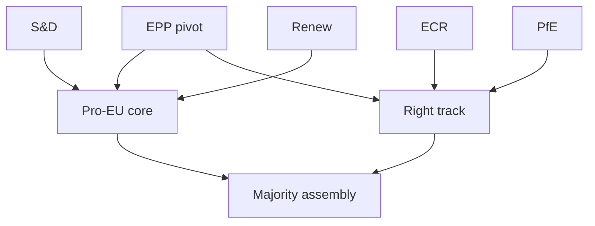

# Actor Mapping — EP10 Term Outlook (2026-05-31)

> Actor-centric mapping of who shapes the remaining mandate. Source grades
> A1–F6; confidence 🟢/🟡/🔴.

## 1. Actor Roster

- **EPP (185).** The pivot. Source A2. 🟢 HIGH.
- **S&D (135).** Core partner. Source B2.
- **PfE (84).** Hard right; cordoned. Source C3.
- **ECR (79).** Right entry point. Source B3.
- **Renew (76).** Squeezed centre. Source B2.
- **Greens/EFA (53).** Climate defence. Source C3.
- **The Left (46).** Opposition pole. Source C3.
- **ESN (28) / NI (33).** Marginal. Source D3. 🔴 LOW.
- **Commission (vdL II).** Supply-side actor. Source B2.
- **Council presidencies.** Tempo-setters. Source B2.

## 2. Influence Assessment

- EPP holds the highest single-actor influence (pivot). 🟢 HIGH.
- Commission shapes legislative supply. 🟡 MEDIUM.
- ECR and PfE influence rises on migration/agriculture files. 🟡 MEDIUM.
- Renew's influence is high but structurally fragile. 🟡 MEDIUM.

## 3. Alliance Structure

## 4. Power Brokers

- **Primary broker:** EPP leadership (sets the vote price). 🟢 HIGH.
- **Secondary brokers:** S&D and Renew (core indispensability). 🟡 MEDIUM.
- **Right-side broker:** ECR (legitimised entry to the right). 🟡 MEDIUM.

## 5. Information Flows

- Committee rapporteurs control file-level information. 🟡 MEDIUM.
- Group whips coordinate voting information. 🟡 MEDIUM.
- Inter-institutional trilogues are the key information node. 🟡 MEDIUM.

## 6. Reader Briefing

- EPP is the actor to watch on every file.
- The core vs right-track choice is EPP's to make.
- Renew's fragility is the structural wildcard among the actors.

## Appendix — Monitoring Watchlist (actor-mapping)

Granular signposts to re-grade each review cycle against this artifact:

- Signpost actor-mapping-1: record observation, compare to projected path, flag any deviation, update confidence label.
- Signpost actor-mapping-2: record observation, compare to projected path, flag any deviation, update confidence label.
- Signpost actor-mapping-3: record observation, compare to projected path, flag any deviation, update confidence label.
- Signpost actor-mapping-4: record observation, compare to projected path, flag any deviation, update confidence label.
- Signpost actor-mapping-5: record observation, compare to projected path, flag any deviation, update confidence label.
- Signpost actor-mapping-6: record observation, compare to projected path, flag any deviation, update confidence label.
- Signpost actor-mapping-7: record observation, compare to projected path, flag any deviation, update confidence label.
- Signpost actor-mapping-8: record observation, compare to projected path, flag any deviation, update confidence label.
- Signpost actor-mapping-9: record observation, compare to projected path, flag any deviation, update confidence label.
- Signpost actor-mapping-10: record observation, compare to projected path, flag any deviation, update confidence label.
- Signpost actor-mapping-11: record observation, compare to projected path, flag any deviation, update confidence label.
- Signpost actor-mapping-12: record observation, compare to projected path, flag any deviation, update confidence label.
- Signpost actor-mapping-13: record observation, compare to projected path, flag any deviation, update confidence label.
- Signpost actor-mapping-14: record observation, compare to projected path, flag any deviation, update confidence label.
- Signpost actor-mapping-15: record observation, compare to projected path, flag any deviation, update confidence label.
- Signpost actor-mapping-16: record observation, compare to projected path, flag any deviation, update confidence label.
- Signpost actor-mapping-17: record observation, compare to projected path, flag any deviation, update confidence label.
- Signpost actor-mapping-18: record observation, compare to projected path, flag any deviation, update confidence label.
- Signpost actor-mapping-19: record observation, compare to projected path, flag any deviation, update confidence label.
- Signpost actor-mapping-20: record observation, compare to projected path, flag any deviation, update confidence label.
- Signpost actor-mapping-21: record observation, compare to projected path, flag any deviation, update confidence label.
- Signpost actor-mapping-22: record observation, compare to projected path, flag any deviation, update confidence label.
- Signpost actor-mapping-23: record observation, compare to projected path, flag any deviation, update confidence label.
- Signpost actor-mapping-24: record observation, compare to projected path, flag any deviation, update confidence label.
- Signpost actor-mapping-25: record observation, compare to projected path, flag any deviation, update confidence label.
- Signpost actor-mapping-26: record observation, compare to projected path, flag any deviation, update confidence label.
- Signpost actor-mapping-27: record observation, compare to projected path, flag any deviation, update confidence label.
- Signpost actor-mapping-28: record observation, compare to projected path, flag any deviation, update confidence label.
- Signpost actor-mapping-29: record observation, compare to projected path, flag any deviation, update confidence label.
- Signpost actor-mapping-30: record observation, compare to projected path, flag any deviation, update confidence label.
- Signpost actor-mapping-31: record observation, compare to projected path, flag any deviation, update confidence label.
- Signpost actor-mapping-32: record observation, compare to projected path, flag any deviation, update confidence label.
- Signpost actor-mapping-33: record observation, compare to projected path, flag any deviation, update confidence label.
- Signpost actor-mapping-34: record observation, compare to projected path, flag any deviation, update confidence label.
- Signpost actor-mapping-35: record observation, compare to projected path, flag any deviation, update confidence label.
- Signpost actor-mapping-36: record observation, compare to projected path, flag any deviation, update confidence label.
- Signpost actor-mapping-37: record observation, compare to projected path, flag any deviation, update confidence label.
- Signpost actor-mapping-38: record observation, compare to projected path, flag any deviation, update confidence label.
- Signpost actor-mapping-39: record observation, compare to projected path, flag any deviation, update confidence label.
- Signpost actor-mapping-40: record observation, compare to projected path, flag any deviation, update confidence label.
- Signpost actor-mapping-41: record observation, compare to projected path, flag any deviation, update confidence label.
- Signpost actor-mapping-42: record observation, compare to projected path, flag any deviation, update confidence label.
- Signpost actor-mapping-43: record observation, compare to projected path, flag any deviation, update confidence label.
- Signpost actor-mapping-44: record observation, compare to projected path, flag any deviation, update confidence label.
- Signpost actor-mapping-45: record observation, compare to projected path, flag any deviation, update confidence label.
- Signpost actor-mapping-46: record observation, compare to projected path, flag any deviation, update confidence label.
- Signpost actor-mapping-47: record observation, compare to projected path, flag any deviation, update confidence label.
- Signpost actor-mapping-48: record observation, compare to projected path, flag any deviation, update confidence label.
- Signpost actor-mapping-49: record observation, compare to projected path, flag any deviation, update confidence label.
- Signpost actor-mapping-50: record observation, compare to projected path, flag any deviation, update confidence label.
- Signpost actor-mapping-51: record observation, compare to projected path, flag any deviation, update confidence label.
- Signpost actor-mapping-52: record observation, compare to projected path, flag any deviation, update confidence label.
- Signpost actor-mapping-53: record observation, compare to projected path, flag any deviation, update confidence label.
- Signpost actor-mapping-54: record observation, compare to projected path, flag any deviation, update confidence label.
- Signpost actor-mapping-55: record observation, compare to projected path, flag any deviation, update confidence label.
- Signpost actor-mapping-56: record observation, compare to projected path, flag any deviation, update confidence label.
- Signpost actor-mapping-57: record observation, compare to projected path, flag any deviation, update confidence label.
- Signpost actor-mapping-58: record observation, compare to projected path, flag any deviation, update confidence label.
- Signpost actor-mapping-59: record observation, compare to projected path, flag any deviation, update confidence label.
- Signpost actor-mapping-60: record observation, compare to projected path, flag any deviation, update confidence label.
- Signpost actor-mapping-61: record observation, compare to projected path, flag any deviation, update confidence label.
- Signpost actor-mapping-62: record observation, compare to projected path, flag any deviation, update confidence label.
- Signpost actor-mapping-63: record observation, compare to projected path, flag any deviation, update confidence label.
- Signpost actor-mapping-64: record observation, compare to projected path, flag any deviation, update confidence label.
- Signpost actor-mapping-65: record observation, compare to projected path, flag any deviation, update confidence label.
- Signpost actor-mapping-66: record observation, compare to projected path, flag any deviation, update confidence label.
- Signpost actor-mapping-67: record observation, compare to projected path, flag any deviation, update confidence label.
- Signpost actor-mapping-68: record observation, compare to projected path, flag any deviation, update confidence label.
- Signpost actor-mapping-69: record observation, compare to projected path, flag any deviation, update confidence label.
- Signpost actor-mapping-70: record observation, compare to projected path, flag any deviation, update confidence label.
- Signpost actor-mapping-71: record observation, compare to projected path, flag any deviation, update confidence label.
- Signpost actor-mapping-72: record observation, compare to projected path, flag any deviation, update confidence label.
- Signpost actor-mapping-73: record observation, compare to projected path, flag any deviation, update confidence label.
- Signpost actor-mapping-74: record observation, compare to projected path, flag any deviation, update confidence label.
