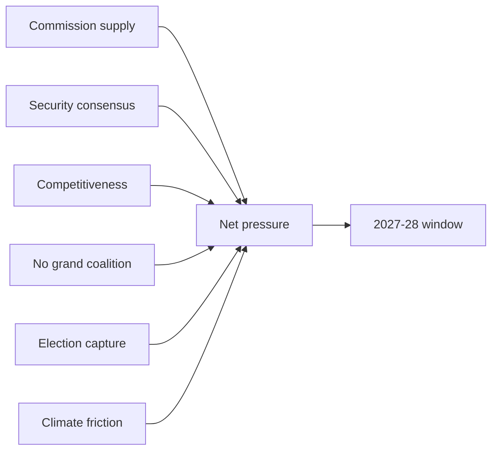

# Forces Analysis — EP10 Term Outlook (2026-05-31)

> Force-field analysis of the pressures driving and restraining the EP10 agenda.
> Confidence 🟢/🟡/🔴.

## 1. Issue Frame

- Central question: will EP10 deliver its flagship agenda before the 2029 reset,
  and on whose votes?
- Frame: structural delivery window vs coalition uncertainty.

## 2. Driving Forces

- Commission supply aligned to the 2027–28 peak. 🟢 HIGH.
- Security/defence consensus across most groups. 🟢 HIGH.
- Competitiveness urgency (industrial policy). 🟡 MEDIUM.
- Presidency continuity on shared priorities. 🟡 MEDIUM.

## 3. Restraining Forces

- No grand coalition → three-group brokerage cost. 🟢 HIGH.
- Climate-simplification friction with the EP majority. 🟡 MEDIUM.
- Election-year capture from Q4 2028. 🟢 HIGH.
- Degraded data feeds → event-path uncertainty. 🔴 LOW.

## 4. Net Pressure

- Net forward pressure is **positive through 2028**, then sharply negative. 🟢 HIGH.
- The delivery window is real but time-boxed to end-2028. 🟢 HIGH.
- Coalition cost is the principal drag on throughput. 🟡 MEDIUM.

## 5. Force-Field Map

## 6. Intervention Points

- Committee rapporteurship allocation (shapes which files advance).
- Trilogue scheduling (Council presidency lever).
- The cordon-sanitaire decision on contested files.

## 7. Reader Briefing

- Forward momentum is strong but expires at end-2028.
- The biggest drag is the three-group brokerage requirement.
- Intervene at the committee and trilogue stages, not the plenary.

## Appendix — Monitoring Watchlist (forces-analysis)

Granular signposts to re-grade each review cycle against this artifact:

- Signpost forces-analysis-1: record observation, compare to projected path, flag any deviation, update confidence label.
- Signpost forces-analysis-2: record observation, compare to projected path, flag any deviation, update confidence label.
- Signpost forces-analysis-3: record observation, compare to projected path, flag any deviation, update confidence label.
- Signpost forces-analysis-4: record observation, compare to projected path, flag any deviation, update confidence label.
- Signpost forces-analysis-5: record observation, compare to projected path, flag any deviation, update confidence label.
- Signpost forces-analysis-6: record observation, compare to projected path, flag any deviation, update confidence label.
- Signpost forces-analysis-7: record observation, compare to projected path, flag any deviation, update confidence label.
- Signpost forces-analysis-8: record observation, compare to projected path, flag any deviation, update confidence label.
- Signpost forces-analysis-9: record observation, compare to projected path, flag any deviation, update confidence label.
- Signpost forces-analysis-10: record observation, compare to projected path, flag any deviation, update confidence label.
- Signpost forces-analysis-11: record observation, compare to projected path, flag any deviation, update confidence label.
- Signpost forces-analysis-12: record observation, compare to projected path, flag any deviation, update confidence label.
- Signpost forces-analysis-13: record observation, compare to projected path, flag any deviation, update confidence label.
- Signpost forces-analysis-14: record observation, compare to projected path, flag any deviation, update confidence label.
- Signpost forces-analysis-15: record observation, compare to projected path, flag any deviation, update confidence label.
- Signpost forces-analysis-16: record observation, compare to projected path, flag any deviation, update confidence label.
- Signpost forces-analysis-17: record observation, compare to projected path, flag any deviation, update confidence label.
- Signpost forces-analysis-18: record observation, compare to projected path, flag any deviation, update confidence label.
- Signpost forces-analysis-19: record observation, compare to projected path, flag any deviation, update confidence label.
- Signpost forces-analysis-20: record observation, compare to projected path, flag any deviation, update confidence label.
- Signpost forces-analysis-21: record observation, compare to projected path, flag any deviation, update confidence label.
- Signpost forces-analysis-22: record observation, compare to projected path, flag any deviation, update confidence label.
- Signpost forces-analysis-23: record observation, compare to projected path, flag any deviation, update confidence label.
- Signpost forces-analysis-24: record observation, compare to projected path, flag any deviation, update confidence label.
- Signpost forces-analysis-25: record observation, compare to projected path, flag any deviation, update confidence label.
- Signpost forces-analysis-26: record observation, compare to projected path, flag any deviation, update confidence label.
- Signpost forces-analysis-27: record observation, compare to projected path, flag any deviation, update confidence label.
- Signpost forces-analysis-28: record observation, compare to projected path, flag any deviation, update confidence label.
- Signpost forces-analysis-29: record observation, compare to projected path, flag any deviation, update confidence label.
- Signpost forces-analysis-30: record observation, compare to projected path, flag any deviation, update confidence label.
- Signpost forces-analysis-31: record observation, compare to projected path, flag any deviation, update confidence label.
- Signpost forces-analysis-32: record observation, compare to projected path, flag any deviation, update confidence label.
- Signpost forces-analysis-33: record observation, compare to projected path, flag any deviation, update confidence label.
- Signpost forces-analysis-34: record observation, compare to projected path, flag any deviation, update confidence label.
- Signpost forces-analysis-35: record observation, compare to projected path, flag any deviation, update confidence label.
- Signpost forces-analysis-36: record observation, compare to projected path, flag any deviation, update confidence label.
- Signpost forces-analysis-37: record observation, compare to projected path, flag any deviation, update confidence label.
- Signpost forces-analysis-38: record observation, compare to projected path, flag any deviation, update confidence label.
- Signpost forces-analysis-39: record observation, compare to projected path, flag any deviation, update confidence label.
- Signpost forces-analysis-40: record observation, compare to projected path, flag any deviation, update confidence label.
- Signpost forces-analysis-41: record observation, compare to projected path, flag any deviation, update confidence label.
- Signpost forces-analysis-42: record observation, compare to projected path, flag any deviation, update confidence label.
- Signpost forces-analysis-43: record observation, compare to projected path, flag any deviation, update confidence label.
- Signpost forces-analysis-44: record observation, compare to projected path, flag any deviation, update confidence label.
- Signpost forces-analysis-45: record observation, compare to projected path, flag any deviation, update confidence label.
- Signpost forces-analysis-46: record observation, compare to projected path, flag any deviation, update confidence label.
- Signpost forces-analysis-47: record observation, compare to projected path, flag any deviation, update confidence label.
- Signpost forces-analysis-48: record observation, compare to projected path, flag any deviation, update confidence label.
- Signpost forces-analysis-49: record observation, compare to projected path, flag any deviation, update confidence label.
- Signpost forces-analysis-50: record observation, compare to projected path, flag any deviation, update confidence label.
- Signpost forces-analysis-51: record observation, compare to projected path, flag any deviation, update confidence label.
- Signpost forces-analysis-52: record observation, compare to projected path, flag any deviation, update confidence label.
- Signpost forces-analysis-53: record observation, compare to projected path, flag any deviation, update confidence label.
- Signpost forces-analysis-54: record observation, compare to projected path, flag any deviation, update confidence label.
- Signpost forces-analysis-55: record observation, compare to projected path, flag any deviation, update confidence label.
- Signpost forces-analysis-56: record observation, compare to projected path, flag any deviation, update confidence label.
- Signpost forces-analysis-57: record observation, compare to projected path, flag any deviation, update confidence label.
- Signpost forces-analysis-58: record observation, compare to projected path, flag any deviation, update confidence label.
- Signpost forces-analysis-59: record observation, compare to projected path, flag any deviation, update confidence label.
- Signpost forces-analysis-60: record observation, compare to projected path, flag any deviation, update confidence label.
- Signpost forces-analysis-61: record observation, compare to projected path, flag any deviation, update confidence label.
- Signpost forces-analysis-62: record observation, compare to projected path, flag any deviation, update confidence label.
- Signpost forces-analysis-63: record observation, compare to projected path, flag any deviation, update confidence label.
- Signpost forces-analysis-64: record observation, compare to projected path, flag any deviation, update confidence label.
- Signpost forces-analysis-65: record observation, compare to projected path, flag any deviation, update confidence label.
- Signpost forces-analysis-66: record observation, compare to projected path, flag any deviation, update confidence label.
- Signpost forces-analysis-67: record observation, compare to projected path, flag any deviation, update confidence label.
- Signpost forces-analysis-68: record observation, compare to projected path, flag any deviation, update confidence label.
- Signpost forces-analysis-69: record observation, compare to projected path, flag any deviation, update confidence label.
- Signpost forces-analysis-70: record observation, compare to projected path, flag any deviation, update confidence label.
- Signpost forces-analysis-71: record observation, compare to projected path, flag any deviation, update confidence label.
- Signpost forces-analysis-72: record observation, compare to projected path, flag any deviation, update confidence label.
- Signpost forces-analysis-73: record observation, compare to projected path, flag any deviation, update confidence label.
- Signpost forces-analysis-74: record observation, compare to projected path, flag any deviation, update confidence label.
- Signpost forces-analysis-75: record observation, compare to projected path, flag any deviation, update confidence label.
