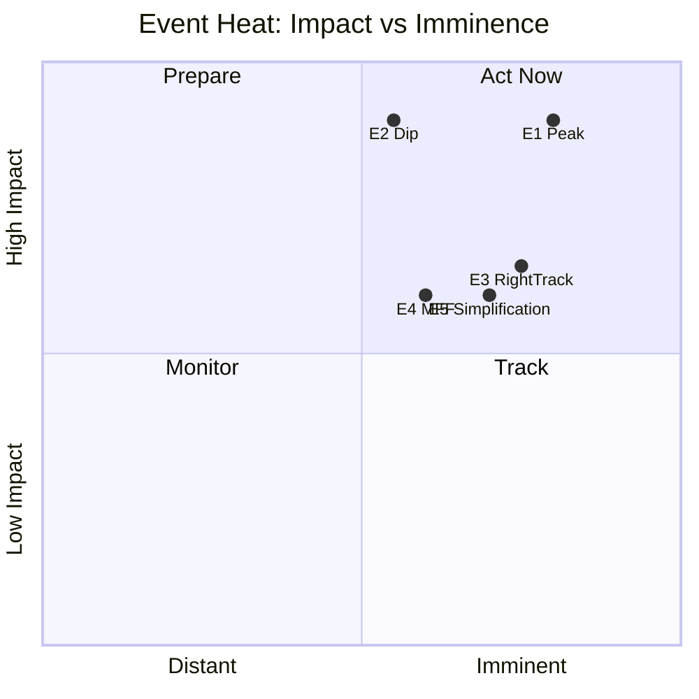

# Impact Matrix — EP10 Term Outlook (2026-05-31)

> Maps the term's key developments to stakeholder impacts, heat, and cascades.
> Confidence 🟢/🟡/🔴.

## 1. Event List

- E1: 2027–2028 legislative delivery peak.
- E2: 2029 election output contraction.
- E3: Recurrent right-track votes on migration.
- E4: MFF mid-term review pressure (2027).
- E5: Climate simplification agenda.

## 2. Stakeholder Impacts

- **E1 → all groups.** Maximum delivery window. 🟢 HIGH.
- **E2 → all groups.** Pipeline closes; campaign mode. 🟢 HIGH.
- **E3 → Greens/Left.** Defensive losses on migration. 🟡 MEDIUM.
- **E4 → core groups.** Budget contestation. 🟡 MEDIUM.
- **E5 → Greens.** Climate ambition erosion. 🟡 MEDIUM.

## 3. Impact Matrix

| Event | EPP | S&D | Right bloc | Greens/Left | Confidence |
|-------|-----|-----|-----------|-------------|-----------|
| E1 peak | + | + | + | + | 🟢 HIGH |
| E2 dip | − | − | − | − | 🟢 HIGH |
| E3 right-track | + | − | + | − | 🟡 MEDIUM |
| E4 MFF | +/− | +/− | +/− | +/− | 🟡 MEDIUM |
| E5 simplification | + | +/− | + | − | 🟡 MEDIUM |

## 4. Heat Assessment

## 5. Cascade Effects

- E1 → high throughput → more files exposed to E2 abandonment.
- E3 repetition → normalisation risk (cascades into coalition regime change).
- E4 → resource contest → squeezes climate/cohesion lines (links E5).

## 6. Reader Briefing

- E1 (peak) and E2 (dip) are the highest-impact, highest-confidence events.
- E3's danger is cumulative: repetition cascades into regime change.
- Budget pressure (E4) amplifies climate erosion (E5).

## Appendix — Monitoring Watchlist (impact-matrix)

Granular signposts to re-grade each review cycle against this artifact:

- Signpost impact-matrix-1: record observation, compare to projected path, flag any deviation, update confidence label.
- Signpost impact-matrix-2: record observation, compare to projected path, flag any deviation, update confidence label.
- Signpost impact-matrix-3: record observation, compare to projected path, flag any deviation, update confidence label.
- Signpost impact-matrix-4: record observation, compare to projected path, flag any deviation, update confidence label.
- Signpost impact-matrix-5: record observation, compare to projected path, flag any deviation, update confidence label.
- Signpost impact-matrix-6: record observation, compare to projected path, flag any deviation, update confidence label.
- Signpost impact-matrix-7: record observation, compare to projected path, flag any deviation, update confidence label.
- Signpost impact-matrix-8: record observation, compare to projected path, flag any deviation, update confidence label.
- Signpost impact-matrix-9: record observation, compare to projected path, flag any deviation, update confidence label.
- Signpost impact-matrix-10: record observation, compare to projected path, flag any deviation, update confidence label.
- Signpost impact-matrix-11: record observation, compare to projected path, flag any deviation, update confidence label.
- Signpost impact-matrix-12: record observation, compare to projected path, flag any deviation, update confidence label.
- Signpost impact-matrix-13: record observation, compare to projected path, flag any deviation, update confidence label.
- Signpost impact-matrix-14: record observation, compare to projected path, flag any deviation, update confidence label.
- Signpost impact-matrix-15: record observation, compare to projected path, flag any deviation, update confidence label.
- Signpost impact-matrix-16: record observation, compare to projected path, flag any deviation, update confidence label.
- Signpost impact-matrix-17: record observation, compare to projected path, flag any deviation, update confidence label.
- Signpost impact-matrix-18: record observation, compare to projected path, flag any deviation, update confidence label.
- Signpost impact-matrix-19: record observation, compare to projected path, flag any deviation, update confidence label.
- Signpost impact-matrix-20: record observation, compare to projected path, flag any deviation, update confidence label.
- Signpost impact-matrix-21: record observation, compare to projected path, flag any deviation, update confidence label.
- Signpost impact-matrix-22: record observation, compare to projected path, flag any deviation, update confidence label.
- Signpost impact-matrix-23: record observation, compare to projected path, flag any deviation, update confidence label.
- Signpost impact-matrix-24: record observation, compare to projected path, flag any deviation, update confidence label.
- Signpost impact-matrix-25: record observation, compare to projected path, flag any deviation, update confidence label.
- Signpost impact-matrix-26: record observation, compare to projected path, flag any deviation, update confidence label.
- Signpost impact-matrix-27: record observation, compare to projected path, flag any deviation, update confidence label.
- Signpost impact-matrix-28: record observation, compare to projected path, flag any deviation, update confidence label.
- Signpost impact-matrix-29: record observation, compare to projected path, flag any deviation, update confidence label.
- Signpost impact-matrix-30: record observation, compare to projected path, flag any deviation, update confidence label.
- Signpost impact-matrix-31: record observation, compare to projected path, flag any deviation, update confidence label.
- Signpost impact-matrix-32: record observation, compare to projected path, flag any deviation, update confidence label.
- Signpost impact-matrix-33: record observation, compare to projected path, flag any deviation, update confidence label.
- Signpost impact-matrix-34: record observation, compare to projected path, flag any deviation, update confidence label.
- Signpost impact-matrix-35: record observation, compare to projected path, flag any deviation, update confidence label.
- Signpost impact-matrix-36: record observation, compare to projected path, flag any deviation, update confidence label.
- Signpost impact-matrix-37: record observation, compare to projected path, flag any deviation, update confidence label.
- Signpost impact-matrix-38: record observation, compare to projected path, flag any deviation, update confidence label.
- Signpost impact-matrix-39: record observation, compare to projected path, flag any deviation, update confidence label.
- Signpost impact-matrix-40: record observation, compare to projected path, flag any deviation, update confidence label.
- Signpost impact-matrix-41: record observation, compare to projected path, flag any deviation, update confidence label.
- Signpost impact-matrix-42: record observation, compare to projected path, flag any deviation, update confidence label.
- Signpost impact-matrix-43: record observation, compare to projected path, flag any deviation, update confidence label.
- Signpost impact-matrix-44: record observation, compare to projected path, flag any deviation, update confidence label.
- Signpost impact-matrix-45: record observation, compare to projected path, flag any deviation, update confidence label.
- Signpost impact-matrix-46: record observation, compare to projected path, flag any deviation, update confidence label.
- Signpost impact-matrix-47: record observation, compare to projected path, flag any deviation, update confidence label.
- Signpost impact-matrix-48: record observation, compare to projected path, flag any deviation, update confidence label.
- Signpost impact-matrix-49: record observation, compare to projected path, flag any deviation, update confidence label.
- Signpost impact-matrix-50: record observation, compare to projected path, flag any deviation, update confidence label.
- Signpost impact-matrix-51: record observation, compare to projected path, flag any deviation, update confidence label.
- Signpost impact-matrix-52: record observation, compare to projected path, flag any deviation, update confidence label.
- Signpost impact-matrix-53: record observation, compare to projected path, flag any deviation, update confidence label.
- Signpost impact-matrix-54: record observation, compare to projected path, flag any deviation, update confidence label.
- Signpost impact-matrix-55: record observation, compare to projected path, flag any deviation, update confidence label.
- Signpost impact-matrix-56: record observation, compare to projected path, flag any deviation, update confidence label.
- Signpost impact-matrix-57: record observation, compare to projected path, flag any deviation, update confidence label.
- Signpost impact-matrix-58: record observation, compare to projected path, flag any deviation, update confidence label.
- Signpost impact-matrix-59: record observation, compare to projected path, flag any deviation, update confidence label.
- Signpost impact-matrix-60: record observation, compare to projected path, flag any deviation, update confidence label.
- Signpost impact-matrix-61: record observation, compare to projected path, flag any deviation, update confidence label.
- Signpost impact-matrix-62: record observation, compare to projected path, flag any deviation, update confidence label.
- Signpost impact-matrix-63: record observation, compare to projected path, flag any deviation, update confidence label.
- Signpost impact-matrix-64: record observation, compare to projected path, flag any deviation, update confidence label.
- Signpost impact-matrix-65: record observation, compare to projected path, flag any deviation, update confidence label.
- Signpost impact-matrix-66: record observation, compare to projected path, flag any deviation, update confidence label.
- Signpost impact-matrix-67: record observation, compare to projected path, flag any deviation, update confidence label.
- Signpost impact-matrix-68: record observation, compare to projected path, flag any deviation, update confidence label.
- Signpost impact-matrix-69: record observation, compare to projected path, flag any deviation, update confidence label.
- Signpost impact-matrix-70: record observation, compare to projected path, flag any deviation, update confidence label.
