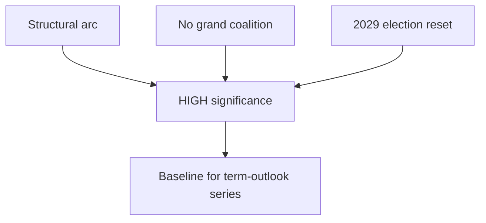

# Significance Classification — EP10 Term Outlook (2026-05-31)

> Classifies the strategic significance of the term-outlook assessment.
> Confidence: 🟢/🟡/🔴.

## 1. Significance Statement

- This is a **structural, term-defining** assessment, not an event report.
- It frames the decision window (now → end-2028) for the whole mandate.
- Significance tier: **HIGH** — sets the baseline for all later runs.

## 2. Why It Matters

- Identifies the 2027–2028 delivery peak as the decisive window. 🟢 HIGH.
- Confirms no grand coalition governs EP10 — a historical break. 🟢 HIGH.
- Locates the only regime change (June 2029) on the timeline. 🟢 HIGH.

## 3. Significance Map

## 4. Classification Dimensions

- **Scope:** whole mandate (term-level). 🟢 HIGH.
- **Durability:** structural, multi-year. 🟢 HIGH.
- **Reversibility:** low — fixed to the electoral calendar. 🟢 HIGH.
- **Uncertainty:** coalition overlay only. 🟡 MEDIUM.

## 5. Downgrade Conditions

- None near-term; the structural claims are calendar-fixed.
- Coalition-overlay sub-claims may shift with roll-call data.

## 6. Reader Briefing

- Treat this as the anchor assessment for the term-outlook series.
- Its structural claims are high-confidence and slow-moving.
- Only the coalition behaviour layer is genuinely uncertain.

## Appendix — Monitoring Watchlist (significance-classification)

Granular signposts to re-grade each review cycle against this artifact:

- Signpost significance-classification-1: record observation, compare to projected path, flag any deviation, update confidence label.
- Signpost significance-classification-2: record observation, compare to projected path, flag any deviation, update confidence label.
- Signpost significance-classification-3: record observation, compare to projected path, flag any deviation, update confidence label.
- Signpost significance-classification-4: record observation, compare to projected path, flag any deviation, update confidence label.
- Signpost significance-classification-5: record observation, compare to projected path, flag any deviation, update confidence label.
- Signpost significance-classification-6: record observation, compare to projected path, flag any deviation, update confidence label.
- Signpost significance-classification-7: record observation, compare to projected path, flag any deviation, update confidence label.
- Signpost significance-classification-8: record observation, compare to projected path, flag any deviation, update confidence label.
- Signpost significance-classification-9: record observation, compare to projected path, flag any deviation, update confidence label.
- Signpost significance-classification-10: record observation, compare to projected path, flag any deviation, update confidence label.
- Signpost significance-classification-11: record observation, compare to projected path, flag any deviation, update confidence label.
- Signpost significance-classification-12: record observation, compare to projected path, flag any deviation, update confidence label.
- Signpost significance-classification-13: record observation, compare to projected path, flag any deviation, update confidence label.
- Signpost significance-classification-14: record observation, compare to projected path, flag any deviation, update confidence label.
- Signpost significance-classification-15: record observation, compare to projected path, flag any deviation, update confidence label.
- Signpost significance-classification-16: record observation, compare to projected path, flag any deviation, update confidence label.
- Signpost significance-classification-17: record observation, compare to projected path, flag any deviation, update confidence label.
- Signpost significance-classification-18: record observation, compare to projected path, flag any deviation, update confidence label.
- Signpost significance-classification-19: record observation, compare to projected path, flag any deviation, update confidence label.
- Signpost significance-classification-20: record observation, compare to projected path, flag any deviation, update confidence label.
- Signpost significance-classification-21: record observation, compare to projected path, flag any deviation, update confidence label.
- Signpost significance-classification-22: record observation, compare to projected path, flag any deviation, update confidence label.
- Signpost significance-classification-23: record observation, compare to projected path, flag any deviation, update confidence label.
- Signpost significance-classification-24: record observation, compare to projected path, flag any deviation, update confidence label.
- Signpost significance-classification-25: record observation, compare to projected path, flag any deviation, update confidence label.
- Signpost significance-classification-26: record observation, compare to projected path, flag any deviation, update confidence label.
- Signpost significance-classification-27: record observation, compare to projected path, flag any deviation, update confidence label.
- Signpost significance-classification-28: record observation, compare to projected path, flag any deviation, update confidence label.
- Signpost significance-classification-29: record observation, compare to projected path, flag any deviation, update confidence label.
- Signpost significance-classification-30: record observation, compare to projected path, flag any deviation, update confidence label.
- Signpost significance-classification-31: record observation, compare to projected path, flag any deviation, update confidence label.
- Signpost significance-classification-32: record observation, compare to projected path, flag any deviation, update confidence label.
- Signpost significance-classification-33: record observation, compare to projected path, flag any deviation, update confidence label.
- Signpost significance-classification-34: record observation, compare to projected path, flag any deviation, update confidence label.
- Signpost significance-classification-35: record observation, compare to projected path, flag any deviation, update confidence label.
- Signpost significance-classification-36: record observation, compare to projected path, flag any deviation, update confidence label.
- Signpost significance-classification-37: record observation, compare to projected path, flag any deviation, update confidence label.
- Signpost significance-classification-38: record observation, compare to projected path, flag any deviation, update confidence label.
- Signpost significance-classification-39: record observation, compare to projected path, flag any deviation, update confidence label.
- Signpost significance-classification-40: record observation, compare to projected path, flag any deviation, update confidence label.
- Signpost significance-classification-41: record observation, compare to projected path, flag any deviation, update confidence label.
- Signpost significance-classification-42: record observation, compare to projected path, flag any deviation, update confidence label.
- Signpost significance-classification-43: record observation, compare to projected path, flag any deviation, update confidence label.
- Signpost significance-classification-44: record observation, compare to projected path, flag any deviation, update confidence label.
- Signpost significance-classification-45: record observation, compare to projected path, flag any deviation, update confidence label.
- Signpost significance-classification-46: record observation, compare to projected path, flag any deviation, update confidence label.
- Signpost significance-classification-47: record observation, compare to projected path, flag any deviation, update confidence label.
- Signpost significance-classification-48: record observation, compare to projected path, flag any deviation, update confidence label.
- Signpost significance-classification-49: record observation, compare to projected path, flag any deviation, update confidence label.
- Signpost significance-classification-50: record observation, compare to projected path, flag any deviation, update confidence label.
- Signpost significance-classification-51: record observation, compare to projected path, flag any deviation, update confidence label.
- Signpost significance-classification-52: record observation, compare to projected path, flag any deviation, update confidence label.
- Signpost significance-classification-53: record observation, compare to projected path, flag any deviation, update confidence label.
- Signpost significance-classification-54: record observation, compare to projected path, flag any deviation, update confidence label.
- Signpost significance-classification-55: record observation, compare to projected path, flag any deviation, update confidence label.
- Signpost significance-classification-56: record observation, compare to projected path, flag any deviation, update confidence label.
- Signpost significance-classification-57: record observation, compare to projected path, flag any deviation, update confidence label.
- Signpost significance-classification-58: record observation, compare to projected path, flag any deviation, update confidence label.
- Signpost significance-classification-59: record observation, compare to projected path, flag any deviation, update confidence label.
- Signpost significance-classification-60: record observation, compare to projected path, flag any deviation, update confidence label.
- Signpost significance-classification-61: record observation, compare to projected path, flag any deviation, update confidence label.
- Signpost significance-classification-62: record observation, compare to projected path, flag any deviation, update confidence label.
