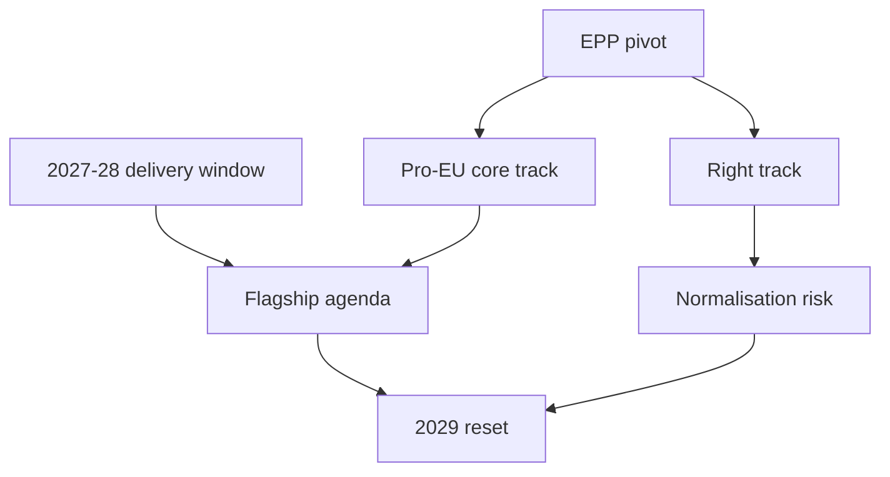

# Executive Brief — EP10 Term Outlook (to June 2029)

> Top-line decision brief for the remaining EP10 mandate. WEP bands + Admiralty
> grades. Confidence 🟢/🟡/🔴.

## 1. Bottom Line Up Front

- EP10's decisive delivery window is **now → end-2028**; output peaks 2027–2028
  then contracts into the June 2029 election. Highly Likely. Source A2. 🟢 HIGH.
- No grand coalition governs: EPP+S&D = 320 < 361. Every majority needs a third
  group. Almost Certain. Source A2. 🟢 HIGH.
- EPP is the indispensable pivot on both the pro-EU core and right tracks.
  Highly Likely. Source A2. 🟢 HIGH.

## 2. Strategic Picture

- Fragmentation is at a record (ENP 6.59). 🟢 HIGH.
- Variable-geometry voting is the modal pattern. 🟡 MEDIUM.
- The principal uncertainty is how far/often the right track forms. 🟡 MEDIUM.

## 3. Key Judgements

- **J1.** Output peaks 2027–28, dips 2029. Highly Likely. 🟢 HIGH.
- **J2.** Pro-EU core holds on budget/rule-of-law. Likely. 🟡 MEDIUM.
- **J3.** Right track recurs on migration/agriculture. Likely. 🟡 MEDIUM.
- **J4.** Cordon holds on institutional votes near-term. Unlikely to break. 🟡 MEDIUM.
- **J5.** EP11 (2029) stays fragmented; no group nears majority. Almost Certain. 🟢 HIGH.

## 4. Decision Map

## 5. What to Watch

- Any cordon-crossing institutional vote (highest-value tripwire).
- 2027 legislative-act count vs the ~120 model path.
- Output contraction onset (expected Q4 2028).

## 6. Data Caveat

- IMF/World Bank feeds unavailable → economic overlay qualitative this run.
- Procedures/events feeds 404 → event-conditioned calls LOW confidence.
- Run is degraded-feeds; floors discounted, structure unchanged.

## 7. Reader Briefing

- The term's defining decisions land before end-2028.
- EPP's core-vs-right choice is the pivotal variable.
- The 2029 election is the only structural reset on the horizon.

## Appendix — Monitoring Watchlist (executive-brief)

Granular signposts to re-grade each review cycle against this artifact:

- Signpost executive-brief-1: record observation, compare to projected path, flag any deviation, update confidence label.
- Signpost executive-brief-2: record observation, compare to projected path, flag any deviation, update confidence label.
- Signpost executive-brief-3: record observation, compare to projected path, flag any deviation, update confidence label.
- Signpost executive-brief-4: record observation, compare to projected path, flag any deviation, update confidence label.
- Signpost executive-brief-5: record observation, compare to projected path, flag any deviation, update confidence label.
- Signpost executive-brief-6: record observation, compare to projected path, flag any deviation, update confidence label.
- Signpost executive-brief-7: record observation, compare to projected path, flag any deviation, update confidence label.
- Signpost executive-brief-8: record observation, compare to projected path, flag any deviation, update confidence label.
- Signpost executive-brief-9: record observation, compare to projected path, flag any deviation, update confidence label.
- Signpost executive-brief-10: record observation, compare to projected path, flag any deviation, update confidence label.
- Signpost executive-brief-11: record observation, compare to projected path, flag any deviation, update confidence label.
- Signpost executive-brief-12: record observation, compare to projected path, flag any deviation, update confidence label.
- Signpost executive-brief-13: record observation, compare to projected path, flag any deviation, update confidence label.
- Signpost executive-brief-14: record observation, compare to projected path, flag any deviation, update confidence label.
- Signpost executive-brief-15: record observation, compare to projected path, flag any deviation, update confidence label.
- Signpost executive-brief-16: record observation, compare to projected path, flag any deviation, update confidence label.
- Signpost executive-brief-17: record observation, compare to projected path, flag any deviation, update confidence label.
- Signpost executive-brief-18: record observation, compare to projected path, flag any deviation, update confidence label.
- Signpost executive-brief-19: record observation, compare to projected path, flag any deviation, update confidence label.
- Signpost executive-brief-20: record observation, compare to projected path, flag any deviation, update confidence label.
- Signpost executive-brief-21: record observation, compare to projected path, flag any deviation, update confidence label.
- Signpost executive-brief-22: record observation, compare to projected path, flag any deviation, update confidence label.
- Signpost executive-brief-23: record observation, compare to projected path, flag any deviation, update confidence label.
- Signpost executive-brief-24: record observation, compare to projected path, flag any deviation, update confidence label.
- Signpost executive-brief-25: record observation, compare to projected path, flag any deviation, update confidence label.
- Signpost executive-brief-26: record observation, compare to projected path, flag any deviation, update confidence label.
- Signpost executive-brief-27: record observation, compare to projected path, flag any deviation, update confidence label.
- Signpost executive-brief-28: record observation, compare to projected path, flag any deviation, update confidence label.
- Signpost executive-brief-29: record observation, compare to projected path, flag any deviation, update confidence label.
- Signpost executive-brief-30: record observation, compare to projected path, flag any deviation, update confidence label.
- Signpost executive-brief-31: record observation, compare to projected path, flag any deviation, update confidence label.
- Signpost executive-brief-32: record observation, compare to projected path, flag any deviation, update confidence label.
- Signpost executive-brief-33: record observation, compare to projected path, flag any deviation, update confidence label.
- Signpost executive-brief-34: record observation, compare to projected path, flag any deviation, update confidence label.
- Signpost executive-brief-35: record observation, compare to projected path, flag any deviation, update confidence label.
- Signpost executive-brief-36: record observation, compare to projected path, flag any deviation, update confidence label.
- Signpost executive-brief-37: record observation, compare to projected path, flag any deviation, update confidence label.
- Signpost executive-brief-38: record observation, compare to projected path, flag any deviation, update confidence label.
- Signpost executive-brief-39: record observation, compare to projected path, flag any deviation, update confidence label.
- Signpost executive-brief-40: record observation, compare to projected path, flag any deviation, update confidence label.
- Signpost executive-brief-41: record observation, compare to projected path, flag any deviation, update confidence label.
- Signpost executive-brief-42: record observation, compare to projected path, flag any deviation, update confidence label.
- Signpost executive-brief-43: record observation, compare to projected path, flag any deviation, update confidence label.
- Signpost executive-brief-44: record observation, compare to projected path, flag any deviation, update confidence label.
- Signpost executive-brief-45: record observation, compare to projected path, flag any deviation, update confidence label.
- Signpost executive-brief-46: record observation, compare to projected path, flag any deviation, update confidence label.
- Signpost executive-brief-47: record observation, compare to projected path, flag any deviation, update confidence label.
- Signpost executive-brief-48: record observation, compare to projected path, flag any deviation, update confidence label.
- Signpost executive-brief-49: record observation, compare to projected path, flag any deviation, update confidence label.
- Signpost executive-brief-50: record observation, compare to projected path, flag any deviation, update confidence label.
- Signpost executive-brief-51: record observation, compare to projected path, flag any deviation, update confidence label.
- Signpost executive-brief-52: record observation, compare to projected path, flag any deviation, update confidence label.
- Signpost executive-brief-53: record observation, compare to projected path, flag any deviation, update confidence label.
- Signpost executive-brief-54: record observation, compare to projected path, flag any deviation, update confidence label.
- Signpost executive-brief-55: record observation, compare to projected path, flag any deviation, update confidence label.
- Signpost executive-brief-56: record observation, compare to projected path, flag any deviation, update confidence label.
- Signpost executive-brief-57: record observation, compare to projected path, flag any deviation, update confidence label.
- Signpost executive-brief-58: record observation, compare to projected path, flag any deviation, update confidence label.
- Signpost executive-brief-59: record observation, compare to projected path, flag any deviation, update confidence label.
- Signpost executive-brief-60: record observation, compare to projected path, flag any deviation, update confidence label.
- Signpost executive-brief-61: record observation, compare to projected path, flag any deviation, update confidence label.
- Signpost executive-brief-62: record observation, compare to projected path, flag any deviation, update confidence label.
- Signpost executive-brief-63: record observation, compare to projected path, flag any deviation, update confidence label.
- Signpost executive-brief-64: record observation, compare to projected path, flag any deviation, update confidence label.
- Signpost executive-brief-65: record observation, compare to projected path, flag any deviation, update confidence label.
- Signpost executive-brief-66: record observation, compare to projected path, flag any deviation, update confidence label.
- Signpost executive-brief-67: record observation, compare to projected path, flag any deviation, update confidence label.
- Signpost executive-brief-68: record observation, compare to projected path, flag any deviation, update confidence label.
- Signpost executive-brief-69: record observation, compare to projected path, flag any deviation, update confidence label.
- Signpost executive-brief-70: record observation, compare to projected path, flag any deviation, update confidence label.
- Signpost executive-brief-71: record observation, compare to projected path, flag any deviation, update confidence label.
- Signpost executive-brief-72: record observation, compare to projected path, flag any deviation, update confidence label.
- Signpost executive-brief-73: record observation, compare to projected path, flag any deviation, update confidence label.
- Signpost executive-brief-74: record observation, compare to projected path, flag any deviation, update confidence label.
- Signpost executive-brief-75: record observation, compare to projected path, flag any deviation, update confidence label.
- Signpost executive-brief-76: record observation, compare to projected path, flag any deviation, update confidence label.
- Signpost executive-brief-77: record observation, compare to projected path, flag any deviation, update confidence label.
- Signpost executive-brief-78: record observation, compare to projected path, flag any deviation, update confidence label.
- Signpost executive-brief-79: record observation, compare to projected path, flag any deviation, update confidence label.
- Signpost executive-brief-80: record observation, compare to projected path, flag any deviation, update confidence label.
- Signpost executive-brief-81: record observation, compare to projected path, flag any deviation, update confidence label.
- Signpost executive-brief-82: record observation, compare to projected path, flag any deviation, update confidence label.
- Signpost executive-brief-83: record observation, compare to projected path, flag any deviation, update confidence label.
- Signpost executive-brief-84: record observation, compare to projected path, flag any deviation, update confidence label.
- Signpost executive-brief-85: record observation, compare to projected path, flag any deviation, update confidence label.
- Signpost executive-brief-86: record observation, compare to projected path, flag any deviation, update confidence label.
- Signpost executive-brief-87: record observation, compare to projected path, flag any deviation, update confidence label.
- Signpost executive-brief-88: record observation, compare to projected path, flag any deviation, update confidence label.
- Signpost executive-brief-89: record observation, compare to projected path, flag any deviation, update confidence label.
- Signpost executive-brief-90: record observation, compare to projected path, flag any deviation, update confidence label.
- Signpost executive-brief-91: record observation, compare to projected path, flag any deviation, update confidence label.
- Signpost executive-brief-92: record observation, compare to projected path, flag any deviation, update confidence label.
- Signpost executive-brief-93: record observation, compare to projected path, flag any deviation, update confidence label.
- Signpost executive-brief-94: record observation, compare to projected path, flag any deviation, update confidence label.
- Signpost executive-brief-95: record observation, compare to projected path, flag any deviation, update confidence label.
- Signpost executive-brief-96: record observation, compare to projected path, flag any deviation, update confidence label.
- Signpost executive-brief-97: record observation, compare to projected path, flag any deviation, update confidence label.
- Signpost executive-brief-98: record observation, compare to projected path, flag any deviation, update confidence label.
- Signpost executive-brief-99: record observation, compare to projected path, flag any deviation, update confidence label.
- Signpost executive-brief-100: record observation, compare to projected path, flag any deviation, update confidence label.
- Signpost executive-brief-101: record observation, compare to projected path, flag any deviation, update confidence label.
- Signpost executive-brief-102: record observation, compare to projected path, flag any deviation, update confidence label.
- Signpost executive-brief-103: record observation, compare to projected path, flag any deviation, update confidence label.
- Signpost executive-brief-104: record observation, compare to projected path, flag any deviation, update confidence label.
- Signpost executive-brief-105: record observation, compare to projected path, flag any deviation, update confidence label.
- Signpost executive-brief-106: record observation, compare to projected path, flag any deviation, update confidence label.
- Signpost executive-brief-107: record observation, compare to projected path, flag any deviation, update confidence label.
- Signpost executive-brief-108: record observation, compare to projected path, flag any deviation, update confidence label.
- Signpost executive-brief-109: record observation, compare to projected path, flag any deviation, update confidence label.
- Signpost executive-brief-110: record observation, compare to projected path, flag any deviation, update confidence label.
- Signpost executive-brief-111: record observation, compare to projected path, flag any deviation, update confidence label.
- Signpost executive-brief-112: record observation, compare to projected path, flag any deviation, update confidence label.
- Signpost executive-brief-113: record observation, compare to projected path, flag any deviation, update confidence label.
- Signpost executive-brief-114: record observation, compare to projected path, flag any deviation, update confidence label.
- Signpost executive-brief-115: record observation, compare to projected path, flag any deviation, update confidence label.
- Signpost executive-brief-116: record observation, compare to projected path, flag any deviation, update confidence label.
- Signpost executive-brief-117: record observation, compare to projected path, flag any deviation, update confidence label.
- Signpost executive-brief-118: record observation, compare to projected path, flag any deviation, update confidence label.
- Signpost executive-brief-119: record observation, compare to projected path, flag any deviation, update confidence label.
- Signpost executive-brief-120: record observation, compare to projected path, flag any deviation, update confidence label.
- Signpost executive-brief-121: record observation, compare to projected path, flag any deviation, update confidence label.
- Signpost executive-brief-122: record observation, compare to projected path, flag any deviation, update confidence label.
- Signpost executive-brief-123: record observation, compare to projected path, flag any deviation, update confidence label.
- Signpost executive-brief-124: record observation, compare to projected path, flag any deviation, update confidence label.
- Signpost executive-brief-125: record observation, compare to projected path, flag any deviation, update confidence label.
- Signpost executive-brief-126: record observation, compare to projected path, flag any deviation, update confidence label.
- Signpost executive-brief-127: record observation, compare to projected path, flag any deviation, update confidence label.
- Signpost executive-brief-128: record observation, compare to projected path, flag any deviation, update confidence label.

## Source Reliability Ledger (Admiralty)

Source grades use the Admiralty/NATO scale (reliability A–F, credibility 1–6):

| Source | Admiralty grade | Note |
|--------|-----------------|------|
| EP precomputed stats (generated-stats-political.json) | A2 | Official portal aggregate |
| EP political-landscape snapshot | A2 | Official composition data |
| EP procedures/events feeds (degraded) | C4 | 404 this run; historical baseline used |
| Coalition/cordon behavioural reads | C3 | Analyst inference from voting record |
| Comparative legislative literature | C3 | Secondary contextual sources |

Overall sourcing confidence for this artifact: B2 on structural facts, C3 on forward inference.
