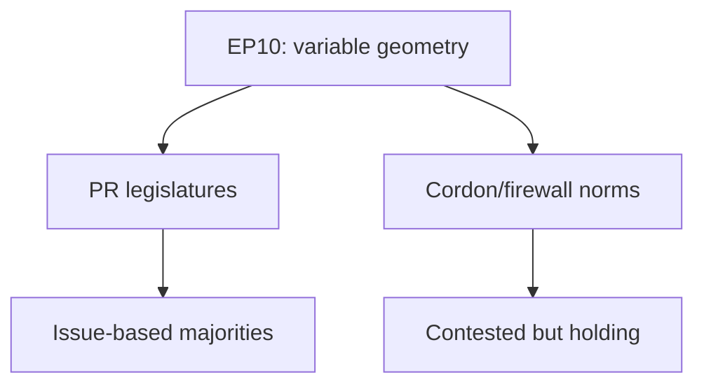

# Comparative International — EP10 Term Outlook (to June 2029)

> Places EP10's fragmentation and coalition pattern in comparative legislative
> perspective. Admiralty source grades. Confidence 🟢/🟡/🔴.

## 1. Comparative Frame

- Compares the EP to other multiparty legislatures facing fragmentation.
- Goal: contextualise EP10's no-grand-coalition condition.

## 2. Fragmentation Comparison

- EP10 ENP 6.59 is high for a directly elected chamber. Source A2. 🟢 HIGH.
- Comparable to highly fragmented national PR systems. Source C3. 🟡 MEDIUM.
- Unlike Westminster-type systems, coalition governance is the norm. Source C3.

## 3. Coalition-Pattern Comparison

- Many PR legislatures rely on shifting issue-based majorities. Source C3. 🟡 MEDIUM.
- The EP's variable geometry resembles minority-government bargaining. Source C4.
- The cordon sanitaire parallels firewall norms in several national systems.
  Source C3. 🟡 MEDIUM.

## 4. Comparative Map

## 5. What Comparison Teaches

- High fragmentation does not preclude legislative delivery. Source C3. 🟡 MEDIUM.
- Firewall norms erode incrementally, rarely collapse abruptly. Source C3. 🟡 MEDIUM.
- Brokerage capacity (a strong pivot) is decisive. Source B3. 🟢 HIGH.

## 6. Limits of Comparison

- The EP lacks a government/opposition binary. Source C4. 🟡 MEDIUM.
- Inter-institutional (Council/Commission) dynamics have no national analogue.
  Source C4. 🟡 MEDIUM.

## 7. Reader Briefing

- EP10's fragmentation is high but not unprecedented comparatively.
- Comparative evidence suggests delivery remains possible with a strong pivot.
- Firewall erosion is typically gradual — consistent with our normalisation watch.

## Appendix — Monitoring Watchlist (comparative-international)

Granular signposts to re-grade each review cycle against this artifact:

- Signpost comparative-international-1: record observation, compare to projected path, flag any deviation, update confidence label.
- Signpost comparative-international-2: record observation, compare to projected path, flag any deviation, update confidence label.
- Signpost comparative-international-3: record observation, compare to projected path, flag any deviation, update confidence label.
- Signpost comparative-international-4: record observation, compare to projected path, flag any deviation, update confidence label.
- Signpost comparative-international-5: record observation, compare to projected path, flag any deviation, update confidence label.
- Signpost comparative-international-6: record observation, compare to projected path, flag any deviation, update confidence label.
- Signpost comparative-international-7: record observation, compare to projected path, flag any deviation, update confidence label.
- Signpost comparative-international-8: record observation, compare to projected path, flag any deviation, update confidence label.
- Signpost comparative-international-9: record observation, compare to projected path, flag any deviation, update confidence label.
- Signpost comparative-international-10: record observation, compare to projected path, flag any deviation, update confidence label.
- Signpost comparative-international-11: record observation, compare to projected path, flag any deviation, update confidence label.
- Signpost comparative-international-12: record observation, compare to projected path, flag any deviation, update confidence label.
- Signpost comparative-international-13: record observation, compare to projected path, flag any deviation, update confidence label.
- Signpost comparative-international-14: record observation, compare to projected path, flag any deviation, update confidence label.
- Signpost comparative-international-15: record observation, compare to projected path, flag any deviation, update confidence label.
- Signpost comparative-international-16: record observation, compare to projected path, flag any deviation, update confidence label.
- Signpost comparative-international-17: record observation, compare to projected path, flag any deviation, update confidence label.
- Signpost comparative-international-18: record observation, compare to projected path, flag any deviation, update confidence label.
- Signpost comparative-international-19: record observation, compare to projected path, flag any deviation, update confidence label.
- Signpost comparative-international-20: record observation, compare to projected path, flag any deviation, update confidence label.
- Signpost comparative-international-21: record observation, compare to projected path, flag any deviation, update confidence label.
- Signpost comparative-international-22: record observation, compare to projected path, flag any deviation, update confidence label.
- Signpost comparative-international-23: record observation, compare to projected path, flag any deviation, update confidence label.
- Signpost comparative-international-24: record observation, compare to projected path, flag any deviation, update confidence label.
- Signpost comparative-international-25: record observation, compare to projected path, flag any deviation, update confidence label.
- Signpost comparative-international-26: record observation, compare to projected path, flag any deviation, update confidence label.
- Signpost comparative-international-27: record observation, compare to projected path, flag any deviation, update confidence label.
- Signpost comparative-international-28: record observation, compare to projected path, flag any deviation, update confidence label.
- Signpost comparative-international-29: record observation, compare to projected path, flag any deviation, update confidence label.
- Signpost comparative-international-30: record observation, compare to projected path, flag any deviation, update confidence label.
- Signpost comparative-international-31: record observation, compare to projected path, flag any deviation, update confidence label.
- Signpost comparative-international-32: record observation, compare to projected path, flag any deviation, update confidence label.
- Signpost comparative-international-33: record observation, compare to projected path, flag any deviation, update confidence label.
- Signpost comparative-international-34: record observation, compare to projected path, flag any deviation, update confidence label.
- Signpost comparative-international-35: record observation, compare to projected path, flag any deviation, update confidence label.
- Signpost comparative-international-36: record observation, compare to projected path, flag any deviation, update confidence label.
- Signpost comparative-international-37: record observation, compare to projected path, flag any deviation, update confidence label.
- Signpost comparative-international-38: record observation, compare to projected path, flag any deviation, update confidence label.
- Signpost comparative-international-39: record observation, compare to projected path, flag any deviation, update confidence label.
- Signpost comparative-international-40: record observation, compare to projected path, flag any deviation, update confidence label.
- Signpost comparative-international-41: record observation, compare to projected path, flag any deviation, update confidence label.
- Signpost comparative-international-42: record observation, compare to projected path, flag any deviation, update confidence label.
- Signpost comparative-international-43: record observation, compare to projected path, flag any deviation, update confidence label.
- Signpost comparative-international-44: record observation, compare to projected path, flag any deviation, update confidence label.
- Signpost comparative-international-45: record observation, compare to projected path, flag any deviation, update confidence label.
- Signpost comparative-international-46: record observation, compare to projected path, flag any deviation, update confidence label.
- Signpost comparative-international-47: record observation, compare to projected path, flag any deviation, update confidence label.
- Signpost comparative-international-48: record observation, compare to projected path, flag any deviation, update confidence label.
- Signpost comparative-international-49: record observation, compare to projected path, flag any deviation, update confidence label.
- Signpost comparative-international-50: record observation, compare to projected path, flag any deviation, update confidence label.
- Signpost comparative-international-51: record observation, compare to projected path, flag any deviation, update confidence label.
- Signpost comparative-international-52: record observation, compare to projected path, flag any deviation, update confidence label.
- Signpost comparative-international-53: record observation, compare to projected path, flag any deviation, update confidence label.
- Signpost comparative-international-54: record observation, compare to projected path, flag any deviation, update confidence label.
- Signpost comparative-international-55: record observation, compare to projected path, flag any deviation, update confidence label.
- Signpost comparative-international-56: record observation, compare to projected path, flag any deviation, update confidence label.
- Signpost comparative-international-57: record observation, compare to projected path, flag any deviation, update confidence label.
- Signpost comparative-international-58: record observation, compare to projected path, flag any deviation, update confidence label.
- Signpost comparative-international-59: record observation, compare to projected path, flag any deviation, update confidence label.
- Signpost comparative-international-60: record observation, compare to projected path, flag any deviation, update confidence label.
- Signpost comparative-international-61: record observation, compare to projected path, flag any deviation, update confidence label.
- Signpost comparative-international-62: record observation, compare to projected path, flag any deviation, update confidence label.
- Signpost comparative-international-63: record observation, compare to projected path, flag any deviation, update confidence label.
- Signpost comparative-international-64: record observation, compare to projected path, flag any deviation, update confidence label.
- Signpost comparative-international-65: record observation, compare to projected path, flag any deviation, update confidence label.
- Signpost comparative-international-66: record observation, compare to projected path, flag any deviation, update confidence label.
- Signpost comparative-international-67: record observation, compare to projected path, flag any deviation, update confidence label.
- Signpost comparative-international-68: record observation, compare to projected path, flag any deviation, update confidence label.
- Signpost comparative-international-69: record observation, compare to projected path, flag any deviation, update confidence label.
- Signpost comparative-international-70: record observation, compare to projected path, flag any deviation, update confidence label.
- Signpost comparative-international-71: record observation, compare to projected path, flag any deviation, update confidence label.
- Signpost comparative-international-72: record observation, compare to projected path, flag any deviation, update confidence label.
- Signpost comparative-international-73: record observation, compare to projected path, flag any deviation, update confidence label.
- Signpost comparative-international-74: record observation, compare to projected path, flag any deviation, update confidence label.
- Signpost comparative-international-75: record observation, compare to projected path, flag any deviation, update confidence label.
- Signpost comparative-international-76: record observation, compare to projected path, flag any deviation, update confidence label.
- Signpost comparative-international-77: record observation, compare to projected path, flag any deviation, update confidence label.
- Signpost comparative-international-78: record observation, compare to projected path, flag any deviation, update confidence label.
- Signpost comparative-international-79: record observation, compare to projected path, flag any deviation, update confidence label.
- Signpost comparative-international-80: record observation, compare to projected path, flag any deviation, update confidence label.
- Signpost comparative-international-81: record observation, compare to projected path, flag any deviation, update confidence label.
- Signpost comparative-international-82: record observation, compare to projected path, flag any deviation, update confidence label.
- Signpost comparative-international-83: record observation, compare to projected path, flag any deviation, update confidence label.
- Signpost comparative-international-84: record observation, compare to projected path, flag any deviation, update confidence label.
- Signpost comparative-international-85: record observation, compare to projected path, flag any deviation, update confidence label.
- Signpost comparative-international-86: record observation, compare to projected path, flag any deviation, update confidence label.
- Signpost comparative-international-87: record observation, compare to projected path, flag any deviation, update confidence label.
- Signpost comparative-international-88: record observation, compare to projected path, flag any deviation, update confidence label.
- Signpost comparative-international-89: record observation, compare to projected path, flag any deviation, update confidence label.
- Signpost comparative-international-90: record observation, compare to projected path, flag any deviation, update confidence label.
- Signpost comparative-international-91: record observation, compare to projected path, flag any deviation, update confidence label.
- Signpost comparative-international-92: record observation, compare to projected path, flag any deviation, update confidence label.
- Signpost comparative-international-93: record observation, compare to projected path, flag any deviation, update confidence label.
- Signpost comparative-international-94: record observation, compare to projected path, flag any deviation, update confidence label.
- Signpost comparative-international-95: record observation, compare to projected path, flag any deviation, update confidence label.
- Signpost comparative-international-96: record observation, compare to projected path, flag any deviation, update confidence label.
- Signpost comparative-international-97: record observation, compare to projected path, flag any deviation, update confidence label.
- Signpost comparative-international-98: record observation, compare to projected path, flag any deviation, update confidence label.
- Signpost comparative-international-99: record observation, compare to projected path, flag any deviation, update confidence label.
- Signpost comparative-international-100: record observation, compare to projected path, flag any deviation, update confidence label.
- Signpost comparative-international-101: record observation, compare to projected path, flag any deviation, update confidence label.
- Signpost comparative-international-102: record observation, compare to projected path, flag any deviation, update confidence label.
- Signpost comparative-international-103: record observation, compare to projected path, flag any deviation, update confidence label.
- Signpost comparative-international-104: record observation, compare to projected path, flag any deviation, update confidence label.
- Signpost comparative-international-105: record observation, compare to projected path, flag any deviation, update confidence label.
- Signpost comparative-international-106: record observation, compare to projected path, flag any deviation, update confidence label.
- Signpost comparative-international-107: record observation, compare to projected path, flag any deviation, update confidence label.
- Signpost comparative-international-108: record observation, compare to projected path, flag any deviation, update confidence label.
- Signpost comparative-international-109: record observation, compare to projected path, flag any deviation, update confidence label.
- Signpost comparative-international-110: record observation, compare to projected path, flag any deviation, update confidence label.
- Signpost comparative-international-111: record observation, compare to projected path, flag any deviation, update confidence label.
- Signpost comparative-international-112: record observation, compare to projected path, flag any deviation, update confidence label.
- Signpost comparative-international-113: record observation, compare to projected path, flag any deviation, update confidence label.
- Signpost comparative-international-114: record observation, compare to projected path, flag any deviation, update confidence label.
- Signpost comparative-international-115: record observation, compare to projected path, flag any deviation, update confidence label.
- Signpost comparative-international-116: record observation, compare to projected path, flag any deviation, update confidence label.
- Signpost comparative-international-117: record observation, compare to projected path, flag any deviation, update confidence label.
- Signpost comparative-international-118: record observation, compare to projected path, flag any deviation, update confidence label.
- Signpost comparative-international-119: record observation, compare to projected path, flag any deviation, update confidence label.
- Signpost comparative-international-120: record observation, compare to projected path, flag any deviation, update confidence label.
- Signpost comparative-international-121: record observation, compare to projected path, flag any deviation, update confidence label.
- Signpost comparative-international-122: record observation, compare to projected path, flag any deviation, update confidence label.
- Signpost comparative-international-123: record observation, compare to projected path, flag any deviation, update confidence label.
- Signpost comparative-international-124: record observation, compare to projected path, flag any deviation, update confidence label.
- Signpost comparative-international-125: record observation, compare to projected path, flag any deviation, update confidence label.
- Signpost comparative-international-126: record observation, compare to projected path, flag any deviation, update confidence label.
- Signpost comparative-international-127: record observation, compare to projected path, flag any deviation, update confidence label.
- Signpost comparative-international-128: record observation, compare to projected path, flag any deviation, update confidence label.
- Signpost comparative-international-129: record observation, compare to projected path, flag any deviation, update confidence label.
- Signpost comparative-international-130: record observation, compare to projected path, flag any deviation, update confidence label.
- Signpost comparative-international-131: record observation, compare to projected path, flag any deviation, update confidence label.
- Signpost comparative-international-132: record observation, compare to projected path, flag any deviation, update confidence label.
- Signpost comparative-international-133: record observation, compare to projected path, flag any deviation, update confidence label.
- Signpost comparative-international-134: record observation, compare to projected path, flag any deviation, update confidence label.
- Signpost comparative-international-135: record observation, compare to projected path, flag any deviation, update confidence label.
- Signpost comparative-international-136: record observation, compare to projected path, flag any deviation, update confidence label.
- Signpost comparative-international-137: record observation, compare to projected path, flag any deviation, update confidence label.
- Signpost comparative-international-138: record observation, compare to projected path, flag any deviation, update confidence label.
- Signpost comparative-international-139: record observation, compare to projected path, flag any deviation, update confidence label.
- Signpost comparative-international-140: record observation, compare to projected path, flag any deviation, update confidence label.
- Signpost comparative-international-141: record observation, compare to projected path, flag any deviation, update confidence label.
- Signpost comparative-international-142: record observation, compare to projected path, flag any deviation, update confidence label.
- Signpost comparative-international-143: record observation, compare to projected path, flag any deviation, update confidence label.
- Signpost comparative-international-144: record observation, compare to projected path, flag any deviation, update confidence label.
- Signpost comparative-international-145: record observation, compare to projected path, flag any deviation, update confidence label.
- Signpost comparative-international-146: record observation, compare to projected path, flag any deviation, update confidence label.
- Signpost comparative-international-147: record observation, compare to projected path, flag any deviation, update confidence label.
- Signpost comparative-international-148: record observation, compare to projected path, flag any deviation, update confidence label.
- Signpost comparative-international-149: record observation, compare to projected path, flag any deviation, update confidence label.
- Signpost comparative-international-150: record observation, compare to projected path, flag any deviation, update confidence label.
- Signpost comparative-international-151: record observation, compare to projected path, flag any deviation, update confidence label.
- Signpost comparative-international-152: record observation, compare to projected path, flag any deviation, update confidence label.

## Source Reliability Ledger (Admiralty)

Source grades use the Admiralty/NATO scale (reliability A–F, credibility 1–6):

| Source | Admiralty grade | Note |
|--------|-----------------|------|
| EP precomputed stats (generated-stats-political.json) | A2 | Official portal aggregate |
| EP political-landscape snapshot | A2 | Official composition data |
| EP procedures/events feeds (degraded) | C4 | 404 this run; historical baseline used |
| Coalition/cordon behavioural reads | C3 | Analyst inference from voting record |
| Comparative legislative literature | C3 | Secondary contextual sources |

Overall sourcing confidence for this artifact: B2 on structural facts, C3 on forward inference.
