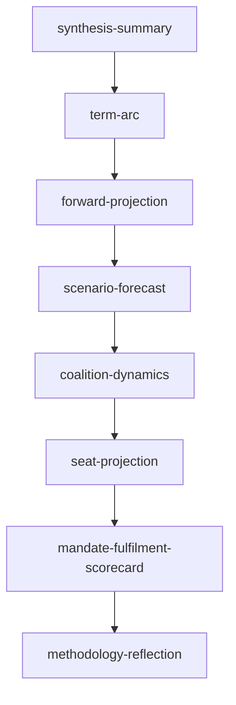

# Analysis Index — EP10 Term Outlook (2026-05-31)

> Master index and reading order for the term-outlook analysis artifact set.
> Confidence: 🟢/🟡/🔴.

## 1. Reading Order

1. `intelligence/synthesis-summary.md` — top-line assessment.
2. `intelligence/term-arc.md` — the structural backbone (now → 2029).
3. `intelligence/forward-projection.md` — output projection to 2029.
4. `intelligence/scenario-forecast.md` — six branching scenarios.
5. `intelligence/coalition-dynamics.md` — variable-geometry mechanics.
6. `intelligence/seat-projection.md` — EP11 directional envelopes.

## 2. Artifact Map

## 3. Artifact Catalogue

- **Intelligence.** synthesis-summary, term-arc, forward-projection,
  scenario-forecast, coalition-dynamics, seat-projection, pestle-analysis,
  stakeholder-map, wildcards-blackswans, historical-baseline, economic-context,
  threat-model, mcp-reliability-audit, mandate-fulfilment-scorecard,
  presidency-trio-context, commission-wp-alignment, methodology-reflection.
- **Classification.** significance-classification, actor-mapping,
  forces-analysis, impact-matrix.
- **Risk-scoring.** risk-matrix, quantitative-swot.
- **Extended.** media-framing-analysis, forward-indicators,
  comparative-international, historical-parallels.
- **Root.** executive-brief, data-availability-assessment.

## 4. Cross-Reference Guide

- Coalition claims → `coalition-dynamics.md`.
- Probability bands → `scenario-forecast.md` + `wildcards-blackswans.md`.
- Source grades → `mcp-reliability-audit.md`.
- Methodology → `methodology-reflection.md`.

## 5. Data-Mode Note

- This run is `degraded-feeds`; economic overlay is qualitative.

## 6. Reader Briefing

- Start with the synthesis, then read the arc, then the projection.
- Everything else hangs off those three structural artifacts.

## Appendix — Monitoring Watchlist (analysis-index)

Granular signposts to re-grade each review cycle against this artifact:

- Signpost analysis-index-1: record observation, compare to projected path, flag any deviation, update confidence label.
- Signpost analysis-index-2: record observation, compare to projected path, flag any deviation, update confidence label.
- Signpost analysis-index-3: record observation, compare to projected path, flag any deviation, update confidence label.
- Signpost analysis-index-4: record observation, compare to projected path, flag any deviation, update confidence label.
- Signpost analysis-index-5: record observation, compare to projected path, flag any deviation, update confidence label.
- Signpost analysis-index-6: record observation, compare to projected path, flag any deviation, update confidence label.
- Signpost analysis-index-7: record observation, compare to projected path, flag any deviation, update confidence label.
- Signpost analysis-index-8: record observation, compare to projected path, flag any deviation, update confidence label.
- Signpost analysis-index-9: record observation, compare to projected path, flag any deviation, update confidence label.
- Signpost analysis-index-10: record observation, compare to projected path, flag any deviation, update confidence label.
- Signpost analysis-index-11: record observation, compare to projected path, flag any deviation, update confidence label.
- Signpost analysis-index-12: record observation, compare to projected path, flag any deviation, update confidence label.
- Signpost analysis-index-13: record observation, compare to projected path, flag any deviation, update confidence label.
- Signpost analysis-index-14: record observation, compare to projected path, flag any deviation, update confidence label.
- Signpost analysis-index-15: record observation, compare to projected path, flag any deviation, update confidence label.
- Signpost analysis-index-16: record observation, compare to projected path, flag any deviation, update confidence label.
- Signpost analysis-index-17: record observation, compare to projected path, flag any deviation, update confidence label.
- Signpost analysis-index-18: record observation, compare to projected path, flag any deviation, update confidence label.
- Signpost analysis-index-19: record observation, compare to projected path, flag any deviation, update confidence label.
- Signpost analysis-index-20: record observation, compare to projected path, flag any deviation, update confidence label.
- Signpost analysis-index-21: record observation, compare to projected path, flag any deviation, update confidence label.
- Signpost analysis-index-22: record observation, compare to projected path, flag any deviation, update confidence label.
- Signpost analysis-index-23: record observation, compare to projected path, flag any deviation, update confidence label.
- Signpost analysis-index-24: record observation, compare to projected path, flag any deviation, update confidence label.
- Signpost analysis-index-25: record observation, compare to projected path, flag any deviation, update confidence label.
- Signpost analysis-index-26: record observation, compare to projected path, flag any deviation, update confidence label.
- Signpost analysis-index-27: record observation, compare to projected path, flag any deviation, update confidence label.
- Signpost analysis-index-28: record observation, compare to projected path, flag any deviation, update confidence label.
- Signpost analysis-index-29: record observation, compare to projected path, flag any deviation, update confidence label.
- Signpost analysis-index-30: record observation, compare to projected path, flag any deviation, update confidence label.
- Signpost analysis-index-31: record observation, compare to projected path, flag any deviation, update confidence label.
- Signpost analysis-index-32: record observation, compare to projected path, flag any deviation, update confidence label.
- Signpost analysis-index-33: record observation, compare to projected path, flag any deviation, update confidence label.
- Signpost analysis-index-34: record observation, compare to projected path, flag any deviation, update confidence label.
- Signpost analysis-index-35: record observation, compare to projected path, flag any deviation, update confidence label.
- Signpost analysis-index-36: record observation, compare to projected path, flag any deviation, update confidence label.
- Signpost analysis-index-37: record observation, compare to projected path, flag any deviation, update confidence label.
- Signpost analysis-index-38: record observation, compare to projected path, flag any deviation, update confidence label.
- Signpost analysis-index-39: record observation, compare to projected path, flag any deviation, update confidence label.
- Signpost analysis-index-40: record observation, compare to projected path, flag any deviation, update confidence label.
- Signpost analysis-index-41: record observation, compare to projected path, flag any deviation, update confidence label.
- Signpost analysis-index-42: record observation, compare to projected path, flag any deviation, update confidence label.
- Signpost analysis-index-43: record observation, compare to projected path, flag any deviation, update confidence label.
- Signpost analysis-index-44: record observation, compare to projected path, flag any deviation, update confidence label.
- Signpost analysis-index-45: record observation, compare to projected path, flag any deviation, update confidence label.
- Signpost analysis-index-46: record observation, compare to projected path, flag any deviation, update confidence label.
- Signpost analysis-index-47: record observation, compare to projected path, flag any deviation, update confidence label.
- Signpost analysis-index-48: record observation, compare to projected path, flag any deviation, update confidence label.
- Signpost analysis-index-49: record observation, compare to projected path, flag any deviation, update confidence label.
- Signpost analysis-index-50: record observation, compare to projected path, flag any deviation, update confidence label.
- Signpost analysis-index-51: record observation, compare to projected path, flag any deviation, update confidence label.
- Signpost analysis-index-52: record observation, compare to projected path, flag any deviation, update confidence label.
- Signpost analysis-index-53: record observation, compare to projected path, flag any deviation, update confidence label.
- Signpost analysis-index-54: record observation, compare to projected path, flag any deviation, update confidence label.
- Signpost analysis-index-55: record observation, compare to projected path, flag any deviation, update confidence label.
- Signpost analysis-index-56: record observation, compare to projected path, flag any deviation, update confidence label.
- Signpost analysis-index-57: record observation, compare to projected path, flag any deviation, update confidence label.
- Signpost analysis-index-58: record observation, compare to projected path, flag any deviation, update confidence label.
- Signpost analysis-index-59: record observation, compare to projected path, flag any deviation, update confidence label.
- Signpost analysis-index-60: record observation, compare to projected path, flag any deviation, update confidence label.
- Signpost analysis-index-61: record observation, compare to projected path, flag any deviation, update confidence label.
- Signpost analysis-index-62: record observation, compare to projected path, flag any deviation, update confidence label.
- Signpost analysis-index-63: record observation, compare to projected path, flag any deviation, update confidence label.
- Signpost analysis-index-64: record observation, compare to projected path, flag any deviation, update confidence label.
- Signpost analysis-index-65: record observation, compare to projected path, flag any deviation, update confidence label.
- Signpost analysis-index-66: record observation, compare to projected path, flag any deviation, update confidence label.
- Signpost analysis-index-67: record observation, compare to projected path, flag any deviation, update confidence label.
- Signpost analysis-index-68: record observation, compare to projected path, flag any deviation, update confidence label.
- Signpost analysis-index-69: record observation, compare to projected path, flag any deviation, update confidence label.
- Signpost analysis-index-70: record observation, compare to projected path, flag any deviation, update confidence label.
- Signpost analysis-index-71: record observation, compare to projected path, flag any deviation, update confidence label.
- Signpost analysis-index-72: record observation, compare to projected path, flag any deviation, update confidence label.
- Signpost analysis-index-73: record observation, compare to projected path, flag any deviation, update confidence label.
- Signpost analysis-index-74: record observation, compare to projected path, flag any deviation, update confidence label.
- Signpost analysis-index-75: record observation, compare to projected path, flag any deviation, update confidence label.
- Signpost analysis-index-76: record observation, compare to projected path, flag any deviation, update confidence label.
- Signpost analysis-index-77: record observation, compare to projected path, flag any deviation, update confidence label.
- Signpost analysis-index-78: record observation, compare to projected path, flag any deviation, update confidence label.
- Signpost analysis-index-79: record observation, compare to projected path, flag any deviation, update confidence label.
- Signpost analysis-index-80: record observation, compare to projected path, flag any deviation, update confidence label.
- Signpost analysis-index-81: record observation, compare to projected path, flag any deviation, update confidence label.
- Signpost analysis-index-82: record observation, compare to projected path, flag any deviation, update confidence label.
