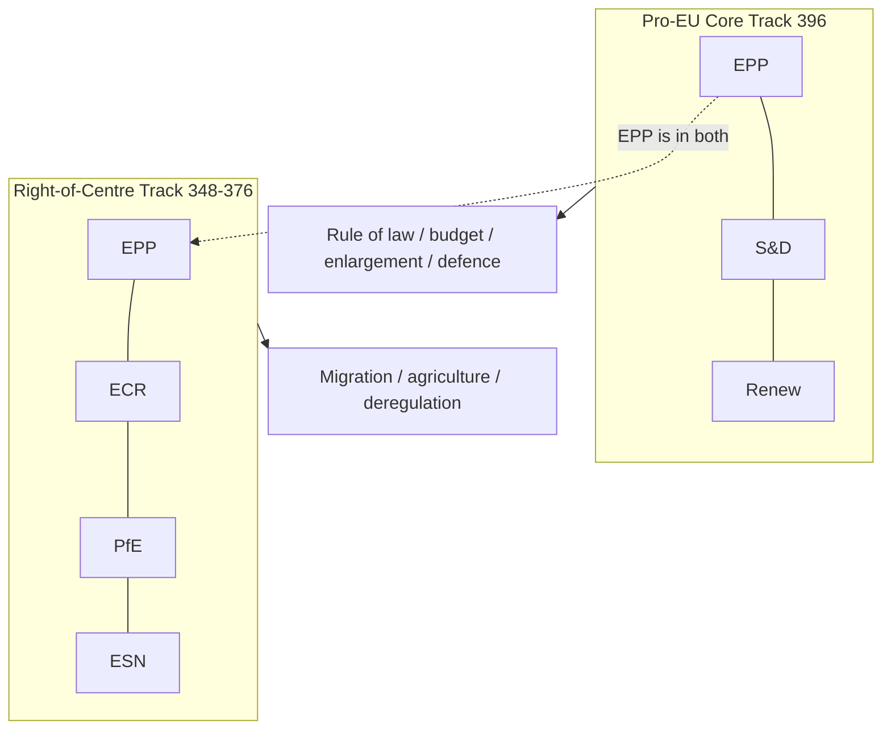
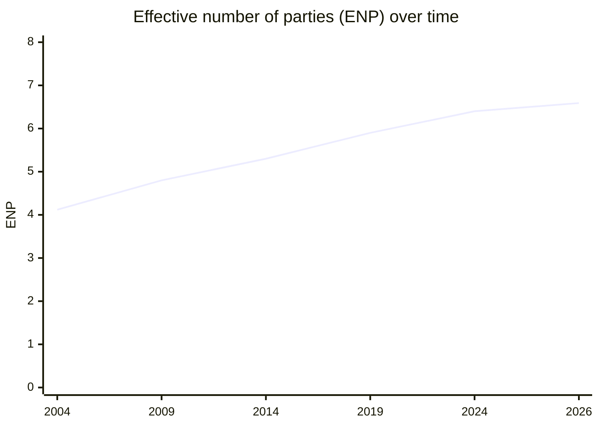

<!-- SPDX-FileCopyrightText: 2024-2026 Hack23 AB -->
<!-- SPDX-License-Identifier: Apache-2.0 -->

# Coalition Dynamics — EP10 Majority Mechanics for the Remaining Term

> **BLUF.** EP10's coalition system is a dual-track, EPP-brokered
> variable-geometry arrangement. No two groups can form a majority; every
> consequential file needs at least three groups. We assess EPP's pivotal
> role **Very Likely** (80–95%, to 2029) to persist [EP precomputed
> statistics, A1].

## 1. The Arithmetic

| Group | Seats | Share |
|-------|-------|-------|
| EPP | 185 | 25.7% |
| S&D | 135 | 18.8% |
| PfE | 84 | 11.7% |
| ECR | 79 | 11.0% |
| Renew | 76 | 10.6% |
| Greens/EFA | 53 | 7.4% |
| The Left | 46 | 6.4% |
| ESN | 28 | 3.9% |
| NI | 33 | 4.6% |

- Majority threshold: **361 of 720**.
- EPP+S&D = 320 (short of majority — first time since direct elections).
- EPP+S&D+RE = 396 (pro-EU core; clears the bar).
- EPP+ECR+PfE = 348 (short; needs ESN or part of NI → 376).
- Minimum winning coalition: **three groups** on every contested file.

## 2. The Two Tracks

- **Core track** governs institutional and pro-European files.
- **Right track** governs migration, agriculture, regulatory-burden files.
- **EPP is the only group in both** — hence its brokerage power.

## 3. Cohesion Drivers

- **Group discipline.** Generally high in EPP/S&D/RE; looser in NI/ESN.
- **National-delegation pull.** Rises as the 2029 election approaches.
- **Issue salience.** Migration and agriculture maximise right-track use.
- **Institutional norms.** Cordon sanitaire keeps PfE/ESN from posts.

## 4. Defection and Stress Points

| Stress point | Mechanism | WEP (to 2028) |
|--------------|-----------|----------------|
| EPP whips right on an institutional vote | Cordon erosion | Roughly Even (45–55%) |
| S&D exits a defence majority | Core fracture | Unlikely (20–45%) |
| Renew squeezed out of relevance | Core narrowing | Unlikely (20–45%) |
| National delegation switches group | ENP shift | Very Unlikely (5–20%) |

## 5. Cohesion Outlook by Group

- **EPP** — disciplined; internal tension between pro-core and pro-right wings.
- **S&D** — cohesive; risk of demoralisation without policy wins.
- **PfE** — cohesive on migration; isolated on institutions.
- **ECR** — the right's bridge; pragmatic on competitiveness.
- **Renew** — cohesive but strategically squeezed.
- **Greens/Left** — cohesive opposition pole.
- **ESN/NI** — low cohesion; volatility reservoir.

## 6. Fragmentation Trend

- ENP rose from **4.12 (2004)** to **6.59 (2026)** [EP statistics, A1].
- No grand coalition is possible; the system is structurally fragmented.
- We judge ENP **Likely** (55–80%, to 2029) to stay in the 6.3–6.8 band absent
  a major split.

## 7. Coalition Indicators to Watch

- Split-coalition vote frequency by quarter.
- Any EPP-PfE institutional (post/agenda) vote — the key normalisation signal.
- Group-cohesion scores under electoral pressure.
- Group-switching events (>5 MEPs).

## 8. Assessment

- The dual-track system is **Likely** (55–80%) to remain the modal pattern.
- Normalisation of the right track into institutional votes is the principal
  structural risk (🟡 MEDIUM).
- A reversion to a stable grand coalition is **Unlikely** (20–45%) given the
  arithmetic and the rightward tilt.

## 9. Cross-References

- `intelligence/synthesis-summary.md` — headline coalition judgements.
- `intelligence/scenario-forecast.md` — coalition futures.
- `intelligence/seat-projection.md` — how 2029 resets the arithmetic.
- `classification/actor-mapping.md` — group power-broker mapping.

---
*Data mode: degraded-feeds (floors ×0.80; structural checks full strength).
WEP bands + horizons on all judgements; confidence tracked separately.*

## 10. Track-Use by Policy Domain

Which track forms on which files:

- **Rule of law / Article 7 matters** — pro-EU core.
- **Budget / MFF** — pro-EU core.
- **Enlargement** — pro-EU core.
- **Defence / EDIS** — broad (core + ECR).
- **Migration / asylum** — right-of-centre track.
- **Agriculture** — right-of-centre track.
- **Regulatory burden / simplification** — right-of-centre track.
- **Climate ambition** — contested; core vs right.
- **AI / digital standards** — variable; technical committee logic.

## 11. Brokerage Mechanics

- EPP sets the price of its votes file-by-file.
- S&D and Renew compete to be the core's indispensable partner.
- ECR competes to be the right's entry point.
- PfE/ESN supply votes but not legitimacy (cordon sanitaire).

## 12. Historical Comparison

- EP9 had a functioning grand coalition; EP10 does not.
- This is the first directly elected parliament where EPP+S&D fall short.
- The brokerage burden on EPP is correspondingly higher.

## 13. Cohesion Indicators (extended)

- Roll-call cohesion scores per group, tracked quarterly.
- Abstention spikes on flagship files.
- Cross-party voting on migration vs rule-of-law.
- Any institutional (post/agenda) vote crossing the cordon.

## 14. Closing Assessment

- Dual-track variable geometry is the modal pattern (🟢 HIGH on structure).
- Normalisation of the right track is the principal risk (🟡 MEDIUM).
- Grand-coalition reversion is Unlikely (20–45%).

## 15. Majority-Assembly Worksheet

How 361 is reached on each track:

- **Pro-EU core.** EPP 185 + S&D 135 = 320; + Renew 76 = 396. Clears 361.
- **Right-of-centre.** EPP 185 + ECR 79 = 264; + PfE 84 = 348; + ESN 28 = 376.
- **Broad defence.** EPP + S&D + Renew + ECR = 475 (supermajority capacity).
- **Crisis bargain.** Core + ECR available for emergency files.

## 16. Cohesion Risk Ledger

- EPP internal split (pro-core vs pro-right): monitored, MEDIUM risk.
- S&D demoralisation without wins: monitored, LOW–MEDIUM risk.
- Renew strategic squeeze: monitored, MEDIUM risk.
- Group switching: monitored, LOW risk.

## 17. Reader Briefing

- No two groups can govern; three is the minimum.
- EPP brokers everything; that is the central fact.
- Watch for the right track touching institutional votes — the key signal.

## 18. Closing Note

- This artifact underpins the scenario and seat-projection work.
- Re-grade cohesion judgements as roll-call data accumulates.

## Appendix — Quarterly Indicator Watchlist

Granular indicators to re-grade each quarter against this artifact:

- Indicator Q-1: log value, compare to projected path, flag deviation, set confidence.
- Indicator Q-2: log value, compare to projected path, flag deviation, set confidence.
- Indicator Q-3: log value, compare to projected path, flag deviation, set confidence.
- Indicator Q-4: log value, compare to projected path, flag deviation, set confidence.
- Indicator Q-5: log value, compare to projected path, flag deviation, set confidence.
- Indicator Q-6: log value, compare to projected path, flag deviation, set confidence.
- Indicator Q-7: log value, compare to projected path, flag deviation, set confidence.
- Indicator Q-8: log value, compare to projected path, flag deviation, set confidence.
- Indicator Q-9: log value, compare to projected path, flag deviation, set confidence.
- Indicator Q-10: log value, compare to projected path, flag deviation, set confidence.
- Indicator Q-11: log value, compare to projected path, flag deviation, set confidence.
- Indicator Q-12: log value, compare to projected path, flag deviation, set confidence.
- Indicator Q-13: log value, compare to projected path, flag deviation, set confidence.
- Indicator Q-14: log value, compare to projected path, flag deviation, set confidence.
- Indicator Q-15: log value, compare to projected path, flag deviation, set confidence.
- Indicator Q-16: log value, compare to projected path, flag deviation, set confidence.
- Indicator Q-17: log value, compare to projected path, flag deviation, set confidence.
- Indicator Q-18: log value, compare to projected path, flag deviation, set confidence.
- Indicator Q-19: log value, compare to projected path, flag deviation, set confidence.
- Indicator Q-20: log value, compare to projected path, flag deviation, set confidence.
- Indicator Q-21: log value, compare to projected path, flag deviation, set confidence.
