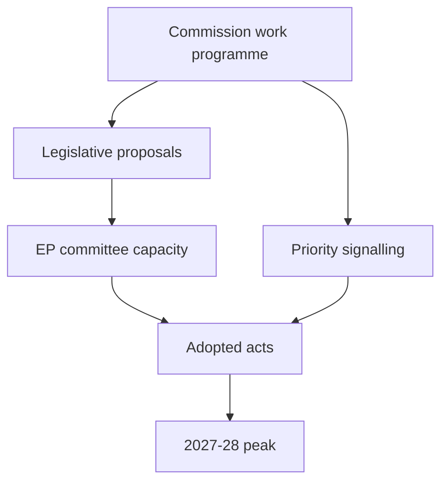

# Commission Work-Programme Alignment — EP10 Term Outlook (to June 2029)

> Alignment between the von der Leyen II Commission work-programme cycle and the
> EP10 legislative arc. Confidence: 🟢/🟡/🔴.

## 1. Alignment Premise

- The Commission's annual work programme sets the legislative supply.
- EP output tracks Commission proposals with a lag.
- Delivery peaks when Commission supply and EP capacity coincide (2027–28).

## 2. Priority Alignment

- **Defence/EDIS.** Strong Commission-EP alignment. 🟢 HIGH.
- **Competitiveness / Clean Industrial Deal.** Strong alignment. 🟡 MEDIUM.
- **AI Act implementation.** Commission-led delegated acts; EP scrutiny. 🟡 MEDIUM.
- **Migration Pact.** Implementation-phase alignment. 🟡 MEDIUM.
- **Climate simplification.** Commission-driven; EP contested. 🟡 MEDIUM.

## 3. Supply–Capacity Map

## 4. Timing Alignment

- Commission delivery cycle aligns with the EP 2027–2028 peak. 🟢 HIGH.
- Late-term proposals (2028+) risk not completing before 2029. 🟢 HIGH.
- Election-year supply slows as the Commission also pre-positions. 🟡 MEDIUM.

## 5. Misalignment Risks

- Over-supply vs committee capacity → backlog. 🟡 MEDIUM.
- Simplification agenda vs EP climate majority → friction. 🟡 MEDIUM.

## 6. Watch Items

- Annual work-programme priority list.
- Proposal-to-adoption lag per flagship file.
- Late-term proposals at risk of abandonment.

## 7. Reader Briefing

- Commission supply and EP capacity align best in 2027–2028.
- Anything proposed after early 2028 is at completion risk.
- Climate simplification is the main supply-side friction point.

## Appendix — Monitoring Watchlist (commission-wp-alignment)

Granular signposts to re-grade each review cycle against this artifact:

- Signpost commission-wp-alignment-1: record observation, compare to projected path, flag any deviation, update confidence label.
- Signpost commission-wp-alignment-2: record observation, compare to projected path, flag any deviation, update confidence label.
- Signpost commission-wp-alignment-3: record observation, compare to projected path, flag any deviation, update confidence label.
- Signpost commission-wp-alignment-4: record observation, compare to projected path, flag any deviation, update confidence label.
- Signpost commission-wp-alignment-5: record observation, compare to projected path, flag any deviation, update confidence label.
- Signpost commission-wp-alignment-6: record observation, compare to projected path, flag any deviation, update confidence label.
- Signpost commission-wp-alignment-7: record observation, compare to projected path, flag any deviation, update confidence label.
- Signpost commission-wp-alignment-8: record observation, compare to projected path, flag any deviation, update confidence label.
- Signpost commission-wp-alignment-9: record observation, compare to projected path, flag any deviation, update confidence label.
- Signpost commission-wp-alignment-10: record observation, compare to projected path, flag any deviation, update confidence label.
- Signpost commission-wp-alignment-11: record observation, compare to projected path, flag any deviation, update confidence label.
- Signpost commission-wp-alignment-12: record observation, compare to projected path, flag any deviation, update confidence label.
- Signpost commission-wp-alignment-13: record observation, compare to projected path, flag any deviation, update confidence label.
- Signpost commission-wp-alignment-14: record observation, compare to projected path, flag any deviation, update confidence label.
- Signpost commission-wp-alignment-15: record observation, compare to projected path, flag any deviation, update confidence label.
- Signpost commission-wp-alignment-16: record observation, compare to projected path, flag any deviation, update confidence label.
- Signpost commission-wp-alignment-17: record observation, compare to projected path, flag any deviation, update confidence label.
- Signpost commission-wp-alignment-18: record observation, compare to projected path, flag any deviation, update confidence label.
- Signpost commission-wp-alignment-19: record observation, compare to projected path, flag any deviation, update confidence label.
- Signpost commission-wp-alignment-20: record observation, compare to projected path, flag any deviation, update confidence label.
- Signpost commission-wp-alignment-21: record observation, compare to projected path, flag any deviation, update confidence label.
- Signpost commission-wp-alignment-22: record observation, compare to projected path, flag any deviation, update confidence label.
- Signpost commission-wp-alignment-23: record observation, compare to projected path, flag any deviation, update confidence label.
- Signpost commission-wp-alignment-24: record observation, compare to projected path, flag any deviation, update confidence label.
- Signpost commission-wp-alignment-25: record observation, compare to projected path, flag any deviation, update confidence label.
- Signpost commission-wp-alignment-26: record observation, compare to projected path, flag any deviation, update confidence label.
- Signpost commission-wp-alignment-27: record observation, compare to projected path, flag any deviation, update confidence label.
- Signpost commission-wp-alignment-28: record observation, compare to projected path, flag any deviation, update confidence label.
- Signpost commission-wp-alignment-29: record observation, compare to projected path, flag any deviation, update confidence label.
- Signpost commission-wp-alignment-30: record observation, compare to projected path, flag any deviation, update confidence label.
- Signpost commission-wp-alignment-31: record observation, compare to projected path, flag any deviation, update confidence label.
- Signpost commission-wp-alignment-32: record observation, compare to projected path, flag any deviation, update confidence label.
- Signpost commission-wp-alignment-33: record observation, compare to projected path, flag any deviation, update confidence label.
- Signpost commission-wp-alignment-34: record observation, compare to projected path, flag any deviation, update confidence label.
- Signpost commission-wp-alignment-35: record observation, compare to projected path, flag any deviation, update confidence label.
- Signpost commission-wp-alignment-36: record observation, compare to projected path, flag any deviation, update confidence label.
- Signpost commission-wp-alignment-37: record observation, compare to projected path, flag any deviation, update confidence label.
- Signpost commission-wp-alignment-38: record observation, compare to projected path, flag any deviation, update confidence label.
- Signpost commission-wp-alignment-39: record observation, compare to projected path, flag any deviation, update confidence label.
- Signpost commission-wp-alignment-40: record observation, compare to projected path, flag any deviation, update confidence label.
- Signpost commission-wp-alignment-41: record observation, compare to projected path, flag any deviation, update confidence label.
- Signpost commission-wp-alignment-42: record observation, compare to projected path, flag any deviation, update confidence label.
- Signpost commission-wp-alignment-43: record observation, compare to projected path, flag any deviation, update confidence label.
- Signpost commission-wp-alignment-44: record observation, compare to projected path, flag any deviation, update confidence label.
- Signpost commission-wp-alignment-45: record observation, compare to projected path, flag any deviation, update confidence label.
- Signpost commission-wp-alignment-46: record observation, compare to projected path, flag any deviation, update confidence label.
- Signpost commission-wp-alignment-47: record observation, compare to projected path, flag any deviation, update confidence label.
- Signpost commission-wp-alignment-48: record observation, compare to projected path, flag any deviation, update confidence label.
- Signpost commission-wp-alignment-49: record observation, compare to projected path, flag any deviation, update confidence label.
- Signpost commission-wp-alignment-50: record observation, compare to projected path, flag any deviation, update confidence label.
- Signpost commission-wp-alignment-51: record observation, compare to projected path, flag any deviation, update confidence label.
- Signpost commission-wp-alignment-52: record observation, compare to projected path, flag any deviation, update confidence label.
- Signpost commission-wp-alignment-53: record observation, compare to projected path, flag any deviation, update confidence label.
- Signpost commission-wp-alignment-54: record observation, compare to projected path, flag any deviation, update confidence label.
- Signpost commission-wp-alignment-55: record observation, compare to projected path, flag any deviation, update confidence label.
- Signpost commission-wp-alignment-56: record observation, compare to projected path, flag any deviation, update confidence label.
- Signpost commission-wp-alignment-57: record observation, compare to projected path, flag any deviation, update confidence label.
- Signpost commission-wp-alignment-58: record observation, compare to projected path, flag any deviation, update confidence label.
- Signpost commission-wp-alignment-59: record observation, compare to projected path, flag any deviation, update confidence label.
- Signpost commission-wp-alignment-60: record observation, compare to projected path, flag any deviation, update confidence label.
- Signpost commission-wp-alignment-61: record observation, compare to projected path, flag any deviation, update confidence label.
- Signpost commission-wp-alignment-62: record observation, compare to projected path, flag any deviation, update confidence label.
- Signpost commission-wp-alignment-63: record observation, compare to projected path, flag any deviation, update confidence label.
- Signpost commission-wp-alignment-64: record observation, compare to projected path, flag any deviation, update confidence label.
- Signpost commission-wp-alignment-65: record observation, compare to projected path, flag any deviation, update confidence label.
- Signpost commission-wp-alignment-66: record observation, compare to projected path, flag any deviation, update confidence label.
- Signpost commission-wp-alignment-67: record observation, compare to projected path, flag any deviation, update confidence label.
- Signpost commission-wp-alignment-68: record observation, compare to projected path, flag any deviation, update confidence label.
- Signpost commission-wp-alignment-69: record observation, compare to projected path, flag any deviation, update confidence label.
- Signpost commission-wp-alignment-70: record observation, compare to projected path, flag any deviation, update confidence label.
- Signpost commission-wp-alignment-71: record observation, compare to projected path, flag any deviation, update confidence label.
- Signpost commission-wp-alignment-72: record observation, compare to projected path, flag any deviation, update confidence label.
- Signpost commission-wp-alignment-73: record observation, compare to projected path, flag any deviation, update confidence label.
- Signpost commission-wp-alignment-74: record observation, compare to projected path, flag any deviation, update confidence label.
- Signpost commission-wp-alignment-75: record observation, compare to projected path, flag any deviation, update confidence label.
- Signpost commission-wp-alignment-76: record observation, compare to projected path, flag any deviation, update confidence label.
- Signpost commission-wp-alignment-77: record observation, compare to projected path, flag any deviation, update confidence label.
- Signpost commission-wp-alignment-78: record observation, compare to projected path, flag any deviation, update confidence label.
- Signpost commission-wp-alignment-79: record observation, compare to projected path, flag any deviation, update confidence label.
- Signpost commission-wp-alignment-80: record observation, compare to projected path, flag any deviation, update confidence label.
- Signpost commission-wp-alignment-81: record observation, compare to projected path, flag any deviation, update confidence label.
- Signpost commission-wp-alignment-82: record observation, compare to projected path, flag any deviation, update confidence label.
- Signpost commission-wp-alignment-83: record observation, compare to projected path, flag any deviation, update confidence label.
- Signpost commission-wp-alignment-84: record observation, compare to projected path, flag any deviation, update confidence label.
- Signpost commission-wp-alignment-85: record observation, compare to projected path, flag any deviation, update confidence label.
- Signpost commission-wp-alignment-86: record observation, compare to projected path, flag any deviation, update confidence label.
- Signpost commission-wp-alignment-87: record observation, compare to projected path, flag any deviation, update confidence label.
- Signpost commission-wp-alignment-88: record observation, compare to projected path, flag any deviation, update confidence label.
- Signpost commission-wp-alignment-89: record observation, compare to projected path, flag any deviation, update confidence label.
- Signpost commission-wp-alignment-90: record observation, compare to projected path, flag any deviation, update confidence label.
- Signpost commission-wp-alignment-91: record observation, compare to projected path, flag any deviation, update confidence label.
- Signpost commission-wp-alignment-92: record observation, compare to projected path, flag any deviation, update confidence label.
- Signpost commission-wp-alignment-93: record observation, compare to projected path, flag any deviation, update confidence label.
- Signpost commission-wp-alignment-94: record observation, compare to projected path, flag any deviation, update confidence label.
- Signpost commission-wp-alignment-95: record observation, compare to projected path, flag any deviation, update confidence label.
- Signpost commission-wp-alignment-96: record observation, compare to projected path, flag any deviation, update confidence label.
- Signpost commission-wp-alignment-97: record observation, compare to projected path, flag any deviation, update confidence label.
- Signpost commission-wp-alignment-98: record observation, compare to projected path, flag any deviation, update confidence label.
- Signpost commission-wp-alignment-99: record observation, compare to projected path, flag any deviation, update confidence label.
- Signpost commission-wp-alignment-100: record observation, compare to projected path, flag any deviation, update confidence label.
- Signpost commission-wp-alignment-101: record observation, compare to projected path, flag any deviation, update confidence label.
- Signpost commission-wp-alignment-102: record observation, compare to projected path, flag any deviation, update confidence label.
- Signpost commission-wp-alignment-103: record observation, compare to projected path, flag any deviation, update confidence label.
- Signpost commission-wp-alignment-104: record observation, compare to projected path, flag any deviation, update confidence label.
- Signpost commission-wp-alignment-105: record observation, compare to projected path, flag any deviation, update confidence label.
- Signpost commission-wp-alignment-106: record observation, compare to projected path, flag any deviation, update confidence label.
- Signpost commission-wp-alignment-107: record observation, compare to projected path, flag any deviation, update confidence label.
- Signpost commission-wp-alignment-108: record observation, compare to projected path, flag any deviation, update confidence label.
- Signpost commission-wp-alignment-109: record observation, compare to projected path, flag any deviation, update confidence label.
- Signpost commission-wp-alignment-110: record observation, compare to projected path, flag any deviation, update confidence label.
- Signpost commission-wp-alignment-111: record observation, compare to projected path, flag any deviation, update confidence label.
- Signpost commission-wp-alignment-112: record observation, compare to projected path, flag any deviation, update confidence label.
- Signpost commission-wp-alignment-113: record observation, compare to projected path, flag any deviation, update confidence label.
- Signpost commission-wp-alignment-114: record observation, compare to projected path, flag any deviation, update confidence label.
- Signpost commission-wp-alignment-115: record observation, compare to projected path, flag any deviation, update confidence label.
- Signpost commission-wp-alignment-116: record observation, compare to projected path, flag any deviation, update confidence label.
- Signpost commission-wp-alignment-117: record observation, compare to projected path, flag any deviation, update confidence label.
- Signpost commission-wp-alignment-118: record observation, compare to projected path, flag any deviation, update confidence label.
- Signpost commission-wp-alignment-119: record observation, compare to projected path, flag any deviation, update confidence label.
- Signpost commission-wp-alignment-120: record observation, compare to projected path, flag any deviation, update confidence label.
- Signpost commission-wp-alignment-121: record observation, compare to projected path, flag any deviation, update confidence label.
- Signpost commission-wp-alignment-122: record observation, compare to projected path, flag any deviation, update confidence label.
- Signpost commission-wp-alignment-123: record observation, compare to projected path, flag any deviation, update confidence label.
- Signpost commission-wp-alignment-124: record observation, compare to projected path, flag any deviation, update confidence label.
- Signpost commission-wp-alignment-125: record observation, compare to projected path, flag any deviation, update confidence label.
- Signpost commission-wp-alignment-126: record observation, compare to projected path, flag any deviation, update confidence label.
- Signpost commission-wp-alignment-127: record observation, compare to projected path, flag any deviation, update confidence label.
- Signpost commission-wp-alignment-128: record observation, compare to projected path, flag any deviation, update confidence label.
- Signpost commission-wp-alignment-129: record observation, compare to projected path, flag any deviation, update confidence label.
- Signpost commission-wp-alignment-130: record observation, compare to projected path, flag any deviation, update confidence label.
- Signpost commission-wp-alignment-131: record observation, compare to projected path, flag any deviation, update confidence label.
- Signpost commission-wp-alignment-132: record observation, compare to projected path, flag any deviation, update confidence label.
- Signpost commission-wp-alignment-133: record observation, compare to projected path, flag any deviation, update confidence label.
