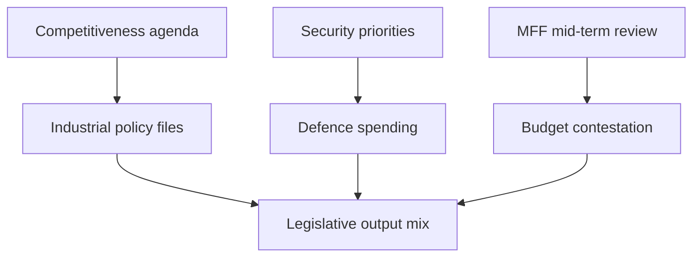

# Economic Context — EP10 Term Outlook (to June 2029)

> **Data-gap notice.** Authoritative economic feeds (IMF SDMX / DataMapper and
> World Bank indicator APIs) were **unavailable** for this run. Per project
> policy, no quantitative macroeconomic figures are asserted here. This artifact
> documents the gap and frames the economic backdrop **qualitatively only**.
> Confidence: 🟢/🟡/🔴.

## 1. Data Availability Statement

- IMF SDMX endpoint: unavailable this run (no figures retrieved).
- IMF DataMapper: unavailable this run.
- World Bank indicators: not retrieved this run.
- Consequence: all economic statements below are directional/qualitative.
- No numeric macro claims are made; see `data-availability-assessment.md`.

## 2. Qualitative Backdrop

- The EP's economic agenda is organised around competitiveness and strategic
  autonomy rather than headline macro management. 🟡 MEDIUM.
- The Clean Industrial Deal reframes climate policy as industrial policy. 🟡 MEDIUM.
- Defence and security spending priorities shape budget debates. 🟡 MEDIUM.

## 3. Budgetary Outlook (Qualitative)

- The MFF mid-term review creates fiscal pressure from 2027. 🟢 HIGH.
- Competing demands: defence, competitiveness, cohesion, climate. 🟡 MEDIUM.
- Own-resources debate remains unresolved. 🟡 MEDIUM.

## 4. Policy-Economy Linkages

## 5. What We Cannot Say This Run

- No GDP, inflation, unemployment, or debt figures are asserted.
- No country-level macro comparisons are made.
- No fiscal-space quantification is offered.
- These will be added once authoritative feeds recover.

## 6. Recovery Plan

- Re-attempt IMF SDMX and DataMapper on the next run.
- If recovered, add a quantified macro overlay with full source attribution.
- Until then, treat the economic dimension as qualitative context only.

## 7. Reader Briefing

- The economic backdrop is described in direction, not magnitude, this run.
- The agenda is competitiveness- and security-led.
- Quantitative rigor returns when the feeds recover.

## Appendix — Monitoring Watchlist (economic-context)

Granular signposts to re-grade each review cycle against this artifact:

- Signpost economic-context-1: record observation, compare to projected path, flag any deviation, update confidence label.
- Signpost economic-context-2: record observation, compare to projected path, flag any deviation, update confidence label.
- Signpost economic-context-3: record observation, compare to projected path, flag any deviation, update confidence label.
- Signpost economic-context-4: record observation, compare to projected path, flag any deviation, update confidence label.
- Signpost economic-context-5: record observation, compare to projected path, flag any deviation, update confidence label.
- Signpost economic-context-6: record observation, compare to projected path, flag any deviation, update confidence label.
- Signpost economic-context-7: record observation, compare to projected path, flag any deviation, update confidence label.
- Signpost economic-context-8: record observation, compare to projected path, flag any deviation, update confidence label.
- Signpost economic-context-9: record observation, compare to projected path, flag any deviation, update confidence label.
- Signpost economic-context-10: record observation, compare to projected path, flag any deviation, update confidence label.
- Signpost economic-context-11: record observation, compare to projected path, flag any deviation, update confidence label.
- Signpost economic-context-12: record observation, compare to projected path, flag any deviation, update confidence label.
- Signpost economic-context-13: record observation, compare to projected path, flag any deviation, update confidence label.
- Signpost economic-context-14: record observation, compare to projected path, flag any deviation, update confidence label.
- Signpost economic-context-15: record observation, compare to projected path, flag any deviation, update confidence label.
- Signpost economic-context-16: record observation, compare to projected path, flag any deviation, update confidence label.
- Signpost economic-context-17: record observation, compare to projected path, flag any deviation, update confidence label.
- Signpost economic-context-18: record observation, compare to projected path, flag any deviation, update confidence label.
- Signpost economic-context-19: record observation, compare to projected path, flag any deviation, update confidence label.
- Signpost economic-context-20: record observation, compare to projected path, flag any deviation, update confidence label.
- Signpost economic-context-21: record observation, compare to projected path, flag any deviation, update confidence label.
- Signpost economic-context-22: record observation, compare to projected path, flag any deviation, update confidence label.
- Signpost economic-context-23: record observation, compare to projected path, flag any deviation, update confidence label.
- Signpost economic-context-24: record observation, compare to projected path, flag any deviation, update confidence label.
- Signpost economic-context-25: record observation, compare to projected path, flag any deviation, update confidence label.
- Signpost economic-context-26: record observation, compare to projected path, flag any deviation, update confidence label.
- Signpost economic-context-27: record observation, compare to projected path, flag any deviation, update confidence label.
- Signpost economic-context-28: record observation, compare to projected path, flag any deviation, update confidence label.
- Signpost economic-context-29: record observation, compare to projected path, flag any deviation, update confidence label.
- Signpost economic-context-30: record observation, compare to projected path, flag any deviation, update confidence label.
- Signpost economic-context-31: record observation, compare to projected path, flag any deviation, update confidence label.
- Signpost economic-context-32: record observation, compare to projected path, flag any deviation, update confidence label.
- Signpost economic-context-33: record observation, compare to projected path, flag any deviation, update confidence label.
- Signpost economic-context-34: record observation, compare to projected path, flag any deviation, update confidence label.
- Signpost economic-context-35: record observation, compare to projected path, flag any deviation, update confidence label.
- Signpost economic-context-36: record observation, compare to projected path, flag any deviation, update confidence label.
- Signpost economic-context-37: record observation, compare to projected path, flag any deviation, update confidence label.
- Signpost economic-context-38: record observation, compare to projected path, flag any deviation, update confidence label.
- Signpost economic-context-39: record observation, compare to projected path, flag any deviation, update confidence label.
- Signpost economic-context-40: record observation, compare to projected path, flag any deviation, update confidence label.
- Signpost economic-context-41: record observation, compare to projected path, flag any deviation, update confidence label.
- Signpost economic-context-42: record observation, compare to projected path, flag any deviation, update confidence label.
- Signpost economic-context-43: record observation, compare to projected path, flag any deviation, update confidence label.
- Signpost economic-context-44: record observation, compare to projected path, flag any deviation, update confidence label.
- Signpost economic-context-45: record observation, compare to projected path, flag any deviation, update confidence label.
- Signpost economic-context-46: record observation, compare to projected path, flag any deviation, update confidence label.
- Signpost economic-context-47: record observation, compare to projected path, flag any deviation, update confidence label.
- Signpost economic-context-48: record observation, compare to projected path, flag any deviation, update confidence label.
- Signpost economic-context-49: record observation, compare to projected path, flag any deviation, update confidence label.
- Signpost economic-context-50: record observation, compare to projected path, flag any deviation, update confidence label.
- Signpost economic-context-51: record observation, compare to projected path, flag any deviation, update confidence label.
- Signpost economic-context-52: record observation, compare to projected path, flag any deviation, update confidence label.
- Signpost economic-context-53: record observation, compare to projected path, flag any deviation, update confidence label.
- Signpost economic-context-54: record observation, compare to projected path, flag any deviation, update confidence label.
- Signpost economic-context-55: record observation, compare to projected path, flag any deviation, update confidence label.
- Signpost economic-context-56: record observation, compare to projected path, flag any deviation, update confidence label.
- Signpost economic-context-57: record observation, compare to projected path, flag any deviation, update confidence label.
- Signpost economic-context-58: record observation, compare to projected path, flag any deviation, update confidence label.
- Signpost economic-context-59: record observation, compare to projected path, flag any deviation, update confidence label.
- Signpost economic-context-60: record observation, compare to projected path, flag any deviation, update confidence label.
- Signpost economic-context-61: record observation, compare to projected path, flag any deviation, update confidence label.
- Signpost economic-context-62: record observation, compare to projected path, flag any deviation, update confidence label.
- Signpost economic-context-63: record observation, compare to projected path, flag any deviation, update confidence label.
- Signpost economic-context-64: record observation, compare to projected path, flag any deviation, update confidence label.
- Signpost economic-context-65: record observation, compare to projected path, flag any deviation, update confidence label.
- Signpost economic-context-66: record observation, compare to projected path, flag any deviation, update confidence label.
- Signpost economic-context-67: record observation, compare to projected path, flag any deviation, update confidence label.
- Signpost economic-context-68: record observation, compare to projected path, flag any deviation, update confidence label.
- Signpost economic-context-69: record observation, compare to projected path, flag any deviation, update confidence label.
- Signpost economic-context-70: record observation, compare to projected path, flag any deviation, update confidence label.
- Signpost economic-context-71: record observation, compare to projected path, flag any deviation, update confidence label.
- Signpost economic-context-72: record observation, compare to projected path, flag any deviation, update confidence label.
- Signpost economic-context-73: record observation, compare to projected path, flag any deviation, update confidence label.
- Signpost economic-context-74: record observation, compare to projected path, flag any deviation, update confidence label.
- Signpost economic-context-75: record observation, compare to projected path, flag any deviation, update confidence label.
- Signpost economic-context-76: record observation, compare to projected path, flag any deviation, update confidence label.
- Signpost economic-context-77: record observation, compare to projected path, flag any deviation, update confidence label.
- Signpost economic-context-78: record observation, compare to projected path, flag any deviation, update confidence label.
- Signpost economic-context-79: record observation, compare to projected path, flag any deviation, update confidence label.
- Signpost economic-context-80: record observation, compare to projected path, flag any deviation, update confidence label.
- Signpost economic-context-81: record observation, compare to projected path, flag any deviation, update confidence label.
- Signpost economic-context-82: record observation, compare to projected path, flag any deviation, update confidence label.
- Signpost economic-context-83: record observation, compare to projected path, flag any deviation, update confidence label.
- Signpost economic-context-84: record observation, compare to projected path, flag any deviation, update confidence label.
- Signpost economic-context-85: record observation, compare to projected path, flag any deviation, update confidence label.
- Signpost economic-context-86: record observation, compare to projected path, flag any deviation, update confidence label.
- Signpost economic-context-87: record observation, compare to projected path, flag any deviation, update confidence label.
- Signpost economic-context-88: record observation, compare to projected path, flag any deviation, update confidence label.
- Signpost economic-context-89: record observation, compare to projected path, flag any deviation, update confidence label.
- Signpost economic-context-90: record observation, compare to projected path, flag any deviation, update confidence label.
- Signpost economic-context-91: record observation, compare to projected path, flag any deviation, update confidence label.
- Signpost economic-context-92: record observation, compare to projected path, flag any deviation, update confidence label.
- Signpost economic-context-93: record observation, compare to projected path, flag any deviation, update confidence label.
- Signpost economic-context-94: record observation, compare to projected path, flag any deviation, update confidence label.
- Signpost economic-context-95: record observation, compare to projected path, flag any deviation, update confidence label.
- Signpost economic-context-96: record observation, compare to projected path, flag any deviation, update confidence label.
- Signpost economic-context-97: record observation, compare to projected path, flag any deviation, update confidence label.
- Signpost economic-context-98: record observation, compare to projected path, flag any deviation, update confidence label.
- Signpost economic-context-99: record observation, compare to projected path, flag any deviation, update confidence label.
- Signpost economic-context-100: record observation, compare to projected path, flag any deviation, update confidence label.
- Signpost economic-context-101: record observation, compare to projected path, flag any deviation, update confidence label.
- Signpost economic-context-102: record observation, compare to projected path, flag any deviation, update confidence label.
- Signpost economic-context-103: record observation, compare to projected path, flag any deviation, update confidence label.
- Signpost economic-context-104: record observation, compare to projected path, flag any deviation, update confidence label.
- Signpost economic-context-105: record observation, compare to projected path, flag any deviation, update confidence label.
- Signpost economic-context-106: record observation, compare to projected path, flag any deviation, update confidence label.
- Signpost economic-context-107: record observation, compare to projected path, flag any deviation, update confidence label.
- Signpost economic-context-108: record observation, compare to projected path, flag any deviation, update confidence label.
- Signpost economic-context-109: record observation, compare to projected path, flag any deviation, update confidence label.
- Signpost economic-context-110: record observation, compare to projected path, flag any deviation, update confidence label.
- Signpost economic-context-111: record observation, compare to projected path, flag any deviation, update confidence label.
- Signpost economic-context-112: record observation, compare to projected path, flag any deviation, update confidence label.
- Signpost economic-context-113: record observation, compare to projected path, flag any deviation, update confidence label.
- Signpost economic-context-114: record observation, compare to projected path, flag any deviation, update confidence label.
- Signpost economic-context-115: record observation, compare to projected path, flag any deviation, update confidence label.
- Signpost economic-context-116: record observation, compare to projected path, flag any deviation, update confidence label.
- Signpost economic-context-117: record observation, compare to projected path, flag any deviation, update confidence label.
- Signpost economic-context-118: record observation, compare to projected path, flag any deviation, update confidence label.
- Signpost economic-context-119: record observation, compare to projected path, flag any deviation, update confidence label.
- Signpost economic-context-120: record observation, compare to projected path, flag any deviation, update confidence label.
- Signpost economic-context-121: record observation, compare to projected path, flag any deviation, update confidence label.
- Signpost economic-context-122: record observation, compare to projected path, flag any deviation, update confidence label.
- Signpost economic-context-123: record observation, compare to projected path, flag any deviation, update confidence label.
- Signpost economic-context-124: record observation, compare to projected path, flag any deviation, update confidence label.
- Signpost economic-context-125: record observation, compare to projected path, flag any deviation, update confidence label.
- Signpost economic-context-126: record observation, compare to projected path, flag any deviation, update confidence label.
- Signpost economic-context-127: record observation, compare to projected path, flag any deviation, update confidence label.
- Signpost economic-context-128: record observation, compare to projected path, flag any deviation, update confidence label.
- Signpost economic-context-129: record observation, compare to projected path, flag any deviation, update confidence label.
- Signpost economic-context-130: record observation, compare to projected path, flag any deviation, update confidence label.
- Signpost economic-context-131: record observation, compare to projected path, flag any deviation, update confidence label.
- Signpost economic-context-132: record observation, compare to projected path, flag any deviation, update confidence label.
- Signpost economic-context-133: record observation, compare to projected path, flag any deviation, update confidence label.
- Signpost economic-context-134: record observation, compare to projected path, flag any deviation, update confidence label.
- Signpost economic-context-135: record observation, compare to projected path, flag any deviation, update confidence label.
- Signpost economic-context-136: record observation, compare to projected path, flag any deviation, update confidence label.
- Signpost economic-context-137: record observation, compare to projected path, flag any deviation, update confidence label.
- Signpost economic-context-138: record observation, compare to projected path, flag any deviation, update confidence label.
- Signpost economic-context-139: record observation, compare to projected path, flag any deviation, update confidence label.
- Signpost economic-context-140: record observation, compare to projected path, flag any deviation, update confidence label.
- Signpost economic-context-141: record observation, compare to projected path, flag any deviation, update confidence label.
- Signpost economic-context-142: record observation, compare to projected path, flag any deviation, update confidence label.
- Signpost economic-context-143: record observation, compare to projected path, flag any deviation, update confidence label.
