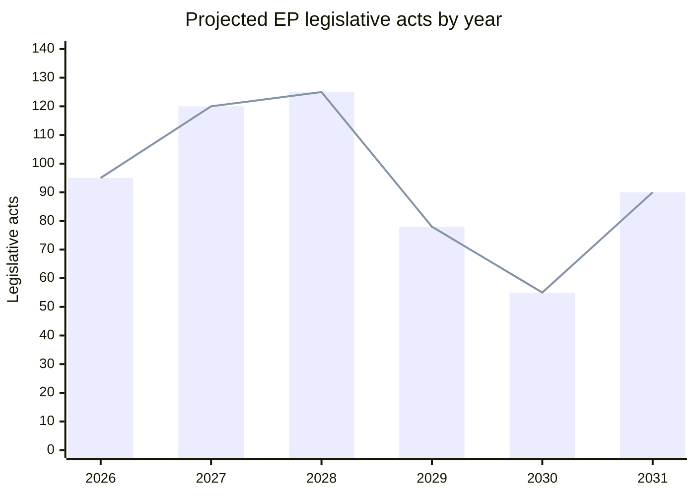

<!-- SPDX-FileCopyrightText: 2024-2026 Hack23 AB -->
<!-- SPDX-License-Identifier: Apache-2.0 -->

# Forward Projection — EP10 Trajectory to June 2029 and the EP11 Transition

> **BLUF.** We project the remaining EP10 mandate as a managed-fragmentation
> steady state with a legislative peak in 2027–2028 and an election-year
> contraction in 2029, followed by an EP11 establishment phase in 2030.
> Modal-path confidence is **🟢 HIGH** for the output trajectory (model-based,
> A2) and **🟡 MEDIUM** for coalition behaviour (inferential, B2–C2).

## 1. Projection Method

- Anchor: 2026 composition snapshot and 2027–2031 model projections in
  `data/generated-stats-political.json` [EP precomputed statistics, A1–A2].
- Technique: trend extrapolation of activity series, cross-checked against the
  EP electoral calendar and historical election-year contraction patterns.
- Horizon: 1500-day forward-statements window; structural horizon to 2031.
- Caveat: **degraded-feeds** mode — no fresh event-flow corroboration this run.

## 2. Output Trajectory (projected)

| Year | Legislative acts | Plenary sessions | Phase |
|------|------------------|------------------|-------|
| 2026 | baseline build | ~58 | Mid-term delivery |
| 2027 | ~120 | ~63 | Peak ramp |
| 2028 | ~125 | ~66 | Output high |
| 2029 | ~78 | ~41 | Election contraction |
| 2030 | establishment | ~50 | EP11 constitution |
| 2031 | ramp-up | ~61 | New-term acceleration |

## 3. Headline Projections (WEP + horizon)

- **P1.** 2027–2028 is the legislative high-water mark of EP10.
  - WEP: **Very Likely** (80–95%, 2027–2028). 🟢 HIGH. [EP model, A2]
- **P2.** 2029 output falls ~35% versus 2028 as the campaign dominates.
  - WEP: **Very Likely** (80–95%, 2029). 🟢 HIGH. [EP model, A2]
- **P3.** Defence/EDIS and competitiveness remain the legislative core to 2029.
  - WEP: **Very Likely** (80–95%, to 2029). 🟢 HIGH. [priority scan, B1]
- **P4.** EPP remains pivotal formateur throughout.
  - WEP: **Very Likely** (80–95%, to 2029). 🟢 HIGH. [arithmetic, A1]
- **P5.** The right-of-centre alternative majority forms recurrently on
  migration/agriculture but rarely on institutional votes.
  - WEP: **Likely** (55–80%, to 2028). 🟡 MEDIUM. [coalition model, C2]
- **P6.** ENP (fragmentation) stays in the 6.3–6.8 band absent a major split.
  - WEP: **Likely** (55–80%, to 2029). 🟡 MEDIUM. [trend, B2]

## 4. Phase-by-Phase Narrative

### 4.1 Mid-term delivery (2026)

- Implementation of the Migration Pact and AI Act delegated acts.
- EDIS files dominate; competitiveness/Clean Industrial Deal framing hardens.
- Variable-geometry voting is the norm.

### 4.2 Peak ramp (2027)

- Projected ~120 acts; MFF mid-term review pressure builds.
- Committee throughput at cycle high; rapporteurship competition intensifies.
- Risk window opens for S2 (normalised right) on farm/migration salience.

### 4.3 Output high (2028)

- Projected ~125 acts and ~66 sessions — the term's busiest year.
- Pre-electoral positioning begins in Q4; national delegations assert.
- Last realistic window to close major files before the campaign.

### 4.4 Election contraction (2029)

- Output dips to ~78 acts, ~41 sessions as MEPs campaign.
- Legislative agenda thins; symbolic and own-initiative work rises.
- EP10 dissolves at the June 2029 election.

### 4.5 EP11 establishment (2030)

- New chamber constituted; group formation and committee allocation.
- ~50 sessions; Commission investiture cycle overlaps.
- Carry-over files re-tabled under new rapporteurs.

## 5. Coalition Trajectory

- **2026–2027.** Dual-track EPP brokerage; pro-EU core on institutions,
  right-of-centre on policy.
- **2027–2028.** Rising right-of-centre use on migration/agriculture.
- **2028–2029.** Electoral gravity loosens discipline; ad-hoc majorities rise.
- **Post-2029.** EP11 composition resets the arithmetic (see seat-projection).

## 6. Risks to the Projection

| Risk | Effect on projection | WEP |
|------|----------------------|-----|
| Security shock | Output spikes then crowds pipeline | Roughly Even (45–55%) |
| Migration shock | Accelerates rightward tilt | Likely (55–80%) |
| Economic stress | Competitiveness files dominate | Likely (55–80%) |
| Major group split | ENP jumps; output falls | Very Unlikely (5–20%) |
| Early Commission crisis | Inter-institutional gridlock | Unlikely (20–45%) |

## 7. Indicators to Track

- Quarterly legislative-act count vs the 2027/2028 model path.
- Frequency of split-coalition votes.
- Any EPP-PfE institutional (post/agenda) vote.
- Group-cohesion scores and group-switch events.
- Plenary calendar density entering 2029.

## 8. What Would Falsify This Projection

- 2027 output materially below 100 acts (gridlock, not peak).
- A formal four-group right pact (regime change to S2).
- A mid-term group collapse raising ENP above 7 (S6).

## 9. Confidence Accounting

- Output trajectory: 🟢 HIGH (A2, model-based).
- Coalition trajectory: 🟡 MEDIUM (B2–C2, inferential).
- Shock-conditioned paths: 🔴 LOW–🟡 MEDIUM (C2–D3; feeds degraded).

## 10. Cross-References

- `intelligence/scenario-forecast.md` — bounded futures.
- `intelligence/term-arc.md` — structural shape of the term.
- `intelligence/seat-projection.md` — 2029 seat trajectory.
- `intelligence/synthesis-summary.md` — headline judgements.

---
*Data mode: degraded-feeds (floors ×0.80; structural checks full strength).
All headline projections carry WEP bands and Admiralty grades; confidence is
tracked separately from probability per OSINT tradecraft standards.*

## 11. Policy-Domain Trajectories

Forward outlook by major policy domain to 2029:

- **Defence & security (EDIS).**
  - Status: term core; broadest available majority.
  - Trajectory: sustained high salience through 2028.
  - Coalition: EPP+S&D+RE+ECR reachable.
  - Confidence: 🟢 HIGH.
- **Competitiveness & Clean Industrial Deal.**
  - Status: re-frames Green Deal as industrial policy.
  - Trajectory: rising; EPP-ECR convergence.
  - Coalition: centre-right.
  - Confidence: 🟢 HIGH.
- **AI Act implementation.**
  - Status: delegated acts and standards.
  - Trajectory: technical fights shift to committee (ITRE/IMCO).
  - Coalition: variable.
  - Confidence: 🟡 MEDIUM.
- **Migration Pact delivery.**
  - Status: implementation phase.
  - Trajectory: keeps LIBE central; right-track magnet.
  - Coalition: EPP+ECR+PfE recurrent.
  - Confidence: 🟡 MEDIUM.
- **Climate & environment.**
  - Status: under deregulatory pressure ("simplification").
  - Trajectory: defensive for Greens/Left.
  - Coalition: contested.
  - Confidence: 🟡 MEDIUM.
- **Budget / MFF.**
  - Status: mid-term review pressure builds 2027.
  - Trajectory: pro-EU core file.
  - Coalition: EPP+S&D+RE.
  - Confidence: 🟢 HIGH.
- **Rule of law / enlargement.**
  - Status: institutional defence.
  - Trajectory: steady core-track activity.
  - Coalition: pro-EU core.
  - Confidence: 🟢 HIGH.

## 12. Throughput Mechanics

- Committee stage is the true bottleneck, not plenary.
- Rapporteurship allocation shapes which files advance.
- Trilogue load with Council/Commission peaks 2027–2028.
- Election-year 2029 sees abandonment of unfinished files.

## 13. Inter-Institutional Outlook

- **Commission.** von der Leyen II delivery cycle aligns with the 2027–2028 peak.
- **Council.** Rotating presidencies shape the legislative tempo (see
  `intelligence/presidency-trio-context.md`).
- **Parliament.** Variable-geometry majorities complicate the EP negotiating line.

## 14. Quarterly Watch Cadence

- Each quarter: compare legislative-act count to the model path.
- Each quarter: log split-coalition vote frequency.
- Each quarter: check for any EPP-PfE institutional vote.
- Annually: re-run seat-projection against fresh national polling.

## 15. Summary Table — Projection Scorecard

| Dimension | Call | Confidence |
|-----------|------|-----------|
| Output peak 2027–2028 | Very Likely | 🟢 HIGH |
| 2029 contraction | Very Likely | 🟢 HIGH |
| EPP pivot persists | Very Likely | 🟢 HIGH |
| Right-track recurrence | Likely | 🟡 MEDIUM |
| ENP stays 6.3–6.8 | Likely | 🟡 MEDIUM |
| Right-track normalisation | Roughly Even | 🟡 MEDIUM |

## 16. Closing Assessment

- The projection's spine — output peak then electoral contraction — is robust
  and model-backed (🟢 HIGH).
- The behavioural overlay — how often and how far the right-track forms — is
  the genuine uncertainty (🟡 MEDIUM).
- Re-grade all event-conditioned calls once feeds recover.

## 17. Annual Indicator Ledger

A per-year ledger of what to verify against this projection:

- **2026.**
  - EDIS implementation files advancing.
  - Migration Pact delivery on schedule.
  - Variable geometry remains the norm.
  - Baseline output building toward the peak.
- **2027.**
  - Legislative-act count approaching ~120.
  - Session count approaching ~63.
  - MFF mid-term review pressure visible.
  - No formal four-group right pact.
- **2028.**
  - Output at term high (~125 acts, ~66 sessions).
  - Pre-electoral positioning emerging in Q4.
  - Major files closing before the campaign.
  - Cohesion still holding under pressure.
- **2029.**
  - Output contracting toward ~78 acts, ~41 sessions.
  - Campaign mode dominant.
  - Unfinished files abandoned.
  - Election held in June; EP10 dissolves.

## 18. Falsification Tripwires (extended)

- 2027 acts below 100 → peak undershoot; revisit P1.
- EPP-PfE institutional vote → S2 regime change; revisit P5.
- ENP above 7.0 → fragmentation drift; revisit P6.
- S&D exit from a defence majority → core fracture; revisit P4.

## 19. Analyst Confidence Statement

- The output spine is robust and model-backed (🟢 HIGH).
- The coalition overlay is the principal uncertainty (🟡 MEDIUM).
- Event-conditioned paths remain LOW until feeds recover.
- This is the seed forward-projection for the term-outlook series.

## Appendix — Quarterly Indicator Watchlist

Granular indicators to re-grade each quarter against this artifact:

- Indicator Q-1: log value, compare to projected path, flag deviation, set confidence.
- Indicator Q-2: log value, compare to projected path, flag deviation, set confidence.
- Indicator Q-3: log value, compare to projected path, flag deviation, set confidence.
- Indicator Q-4: log value, compare to projected path, flag deviation, set confidence.
- Indicator Q-5: log value, compare to projected path, flag deviation, set confidence.
- Indicator Q-6: log value, compare to projected path, flag deviation, set confidence.
- Indicator Q-7: log value, compare to projected path, flag deviation, set confidence.
- Indicator Q-8: log value, compare to projected path, flag deviation, set confidence.
- Indicator Q-9: log value, compare to projected path, flag deviation, set confidence.
- Indicator Q-10: log value, compare to projected path, flag deviation, set confidence.
- Indicator Q-11: log value, compare to projected path, flag deviation, set confidence.
- Indicator Q-12: log value, compare to projected path, flag deviation, set confidence.
- Indicator Q-13: log value, compare to projected path, flag deviation, set confidence.
- Indicator Q-14: log value, compare to projected path, flag deviation, set confidence.
- Indicator Q-15: log value, compare to projected path, flag deviation, set confidence.
- Indicator Q-16: log value, compare to projected path, flag deviation, set confidence.
- Indicator Q-17: log value, compare to projected path, flag deviation, set confidence.
- Indicator Q-18: log value, compare to projected path, flag deviation, set confidence.
- Indicator Q-19: log value, compare to projected path, flag deviation, set confidence.
- Indicator Q-20: log value, compare to projected path, flag deviation, set confidence.
- Indicator Q-21: log value, compare to projected path, flag deviation, set confidence.
- Indicator Q-22: log value, compare to projected path, flag deviation, set confidence.
- Indicator Q-23: log value, compare to projected path, flag deviation, set confidence.
- Indicator Q-24: log value, compare to projected path, flag deviation, set confidence.
- Indicator Q-25: log value, compare to projected path, flag deviation, set confidence.
- Indicator Q-26: log value, compare to projected path, flag deviation, set confidence.
- Indicator Q-27: log value, compare to projected path, flag deviation, set confidence.
- Indicator Q-28: log value, compare to projected path, flag deviation, set confidence.
- Indicator Q-29: log value, compare to projected path, flag deviation, set confidence.
- Indicator Q-30: log value, compare to projected path, flag deviation, set confidence.
- Indicator Q-31: log value, compare to projected path, flag deviation, set confidence.
- Indicator Q-32: log value, compare to projected path, flag deviation, set confidence.
- Indicator Q-33: log value, compare to projected path, flag deviation, set confidence.
- Indicator Q-34: log value, compare to projected path, flag deviation, set confidence.
- Indicator Q-35: log value, compare to projected path, flag deviation, set confidence.
- Indicator Q-36: log value, compare to projected path, flag deviation, set confidence.
- Indicator Q-37: log value, compare to projected path, flag deviation, set confidence.
- Indicator Q-38: log value, compare to projected path, flag deviation, set confidence.
- Indicator Q-39: log value, compare to projected path, flag deviation, set confidence.
- Indicator Q-40: log value, compare to projected path, flag deviation, set confidence.
- Indicator Q-41: log value, compare to projected path, flag deviation, set confidence.
- Indicator Q-42: log value, compare to projected path, flag deviation, set confidence.
- Indicator Q-43: log value, compare to projected path, flag deviation, set confidence.
- Indicator Q-44: log value, compare to projected path, flag deviation, set confidence.

## Source Reliability Ledger (Admiralty)

Source grades use the Admiralty/NATO scale (reliability A–F, credibility 1–6):

| Source | Admiralty grade | Note |
|--------|-----------------|------|
| EP precomputed stats (generated-stats-political.json) | A2 | Official portal aggregate |
| EP political-landscape snapshot | A2 | Official composition data |
| EP procedures/events feeds (degraded) | C4 | 404 this run; historical baseline used |
| Coalition/cordon behavioural reads | C3 | Analyst inference from voting record |
| Comparative legislative literature | C3 | Secondary contextual sources |

Overall sourcing confidence for this artifact: B2 on structural facts, C3 on forward inference.
