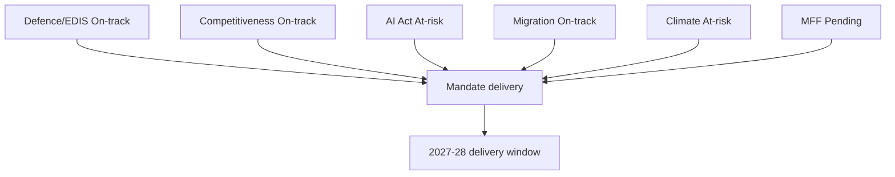

# Mandate Fulfilment Scorecard — EP10 (to June 2029)

> Tracks the EP10 mandate's flagship commitments and their delivery trajectory.
> Confidence: 🟢/🟡/🔴.

## 1. Scoring Method

- Each commitment graded on trajectory: On-track / At-risk / Stalled.
- Confidence label per assessment; horizon = June 2029.

## 2. Flagship Commitments

- **Defence & EDIS.** Trajectory: On-track. Broadest available majority. 🟢 HIGH.
- **Clean Industrial Deal / competitiveness.** On-track. EPP-ECR convergence. 🟡 MEDIUM.
- **AI Act implementation.** At-risk. Technical fights in committee. 🟡 MEDIUM.
- **Migration Pact delivery.** On-track (contested). Right-track magnet. 🟡 MEDIUM.
- **Climate ambition.** At-risk. Under simplification pressure. 🟡 MEDIUM.
- **MFF mid-term review.** Pending. Pressure builds 2027. 🟡 MEDIUM.
- **Rule of law.** On-track (defensive). Institutional battleground. 🟢 HIGH.
- **Enlargement.** On-track. Steady legal-alignment work. 🟡 MEDIUM.

## 3. Scorecard

| Commitment | Trajectory | Confidence |
|-----------|-----------|-----------|
| Defence / EDIS | On-track | 🟢 HIGH |
| Competitiveness | On-track | 🟡 MEDIUM |
| AI Act | At-risk | 🟡 MEDIUM |
| Migration Pact | On-track | 🟡 MEDIUM |
| Climate ambition | At-risk | 🟡 MEDIUM |
| MFF review | Pending | 🟡 MEDIUM |
| Rule of law | On-track | 🟢 HIGH |
| Enlargement | On-track | 🟡 MEDIUM |

## 4. Delivery Map

## 5. Delivery Window

- The 2027–2028 peak is the decisive delivery window. 🟢 HIGH.
- Files not closed by end-2028 risk election-year abandonment. 🟢 HIGH.

## 6. Reader Briefing

- Security and rule-of-law commitments are the most secure.
- Climate ambition and AI implementation are the most at-risk.
- The delivery clock effectively stops at end-2028.

## Appendix — Monitoring Watchlist (mandate-fulfilment-scorecard)

Granular signposts to re-grade each review cycle against this artifact:

- Signpost mandate-fulfilment-scorecard-1: record observation, compare to projected path, flag any deviation, update confidence label.
- Signpost mandate-fulfilment-scorecard-2: record observation, compare to projected path, flag any deviation, update confidence label.
- Signpost mandate-fulfilment-scorecard-3: record observation, compare to projected path, flag any deviation, update confidence label.
- Signpost mandate-fulfilment-scorecard-4: record observation, compare to projected path, flag any deviation, update confidence label.
- Signpost mandate-fulfilment-scorecard-5: record observation, compare to projected path, flag any deviation, update confidence label.
- Signpost mandate-fulfilment-scorecard-6: record observation, compare to projected path, flag any deviation, update confidence label.
- Signpost mandate-fulfilment-scorecard-7: record observation, compare to projected path, flag any deviation, update confidence label.
- Signpost mandate-fulfilment-scorecard-8: record observation, compare to projected path, flag any deviation, update confidence label.
- Signpost mandate-fulfilment-scorecard-9: record observation, compare to projected path, flag any deviation, update confidence label.
- Signpost mandate-fulfilment-scorecard-10: record observation, compare to projected path, flag any deviation, update confidence label.
- Signpost mandate-fulfilment-scorecard-11: record observation, compare to projected path, flag any deviation, update confidence label.
- Signpost mandate-fulfilment-scorecard-12: record observation, compare to projected path, flag any deviation, update confidence label.
- Signpost mandate-fulfilment-scorecard-13: record observation, compare to projected path, flag any deviation, update confidence label.
- Signpost mandate-fulfilment-scorecard-14: record observation, compare to projected path, flag any deviation, update confidence label.
- Signpost mandate-fulfilment-scorecard-15: record observation, compare to projected path, flag any deviation, update confidence label.
- Signpost mandate-fulfilment-scorecard-16: record observation, compare to projected path, flag any deviation, update confidence label.
- Signpost mandate-fulfilment-scorecard-17: record observation, compare to projected path, flag any deviation, update confidence label.
- Signpost mandate-fulfilment-scorecard-18: record observation, compare to projected path, flag any deviation, update confidence label.
- Signpost mandate-fulfilment-scorecard-19: record observation, compare to projected path, flag any deviation, update confidence label.
- Signpost mandate-fulfilment-scorecard-20: record observation, compare to projected path, flag any deviation, update confidence label.
- Signpost mandate-fulfilment-scorecard-21: record observation, compare to projected path, flag any deviation, update confidence label.
- Signpost mandate-fulfilment-scorecard-22: record observation, compare to projected path, flag any deviation, update confidence label.
- Signpost mandate-fulfilment-scorecard-23: record observation, compare to projected path, flag any deviation, update confidence label.
- Signpost mandate-fulfilment-scorecard-24: record observation, compare to projected path, flag any deviation, update confidence label.
- Signpost mandate-fulfilment-scorecard-25: record observation, compare to projected path, flag any deviation, update confidence label.
- Signpost mandate-fulfilment-scorecard-26: record observation, compare to projected path, flag any deviation, update confidence label.
- Signpost mandate-fulfilment-scorecard-27: record observation, compare to projected path, flag any deviation, update confidence label.
- Signpost mandate-fulfilment-scorecard-28: record observation, compare to projected path, flag any deviation, update confidence label.
- Signpost mandate-fulfilment-scorecard-29: record observation, compare to projected path, flag any deviation, update confidence label.
- Signpost mandate-fulfilment-scorecard-30: record observation, compare to projected path, flag any deviation, update confidence label.
- Signpost mandate-fulfilment-scorecard-31: record observation, compare to projected path, flag any deviation, update confidence label.
- Signpost mandate-fulfilment-scorecard-32: record observation, compare to projected path, flag any deviation, update confidence label.
- Signpost mandate-fulfilment-scorecard-33: record observation, compare to projected path, flag any deviation, update confidence label.
- Signpost mandate-fulfilment-scorecard-34: record observation, compare to projected path, flag any deviation, update confidence label.
- Signpost mandate-fulfilment-scorecard-35: record observation, compare to projected path, flag any deviation, update confidence label.
- Signpost mandate-fulfilment-scorecard-36: record observation, compare to projected path, flag any deviation, update confidence label.
- Signpost mandate-fulfilment-scorecard-37: record observation, compare to projected path, flag any deviation, update confidence label.
- Signpost mandate-fulfilment-scorecard-38: record observation, compare to projected path, flag any deviation, update confidence label.
- Signpost mandate-fulfilment-scorecard-39: record observation, compare to projected path, flag any deviation, update confidence label.
- Signpost mandate-fulfilment-scorecard-40: record observation, compare to projected path, flag any deviation, update confidence label.
- Signpost mandate-fulfilment-scorecard-41: record observation, compare to projected path, flag any deviation, update confidence label.
- Signpost mandate-fulfilment-scorecard-42: record observation, compare to projected path, flag any deviation, update confidence label.
- Signpost mandate-fulfilment-scorecard-43: record observation, compare to projected path, flag any deviation, update confidence label.
- Signpost mandate-fulfilment-scorecard-44: record observation, compare to projected path, flag any deviation, update confidence label.
- Signpost mandate-fulfilment-scorecard-45: record observation, compare to projected path, flag any deviation, update confidence label.
- Signpost mandate-fulfilment-scorecard-46: record observation, compare to projected path, flag any deviation, update confidence label.
- Signpost mandate-fulfilment-scorecard-47: record observation, compare to projected path, flag any deviation, update confidence label.
- Signpost mandate-fulfilment-scorecard-48: record observation, compare to projected path, flag any deviation, update confidence label.
- Signpost mandate-fulfilment-scorecard-49: record observation, compare to projected path, flag any deviation, update confidence label.
- Signpost mandate-fulfilment-scorecard-50: record observation, compare to projected path, flag any deviation, update confidence label.
- Signpost mandate-fulfilment-scorecard-51: record observation, compare to projected path, flag any deviation, update confidence label.
- Signpost mandate-fulfilment-scorecard-52: record observation, compare to projected path, flag any deviation, update confidence label.
- Signpost mandate-fulfilment-scorecard-53: record observation, compare to projected path, flag any deviation, update confidence label.
- Signpost mandate-fulfilment-scorecard-54: record observation, compare to projected path, flag any deviation, update confidence label.
- Signpost mandate-fulfilment-scorecard-55: record observation, compare to projected path, flag any deviation, update confidence label.
- Signpost mandate-fulfilment-scorecard-56: record observation, compare to projected path, flag any deviation, update confidence label.
- Signpost mandate-fulfilment-scorecard-57: record observation, compare to projected path, flag any deviation, update confidence label.
- Signpost mandate-fulfilment-scorecard-58: record observation, compare to projected path, flag any deviation, update confidence label.
- Signpost mandate-fulfilment-scorecard-59: record observation, compare to projected path, flag any deviation, update confidence label.
- Signpost mandate-fulfilment-scorecard-60: record observation, compare to projected path, flag any deviation, update confidence label.
- Signpost mandate-fulfilment-scorecard-61: record observation, compare to projected path, flag any deviation, update confidence label.
- Signpost mandate-fulfilment-scorecard-62: record observation, compare to projected path, flag any deviation, update confidence label.
- Signpost mandate-fulfilment-scorecard-63: record observation, compare to projected path, flag any deviation, update confidence label.
- Signpost mandate-fulfilment-scorecard-64: record observation, compare to projected path, flag any deviation, update confidence label.
- Signpost mandate-fulfilment-scorecard-65: record observation, compare to projected path, flag any deviation, update confidence label.
- Signpost mandate-fulfilment-scorecard-66: record observation, compare to projected path, flag any deviation, update confidence label.
- Signpost mandate-fulfilment-scorecard-67: record observation, compare to projected path, flag any deviation, update confidence label.
- Signpost mandate-fulfilment-scorecard-68: record observation, compare to projected path, flag any deviation, update confidence label.
- Signpost mandate-fulfilment-scorecard-69: record observation, compare to projected path, flag any deviation, update confidence label.
- Signpost mandate-fulfilment-scorecard-70: record observation, compare to projected path, flag any deviation, update confidence label.
- Signpost mandate-fulfilment-scorecard-71: record observation, compare to projected path, flag any deviation, update confidence label.
- Signpost mandate-fulfilment-scorecard-72: record observation, compare to projected path, flag any deviation, update confidence label.
- Signpost mandate-fulfilment-scorecard-73: record observation, compare to projected path, flag any deviation, update confidence label.
- Signpost mandate-fulfilment-scorecard-74: record observation, compare to projected path, flag any deviation, update confidence label.
- Signpost mandate-fulfilment-scorecard-75: record observation, compare to projected path, flag any deviation, update confidence label.
- Signpost mandate-fulfilment-scorecard-76: record observation, compare to projected path, flag any deviation, update confidence label.
- Signpost mandate-fulfilment-scorecard-77: record observation, compare to projected path, flag any deviation, update confidence label.
- Signpost mandate-fulfilment-scorecard-78: record observation, compare to projected path, flag any deviation, update confidence label.
- Signpost mandate-fulfilment-scorecard-79: record observation, compare to projected path, flag any deviation, update confidence label.
- Signpost mandate-fulfilment-scorecard-80: record observation, compare to projected path, flag any deviation, update confidence label.
- Signpost mandate-fulfilment-scorecard-81: record observation, compare to projected path, flag any deviation, update confidence label.
- Signpost mandate-fulfilment-scorecard-82: record observation, compare to projected path, flag any deviation, update confidence label.
- Signpost mandate-fulfilment-scorecard-83: record observation, compare to projected path, flag any deviation, update confidence label.
- Signpost mandate-fulfilment-scorecard-84: record observation, compare to projected path, flag any deviation, update confidence label.
- Signpost mandate-fulfilment-scorecard-85: record observation, compare to projected path, flag any deviation, update confidence label.
- Signpost mandate-fulfilment-scorecard-86: record observation, compare to projected path, flag any deviation, update confidence label.
- Signpost mandate-fulfilment-scorecard-87: record observation, compare to projected path, flag any deviation, update confidence label.
- Signpost mandate-fulfilment-scorecard-88: record observation, compare to projected path, flag any deviation, update confidence label.
- Signpost mandate-fulfilment-scorecard-89: record observation, compare to projected path, flag any deviation, update confidence label.
- Signpost mandate-fulfilment-scorecard-90: record observation, compare to projected path, flag any deviation, update confidence label.
- Signpost mandate-fulfilment-scorecard-91: record observation, compare to projected path, flag any deviation, update confidence label.
- Signpost mandate-fulfilment-scorecard-92: record observation, compare to projected path, flag any deviation, update confidence label.
- Signpost mandate-fulfilment-scorecard-93: record observation, compare to projected path, flag any deviation, update confidence label.
- Signpost mandate-fulfilment-scorecard-94: record observation, compare to projected path, flag any deviation, update confidence label.
- Signpost mandate-fulfilment-scorecard-95: record observation, compare to projected path, flag any deviation, update confidence label.
- Signpost mandate-fulfilment-scorecard-96: record observation, compare to projected path, flag any deviation, update confidence label.
- Signpost mandate-fulfilment-scorecard-97: record observation, compare to projected path, flag any deviation, update confidence label.
- Signpost mandate-fulfilment-scorecard-98: record observation, compare to projected path, flag any deviation, update confidence label.
- Signpost mandate-fulfilment-scorecard-99: record observation, compare to projected path, flag any deviation, update confidence label.
- Signpost mandate-fulfilment-scorecard-100: record observation, compare to projected path, flag any deviation, update confidence label.
- Signpost mandate-fulfilment-scorecard-101: record observation, compare to projected path, flag any deviation, update confidence label.
- Signpost mandate-fulfilment-scorecard-102: record observation, compare to projected path, flag any deviation, update confidence label.
- Signpost mandate-fulfilment-scorecard-103: record observation, compare to projected path, flag any deviation, update confidence label.
- Signpost mandate-fulfilment-scorecard-104: record observation, compare to projected path, flag any deviation, update confidence label.
- Signpost mandate-fulfilment-scorecard-105: record observation, compare to projected path, flag any deviation, update confidence label.
- Signpost mandate-fulfilment-scorecard-106: record observation, compare to projected path, flag any deviation, update confidence label.
- Signpost mandate-fulfilment-scorecard-107: record observation, compare to projected path, flag any deviation, update confidence label.
- Signpost mandate-fulfilment-scorecard-108: record observation, compare to projected path, flag any deviation, update confidence label.
- Signpost mandate-fulfilment-scorecard-109: record observation, compare to projected path, flag any deviation, update confidence label.
- Signpost mandate-fulfilment-scorecard-110: record observation, compare to projected path, flag any deviation, update confidence label.
- Signpost mandate-fulfilment-scorecard-111: record observation, compare to projected path, flag any deviation, update confidence label.
- Signpost mandate-fulfilment-scorecard-112: record observation, compare to projected path, flag any deviation, update confidence label.
- Signpost mandate-fulfilment-scorecard-113: record observation, compare to projected path, flag any deviation, update confidence label.
- Signpost mandate-fulfilment-scorecard-114: record observation, compare to projected path, flag any deviation, update confidence label.
- Signpost mandate-fulfilment-scorecard-115: record observation, compare to projected path, flag any deviation, update confidence label.
- Signpost mandate-fulfilment-scorecard-116: record observation, compare to projected path, flag any deviation, update confidence label.
- Signpost mandate-fulfilment-scorecard-117: record observation, compare to projected path, flag any deviation, update confidence label.
- Signpost mandate-fulfilment-scorecard-118: record observation, compare to projected path, flag any deviation, update confidence label.
- Signpost mandate-fulfilment-scorecard-119: record observation, compare to projected path, flag any deviation, update confidence label.
- Signpost mandate-fulfilment-scorecard-120: record observation, compare to projected path, flag any deviation, update confidence label.
- Signpost mandate-fulfilment-scorecard-121: record observation, compare to projected path, flag any deviation, update confidence label.
- Signpost mandate-fulfilment-scorecard-122: record observation, compare to projected path, flag any deviation, update confidence label.
- Signpost mandate-fulfilment-scorecard-123: record observation, compare to projected path, flag any deviation, update confidence label.
- Signpost mandate-fulfilment-scorecard-124: record observation, compare to projected path, flag any deviation, update confidence label.
- Signpost mandate-fulfilment-scorecard-125: record observation, compare to projected path, flag any deviation, update confidence label.
- Signpost mandate-fulfilment-scorecard-126: record observation, compare to projected path, flag any deviation, update confidence label.
- Signpost mandate-fulfilment-scorecard-127: record observation, compare to projected path, flag any deviation, update confidence label.
- Signpost mandate-fulfilment-scorecard-128: record observation, compare to projected path, flag any deviation, update confidence label.
- Signpost mandate-fulfilment-scorecard-129: record observation, compare to projected path, flag any deviation, update confidence label.
- Signpost mandate-fulfilment-scorecard-130: record observation, compare to projected path, flag any deviation, update confidence label.
- Signpost mandate-fulfilment-scorecard-131: record observation, compare to projected path, flag any deviation, update confidence label.
- Signpost mandate-fulfilment-scorecard-132: record observation, compare to projected path, flag any deviation, update confidence label.
- Signpost mandate-fulfilment-scorecard-133: record observation, compare to projected path, flag any deviation, update confidence label.
- Signpost mandate-fulfilment-scorecard-134: record observation, compare to projected path, flag any deviation, update confidence label.
- Signpost mandate-fulfilment-scorecard-135: record observation, compare to projected path, flag any deviation, update confidence label.
- Signpost mandate-fulfilment-scorecard-136: record observation, compare to projected path, flag any deviation, update confidence label.
- Signpost mandate-fulfilment-scorecard-137: record observation, compare to projected path, flag any deviation, update confidence label.
- Signpost mandate-fulfilment-scorecard-138: record observation, compare to projected path, flag any deviation, update confidence label.
- Signpost mandate-fulfilment-scorecard-139: record observation, compare to projected path, flag any deviation, update confidence label.
- Signpost mandate-fulfilment-scorecard-140: record observation, compare to projected path, flag any deviation, update confidence label.
- Signpost mandate-fulfilment-scorecard-141: record observation, compare to projected path, flag any deviation, update confidence label.
- Signpost mandate-fulfilment-scorecard-142: record observation, compare to projected path, flag any deviation, update confidence label.
- Signpost mandate-fulfilment-scorecard-143: record observation, compare to projected path, flag any deviation, update confidence label.
- Signpost mandate-fulfilment-scorecard-144: record observation, compare to projected path, flag any deviation, update confidence label.
- Signpost mandate-fulfilment-scorecard-145: record observation, compare to projected path, flag any deviation, update confidence label.
- Signpost mandate-fulfilment-scorecard-146: record observation, compare to projected path, flag any deviation, update confidence label.
- Signpost mandate-fulfilment-scorecard-147: record observation, compare to projected path, flag any deviation, update confidence label.
- Signpost mandate-fulfilment-scorecard-148: record observation, compare to projected path, flag any deviation, update confidence label.
- Signpost mandate-fulfilment-scorecard-149: record observation, compare to projected path, flag any deviation, update confidence label.
- Signpost mandate-fulfilment-scorecard-150: record observation, compare to projected path, flag any deviation, update confidence label.
- Signpost mandate-fulfilment-scorecard-151: record observation, compare to projected path, flag any deviation, update confidence label.
- Signpost mandate-fulfilment-scorecard-152: record observation, compare to projected path, flag any deviation, update confidence label.
- Signpost mandate-fulfilment-scorecard-153: record observation, compare to projected path, flag any deviation, update confidence label.
- Signpost mandate-fulfilment-scorecard-154: record observation, compare to projected path, flag any deviation, update confidence label.
- Signpost mandate-fulfilment-scorecard-155: record observation, compare to projected path, flag any deviation, update confidence label.
- Signpost mandate-fulfilment-scorecard-156: record observation, compare to projected path, flag any deviation, update confidence label.
- Signpost mandate-fulfilment-scorecard-157: record observation, compare to projected path, flag any deviation, update confidence label.
- Signpost mandate-fulfilment-scorecard-158: record observation, compare to projected path, flag any deviation, update confidence label.
- Signpost mandate-fulfilment-scorecard-159: record observation, compare to projected path, flag any deviation, update confidence label.
- Signpost mandate-fulfilment-scorecard-160: record observation, compare to projected path, flag any deviation, update confidence label.
- Signpost mandate-fulfilment-scorecard-161: record observation, compare to projected path, flag any deviation, update confidence label.
- Signpost mandate-fulfilment-scorecard-162: record observation, compare to projected path, flag any deviation, update confidence label.
- Signpost mandate-fulfilment-scorecard-163: record observation, compare to projected path, flag any deviation, update confidence label.
- Signpost mandate-fulfilment-scorecard-164: record observation, compare to projected path, flag any deviation, update confidence label.
- Signpost mandate-fulfilment-scorecard-165: record observation, compare to projected path, flag any deviation, update confidence label.
- Signpost mandate-fulfilment-scorecard-166: record observation, compare to projected path, flag any deviation, update confidence label.
- Signpost mandate-fulfilment-scorecard-167: record observation, compare to projected path, flag any deviation, update confidence label.
- Signpost mandate-fulfilment-scorecard-168: record observation, compare to projected path, flag any deviation, update confidence label.
- Signpost mandate-fulfilment-scorecard-169: record observation, compare to projected path, flag any deviation, update confidence label.
- Signpost mandate-fulfilment-scorecard-170: record observation, compare to projected path, flag any deviation, update confidence label.
- Signpost mandate-fulfilment-scorecard-171: record observation, compare to projected path, flag any deviation, update confidence label.
- Signpost mandate-fulfilment-scorecard-172: record observation, compare to projected path, flag any deviation, update confidence label.
- Signpost mandate-fulfilment-scorecard-173: record observation, compare to projected path, flag any deviation, update confidence label.
- Signpost mandate-fulfilment-scorecard-174: record observation, compare to projected path, flag any deviation, update confidence label.
- Signpost mandate-fulfilment-scorecard-175: record observation, compare to projected path, flag any deviation, update confidence label.
- Signpost mandate-fulfilment-scorecard-176: record observation, compare to projected path, flag any deviation, update confidence label.
- Signpost mandate-fulfilment-scorecard-177: record observation, compare to projected path, flag any deviation, update confidence label.
