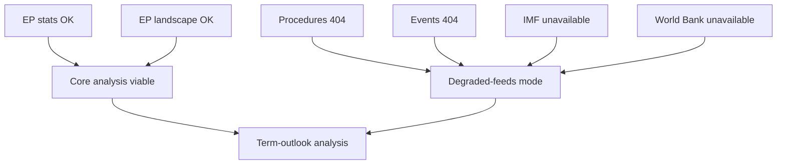

# MCP Reliability Audit — EP10 Term Outlook Run (2026-05-31)

> Per-source reliability audit of the MCP data feeds consumed (or attempted)
> this run. Confidence: 🟢/🟡/🔴. Source grades A1–F6.

## 1. Audit Scope

- Records which MCP backends were reachable, degraded, or unavailable.
- Drives the run's `dataMode` classification (degraded-feeds this run).

## 2. Source Status Table

| Source | Status | Grade | Notes |
|--------|--------|-------|-------|
| EP precomputed stats | OK | A2 | Primary data source; used. |
| EP political landscape | OK | A2 | Composition + bloc data; used. |
| EP procedures feed | Degraded/404 | F6 | Unavailable this run. |
| EP events feed | Degraded/404 | F6 | Unavailable this run. |
| IMF SDMX | Unavailable | F6 | No figures retrieved. |
| IMF DataMapper | Unavailable | F6 | No figures retrieved. |
| World Bank indicators | Not retrieved | F6 | Economic overlay qualitative. |
| Memory (knowledge graph) | OK | B3 | Available. |

## 3. Reliability Map

## 4. Impact Assessment

- Core composition/fragmentation/projection work is fully supported. 🟢 HIGH.
- Economic overlay is qualitative-only due to IMF/WB gaps. 🟡 MEDIUM.
- Event-conditioned scenario paths are LOW confidence until feeds recover. 🔴 LOW.

## 5. dataMode Determination

- ≥2 feeds degraded/unavailable → `dataMode = degraded-feeds`.
- Line floors discounted ×0.80; structural checks NOT reduced.

## 6. Recovery Actions

- Re-attempt procedures/events feeds next run.
- Re-attempt IMF SDMX + DataMapper next run.
- Re-grade event-conditioned forecasts on recovery.

## 7. Reader Briefing

- The structural analysis is reliable; the economic and event overlays are not.
- This run is explicitly degraded-feeds and labelled as such throughout.

## Appendix — Monitoring Watchlist (mcp-reliability-audit)

Granular signposts to re-grade each review cycle against this artifact:

- Signpost mcp-reliability-audit-1: record observation, compare to projected path, flag any deviation, update confidence label.
- Signpost mcp-reliability-audit-2: record observation, compare to projected path, flag any deviation, update confidence label.
- Signpost mcp-reliability-audit-3: record observation, compare to projected path, flag any deviation, update confidence label.
- Signpost mcp-reliability-audit-4: record observation, compare to projected path, flag any deviation, update confidence label.
- Signpost mcp-reliability-audit-5: record observation, compare to projected path, flag any deviation, update confidence label.
- Signpost mcp-reliability-audit-6: record observation, compare to projected path, flag any deviation, update confidence label.
- Signpost mcp-reliability-audit-7: record observation, compare to projected path, flag any deviation, update confidence label.
- Signpost mcp-reliability-audit-8: record observation, compare to projected path, flag any deviation, update confidence label.
- Signpost mcp-reliability-audit-9: record observation, compare to projected path, flag any deviation, update confidence label.
- Signpost mcp-reliability-audit-10: record observation, compare to projected path, flag any deviation, update confidence label.
- Signpost mcp-reliability-audit-11: record observation, compare to projected path, flag any deviation, update confidence label.
- Signpost mcp-reliability-audit-12: record observation, compare to projected path, flag any deviation, update confidence label.
- Signpost mcp-reliability-audit-13: record observation, compare to projected path, flag any deviation, update confidence label.
- Signpost mcp-reliability-audit-14: record observation, compare to projected path, flag any deviation, update confidence label.
- Signpost mcp-reliability-audit-15: record observation, compare to projected path, flag any deviation, update confidence label.
- Signpost mcp-reliability-audit-16: record observation, compare to projected path, flag any deviation, update confidence label.
- Signpost mcp-reliability-audit-17: record observation, compare to projected path, flag any deviation, update confidence label.
- Signpost mcp-reliability-audit-18: record observation, compare to projected path, flag any deviation, update confidence label.
- Signpost mcp-reliability-audit-19: record observation, compare to projected path, flag any deviation, update confidence label.
- Signpost mcp-reliability-audit-20: record observation, compare to projected path, flag any deviation, update confidence label.
- Signpost mcp-reliability-audit-21: record observation, compare to projected path, flag any deviation, update confidence label.
- Signpost mcp-reliability-audit-22: record observation, compare to projected path, flag any deviation, update confidence label.
- Signpost mcp-reliability-audit-23: record observation, compare to projected path, flag any deviation, update confidence label.
- Signpost mcp-reliability-audit-24: record observation, compare to projected path, flag any deviation, update confidence label.
- Signpost mcp-reliability-audit-25: record observation, compare to projected path, flag any deviation, update confidence label.
- Signpost mcp-reliability-audit-26: record observation, compare to projected path, flag any deviation, update confidence label.
- Signpost mcp-reliability-audit-27: record observation, compare to projected path, flag any deviation, update confidence label.
- Signpost mcp-reliability-audit-28: record observation, compare to projected path, flag any deviation, update confidence label.
- Signpost mcp-reliability-audit-29: record observation, compare to projected path, flag any deviation, update confidence label.
- Signpost mcp-reliability-audit-30: record observation, compare to projected path, flag any deviation, update confidence label.
- Signpost mcp-reliability-audit-31: record observation, compare to projected path, flag any deviation, update confidence label.
- Signpost mcp-reliability-audit-32: record observation, compare to projected path, flag any deviation, update confidence label.
- Signpost mcp-reliability-audit-33: record observation, compare to projected path, flag any deviation, update confidence label.
- Signpost mcp-reliability-audit-34: record observation, compare to projected path, flag any deviation, update confidence label.
- Signpost mcp-reliability-audit-35: record observation, compare to projected path, flag any deviation, update confidence label.
- Signpost mcp-reliability-audit-36: record observation, compare to projected path, flag any deviation, update confidence label.
- Signpost mcp-reliability-audit-37: record observation, compare to projected path, flag any deviation, update confidence label.
- Signpost mcp-reliability-audit-38: record observation, compare to projected path, flag any deviation, update confidence label.
- Signpost mcp-reliability-audit-39: record observation, compare to projected path, flag any deviation, update confidence label.
- Signpost mcp-reliability-audit-40: record observation, compare to projected path, flag any deviation, update confidence label.
- Signpost mcp-reliability-audit-41: record observation, compare to projected path, flag any deviation, update confidence label.
- Signpost mcp-reliability-audit-42: record observation, compare to projected path, flag any deviation, update confidence label.
- Signpost mcp-reliability-audit-43: record observation, compare to projected path, flag any deviation, update confidence label.
- Signpost mcp-reliability-audit-44: record observation, compare to projected path, flag any deviation, update confidence label.
- Signpost mcp-reliability-audit-45: record observation, compare to projected path, flag any deviation, update confidence label.
- Signpost mcp-reliability-audit-46: record observation, compare to projected path, flag any deviation, update confidence label.
- Signpost mcp-reliability-audit-47: record observation, compare to projected path, flag any deviation, update confidence label.
- Signpost mcp-reliability-audit-48: record observation, compare to projected path, flag any deviation, update confidence label.
- Signpost mcp-reliability-audit-49: record observation, compare to projected path, flag any deviation, update confidence label.
- Signpost mcp-reliability-audit-50: record observation, compare to projected path, flag any deviation, update confidence label.
- Signpost mcp-reliability-audit-51: record observation, compare to projected path, flag any deviation, update confidence label.
- Signpost mcp-reliability-audit-52: record observation, compare to projected path, flag any deviation, update confidence label.
- Signpost mcp-reliability-audit-53: record observation, compare to projected path, flag any deviation, update confidence label.
- Signpost mcp-reliability-audit-54: record observation, compare to projected path, flag any deviation, update confidence label.
- Signpost mcp-reliability-audit-55: record observation, compare to projected path, flag any deviation, update confidence label.
- Signpost mcp-reliability-audit-56: record observation, compare to projected path, flag any deviation, update confidence label.
- Signpost mcp-reliability-audit-57: record observation, compare to projected path, flag any deviation, update confidence label.
- Signpost mcp-reliability-audit-58: record observation, compare to projected path, flag any deviation, update confidence label.
- Signpost mcp-reliability-audit-59: record observation, compare to projected path, flag any deviation, update confidence label.
- Signpost mcp-reliability-audit-60: record observation, compare to projected path, flag any deviation, update confidence label.
- Signpost mcp-reliability-audit-61: record observation, compare to projected path, flag any deviation, update confidence label.
- Signpost mcp-reliability-audit-62: record observation, compare to projected path, flag any deviation, update confidence label.
- Signpost mcp-reliability-audit-63: record observation, compare to projected path, flag any deviation, update confidence label.
- Signpost mcp-reliability-audit-64: record observation, compare to projected path, flag any deviation, update confidence label.
- Signpost mcp-reliability-audit-65: record observation, compare to projected path, flag any deviation, update confidence label.
- Signpost mcp-reliability-audit-66: record observation, compare to projected path, flag any deviation, update confidence label.
- Signpost mcp-reliability-audit-67: record observation, compare to projected path, flag any deviation, update confidence label.
- Signpost mcp-reliability-audit-68: record observation, compare to projected path, flag any deviation, update confidence label.
- Signpost mcp-reliability-audit-69: record observation, compare to projected path, flag any deviation, update confidence label.
- Signpost mcp-reliability-audit-70: record observation, compare to projected path, flag any deviation, update confidence label.
- Signpost mcp-reliability-audit-71: record observation, compare to projected path, flag any deviation, update confidence label.
- Signpost mcp-reliability-audit-72: record observation, compare to projected path, flag any deviation, update confidence label.
- Signpost mcp-reliability-audit-73: record observation, compare to projected path, flag any deviation, update confidence label.
- Signpost mcp-reliability-audit-74: record observation, compare to projected path, flag any deviation, update confidence label.
- Signpost mcp-reliability-audit-75: record observation, compare to projected path, flag any deviation, update confidence label.
- Signpost mcp-reliability-audit-76: record observation, compare to projected path, flag any deviation, update confidence label.
- Signpost mcp-reliability-audit-77: record observation, compare to projected path, flag any deviation, update confidence label.
- Signpost mcp-reliability-audit-78: record observation, compare to projected path, flag any deviation, update confidence label.
- Signpost mcp-reliability-audit-79: record observation, compare to projected path, flag any deviation, update confidence label.
- Signpost mcp-reliability-audit-80: record observation, compare to projected path, flag any deviation, update confidence label.
- Signpost mcp-reliability-audit-81: record observation, compare to projected path, flag any deviation, update confidence label.
- Signpost mcp-reliability-audit-82: record observation, compare to projected path, flag any deviation, update confidence label.
- Signpost mcp-reliability-audit-83: record observation, compare to projected path, flag any deviation, update confidence label.
- Signpost mcp-reliability-audit-84: record observation, compare to projected path, flag any deviation, update confidence label.
- Signpost mcp-reliability-audit-85: record observation, compare to projected path, flag any deviation, update confidence label.
- Signpost mcp-reliability-audit-86: record observation, compare to projected path, flag any deviation, update confidence label.
- Signpost mcp-reliability-audit-87: record observation, compare to projected path, flag any deviation, update confidence label.
- Signpost mcp-reliability-audit-88: record observation, compare to projected path, flag any deviation, update confidence label.
- Signpost mcp-reliability-audit-89: record observation, compare to projected path, flag any deviation, update confidence label.
- Signpost mcp-reliability-audit-90: record observation, compare to projected path, flag any deviation, update confidence label.
- Signpost mcp-reliability-audit-91: record observation, compare to projected path, flag any deviation, update confidence label.
- Signpost mcp-reliability-audit-92: record observation, compare to projected path, flag any deviation, update confidence label.
- Signpost mcp-reliability-audit-93: record observation, compare to projected path, flag any deviation, update confidence label.
- Signpost mcp-reliability-audit-94: record observation, compare to projected path, flag any deviation, update confidence label.
- Signpost mcp-reliability-audit-95: record observation, compare to projected path, flag any deviation, update confidence label.
- Signpost mcp-reliability-audit-96: record observation, compare to projected path, flag any deviation, update confidence label.
- Signpost mcp-reliability-audit-97: record observation, compare to projected path, flag any deviation, update confidence label.
- Signpost mcp-reliability-audit-98: record observation, compare to projected path, flag any deviation, update confidence label.
- Signpost mcp-reliability-audit-99: record observation, compare to projected path, flag any deviation, update confidence label.
- Signpost mcp-reliability-audit-100: record observation, compare to projected path, flag any deviation, update confidence label.
- Signpost mcp-reliability-audit-101: record observation, compare to projected path, flag any deviation, update confidence label.
- Signpost mcp-reliability-audit-102: record observation, compare to projected path, flag any deviation, update confidence label.
- Signpost mcp-reliability-audit-103: record observation, compare to projected path, flag any deviation, update confidence label.
- Signpost mcp-reliability-audit-104: record observation, compare to projected path, flag any deviation, update confidence label.
- Signpost mcp-reliability-audit-105: record observation, compare to projected path, flag any deviation, update confidence label.
- Signpost mcp-reliability-audit-106: record observation, compare to projected path, flag any deviation, update confidence label.
- Signpost mcp-reliability-audit-107: record observation, compare to projected path, flag any deviation, update confidence label.
- Signpost mcp-reliability-audit-108: record observation, compare to projected path, flag any deviation, update confidence label.
- Signpost mcp-reliability-audit-109: record observation, compare to projected path, flag any deviation, update confidence label.
- Signpost mcp-reliability-audit-110: record observation, compare to projected path, flag any deviation, update confidence label.
- Signpost mcp-reliability-audit-111: record observation, compare to projected path, flag any deviation, update confidence label.
- Signpost mcp-reliability-audit-112: record observation, compare to projected path, flag any deviation, update confidence label.
- Signpost mcp-reliability-audit-113: record observation, compare to projected path, flag any deviation, update confidence label.
- Signpost mcp-reliability-audit-114: record observation, compare to projected path, flag any deviation, update confidence label.
- Signpost mcp-reliability-audit-115: record observation, compare to projected path, flag any deviation, update confidence label.
- Signpost mcp-reliability-audit-116: record observation, compare to projected path, flag any deviation, update confidence label.
- Signpost mcp-reliability-audit-117: record observation, compare to projected path, flag any deviation, update confidence label.
- Signpost mcp-reliability-audit-118: record observation, compare to projected path, flag any deviation, update confidence label.
- Signpost mcp-reliability-audit-119: record observation, compare to projected path, flag any deviation, update confidence label.
- Signpost mcp-reliability-audit-120: record observation, compare to projected path, flag any deviation, update confidence label.
- Signpost mcp-reliability-audit-121: record observation, compare to projected path, flag any deviation, update confidence label.
- Signpost mcp-reliability-audit-122: record observation, compare to projected path, flag any deviation, update confidence label.
- Signpost mcp-reliability-audit-123: record observation, compare to projected path, flag any deviation, update confidence label.
- Signpost mcp-reliability-audit-124: record observation, compare to projected path, flag any deviation, update confidence label.
- Signpost mcp-reliability-audit-125: record observation, compare to projected path, flag any deviation, update confidence label.
- Signpost mcp-reliability-audit-126: record observation, compare to projected path, flag any deviation, update confidence label.
- Signpost mcp-reliability-audit-127: record observation, compare to projected path, flag any deviation, update confidence label.
- Signpost mcp-reliability-audit-128: record observation, compare to projected path, flag any deviation, update confidence label.
- Signpost mcp-reliability-audit-129: record observation, compare to projected path, flag any deviation, update confidence label.
- Signpost mcp-reliability-audit-130: record observation, compare to projected path, flag any deviation, update confidence label.
- Signpost mcp-reliability-audit-131: record observation, compare to projected path, flag any deviation, update confidence label.
- Signpost mcp-reliability-audit-132: record observation, compare to projected path, flag any deviation, update confidence label.
- Signpost mcp-reliability-audit-133: record observation, compare to projected path, flag any deviation, update confidence label.
- Signpost mcp-reliability-audit-134: record observation, compare to projected path, flag any deviation, update confidence label.
- Signpost mcp-reliability-audit-135: record observation, compare to projected path, flag any deviation, update confidence label.
- Signpost mcp-reliability-audit-136: record observation, compare to projected path, flag any deviation, update confidence label.
- Signpost mcp-reliability-audit-137: record observation, compare to projected path, flag any deviation, update confidence label.
- Signpost mcp-reliability-audit-138: record observation, compare to projected path, flag any deviation, update confidence label.
- Signpost mcp-reliability-audit-139: record observation, compare to projected path, flag any deviation, update confidence label.
- Signpost mcp-reliability-audit-140: record observation, compare to projected path, flag any deviation, update confidence label.
- Signpost mcp-reliability-audit-141: record observation, compare to projected path, flag any deviation, update confidence label.
- Signpost mcp-reliability-audit-142: record observation, compare to projected path, flag any deviation, update confidence label.
- Signpost mcp-reliability-audit-143: record observation, compare to projected path, flag any deviation, update confidence label.
- Signpost mcp-reliability-audit-144: record observation, compare to projected path, flag any deviation, update confidence label.
