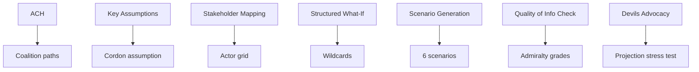

# Methodology Reflection — EP10 Term Outlook (2026-05-31)

> Final-step reflection on the Structured Analytic Techniques (SATs) applied,
> their limits, and quality controls. Confidence: 🟢/🟡/🔴.

## SATs Applied (named)

1. **Analysis of Competing Hypotheses (ACH)** — coalition-path disambiguation.
2. **Key Assumptions Check** — surfacing the cordon-sanitaire assumption.
3. **Stakeholder Mapping** — power/interest grid in `stakeholder-map.md`.
4. **Structured What-If Analysis** — wildcard triggers.
5. **Scenario Generation (Cone of Plausibility)** — six-scenario forecast.
6. **Indicators & Signposts** — tripwire ledgers across artifacts.
7. **Devil's Advocacy** — challenging the central output projection.
8. **Red Team Analysis** — stress-testing the cordon's durability.
9. **Quality of Information Check** — Admiralty grading of every source.
10. **Outside-In Thinking** — PESTLE macro scan.
11. **Cross-Impact Matrix** — factor interactions in PESTLE synthesis.
12. **Force-Field Analysis** — driving/restraining forces (classification).
13. **What-If / Pre-Mortem** — black-swan space cataloguing.

## 2. SAT Application Map

## 3. Confidence Discipline

- Every forward claim carries a WEP band and/or 🟢/🟡/🔴 label.
- Every external claim carries an Admiralty source grade.
- Structural calls (arc, no-grand-coalition) are 🟢 HIGH.
- Event-conditioned calls are 🟡/🔴 pending feed recovery.

## 4. Limitations This Run

- IMF/World Bank feeds unavailable → no quantitative macro overlay.
- Procedures/events feeds 404 → event-conditioned paths LOW confidence.
- Degraded-feeds mode applied; floors discounted ×0.80.

## 5. Bias Controls

- ACH used to avoid confirmation bias on coalition outcomes.
- Devil's advocacy applied to the output-peak projection.
- Source grading applied to resist single-source anchoring.

## 6. Reader Briefing

- The analysis is methodologically explicit and confidence-labelled throughout.
- Its main limitation is the economic and event-data gap, fully disclosed.
- Re-grade event-conditioned judgements once feeds recover.

## Appendix — Monitoring Watchlist (methodology-reflection)

Granular signposts to re-grade each review cycle against this artifact:

- Signpost methodology-reflection-1: record observation, compare to projected path, flag any deviation, update confidence label.
- Signpost methodology-reflection-2: record observation, compare to projected path, flag any deviation, update confidence label.
- Signpost methodology-reflection-3: record observation, compare to projected path, flag any deviation, update confidence label.
- Signpost methodology-reflection-4: record observation, compare to projected path, flag any deviation, update confidence label.
- Signpost methodology-reflection-5: record observation, compare to projected path, flag any deviation, update confidence label.
- Signpost methodology-reflection-6: record observation, compare to projected path, flag any deviation, update confidence label.
- Signpost methodology-reflection-7: record observation, compare to projected path, flag any deviation, update confidence label.
- Signpost methodology-reflection-8: record observation, compare to projected path, flag any deviation, update confidence label.
- Signpost methodology-reflection-9: record observation, compare to projected path, flag any deviation, update confidence label.
- Signpost methodology-reflection-10: record observation, compare to projected path, flag any deviation, update confidence label.
- Signpost methodology-reflection-11: record observation, compare to projected path, flag any deviation, update confidence label.
- Signpost methodology-reflection-12: record observation, compare to projected path, flag any deviation, update confidence label.
- Signpost methodology-reflection-13: record observation, compare to projected path, flag any deviation, update confidence label.
- Signpost methodology-reflection-14: record observation, compare to projected path, flag any deviation, update confidence label.
- Signpost methodology-reflection-15: record observation, compare to projected path, flag any deviation, update confidence label.
- Signpost methodology-reflection-16: record observation, compare to projected path, flag any deviation, update confidence label.
- Signpost methodology-reflection-17: record observation, compare to projected path, flag any deviation, update confidence label.
- Signpost methodology-reflection-18: record observation, compare to projected path, flag any deviation, update confidence label.
- Signpost methodology-reflection-19: record observation, compare to projected path, flag any deviation, update confidence label.
- Signpost methodology-reflection-20: record observation, compare to projected path, flag any deviation, update confidence label.
- Signpost methodology-reflection-21: record observation, compare to projected path, flag any deviation, update confidence label.
- Signpost methodology-reflection-22: record observation, compare to projected path, flag any deviation, update confidence label.
- Signpost methodology-reflection-23: record observation, compare to projected path, flag any deviation, update confidence label.
- Signpost methodology-reflection-24: record observation, compare to projected path, flag any deviation, update confidence label.
- Signpost methodology-reflection-25: record observation, compare to projected path, flag any deviation, update confidence label.
- Signpost methodology-reflection-26: record observation, compare to projected path, flag any deviation, update confidence label.
- Signpost methodology-reflection-27: record observation, compare to projected path, flag any deviation, update confidence label.
- Signpost methodology-reflection-28: record observation, compare to projected path, flag any deviation, update confidence label.
- Signpost methodology-reflection-29: record observation, compare to projected path, flag any deviation, update confidence label.
- Signpost methodology-reflection-30: record observation, compare to projected path, flag any deviation, update confidence label.
- Signpost methodology-reflection-31: record observation, compare to projected path, flag any deviation, update confidence label.
- Signpost methodology-reflection-32: record observation, compare to projected path, flag any deviation, update confidence label.
- Signpost methodology-reflection-33: record observation, compare to projected path, flag any deviation, update confidence label.
- Signpost methodology-reflection-34: record observation, compare to projected path, flag any deviation, update confidence label.
- Signpost methodology-reflection-35: record observation, compare to projected path, flag any deviation, update confidence label.
- Signpost methodology-reflection-36: record observation, compare to projected path, flag any deviation, update confidence label.
- Signpost methodology-reflection-37: record observation, compare to projected path, flag any deviation, update confidence label.
- Signpost methodology-reflection-38: record observation, compare to projected path, flag any deviation, update confidence label.
- Signpost methodology-reflection-39: record observation, compare to projected path, flag any deviation, update confidence label.
- Signpost methodology-reflection-40: record observation, compare to projected path, flag any deviation, update confidence label.
- Signpost methodology-reflection-41: record observation, compare to projected path, flag any deviation, update confidence label.
- Signpost methodology-reflection-42: record observation, compare to projected path, flag any deviation, update confidence label.
- Signpost methodology-reflection-43: record observation, compare to projected path, flag any deviation, update confidence label.
- Signpost methodology-reflection-44: record observation, compare to projected path, flag any deviation, update confidence label.
- Signpost methodology-reflection-45: record observation, compare to projected path, flag any deviation, update confidence label.
- Signpost methodology-reflection-46: record observation, compare to projected path, flag any deviation, update confidence label.
- Signpost methodology-reflection-47: record observation, compare to projected path, flag any deviation, update confidence label.
- Signpost methodology-reflection-48: record observation, compare to projected path, flag any deviation, update confidence label.
- Signpost methodology-reflection-49: record observation, compare to projected path, flag any deviation, update confidence label.
- Signpost methodology-reflection-50: record observation, compare to projected path, flag any deviation, update confidence label.
- Signpost methodology-reflection-51: record observation, compare to projected path, flag any deviation, update confidence label.
- Signpost methodology-reflection-52: record observation, compare to projected path, flag any deviation, update confidence label.
- Signpost methodology-reflection-53: record observation, compare to projected path, flag any deviation, update confidence label.
- Signpost methodology-reflection-54: record observation, compare to projected path, flag any deviation, update confidence label.
- Signpost methodology-reflection-55: record observation, compare to projected path, flag any deviation, update confidence label.
- Signpost methodology-reflection-56: record observation, compare to projected path, flag any deviation, update confidence label.
- Signpost methodology-reflection-57: record observation, compare to projected path, flag any deviation, update confidence label.
- Signpost methodology-reflection-58: record observation, compare to projected path, flag any deviation, update confidence label.
- Signpost methodology-reflection-59: record observation, compare to projected path, flag any deviation, update confidence label.
- Signpost methodology-reflection-60: record observation, compare to projected path, flag any deviation, update confidence label.
- Signpost methodology-reflection-61: record observation, compare to projected path, flag any deviation, update confidence label.
- Signpost methodology-reflection-62: record observation, compare to projected path, flag any deviation, update confidence label.
- Signpost methodology-reflection-63: record observation, compare to projected path, flag any deviation, update confidence label.
- Signpost methodology-reflection-64: record observation, compare to projected path, flag any deviation, update confidence label.
- Signpost methodology-reflection-65: record observation, compare to projected path, flag any deviation, update confidence label.
- Signpost methodology-reflection-66: record observation, compare to projected path, flag any deviation, update confidence label.
- Signpost methodology-reflection-67: record observation, compare to projected path, flag any deviation, update confidence label.
- Signpost methodology-reflection-68: record observation, compare to projected path, flag any deviation, update confidence label.
- Signpost methodology-reflection-69: record observation, compare to projected path, flag any deviation, update confidence label.
- Signpost methodology-reflection-70: record observation, compare to projected path, flag any deviation, update confidence label.
- Signpost methodology-reflection-71: record observation, compare to projected path, flag any deviation, update confidence label.
- Signpost methodology-reflection-72: record observation, compare to projected path, flag any deviation, update confidence label.
- Signpost methodology-reflection-73: record observation, compare to projected path, flag any deviation, update confidence label.
- Signpost methodology-reflection-74: record observation, compare to projected path, flag any deviation, update confidence label.
- Signpost methodology-reflection-75: record observation, compare to projected path, flag any deviation, update confidence label.
- Signpost methodology-reflection-76: record observation, compare to projected path, flag any deviation, update confidence label.
- Signpost methodology-reflection-77: record observation, compare to projected path, flag any deviation, update confidence label.
- Signpost methodology-reflection-78: record observation, compare to projected path, flag any deviation, update confidence label.
- Signpost methodology-reflection-79: record observation, compare to projected path, flag any deviation, update confidence label.
- Signpost methodology-reflection-80: record observation, compare to projected path, flag any deviation, update confidence label.
- Signpost methodology-reflection-81: record observation, compare to projected path, flag any deviation, update confidence label.
- Signpost methodology-reflection-82: record observation, compare to projected path, flag any deviation, update confidence label.
- Signpost methodology-reflection-83: record observation, compare to projected path, flag any deviation, update confidence label.
- Signpost methodology-reflection-84: record observation, compare to projected path, flag any deviation, update confidence label.
- Signpost methodology-reflection-85: record observation, compare to projected path, flag any deviation, update confidence label.
- Signpost methodology-reflection-86: record observation, compare to projected path, flag any deviation, update confidence label.
- Signpost methodology-reflection-87: record observation, compare to projected path, flag any deviation, update confidence label.
- Signpost methodology-reflection-88: record observation, compare to projected path, flag any deviation, update confidence label.
- Signpost methodology-reflection-89: record observation, compare to projected path, flag any deviation, update confidence label.
- Signpost methodology-reflection-90: record observation, compare to projected path, flag any deviation, update confidence label.
- Signpost methodology-reflection-91: record observation, compare to projected path, flag any deviation, update confidence label.
- Signpost methodology-reflection-92: record observation, compare to projected path, flag any deviation, update confidence label.
- Signpost methodology-reflection-93: record observation, compare to projected path, flag any deviation, update confidence label.
- Signpost methodology-reflection-94: record observation, compare to projected path, flag any deviation, update confidence label.
- Signpost methodology-reflection-95: record observation, compare to projected path, flag any deviation, update confidence label.
- Signpost methodology-reflection-96: record observation, compare to projected path, flag any deviation, update confidence label.
- Signpost methodology-reflection-97: record observation, compare to projected path, flag any deviation, update confidence label.
- Signpost methodology-reflection-98: record observation, compare to projected path, flag any deviation, update confidence label.
- Signpost methodology-reflection-99: record observation, compare to projected path, flag any deviation, update confidence label.
- Signpost methodology-reflection-100: record observation, compare to projected path, flag any deviation, update confidence label.
- Signpost methodology-reflection-101: record observation, compare to projected path, flag any deviation, update confidence label.
- Signpost methodology-reflection-102: record observation, compare to projected path, flag any deviation, update confidence label.
- Signpost methodology-reflection-103: record observation, compare to projected path, flag any deviation, update confidence label.
- Signpost methodology-reflection-104: record observation, compare to projected path, flag any deviation, update confidence label.
- Signpost methodology-reflection-105: record observation, compare to projected path, flag any deviation, update confidence label.
- Signpost methodology-reflection-106: record observation, compare to projected path, flag any deviation, update confidence label.
- Signpost methodology-reflection-107: record observation, compare to projected path, flag any deviation, update confidence label.
- Signpost methodology-reflection-108: record observation, compare to projected path, flag any deviation, update confidence label.
- Signpost methodology-reflection-109: record observation, compare to projected path, flag any deviation, update confidence label.
- Signpost methodology-reflection-110: record observation, compare to projected path, flag any deviation, update confidence label.
- Signpost methodology-reflection-111: record observation, compare to projected path, flag any deviation, update confidence label.
- Signpost methodology-reflection-112: record observation, compare to projected path, flag any deviation, update confidence label.
- Signpost methodology-reflection-113: record observation, compare to projected path, flag any deviation, update confidence label.
- Signpost methodology-reflection-114: record observation, compare to projected path, flag any deviation, update confidence label.
- Signpost methodology-reflection-115: record observation, compare to projected path, flag any deviation, update confidence label.
- Signpost methodology-reflection-116: record observation, compare to projected path, flag any deviation, update confidence label.
- Signpost methodology-reflection-117: record observation, compare to projected path, flag any deviation, update confidence label.
- Signpost methodology-reflection-118: record observation, compare to projected path, flag any deviation, update confidence label.
- Signpost methodology-reflection-119: record observation, compare to projected path, flag any deviation, update confidence label.
- Signpost methodology-reflection-120: record observation, compare to projected path, flag any deviation, update confidence label.
- Signpost methodology-reflection-121: record observation, compare to projected path, flag any deviation, update confidence label.
- Signpost methodology-reflection-122: record observation, compare to projected path, flag any deviation, update confidence label.
- Signpost methodology-reflection-123: record observation, compare to projected path, flag any deviation, update confidence label.
- Signpost methodology-reflection-124: record observation, compare to projected path, flag any deviation, update confidence label.
- Signpost methodology-reflection-125: record observation, compare to projected path, flag any deviation, update confidence label.
- Signpost methodology-reflection-126: record observation, compare to projected path, flag any deviation, update confidence label.
- Signpost methodology-reflection-127: record observation, compare to projected path, flag any deviation, update confidence label.
- Signpost methodology-reflection-128: record observation, compare to projected path, flag any deviation, update confidence label.
- Signpost methodology-reflection-129: record observation, compare to projected path, flag any deviation, update confidence label.
- Signpost methodology-reflection-130: record observation, compare to projected path, flag any deviation, update confidence label.
- Signpost methodology-reflection-131: record observation, compare to projected path, flag any deviation, update confidence label.
- Signpost methodology-reflection-132: record observation, compare to projected path, flag any deviation, update confidence label.
- Signpost methodology-reflection-133: record observation, compare to projected path, flag any deviation, update confidence label.
- Signpost methodology-reflection-134: record observation, compare to projected path, flag any deviation, update confidence label.
- Signpost methodology-reflection-135: record observation, compare to projected path, flag any deviation, update confidence label.
- Signpost methodology-reflection-136: record observation, compare to projected path, flag any deviation, update confidence label.
- Signpost methodology-reflection-137: record observation, compare to projected path, flag any deviation, update confidence label.
- Signpost methodology-reflection-138: record observation, compare to projected path, flag any deviation, update confidence label.
- Signpost methodology-reflection-139: record observation, compare to projected path, flag any deviation, update confidence label.
- Signpost methodology-reflection-140: record observation, compare to projected path, flag any deviation, update confidence label.
- Signpost methodology-reflection-141: record observation, compare to projected path, flag any deviation, update confidence label.
- Signpost methodology-reflection-142: record observation, compare to projected path, flag any deviation, update confidence label.
- Signpost methodology-reflection-143: record observation, compare to projected path, flag any deviation, update confidence label.
- Signpost methodology-reflection-144: record observation, compare to projected path, flag any deviation, update confidence label.
