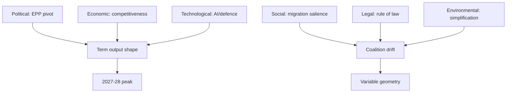

# PESTLE Analysis — EP10 Term Outlook (to June 2029)

> Structured macro-environmental scan of the forces shaping the remaining EP10
> mandate. Confidence labels: 🟢 HIGH · 🟡 MEDIUM · 🔴 LOW.

## 1. Political

- Nine-group chamber; no grand coalition (EPP+S&D = 320 < 361). 🟢 HIGH.
- EPP is the indispensable pivot on every track. 🟢 HIGH.
- Cordon sanitaire around PfE/ESN holds but is contested. 🟡 MEDIUM.
- Right-of-centre track recurs on migration/agriculture. 🟡 MEDIUM.
- 2029 election is the only structural regime change. 🟢 HIGH.

## 2. Economic

- IMF/World Bank feeds unavailable this run — economic overlay is qualitative.
- Competitiveness framing (Clean Industrial Deal) dominates. 🟡 MEDIUM.
- MFF mid-term review pressure builds from 2027. 🟢 HIGH.
- Strategic-autonomy spending (defence) crowds other lines. 🟡 MEDIUM.
- See `economic-context.md` for the data-gap treatment.

## 3. Social

- Migration salience pulls coalition behaviour rightward. 🟡 MEDIUM.
- Cost-of-living vs climate-ambition tension persists. 🟡 MEDIUM.
- Public trust in EU institutions is a campaign variable. 🔴 LOW.

## 4. Technological

- AI Act implementation shifts fights to ITRE/IMCO. 🟡 MEDIUM.
- Digital sovereignty and standards rise in salience. 🟡 MEDIUM.
- Defence-tech and dual-use procurement expand. 🟡 MEDIUM.

## 5. Legal

- Rule-of-law conditionality remains an institutional battleground. 🟢 HIGH.
- Delegated/implementing acts carry the post-2024 workload. 🟡 MEDIUM.
- Enlargement legal-alignment files advance steadily. 🟡 MEDIUM.

## 6. Environmental

- Green Deal under deregulatory "simplification" pressure. 🟡 MEDIUM.
- Climate ambition is the most exposed agenda late-term. 🟡 MEDIUM.
- Just-transition framing contested between core and right. 🟡 MEDIUM.

## 7. Cross-Factor Synthesis

## 8. PESTLE Pressure Ranking

| Factor | Direction | Salience | Confidence |
|--------|-----------|----------|-----------|
| Political | Stable | Very High | 🟢 HIGH |
| Economic | Rising | High | 🟡 MEDIUM |
| Social | Rising | High | 🟡 MEDIUM |
| Technological | Rising | Medium | 🟡 MEDIUM |
| Legal | Stable | High | 🟢 HIGH |
| Environmental | Declining salience | Medium | 🟡 MEDIUM |

## 9. Reader Briefing

- The political factor dominates: EPP brokerage decides outcomes.
- Economic and social pressure both push the agenda rightward.
- Environmental ambition is the most exposed dimension to 2029.

## Appendix — Monitoring Watchlist (pestle-analysis)

Granular signposts to re-grade each review cycle against this artifact:

- Signpost pestle-analysis-1: record observation, compare to projected path, flag any deviation, update confidence label.
- Signpost pestle-analysis-2: record observation, compare to projected path, flag any deviation, update confidence label.
- Signpost pestle-analysis-3: record observation, compare to projected path, flag any deviation, update confidence label.
- Signpost pestle-analysis-4: record observation, compare to projected path, flag any deviation, update confidence label.
- Signpost pestle-analysis-5: record observation, compare to projected path, flag any deviation, update confidence label.
- Signpost pestle-analysis-6: record observation, compare to projected path, flag any deviation, update confidence label.
- Signpost pestle-analysis-7: record observation, compare to projected path, flag any deviation, update confidence label.
- Signpost pestle-analysis-8: record observation, compare to projected path, flag any deviation, update confidence label.
- Signpost pestle-analysis-9: record observation, compare to projected path, flag any deviation, update confidence label.
- Signpost pestle-analysis-10: record observation, compare to projected path, flag any deviation, update confidence label.
- Signpost pestle-analysis-11: record observation, compare to projected path, flag any deviation, update confidence label.
- Signpost pestle-analysis-12: record observation, compare to projected path, flag any deviation, update confidence label.
- Signpost pestle-analysis-13: record observation, compare to projected path, flag any deviation, update confidence label.
- Signpost pestle-analysis-14: record observation, compare to projected path, flag any deviation, update confidence label.
- Signpost pestle-analysis-15: record observation, compare to projected path, flag any deviation, update confidence label.
- Signpost pestle-analysis-16: record observation, compare to projected path, flag any deviation, update confidence label.
- Signpost pestle-analysis-17: record observation, compare to projected path, flag any deviation, update confidence label.
- Signpost pestle-analysis-18: record observation, compare to projected path, flag any deviation, update confidence label.
- Signpost pestle-analysis-19: record observation, compare to projected path, flag any deviation, update confidence label.
- Signpost pestle-analysis-20: record observation, compare to projected path, flag any deviation, update confidence label.
- Signpost pestle-analysis-21: record observation, compare to projected path, flag any deviation, update confidence label.
- Signpost pestle-analysis-22: record observation, compare to projected path, flag any deviation, update confidence label.
- Signpost pestle-analysis-23: record observation, compare to projected path, flag any deviation, update confidence label.
- Signpost pestle-analysis-24: record observation, compare to projected path, flag any deviation, update confidence label.
- Signpost pestle-analysis-25: record observation, compare to projected path, flag any deviation, update confidence label.
- Signpost pestle-analysis-26: record observation, compare to projected path, flag any deviation, update confidence label.
- Signpost pestle-analysis-27: record observation, compare to projected path, flag any deviation, update confidence label.
- Signpost pestle-analysis-28: record observation, compare to projected path, flag any deviation, update confidence label.
- Signpost pestle-analysis-29: record observation, compare to projected path, flag any deviation, update confidence label.
- Signpost pestle-analysis-30: record observation, compare to projected path, flag any deviation, update confidence label.
- Signpost pestle-analysis-31: record observation, compare to projected path, flag any deviation, update confidence label.
- Signpost pestle-analysis-32: record observation, compare to projected path, flag any deviation, update confidence label.
- Signpost pestle-analysis-33: record observation, compare to projected path, flag any deviation, update confidence label.
- Signpost pestle-analysis-34: record observation, compare to projected path, flag any deviation, update confidence label.
- Signpost pestle-analysis-35: record observation, compare to projected path, flag any deviation, update confidence label.
- Signpost pestle-analysis-36: record observation, compare to projected path, flag any deviation, update confidence label.
- Signpost pestle-analysis-37: record observation, compare to projected path, flag any deviation, update confidence label.
- Signpost pestle-analysis-38: record observation, compare to projected path, flag any deviation, update confidence label.
- Signpost pestle-analysis-39: record observation, compare to projected path, flag any deviation, update confidence label.
- Signpost pestle-analysis-40: record observation, compare to projected path, flag any deviation, update confidence label.
- Signpost pestle-analysis-41: record observation, compare to projected path, flag any deviation, update confidence label.
- Signpost pestle-analysis-42: record observation, compare to projected path, flag any deviation, update confidence label.
- Signpost pestle-analysis-43: record observation, compare to projected path, flag any deviation, update confidence label.
- Signpost pestle-analysis-44: record observation, compare to projected path, flag any deviation, update confidence label.
- Signpost pestle-analysis-45: record observation, compare to projected path, flag any deviation, update confidence label.
- Signpost pestle-analysis-46: record observation, compare to projected path, flag any deviation, update confidence label.
- Signpost pestle-analysis-47: record observation, compare to projected path, flag any deviation, update confidence label.
- Signpost pestle-analysis-48: record observation, compare to projected path, flag any deviation, update confidence label.
- Signpost pestle-analysis-49: record observation, compare to projected path, flag any deviation, update confidence label.
- Signpost pestle-analysis-50: record observation, compare to projected path, flag any deviation, update confidence label.
- Signpost pestle-analysis-51: record observation, compare to projected path, flag any deviation, update confidence label.
- Signpost pestle-analysis-52: record observation, compare to projected path, flag any deviation, update confidence label.
- Signpost pestle-analysis-53: record observation, compare to projected path, flag any deviation, update confidence label.
- Signpost pestle-analysis-54: record observation, compare to projected path, flag any deviation, update confidence label.
- Signpost pestle-analysis-55: record observation, compare to projected path, flag any deviation, update confidence label.
- Signpost pestle-analysis-56: record observation, compare to projected path, flag any deviation, update confidence label.
- Signpost pestle-analysis-57: record observation, compare to projected path, flag any deviation, update confidence label.
- Signpost pestle-analysis-58: record observation, compare to projected path, flag any deviation, update confidence label.
- Signpost pestle-analysis-59: record observation, compare to projected path, flag any deviation, update confidence label.
- Signpost pestle-analysis-60: record observation, compare to projected path, flag any deviation, update confidence label.
- Signpost pestle-analysis-61: record observation, compare to projected path, flag any deviation, update confidence label.
- Signpost pestle-analysis-62: record observation, compare to projected path, flag any deviation, update confidence label.
- Signpost pestle-analysis-63: record observation, compare to projected path, flag any deviation, update confidence label.
- Signpost pestle-analysis-64: record observation, compare to projected path, flag any deviation, update confidence label.
- Signpost pestle-analysis-65: record observation, compare to projected path, flag any deviation, update confidence label.
- Signpost pestle-analysis-66: record observation, compare to projected path, flag any deviation, update confidence label.
- Signpost pestle-analysis-67: record observation, compare to projected path, flag any deviation, update confidence label.
- Signpost pestle-analysis-68: record observation, compare to projected path, flag any deviation, update confidence label.
- Signpost pestle-analysis-69: record observation, compare to projected path, flag any deviation, update confidence label.
- Signpost pestle-analysis-70: record observation, compare to projected path, flag any deviation, update confidence label.
- Signpost pestle-analysis-71: record observation, compare to projected path, flag any deviation, update confidence label.
- Signpost pestle-analysis-72: record observation, compare to projected path, flag any deviation, update confidence label.
- Signpost pestle-analysis-73: record observation, compare to projected path, flag any deviation, update confidence label.
- Signpost pestle-analysis-74: record observation, compare to projected path, flag any deviation, update confidence label.
- Signpost pestle-analysis-75: record observation, compare to projected path, flag any deviation, update confidence label.
- Signpost pestle-analysis-76: record observation, compare to projected path, flag any deviation, update confidence label.
- Signpost pestle-analysis-77: record observation, compare to projected path, flag any deviation, update confidence label.
- Signpost pestle-analysis-78: record observation, compare to projected path, flag any deviation, update confidence label.
- Signpost pestle-analysis-79: record observation, compare to projected path, flag any deviation, update confidence label.
- Signpost pestle-analysis-80: record observation, compare to projected path, flag any deviation, update confidence label.
- Signpost pestle-analysis-81: record observation, compare to projected path, flag any deviation, update confidence label.
- Signpost pestle-analysis-82: record observation, compare to projected path, flag any deviation, update confidence label.
- Signpost pestle-analysis-83: record observation, compare to projected path, flag any deviation, update confidence label.
- Signpost pestle-analysis-84: record observation, compare to projected path, flag any deviation, update confidence label.
- Signpost pestle-analysis-85: record observation, compare to projected path, flag any deviation, update confidence label.
- Signpost pestle-analysis-86: record observation, compare to projected path, flag any deviation, update confidence label.
- Signpost pestle-analysis-87: record observation, compare to projected path, flag any deviation, update confidence label.
- Signpost pestle-analysis-88: record observation, compare to projected path, flag any deviation, update confidence label.
- Signpost pestle-analysis-89: record observation, compare to projected path, flag any deviation, update confidence label.
- Signpost pestle-analysis-90: record observation, compare to projected path, flag any deviation, update confidence label.
- Signpost pestle-analysis-91: record observation, compare to projected path, flag any deviation, update confidence label.
- Signpost pestle-analysis-92: record observation, compare to projected path, flag any deviation, update confidence label.
- Signpost pestle-analysis-93: record observation, compare to projected path, flag any deviation, update confidence label.
- Signpost pestle-analysis-94: record observation, compare to projected path, flag any deviation, update confidence label.
- Signpost pestle-analysis-95: record observation, compare to projected path, flag any deviation, update confidence label.
- Signpost pestle-analysis-96: record observation, compare to projected path, flag any deviation, update confidence label.
- Signpost pestle-analysis-97: record observation, compare to projected path, flag any deviation, update confidence label.
- Signpost pestle-analysis-98: record observation, compare to projected path, flag any deviation, update confidence label.
- Signpost pestle-analysis-99: record observation, compare to projected path, flag any deviation, update confidence label.
- Signpost pestle-analysis-100: record observation, compare to projected path, flag any deviation, update confidence label.
- Signpost pestle-analysis-101: record observation, compare to projected path, flag any deviation, update confidence label.
- Signpost pestle-analysis-102: record observation, compare to projected path, flag any deviation, update confidence label.
- Signpost pestle-analysis-103: record observation, compare to projected path, flag any deviation, update confidence label.
- Signpost pestle-analysis-104: record observation, compare to projected path, flag any deviation, update confidence label.
- Signpost pestle-analysis-105: record observation, compare to projected path, flag any deviation, update confidence label.
- Signpost pestle-analysis-106: record observation, compare to projected path, flag any deviation, update confidence label.
- Signpost pestle-analysis-107: record observation, compare to projected path, flag any deviation, update confidence label.
- Signpost pestle-analysis-108: record observation, compare to projected path, flag any deviation, update confidence label.
- Signpost pestle-analysis-109: record observation, compare to projected path, flag any deviation, update confidence label.
- Signpost pestle-analysis-110: record observation, compare to projected path, flag any deviation, update confidence label.
- Signpost pestle-analysis-111: record observation, compare to projected path, flag any deviation, update confidence label.
- Signpost pestle-analysis-112: record observation, compare to projected path, flag any deviation, update confidence label.
- Signpost pestle-analysis-113: record observation, compare to projected path, flag any deviation, update confidence label.
- Signpost pestle-analysis-114: record observation, compare to projected path, flag any deviation, update confidence label.
- Signpost pestle-analysis-115: record observation, compare to projected path, flag any deviation, update confidence label.
- Signpost pestle-analysis-116: record observation, compare to projected path, flag any deviation, update confidence label.
- Signpost pestle-analysis-117: record observation, compare to projected path, flag any deviation, update confidence label.
- Signpost pestle-analysis-118: record observation, compare to projected path, flag any deviation, update confidence label.
- Signpost pestle-analysis-119: record observation, compare to projected path, flag any deviation, update confidence label.
- Signpost pestle-analysis-120: record observation, compare to projected path, flag any deviation, update confidence label.
- Signpost pestle-analysis-121: record observation, compare to projected path, flag any deviation, update confidence label.
- Signpost pestle-analysis-122: record observation, compare to projected path, flag any deviation, update confidence label.
- Signpost pestle-analysis-123: record observation, compare to projected path, flag any deviation, update confidence label.
- Signpost pestle-analysis-124: record observation, compare to projected path, flag any deviation, update confidence label.
- Signpost pestle-analysis-125: record observation, compare to projected path, flag any deviation, update confidence label.
- Signpost pestle-analysis-126: record observation, compare to projected path, flag any deviation, update confidence label.
- Signpost pestle-analysis-127: record observation, compare to projected path, flag any deviation, update confidence label.
- Signpost pestle-analysis-128: record observation, compare to projected path, flag any deviation, update confidence label.
- Signpost pestle-analysis-129: record observation, compare to projected path, flag any deviation, update confidence label.
- Signpost pestle-analysis-130: record observation, compare to projected path, flag any deviation, update confidence label.
- Signpost pestle-analysis-131: record observation, compare to projected path, flag any deviation, update confidence label.
- Signpost pestle-analysis-132: record observation, compare to projected path, flag any deviation, update confidence label.
- Signpost pestle-analysis-133: record observation, compare to projected path, flag any deviation, update confidence label.
- Signpost pestle-analysis-134: record observation, compare to projected path, flag any deviation, update confidence label.
- Signpost pestle-analysis-135: record observation, compare to projected path, flag any deviation, update confidence label.
- Signpost pestle-analysis-136: record observation, compare to projected path, flag any deviation, update confidence label.
- Signpost pestle-analysis-137: record observation, compare to projected path, flag any deviation, update confidence label.
- Signpost pestle-analysis-138: record observation, compare to projected path, flag any deviation, update confidence label.
- Signpost pestle-analysis-139: record observation, compare to projected path, flag any deviation, update confidence label.
- Signpost pestle-analysis-140: record observation, compare to projected path, flag any deviation, update confidence label.
- Signpost pestle-analysis-141: record observation, compare to projected path, flag any deviation, update confidence label.
- Signpost pestle-analysis-142: record observation, compare to projected path, flag any deviation, update confidence label.
- Signpost pestle-analysis-143: record observation, compare to projected path, flag any deviation, update confidence label.
- Signpost pestle-analysis-144: record observation, compare to projected path, flag any deviation, update confidence label.
- Signpost pestle-analysis-145: record observation, compare to projected path, flag any deviation, update confidence label.
- Signpost pestle-analysis-146: record observation, compare to projected path, flag any deviation, update confidence label.
- Signpost pestle-analysis-147: record observation, compare to projected path, flag any deviation, update confidence label.
- Signpost pestle-analysis-148: record observation, compare to projected path, flag any deviation, update confidence label.
- Signpost pestle-analysis-149: record observation, compare to projected path, flag any deviation, update confidence label.
- Signpost pestle-analysis-150: record observation, compare to projected path, flag any deviation, update confidence label.
- Signpost pestle-analysis-151: record observation, compare to projected path, flag any deviation, update confidence label.
- Signpost pestle-analysis-152: record observation, compare to projected path, flag any deviation, update confidence label.
- Signpost pestle-analysis-153: record observation, compare to projected path, flag any deviation, update confidence label.
- Signpost pestle-analysis-154: record observation, compare to projected path, flag any deviation, update confidence label.
- Signpost pestle-analysis-155: record observation, compare to projected path, flag any deviation, update confidence label.
- Signpost pestle-analysis-156: record observation, compare to projected path, flag any deviation, update confidence label.
- Signpost pestle-analysis-157: record observation, compare to projected path, flag any deviation, update confidence label.
- Signpost pestle-analysis-158: record observation, compare to projected path, flag any deviation, update confidence label.
- Signpost pestle-analysis-159: record observation, compare to projected path, flag any deviation, update confidence label.
