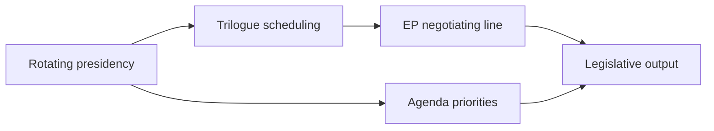

# Presidency Trio Context — EP10 Term Outlook (to June 2029)

> Council rotating-presidency context shaping the legislative tempo of the
> remaining mandate. Confidence: 🟢/🟡/🔴.

## 1. Why Presidencies Matter

- The rotating Council presidency sets trilogue tempo and file priorities.
- Trio programmes give ~18-month strategic continuity.
- EP delivery aligns with presidency agendas on shared priorities.

## 2. Tempo Mechanics

- Each presidency picks which trilogues to push. 🟡 MEDIUM.
- Defence/competitiveness files travel well across most presidencies. 🟡 MEDIUM.
- Climate-ambition files are presidency-sensitive. 🟡 MEDIUM.

## 3. Presidency–Parliament Interaction

## 4. Alignment with the Output Arc

- Presidency continuity supports the 2027–2028 delivery peak. 🟡 MEDIUM.
- Pre-election presidencies (2029) face a contracting pipeline. 🟢 HIGH.
- Trio programmes provide the cross-presidency throughline. 🟡 MEDIUM.

## 5. Watch Items

- Each incoming presidency's stated legislative priorities.
- Trilogue completion rates per presidency.
- Any presidency de-prioritising flagship EP files.

## 6. Data Note

- Specific presidency rotation detail is generic this run (procedures/events
  feeds unavailable). Re-attach concrete schedule on feed recovery. 🔴 LOW.

## 7. Reader Briefing

- Presidencies are the Council-side throttle on EP throughput.
- The 2027–2028 window benefits from presidency continuity on security.
- The 2029 presidencies inherit a campaign-shortened pipeline.

## Appendix — Monitoring Watchlist (presidency-trio-context)

Granular signposts to re-grade each review cycle against this artifact:

- Signpost presidency-trio-context-1: record observation, compare to projected path, flag any deviation, update confidence label.
- Signpost presidency-trio-context-2: record observation, compare to projected path, flag any deviation, update confidence label.
- Signpost presidency-trio-context-3: record observation, compare to projected path, flag any deviation, update confidence label.
- Signpost presidency-trio-context-4: record observation, compare to projected path, flag any deviation, update confidence label.
- Signpost presidency-trio-context-5: record observation, compare to projected path, flag any deviation, update confidence label.
- Signpost presidency-trio-context-6: record observation, compare to projected path, flag any deviation, update confidence label.
- Signpost presidency-trio-context-7: record observation, compare to projected path, flag any deviation, update confidence label.
- Signpost presidency-trio-context-8: record observation, compare to projected path, flag any deviation, update confidence label.
- Signpost presidency-trio-context-9: record observation, compare to projected path, flag any deviation, update confidence label.
- Signpost presidency-trio-context-10: record observation, compare to projected path, flag any deviation, update confidence label.
- Signpost presidency-trio-context-11: record observation, compare to projected path, flag any deviation, update confidence label.
- Signpost presidency-trio-context-12: record observation, compare to projected path, flag any deviation, update confidence label.
- Signpost presidency-trio-context-13: record observation, compare to projected path, flag any deviation, update confidence label.
- Signpost presidency-trio-context-14: record observation, compare to projected path, flag any deviation, update confidence label.
- Signpost presidency-trio-context-15: record observation, compare to projected path, flag any deviation, update confidence label.
- Signpost presidency-trio-context-16: record observation, compare to projected path, flag any deviation, update confidence label.
- Signpost presidency-trio-context-17: record observation, compare to projected path, flag any deviation, update confidence label.
- Signpost presidency-trio-context-18: record observation, compare to projected path, flag any deviation, update confidence label.
- Signpost presidency-trio-context-19: record observation, compare to projected path, flag any deviation, update confidence label.
- Signpost presidency-trio-context-20: record observation, compare to projected path, flag any deviation, update confidence label.
- Signpost presidency-trio-context-21: record observation, compare to projected path, flag any deviation, update confidence label.
- Signpost presidency-trio-context-22: record observation, compare to projected path, flag any deviation, update confidence label.
- Signpost presidency-trio-context-23: record observation, compare to projected path, flag any deviation, update confidence label.
- Signpost presidency-trio-context-24: record observation, compare to projected path, flag any deviation, update confidence label.
- Signpost presidency-trio-context-25: record observation, compare to projected path, flag any deviation, update confidence label.
- Signpost presidency-trio-context-26: record observation, compare to projected path, flag any deviation, update confidence label.
- Signpost presidency-trio-context-27: record observation, compare to projected path, flag any deviation, update confidence label.
- Signpost presidency-trio-context-28: record observation, compare to projected path, flag any deviation, update confidence label.
- Signpost presidency-trio-context-29: record observation, compare to projected path, flag any deviation, update confidence label.
- Signpost presidency-trio-context-30: record observation, compare to projected path, flag any deviation, update confidence label.
- Signpost presidency-trio-context-31: record observation, compare to projected path, flag any deviation, update confidence label.
- Signpost presidency-trio-context-32: record observation, compare to projected path, flag any deviation, update confidence label.
- Signpost presidency-trio-context-33: record observation, compare to projected path, flag any deviation, update confidence label.
- Signpost presidency-trio-context-34: record observation, compare to projected path, flag any deviation, update confidence label.
- Signpost presidency-trio-context-35: record observation, compare to projected path, flag any deviation, update confidence label.
- Signpost presidency-trio-context-36: record observation, compare to projected path, flag any deviation, update confidence label.
- Signpost presidency-trio-context-37: record observation, compare to projected path, flag any deviation, update confidence label.
- Signpost presidency-trio-context-38: record observation, compare to projected path, flag any deviation, update confidence label.
- Signpost presidency-trio-context-39: record observation, compare to projected path, flag any deviation, update confidence label.
- Signpost presidency-trio-context-40: record observation, compare to projected path, flag any deviation, update confidence label.
- Signpost presidency-trio-context-41: record observation, compare to projected path, flag any deviation, update confidence label.
- Signpost presidency-trio-context-42: record observation, compare to projected path, flag any deviation, update confidence label.
- Signpost presidency-trio-context-43: record observation, compare to projected path, flag any deviation, update confidence label.
- Signpost presidency-trio-context-44: record observation, compare to projected path, flag any deviation, update confidence label.
- Signpost presidency-trio-context-45: record observation, compare to projected path, flag any deviation, update confidence label.
- Signpost presidency-trio-context-46: record observation, compare to projected path, flag any deviation, update confidence label.
- Signpost presidency-trio-context-47: record observation, compare to projected path, flag any deviation, update confidence label.
- Signpost presidency-trio-context-48: record observation, compare to projected path, flag any deviation, update confidence label.
- Signpost presidency-trio-context-49: record observation, compare to projected path, flag any deviation, update confidence label.
- Signpost presidency-trio-context-50: record observation, compare to projected path, flag any deviation, update confidence label.
- Signpost presidency-trio-context-51: record observation, compare to projected path, flag any deviation, update confidence label.
- Signpost presidency-trio-context-52: record observation, compare to projected path, flag any deviation, update confidence label.
- Signpost presidency-trio-context-53: record observation, compare to projected path, flag any deviation, update confidence label.
- Signpost presidency-trio-context-54: record observation, compare to projected path, flag any deviation, update confidence label.
- Signpost presidency-trio-context-55: record observation, compare to projected path, flag any deviation, update confidence label.
- Signpost presidency-trio-context-56: record observation, compare to projected path, flag any deviation, update confidence label.
- Signpost presidency-trio-context-57: record observation, compare to projected path, flag any deviation, update confidence label.
- Signpost presidency-trio-context-58: record observation, compare to projected path, flag any deviation, update confidence label.
- Signpost presidency-trio-context-59: record observation, compare to projected path, flag any deviation, update confidence label.
- Signpost presidency-trio-context-60: record observation, compare to projected path, flag any deviation, update confidence label.
- Signpost presidency-trio-context-61: record observation, compare to projected path, flag any deviation, update confidence label.
- Signpost presidency-trio-context-62: record observation, compare to projected path, flag any deviation, update confidence label.
- Signpost presidency-trio-context-63: record observation, compare to projected path, flag any deviation, update confidence label.
- Signpost presidency-trio-context-64: record observation, compare to projected path, flag any deviation, update confidence label.
- Signpost presidency-trio-context-65: record observation, compare to projected path, flag any deviation, update confidence label.
- Signpost presidency-trio-context-66: record observation, compare to projected path, flag any deviation, update confidence label.
- Signpost presidency-trio-context-67: record observation, compare to projected path, flag any deviation, update confidence label.
- Signpost presidency-trio-context-68: record observation, compare to projected path, flag any deviation, update confidence label.
- Signpost presidency-trio-context-69: record observation, compare to projected path, flag any deviation, update confidence label.
- Signpost presidency-trio-context-70: record observation, compare to projected path, flag any deviation, update confidence label.
- Signpost presidency-trio-context-71: record observation, compare to projected path, flag any deviation, update confidence label.
- Signpost presidency-trio-context-72: record observation, compare to projected path, flag any deviation, update confidence label.
- Signpost presidency-trio-context-73: record observation, compare to projected path, flag any deviation, update confidence label.
- Signpost presidency-trio-context-74: record observation, compare to projected path, flag any deviation, update confidence label.
- Signpost presidency-trio-context-75: record observation, compare to projected path, flag any deviation, update confidence label.
- Signpost presidency-trio-context-76: record observation, compare to projected path, flag any deviation, update confidence label.
- Signpost presidency-trio-context-77: record observation, compare to projected path, flag any deviation, update confidence label.
- Signpost presidency-trio-context-78: record observation, compare to projected path, flag any deviation, update confidence label.
- Signpost presidency-trio-context-79: record observation, compare to projected path, flag any deviation, update confidence label.
- Signpost presidency-trio-context-80: record observation, compare to projected path, flag any deviation, update confidence label.
- Signpost presidency-trio-context-81: record observation, compare to projected path, flag any deviation, update confidence label.
- Signpost presidency-trio-context-82: record observation, compare to projected path, flag any deviation, update confidence label.
- Signpost presidency-trio-context-83: record observation, compare to projected path, flag any deviation, update confidence label.
- Signpost presidency-trio-context-84: record observation, compare to projected path, flag any deviation, update confidence label.
- Signpost presidency-trio-context-85: record observation, compare to projected path, flag any deviation, update confidence label.
- Signpost presidency-trio-context-86: record observation, compare to projected path, flag any deviation, update confidence label.
- Signpost presidency-trio-context-87: record observation, compare to projected path, flag any deviation, update confidence label.
- Signpost presidency-trio-context-88: record observation, compare to projected path, flag any deviation, update confidence label.
- Signpost presidency-trio-context-89: record observation, compare to projected path, flag any deviation, update confidence label.
- Signpost presidency-trio-context-90: record observation, compare to projected path, flag any deviation, update confidence label.
- Signpost presidency-trio-context-91: record observation, compare to projected path, flag any deviation, update confidence label.
- Signpost presidency-trio-context-92: record observation, compare to projected path, flag any deviation, update confidence label.
- Signpost presidency-trio-context-93: record observation, compare to projected path, flag any deviation, update confidence label.
- Signpost presidency-trio-context-94: record observation, compare to projected path, flag any deviation, update confidence label.
- Signpost presidency-trio-context-95: record observation, compare to projected path, flag any deviation, update confidence label.
- Signpost presidency-trio-context-96: record observation, compare to projected path, flag any deviation, update confidence label.
- Signpost presidency-trio-context-97: record observation, compare to projected path, flag any deviation, update confidence label.
- Signpost presidency-trio-context-98: record observation, compare to projected path, flag any deviation, update confidence label.
- Signpost presidency-trio-context-99: record observation, compare to projected path, flag any deviation, update confidence label.
- Signpost presidency-trio-context-100: record observation, compare to projected path, flag any deviation, update confidence label.
- Signpost presidency-trio-context-101: record observation, compare to projected path, flag any deviation, update confidence label.
- Signpost presidency-trio-context-102: record observation, compare to projected path, flag any deviation, update confidence label.
- Signpost presidency-trio-context-103: record observation, compare to projected path, flag any deviation, update confidence label.
- Signpost presidency-trio-context-104: record observation, compare to projected path, flag any deviation, update confidence label.
- Signpost presidency-trio-context-105: record observation, compare to projected path, flag any deviation, update confidence label.
- Signpost presidency-trio-context-106: record observation, compare to projected path, flag any deviation, update confidence label.
- Signpost presidency-trio-context-107: record observation, compare to projected path, flag any deviation, update confidence label.
- Signpost presidency-trio-context-108: record observation, compare to projected path, flag any deviation, update confidence label.
- Signpost presidency-trio-context-109: record observation, compare to projected path, flag any deviation, update confidence label.
- Signpost presidency-trio-context-110: record observation, compare to projected path, flag any deviation, update confidence label.
- Signpost presidency-trio-context-111: record observation, compare to projected path, flag any deviation, update confidence label.
- Signpost presidency-trio-context-112: record observation, compare to projected path, flag any deviation, update confidence label.
- Signpost presidency-trio-context-113: record observation, compare to projected path, flag any deviation, update confidence label.
- Signpost presidency-trio-context-114: record observation, compare to projected path, flag any deviation, update confidence label.
- Signpost presidency-trio-context-115: record observation, compare to projected path, flag any deviation, update confidence label.
- Signpost presidency-trio-context-116: record observation, compare to projected path, flag any deviation, update confidence label.
- Signpost presidency-trio-context-117: record observation, compare to projected path, flag any deviation, update confidence label.
- Signpost presidency-trio-context-118: record observation, compare to projected path, flag any deviation, update confidence label.
- Signpost presidency-trio-context-119: record observation, compare to projected path, flag any deviation, update confidence label.
- Signpost presidency-trio-context-120: record observation, compare to projected path, flag any deviation, update confidence label.
- Signpost presidency-trio-context-121: record observation, compare to projected path, flag any deviation, update confidence label.
- Signpost presidency-trio-context-122: record observation, compare to projected path, flag any deviation, update confidence label.
- Signpost presidency-trio-context-123: record observation, compare to projected path, flag any deviation, update confidence label.
- Signpost presidency-trio-context-124: record observation, compare to projected path, flag any deviation, update confidence label.
- Signpost presidency-trio-context-125: record observation, compare to projected path, flag any deviation, update confidence label.
- Signpost presidency-trio-context-126: record observation, compare to projected path, flag any deviation, update confidence label.
- Signpost presidency-trio-context-127: record observation, compare to projected path, flag any deviation, update confidence label.
- Signpost presidency-trio-context-128: record observation, compare to projected path, flag any deviation, update confidence label.
- Signpost presidency-trio-context-129: record observation, compare to projected path, flag any deviation, update confidence label.
- Signpost presidency-trio-context-130: record observation, compare to projected path, flag any deviation, update confidence label.
- Signpost presidency-trio-context-131: record observation, compare to projected path, flag any deviation, update confidence label.
- Signpost presidency-trio-context-132: record observation, compare to projected path, flag any deviation, update confidence label.
- Signpost presidency-trio-context-133: record observation, compare to projected path, flag any deviation, update confidence label.
- Signpost presidency-trio-context-134: record observation, compare to projected path, flag any deviation, update confidence label.
- Signpost presidency-trio-context-135: record observation, compare to projected path, flag any deviation, update confidence label.
- Signpost presidency-trio-context-136: record observation, compare to projected path, flag any deviation, update confidence label.
