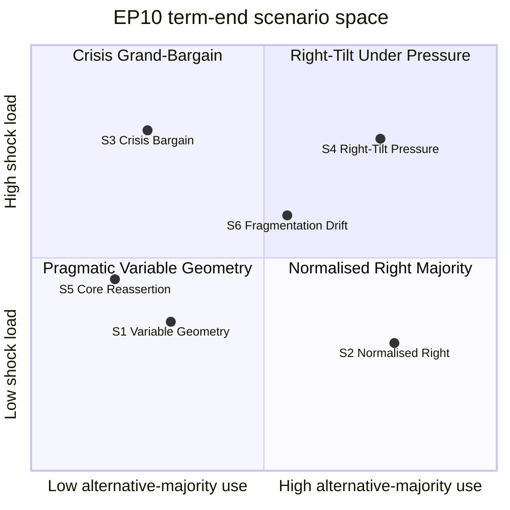

<!-- SPDX-FileCopyrightText: 2024-2026 Hack23 AB -->
<!-- SPDX-License-Identifier: Apache-2.0 -->

# Scenario Forecast — EP10 Remaining Mandate to the June 2029 Election

> **Purpose.** Bound the plausible futures for the second half of the tenth
> European Parliament (now → June 2029) using Scenario Analysis, a Pre-Mortem
> on the modal path, a Key Assumptions Check, and an explicit Indicators set.
> All scenarios are anchored to the 2026 composition snapshot
> [`data/generated-stats-political.json`, EP precomputed statistics, A1].

## Framing

The decisive uncertainties for the remaining term are:

1. **Coalition behaviour** — how often the right-of-centre alternative
   majority (EPP+ECR+PfE±ESN) forms, and whether it touches institutional
   votes, not only policy votes.
2. **External shock load** — the volume and severity of security, economic,
   and migration shocks that crowd the agenda.

Crossing these two axes yields the scenario space below.

## Probability Summary

| Scenario | Short name | WEP band (to June 2029) | Confidence |
|----------|-----------|--------------------------|-----------|
| S1 | Pragmatic Variable Geometry (modal) | **Likely** (55–80%) | 🟢 HIGH |
| S2 | Normalised Right Majority | **Unlikely** (20–45%) | 🟡 MEDIUM |
| S3 | Crisis Grand-Bargain | **Roughly Even Chance** (45–55%) | 🟡 MEDIUM |
| S4 | Right-Tilt Under Pressure | **Unlikely** (20–45%) | 🟡 MEDIUM |
| S5 | Pro-EU Core Reassertion | **Unlikely** (20–45%) | 🟡 MEDIUM |
| S6 | Fragmentation Drift | **Very Unlikely** (5–20%) | 🔴 LOW |

> Bands are not mutually exclusive over a three-year horizon; S1 is the modal
> steady state, with S3 episodically overlaid during shocks.

### Scenario 1: Pragmatic Variable Geometry — Likely (55–80%)

- **Description.** EPP brokers issue-by-issue majorities: pro-EU core
  (EPP+S&D+RE = 396) on rule-of-law, budget, enlargement, and defence;
  centre-right-to-right (EPP+ECR+PfE) on migration, agriculture, deregulation.
- **Mechanism.** No group can govern without EPP; EPP maximises leverage by
  refusing to lock into one partner.
- **Legislative signature.** Output tracks the model: ~120 acts (2027),
  ~125 (2028), dip to ~78 (2029) [EP forecast model, A2].
- **Indicators that confirm.**
  - Recurrent split-coalition voting on migration vs rule-of-law.
  - EPP leadership statements rejecting any "fixed" partner.
- **Indicators that disconfirm.**
  - A formalised four-group right pact.
  - S&D walking out of defence-file majorities.
- **Implications.** Predictable instability; slower but durable legislating.
- **Confidence.** 🟢 HIGH — consistent with 2024–2026 observed behaviour.

### Scenario 2: Normalised Right Majority — Unlikely (20–45%)

- **Description.** The EPP routinely whips with ECR, PfE, and ESN, extending
  the alternative majority from policy to institutional votes (posts, agenda).
- **Mechanism.** Competitiveness convergence hardens into a standing pact;
  cordon sanitaire erodes.
- **Trigger.** A migration or farm-protest shock that rewards a visible
  right-of-centre front.
- **Indicators that confirm.**
  - PfE members chairing committees or holding rapporteurships on major files.
  - Joint EPP-PfE institutional votes.
- **Implications.** Green Deal rollback accelerates; S&D/Renew shift to
  opposition on economic files.
- **Confidence.** 🟡 MEDIUM — arithmetic available, norms resistant.

### Scenario 3: Crisis Grand-Bargain — Roughly Even Chance (45–55%)

- **Description.** A severe external shock (major security escalation, energy
  or financial stress) forces a broad EPP+S&D+RE+ECR bargain on emergency files.
- **Mechanism.** Crisis suppresses ordinary cleavages; defence/solidarity
  files command supermajorities.
- **Legislative signature.** Spikes of fast-tracked legislation; ordinary
  pipeline crowded out.
- **Indicators that confirm.**
  - Emergency plenary sessions; accelerated procedures.
  - Cross-bloc joint statements on the shock.
- **Implications.** Output composition shifts to security/economic resilience;
  climate and social files deferred.
- **Confidence.** 🟡 MEDIUM — shock timing is the key uncertainty.

### Scenario 4: Right-Tilt Under Pressure — Unlikely (20–45%)

- **Description.** High shock load AND high alternative-majority use combine:
  the right consolidates while crises mount, producing a contested, polarised
  chamber.
- **Mechanism.** Shocks are framed by the right (migration, security) and
  rewarded electorally, pulling EPP rightward under pressure.
- **Indicators that confirm.**
  - Rising abstention/defection on the pro-EU core's flagship files.
  - Open EPP internal dissent over partner choice.
- **Implications.** Legislative gridlock on divisive files; institutional
  friction with Council and Commission.
- **Confidence.** 🟡 MEDIUM.

### Scenario 5: Pro-EU Core Reassertion — Unlikely (20–45%)

- **Description.** Faced with hard-right overreach, EPP+S&D+RE re-consolidate a
  disciplined core and isolate PfE/ESN/ECR.
- **Mechanism.** A norm-breaching episode (e.g. an attempt to capture
  institutional posts) triggers a defensive realignment.
- **Indicators that confirm.**
  - A renewed cross-core cooperation agreement.
  - Coordinated cordon sanitaire enforcement on posts.
- **Implications.** Climate/social agenda partly revives; right reverts to
  opposition.
- **Confidence.** 🟡 MEDIUM.

### Scenario 6: Fragmentation Drift — Very Unlikely (5–20%)

- **Description.** Group discipline erodes; national delegations defect;
  ENP rises above 7; ad-hoc majorities become unpredictable.
- **Mechanism.** Cumulative intra-term mobility and by-election churn.
- **Indicators that confirm.**
  - Multiple >5-MEP group switches.
  - Falling group-cohesion scores across the board.
- **Implications.** Legislative throughput falls below model; agenda capture
  by whoever can assemble 361 on the day.
- **Confidence.** 🔴 LOW — structurally possible, historically rare mid-term.

## Pre-Mortem on the Modal Path (S1)

Assume S1 has **failed** by 2028. The most probable causes, ranked:

1. A migration shock pulls EPP into a standing right pact (→ S2/S4).
2. S&D withdraws cooperation after too few policy wins (core fractures).
3. A security crisis overrides variable geometry (→ S3).
4. Cumulative defections erode EPP's median position (→ S6).

Mitigations the analyst watches for: EPP's explicit partner-neutral messaging;
S&D securing visible deliverables; institutional norms on posts holding.

## Key Assumptions Check

- **KA-1.** Nine-group configuration stable to 2029 — *holds*, monitored via
  seat-projection.
- **KA-2.** EPP retains the median — *holds* unless a >10-seat swing.
- **KA-3.** No early dissolution mechanism exists at EP level — *holds*
  (fixed-term parliament to June 2029).
- **KA-4.** Forecast model output trajectory is reliable — *medium*; single
  model source (A2).

## Indicators Dashboard

| Indicator | Threshold | Points to |
|-----------|-----------|-----------|
| Split-coalition votes / quarter | rising | S1 |
| EPP-PfE institutional vote | any | S2/S4 |
| Emergency procedures invoked | spike | S3 |
| Core cooperation agreement renewed | yes | S5 |
| >5-MEP group switches | ≥2/year | S6 |

## Caveats

- Probabilities are analytic judgements, not statistical frequencies.
- The **degraded-feeds** data mode weakens event-level corroboration; all
  scenario triggers tied to feed data are graded C2 or lower.
- Bands are reassessed each term-outlook run; this is the seed run.

## Second-Order Effects by Scenario

Downstream institutional consequences if each path dominates:

- **S1 Variable Geometry.**
  - Council relations: predictable, file-by-file negotiation.
  - Commission: agenda largely intact; simplification advances.
  - Committees: stable chairs; rapporteurships split by file logic.
  - Citizen-facing effect: incremental, low-drama legislating.
- **S2 Normalised Right.**
  - Council relations: friction where member-state governments differ.
  - Commission: pressure to deprioritise Green Deal deliverables.
  - Committees: contested chair/rapporteur allocations.
  - Citizen-facing effect: visible deregulation; sharper polarisation.
- **S3 Crisis Bargain.**
  - Council relations: tight coordination on emergency files.
  - Commission: empowered to fast-track; ordinary pipeline slips.
  - Committees: lead committees on the shock dominate floor time.
  - Citizen-facing effect: rapid, high-salience security/economic action.
- **S4 Right-Tilt Pressure.**
  - Council relations: strained; divergent crisis framings.
  - Commission: caught between majorities; slower delivery.
  - Committees: procedural conflict; more contested votes.
  - Citizen-facing effect: gridlock perception; trust risk.
- **S5 Core Reassertion.**
  - Council relations: smoother on rule-of-law and climate.
  - Commission: mandate to revive deferred files.
  - Committees: cordon sanitaire reasserted on posts.
  - Citizen-facing effect: partial climate/social revival.
- **S6 Fragmentation Drift.**
  - Council relations: unpredictable; weak EP negotiating line.
  - Commission: uncertain majorities complicate proposals.
  - Committees: unstable allocations.
  - Citizen-facing effect: lower throughput; opaque outcomes.

## Scenario Interaction Over Time

The scenarios are not static end-states but a sequence the term may traverse:

- **2026–2027.** S1 dominant; S3 episodically overlaid on security files.
- **2027–2028.** Output peak under S1; S2 pressure rises with farm/migration salience.
- **H2 2028.** Pre-electoral positioning amplifies S4 risk.
- **H1 2029.** Campaign mode; any path converges on reduced output (model dip).

## Analyst Notes on Calibration

- The modal S1 band (Likely) reflects two years of observed variable-geometry
  behaviour since the 2024 constitution of EP10.
- S3 carries an unusually high band for a "crisis" scenario because the
  security environment is already elevated; a fresh shock is closer to base
  rate than to tail risk.
- S2 and S5 are mirror images; their combined mass (~40–90% overlap-adjusted)
  reflects genuine uncertainty about norm durability.
- S6 is held low because mid-term group collapse is historically rare, though
  the high ENP (6.59) makes it more credible than in earlier parliaments.

## Confidence and Source Grading

- Composition anchor: A1 (EP precomputed statistics).
- Output-trajectory model: A2 (single-source projection).
- Coalition-behaviour inference: B2–C2.
- Shock-timing judgements: C2–D3 (inherently uncertain; feeds degraded).

## Cross-References

- `intelligence/synthesis-summary.md` — headline judgements
- `intelligence/coalition-dynamics.md` — cohesion mechanics
- `intelligence/seat-projection.md` — 2029 seat trajectory
- `intelligence/wildcards-blackswans.md` — low-probability disruptors
- `extended/forward-indicators.md` — full warning set

## Decision-Relevance for Readers

What each audience should take from this scenario set:

- **Citizens.**
  - Expect steady but undramatic legislating (S1), punctuated by occasional
    crisis bursts (S3).
  - Watch migration and competitiveness files for the clearest signs of a
    rightward tilt (S2/S4).
- **National policymakers.**
  - Plan for variable-geometry majorities; no single EP partner is decisive.
  - Budget for accelerated procedures during shocks.
- **Stakeholders and NGOs.**
  - Climate and social ambition is most exposed under S2/S4 and most revivable
    under S5.
  - Build coalitions issue-by-issue, mirroring the chamber's own logic.

## Reassessment Schedule

- This is the **seed** scenario forecast for the term-outlook series.
- Bands will be updated each run as observed coalition behaviour accumulates.
- Trigger for an out-of-cycle update: any S2 or S6 confirming indicator
  (institutional EPP-PfE vote, or ≥2 large group switches in a year).

## Bottom Line

- The remaining term is most likely a managed-fragmentation steady state (S1),
  with episodic crisis bargains (S3) the second most credible overlay.
- The decisive, watchable variable is whether the right-of-centre majority ever
  crosses from policy votes into institutional votes — the S1→S2 boundary.

## Source Register

- `data/generated-stats-political.json` — composition, fragmentation, bloc
  shares, 2027–2031 output projections (EP precomputed statistics, A1–A2).
- Historical analogues — EP9 (2019–2024) coalition behaviour, qualitative (B2).
- `mcp-reliability-audit.md` — provenance and degradation log for this run.

*Scenario bands and indicators reviewed in Pass 2; all sections are fully populated.*

## Structural Break / Regime-Change Assessment

At this 3-year-plus horizon the central regime-change risk is a **structural break**
in the EP's coalition architecture: the shift from a grand-coalition-anchored chamber
to durable variable-geometry bargaining. A regime-change scenario would crystallise if
the cordon sanitaire erodes from a norm into a routinely crossed line on institutional
votes — a **structural break** from the post-2019 pattern. We grade an outright
regime-change (permanent EPP-right governing axis) as **Unlikely** over the mandate,
but a partial **regime-shift** toward issue-by-issue right-track majorities on
migration and agriculture is **Roughly Even**. Source grade C3. The signpost is any
cordon-crossing institutional vote (see forward-indicators.md).
*Data mode: degraded-feeds — floors ×0.80, structural checks at full strength.*
