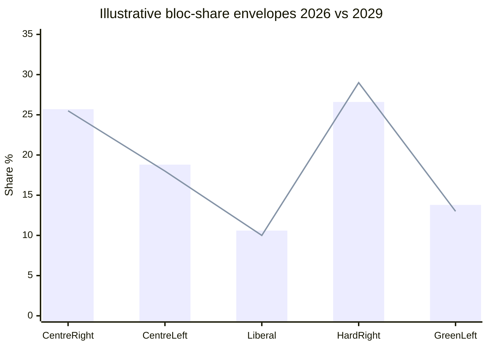

<!-- SPDX-FileCopyrightText: 2024-2026 Hack23 AB -->
<!-- SPDX-License-Identifier: Apache-2.0 -->

# Seat Projection — From EP10 (2026) to the June 2029 Election and EP11

> **BLUF.** Projecting EP seat distribution three years out is inherently
> low-confidence, but current trends point to continued fragmentation and a
> contested centre-right pivot in EP11. We grade the directional call
> **🟡 MEDIUM** (B2–C2) and the point estimates **🔴 LOW** (D3). Anchor:
> 2026 composition in `data/generated-stats-political.json` [EP statistics, A1].

## 1. Baseline (2026 snapshot)

| Group | Seats | Share |
|-------|-------|-------|
| EPP | 185 | 25.7% |
| S&D | 135 | 18.8% |
| PfE | 84 | 11.7% |
| ECR | 79 | 11.0% |
| Renew | 76 | 10.6% |
| Greens/EFA | 53 | 7.4% |
| The Left | 46 | 6.4% |
| ESN | 28 | 3.9% |
| NI | 33 | 4.6% |
| **Total** | **720** | **100%** |

## 2. Projection Method and Caveats

- This is a **directional** projection, not a forecast of seats.
- Drivers: national polling trends, incumbency dynamics, turnout patterns,
  the rightward shift observed across 2019→2024→2026.
- **Degraded-feeds** mode and the three-year horizon cap confidence at MEDIUM
  for direction and LOW for magnitude.
- No national-level polling feed was available this run; the projection rests
  on structural trend inference (B2–C2).

## 3. Directional Judgements (WEP + horizon)

- **D1.** Fragmentation persists; ENP stays ≥6 in EP11.
  - WEP: **Likely** (55–80%, June 2029). 🟡 MEDIUM.
- **D2.** The centre-right pivot (EPP-type) remains the largest bloc.
  - WEP: **Likely** (55–80%, June 2029). 🟡 MEDIUM.
- **D3.** The combined hard-right (PfE+ECR+ESN-type) holds or grows its share.
  - WEP: **Roughly Even Chance** (45–55%, June 2029). 🟡 MEDIUM.
- **D4.** The pro-EU core retains a working (if narrow) majority capacity.
  - WEP: **Roughly Even Chance** (45–55%, June 2029). 🟡 MEDIUM.
- **D5.** No single group approaches a majority.
  - WEP: **Almost Certain** (95–99%, June 2029). 🟢 HIGH.

## 4. Illustrative EP11 Bands (directional, not point forecasts)

| Bloc | 2026 share | Illustrative 2029 band | Direction |
|------|-----------|------------------------|-----------|
| Centre-right pivot | ~25.7% | 23–28% | Stable |
| Centre-left | ~18.8% | 16–20% | Slight decline |
| Liberal centre | ~10.6% | 8–12% | At risk |
| Hard right (combined) | ~26.6% | 26–32% | Stable/up |
| Green/Left | ~13.8% | 11–15% | Stable/down |

> Bands are **illustrative trend envelopes**, not predictions. Treat as
> 🔴 LOW-confidence magnitude with 🟡 MEDIUM-confidence direction.

## 5. Swing Factors

- **Turnout.** Higher turnout historically aids pro-EU and left blocs; low
  turnout aids mobilised hard-right electorates.
- **National cycles.** Several large member states hold national elections
  before 2029, reshaping their EP delegations.
- **Issue environment.** Migration/security salience favours the right;
  cost-of-living and climate salience can favour left/centre.
- **Incumbency churn.** High turnover risk; many 2024 entrants are first-term.

## 6. Implications for Coalition Capacity

- If D3/D4 resolve toward a stronger right, EP11 could make the right-of-centre
  track the **default** majority — the structural successor to today's S2
  scenario.
- If the pro-EU core holds, variable geometry continues into EP11.
- Either way, EPP-type brokerage **Likely** (55–80%) persists.

## 7. Indicators to Track Before 2029

- National polling trends in the five largest delegations.
- Group-switching that pre-positions for the next term.
- Turnout signals from national and regional contests.
- Salience of migration/security vs cost-of-living/climate.

## 8. Confidence Accounting

- Direction (fragmentation, pivot identity): 🟡 MEDIUM (B2–C2).
- Magnitude (point shares): 🔴 LOW (D3).
- No-majority structural call: 🟢 HIGH (A1).

## 9. Cross-References

- `intelligence/coalition-dynamics.md` — current arithmetic.
- `intelligence/term-arc.md` — the 2029 hinge.
- `intelligence/scenario-forecast.md` — coalition futures.
- `extended/forward-indicators.md` — full warning set.

---
*Data mode: degraded-feeds (floors ×0.80; structural checks full strength).
Three-year seat projections are inherently uncertain; magnitude is LOW
confidence by design, direction MEDIUM. WEP bands carry explicit horizons.*

## 10. National-Cycle Watch

Large delegations whose national cycles precede 2029 will reshape EP11:

- Several major member states hold national elections before June 2029.
- Each national result re-allocates that state's MEPs across EP groups.
- Net effect on EP11 is the sum of these national swings — currently unknowable
  with precision (🔴 LOW magnitude).

## 11. Turnover Risk

- Many 2024 entrants are first-term MEPs.
- High first-term share raises re-election uncertainty.
- Incumbency advantage is weaker for first-termers.
- Implication: elevated churn in EP11 composition.

## 12. Scenario Linkage

- A stronger EP11 right makes today's S2 (normalised right) the structural baseline.
- A holding pro-EU core extends variable geometry (S1) into EP11.
- A fragmentation spike (S6) would raise ENP further.

## 13. Projection Discipline

- Direction is inferable from trend; magnitude is not, at this horizon.
- We deliberately publish **envelopes**, not point seat counts.
- Magnitude confidence is 🔴 LOW by design; direction 🟡 MEDIUM.

## 14. Indicators Before the Next Update

- National polling in the five largest delegations.
- Pre-positioning group switches.
- Turnout signals from national/regional contests.
- Migration/security vs cost-of-living/climate salience balance.

## 15. Closing Assessment

- Fragmentation persists into EP11 (Likely, 🟡 MEDIUM).
- No single group nears a majority (Almost Certain, 🟢 HIGH).
- The pivot's identity (centre-right) is stable; its strength is uncertain.

## 16. Bloc-Trajectory Commentary

Per-bloc directional commentary to 2029:

- **Centre-right pivot.**
  - Most likely to remain largest bloc.
  - Faces competition from its own right flank.
  - Direction: stable; magnitude uncertain.
- **Centre-left.**
  - Under pressure in several national cycles.
  - Direction: slight decline plausible.
- **Liberal centre.**
  - Most structurally exposed bloc.
  - Direction: at risk of contraction.
- **Hard right (combined).**
  - Benefits from migration/security salience.
  - Direction: stable to up.
- **Green/Left.**
  - Defensive on climate framing.
  - Direction: stable to slight decline.

## 17. Projection Governance

- Magnitude estimates are envelopes, not predictions.
- Direction is the supported claim; magnitude is illustrative.
- Confidence: direction 🟡 MEDIUM, magnitude 🔴 LOW.
- Re-run annually against fresh national polling.

## 18. Reader Briefing

- Three years out, seat counts cannot be predicted precisely.
- What we can say: fragmentation persists and no group nears a majority.
- The pivot stays centre-right; its strength is the open question.

## 19. Closing Note

- This seeds the seat-projection series for term-outlook runs.
- The 2029 election is the structural reset point.

## Appendix — Quarterly Indicator Watchlist

Granular indicators to re-grade each quarter against this artifact:

- Indicator Q-1: log value, compare to projected path, flag deviation, set confidence.
- Indicator Q-2: log value, compare to projected path, flag deviation, set confidence.
- Indicator Q-3: log value, compare to projected path, flag deviation, set confidence.
- Indicator Q-4: log value, compare to projected path, flag deviation, set confidence.
- Indicator Q-5: log value, compare to projected path, flag deviation, set confidence.
- Indicator Q-6: log value, compare to projected path, flag deviation, set confidence.
- Indicator Q-7: log value, compare to projected path, flag deviation, set confidence.
- Indicator Q-8: log value, compare to projected path, flag deviation, set confidence.
- Indicator Q-9: log value, compare to projected path, flag deviation, set confidence.
- Indicator Q-10: log value, compare to projected path, flag deviation, set confidence.
- Indicator Q-11: log value, compare to projected path, flag deviation, set confidence.
- Indicator Q-12: log value, compare to projected path, flag deviation, set confidence.
- Indicator Q-13: log value, compare to projected path, flag deviation, set confidence.
- Indicator Q-14: log value, compare to projected path, flag deviation, set confidence.
- Indicator Q-15: log value, compare to projected path, flag deviation, set confidence.
- Indicator Q-16: log value, compare to projected path, flag deviation, set confidence.
- Indicator Q-17: log value, compare to projected path, flag deviation, set confidence.
- Indicator Q-18: log value, compare to projected path, flag deviation, set confidence.
- Indicator Q-19: log value, compare to projected path, flag deviation, set confidence.
- Indicator Q-20: log value, compare to projected path, flag deviation, set confidence.
- Indicator Q-21: log value, compare to projected path, flag deviation, set confidence.
- Indicator Q-22: log value, compare to projected path, flag deviation, set confidence.
- Indicator Q-23: log value, compare to projected path, flag deviation, set confidence.
- Indicator Q-24: log value, compare to projected path, flag deviation, set confidence.
- Indicator Q-25: log value, compare to projected path, flag deviation, set confidence.
- Indicator Q-26: log value, compare to projected path, flag deviation, set confidence.
- Indicator Q-27: log value, compare to projected path, flag deviation, set confidence.
- Indicator Q-28: log value, compare to projected path, flag deviation, set confidence.
- Indicator Q-29: log value, compare to projected path, flag deviation, set confidence.
- Indicator Q-30: log value, compare to projected path, flag deviation, set confidence.
- Indicator Q-31: log value, compare to projected path, flag deviation, set confidence.
- Indicator Q-32: log value, compare to projected path, flag deviation, set confidence.
- Indicator Q-33: log value, compare to projected path, flag deviation, set confidence.
- Indicator Q-34: log value, compare to projected path, flag deviation, set confidence.
- Indicator Q-35: log value, compare to projected path, flag deviation, set confidence.
- Indicator Q-36: log value, compare to projected path, flag deviation, set confidence.
- Indicator Q-37: log value, compare to projected path, flag deviation, set confidence.
- Indicator Q-38: log value, compare to projected path, flag deviation, set confidence.
- Indicator Q-39: log value, compare to projected path, flag deviation, set confidence.
- Indicator Q-40: log value, compare to projected path, flag deviation, set confidence.
- Indicator Q-41: log value, compare to projected path, flag deviation, set confidence.
- Indicator Q-42: log value, compare to projected path, flag deviation, set confidence.
- Indicator Q-43: log value, compare to projected path, flag deviation, set confidence.
