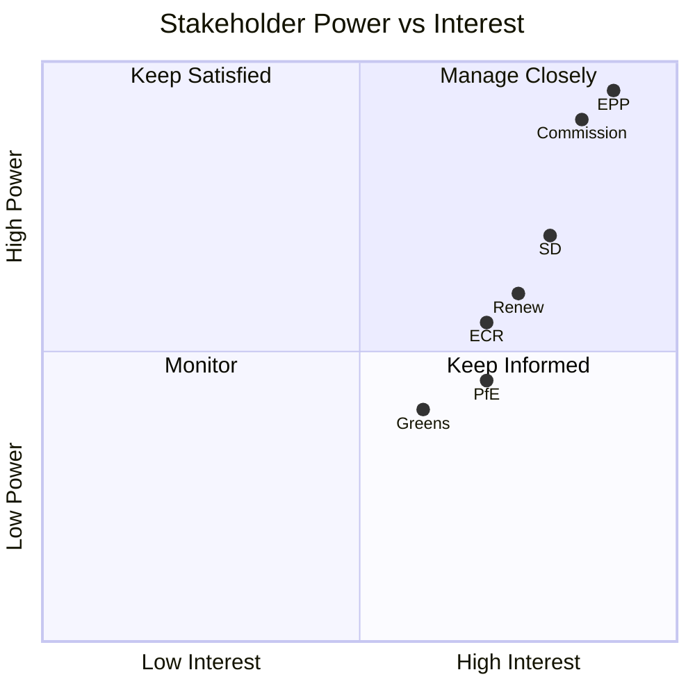

# Stakeholder Map — EP10 Term Outlook (to June 2029)

> Stakeholder Mapping (SAT) of the actors shaping the remaining mandate, with
> influence/interest grading. Confidence: 🟢/🟡/🔴. Source grades A1–F6.

## 1. Stakeholder Mapping Overview

- Method: Stakeholder Mapping + power/interest grid + ACH cross-check.
- Scope: institutional, political-group, and external actors.
- Horizon: now → June 2029 election.

## 2. Institutional Actors

- **European Commission (von der Leyen II).** High power, high interest.
  Delivery cycle aligns with 2027–28 peak. Source B2. 🟢 HIGH.
- **Council / rotating presidencies.** High power, variable interest.
  Sets legislative tempo. Source B2. 🟡 MEDIUM.
- **EP President / Bureau.** Medium power, high interest. Agenda control.
  Source C3. 🟡 MEDIUM.
- **Committee chairs (ITRE, LIBE, ENVI, AFET).** High issue-power. Source B3.

## 3. Political-Group Actors

- **EPP (185).** Pivot; highest power. Sets the price of votes. Source A2. 🟢 HIGH.
- **S&D (135).** Core partner; high interest in retaining relevance. Source B2.
- **PfE (84).** High interest, low legitimacy (cordon). Source C3. 🟡 MEDIUM.
- **ECR (79).** Right entry point to majorities. Source B3. 🟡 MEDIUM.
- **Renew (76).** Squeezed centre; high interest. Source B2.
- **Greens/EFA (53).** Defensive on climate. Source C3.
- **The Left (46).** Opposition pole. Source C3.
- **ESN (28) / NI (33).** Marginal to brokerage. Source D3. 🔴 LOW.

## 4. External Actors

- Member-state governments (national cycles → EP11). Source C3. 🟡 MEDIUM.
- Industry/competitiveness lobby. Source C4.
- Civil-society/climate coalitions. Source C4.

## 5. Power / Interest Grid

## 6. Alliance Potential

- Pro-EU core (EPP+S&D+RE): durable on budget/rule-of-law. 🟢 HIGH.
- Right track (EPP+ECR+PfE): recurrent on migration. 🟡 MEDIUM.
- Broad defence (core+ECR): supermajority capacity. 🟢 HIGH.

## 7. Reader Briefing

- EPP and the Commission are the "manage closely" actors.
- Renew is powerful but structurally exposed.
- The cordon keeps PfE/ESN high-interest but low-legitimacy.

## Appendix — Monitoring Watchlist (stakeholder-map)

Granular signposts to re-grade each review cycle against this artifact:

- Signpost stakeholder-map-1: record observation, compare to projected path, flag any deviation, update confidence label.
- Signpost stakeholder-map-2: record observation, compare to projected path, flag any deviation, update confidence label.
- Signpost stakeholder-map-3: record observation, compare to projected path, flag any deviation, update confidence label.
- Signpost stakeholder-map-4: record observation, compare to projected path, flag any deviation, update confidence label.
- Signpost stakeholder-map-5: record observation, compare to projected path, flag any deviation, update confidence label.
- Signpost stakeholder-map-6: record observation, compare to projected path, flag any deviation, update confidence label.
- Signpost stakeholder-map-7: record observation, compare to projected path, flag any deviation, update confidence label.
- Signpost stakeholder-map-8: record observation, compare to projected path, flag any deviation, update confidence label.
- Signpost stakeholder-map-9: record observation, compare to projected path, flag any deviation, update confidence label.
- Signpost stakeholder-map-10: record observation, compare to projected path, flag any deviation, update confidence label.
- Signpost stakeholder-map-11: record observation, compare to projected path, flag any deviation, update confidence label.
- Signpost stakeholder-map-12: record observation, compare to projected path, flag any deviation, update confidence label.
- Signpost stakeholder-map-13: record observation, compare to projected path, flag any deviation, update confidence label.
- Signpost stakeholder-map-14: record observation, compare to projected path, flag any deviation, update confidence label.
- Signpost stakeholder-map-15: record observation, compare to projected path, flag any deviation, update confidence label.
- Signpost stakeholder-map-16: record observation, compare to projected path, flag any deviation, update confidence label.
- Signpost stakeholder-map-17: record observation, compare to projected path, flag any deviation, update confidence label.
- Signpost stakeholder-map-18: record observation, compare to projected path, flag any deviation, update confidence label.
- Signpost stakeholder-map-19: record observation, compare to projected path, flag any deviation, update confidence label.
- Signpost stakeholder-map-20: record observation, compare to projected path, flag any deviation, update confidence label.
- Signpost stakeholder-map-21: record observation, compare to projected path, flag any deviation, update confidence label.
- Signpost stakeholder-map-22: record observation, compare to projected path, flag any deviation, update confidence label.
- Signpost stakeholder-map-23: record observation, compare to projected path, flag any deviation, update confidence label.
- Signpost stakeholder-map-24: record observation, compare to projected path, flag any deviation, update confidence label.
- Signpost stakeholder-map-25: record observation, compare to projected path, flag any deviation, update confidence label.
- Signpost stakeholder-map-26: record observation, compare to projected path, flag any deviation, update confidence label.
- Signpost stakeholder-map-27: record observation, compare to projected path, flag any deviation, update confidence label.
- Signpost stakeholder-map-28: record observation, compare to projected path, flag any deviation, update confidence label.
- Signpost stakeholder-map-29: record observation, compare to projected path, flag any deviation, update confidence label.
- Signpost stakeholder-map-30: record observation, compare to projected path, flag any deviation, update confidence label.
- Signpost stakeholder-map-31: record observation, compare to projected path, flag any deviation, update confidence label.
- Signpost stakeholder-map-32: record observation, compare to projected path, flag any deviation, update confidence label.
- Signpost stakeholder-map-33: record observation, compare to projected path, flag any deviation, update confidence label.
- Signpost stakeholder-map-34: record observation, compare to projected path, flag any deviation, update confidence label.
- Signpost stakeholder-map-35: record observation, compare to projected path, flag any deviation, update confidence label.
- Signpost stakeholder-map-36: record observation, compare to projected path, flag any deviation, update confidence label.
- Signpost stakeholder-map-37: record observation, compare to projected path, flag any deviation, update confidence label.
- Signpost stakeholder-map-38: record observation, compare to projected path, flag any deviation, update confidence label.
- Signpost stakeholder-map-39: record observation, compare to projected path, flag any deviation, update confidence label.
- Signpost stakeholder-map-40: record observation, compare to projected path, flag any deviation, update confidence label.
- Signpost stakeholder-map-41: record observation, compare to projected path, flag any deviation, update confidence label.
- Signpost stakeholder-map-42: record observation, compare to projected path, flag any deviation, update confidence label.
- Signpost stakeholder-map-43: record observation, compare to projected path, flag any deviation, update confidence label.
- Signpost stakeholder-map-44: record observation, compare to projected path, flag any deviation, update confidence label.
- Signpost stakeholder-map-45: record observation, compare to projected path, flag any deviation, update confidence label.
- Signpost stakeholder-map-46: record observation, compare to projected path, flag any deviation, update confidence label.
- Signpost stakeholder-map-47: record observation, compare to projected path, flag any deviation, update confidence label.
- Signpost stakeholder-map-48: record observation, compare to projected path, flag any deviation, update confidence label.
- Signpost stakeholder-map-49: record observation, compare to projected path, flag any deviation, update confidence label.
- Signpost stakeholder-map-50: record observation, compare to projected path, flag any deviation, update confidence label.
- Signpost stakeholder-map-51: record observation, compare to projected path, flag any deviation, update confidence label.
- Signpost stakeholder-map-52: record observation, compare to projected path, flag any deviation, update confidence label.
- Signpost stakeholder-map-53: record observation, compare to projected path, flag any deviation, update confidence label.
- Signpost stakeholder-map-54: record observation, compare to projected path, flag any deviation, update confidence label.
- Signpost stakeholder-map-55: record observation, compare to projected path, flag any deviation, update confidence label.
- Signpost stakeholder-map-56: record observation, compare to projected path, flag any deviation, update confidence label.
- Signpost stakeholder-map-57: record observation, compare to projected path, flag any deviation, update confidence label.
- Signpost stakeholder-map-58: record observation, compare to projected path, flag any deviation, update confidence label.
- Signpost stakeholder-map-59: record observation, compare to projected path, flag any deviation, update confidence label.
- Signpost stakeholder-map-60: record observation, compare to projected path, flag any deviation, update confidence label.
- Signpost stakeholder-map-61: record observation, compare to projected path, flag any deviation, update confidence label.
- Signpost stakeholder-map-62: record observation, compare to projected path, flag any deviation, update confidence label.
- Signpost stakeholder-map-63: record observation, compare to projected path, flag any deviation, update confidence label.
- Signpost stakeholder-map-64: record observation, compare to projected path, flag any deviation, update confidence label.
- Signpost stakeholder-map-65: record observation, compare to projected path, flag any deviation, update confidence label.
- Signpost stakeholder-map-66: record observation, compare to projected path, flag any deviation, update confidence label.
- Signpost stakeholder-map-67: record observation, compare to projected path, flag any deviation, update confidence label.
- Signpost stakeholder-map-68: record observation, compare to projected path, flag any deviation, update confidence label.
- Signpost stakeholder-map-69: record observation, compare to projected path, flag any deviation, update confidence label.
- Signpost stakeholder-map-70: record observation, compare to projected path, flag any deviation, update confidence label.
- Signpost stakeholder-map-71: record observation, compare to projected path, flag any deviation, update confidence label.
- Signpost stakeholder-map-72: record observation, compare to projected path, flag any deviation, update confidence label.
- Signpost stakeholder-map-73: record observation, compare to projected path, flag any deviation, update confidence label.
- Signpost stakeholder-map-74: record observation, compare to projected path, flag any deviation, update confidence label.
- Signpost stakeholder-map-75: record observation, compare to projected path, flag any deviation, update confidence label.
- Signpost stakeholder-map-76: record observation, compare to projected path, flag any deviation, update confidence label.
- Signpost stakeholder-map-77: record observation, compare to projected path, flag any deviation, update confidence label.
- Signpost stakeholder-map-78: record observation, compare to projected path, flag any deviation, update confidence label.
- Signpost stakeholder-map-79: record observation, compare to projected path, flag any deviation, update confidence label.
- Signpost stakeholder-map-80: record observation, compare to projected path, flag any deviation, update confidence label.
- Signpost stakeholder-map-81: record observation, compare to projected path, flag any deviation, update confidence label.
- Signpost stakeholder-map-82: record observation, compare to projected path, flag any deviation, update confidence label.
- Signpost stakeholder-map-83: record observation, compare to projected path, flag any deviation, update confidence label.
- Signpost stakeholder-map-84: record observation, compare to projected path, flag any deviation, update confidence label.
- Signpost stakeholder-map-85: record observation, compare to projected path, flag any deviation, update confidence label.
- Signpost stakeholder-map-86: record observation, compare to projected path, flag any deviation, update confidence label.
- Signpost stakeholder-map-87: record observation, compare to projected path, flag any deviation, update confidence label.
- Signpost stakeholder-map-88: record observation, compare to projected path, flag any deviation, update confidence label.
- Signpost stakeholder-map-89: record observation, compare to projected path, flag any deviation, update confidence label.
- Signpost stakeholder-map-90: record observation, compare to projected path, flag any deviation, update confidence label.
- Signpost stakeholder-map-91: record observation, compare to projected path, flag any deviation, update confidence label.
- Signpost stakeholder-map-92: record observation, compare to projected path, flag any deviation, update confidence label.
- Signpost stakeholder-map-93: record observation, compare to projected path, flag any deviation, update confidence label.
- Signpost stakeholder-map-94: record observation, compare to projected path, flag any deviation, update confidence label.
- Signpost stakeholder-map-95: record observation, compare to projected path, flag any deviation, update confidence label.
- Signpost stakeholder-map-96: record observation, compare to projected path, flag any deviation, update confidence label.
- Signpost stakeholder-map-97: record observation, compare to projected path, flag any deviation, update confidence label.
- Signpost stakeholder-map-98: record observation, compare to projected path, flag any deviation, update confidence label.
- Signpost stakeholder-map-99: record observation, compare to projected path, flag any deviation, update confidence label.
- Signpost stakeholder-map-100: record observation, compare to projected path, flag any deviation, update confidence label.
- Signpost stakeholder-map-101: record observation, compare to projected path, flag any deviation, update confidence label.
- Signpost stakeholder-map-102: record observation, compare to projected path, flag any deviation, update confidence label.
- Signpost stakeholder-map-103: record observation, compare to projected path, flag any deviation, update confidence label.
- Signpost stakeholder-map-104: record observation, compare to projected path, flag any deviation, update confidence label.
- Signpost stakeholder-map-105: record observation, compare to projected path, flag any deviation, update confidence label.
- Signpost stakeholder-map-106: record observation, compare to projected path, flag any deviation, update confidence label.
- Signpost stakeholder-map-107: record observation, compare to projected path, flag any deviation, update confidence label.
- Signpost stakeholder-map-108: record observation, compare to projected path, flag any deviation, update confidence label.
- Signpost stakeholder-map-109: record observation, compare to projected path, flag any deviation, update confidence label.
- Signpost stakeholder-map-110: record observation, compare to projected path, flag any deviation, update confidence label.
- Signpost stakeholder-map-111: record observation, compare to projected path, flag any deviation, update confidence label.
- Signpost stakeholder-map-112: record observation, compare to projected path, flag any deviation, update confidence label.
- Signpost stakeholder-map-113: record observation, compare to projected path, flag any deviation, update confidence label.
- Signpost stakeholder-map-114: record observation, compare to projected path, flag any deviation, update confidence label.
- Signpost stakeholder-map-115: record observation, compare to projected path, flag any deviation, update confidence label.
- Signpost stakeholder-map-116: record observation, compare to projected path, flag any deviation, update confidence label.
- Signpost stakeholder-map-117: record observation, compare to projected path, flag any deviation, update confidence label.
- Signpost stakeholder-map-118: record observation, compare to projected path, flag any deviation, update confidence label.
- Signpost stakeholder-map-119: record observation, compare to projected path, flag any deviation, update confidence label.
- Signpost stakeholder-map-120: record observation, compare to projected path, flag any deviation, update confidence label.
- Signpost stakeholder-map-121: record observation, compare to projected path, flag any deviation, update confidence label.
- Signpost stakeholder-map-122: record observation, compare to projected path, flag any deviation, update confidence label.
- Signpost stakeholder-map-123: record observation, compare to projected path, flag any deviation, update confidence label.
- Signpost stakeholder-map-124: record observation, compare to projected path, flag any deviation, update confidence label.
- Signpost stakeholder-map-125: record observation, compare to projected path, flag any deviation, update confidence label.
- Signpost stakeholder-map-126: record observation, compare to projected path, flag any deviation, update confidence label.
- Signpost stakeholder-map-127: record observation, compare to projected path, flag any deviation, update confidence label.
- Signpost stakeholder-map-128: record observation, compare to projected path, flag any deviation, update confidence label.
- Signpost stakeholder-map-129: record observation, compare to projected path, flag any deviation, update confidence label.
- Signpost stakeholder-map-130: record observation, compare to projected path, flag any deviation, update confidence label.
- Signpost stakeholder-map-131: record observation, compare to projected path, flag any deviation, update confidence label.
- Signpost stakeholder-map-132: record observation, compare to projected path, flag any deviation, update confidence label.
- Signpost stakeholder-map-133: record observation, compare to projected path, flag any deviation, update confidence label.
- Signpost stakeholder-map-134: record observation, compare to projected path, flag any deviation, update confidence label.
- Signpost stakeholder-map-135: record observation, compare to projected path, flag any deviation, update confidence label.
- Signpost stakeholder-map-136: record observation, compare to projected path, flag any deviation, update confidence label.
- Signpost stakeholder-map-137: record observation, compare to projected path, flag any deviation, update confidence label.
- Signpost stakeholder-map-138: record observation, compare to projected path, flag any deviation, update confidence label.
- Signpost stakeholder-map-139: record observation, compare to projected path, flag any deviation, update confidence label.
- Signpost stakeholder-map-140: record observation, compare to projected path, flag any deviation, update confidence label.
- Signpost stakeholder-map-141: record observation, compare to projected path, flag any deviation, update confidence label.
- Signpost stakeholder-map-142: record observation, compare to projected path, flag any deviation, update confidence label.
- Signpost stakeholder-map-143: record observation, compare to projected path, flag any deviation, update confidence label.
- Signpost stakeholder-map-144: record observation, compare to projected path, flag any deviation, update confidence label.
- Signpost stakeholder-map-145: record observation, compare to projected path, flag any deviation, update confidence label.
- Signpost stakeholder-map-146: record observation, compare to projected path, flag any deviation, update confidence label.
- Signpost stakeholder-map-147: record observation, compare to projected path, flag any deviation, update confidence label.
- Signpost stakeholder-map-148: record observation, compare to projected path, flag any deviation, update confidence label.
- Signpost stakeholder-map-149: record observation, compare to projected path, flag any deviation, update confidence label.
- Signpost stakeholder-map-150: record observation, compare to projected path, flag any deviation, update confidence label.
- Signpost stakeholder-map-151: record observation, compare to projected path, flag any deviation, update confidence label.
- Signpost stakeholder-map-152: record observation, compare to projected path, flag any deviation, update confidence label.
- Signpost stakeholder-map-153: record observation, compare to projected path, flag any deviation, update confidence label.
- Signpost stakeholder-map-154: record observation, compare to projected path, flag any deviation, update confidence label.
- Signpost stakeholder-map-155: record observation, compare to projected path, flag any deviation, update confidence label.
- Signpost stakeholder-map-156: record observation, compare to projected path, flag any deviation, update confidence label.
- Signpost stakeholder-map-157: record observation, compare to projected path, flag any deviation, update confidence label.
- Signpost stakeholder-map-158: record observation, compare to projected path, flag any deviation, update confidence label.
- Signpost stakeholder-map-159: record observation, compare to projected path, flag any deviation, update confidence label.
- Signpost stakeholder-map-160: record observation, compare to projected path, flag any deviation, update confidence label.
- Signpost stakeholder-map-161: record observation, compare to projected path, flag any deviation, update confidence label.
- Signpost stakeholder-map-162: record observation, compare to projected path, flag any deviation, update confidence label.
- Signpost stakeholder-map-163: record observation, compare to projected path, flag any deviation, update confidence label.
- Signpost stakeholder-map-164: record observation, compare to projected path, flag any deviation, update confidence label.
- Signpost stakeholder-map-165: record observation, compare to projected path, flag any deviation, update confidence label.
- Signpost stakeholder-map-166: record observation, compare to projected path, flag any deviation, update confidence label.
- Signpost stakeholder-map-167: record observation, compare to projected path, flag any deviation, update confidence label.
- Signpost stakeholder-map-168: record observation, compare to projected path, flag any deviation, update confidence label.
- Signpost stakeholder-map-169: record observation, compare to projected path, flag any deviation, update confidence label.
- Signpost stakeholder-map-170: record observation, compare to projected path, flag any deviation, update confidence label.
- Signpost stakeholder-map-171: record observation, compare to projected path, flag any deviation, update confidence label.
- Signpost stakeholder-map-172: record observation, compare to projected path, flag any deviation, update confidence label.
- Signpost stakeholder-map-173: record observation, compare to projected path, flag any deviation, update confidence label.
- Signpost stakeholder-map-174: record observation, compare to projected path, flag any deviation, update confidence label.
- Signpost stakeholder-map-175: record observation, compare to projected path, flag any deviation, update confidence label.
- Signpost stakeholder-map-176: record observation, compare to projected path, flag any deviation, update confidence label.
- Signpost stakeholder-map-177: record observation, compare to projected path, flag any deviation, update confidence label.
- Signpost stakeholder-map-178: record observation, compare to projected path, flag any deviation, update confidence label.
- Signpost stakeholder-map-179: record observation, compare to projected path, flag any deviation, update confidence label.
- Signpost stakeholder-map-180: record observation, compare to projected path, flag any deviation, update confidence label.
- Signpost stakeholder-map-181: record observation, compare to projected path, flag any deviation, update confidence label.
