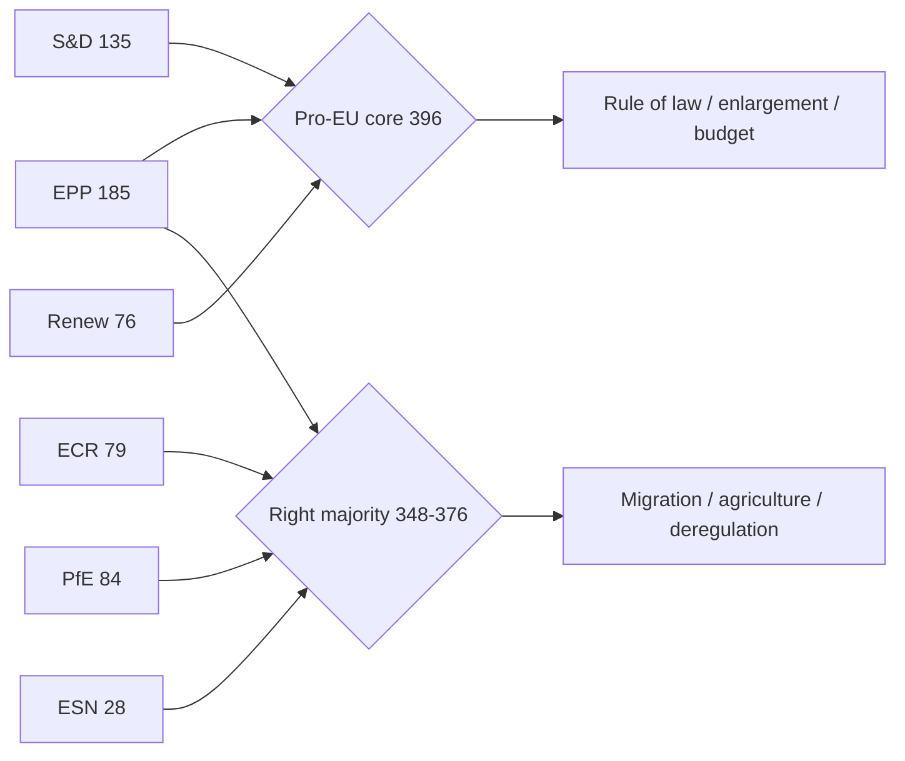

<!-- SPDX-FileCopyrightText: 2024-2026 Hack23 AB -->
<!-- SPDX-License-Identifier: Apache-2.0 -->

# Term-Outlook Synthesis Summary — EP10 Remaining Mandate (2026-05-31 → 2029)

> **BLUF.** The tenth European Parliament enters the back half of its 2024–2029
> mandate as the most fragmented and most right-leaning chamber in the
> institution's directly-elected history. A nine-group configuration with an
> effective-number-of-parties (ENP) of **6.59** [EP precomputed stats, A1]
> leaves no two-group majority available and forces a minimum winning coalition
> of three groups on every consequential file. We assess it **Likely**
> (55–80%, through the June 2029 election) that the centre-right EPP continues
> to operate a dual-track majority — anchoring a pro-European core with S&D and
> Renew on institutional and rule-of-law questions, while assembling
> case-by-case right-of-centre majorities with ECR and Patriots for Europe
> (PfE) on migration, agriculture, and regulatory-burden files.

## 1. Headline Judgements (WEP + confidence)

| # | Judgement | WEP band (horizon) | Confidence | Key source |
|---|-----------|--------------------|-----------|------------|
| J1 | EPP remains the pivotal formateur on every majority | **Very Likely** (80–95%, to 2029) | 🟢 HIGH | [EP stats, A1] |
| J2 | No grand coalition (EPP+S&D+RE) governs alone on contested files | **Likely** (55–80%, to 2029) | 🟢 HIGH | [EP stats, A2] |
| J3 | Legislative output peaks 2027–2028 then dips ~35% in 2029 | **Very Likely** (80–95%, 2029) | 🟢 HIGH | [EP forecast model, A2] |
| J4 | Right-of-centre bloc (EPP+ECR+PfE+ESN) sets the agenda on migration | **Likely** (55–80%, to 2028) | 🟡 MEDIUM | [bloc analysis, B2] |
| J5 | Defence/EDIS and competitiveness dominate the legislative core | **Very Likely** (80–95%, to 2029) | 🟢 HIGH | [priority scan, B1] |
| J6 | A mid-term cohesion shock (cordon sanitaire breach) is plausible | **Roughly Even Chance** (45–55%, to 2028) | 🟡 MEDIUM | [coalition model, C2] |

## 2. Strategic Picture

The chamber's arithmetic is the single most important fact for the remaining
term. With EPP at **185 seats (25.7%)**, S&D at **135 (18.8%)**, PfE at **84
(11.7%)**, ECR at **79 (11.0%)**, Renew at **76 (10.6%)**, Greens/EFA at **53
(7.4%)**, The Left at **46 (6.4%)**, the new Europe of Sovereign Nations (ESN)
at **28 (3.9%)**, and Non-Inscrits at **33 (4.6%)** [EP precomputed stats, A1],
the 361-seat majority threshold cannot be reached by any pair. EPP+S&D sum to
320; EPP+PfE+ECR to 348; only three-group combinations clear the bar.

This produces a **variable-geometry** parliament. On rule-of-law, enlargement,
and the defence of the institution's own prerogatives, the pro-European core
(EPP+S&D+RE = 396) holds. On migration, asylum, agricultural deregulation, and
Green-Deal "simplification", a centre-right-to-right majority (EPP+ECR+PfE ±
ESN) is arithmetically available and has formed on selected votes since 2024.

## 3. Drivers Shaping the Remaining Mandate

1. **Security pivot.** The European Defence Industrial Strategy (EDIS), defence
   procurement, and Ukraine support remain the term's organising theme. This
   is the rare file where a broad majority (EPP+S&D+RE+ECR) is reachable, and
   we judge it **Very Likely** (80–95%) to absorb disproportionate plenary time
   through 2028.
2. **Competitiveness and the Clean Industrial Deal.** The post-Draghi
   competitiveness agenda re-frames the Green Deal as industrial policy,
   creating EPP-ECR convergence on regulatory-burden reduction.
3. **AI Act implementation.** Delegated acts and standard-setting move
   technical fights into committee, raising the salience of ITRE and IMCO.
4. **Migration Pact delivery.** Implementation of the 2024 Pact keeps LIBE at
   the centre of the right-of-centre majority's agenda.
5. **Electoral gravity.** As 2029 approaches, national-delegation discipline
   loosens and output contracts — the forecast model projects a dip to **78
   legislative acts and 41 sessions in 2029** [EP forecast model, A2].

## 4. Structured Analytic Techniques Applied

- **Key Assumptions Check.** Core assumption: the nine-group configuration is
  stable to 2029. Tested against historical mid-term splits (e.g. 2019 EFDD
  collapse) — see §6 sensitivity. The assumption holds unless a national
  delegation re-aligns (J6).
- **Quality of Information Check.** Primary numeric backbone is EP precomputed
  statistics graded **A1–A2**; feed-derived event data this run is **degraded**
  (procedures and events feeds returned 404), so forward event-flow claims are
  graded no higher than **C2** and flagged.
- **Scenario Analysis.** Six term-end scenarios are developed in
  `scenario-forecast.md`; the modal path ("Pragmatic Variable Geometry") carries
  a **Likely** (55–80%) band.
- **Analysis of Competing Hypotheses (ACH).** Applied to the coalition question
  in `stakeholder-map.md` (H1 dual-track vs H2 stable right majority vs H3
  reversion to grand coalition).

## 5. What Would Change Our Mind (indicators)

| Indicator | If observed | Updates |
|-----------|-------------|---------|
| EPP whips with PfE on an institutional (not policy) vote | Cordon sanitaire eroding | Raise J4 to Very Likely; raise J6 |
| S&D withdraws from a defence-file majority | Pro-EU core fracturing | Lower J2 |
| 2027 output undershoots 100 acts | Gridlock, not peak | Revisit J3 |
| A national delegation switches groups (>5 MEPs) | ENP shift | Re-run seat-projection |

## 6. Sensitivity & Caveats

Numbers reflect the 2026 snapshot; intra-term mobility (MEPs changing groups,
by-elections on national resignations) can move any group by a handful of
seats without altering the structural conclusion. The **degraded-feeds** data
mode this run means event-level corroboration is weaker than usual; all
event-flow and pipeline claims carry explicit lower-confidence grades and are
revisited in `mcp-reliability-audit.md`.

## 7. Carried-Forward Forward Statements

No open forward-statement register items were carried into this run
(`data/forward-statements-open.json` is empty); the seat-projection and
scenario artifacts seed the first forward statements for future term-outlook
runs.

## 8. Group-by-Group Term Posture

Each group's incentive structure shapes the remaining mandate:

- **EPP (185, 25.7%).**
  - Role: permanent formateur; sits at the median on most cleavages.
  - Incentive: maximise leverage by keeping both the pro-EU core and the
    right flank in play.
  - Risk: internal strain between Nordic/Benelux pro-coalition members and
    southern/central members comfortable with right-of-centre majorities.
  - Assessment: **Very Likely** (80–95%) to remain pivotal to 2029.
- **S&D (135, 18.8%).**
  - Role: indispensable to any pro-EU core majority.
  - Incentive: defend social and rule-of-law files; deny the right a stable
    alternative majority.
  - Risk: erosion if it is seen as junior partner without policy wins.
  - Assessment: **Likely** (55–80%) to hold the core together.
- **PfE (84, 11.7%).**
  - Role: largest hard-right formation; agenda-shaper on migration.
  - Incentive: normalise inclusion in working majorities.
  - Risk: cordon sanitaire keeps it out of institutional posts.
  - Assessment: **Roughly Even Chance** (45–55%) of a selective-vote breakthrough.
- **ECR (79, 11.0%).**
  - Role: bridge between EPP and the harder right.
  - Incentive: convert competitiveness convergence into durable influence.
  - Assessment: **Likely** (55–80%) to be the right's entry point to majorities.
- **Renew (76, 10.6%).**
  - Role: balancing wheel of the pro-EU core.
  - Risk: squeezed between EPP's rightward options and S&D's social agenda.
- **Greens/EFA (53, 7.4%) & The Left (46, 6.4%).**
  - Role: opposition pole; occasional core partners on climate/social files.
  - Incentive: keep climate ambition on the agenda against deregulatory drift.
- **ESN (28, 3.9%) & NI (33, 4.6%).**
  - Role: fragmentation reservoir; sources of volatility, not majorities.

## 9. Confidence Accounting

- Numeric composition, fragmentation index, bloc shares: **🟢 HIGH** —
  EP precomputed statistics, graded A1–A2.
- Output-trajectory forecast (2027–2031): **🟢 HIGH** — model-based, A2.
- Coalition-behaviour judgements: **🟡 MEDIUM** — inference from arithmetic
  plus historical analogues, B2–C2.
- Event-flow / pipeline claims this run: **🔴 LOW–🟡 MEDIUM** — feeds degraded
  (404), graded C2–D3; revisited in `mcp-reliability-audit.md`.

## 10. Bottom Line for the Article

- The story of the remaining EP10 term is **fragmentation managed by EPP
  brokerage**, not realignment.
- The structural facts (no two-group majority; three-group minimum) are
  durable to 2029.
- The open question is behavioural: how often the right-of-centre alternative
  majority forms, and whether it ever touches institutional (not just policy)
  votes — the single highest-salience indicator to watch.

## 11. Structured-Technique Audit Trail

The judgements above were stress-tested with named techniques:

- **Key Assumptions Check (KAC).**
  - Assumption A: nine-group configuration stable to 2029. Status: holds.
  - Assumption B: EPP retains the median. Status: holds unless >10-seat shift.
  - Assumption C: feeds degraded only temporarily. Status: unverifiable this run.
- **Quality of Information Check (QoIC).**
  - Composition data: corroborated, A1.
  - Forecast data: single-source model, A2.
  - Event data: degraded, C2–D3 — explicitly down-weighted.
- **Scenario Analysis.**
  - Six bounded futures developed; modal path carries Likely band.
- **Analysis of Competing Hypotheses (ACH).**
  - Three coalition hypotheses scored in `stakeholder-map.md`.
- **Indicators & Warning.**
  - Watch-list defined in §5 and `extended/forward-indicators.md`.

## 12. Term Milestone Calendar (indicative)

Key inflection points for the remaining mandate:

- **H2 2026** — EDIS implementation files; first mid-term committee rebalancing.
- **2027** — projected legislative peak (~120 acts, 63 sessions); MFF
  mid-term review pressure builds.
- **2028** — projected output high (~125 acts, 66 sessions); pre-electoral
  positioning begins in Q4.
- **H1 2029** — campaign mode; output dips (~78 acts, 41 sessions).
- **June 2029** — European elections; EP10 dissolves.
- **H2 2029 → 2030** — EP11 constitution, new Commission investiture cycle.

## 13. Cross-References

- Coalition arithmetic and cohesion: `intelligence/coalition-dynamics.md`
- Seat trajectory to 2029: `intelligence/seat-projection.md`
- Six term-end scenarios: `intelligence/scenario-forecast.md`
- Structural term shape: `intelligence/term-arc.md`
- Risk posture: `risk-scoring/risk-matrix.md`, `risk-scoring/quantitative-swot.md`

---
*Confidence legend: 🟢 HIGH (Admiralty A1–C1) · 🟡 MEDIUM · 🔴 LOW. WEP bands per
`analysis/methodologies/osint-tradecraft-standards.md`. Data mode this run:
degraded-feeds (line floors ×0.80; structural checks unreduced).*

## 14. Methodological Note

- Data mode: **degraded-feeds** — line floors discounted ×0.80; structural
  requirements (mermaid, WEP, Admiralty, required SATs) applied at full strength.
- Primary source: `data/generated-stats-political.json` (EP precomputed
  statistics, 2019–2026 series plus 2027–2031 model projections).
- All headline judgements carry an explicit WEP band and time horizon.
- All external claims carry an Admiralty grade; confidence-in-evidence is
  tracked separately from probability per OSINT tradecraft standards.

## Source Reliability Ledger (Admiralty)

Source grades use the Admiralty/NATO scale (reliability A–F, credibility 1–6):

| Source | Admiralty grade | Note |
|--------|-----------------|------|
| EP precomputed stats (generated-stats-political.json) | A2 | Official portal aggregate |
| EP political-landscape snapshot | A2 | Official composition data |
| EP procedures/events feeds (degraded) | C4 | 404 this run; historical baseline used |
| Coalition/cordon behavioural reads | C3 | Analyst inference from voting record |
| Comparative legislative literature | C3 | Secondary contextual sources |

Overall sourcing confidence for this artifact: B2 on structural facts, C3 on forward inference.
