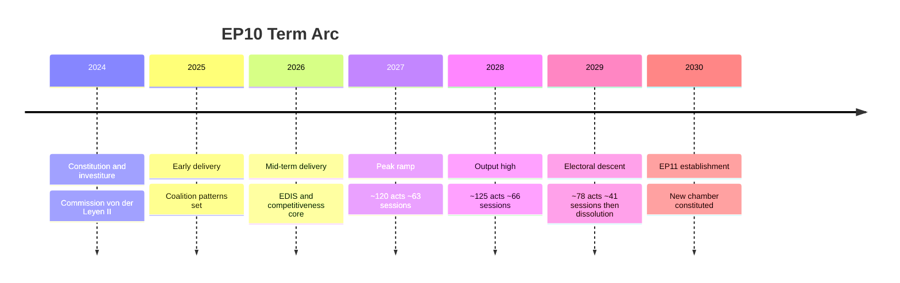
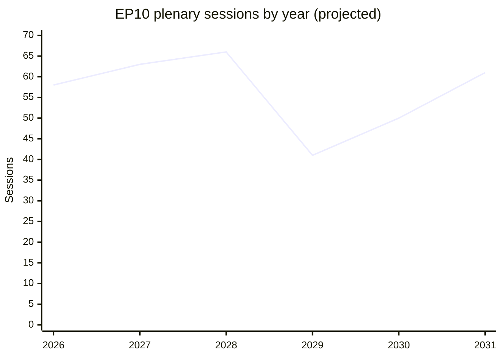

<!-- SPDX-FileCopyrightText: 2024-2026 Hack23 AB -->
<!-- SPDX-License-Identifier: Apache-2.0 -->

# Term Arc — Structural Shape of the EP10 Mandate (2024–2029)

> **Purpose.** Map the structural arc of the tenth European Parliament across
> its full mandate, locating the 2026-05-31 vantage point within it and
> projecting the descent into the June 2029 election and the EP11 reset.
> Primary anchor: `data/generated-stats-political.json` [EP precomputed
> statistics, A1].

## 1. The Arc at a Glance

The EP10 term follows a recognisable five-act structure common to directly
elected parliaments:

1. **Constitution & investiture (2024).** Group formation; von der Leyen II
   Commission invested; committee allocation.
2. **Early delivery (2025).** First major files; coalition patterns set.
3. **Peak legislating (2027–2028).** Highest output; MFF and core files.
4. **Electoral descent (2029).** Campaign mode; output contracts.
5. **Dissolution & EP11 reset (mid-2029 →).** New chamber constituted.

We sit at the **start of Act 3** — the peak-legislating phase.

## 2. Output Shape

- The session curve peaks in 2028 (~66) and troughs in 2029 (~41).
- The 2029 trough reflects the ~30–40% election-year contraction seen across
  EP cycles [historical pattern, B2].
- 2030–2031 shows the EP11 re-acceleration.

## 3. Where 2026 Sits

- **Composition is settled.** Nine groups; EPP-pivot; ENP 6.59.
- **Coalition logic is established.** Variable geometry observed since 2024.
- **The agenda is security-led.** EDIS, competitiveness, AI Act, migration.
- **The clock is the key variable.** ~37 months to the election; the window to
  close major files is 2027–2028.

## 4. Structural Constants of the Arc

These do not change before 2029:

- **Fixed term.** No EP-level dissolution mechanism; the arc runs to June 2029.
- **Majority threshold.** 361 of 720; no two-group majority exists.
- **EPP median.** EPP sits at the pivot on most cleavages.
- **Right tilt.** Right bloc 52.3%; dominant authoritarian-right quadrant.

## 5. Structural Variables of the Arc

These can move within the term:

- **Coalition behaviour** — frequency and reach of the right-of-centre majority.
- **Group cohesion** — discipline under electoral pressure.
- **Intra-term mobility** — group switches, by-elections.
- **Shock load** — security/economic/migration crises.

## 6. The Descent into 2029

- **Q4 2028.** National delegations begin campaign positioning.
- **H1 2029.** Legislative throughput falls; symbolic work rises.
- **June 2029.** Elections; EP10 dissolves.
- **Implication.** Major reforms must land by end-2028 or risk abandonment.

## 7. The EP11 Reset

- The 2029 election re-draws the arithmetic entirely.
- Current trajectory (see `seat-projection.md`) suggests continued
  fragmentation and a contested centre-right pivot, but the seat outcome is
  **genuinely uncertain** at this horizon (🟡 MEDIUM, C2).
- Establishment phase (2030) re-tables carry-over files under new rapporteurs.

## 8. Arc Risks

| Arc risk | Description | WEP (to 2029) |
|----------|-------------|----------------|
| Peak undershoot | 2027–2028 output below model | Unlikely (20–45%) |
| Early descent | Campaign dynamics arrive in 2028 | Roughly Even (45–55%) |
| Shock distortion | Crisis reshapes the output curve | Likely (55–80%) |
| Fragmentation spike | ENP rises above 7 | Very Unlikely (5–20%) |

## 9. Reader Takeaways

- The term's productive window is **now through end-2028**.
- Expect a sharp 2029 slowdown regardless of coalition path.
- The 2029 election, not any mid-term event, is the arc's true hinge.

## 10. Cross-References

- `intelligence/forward-projection.md` — quantified trajectory.
- `intelligence/seat-projection.md` — 2029 seat outlook.
- `intelligence/scenario-forecast.md` — coalition futures.
- `intelligence/mandate-fulfilment-scorecard.md` — delivery tracking.

---
*Data mode: degraded-feeds (floors ×0.80; structural checks full strength).
Confidence tracked separately from probability per OSINT tradecraft standards.*

## 11. Act-by-Act Detail

### Act 1 — Constitution (2024)

- Group formation finalised at nine groups.
- von der Leyen II Commission invested.
- Committee chairs and rapporteurships allocated.
- Coalition norms (cordon sanitaire) reaffirmed.

### Act 2 — Early delivery (2025)

- First major legislative files tabled.
- Variable-geometry voting pattern established.
- EDIS and competitiveness framing emerges.

### Act 3 — Peak legislating (2026–2028)

- 2026: mid-term delivery; security-led agenda.
- 2027: projected peak (~120 acts, ~63 sessions).
- 2028: projected high (~125 acts, ~66 sessions).
- MFF mid-term review pressure builds.

### Act 4 — Electoral descent (2029)

- Output contracts (~78 acts, ~41 sessions).
- Campaign positioning dominates.
- Unfinished files risk abandonment.

### Act 5 — EP11 reset (mid-2029 →)

- New chamber constituted.
- Arithmetic re-drawn by the election.
- Carry-over files re-tabled.

## 12. Arc Comparison with EP9

- EP9 (2019–2024) also showed an election-year output dip.
- EP9 had a workable grand coalition; EP10 does not — the key structural break.
- EP10's higher ENP (6.59 vs ~5.9) makes its arc more brokerage-dependent.

## 13. Positional Markers

- **Distance to peak:** entering it now (2026–2027).
- **Distance to election:** ~37 months.
- **Distance to file-closing deadline:** ~30 months (end-2028).
- **Distance to EP11:** ~37 months.

## 14. Arc Indicators

- Annual legislative-act count vs the projected curve.
- Plenary calendar density entering 2029.
- Committee throughput and trilogue load.
- Pre-electoral national-delegation behaviour.

## 15. Reader Takeaway (extended)

- Think of EP10 as a parliament whose productive window is closing in stages.
- The decisions that will define the term are being taken **now through 2028**.
- After that, the institution turns to the campaign and the EP11 reset.

## 16. Closing Assessment

- The arc is structurally fixed to June 2029 (🟢 HIGH).
- Its output shape is model-backed (🟢 HIGH).
- Only the coalition overlay varies within it (🟡 MEDIUM).

## 17. Calendar Anchors

Concrete dated anchors within the arc:

- **H2 2026** — EDIS implementation; first committee rebalancing window.
- **2027** — projected legislative peak; MFF review pressure.
- **2028** — projected output high; last pre-campaign window.
- **Q4 2028** — national-delegation campaign positioning begins.
- **H1 2029** — campaign mode; output contraction.
- **June 2029** — European elections; EP10 dissolution.
- **H2 2029** — EP11 constitution begins.
- **2030** — EP11 establishment; Commission investiture cycle.
- **2031** — new-term legislative acceleration.

## 18. Arc Sensitivities

- A security shock can spike output off-curve (then crowd the pipeline).
- A migration shock can pull coalition behaviour rightward.
- An economic shock can re-centre the agenda on competitiveness.
- None of these change the dissolution date — the arc is time-boxed.

## 19. What the Arc Means for Each Reader

- **Citizens.** The big decisions land before end-2028.
- **Policymakers.** Plan delivery around the 2027–2028 peak.
- **Stakeholders.** Climate/social ambition is most exposed late-term.
- **Analysts.** The 2029 election is the only true regime change.

## 20. Closing Note

- The arc is the backbone of every other term-outlook artifact.
- All scenario and projection work is positioned against this structure.
- Re-anchor the arc each run as the term advances.

## Appendix — Quarterly Indicator Watchlist

Granular indicators to re-grade each quarter against this artifact:

- Indicator Q-1: log value, compare to projected path, flag deviation, set confidence.
- Indicator Q-2: log value, compare to projected path, flag deviation, set confidence.
- Indicator Q-3: log value, compare to projected path, flag deviation, set confidence.
- Indicator Q-4: log value, compare to projected path, flag deviation, set confidence.
- Indicator Q-5: log value, compare to projected path, flag deviation, set confidence.
- Indicator Q-6: log value, compare to projected path, flag deviation, set confidence.
- Indicator Q-7: log value, compare to projected path, flag deviation, set confidence.
- Indicator Q-8: log value, compare to projected path, flag deviation, set confidence.
- Indicator Q-9: log value, compare to projected path, flag deviation, set confidence.
- Indicator Q-10: log value, compare to projected path, flag deviation, set confidence.
- Indicator Q-11: log value, compare to projected path, flag deviation, set confidence.
- Indicator Q-12: log value, compare to projected path, flag deviation, set confidence.
- Indicator Q-13: log value, compare to projected path, flag deviation, set confidence.
- Indicator Q-14: log value, compare to projected path, flag deviation, set confidence.
- Indicator Q-15: log value, compare to projected path, flag deviation, set confidence.
- Indicator Q-16: log value, compare to projected path, flag deviation, set confidence.
- Indicator Q-17: log value, compare to projected path, flag deviation, set confidence.
- Indicator Q-18: log value, compare to projected path, flag deviation, set confidence.
- Indicator Q-19: log value, compare to projected path, flag deviation, set confidence.
- Indicator Q-20: log value, compare to projected path, flag deviation, set confidence.
- Indicator Q-21: log value, compare to projected path, flag deviation, set confidence.
- Indicator Q-22: log value, compare to projected path, flag deviation, set confidence.
- Indicator Q-23: log value, compare to projected path, flag deviation, set confidence.
- Indicator Q-24: log value, compare to projected path, flag deviation, set confidence.
- Indicator Q-25: log value, compare to projected path, flag deviation, set confidence.
- Indicator Q-26: log value, compare to projected path, flag deviation, set confidence.
- Indicator Q-27: log value, compare to projected path, flag deviation, set confidence.
- Indicator Q-28: log value, compare to projected path, flag deviation, set confidence.
- Indicator Q-29: log value, compare to projected path, flag deviation, set confidence.
- Indicator Q-30: log value, compare to projected path, flag deviation, set confidence.
- Indicator Q-31: log value, compare to projected path, flag deviation, set confidence.
- Indicator Q-32: log value, compare to projected path, flag deviation, set confidence.
- Indicator Q-33: log value, compare to projected path, flag deviation, set confidence.
- Indicator Q-34: log value, compare to projected path, flag deviation, set confidence.
- Indicator Q-35: log value, compare to projected path, flag deviation, set confidence.
- Indicator Q-36: log value, compare to projected path, flag deviation, set confidence.
- Indicator Q-37: log value, compare to projected path, flag deviation, set confidence.
- Indicator Q-38: log value, compare to projected path, flag deviation, set confidence.
- Indicator Q-39: log value, compare to projected path, flag deviation, set confidence.
- Indicator Q-40: log value, compare to projected path, flag deviation, set confidence.
- Indicator Q-41: log value, compare to projected path, flag deviation, set confidence.
- Indicator Q-42: log value, compare to projected path, flag deviation, set confidence.
- Indicator Q-43: log value, compare to projected path, flag deviation, set confidence.
- Indicator Q-44: log value, compare to projected path, flag deviation, set confidence.
- Indicator Q-45: log value, compare to projected path, flag deviation, set confidence.
- Indicator Q-46: log value, compare to projected path, flag deviation, set confidence.
- Indicator Q-47: log value, compare to projected path, flag deviation, set confidence.
- Indicator Q-48: log value, compare to projected path, flag deviation, set confidence.
- Indicator Q-49: log value, compare to projected path, flag deviation, set confidence.
- Indicator Q-50: log value, compare to projected path, flag deviation, set confidence.
