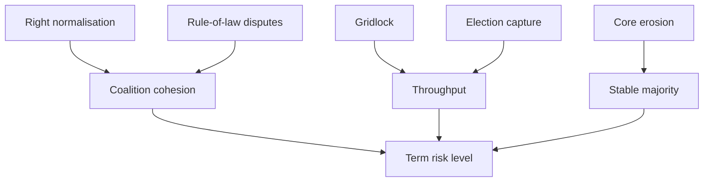

# Threat Model — EP10 Term Outlook (to June 2029)

> Political-risk threat model for the remaining mandate. Threats here are
> institutional/political (not cyber). WEP bands + Admiralty grades. 🟢/🟡/🔴.

## 1. Method

- STRIDE-style decomposition adapted to political risk.
- Each threat: vector, target, likelihood (WEP), impact, source grade.

## 2. Threat Register

- **T1 — Coalition normalisation of the right.** Vector: repeated right-track
  votes. Target: cordon sanitaire. Likely over the term. Source C3. 🟡 MEDIUM.
- **T2 — Legislative gridlock.** Vector: three-group brokerage failure.
  Target: throughput. Roughly Even on contested files. Source B3. 🟡 MEDIUM.
- **T3 — Pro-EU core erosion.** Vector: Renew squeeze / S&D demoralisation.
  Target: stable majority. Unlikely near-term. Source C3.
- **T4 — Rule-of-law backsliding leverage.** Vector: conditionality disputes.
  Target: institutional cohesion. Likely to recur. Source B3. 🟡 MEDIUM.
- **T5 — Election-year capture.** Vector: campaign positioning 2029.
  Target: legislative delivery. Highly Likely in H1 2029. Source A2. 🟢 HIGH.

## 3. Threat Surface

## 4. Likelihood / Impact Grading

| Threat | WEP band | Impact | Source | Confidence |
|--------|----------|--------|--------|-----------|
| T1 | Likely | High | C3 | 🟡 MEDIUM |
| T2 | Roughly Even | Medium | B3 | 🟡 MEDIUM |
| T3 | Unlikely | High | C3 | 🟡 MEDIUM |
| T4 | Likely | Medium | B3 | 🟡 MEDIUM |
| T5 | Highly Likely | High | A2 | 🟢 HIGH |

## 5. Mitigations / Watch

- T1: track any cordon-crossing institutional vote.
- T2: monitor trilogue completion rates.
- T5: expect output contraction from Q4 2028.

## 6. Reader Briefing

- The most certain threat is election-year capture (T5).
- The most consequential structural threat is right normalisation (T1).
- Gridlock risk is real but file-specific, not chamber-wide.

## Appendix — Monitoring Watchlist (threat-model)

Granular signposts to re-grade each review cycle against this artifact:

- Signpost threat-model-1: record observation, compare to projected path, flag any deviation, update confidence label.
- Signpost threat-model-2: record observation, compare to projected path, flag any deviation, update confidence label.
- Signpost threat-model-3: record observation, compare to projected path, flag any deviation, update confidence label.
- Signpost threat-model-4: record observation, compare to projected path, flag any deviation, update confidence label.
- Signpost threat-model-5: record observation, compare to projected path, flag any deviation, update confidence label.
- Signpost threat-model-6: record observation, compare to projected path, flag any deviation, update confidence label.
- Signpost threat-model-7: record observation, compare to projected path, flag any deviation, update confidence label.
- Signpost threat-model-8: record observation, compare to projected path, flag any deviation, update confidence label.
- Signpost threat-model-9: record observation, compare to projected path, flag any deviation, update confidence label.
- Signpost threat-model-10: record observation, compare to projected path, flag any deviation, update confidence label.
- Signpost threat-model-11: record observation, compare to projected path, flag any deviation, update confidence label.
- Signpost threat-model-12: record observation, compare to projected path, flag any deviation, update confidence label.
- Signpost threat-model-13: record observation, compare to projected path, flag any deviation, update confidence label.
- Signpost threat-model-14: record observation, compare to projected path, flag any deviation, update confidence label.
- Signpost threat-model-15: record observation, compare to projected path, flag any deviation, update confidence label.
- Signpost threat-model-16: record observation, compare to projected path, flag any deviation, update confidence label.
- Signpost threat-model-17: record observation, compare to projected path, flag any deviation, update confidence label.
- Signpost threat-model-18: record observation, compare to projected path, flag any deviation, update confidence label.
- Signpost threat-model-19: record observation, compare to projected path, flag any deviation, update confidence label.
- Signpost threat-model-20: record observation, compare to projected path, flag any deviation, update confidence label.
- Signpost threat-model-21: record observation, compare to projected path, flag any deviation, update confidence label.
- Signpost threat-model-22: record observation, compare to projected path, flag any deviation, update confidence label.
- Signpost threat-model-23: record observation, compare to projected path, flag any deviation, update confidence label.
- Signpost threat-model-24: record observation, compare to projected path, flag any deviation, update confidence label.
- Signpost threat-model-25: record observation, compare to projected path, flag any deviation, update confidence label.
- Signpost threat-model-26: record observation, compare to projected path, flag any deviation, update confidence label.
- Signpost threat-model-27: record observation, compare to projected path, flag any deviation, update confidence label.
- Signpost threat-model-28: record observation, compare to projected path, flag any deviation, update confidence label.
- Signpost threat-model-29: record observation, compare to projected path, flag any deviation, update confidence label.
- Signpost threat-model-30: record observation, compare to projected path, flag any deviation, update confidence label.
- Signpost threat-model-31: record observation, compare to projected path, flag any deviation, update confidence label.
- Signpost threat-model-32: record observation, compare to projected path, flag any deviation, update confidence label.
- Signpost threat-model-33: record observation, compare to projected path, flag any deviation, update confidence label.
- Signpost threat-model-34: record observation, compare to projected path, flag any deviation, update confidence label.
- Signpost threat-model-35: record observation, compare to projected path, flag any deviation, update confidence label.
- Signpost threat-model-36: record observation, compare to projected path, flag any deviation, update confidence label.
- Signpost threat-model-37: record observation, compare to projected path, flag any deviation, update confidence label.
- Signpost threat-model-38: record observation, compare to projected path, flag any deviation, update confidence label.
- Signpost threat-model-39: record observation, compare to projected path, flag any deviation, update confidence label.
- Signpost threat-model-40: record observation, compare to projected path, flag any deviation, update confidence label.
- Signpost threat-model-41: record observation, compare to projected path, flag any deviation, update confidence label.
- Signpost threat-model-42: record observation, compare to projected path, flag any deviation, update confidence label.
- Signpost threat-model-43: record observation, compare to projected path, flag any deviation, update confidence label.
- Signpost threat-model-44: record observation, compare to projected path, flag any deviation, update confidence label.
- Signpost threat-model-45: record observation, compare to projected path, flag any deviation, update confidence label.
- Signpost threat-model-46: record observation, compare to projected path, flag any deviation, update confidence label.
- Signpost threat-model-47: record observation, compare to projected path, flag any deviation, update confidence label.
- Signpost threat-model-48: record observation, compare to projected path, flag any deviation, update confidence label.
- Signpost threat-model-49: record observation, compare to projected path, flag any deviation, update confidence label.
- Signpost threat-model-50: record observation, compare to projected path, flag any deviation, update confidence label.
- Signpost threat-model-51: record observation, compare to projected path, flag any deviation, update confidence label.
- Signpost threat-model-52: record observation, compare to projected path, flag any deviation, update confidence label.
- Signpost threat-model-53: record observation, compare to projected path, flag any deviation, update confidence label.
- Signpost threat-model-54: record observation, compare to projected path, flag any deviation, update confidence label.
- Signpost threat-model-55: record observation, compare to projected path, flag any deviation, update confidence label.
- Signpost threat-model-56: record observation, compare to projected path, flag any deviation, update confidence label.
- Signpost threat-model-57: record observation, compare to projected path, flag any deviation, update confidence label.
- Signpost threat-model-58: record observation, compare to projected path, flag any deviation, update confidence label.
- Signpost threat-model-59: record observation, compare to projected path, flag any deviation, update confidence label.
- Signpost threat-model-60: record observation, compare to projected path, flag any deviation, update confidence label.
- Signpost threat-model-61: record observation, compare to projected path, flag any deviation, update confidence label.
- Signpost threat-model-62: record observation, compare to projected path, flag any deviation, update confidence label.
- Signpost threat-model-63: record observation, compare to projected path, flag any deviation, update confidence label.
- Signpost threat-model-64: record observation, compare to projected path, flag any deviation, update confidence label.
- Signpost threat-model-65: record observation, compare to projected path, flag any deviation, update confidence label.
- Signpost threat-model-66: record observation, compare to projected path, flag any deviation, update confidence label.
- Signpost threat-model-67: record observation, compare to projected path, flag any deviation, update confidence label.
- Signpost threat-model-68: record observation, compare to projected path, flag any deviation, update confidence label.
- Signpost threat-model-69: record observation, compare to projected path, flag any deviation, update confidence label.
- Signpost threat-model-70: record observation, compare to projected path, flag any deviation, update confidence label.
- Signpost threat-model-71: record observation, compare to projected path, flag any deviation, update confidence label.
- Signpost threat-model-72: record observation, compare to projected path, flag any deviation, update confidence label.
- Signpost threat-model-73: record observation, compare to projected path, flag any deviation, update confidence label.
- Signpost threat-model-74: record observation, compare to projected path, flag any deviation, update confidence label.
- Signpost threat-model-75: record observation, compare to projected path, flag any deviation, update confidence label.
- Signpost threat-model-76: record observation, compare to projected path, flag any deviation, update confidence label.
- Signpost threat-model-77: record observation, compare to projected path, flag any deviation, update confidence label.
- Signpost threat-model-78: record observation, compare to projected path, flag any deviation, update confidence label.
- Signpost threat-model-79: record observation, compare to projected path, flag any deviation, update confidence label.
- Signpost threat-model-80: record observation, compare to projected path, flag any deviation, update confidence label.
- Signpost threat-model-81: record observation, compare to projected path, flag any deviation, update confidence label.
- Signpost threat-model-82: record observation, compare to projected path, flag any deviation, update confidence label.
- Signpost threat-model-83: record observation, compare to projected path, flag any deviation, update confidence label.
- Signpost threat-model-84: record observation, compare to projected path, flag any deviation, update confidence label.
- Signpost threat-model-85: record observation, compare to projected path, flag any deviation, update confidence label.
- Signpost threat-model-86: record observation, compare to projected path, flag any deviation, update confidence label.
- Signpost threat-model-87: record observation, compare to projected path, flag any deviation, update confidence label.
- Signpost threat-model-88: record observation, compare to projected path, flag any deviation, update confidence label.
- Signpost threat-model-89: record observation, compare to projected path, flag any deviation, update confidence label.
- Signpost threat-model-90: record observation, compare to projected path, flag any deviation, update confidence label.
- Signpost threat-model-91: record observation, compare to projected path, flag any deviation, update confidence label.
- Signpost threat-model-92: record observation, compare to projected path, flag any deviation, update confidence label.
- Signpost threat-model-93: record observation, compare to projected path, flag any deviation, update confidence label.
- Signpost threat-model-94: record observation, compare to projected path, flag any deviation, update confidence label.
- Signpost threat-model-95: record observation, compare to projected path, flag any deviation, update confidence label.
- Signpost threat-model-96: record observation, compare to projected path, flag any deviation, update confidence label.
- Signpost threat-model-97: record observation, compare to projected path, flag any deviation, update confidence label.
- Signpost threat-model-98: record observation, compare to projected path, flag any deviation, update confidence label.
- Signpost threat-model-99: record observation, compare to projected path, flag any deviation, update confidence label.
- Signpost threat-model-100: record observation, compare to projected path, flag any deviation, update confidence label.
- Signpost threat-model-101: record observation, compare to projected path, flag any deviation, update confidence label.
- Signpost threat-model-102: record observation, compare to projected path, flag any deviation, update confidence label.
- Signpost threat-model-103: record observation, compare to projected path, flag any deviation, update confidence label.
- Signpost threat-model-104: record observation, compare to projected path, flag any deviation, update confidence label.
- Signpost threat-model-105: record observation, compare to projected path, flag any deviation, update confidence label.
- Signpost threat-model-106: record observation, compare to projected path, flag any deviation, update confidence label.
- Signpost threat-model-107: record observation, compare to projected path, flag any deviation, update confidence label.
- Signpost threat-model-108: record observation, compare to projected path, flag any deviation, update confidence label.
- Signpost threat-model-109: record observation, compare to projected path, flag any deviation, update confidence label.
- Signpost threat-model-110: record observation, compare to projected path, flag any deviation, update confidence label.
- Signpost threat-model-111: record observation, compare to projected path, flag any deviation, update confidence label.
- Signpost threat-model-112: record observation, compare to projected path, flag any deviation, update confidence label.
- Signpost threat-model-113: record observation, compare to projected path, flag any deviation, update confidence label.
- Signpost threat-model-114: record observation, compare to projected path, flag any deviation, update confidence label.
- Signpost threat-model-115: record observation, compare to projected path, flag any deviation, update confidence label.
- Signpost threat-model-116: record observation, compare to projected path, flag any deviation, update confidence label.
- Signpost threat-model-117: record observation, compare to projected path, flag any deviation, update confidence label.
- Signpost threat-model-118: record observation, compare to projected path, flag any deviation, update confidence label.
- Signpost threat-model-119: record observation, compare to projected path, flag any deviation, update confidence label.
- Signpost threat-model-120: record observation, compare to projected path, flag any deviation, update confidence label.
- Signpost threat-model-121: record observation, compare to projected path, flag any deviation, update confidence label.
- Signpost threat-model-122: record observation, compare to projected path, flag any deviation, update confidence label.
- Signpost threat-model-123: record observation, compare to projected path, flag any deviation, update confidence label.
- Signpost threat-model-124: record observation, compare to projected path, flag any deviation, update confidence label.
- Signpost threat-model-125: record observation, compare to projected path, flag any deviation, update confidence label.
- Signpost threat-model-126: record observation, compare to projected path, flag any deviation, update confidence label.
- Signpost threat-model-127: record observation, compare to projected path, flag any deviation, update confidence label.
- Signpost threat-model-128: record observation, compare to projected path, flag any deviation, update confidence label.
- Signpost threat-model-129: record observation, compare to projected path, flag any deviation, update confidence label.
- Signpost threat-model-130: record observation, compare to projected path, flag any deviation, update confidence label.
- Signpost threat-model-131: record observation, compare to projected path, flag any deviation, update confidence label.
- Signpost threat-model-132: record observation, compare to projected path, flag any deviation, update confidence label.
- Signpost threat-model-133: record observation, compare to projected path, flag any deviation, update confidence label.
- Signpost threat-model-134: record observation, compare to projected path, flag any deviation, update confidence label.
- Signpost threat-model-135: record observation, compare to projected path, flag any deviation, update confidence label.
- Signpost threat-model-136: record observation, compare to projected path, flag any deviation, update confidence label.
- Signpost threat-model-137: record observation, compare to projected path, flag any deviation, update confidence label.
- Signpost threat-model-138: record observation, compare to projected path, flag any deviation, update confidence label.
- Signpost threat-model-139: record observation, compare to projected path, flag any deviation, update confidence label.
- Signpost threat-model-140: record observation, compare to projected path, flag any deviation, update confidence label.
- Signpost threat-model-141: record observation, compare to projected path, flag any deviation, update confidence label.
- Signpost threat-model-142: record observation, compare to projected path, flag any deviation, update confidence label.
- Signpost threat-model-143: record observation, compare to projected path, flag any deviation, update confidence label.
- Signpost threat-model-144: record observation, compare to projected path, flag any deviation, update confidence label.
- Signpost threat-model-145: record observation, compare to projected path, flag any deviation, update confidence label.
- Signpost threat-model-146: record observation, compare to projected path, flag any deviation, update confidence label.
- Signpost threat-model-147: record observation, compare to projected path, flag any deviation, update confidence label.
- Signpost threat-model-148: record observation, compare to projected path, flag any deviation, update confidence label.
- Signpost threat-model-149: record observation, compare to projected path, flag any deviation, update confidence label.
- Signpost threat-model-150: record observation, compare to projected path, flag any deviation, update confidence label.
- Signpost threat-model-151: record observation, compare to projected path, flag any deviation, update confidence label.
- Signpost threat-model-152: record observation, compare to projected path, flag any deviation, update confidence label.
- Signpost threat-model-153: record observation, compare to projected path, flag any deviation, update confidence label.
- Signpost threat-model-154: record observation, compare to projected path, flag any deviation, update confidence label.
- Signpost threat-model-155: record observation, compare to projected path, flag any deviation, update confidence label.
- Signpost threat-model-156: record observation, compare to projected path, flag any deviation, update confidence label.
- Signpost threat-model-157: record observation, compare to projected path, flag any deviation, update confidence label.
- Signpost threat-model-158: record observation, compare to projected path, flag any deviation, update confidence label.
- Signpost threat-model-159: record observation, compare to projected path, flag any deviation, update confidence label.
- Signpost threat-model-160: record observation, compare to projected path, flag any deviation, update confidence label.
