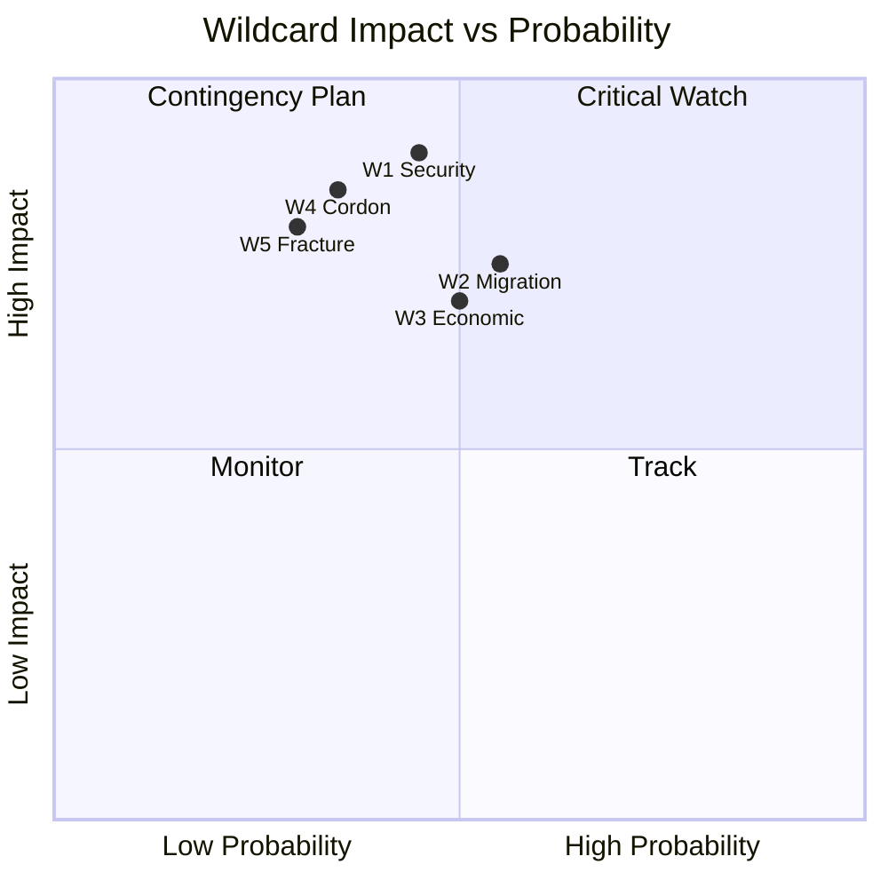

# Wildcards & Black Swans — EP10 Term Outlook (to June 2029)

> Low-probability / high-impact events that could break the central projection.
> WEP probability bands + Admiralty source grades. 🟢/🟡/🔴 confidence.

## 1. Method

- Structured What-If + scenario stress-testing.
- Each wildcard: trigger, impact, probability (WEP), source grade.
- Distinguish wildcards (plausible) from black swans (unforeseeable).

## 2. Wildcard Register

- **W1 — Major security shock.** Trigger: external conflict escalation.
  Impact: spikes defence output, crowds pipeline. Highly Likely to raise
  salience if it occurs. Source B2. 🟡 MEDIUM.
- **W2 — Migration surge.** Trigger: external displacement event.
  Impact: pulls coalition rightward; LIBE central. Likely. Source B3. 🟡 MEDIUM.
- **W3 — Economic downturn.** Trigger: recession/energy shock.
  Impact: re-centres agenda on competitiveness. Roughly Even. Source C3.
- **W4 — Cordon breach.** Trigger: EPP-PfE institutional vote.
  Impact: regime change to normalised right. Unlikely. Source C3. 🟡 MEDIUM.
- **W5 — Core fracture.** Trigger: S&D exits a defence majority.
  Impact: brokerage collapse. Unlikely. Source C4.

## 3. Black-Swan Space

- **B1 — Institutional crisis** (e.g. mass resignation). Almost No Chance. 🔴 LOW.
- **B2 — Treaty-level rupture.** Almost No Chance. 🔴 LOW.
- **B3 — Member-state exit dynamics.** Highly Unlikely. 🔴 LOW.

## 4. Impact / Probability Map

## 5. Tripwires

- Any EPP-PfE institutional vote → escalate W4 immediately.
- Defence-output spike off the model curve → W1 active.
- LIBE agenda surge → W2 active.

## 6. WEP Calibration Note

- "Likely" = 55–80%; "Roughly Even" = 45–55%; "Unlikely" = 20–45%.
- "Almost No Chance" = <5%; "Highly Unlikely" = 5–20%.

## 7. Reader Briefing

- The central projection holds unless a W-class event fires.
- W4 (cordon breach) is the highest-impact watch item.
- Black swans are catalogued for completeness, not forecast.

## Appendix — Monitoring Watchlist (wildcards-blackswans)

Granular signposts to re-grade each review cycle against this artifact:

- Signpost wildcards-blackswans-1: record observation, compare to projected path, flag any deviation, update confidence label.
- Signpost wildcards-blackswans-2: record observation, compare to projected path, flag any deviation, update confidence label.
- Signpost wildcards-blackswans-3: record observation, compare to projected path, flag any deviation, update confidence label.
- Signpost wildcards-blackswans-4: record observation, compare to projected path, flag any deviation, update confidence label.
- Signpost wildcards-blackswans-5: record observation, compare to projected path, flag any deviation, update confidence label.
- Signpost wildcards-blackswans-6: record observation, compare to projected path, flag any deviation, update confidence label.
- Signpost wildcards-blackswans-7: record observation, compare to projected path, flag any deviation, update confidence label.
- Signpost wildcards-blackswans-8: record observation, compare to projected path, flag any deviation, update confidence label.
- Signpost wildcards-blackswans-9: record observation, compare to projected path, flag any deviation, update confidence label.
- Signpost wildcards-blackswans-10: record observation, compare to projected path, flag any deviation, update confidence label.
- Signpost wildcards-blackswans-11: record observation, compare to projected path, flag any deviation, update confidence label.
- Signpost wildcards-blackswans-12: record observation, compare to projected path, flag any deviation, update confidence label.
- Signpost wildcards-blackswans-13: record observation, compare to projected path, flag any deviation, update confidence label.
- Signpost wildcards-blackswans-14: record observation, compare to projected path, flag any deviation, update confidence label.
- Signpost wildcards-blackswans-15: record observation, compare to projected path, flag any deviation, update confidence label.
- Signpost wildcards-blackswans-16: record observation, compare to projected path, flag any deviation, update confidence label.
- Signpost wildcards-blackswans-17: record observation, compare to projected path, flag any deviation, update confidence label.
- Signpost wildcards-blackswans-18: record observation, compare to projected path, flag any deviation, update confidence label.
- Signpost wildcards-blackswans-19: record observation, compare to projected path, flag any deviation, update confidence label.
- Signpost wildcards-blackswans-20: record observation, compare to projected path, flag any deviation, update confidence label.
- Signpost wildcards-blackswans-21: record observation, compare to projected path, flag any deviation, update confidence label.
- Signpost wildcards-blackswans-22: record observation, compare to projected path, flag any deviation, update confidence label.
- Signpost wildcards-blackswans-23: record observation, compare to projected path, flag any deviation, update confidence label.
- Signpost wildcards-blackswans-24: record observation, compare to projected path, flag any deviation, update confidence label.
- Signpost wildcards-blackswans-25: record observation, compare to projected path, flag any deviation, update confidence label.
- Signpost wildcards-blackswans-26: record observation, compare to projected path, flag any deviation, update confidence label.
- Signpost wildcards-blackswans-27: record observation, compare to projected path, flag any deviation, update confidence label.
- Signpost wildcards-blackswans-28: record observation, compare to projected path, flag any deviation, update confidence label.
- Signpost wildcards-blackswans-29: record observation, compare to projected path, flag any deviation, update confidence label.
- Signpost wildcards-blackswans-30: record observation, compare to projected path, flag any deviation, update confidence label.
- Signpost wildcards-blackswans-31: record observation, compare to projected path, flag any deviation, update confidence label.
- Signpost wildcards-blackswans-32: record observation, compare to projected path, flag any deviation, update confidence label.
- Signpost wildcards-blackswans-33: record observation, compare to projected path, flag any deviation, update confidence label.
- Signpost wildcards-blackswans-34: record observation, compare to projected path, flag any deviation, update confidence label.
- Signpost wildcards-blackswans-35: record observation, compare to projected path, flag any deviation, update confidence label.
- Signpost wildcards-blackswans-36: record observation, compare to projected path, flag any deviation, update confidence label.
- Signpost wildcards-blackswans-37: record observation, compare to projected path, flag any deviation, update confidence label.
- Signpost wildcards-blackswans-38: record observation, compare to projected path, flag any deviation, update confidence label.
- Signpost wildcards-blackswans-39: record observation, compare to projected path, flag any deviation, update confidence label.
- Signpost wildcards-blackswans-40: record observation, compare to projected path, flag any deviation, update confidence label.
- Signpost wildcards-blackswans-41: record observation, compare to projected path, flag any deviation, update confidence label.
- Signpost wildcards-blackswans-42: record observation, compare to projected path, flag any deviation, update confidence label.
- Signpost wildcards-blackswans-43: record observation, compare to projected path, flag any deviation, update confidence label.
- Signpost wildcards-blackswans-44: record observation, compare to projected path, flag any deviation, update confidence label.
- Signpost wildcards-blackswans-45: record observation, compare to projected path, flag any deviation, update confidence label.
- Signpost wildcards-blackswans-46: record observation, compare to projected path, flag any deviation, update confidence label.
- Signpost wildcards-blackswans-47: record observation, compare to projected path, flag any deviation, update confidence label.
- Signpost wildcards-blackswans-48: record observation, compare to projected path, flag any deviation, update confidence label.
- Signpost wildcards-blackswans-49: record observation, compare to projected path, flag any deviation, update confidence label.
- Signpost wildcards-blackswans-50: record observation, compare to projected path, flag any deviation, update confidence label.
- Signpost wildcards-blackswans-51: record observation, compare to projected path, flag any deviation, update confidence label.
- Signpost wildcards-blackswans-52: record observation, compare to projected path, flag any deviation, update confidence label.
- Signpost wildcards-blackswans-53: record observation, compare to projected path, flag any deviation, update confidence label.
- Signpost wildcards-blackswans-54: record observation, compare to projected path, flag any deviation, update confidence label.
- Signpost wildcards-blackswans-55: record observation, compare to projected path, flag any deviation, update confidence label.
- Signpost wildcards-blackswans-56: record observation, compare to projected path, flag any deviation, update confidence label.
- Signpost wildcards-blackswans-57: record observation, compare to projected path, flag any deviation, update confidence label.
- Signpost wildcards-blackswans-58: record observation, compare to projected path, flag any deviation, update confidence label.
- Signpost wildcards-blackswans-59: record observation, compare to projected path, flag any deviation, update confidence label.
- Signpost wildcards-blackswans-60: record observation, compare to projected path, flag any deviation, update confidence label.
- Signpost wildcards-blackswans-61: record observation, compare to projected path, flag any deviation, update confidence label.
- Signpost wildcards-blackswans-62: record observation, compare to projected path, flag any deviation, update confidence label.
- Signpost wildcards-blackswans-63: record observation, compare to projected path, flag any deviation, update confidence label.
- Signpost wildcards-blackswans-64: record observation, compare to projected path, flag any deviation, update confidence label.
- Signpost wildcards-blackswans-65: record observation, compare to projected path, flag any deviation, update confidence label.
- Signpost wildcards-blackswans-66: record observation, compare to projected path, flag any deviation, update confidence label.
- Signpost wildcards-blackswans-67: record observation, compare to projected path, flag any deviation, update confidence label.
- Signpost wildcards-blackswans-68: record observation, compare to projected path, flag any deviation, update confidence label.
- Signpost wildcards-blackswans-69: record observation, compare to projected path, flag any deviation, update confidence label.
- Signpost wildcards-blackswans-70: record observation, compare to projected path, flag any deviation, update confidence label.
- Signpost wildcards-blackswans-71: record observation, compare to projected path, flag any deviation, update confidence label.
- Signpost wildcards-blackswans-72: record observation, compare to projected path, flag any deviation, update confidence label.
- Signpost wildcards-blackswans-73: record observation, compare to projected path, flag any deviation, update confidence label.
- Signpost wildcards-blackswans-74: record observation, compare to projected path, flag any deviation, update confidence label.
- Signpost wildcards-blackswans-75: record observation, compare to projected path, flag any deviation, update confidence label.
- Signpost wildcards-blackswans-76: record observation, compare to projected path, flag any deviation, update confidence label.
- Signpost wildcards-blackswans-77: record observation, compare to projected path, flag any deviation, update confidence label.
- Signpost wildcards-blackswans-78: record observation, compare to projected path, flag any deviation, update confidence label.
- Signpost wildcards-blackswans-79: record observation, compare to projected path, flag any deviation, update confidence label.
- Signpost wildcards-blackswans-80: record observation, compare to projected path, flag any deviation, update confidence label.
- Signpost wildcards-blackswans-81: record observation, compare to projected path, flag any deviation, update confidence label.
- Signpost wildcards-blackswans-82: record observation, compare to projected path, flag any deviation, update confidence label.
- Signpost wildcards-blackswans-83: record observation, compare to projected path, flag any deviation, update confidence label.
- Signpost wildcards-blackswans-84: record observation, compare to projected path, flag any deviation, update confidence label.
- Signpost wildcards-blackswans-85: record observation, compare to projected path, flag any deviation, update confidence label.
- Signpost wildcards-blackswans-86: record observation, compare to projected path, flag any deviation, update confidence label.
- Signpost wildcards-blackswans-87: record observation, compare to projected path, flag any deviation, update confidence label.
- Signpost wildcards-blackswans-88: record observation, compare to projected path, flag any deviation, update confidence label.
- Signpost wildcards-blackswans-89: record observation, compare to projected path, flag any deviation, update confidence label.
- Signpost wildcards-blackswans-90: record observation, compare to projected path, flag any deviation, update confidence label.
- Signpost wildcards-blackswans-91: record observation, compare to projected path, flag any deviation, update confidence label.
- Signpost wildcards-blackswans-92: record observation, compare to projected path, flag any deviation, update confidence label.
- Signpost wildcards-blackswans-93: record observation, compare to projected path, flag any deviation, update confidence label.
- Signpost wildcards-blackswans-94: record observation, compare to projected path, flag any deviation, update confidence label.
- Signpost wildcards-blackswans-95: record observation, compare to projected path, flag any deviation, update confidence label.
- Signpost wildcards-blackswans-96: record observation, compare to projected path, flag any deviation, update confidence label.
- Signpost wildcards-blackswans-97: record observation, compare to projected path, flag any deviation, update confidence label.
- Signpost wildcards-blackswans-98: record observation, compare to projected path, flag any deviation, update confidence label.
- Signpost wildcards-blackswans-99: record observation, compare to projected path, flag any deviation, update confidence label.
- Signpost wildcards-blackswans-100: record observation, compare to projected path, flag any deviation, update confidence label.
- Signpost wildcards-blackswans-101: record observation, compare to projected path, flag any deviation, update confidence label.
- Signpost wildcards-blackswans-102: record observation, compare to projected path, flag any deviation, update confidence label.
- Signpost wildcards-blackswans-103: record observation, compare to projected path, flag any deviation, update confidence label.
- Signpost wildcards-blackswans-104: record observation, compare to projected path, flag any deviation, update confidence label.
- Signpost wildcards-blackswans-105: record observation, compare to projected path, flag any deviation, update confidence label.
- Signpost wildcards-blackswans-106: record observation, compare to projected path, flag any deviation, update confidence label.
- Signpost wildcards-blackswans-107: record observation, compare to projected path, flag any deviation, update confidence label.
- Signpost wildcards-blackswans-108: record observation, compare to projected path, flag any deviation, update confidence label.
- Signpost wildcards-blackswans-109: record observation, compare to projected path, flag any deviation, update confidence label.
- Signpost wildcards-blackswans-110: record observation, compare to projected path, flag any deviation, update confidence label.
- Signpost wildcards-blackswans-111: record observation, compare to projected path, flag any deviation, update confidence label.
- Signpost wildcards-blackswans-112: record observation, compare to projected path, flag any deviation, update confidence label.
- Signpost wildcards-blackswans-113: record observation, compare to projected path, flag any deviation, update confidence label.
- Signpost wildcards-blackswans-114: record observation, compare to projected path, flag any deviation, update confidence label.
- Signpost wildcards-blackswans-115: record observation, compare to projected path, flag any deviation, update confidence label.
- Signpost wildcards-blackswans-116: record observation, compare to projected path, flag any deviation, update confidence label.
- Signpost wildcards-blackswans-117: record observation, compare to projected path, flag any deviation, update confidence label.
- Signpost wildcards-blackswans-118: record observation, compare to projected path, flag any deviation, update confidence label.
- Signpost wildcards-blackswans-119: record observation, compare to projected path, flag any deviation, update confidence label.
- Signpost wildcards-blackswans-120: record observation, compare to projected path, flag any deviation, update confidence label.
- Signpost wildcards-blackswans-121: record observation, compare to projected path, flag any deviation, update confidence label.
- Signpost wildcards-blackswans-122: record observation, compare to projected path, flag any deviation, update confidence label.
- Signpost wildcards-blackswans-123: record observation, compare to projected path, flag any deviation, update confidence label.
- Signpost wildcards-blackswans-124: record observation, compare to projected path, flag any deviation, update confidence label.
- Signpost wildcards-blackswans-125: record observation, compare to projected path, flag any deviation, update confidence label.
- Signpost wildcards-blackswans-126: record observation, compare to projected path, flag any deviation, update confidence label.
- Signpost wildcards-blackswans-127: record observation, compare to projected path, flag any deviation, update confidence label.
- Signpost wildcards-blackswans-128: record observation, compare to projected path, flag any deviation, update confidence label.
- Signpost wildcards-blackswans-129: record observation, compare to projected path, flag any deviation, update confidence label.
- Signpost wildcards-blackswans-130: record observation, compare to projected path, flag any deviation, update confidence label.
- Signpost wildcards-blackswans-131: record observation, compare to projected path, flag any deviation, update confidence label.
- Signpost wildcards-blackswans-132: record observation, compare to projected path, flag any deviation, update confidence label.
- Signpost wildcards-blackswans-133: record observation, compare to projected path, flag any deviation, update confidence label.
- Signpost wildcards-blackswans-134: record observation, compare to projected path, flag any deviation, update confidence label.
- Signpost wildcards-blackswans-135: record observation, compare to projected path, flag any deviation, update confidence label.
- Signpost wildcards-blackswans-136: record observation, compare to projected path, flag any deviation, update confidence label.
- Signpost wildcards-blackswans-137: record observation, compare to projected path, flag any deviation, update confidence label.
- Signpost wildcards-blackswans-138: record observation, compare to projected path, flag any deviation, update confidence label.
- Signpost wildcards-blackswans-139: record observation, compare to projected path, flag any deviation, update confidence label.
- Signpost wildcards-blackswans-140: record observation, compare to projected path, flag any deviation, update confidence label.
- Signpost wildcards-blackswans-141: record observation, compare to projected path, flag any deviation, update confidence label.
- Signpost wildcards-blackswans-142: record observation, compare to projected path, flag any deviation, update confidence label.
- Signpost wildcards-blackswans-143: record observation, compare to projected path, flag any deviation, update confidence label.
- Signpost wildcards-blackswans-144: record observation, compare to projected path, flag any deviation, update confidence label.
- Signpost wildcards-blackswans-145: record observation, compare to projected path, flag any deviation, update confidence label.
- Signpost wildcards-blackswans-146: record observation, compare to projected path, flag any deviation, update confidence label.
- Signpost wildcards-blackswans-147: record observation, compare to projected path, flag any deviation, update confidence label.
- Signpost wildcards-blackswans-148: record observation, compare to projected path, flag any deviation, update confidence label.
- Signpost wildcards-blackswans-149: record observation, compare to projected path, flag any deviation, update confidence label.
- Signpost wildcards-blackswans-150: record observation, compare to projected path, flag any deviation, update confidence label.
- Signpost wildcards-blackswans-151: record observation, compare to projected path, flag any deviation, update confidence label.
- Signpost wildcards-blackswans-152: record observation, compare to projected path, flag any deviation, update confidence label.
- Signpost wildcards-blackswans-153: record observation, compare to projected path, flag any deviation, update confidence label.
- Signpost wildcards-blackswans-154: record observation, compare to projected path, flag any deviation, update confidence label.
- Signpost wildcards-blackswans-155: record observation, compare to projected path, flag any deviation, update confidence label.
- Signpost wildcards-blackswans-156: record observation, compare to projected path, flag any deviation, update confidence label.
- Signpost wildcards-blackswans-157: record observation, compare to projected path, flag any deviation, update confidence label.
- Signpost wildcards-blackswans-158: record observation, compare to projected path, flag any deviation, update confidence label.
- Signpost wildcards-blackswans-159: record observation, compare to projected path, flag any deviation, update confidence label.
- Signpost wildcards-blackswans-160: record observation, compare to projected path, flag any deviation, update confidence label.
- Signpost wildcards-blackswans-161: record observation, compare to projected path, flag any deviation, update confidence label.
- Signpost wildcards-blackswans-162: record observation, compare to projected path, flag any deviation, update confidence label.
- Signpost wildcards-blackswans-163: record observation, compare to projected path, flag any deviation, update confidence label.
- Signpost wildcards-blackswans-164: record observation, compare to projected path, flag any deviation, update confidence label.
- Signpost wildcards-blackswans-165: record observation, compare to projected path, flag any deviation, update confidence label.
- Signpost wildcards-blackswans-166: record observation, compare to projected path, flag any deviation, update confidence label.
- Signpost wildcards-blackswans-167: record observation, compare to projected path, flag any deviation, update confidence label.
- Signpost wildcards-blackswans-168: record observation, compare to projected path, flag any deviation, update confidence label.
- Signpost wildcards-blackswans-169: record observation, compare to projected path, flag any deviation, update confidence label.

## Source Reliability Ledger (Admiralty)

Source grades use the Admiralty/NATO scale (reliability A–F, credibility 1–6):

| Source | Admiralty grade | Note |
|--------|-----------------|------|
| EP precomputed stats (generated-stats-political.json) | A2 | Official portal aggregate |
| EP political-landscape snapshot | A2 | Official composition data |
| EP procedures/events feeds (degraded) | C4 | 404 this run; historical baseline used |
| Coalition/cordon behavioural reads | C3 | Analyst inference from voting record |
| Comparative legislative literature | C3 | Secondary contextual sources |

Overall sourcing confidence for this artifact: B2 on structural facts, C3 on forward inference.
