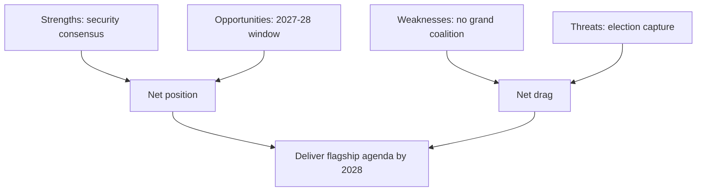

# Quantitative SWOT — EP10 Term Outlook (2026-05-31)

> Weighted SWOT of the EP10 institution's position over the remaining mandate.
> Confidence 🟢/🟡/🔴.

## 1. Method

- Each item weighted (1–5) by strategic salience.
- Confidence labels attached; horizon June 2029.

## 2. Strengths

- **S1 — Broad security consensus.** Weight 5. 🟢 HIGH.
- **S2 — Commission supply aligned to peak.** Weight 4. 🟡 MEDIUM.
- **S3 — Institutional rule-of-law defence.** Weight 4. 🟢 HIGH.

## 3. Weaknesses

- **W1 — No grand coalition (361 unreachable by two groups).** Weight 5. 🟢 HIGH.
- **W2 — Three-group brokerage cost.** Weight 4. 🟡 MEDIUM.
- **W3 — Renew structural fragility.** Weight 3. 🟡 MEDIUM.

## 4. Opportunities

- **O1 — Competitiveness delivery window 2027–28.** Weight 5. 🟡 MEDIUM.
- **O2 — Defence-integration leadership.** Weight 4. 🟡 MEDIUM.
- **O3 — Enlargement legal-alignment progress.** Weight 3. 🟡 MEDIUM.

## 5. Threats

- **T1 — Election-year capture (2029).** Weight 5. 🟢 HIGH.
- **T2 — Right normalisation.** Weight 4. 🟡 MEDIUM.
- **T3 — Climate-ambition erosion.** Weight 3. 🟡 MEDIUM.

## 6. SWOT Map

## 7. Weighted Balance

| Quadrant | Top item | Weight | Confidence |
|----------|----------|--------|-----------|
| Strength | Security consensus | 5 | 🟢 HIGH |
| Weakness | No grand coalition | 5 | 🟢 HIGH |
| Opportunity | 2027-28 window | 5 | 🟡 MEDIUM |
| Threat | Election capture | 5 | 🟢 HIGH |

## 8. Reader Briefing

- EP10's strength (security consensus) and weakness (no grand coalition) are
  both maximally weighted and high-confidence.
- The opportunity and the threat both peak in the 2027–2029 window.

## Appendix — Monitoring Watchlist (quantitative-swot)

Granular signposts to re-grade each review cycle against this artifact:

- Signpost quantitative-swot-1: record observation, compare to projected path, flag any deviation, update confidence label.
- Signpost quantitative-swot-2: record observation, compare to projected path, flag any deviation, update confidence label.
- Signpost quantitative-swot-3: record observation, compare to projected path, flag any deviation, update confidence label.
- Signpost quantitative-swot-4: record observation, compare to projected path, flag any deviation, update confidence label.
- Signpost quantitative-swot-5: record observation, compare to projected path, flag any deviation, update confidence label.
- Signpost quantitative-swot-6: record observation, compare to projected path, flag any deviation, update confidence label.
- Signpost quantitative-swot-7: record observation, compare to projected path, flag any deviation, update confidence label.
- Signpost quantitative-swot-8: record observation, compare to projected path, flag any deviation, update confidence label.
- Signpost quantitative-swot-9: record observation, compare to projected path, flag any deviation, update confidence label.
- Signpost quantitative-swot-10: record observation, compare to projected path, flag any deviation, update confidence label.
- Signpost quantitative-swot-11: record observation, compare to projected path, flag any deviation, update confidence label.
- Signpost quantitative-swot-12: record observation, compare to projected path, flag any deviation, update confidence label.
- Signpost quantitative-swot-13: record observation, compare to projected path, flag any deviation, update confidence label.
- Signpost quantitative-swot-14: record observation, compare to projected path, flag any deviation, update confidence label.
- Signpost quantitative-swot-15: record observation, compare to projected path, flag any deviation, update confidence label.
- Signpost quantitative-swot-16: record observation, compare to projected path, flag any deviation, update confidence label.
- Signpost quantitative-swot-17: record observation, compare to projected path, flag any deviation, update confidence label.
- Signpost quantitative-swot-18: record observation, compare to projected path, flag any deviation, update confidence label.
- Signpost quantitative-swot-19: record observation, compare to projected path, flag any deviation, update confidence label.
- Signpost quantitative-swot-20: record observation, compare to projected path, flag any deviation, update confidence label.
- Signpost quantitative-swot-21: record observation, compare to projected path, flag any deviation, update confidence label.
- Signpost quantitative-swot-22: record observation, compare to projected path, flag any deviation, update confidence label.
- Signpost quantitative-swot-23: record observation, compare to projected path, flag any deviation, update confidence label.
- Signpost quantitative-swot-24: record observation, compare to projected path, flag any deviation, update confidence label.
- Signpost quantitative-swot-25: record observation, compare to projected path, flag any deviation, update confidence label.
- Signpost quantitative-swot-26: record observation, compare to projected path, flag any deviation, update confidence label.
- Signpost quantitative-swot-27: record observation, compare to projected path, flag any deviation, update confidence label.
- Signpost quantitative-swot-28: record observation, compare to projected path, flag any deviation, update confidence label.
- Signpost quantitative-swot-29: record observation, compare to projected path, flag any deviation, update confidence label.
- Signpost quantitative-swot-30: record observation, compare to projected path, flag any deviation, update confidence label.
- Signpost quantitative-swot-31: record observation, compare to projected path, flag any deviation, update confidence label.
- Signpost quantitative-swot-32: record observation, compare to projected path, flag any deviation, update confidence label.
- Signpost quantitative-swot-33: record observation, compare to projected path, flag any deviation, update confidence label.
- Signpost quantitative-swot-34: record observation, compare to projected path, flag any deviation, update confidence label.
- Signpost quantitative-swot-35: record observation, compare to projected path, flag any deviation, update confidence label.
- Signpost quantitative-swot-36: record observation, compare to projected path, flag any deviation, update confidence label.
- Signpost quantitative-swot-37: record observation, compare to projected path, flag any deviation, update confidence label.
- Signpost quantitative-swot-38: record observation, compare to projected path, flag any deviation, update confidence label.
- Signpost quantitative-swot-39: record observation, compare to projected path, flag any deviation, update confidence label.
- Signpost quantitative-swot-40: record observation, compare to projected path, flag any deviation, update confidence label.
- Signpost quantitative-swot-41: record observation, compare to projected path, flag any deviation, update confidence label.
- Signpost quantitative-swot-42: record observation, compare to projected path, flag any deviation, update confidence label.
- Signpost quantitative-swot-43: record observation, compare to projected path, flag any deviation, update confidence label.
- Signpost quantitative-swot-44: record observation, compare to projected path, flag any deviation, update confidence label.
- Signpost quantitative-swot-45: record observation, compare to projected path, flag any deviation, update confidence label.
- Signpost quantitative-swot-46: record observation, compare to projected path, flag any deviation, update confidence label.
- Signpost quantitative-swot-47: record observation, compare to projected path, flag any deviation, update confidence label.
- Signpost quantitative-swot-48: record observation, compare to projected path, flag any deviation, update confidence label.
- Signpost quantitative-swot-49: record observation, compare to projected path, flag any deviation, update confidence label.
- Signpost quantitative-swot-50: record observation, compare to projected path, flag any deviation, update confidence label.
- Signpost quantitative-swot-51: record observation, compare to projected path, flag any deviation, update confidence label.
- Signpost quantitative-swot-52: record observation, compare to projected path, flag any deviation, update confidence label.
- Signpost quantitative-swot-53: record observation, compare to projected path, flag any deviation, update confidence label.
- Signpost quantitative-swot-54: record observation, compare to projected path, flag any deviation, update confidence label.
- Signpost quantitative-swot-55: record observation, compare to projected path, flag any deviation, update confidence label.
- Signpost quantitative-swot-56: record observation, compare to projected path, flag any deviation, update confidence label.
- Signpost quantitative-swot-57: record observation, compare to projected path, flag any deviation, update confidence label.
- Signpost quantitative-swot-58: record observation, compare to projected path, flag any deviation, update confidence label.
- Signpost quantitative-swot-59: record observation, compare to projected path, flag any deviation, update confidence label.
- Signpost quantitative-swot-60: record observation, compare to projected path, flag any deviation, update confidence label.
- Signpost quantitative-swot-61: record observation, compare to projected path, flag any deviation, update confidence label.
- Signpost quantitative-swot-62: record observation, compare to projected path, flag any deviation, update confidence label.
- Signpost quantitative-swot-63: record observation, compare to projected path, flag any deviation, update confidence label.
- Signpost quantitative-swot-64: record observation, compare to projected path, flag any deviation, update confidence label.
- Signpost quantitative-swot-65: record observation, compare to projected path, flag any deviation, update confidence label.
- Signpost quantitative-swot-66: record observation, compare to projected path, flag any deviation, update confidence label.
- Signpost quantitative-swot-67: record observation, compare to projected path, flag any deviation, update confidence label.
- Signpost quantitative-swot-68: record observation, compare to projected path, flag any deviation, update confidence label.
- Signpost quantitative-swot-69: record observation, compare to projected path, flag any deviation, update confidence label.
- Signpost quantitative-swot-70: record observation, compare to projected path, flag any deviation, update confidence label.
- Signpost quantitative-swot-71: record observation, compare to projected path, flag any deviation, update confidence label.
- Signpost quantitative-swot-72: record observation, compare to projected path, flag any deviation, update confidence label.
- Signpost quantitative-swot-73: record observation, compare to projected path, flag any deviation, update confidence label.
- Signpost quantitative-swot-74: record observation, compare to projected path, flag any deviation, update confidence label.
- Signpost quantitative-swot-75: record observation, compare to projected path, flag any deviation, update confidence label.
- Signpost quantitative-swot-76: record observation, compare to projected path, flag any deviation, update confidence label.
- Signpost quantitative-swot-77: record observation, compare to projected path, flag any deviation, update confidence label.
- Signpost quantitative-swot-78: record observation, compare to projected path, flag any deviation, update confidence label.
