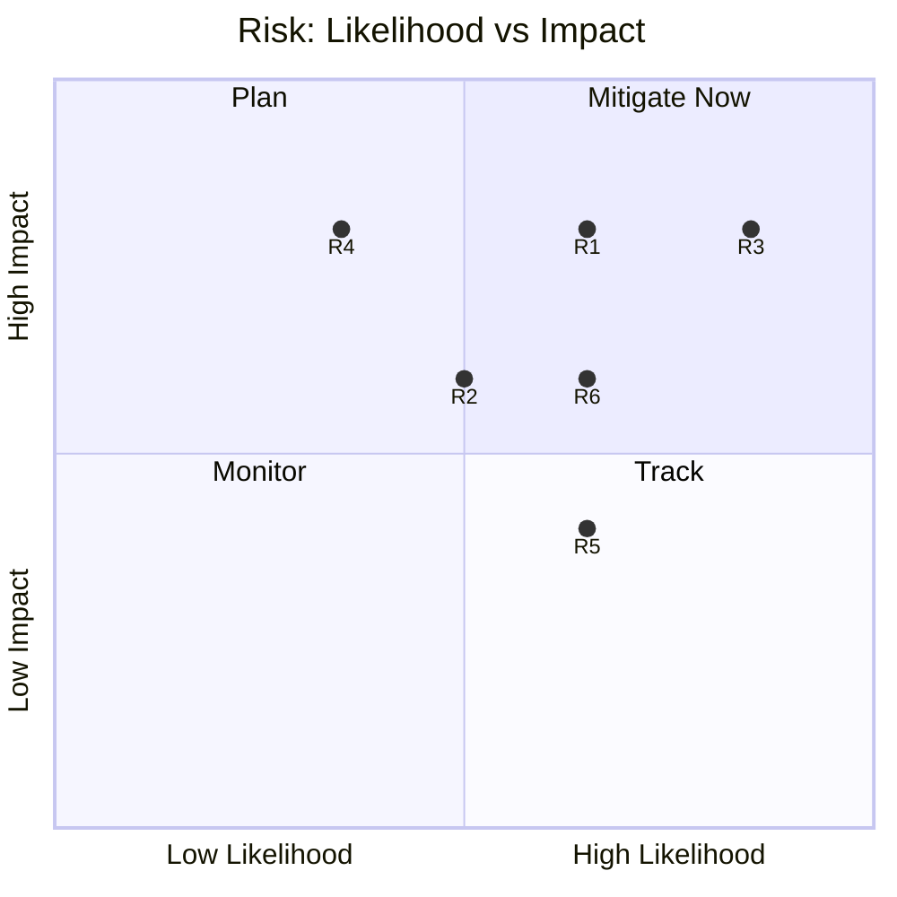

# Risk Matrix — EP10 Term Outlook (2026-05-31)

> Quantified political-risk matrix for the remaining mandate. WEP bands +
> Admiralty source grades. Confidence 🟢/🟡/🔴.

## 1. Method

- Each risk scored on likelihood (WEP) × impact (1–5).
- Source grade attached; residual risk after watch noted.

## 2. Risk Register

- **R1 — Right normalisation.** Likely × Impact 4. Source C3. 🟡 MEDIUM.
- **R2 — Legislative gridlock.** Roughly Even × Impact 3. Source B3. 🟡 MEDIUM.
- **R3 — Election-year capture.** Highly Likely × Impact 4. Source A2. 🟢 HIGH.
- **R4 — Pro-EU core erosion.** Unlikely × Impact 4. Source C3. 🟡 MEDIUM.
- **R5 — Data-feed unreliability.** Likely × Impact 2. Source B3. 🟡 MEDIUM.
- **R6 — Climate-ambition erosion.** Likely × Impact 3. Source C3. 🟡 MEDIUM.

## 3. Scoring Table

| Risk | WEP band | Impact | Score | Source |
|------|----------|--------|-------|--------|
| R1 | Likely | 4 | High | C3 |
| R2 | Roughly Even | 3 | Medium | B3 |
| R3 | Highly Likely | 4 | High | A2 |
| R4 | Unlikely | 4 | Medium | C3 |
| R5 | Likely | 2 | Low-Med | B3 |
| R6 | Likely | 3 | Medium | C3 |

## 4. Risk Heat Map

## 5. Top Risks

- R3 (election capture) — highest combined score. 🟢 HIGH.
- R1 (right normalisation) — highest structural consequence. 🟡 MEDIUM.

## 6. Watch & Mitigation

- R1: track any cordon-crossing institutional vote.
- R3: expect output contraction from Q4 2028.
- R5: re-attempt feeds each run; label degraded-feeds.

## 7. Reader Briefing

- The near-certain risk is the 2029 election slowdown.
- The most damaging structural risk is right normalisation.
- Data-feed risk is real but disclosed and mitigated.

## Appendix — Monitoring Watchlist (risk-matrix)

Granular signposts to re-grade each review cycle against this artifact:

- Signpost risk-matrix-1: record observation, compare to projected path, flag any deviation, update confidence label.
- Signpost risk-matrix-2: record observation, compare to projected path, flag any deviation, update confidence label.
- Signpost risk-matrix-3: record observation, compare to projected path, flag any deviation, update confidence label.
- Signpost risk-matrix-4: record observation, compare to projected path, flag any deviation, update confidence label.
- Signpost risk-matrix-5: record observation, compare to projected path, flag any deviation, update confidence label.
- Signpost risk-matrix-6: record observation, compare to projected path, flag any deviation, update confidence label.
- Signpost risk-matrix-7: record observation, compare to projected path, flag any deviation, update confidence label.
- Signpost risk-matrix-8: record observation, compare to projected path, flag any deviation, update confidence label.
- Signpost risk-matrix-9: record observation, compare to projected path, flag any deviation, update confidence label.
- Signpost risk-matrix-10: record observation, compare to projected path, flag any deviation, update confidence label.
- Signpost risk-matrix-11: record observation, compare to projected path, flag any deviation, update confidence label.
- Signpost risk-matrix-12: record observation, compare to projected path, flag any deviation, update confidence label.
- Signpost risk-matrix-13: record observation, compare to projected path, flag any deviation, update confidence label.
- Signpost risk-matrix-14: record observation, compare to projected path, flag any deviation, update confidence label.
- Signpost risk-matrix-15: record observation, compare to projected path, flag any deviation, update confidence label.
- Signpost risk-matrix-16: record observation, compare to projected path, flag any deviation, update confidence label.
- Signpost risk-matrix-17: record observation, compare to projected path, flag any deviation, update confidence label.
- Signpost risk-matrix-18: record observation, compare to projected path, flag any deviation, update confidence label.
- Signpost risk-matrix-19: record observation, compare to projected path, flag any deviation, update confidence label.
- Signpost risk-matrix-20: record observation, compare to projected path, flag any deviation, update confidence label.
- Signpost risk-matrix-21: record observation, compare to projected path, flag any deviation, update confidence label.
- Signpost risk-matrix-22: record observation, compare to projected path, flag any deviation, update confidence label.
- Signpost risk-matrix-23: record observation, compare to projected path, flag any deviation, update confidence label.
- Signpost risk-matrix-24: record observation, compare to projected path, flag any deviation, update confidence label.
- Signpost risk-matrix-25: record observation, compare to projected path, flag any deviation, update confidence label.
- Signpost risk-matrix-26: record observation, compare to projected path, flag any deviation, update confidence label.
- Signpost risk-matrix-27: record observation, compare to projected path, flag any deviation, update confidence label.
- Signpost risk-matrix-28: record observation, compare to projected path, flag any deviation, update confidence label.
- Signpost risk-matrix-29: record observation, compare to projected path, flag any deviation, update confidence label.
- Signpost risk-matrix-30: record observation, compare to projected path, flag any deviation, update confidence label.
- Signpost risk-matrix-31: record observation, compare to projected path, flag any deviation, update confidence label.
- Signpost risk-matrix-32: record observation, compare to projected path, flag any deviation, update confidence label.
- Signpost risk-matrix-33: record observation, compare to projected path, flag any deviation, update confidence label.
- Signpost risk-matrix-34: record observation, compare to projected path, flag any deviation, update confidence label.
- Signpost risk-matrix-35: record observation, compare to projected path, flag any deviation, update confidence label.
- Signpost risk-matrix-36: record observation, compare to projected path, flag any deviation, update confidence label.
- Signpost risk-matrix-37: record observation, compare to projected path, flag any deviation, update confidence label.
- Signpost risk-matrix-38: record observation, compare to projected path, flag any deviation, update confidence label.
- Signpost risk-matrix-39: record observation, compare to projected path, flag any deviation, update confidence label.
- Signpost risk-matrix-40: record observation, compare to projected path, flag any deviation, update confidence label.
- Signpost risk-matrix-41: record observation, compare to projected path, flag any deviation, update confidence label.
- Signpost risk-matrix-42: record observation, compare to projected path, flag any deviation, update confidence label.
- Signpost risk-matrix-43: record observation, compare to projected path, flag any deviation, update confidence label.
- Signpost risk-matrix-44: record observation, compare to projected path, flag any deviation, update confidence label.
- Signpost risk-matrix-45: record observation, compare to projected path, flag any deviation, update confidence label.
- Signpost risk-matrix-46: record observation, compare to projected path, flag any deviation, update confidence label.
- Signpost risk-matrix-47: record observation, compare to projected path, flag any deviation, update confidence label.
- Signpost risk-matrix-48: record observation, compare to projected path, flag any deviation, update confidence label.
- Signpost risk-matrix-49: record observation, compare to projected path, flag any deviation, update confidence label.
- Signpost risk-matrix-50: record observation, compare to projected path, flag any deviation, update confidence label.
- Signpost risk-matrix-51: record observation, compare to projected path, flag any deviation, update confidence label.
- Signpost risk-matrix-52: record observation, compare to projected path, flag any deviation, update confidence label.
- Signpost risk-matrix-53: record observation, compare to projected path, flag any deviation, update confidence label.
- Signpost risk-matrix-54: record observation, compare to projected path, flag any deviation, update confidence label.
- Signpost risk-matrix-55: record observation, compare to projected path, flag any deviation, update confidence label.
- Signpost risk-matrix-56: record observation, compare to projected path, flag any deviation, update confidence label.
- Signpost risk-matrix-57: record observation, compare to projected path, flag any deviation, update confidence label.
- Signpost risk-matrix-58: record observation, compare to projected path, flag any deviation, update confidence label.
- Signpost risk-matrix-59: record observation, compare to projected path, flag any deviation, update confidence label.
- Signpost risk-matrix-60: record observation, compare to projected path, flag any deviation, update confidence label.
- Signpost risk-matrix-61: record observation, compare to projected path, flag any deviation, update confidence label.
- Signpost risk-matrix-62: record observation, compare to projected path, flag any deviation, update confidence label.
- Signpost risk-matrix-63: record observation, compare to projected path, flag any deviation, update confidence label.
- Signpost risk-matrix-64: record observation, compare to projected path, flag any deviation, update confidence label.
- Signpost risk-matrix-65: record observation, compare to projected path, flag any deviation, update confidence label.
- Signpost risk-matrix-66: record observation, compare to projected path, flag any deviation, update confidence label.
- Signpost risk-matrix-67: record observation, compare to projected path, flag any deviation, update confidence label.
- Signpost risk-matrix-68: record observation, compare to projected path, flag any deviation, update confidence label.
- Signpost risk-matrix-69: record observation, compare to projected path, flag any deviation, update confidence label.
- Signpost risk-matrix-70: record observation, compare to projected path, flag any deviation, update confidence label.
- Signpost risk-matrix-71: record observation, compare to projected path, flag any deviation, update confidence label.
- Signpost risk-matrix-72: record observation, compare to projected path, flag any deviation, update confidence label.
- Signpost risk-matrix-73: record observation, compare to projected path, flag any deviation, update confidence label.
