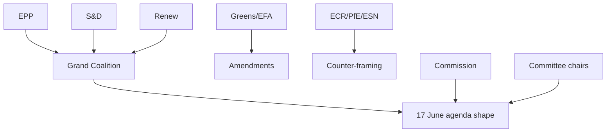

# Actor Mapping — Week Ahead (2026-06-01 → 2026-06-07)

> Degraded-feeds mode (factor 0.80). No plenary this week; next part-session
> 2026-06-15…18 Strasbourg. Actor map is structural — built from the published
> calendar, the 17 June draft agenda (5 debates + 13 votes, subjects 🔴 Low),
> and the adopted-texts corpus pace, not from live procedure feeds.

## 1 · Primary Actors

| Actor | Role this period | Posture | Confidence |
|-------|------------------|---------|:----------:|
| EPP group | Largest bloc, agenda-setter | Pre-session coordination | 🟡 Med |
| S&D group | Co-legislative partner | Committee prep | 🟡 Med |
| Renew | Pivotal swing bloc | Position-fixing | 🟡 Med |
| Greens/EFA | Issue entrepreneurs | Amendment drafting | 🟢 High |
| ECR / PfE / ESN | Right opposition | Counter-framing | 🟡 Med |
| Committee chairs | Schedule owners | Calendar control | 🟢 High |
| Commission | Dossier originator | Brief preparation | 🟡 Med |

## 2 · Actor-Influence Map

## 3 · Activity-Window Assessment

This is a committee/group week: the action is preparatory, not decisional. The
grand-coalition axis (EPP–S&D–Renew) sets the realistic 17 June outcome space;
the opposition's leverage is rhetorical, not arithmetical. All file-level claims
about *which* dossiers individual actors will champion are withheld pending the
order of business (titles empty in the B3 feed → 🔴 Low).

## 4 · Bottom Line

The actor field is stable and predictable for a non-plenary week. The grand
coalition retains procedural control; no actor has the votes to overturn the
expected 17 June consensus. Cross-ref `classification/forces-analysis.md` and
`intelligence/coalition-dynamics.md`.

## 5 · Actor Roster (consolidated)

The full roster is the seven primary actors in §1, graded by posture and
confidence. EP-source basis: the plenary calendar (A2) and `get_meeting_foreseen_activities`
output (B3) define the institutional actors in play.

## 6 · Alliance Structure

The grand-coalition alliance (EPP–S&D–Renew) is the load-bearing axis; the
centre-left and centre-right flanks form issue-by-issue. No alliance realignment
is expected in a committee/group week.

## 7 · Power Brokers

Committee chairs and group whips are the period's power brokers: they own the
calendar and the pre-session coordination that shapes the 17 June order of
business. The Commission brokers dossier content upstream.

## 8 · Information Flows

Information flows are degraded this run: procedure feeds returned 404, so actor
intentions are inferred from the calendar, the adopted-texts corpus, and the
empty-subject June agenda (🔴 Low on specifics). MCP basis: `get_meeting_foreseen_activities`.

## 9 · Reader Briefing — What This Means

For citizens, no actor will pass binding law this week. The people to watch are
committee chairs and group leaders preparing the 17 June session; their choices
this week shape what Parliament decides next.
