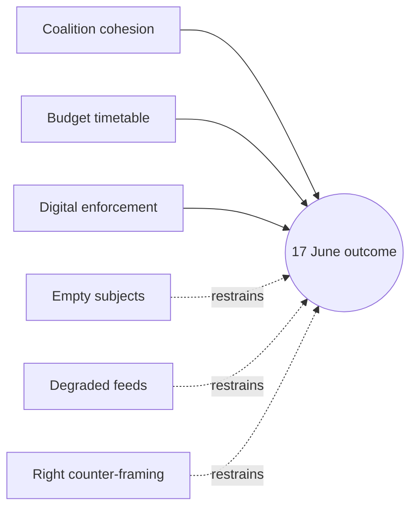

# Forces Analysis — Week Ahead (2026-06-01 → 2026-06-07)

> Degraded-feeds mode (factor 0.80). Structural force-field built from calendar,
> 17 June draft agenda, and corpus pace — not live feeds.

## 1 · Driving vs. Restraining Forces

| Force | Direction | Strength | Confidence |
|-------|-----------|:--------:|:----------:|
| Grand-coalition cohesion | Driving (consensus) | High | 🟢 High |
| 2027 budget timetable pressure | Driving | Med | 🟡 Med |
| Digital-enforcement momentum (DMA/AI) | Driving | Med | 🟡 Med |
| Empty agenda subjects | Restraining (visibility) | High | 🟢 High |
| Degraded procedure feeds | Restraining (tracking) | High | 🟢 High |
| Right-bloc counter-framing | Restraining | Low | 🟡 Med |

## 2 · Force-Field Diagram

## 3 · Net Assessment

Driving forces (coalition cohesion, budget timetable, digital-enforcement
momentum) outweigh restraining forces on *outcome* — the 17 June votes are very
likely to clear on the grand-coalition axis. Restraining forces dominate on
*visibility*: empty subjects and degraded feeds prevent any file-level forecast,
so subjects stay 🔴 Low until the order of business publishes.

## 4 · Bottom Line

Outcome is predictable; specifics are not. The net force vector points to a
routine, consensus-driven session. Cross-ref `classification/actor-mapping.md`
and `classification/impact-matrix.md`.

## 5 · Issue Frame

The framing issue for the period is preparatory control of the forming 17 June
agenda — a committee/group week with no binding votes but decisive agenda-shaping.

## 6 · Driving Forces (detail)

Coalition cohesion, the 2027 budget timetable, and digital-enforcement momentum
push toward a consensus-driven June session (see §1 table). MCP basis:
`get_meeting_foreseen_activities` (B3) and the adopted-texts corpus (A2).

## 7 · Restraining Forces (detail)

Empty agenda subjects and degraded procedure feeds restrain *visibility*, not
outcome; right-bloc counter-framing is a weak restraining force on tone.

## 8 · Net Pressure

Net pressure favours a routine outcome with low visibility: driving forces win on
*what passes*, restraining forces win on *what we can foresee*. WEP: **Likely**
routine clearance on 17 June.

## 9 · Intervention Points

The intervention points this week are committee prep meetings and the order-of-
business drafting — the only levers that can still reshape the 17 June agenda.

## 10 · Reader Briefing — What This Means

For citizens: nothing is decided this week, but the groundwork for the 17 June
votes is laid now. Watch the committee schedule, not the plenary floor.
