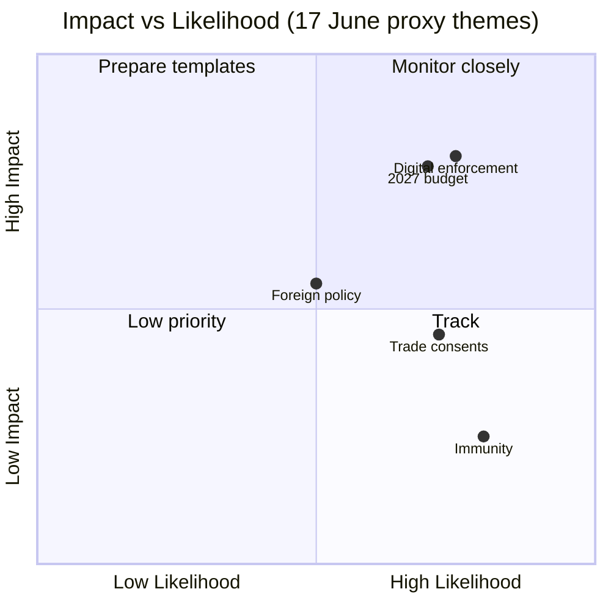

# Impact Matrix — Week Ahead (2026-06-01 → 2026-06-07)

> Degraded-feeds mode (factor 0.80). Impact estimated structurally from the
> 17 June draft agenda (5 debates + 13 votes) and corpus themes; subjects 🔴 Low.

## 1 · Impact-by-Theme Matrix

| Theme (proxy) | Likelihood | Citizen impact | Institutional impact | Confidence |
|---------------|:----------:|:--------------:|:--------------------:|:----------:|
| Digital enforcement (DMA/AI) | Likely | Med | High | 🟡 Med |
| 2027 budget framing | Likely | Med | High | 🟡 Med |
| Foreign-policy urgencies | Roughly Even | Low | Med | 🟡 Med |
| Trade consents | Likely | Low | Med | 🟡 Med |
| Immunity procedures | Likely | Low | Low | 🟢 High |
| ECB / monetary dialogue | Roughly Even | Low | Med | 🟡 Med |

## 2 · Impact-Probability Map

## 3 · Reader Briefing — What This Means

For citizens, the week ahead is preparatory: no binding votes land until 17 June.
The highest-impact proxy themes are digital enforcement and the 2027 budget, both
of which shape rules and money that reach the public — but the specific dossiers
remain unconfirmed until the agenda publishes.

## 4 · Bottom Line

Institutional impact concentrates in digital enforcement and budget framing;
citizen-facing impact is moderate and deferred to the June session. Cross-ref
`classification/significance-classification.md` and `risk-scoring/risk-matrix.md`.

## 5 · Event List

The period's event list is structural: no plenary 1–7 June; committee/group
preparation; the 17 June draft agenda (5 debates + 13 votes, subjects 🔴 Low).
MCP basis: `get_meeting_foreseen_activities` (MTG-PL-2026-06-17).

## 6 · Stakeholder Impact

Stakeholders affected by the proxy themes: digital firms (DMA/AI enforcement),
national treasuries (2027 budget), and trade partners (consent files). Impact is
prospective — it lands at the June session, not this week.

## 7 · Impact Matrix (consolidated)

The §1 matrix grades each proxy theme by likelihood and impact. Digital
enforcement and budget framing are the high-institutional-impact cells; immunity
procedures are low-impact routine.

## 8 · Heat Assessment

Heat is concentrated on digital enforcement and budget framing (high impact ×
Likely). Foreign-policy urgencies are a lower-heat, event-driven wildcard.

## 9 · Cascade Risk

Cascade risk is low this week: with no binding votes, no decision can trigger
downstream effects until 17 June. The main cascade channel is reputational —
framing set now propagates into June coverage.

## 10 · Reader Briefing — What This Means

For citizens: the decisions that matter come on 17 June. This week shapes which
issues — digital rules and the 2027 budget — get the spotlight then.
