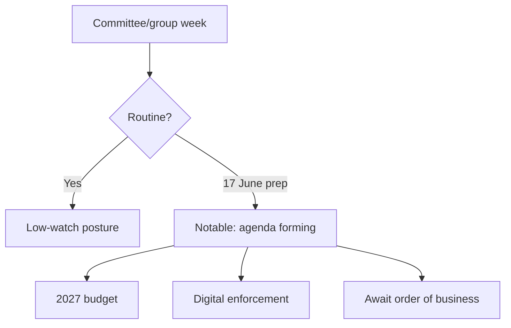

# Significance Classification — Week Ahead (2026-06-01 → 2026-06-07)

> Degraded-feeds mode (factor 0.80). Significance graded structurally; subjects
> 🔴 Low pending the 17 June order of business.

## 1 · Significance Grading

| Item | Significance tier | Rationale | Confidence |
|------|-------------------|-----------|:----------:|
| No plenary this week | Routine | Calendar-confirmed committee/group week | 🟢 High |
| 17 June session (5 debates + 13 votes) | Notable | Largest forward signal; subjects empty | 🟡 Med |
| 2027 budget trajectory | Notable | Recurring high-salience dossier | 🟡 Med |
| Digital-enforcement items | Notable | DMA/AI momentum in corpus | 🟡 Med |
| FP urgencies | Situational | Event-driven, unscheduled | 🟡 Med |
| Immunity procedures | Routine | Standard caseload | 🟢 High |

## 2 · Significance Flow

## 3 · Newsroom Significance Note

Nothing this week crosses the "breaking" threshold. The editorially significant
development is the *shape* of the forming 17 June agenda, not any single
confirmed item. Coverage should be anticipatory and clearly hedged: report the
counts and themes, withhold subjects until confirmed.

## 4 · Bottom Line

Period significance is **Notable-but-preparatory**. The watch item is the 17 June
agenda crystallising. Cross-ref `classification/impact-matrix.md` and
`intelligence/scenario-forecast.md`.
