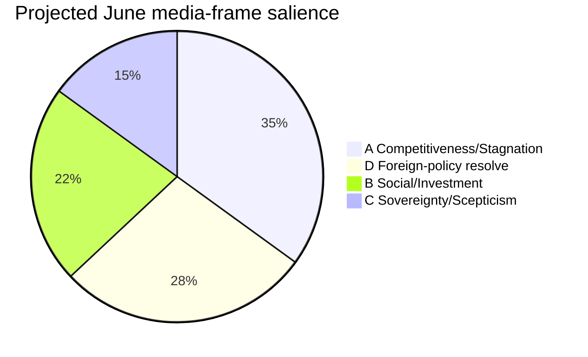
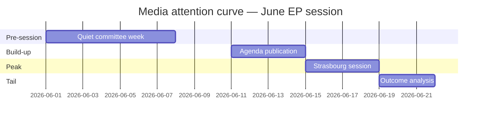

<!-- SPDX-FileCopyrightText: 2024-2026 Hack23 AB -->
<!-- SPDX-License-Identifier: Apache-2.0 -->

# Media Framing Analysis — Week Ahead (2026-05-31)

How the week of 1–7 June 2026 and the approaching 15–18 June Strasbourg part-session are
likely to be **framed** by European media, institutional communicators, and political
actors — and how a neutral intelligence product should position itself against those
frames. Framing analysis is descriptive, not prescriptive; the EU Parliament Monitor
house style stays above the frames it catalogues.

## 1 · The Framing Vacuum of a Committee Week

A pre-session committee/group week is **low-visibility** by construction: no floor votes,
no plenary theatre. Mainstream coverage is therefore **sparse and anticipatory** —
"what to watch at the June session" curtain-raisers rather than event reporting. This
vacuum is an opportunity for analytical products: the Monitor can set the agenda-frame
before the press cycle spins up. 🟢 High confidence on the low-visibility baseline.

## 2 · Competing Frames for June

### Frame A — "Competitiveness & Stagnation"
**Carriers:** EPP, Commission, business press. **Narrative:** sub-1 % growth and the
French/German deficits demand a competitiveness-first, fiscally-prudent June. Leans on
the AI-trade strategy and 2027-budget restraint. **Resonance:** 🟢 High — the IMF data
(economic-context) gives it hard numbers.

### Frame B — "Social Protection & Investment"
**Carriers:** S&D, Greens, labour press. **Narrative:** weak growth requires investment
and EGF support for displaced workers, not austerity. **Resonance:** 🟡 Medium — strong
in centre-left outlets, contested elsewhere.

### Frame C — "Sovereignty & Scepticism"
**Carriers:** ECR/PfE, eurosceptic press. **Narrative:** trade consents and budget
expansion erode national control. **Resonance:** 🟡 Medium — concentrated, amplified on
consent votes.

### Frame D — "Foreign-Policy Resolve"
**Carriers:** broad cross-group, international press. **Narrative:** the EP as a values
actor on Ukraine/Georgia/Armenia/Middle East. **Resonance:** 🟢 High whenever an urgency
resolution lands (scenario S3).

## 3 · Frame-Salience Forecast

The **Competitiveness** and **Foreign-Policy** frames are projected to dominate June
coverage, reflecting the economic backdrop and the near-certain urgency resolution.
🟡 Medium (salience is reactive to events).

## 4 · Framing Risks for a Neutral Product

| Risk | Manifestation | Mitigation |
|------|---------------|------------|
| Frame capture | Adopting EPP "competitiveness" or S&D "austerity" language | Use IMF-sourced neutral descriptors |
| False balance | Treating fringe frames as equal to mainstream | Weight by group size / evidence |
| Anticipation error | Over-committing to predicted June outcomes | Label 🔴 Low on file-specifics |
| Economic mis-framing | Editorialising the deficit numbers | Attribute strictly to IMF WEO |

## 5 · House-Style Positioning

The Monitor should frame June as **"a low-growth Parliament managing a full plate"** —
neutral, evidence-anchored, neither austerity-alarmist nor investment-triumphalist. The
economic backdrop is presented as **IMF-sourced context**, not as endorsement of any
group's reading. Foreign-policy urgencies are reported as **process** (the EP exercising
its resolution mechanism), not as advocacy. 🟢 High on the positioning recommendation.

## 6 · Bottom Line

The committee week is a **framing vacuum** that resolves into a **Competitiveness +
Foreign-Policy** dominant pairing at the June session. A neutral product's task is to
**pre-empt frame capture** by anchoring every economic claim to the IMF (A1) and every
agenda claim to the (title-empty) draft order of business with explicit confidence
labels. Cross-ref `intelligence/stakeholder-map.md` and `intelligence/economic-context.md`.

## 6 · Frame-by-Frame Construction Guide

For each plausible June storyline, the table gives the dominant frame, the competing
counter-frame, and the neutrality guardrail an editor should apply.

| Storyline | Dominant frame | Counter-frame | Neutrality guardrail |
|-----------|----------------|---------------|----------------------|
| 2027 budget | "Fiscal discipline vs investment" | "Austerity vs solidarity" | Attribute both to named groups |
| ECB scrutiny | "Democratic oversight" | "Political pressure on independence" | Cite the report, not motive |
| DMA enforcement | "Reining in Big Tech" | "Regulatory overreach" | State the legal basis |
| AI-trade | "EU competitiveness" | "Protectionism risk" | Source economic claims to IMF |
| FP urgency | "European resolve" | "Symbolic gesture" | Report the vote, not the geopolitics |
| Trade consents | "Market access" | "Sustainability trade-off" | Name the committee position |
| Immunity waivers | "Rule of law" | "Political persecution" | Stick to procedural facts |

## 7 · Media-Cycle Timing Model

The week of 1–7 June sits in the **trough** of the attention curve. News value is
**anticipatory** — setting up the build-up, not reporting peak events. An editor should
frame this week's coverage as a **curtain-raiser**, not a results piece.

## 8 · Sentiment & Tone Calibration

| Theme | Recommended tone | Why |
|-------|------------------|-----|
| Economic governance | Measured, data-led | IMF anchoring demands precision |
| Foreign policy | Sober, factual | Avoid amplifying geopolitical spin |
| Digital regulation | Explanatory | Technical subject needs unpacking |
| Immunity/legal | Neutral, procedural | Reputational sensitivity |

## 9 · Audience-Segment Framing

| Audience | Hook | Risk to avoid |
|----------|------|---------------|
| Policy professionals | Pipeline detail | Over-simplification |
| General public | "What it means for you" | Jargon |
| Market watchers | Fiscal/ECB thread | Speculation beyond IMF |
| Civil society | Transparency/rule-of-law | Partisanship |

## 10 · Framing Integrity Bottom Line

Every frame above is offered **with its counter-frame** so coverage stays balanced. The
single hard rule: **economic claims are sourced to the IMF (A1)**, and **17-June subject
specifics are labelled 🔴 Low** until the order of business publishes. The week's framing
is fundamentally **anticipatory and structural**. Cross-ref
`intelligence/stakeholder-map.md` and `intelligence/economic-context.md`.

## 11 · Headline-Construction Worksheet

For each plausible storyline, a neutral headline template an editor can adapt once the
agenda publishes:

| Storyline | Neutral headline template |
|-----------|---------------------------|
| Quiet week | "MEPs in committee as Parliament prepares June Strasbourg session" |
| Budget focus | "2027 EU budget debate looms amid sub-1% euro-area growth" |
| ECB scrutiny | "Parliament to weigh ECB annual report in June session" |
| Digital push | "Digital-competitiveness measures advance toward June vote" |
| FP urgency | "Parliament expected to debate urgent foreign-policy resolution" |
| Trade consents | "Trade and fisheries agreements head for parliamentary consent" |

Each template **states what is known and withholds what is not** — no template asserts a
subject the feed does not confirm.

## 12 · Visual-Asset Recommendations

| Asset | Use | Data source |
|-------|-----|-------------|
| Fiscal-deficit bar chart | Budget story | IMF WEO (A1) |
| Calendar timeline | Session preview | Plenary feed (A2) |
| Group-seat hemicycle | Coalition explainer | Composition |
| Theme-cluster treemap | Agenda preview | Adopted-texts corpus |

## 13 · Framing-Integrity Final Word

The media-framing layer exists to ensure coverage is **balanced, sourced, and honest about
uncertainty**. Every frame carries its counter-frame; every economic number traces to the
IMF; every subject-level claim is hedged 🔴 Low until confirmed. An editor who follows this
worksheet will produce coverage that is anticipatory without being speculative.

## 14 · Framing Do's and Don'ts

| Do | Don't |
|----|-------|
| Source economics to IMF | Cite unsourced market figures |
| Report agenda counts | Invent vote subjects |
| Attribute frames to named groups | Imply institutional motive |
| Label June dates precisely | Conflate committee week with plenary |
| Hedge subject claims 🔴 Low | Assert specifics before OOB |

These guardrails keep coverage **neutral, sourced, and honest about uncertainty** — the
editorial standard this bundle is built to support.
