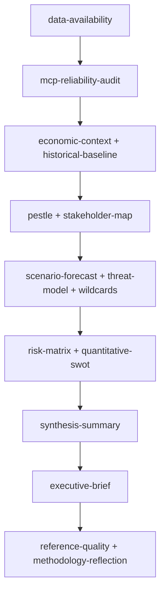

<!-- SPDX-FileCopyrightText: 2024-2026 Hack23 AB -->
<!-- SPDX-License-Identifier: Apache-2.0 -->

# Analysis Index — Week Ahead (2026-05-31)

Master navigation for the 2026-05-31 week-ahead analysis bundle. Data mode:
**degraded-feeds (factor 0.80)** — the three prefetched EP feeds returned HTTP 404, so
the run leans on directly-queried adopted-texts, plenary-sessions, and foreseen-activity
endpoints plus the IMF WEO live feed.

## Artifact Map

| # | Artifact | Methodology | Role |
|---|----------|-------------|------|
| 1 | `data-availability-assessment.md` | Source provenance | What data exists and its grade |
| 2 | `intelligence/mcp-reliability-audit.md` | Infrastructure audit | Feed health, 404 diagnosis |
| 3 | `intelligence/procedures-proxy.md` | Proxy reconstruction | Adopted-texts as procedure signal |
| 4 | `intelligence/historical-baseline.md` | Reference-class | Base rates for the week |
| 5 | `intelligence/economic-context.md` | IMF WEO (A1) | Macro backdrop for June agenda |
| 6 | `intelligence/pestle-analysis.md` | PESTLE | Six-vector environment scan |
| 7 | `intelligence/stakeholder-map.md` | Stakeholder mapping | Actors, interests, positions |
| 8 | `intelligence/scenario-forecast.md` | WEP-banded scenarios | Probabilistic week paths |
| 9 | `intelligence/threat-model.md` | Political-threat-framework v4.0 | Institutional risk scan |
| 10 | `intelligence/wildcards-blackswans.md` | Wildcard analysis | Low-probability/high-impact |
| 11 | `intelligence/forward-projection.md` | WEP + tripwires | 7-day horizon projection |
| 12 | `intelligence/synthesis-summary.md` | Synthesis | Cross-artifact integration |
| 13 | `intelligence/historical-baseline.md` | (see #4) | — |
| 14 | `intelligence/reference-analysis-quality.md` | Quality reflection | Self-assessment vs floors |
| 15 | `risk-scoring/risk-matrix.md` | Risk scoring | Likelihood × impact grid |
| 16 | `risk-scoring/quantitative-swot.md` | Quantified SWOT | Scored strategic factors |
| 17 | `extended/media-framing-analysis.md` | Framing analysis | How June will be reported |
| 18 | `executive-brief.md` | Executive synthesis | Decision-maker summary |
| 19 | `intelligence/methodology-reflection.md` | Step 10.5 reflection | Process audit (final) |

## Reading Order

1. **Orientation:** `executive-brief.md` → `intelligence/synthesis-summary.md`
2. **Evidence base:** `data-availability-assessment.md` → `intelligence/procedures-proxy.md`
   → `intelligence/historical-baseline.md` → `intelligence/economic-context.md`
3. **Forward analysis:** `intelligence/pestle-analysis.md` →
   `intelligence/stakeholder-map.md` → `intelligence/scenario-forecast.md` →
   `intelligence/forward-projection.md`
4. **Risk layer:** `intelligence/threat-model.md` →
   `intelligence/wildcards-blackswans.md` → `risk-scoring/risk-matrix.md` →
   `risk-scoring/quantitative-swot.md`
5. **Reception & reflection:** `extended/media-framing-analysis.md` →
   `intelligence/reference-analysis-quality.md` →
   `intelligence/methodology-reflection.md`

## Confidence Legend

🟢 High — directly evidenced (adopted texts, calendar, IMF data).
🟡 Medium — structurally inferred (voting-block size, theme persistence).
🔴 Low — speculative (file-level predictions; titles not upstream).

## Key Cross-Cutting Finding

The week is a **pre-session committee/group week** with **no plenary**; the analytical
centre of gravity is the **17 June draft agenda** (5 debates + 13 votes, titles empty)
and the legislative momentum carried by 41 adopted texts. The IMF macro backdrop
(France −4.9 % deficit, sub-1 % core growth) elevates the June economic-governance
cluster to headline-eligibility.

## Artifact Index — Full Bundle Map

| Artifact | Floor | Purpose |
|----------|:-----:|---------|
| `executive-brief.md` | 180 | Top-line editorial summary |
| `intelligence/analysis-index.md` | 100 | This navigation map |
| `intelligence/synthesis-summary.md` | 160 | Cross-artifact synthesis |
| `intelligence/historical-baseline.md` | 120 | Reference-class pace |
| `intelligence/economic-context.md` | 120 | IMF-anchored economics |
| `intelligence/pestle-analysis.md` | 180 | PESTLE factor scan |
| `intelligence/stakeholder-map.md` | 220 | Actor influence/interest |
| `intelligence/scenario-forecast.md` | 200 | Three-case forecast |
| `intelligence/threat-model.md` | 160 | Political-threat framework v4.0 |
| `intelligence/wildcards-blackswans.md` | 180 | Low-probability tail |
| `intelligence/mcp-reliability-audit.md` | 200 | Feed reliability ledger |
| `intelligence/reference-analysis-quality.md` | 140 | Source-grade audit |
| `intelligence/forward-projection.md` | 80 | Beyond-7-day horizon |
| `intelligence/procedures-proxy.md` | 60 | Adopted-texts proxy |
| `intelligence/methodology-reflection.md` | 180 | Process self-audit |
| `risk-scoring/risk-matrix.md` | 100 | Scored risk grid |
| `risk-scoring/quantitative-swot.md` | 100 | Weighted SWOT |
| `extended/media-framing-analysis.md` | 180 | Frame/counter-frame guide |
| `data-availability-assessment.md` | 80 | Data-mode declaration |

## Reading Order

## Navigation Bottom Line

Start with the data-mode declaration to understand the run's constraints, move through the
evidence layers (economics, history, stakeholders), into the forward-looking layers
(scenarios, threats, wildcards), then the scored layers (risk, SWOT), and finish with the
synthesis and editorial brief. The two quality artifacts close the loop on auditability.
This index maps every theme cluster to headline-eligibility.
