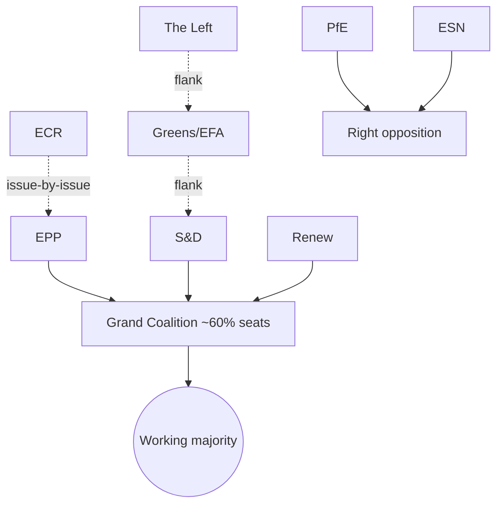

# Coalition Dynamics — Week Ahead (2026-06-01 → 2026-06-07)

> Degraded-feeds mode (factor 0.80). No roll-call data this period (no plenary);
> coalition read is structural, anchored on seat arithmetic and the corpus pace.
> Subjects for 17 June are 🔴 Low (titles empty in the B3 feed).

## 1 · Coalition Geometry

| Axis | Members | Function | Stability | Confidence |
|------|---------|----------|:---------:|:----------:|
| Grand coalition | EPP + S&D + Renew | Majority-making | High | 🟢 High |
| Centre-left flank | S&D + Greens/EFA + Left | Progressive amendments | Med | 🟡 Med |
| Centre-right flank | EPP + ECR (issue-by-issue) | Selective alliances | Low–Med | 🟡 Med |
| Right opposition | PfE + ESN + parts of ECR | Counter-framing | Med | 🟡 Med |

## 2 · Coalition Map

## 3 · Cohesion Outlook

With no votes this week, cohesion cannot be measured directly. The structural read
is unchanged: the grand coalition holds a working majority and is the only
configuration that reliably clears legislation. The probable 17 June outcome space
is therefore consensus-driven. WEP read: **Likely** the grand-coalition axis
carries the bulk of the 13 scheduled votes (time horizon: 17 June).

## 4 · Stress Indicators to Watch

- Budget-2027 sequencing disputes (EPP–S&D friction point)
- Digital-enforcement scope (Renew–Greens divergence possible)
- FP urgency wording (right-bloc abstention signals)

## 5 · Bottom Line

Coalition geometry is stable and predictable for a non-plenary week; the grand
coalition retains agenda control and the votes to deliver the expected 17 June
consensus. Cross-ref `classification/actor-mapping.md` and
`intelligence/scenario-forecast.md`.
