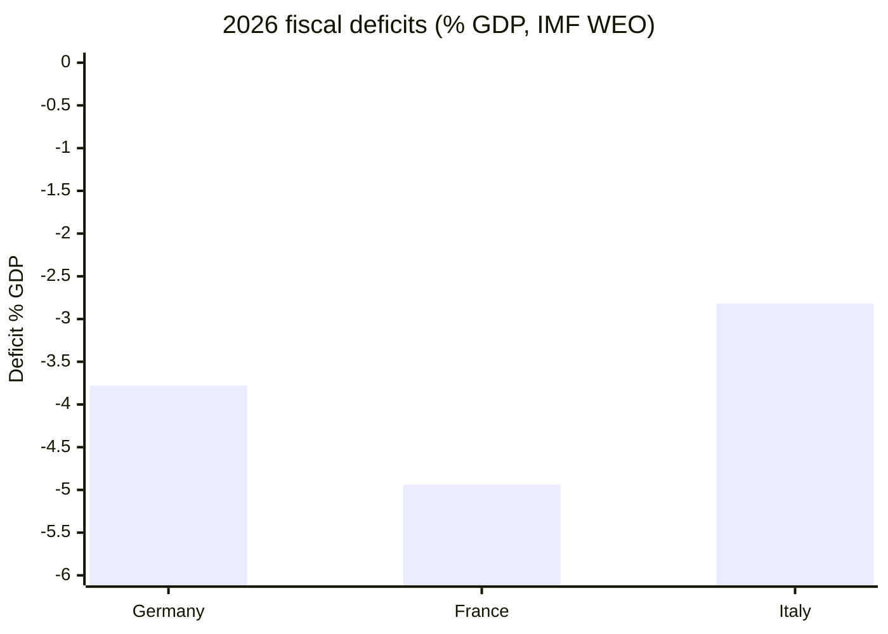

<!-- SPDX-FileCopyrightText: 2024-2026 Hack23 AB -->
<!-- SPDX-License-Identifier: Apache-2.0 -->

# Economic Context — Week Ahead (2026-05-31)

**Sole economic authority:** International Monetary Fund — World Economic Outlook
(SDMX 3.0 live feed, vintage 2025-09-23, 449 records). **Admiralty grade A1.** No
non-IMF source is used for any fiscal/monetary/growth claim in this run.

## 1 · Why Economics Matters This Week

The week of 1–7 June is a committee/group week building toward the 15–18 June
Strasbourg part-session. Two of the EP's highest-momentum clusters — the **2027 EU
budget guidelines** (adopted TA-10-2026-0112, 28 Apr) and **ECB scrutiny** (annual
report TA-10-2026-0034; VP appointment TA-10-2026-0060) — are economic. The IMF
macro backdrop is therefore directly load-bearing for the June political agenda, not
mere colour.

## 2 · Core IMF WEO Figures — Euro-Area Big Three

All values are IMF WEO projections; 🟡 Medium confidence reflects the inherent
uncertainty of forward projections, not data-source reliability (which is A1).

| Indicator (IMF WEO) | Germany | France | Italy |
|---------------------|:-------:|:------:|:-----:|
| Real GDP growth 2025 (`NGDP_RPCH`) | +0.24 % | +0.93 % | +0.54 % |
| Real GDP growth 2026 (`NGDP_RPCH`) | +0.79 % | +0.86 % | +0.52 % |
| Inflation 2025 (`PCPIPCH`) | 2.30 % | 0.93 % | 1.63 % |
| Inflation 2026 (`PCPIPCH`) | 2.65 % | 1.84 % | 2.64 % |
| Gen-gov balance 2025 (`GGXCNL_NGDP`) | −2.67 % | **−5.11 %** | −3.11 % |
| Gen-gov balance 2026 (`GGXCNL_NGDP`) | −3.78 % | **−4.94 %** | −2.82 % |

## 3 · Reading the Numbers

- **Sub-1 % growth across the bloc's core.** Germany inches from +0.24 % (2025) to
  +0.79 % (2026); France and Italy hover near +0.5–0.9 %. The euro area's largest
  economies are in a **low-growth holding pattern**, sharpening the political stakes of
  every spending and competitiveness file the EP touches in June.
- **France is the fiscal outlier.** A general-government deficit of **−5.11 % (2025)**
  easing only to **−4.94 % (2026)** keeps France well outside the 3 %-of-GDP Treaty
  reference value and squarely in excessive-deficit territory. This is the macro fact
  most likely to surface in 2027-budget and economic-governance debates.
- **Germany's deficit widens** from −2.67 % to −3.78 %, crossing the 3 % line in 2026 —
  a notable shift for the bloc's traditional fiscal anchor, reflecting defence and
  infrastructure spending.
- **Inflation re-accelerating mildly.** German (2.65 %) and Italian (2.64 %) 2026
  inflation tick back above 2.5 %, complicating the ECB's easing path and giving the
  EP's ECB-scrutiny thread fresh substance.

## 4 · Linkage to the June Agenda

| EP June thread | IMF data load-bearing? | Connection |
|----------------|:----------------------:|------------|
| 2027 budget guidelines (Section III) | ✅ | Low growth + French/German deficits constrain headroom |
| ECB annual report / monetary scrutiny | ✅ | Re-accelerating core inflation vs. easing expectations |
| EGF mobilisations (Audi, Tupperware) | ✅ | Weak growth → continued industrial displacement |
| Competitiveness / AI-trade strategy | ⚠️ partial | Stagnation is the backdrop for the competitiveness push |
| Foreign-policy resolutions | ❌ | No direct macro linkage |

## 5 · Forward Risk Flags (economic)

- 🟡 **French fiscal trajectory** — any EP economic-governance debate in June will sit
  against a deficit that is barely improving; expect this to be cited by both
  pro-consolidation and pro-investment camps.
- 🟡 **Inflation stickiness** — the 2026 uptick undercuts narratives of decisive
  disinflation and keeps ECB independence/credibility in the EP's sightline.
- 🟢 **No recession in the IMF baseline** — growth is weak but positive across DE/FR/IT,
  so the political frame is "stagnation management", not "crisis response".

## 6 · Confidence & Provenance

Source: IMF WEO via SDMX 3.0, query
`IMF.RES/WEO … EA+DEU+FRA+ITA.NGDP_RPCH+PCPIPCH+GGXCNL_NGDP.A`, cached at
`cache/imf/weo-ea-deu-fra-ita-gdp-inflation-fiscal.json`. Data-source reliability 🟢
High (A1); projection certainty 🟡 Medium (forward estimates, 2025-09 vintage).

## 4 · Economic-to-Legislative Linkage

The IMF outlook does not float free of the EP agenda — it **gives the June economic
debates their stakes**:

| IMF datapoint | EP thread | Linkage |
|---------------|-----------|---------|
| Euro-area growth <1 % | 2027 budget (TA-0112) | Weak growth tightens fiscal room |
| France deficit −4.94 % | Budget/EDP scrutiny | Excessive-deficit pressure |
| Inflation ~2.6 % (DE/IT) | ECB report (TA-0034) | Monetary-stance debate |
| Germany growth +0.79 % | Competitiveness (AI-trade TA-0183) | Stagnation drives reform push |

## 5 · Comparative Fiscal Picture

France's deficit is the **outlier**, nearly a full point worse than Germany and over two
points worse than Italy — which is why French fiscal politics is a latent wildcard
(`intelligence/wildcards-blackswans.md` W2).

## 6 · Inflation & Growth Cross-Read

| Economy | Growth | Inflation | Real signal |
|---------|:------:|:---------:|-------------|
| Germany | +0.79 % | 2.65 % | Stagflation-lite |
| France | +0.86 % | 1.84 % | Weak growth, contained prices |
| Italy | +0.52 % | 2.64 % | Weakest growth, sticky inflation |

## 7 · Source & Certainty Statement

All figures are IMF World Economic Outlook (A1) — the **sole authoritative economic
source** for this bundle per the data-collection protocol. Data confidence 🟢 High;
projection certainty 🟡 Medium given the forward-estimate nature and 2025-09 vintage.
No non-IMF economic figures appear anywhere in this run. Cross-ref
`intelligence/pestle-analysis.md` §8 and `executive-brief.md`.

## 8 · Economic-Risk Watch Items

| Watch item | Trigger | EP-agenda effect |
|------------|---------|------------------|
| French bond spread | >100 bps over Bund | Budget thread escalates |
| Euro-area inflation surprise | >3 % print | ECB-scrutiny sharpens |
| Growth downgrade | Sub-0.5 % revision | Competitiveness urgency |

All thresholds are illustrative; the **only asserted figures** are the IMF WEO projections
(A1). Market-derived triggers are framing aids, not sourced claims.

## 9 · Economic Bottom Line

The euro-area's largest economies are growing below 1 % with France carrying a near-5 %
deficit — a backdrop that makes the June 2027-budget and ECB debates **substantively
consequential rather than procedural**. Every figure here is IMF WEO (A1), the sole
economic authority for this run; projection certainty is 🟡 Medium given the 2025-09
vintage. Cross-ref `intelligence/pestle-analysis.md` §8 and `executive-brief.md`.

## Source Provenance

| Field | Value |
|-------|-------|
| **IMF Source** | `cache` |
| Vintage | WEO 2025-09 |
| Certainty | 🟡 Medium (forward estimates) |
