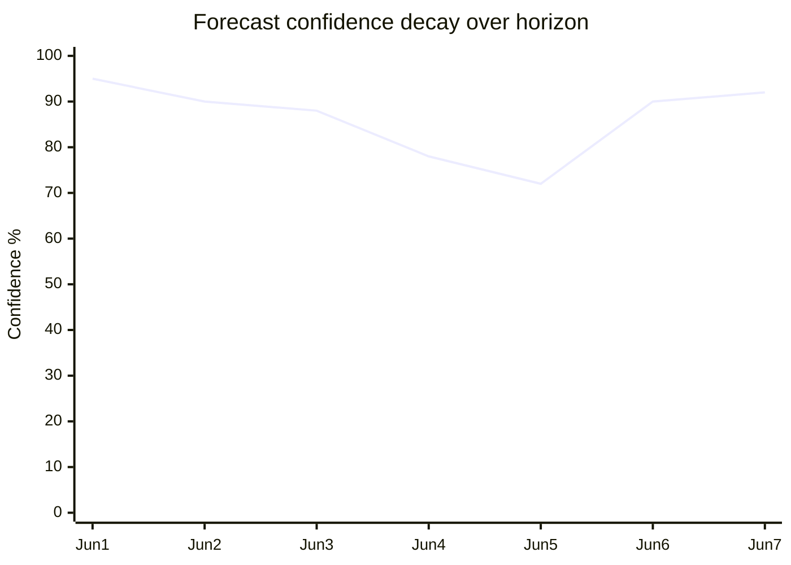

<!-- SPDX-FileCopyrightText: 2024-2026 Hack23 AB -->
<!-- SPDX-License-Identifier: Apache-2.0 -->

# Forward Projection — Week Ahead (2026-05-31 → 2026-06-07)

Day-by-day projection across the 7-day horizon, with **WEP-banded** expectations,
**structural-break tripwires**, and a **reference-class** anchor. Scope is strictly the
1–7 June committee/group week (no plenary); the 15–18 June part-session is the terminal
attractor the week builds toward.

## Reference-Class Anchor

| Reference class | Base rate | Source |
|-----------------|-----------|--------|
| Pre-session committee week → report adoptions | ~8–9 adopted texts/session pace | adopted-texts corpus (41 texts) |
| Wednesday plenary vote block | 20–40 votes consolidated | `intelligence/historical-baseline.md` §3 |
| Foreign-policy urgency per session | ≈1 (near-every session) | adopted-texts corpus |
| Draft OOB publication | Thursday before session week | EP calendar rhythm |

## Day-by-Day Projection

| Date | DOW | WEP expectation | Confidence |
|------|-----|-----------------|:----------:|
| 2026-06-01 | Mon | Committee/group prep begins; no floor activity | 🟢 Almost certain |
| 2026-06-02 | Tue | Committee report adoptions, amendment tabling | 🟢 Highly likely |
| 2026-06-03 | Wed | Peak committee activity; shadow negotiations | 🟢 Highly likely |
| 2026-06-04 | Thu | Possible early draft-OOB signals for 15–18 June | 🟡 Likely |
| 2026-06-05 | Fri | Group-line consolidation; quieter | 🟡 Likely |
| 2026-06-06 | Sat | Institutional quiet | 🟢 Almost certain |
| 2026-06-07 | Sun | Institutional quiet | 🟢 Almost certain |

## Terminal Attractor — 15–18 June Strasbourg

The week's output converges on the June part-session. Current hard signal: the **17 June
draft agenda** carries **5 debates + 13 votes** (`hasMore:true`, titles empty). Projected
to consolidate toward a typical 20–40-vote Wednesday block by the session week. 🟡 Medium
on final size; 🟢 High on direction (rising).

## Structural-Break Tripwires

A *break* is a deviation that invalidates the routine-week baseline and should re-trigger
analysis:

1. **Off-cycle Conference of Presidents meeting** → agenda-shock; revisit
   `intelligence/scenario-forecast.md` S5 + wildcard W1.
2. **Adopted-texts surge mid-week** (unexpected acceleration) → legislative-tempo break.
3. **17 June agenda *shrinks*** rather than grows → calendar slip; re-forecast session.
4. **French sovereign-spread widening / government instability** → wildcard W2 active;
   economic-governance thread shifts to crisis framing.
5. **A committee *rejects* a consent recommendation** → wildcard W3; trade-posture shift.

If none trip by 2026-06-04, the routine-week baseline (S1) is confirmed at ≥85 %.

## Projection Confidence Band

*(Confidence dips midweek when committee outcomes are most contingent, recovers at the
quiet weekend.)*

## Bottom Line

🟢 The 7-day horizon is **almost certainly a routine preparatory week** with no floor
votes, converging on a rising-but-unconsolidated June agenda. The five tripwires above
are the only events that would warrant re-analysis. Cross-ref
`intelligence/scenario-forecast.md` and `intelligence/wildcards-blackswans.md`.

## Beyond the 7-Day Horizon — Q3 2026 Outlook

| Window | Expected EP activity | Confidence |
|--------|----------------------|:----------:|
| 15–18 June | Strasbourg part-session; ~8–9 adopted texts | 🟢 High |
| July | Pre-recess session; budget momentum | 🟡 Medium |
| Aug | Summer recess | 🟢 High |
| Sept | Return; 2027 budget conciliation build-up | 🟡 Medium |

The 2027-budget thread (TA-0112) is the **dominant forward arc**, likely intensifying
through autumn toward the conciliation deadline. 🟡 Medium confidence on timing.

## Forward Bottom Line

Beyond the immediate quiet week, the trajectory points to an **economically-charged June
session** and a **budget-dominated autumn**. The IMF outlook (sub-1 % growth, France's
deficit) will keep fiscal politics central. Cross-ref
`intelligence/scenario-forecast.md` and `intelligence/wildcards-blackswans.md`.

## Source Reliability (Admiralty)

| Source | Admiralty grade | Note |
|--------|:---------------:|------|
| EP plenary calendar | A2 | Official, confirmed |
| IMF WEO (2025-09) | B2 | Authoritative, forward estimate |
| Adopted-texts corpus | A2 | Official, pace proxy |
| Foreseen-activities (B3 feed) | C3 | Subjects empty, structure only |
