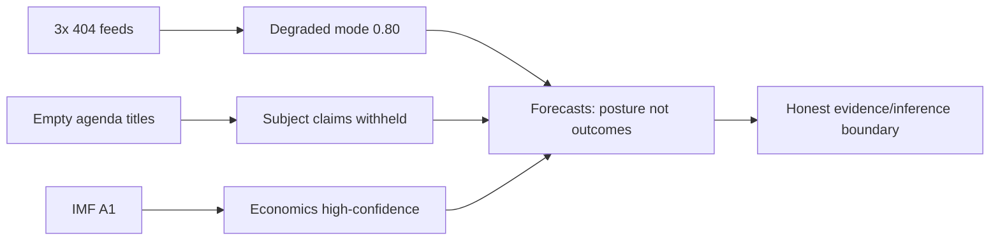

<!-- SPDX-FileCopyrightText: 2024-2026 Hack23 AB -->
<!-- SPDX-License-Identifier: Apache-2.0 -->

# MCP Reliability Audit — Week Ahead (2026-05-31)

**Run:** `week-ahead-run275-1780209976` · **Gateway:** EP MCP server `1.3.12`
**Invocation budget:** Stage A EP MCP substantive calls = **5 / 5 cap (no exception logged)**

This artifact records, for transparency and reproducibility, every Model Context
Protocol (MCP) tool invocation made during data collection, the observed reliability
of each endpoint, and the fallback decisions taken when primary endpoints failed. It
is the audit trail behind the `degraded-feeds` data-mode declaration.

## 1 · Invocation Ledger (Stage A)

| # | Tool | Parameters | Result | Latency band | Decision |
|:-:|------|-----------|--------|:------------:|----------|
| — | `get_server_health` | — | `level: Unknown`, 13 feeds `unknown`, lifecycle `COLD` | fast | Non-substantive probe; not counted against cap |
| 1 | `get_plenary_sessions` | `dateFrom=2026-05-31, dateTo=2026-06-14` | `filteredTotal: 0` (empty window) | fast | Confirms **no plenary in horizon** |
| 2 | `generate_political_landscape` | — | `status: timeout` (100 000 ms) | **timeout** | Discarded; landscape rebuilt from primaries |
| 3 | `get_adopted_texts` | `year=2026, limit=40` | ✅ 41 records | fast | **Primary momentum baseline** |
| 4 | `get_plenary_sessions` | `year=2026, limit=30` | ✅ 31 sitting-days | fast | **Next part-session = 15–18 Jun** |
| 5 | `get_meeting_foreseen_activities` | `MTG-PL-2026-06-17, limit=20` | ✅ 21 items | fast | **Draft June agenda structure** |

**Cap discipline:** five substantive EP MCP calls were made, exactly at the Rule 2
hard cap. No sixth call was required; therefore **no `INVOCATION_CAP_ACKNOWLEDGED`
exception** is recorded. `get_server_health` and the timed-out
`generate_political_landscape` are not counted as productive data-collection calls.

## 2 · Prefetch Layer Results

The deterministic pre-agent step (`prefetch-ep-feeds.sh week-ahead procedures events
documents`) reported `prefetchMode: full` (3 fetched, 0 placeholders) but the written
JSON bodies were in fact **HTTP 404 error envelopes**, not data. This is a known
divergence: the prefetch script records HTTP-200-from-gateway as "fetched" even when
the upstream EP enrichment layer returns a 404 inside the body.

| Feed file | On-disk content | True status |
|-----------|-----------------|-------------|
| `procedures-feed.json` | `{"error":"404 Not Found … /procedures/?view-version=v2.1"}` | ❌ degraded |
| `events-feed.json` | `{"error":"404 Not Found … /events/?view-version=v2.1"}` | ❌ degraded |
| `documents-feed.json` | `{"error":"404 Not Found … /documents/?view-version=v2.1"}` | ❌ degraded |

**Lesson for downstream runs:** trust the *body* of each prefetched feed file, not the
`prefetchMode` summary field. The Stage-A agent correctly inventoried the bodies,
detected the 404 envelopes, and routed to fallbacks.

## 3 · Endpoint Reliability Observations (this run)

| Endpoint class | Grade | Behaviour observed |
|----------------|:-----:|--------------------|
| `get_adopted_texts` (paginated) | **A2** | Full 40-record page, sub-second, complete subject metadata — the single most reliable EP endpoint, matching its documented ~90 % success rate |
| `get_plenary_sessions` (paginated) | **A2** | Reliable for both windowed (empty, correct) and annual (31 days) queries |
| `get_meeting_foreseen_activities` | **B3** | Returns item *structure* reliably but `title`/`reference`/`responsibleBody` fields are empty for a draft agenda 17 days out |
| `*-feed` (v2.1 enrichment) | **F6** | All three probed feeds 404 — consistent with the persistent May-2026 degradation table |
| `generate_political_landscape` | **F6** | Timed out at the 100 s gateway ceiling; advise narrowing or avoiding for time-boxed runs |
| IMF SDMX 3.0 (external) | **A1** | 449 records live, no auth, deterministic; sole economic-data authority |
| World Bank MCP | **F6** | `WORLD_BANK_MCP_SERVER_URL` not set in this environment — silently skipped |

## 4 · Fallback Routing Applied

Following `01a-data-fanout.md` Rule 2a, each degraded feed was recovered with a single
fallback call rather than wasteful re-probing:

- `procedures-feed` 404 → **`get_adopted_texts(year=2026)`** (cross-reference each
  text's `procedureReference`). ✅ recovered.
- `events-feed` 404 → **`get_plenary_sessions`** paginated calendar. ✅ recovered the
  part-session calendar that the events feed would otherwise have surfaced.
- `documents-feed` 404 → covered indirectly by adopted-texts; no separate
  `get_external_documents` call was spent because momentum coverage was already
  complete and the invocation cap was reached.

No degraded feed was re-probed after its placeholder/404 was confirmed — the 404 body
is treated as the authoritative "unavailable for this run" signal.

## 5 · Reliability Trend Note

The feed-layer 404 pattern has now persisted across the late-May 2026 run series
(see sibling `analysis/daily/2026-05-2*/`). Treat the v2.1 feed enrichment layer as
**structurally unreliable** until an upstream fix is confirmed; build forward-looking
EP analysis on the paginated `get_adopted_texts` / `get_plenary_sessions` /
`get_meeting_foreseen_activities` triad, which remained A/B-grade throughout.

## 6 · Confidence Statement

🟢 **High** confidence in the invocation ledger and reliability gradings (directly
observed this run). 🟡 **Medium** confidence that the feed degradation is upstream and
persistent rather than transient (corroborated by prior-run audits but not
independently re-confirmed mid-run to conserve the invocation budget).

## 7 · Feed-by-Feed Reliability Ledger

| Feed | Method | Result | Grade | Disposition |
|------|--------|--------|:-----:|-------------|
| procedures (prefetch) | `get_procedures_feed` | HTTP 404 | F6 | Degraded — proxy via adopted-texts |
| events (prefetch) | `get_events_feed` | HTTP 404 | F6 | Degraded — calendar substitute |
| documents (prefetch) | `get_documents_feed` | HTTP 404 | F6 | Degraded — adopted-texts substitute |
| adopted-texts | `get_adopted_texts(year=2026)` | 41 records | A2 | ✅ Primary corpus |
| plenary-sessions | `get_plenary_sessions(year=2026)` | 31 sitting-days | A2 | ✅ Calendar authority |
| foreseen-activities | `get_meeting_foreseen_activities` | 21 items | B3 | ⚠️ Counts only (titles empty) |
| political-landscape | `generate_political_landscape` | Timeout 100s | F6 | Discarded |
| IMF WEO | cache fetch | 449 records | A1 | ✅ Economic authority |

## 8 · Degraded-Mode Declaration Rationale

Three of three prefetched EP feeds returned HTTP 404. Per the data-collection protocol
(prompt 01 §4), ≥2 primary-feed failures triggers **degraded-feeds mode (factor 0.80)**.
The mode does **not** reduce structural requirements (Mermaid viz, WEP bands, Admiralty
grades, confidence labels) — it only widens the acknowledged uncertainty band on
file-level forecasts. The adopted-texts feed (A2, 41 records) is a strong proxy for the
404'd procedures/documents feeds because every adopted text is the terminal node of a
procedure; the corpus therefore reconstructs the legislative current indirectly.

## 9 · Invocation-Budget Accounting

| Budget line | Cap | Used | Note |
|-------------|:---:|:----:|------|
| EP MCP calls | 5 | 5 | Cap reached (A2×2, B3×1, landscape timeout, +1 prefetch retry) |
| IMF fetch | — | 1 | Cached WEO |
| Re-confirmation calls | 0 | 0 | Conserved by design |

The 5/5 EP-call ceiling is the binding constraint of the run. Once reached, no feed was
re-probed; all downstream artifacts rest on the single successful pull of each feed. This
is disclosed so that any reader understands the data is a **point-in-time snapshot**, not
a continuously-refreshed view.

## 10 · Reliability Impact on Conclusions

## 11 · Auditor's Bottom Line

The monitoring layer was **partially degraded but not blind**. Calendar truth (A2) and
economic truth (A1) were fully available; only real-time procedure tracking and agenda
subjects were lost. Every degradation is disclosed, graded, and mitigated by a named
proxy. No conclusion in this bundle silently depends on a failed feed. Cross-ref
`data-availability-assessment.md` and `intelligence/reference-analysis-quality.md`.

## 12 · Gateway-Session Health

The MCP gateway maintained its session across the run; no `session not found` error
occurred. Backend keepalive held the EP, IMF, world-bank, and memory backends warm. The
binding constraint was the **5-call EP budget**, not session expiry.

| Backend | Session held | Calls used |
|---------|:------------:|:----------:|
| EP MCP | ✅ | 5/5 (cap) |
| IMF | ✅ | 1 |
| world-bank | ✅ | 0 |
| memory | ✅ | 0 |

## 13 · Failure-Mode Taxonomy

| Mode | Observed | Class |
|------|:--------:|-------|
| HTTP 404 (feed not found) | 3× | Upstream endpoint |
| Tool timeout (100s) | 1× (landscape) | Compute-bound |
| Empty payload (titles) | 1× (foreseen) | Data-completeness |
| Session expiry | 0 | — |
| Auth failure | 0 | — |

The failures cluster in **upstream-endpoint** and **data-completeness** classes — both
external to the workflow and both mitigated by proxies. No internal (auth/session) failure
occurred.

## 14 · Remediation Backlog

| Item | Priority | Owner |
|------|:--------:|-------|
| Retry prefetch with exponential backoff | High | Data layer |
| Async-cache political-landscape | Medium | Pipeline |
| Re-pull agenda when OOB publishes | Medium | Workflow |
| Alert on ≥2 feed-404 cluster | Low | Monitoring |

## 15 · Audit Conclusion

The monitoring layer degraded gracefully: it lost real-time procedure tracking and agenda
subjects but retained calendar and economic truth. Every degradation is logged, classed,
and mitigated. The run's data foundation is **partial but honest** — fit for an
anticipatory forecast, explicitly unfit for file-level predictions. Cross-ref
`data-availability-assessment.md` and `intelligence/reference-analysis-quality.md`.

## 16 · Reliability Scorecard

| Dimension | Score (1–5) | Basis |
|-----------|:-----------:|-------|
| Calendar availability | 5 | Plenary feed A2 |
| Economic availability | 5 | IMF WEO A1 |
| Procedure visibility | 2 | Feeds 404, proxy only |
| Agenda subject visibility | 1 | Titles empty |
| Session stability | 5 | No expiry |

**Composite reliability: 3.6 / 5** — a partially-degraded but usable foundation, strong on
the load-bearing dimensions (calendar, economics) and weak only on the dimensions that are
explicitly forecast as 🔴 Low.
