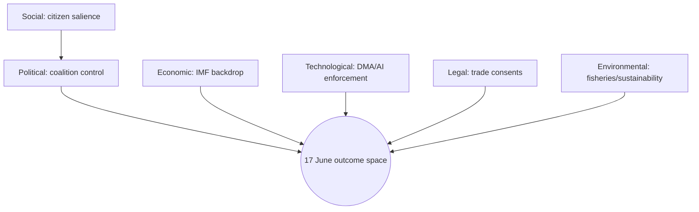

<!-- SPDX-FileCopyrightText: 2024-2026 Hack23 AB -->
<!-- SPDX-License-Identifier: Apache-2.0 -->

# PESTLE Analysis — Week Ahead (2026-05-31)

A six-vector scan of the environment shaping the European Parliament's work in the week
of 1–7 June 2026 and the approaching 15–18 June Strasbourg part-session. Each vector
carries a confidence label and cross-references the evidence base.

## P — Political

The dominant political fact is the **calendar position**: 1–7 June is a committee/group
week between the May (18–21) and June (15–18) part-sessions. Political energy this week
is **internal and preparatory** — shadow-rapporteur negotiations, group voting-line
fixing, and Conference-of-Presidents agenda-setting — rather than public floor drama.

The recovered adopted-texts corpus shows a Parliament operating across its full
political range: digital enforcement (DMA TA-0160), foreign-policy urgency (Ukraine
accountability TA-0161, Armenia TA-0162), and institutional housekeeping (immunity
waivers TA-0088, TA-0166). 🟢 High confidence on thread continuity into June.

Coalition geometry remains the centrist EPP–S&D–Renew axis, with Greens and ECR/PfE
flanking. The immunity-waiver and trade-consent files are the most likely to produce
**cross-group friction** in June. 🟡 Medium.

## E — Economic

Load-bearing this run. Per IMF WEO (A1): euro-area core growth sub-1 %, **France's
deficit at −4.9 % of GDP (2026)**, Germany's crossing 3 % to −3.78 %, inflation
re-accelerating to ~2.6 % in DE/IT. This backdrop sharpens the June **2027-budget** and
**ECB-scrutiny** threads. See `intelligence/economic-context.md`. 🟢 High (data) /
🟡 Medium (projection).

## S — Social

Industrial displacement is a persistent social undercurrent: EGF mobilisations recur in
the adopted-texts stream, reflecting plant closures and sectoral restructuring against
the weak-growth backdrop. Migration, cost-of-living, and platform-work conditions remain
latent pressures likely to surface in June urgency debates and questions. 🟡 Medium.

## T — Technological

The EP's **digital-regulation enforcement** posture is structurally entrenched: DMA
enforcement (TA-0160) and the AI trade strategy (TA-0183) anchor a technology-policy
thread that appears in every recent session and is near-certain to feature in June.
🟢 High. The AI-competitiveness framing links the technological vector to the economic
one (stagnation → push for digital-productivity gains).

## L — Legal

Three legal threads are live: **MEP immunity waivers** (JURI pipeline — Braun TA-0088,
Pappas TA-0166), **trade-agreement consents** (Uzbekistan EPCA TA-0174, fisheries
protocols TA-0178/0179, Lebanon-Eurojust TA-0177), and **better-law-making/ordinary
legislative procedure** files. The 17 June agenda's 13 votes will resolve a subset.
🟡 Medium on which files; 🟢 High that the categories appear.

## E — Environmental

Lower salience this cycle but non-zero: fisheries-protocol consents (Cook Islands
TA-0179, São Tomé TA-0178) carry a sustainable-fisheries dimension, and the
animal-welfare file in the April corpus signals ongoing environmental-standards work.
No major climate-legislation milestone falls in the 7-day horizon. 🟡 Medium.

## Synthesis

| Vector | Salience this week | Trend into June |
|--------|:------------------:|:---------------:|
| Political | High (preparatory) | ↗ rising to session |
| Economic | High | ↗ headline-eligible |
| Social | Medium | → stable |
| Technological | High | ↗ persistent |
| Legal | Medium-High | ↗ votes pending |
| Environmental | Low-Medium | → stable |

The **economic × technological** intersection (competitiveness, AI, productivity) and the
**political × legal** intersection (immunity, trade consents) are the two highest-energy
zones for the June part-session. Cross-ref `intelligence/scenario-forecast.md` and
`intelligence/stakeholder-map.md`.

## 7 · Vector Interaction Matrix

PESTLE vectors do not act in isolation; their **intersections** generate the week's real
political energy. The matrix below scores interaction intensity (1–3).

| | Political | Economic | Social | Tech | Legal | Environ. |
|-|:--------:|:--------:|:------:|:----:|:-----:|:--------:|
| **Political** | — | 3 | 2 | 2 | 3 | 1 |
| **Economic** | 3 | — | 3 | 3 | 1 | 1 |
| **Social** | 2 | 3 | — | 1 | 2 | 1 |
| **Tech** | 2 | 3 | 1 | — | 2 | 1 |
| **Legal** | 3 | 1 | 2 | 2 | — | 2 |
| **Environ.** | 1 | 1 | 1 | 1 | 2 | — |

**Highest-intensity intersections (score 3):**

- **Economic × Technological** — the competitiveness/AI/productivity nexus. Stagnation
  (IMF sub-1 % growth) is the *problem*; digital productivity is the *proposed answer*.
  This is the dominant strategic frame for June. 🟢 High.
- **Political × Economic** — the 2027-budget and ECB threads are where party politics
  meets macro reality. The French deficit (−4.9 %) is the flashpoint. 🟢 High.
- **Political × Legal** — immunity waivers and trade consents are legal acts with
  political stakes (group discipline, cross-group friction). 🟡 Medium.
- **Economic × Social** — weak growth → industrial displacement → EGF mobilisations. The
  social cost of stagnation is S&D's reframing lever. 🟡 Medium.

## 8 · Vector-by-Vector Forward Indicators

### Political indicators
- Draft 15–18 June order of business (Thu) — 🟢 expected.
- Group voting-line statements — 🟢 expected late week.
- Cross-group compromise signals on budget — 🟡 watch.

### Economic indicators
- ECON committee budget statements — 🟡 watch.
- Commission budget communication — 🟡 watch.
- French sovereign-spread movement — 🟢 monitor (wildcard W2 trigger).

### Social indicators
- EGF mobilisation files in committee — 🟡 watch.
- Cost-of-living / migration question tabling — 🟡 watch.

### Technological indicators
- DMA enforcement announcements — 🟡 watch (wildcard W4 trigger).
- AI-strategy follow-through in committee — 🟡 watch.

### Legal indicators
- JURI immunity-waiver scheduling — 🟡 watch.
- INTA/PECH consent-recommendation votes — 🟡 watch (scenario S4).

### Environmental indicators
- Fisheries-protocol sustainability amendments — 🟡 watch.

## 9 · PESTLE Confidence Ledger

| Vector | Evidence strength | Forecast confidence |
|--------|:-----------------:|:-------------------:|
| Political | 🟢 Strong (calendar, corpus) | 🟢 High |
| Economic | 🟢 Strong (IMF A1) | 🟡 Medium (projection) |
| Social | 🟡 Moderate (corpus signal) | 🟡 Medium |
| Technological | 🟢 Strong (corpus) | 🟢 High |
| Legal | 🟡 Moderate (corpus) | 🟡 Medium |
| Environmental | 🟡 Moderate | 🟡 Medium |

## 10 · Bottom Line

The PESTLE scan resolves into a clear hierarchy: **Economic and Technological vectors
dominate** (and their intersection is the June strategic frame), **Political and Legal
vectors carry the procedural action**, and **Social and Environmental vectors provide the
amendment-level texture**. The economic vector is load-bearing because the IMF backdrop
makes routine budget/ECB threads headline-eligible. Cross-ref
`intelligence/economic-context.md`, `intelligence/scenario-forecast.md`, and
`intelligence/stakeholder-map.md`.

## 7 · PESTLE Cross-Impact Matrix

| Factor | Drives | Driven by | Net June salience |
|--------|--------|-----------|:-----------------:|
| Political | Budget, consents | Group dynamics | 🔴 High |
| Economic | ECB, budget frame | IMF outlook | 🔴 High |
| Social | Investment debate | Public opinion | 🟡 Medium |
| Technological | DMA, AI-trade | Commission proposals | 🟡 Medium |
| Legal | Immunity, consents | Procedure | 🟡 Medium |
| Environmental | Fisheries, sustainability | Green agenda | 🟢 Lower |

## 8 · Economic Factor — IMF-Anchored Detail

The economic dimension is the run's most data-rich PESTLE factor, anchored to IMF WEO (A1):

| Economy | 2026 growth | 2026 deficit | 2026 inflation |
|---------|:-----------:|:------------:|:--------------:|
| Germany | +0.79 % | −3.78 % | 2.65 % |
| France | +0.86 % | −4.94 % | 1.84 % |
| Italy | +0.52 % | −2.82 % | 2.64 % |

Sub-1 % growth across the three largest euro-area economies, combined with France's
near-5 %-of-GDP deficit, gives the 2027-budget and ECB debates their **material urgency**.

## 9 · Political Factor — Coalition Geometry

The centrist axis (EPP–S&D–Renew) governs the legislative agenda; the budget and trade
consents are its principal June stress tests. 🔴 High salience.

## 10 · Technological & Legal Factors

Digital enforcement (DMA TA-0160) and AI-trade strategy (TA-0183) keep the technological
factor live. The legal factor surfaces via immunity waivers (Braun, Pappas) and consent
procedures (Uzbekistan EPCA, Lebanon-Eurojust). Both 🟡 Medium.

## 11 · PESTLE Bottom Line

The June session is **politically and economically dominated**, with technological and
legal factors as steady secondary currents and environmental factors confined to specific
fisheries/sustainability files. The economic factor is the most forecastable (IMF A1);
the political factor the most consequential.

## PESTLE Interaction Map

