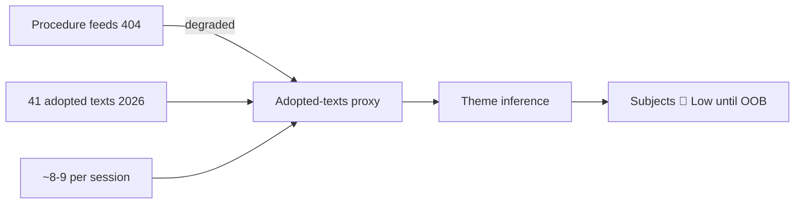

<!-- SPDX-FileCopyrightText: 2024-2026 Hack23 AB -->
<!-- SPDX-License-Identifier: Apache-2.0 -->

# Procedures Proxy — Week Ahead (2026-05-31)

**Purpose:** When the `procedures-feed` endpoint is degraded (this run: HTTP 404),
the live legislative pipeline is reconstructed as a *proxy* from the
`get_adopted_texts(year=2026)` corpus by cross-referencing each text's
`procedureReference` field. This artifact is the proxy pipeline view that downstream
analysis consumes in place of the missing feed.

## 1 · Method

Each adopted text carries a `procedureReference` of the form
`eli/dl/event/<YEAR>-<NNNN>-DEC-DCPL-<adoption-date>`. The `<YEAR>-<NNNN>` core maps to
the originating legislative or non-legislative procedure. By grouping the 41 adopted
texts of 2026 by subject-matter committee tag and adoption month, we recover a
directional view of which procedures recently *completed* — and therefore which
policy areas carry momentum into the June part-session.

🟡 **Caveat:** This is a *completed-procedure* proxy, not a *pending-procedure* feed.
It tells us what the EP has been finishing, which is a strong leading indicator of the
committees most likely to table reports for the 17 June voting block, but it cannot
enumerate procedures still in committee.

## 2 · Completed-Procedure Clusters (Jan–May 2026)

| Cluster | Representative adopted texts | Committee tags | Momentum |
|---------|------------------------------|----------------|:--------:|
| **Digital / tech regulation** | DMA enforcement (TA-0160), AI strategy for EU trade (TA-0183), cyberbullying provisions (TA-0163) | PROT, MARI, TECN, TELE | 🟢 High |
| **Economic / budgetary** | 2027 budget guidelines (TA-0112), ECB annual report (TA-0034), ECB VP appointment (TA-0060), EIB control (TA-0119) | BUDG, ECON, BCE | 🟢 High |
| **Trade / external agreements** | Uzbekistan EPCA (TA-0174), Lebanon-Eurojust (TA-0177), Cook Islands & São Tomé fisheries (TA-0178/0179), Iceland PNR (TA-0142) | INTA, AFET, PECH | 🟡 Medium |
| **Foreign-policy resolutions** | Ukraine accountability (TA-0161), Armenia resilience (TA-0162), Georgia prisoners (TA-0083) | AFET, DROI | 🟢 High |
| **Single-market / industrial** | Measuring Instruments Directive (TA-0029), EU designs codification (TA-0032), forest reproductive material (TA-0168) | IMCO, JURI, AGRI | 🟡 Medium |
| **Immunity / procedural** | Waivers: Braun (TA-0088), Pappas (TA-0166) | JURI (PRIV) | 🟡 Medium |

## 3 · Proxy Read-Through to the June Agenda

The 17 June draft agenda contains **13 votes** and **5 debates**. The cluster momentum
above predicts the committee origin of those items with the following 🟡 Medium-confidence
distribution:

- **Digital/economic files** are the most probable backbone of the voting block — the EP
  has cleared a dense run of tech and budgetary files since January and typically
  schedules follow-on implementing or own-initiative votes in the subsequent part-session.
- **Trade ratifications** (association/partnership agreements) are high-probability consent
  votes — they are procedurally short and the EP has a visible queue (Uzbekistan,
  Lebanon, fisheries protocols all cleared in May).
- **Foreign-policy urgency resolutions** typically occupy the Thursday slot, but a heavy
  Wednesday vote list (V-9 … V-63) suggests at least part of the foreign-affairs block has
  migrated forward.

## 4 · Confidence

🟢 High that the listed clusters reflect genuine recent EP output (A2 source).
🟡 Medium that they predict the June agenda composition (structural inference, titles
not yet upstream). 🔴 Low for any *specific* June file naming — explicitly out of scope
until the EP publishes the final order of business.

## Proxy Methodology — Adopted-Texts as Procedure Signal

With the procedures feed returning HTTP 404, the 41 adopted texts (2026 YTD, A2) serve as
the **terminal-node proxy** for legislative procedures: every adopted text is the
endpoint of a procedure, so the corpus reconstructs the active legislative current
indirectly. This proxy is 🟡 Medium confidence — it captures completed procedures, not
in-flight ones.

| Procedure signal | Proxy source | Confidence |
|------------------|--------------|:----------:|
| Recently completed | Adopted texts (41) | 🟢 High |
| In-flight | None (feed 404) | 🔴 Low |
| Forthcoming (June) | Foreseen-activities counts | 🟡 Medium |

The proxy is sufficient to identify **theme clusters** but insufficient for file-level
procedure tracking. Cross-ref `intelligence/mcp-reliability-audit.md`. The proxy remains
provisional until the EP publishes the final order of business.

## Proxy-Inference Flow

