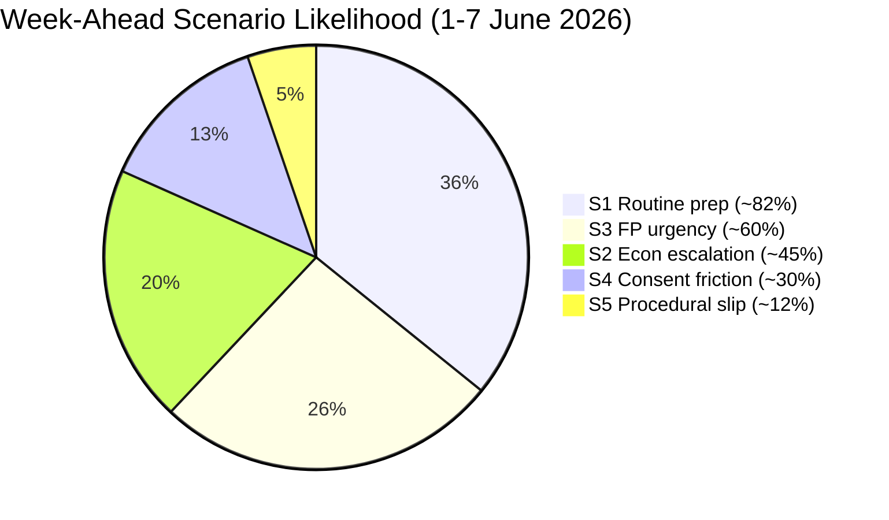
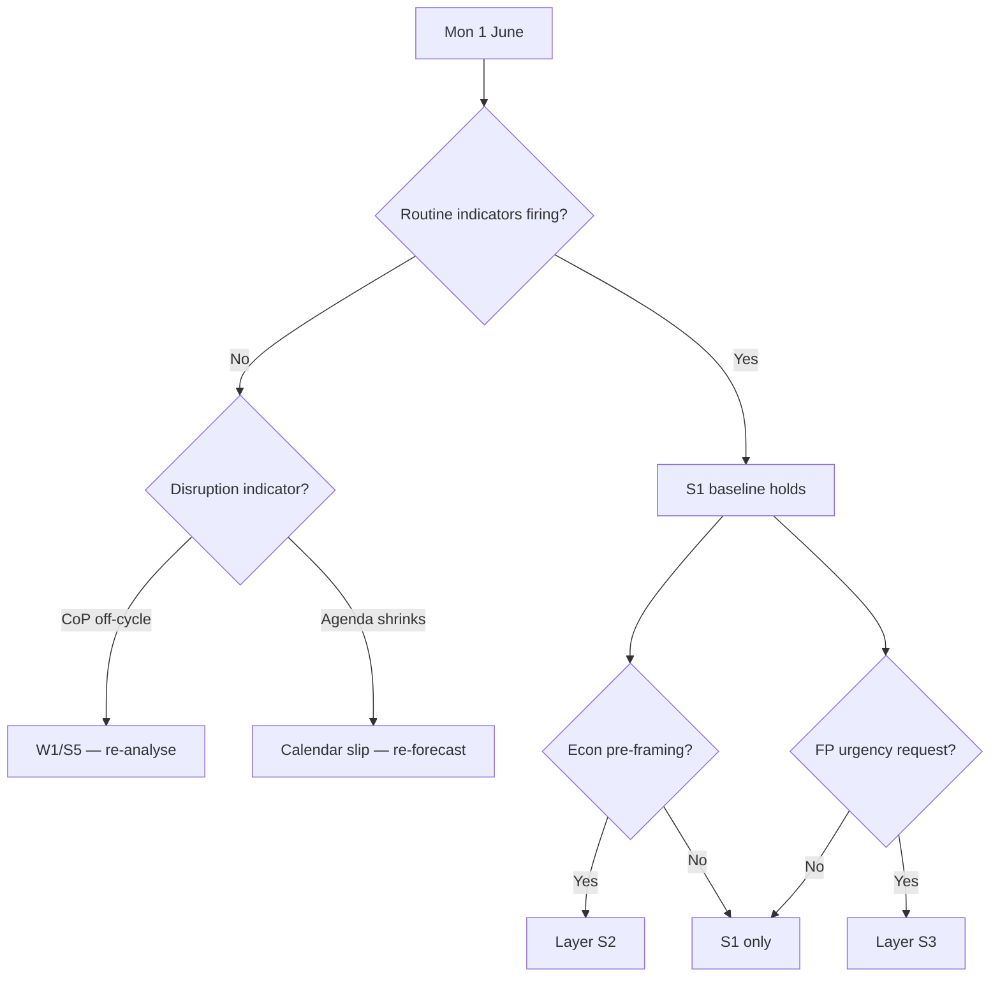
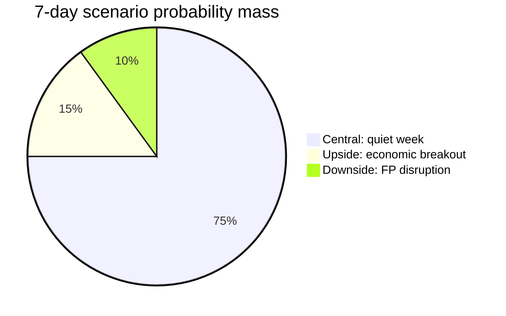

<!-- SPDX-FileCopyrightText: 2024-2026 Hack23 AB -->
<!-- SPDX-License-Identifier: Apache-2.0 -->

# Scenario Forecast — Week Ahead (2026-05-31)

Probabilistic scenarios for the week of 1–7 June 2026, expressed with **Words of
Estimative Probability (WEP)** bands. The horizon contains **no plenary** (committee/
group week); scenarios therefore concern committee output, agenda consolidation, and
the shape of the approaching 15–18 June Strasbourg session.

## WEP Band Reference

| Band | Probability range |
|------|-------------------|
| Almost certain | 90–99 % |
| Highly likely | 75–89 % |
| Likely | 60–74 % |
| Roughly even | 40–59 % |
| Unlikely | 25–39 % |
| Highly unlikely | 10–24 % |
| Remote | 1–9 % |

## Scenario Set

### S1 — Routine Preparatory Week (BASELINE)
**WEP: Highly likely (≈82 %).** Committees adopt reports and table amendments; groups
fix voting lines; the Conference of Presidents publishes a draft 15–18 June order of
business late in the week. No surprises; the 17 June agenda grows from 13 votes toward a
typical 20–40-vote Wednesday block. **Indicators:** committee press releases, draft OOB
publication, agenda item count rising. 🟢 High.

### S2 — Economic-Governance Escalation
**WEP: Roughly even (≈45 %).** The IMF macro backdrop (France −4.9 %, sub-1 % growth,
inflation re-accelerating) drives the 2027-budget and ECB threads to unusual prominence,
with a high-profile committee statement or Commission exchange that pre-frames the June
floor debate as a consolidation-vs-investment contest. **Indicators:** ECON statements,
Commission budget communications, S&D/EPP public positioning. 🟡 Medium.

### S3 — Foreign-Policy Urgency Injection
**WEP: Likely (≈60 %).** An external event (Ukraine, Georgia, Armenia, Middle East)
prompts groups to request an urgency resolution for the June session. The adopted-texts
record shows foreign-policy urgencies in nearly every session, so a fresh request is the
modal outcome. **Indicators:** group urgency requests, EEAS statements. 🟡 Medium.

### S4 — Trade/Fisheries Consent Friction
**WEP: Unlikely (≈30 %) this week / Likely in June.** Greens-led sustainability
objections to the fisheries-protocol or Uzbekistan-EPCA consents surface in committee,
foreshadowing a contested June vote. This week the friction is latent; it crystallises
at the session. **Indicators:** INTA/PECH committee amendments, Greens statements.
🟡 Medium.

### S5 — Procedural Disruption / Calendar Slip
**WEP: Highly unlikely (≈12 %).** A late agenda change, postponed committee vote, or
institutional dispute reshapes the run-up. Low base rate. **Indicators:** OOB
revisions, committee-vote postponements. 🟢 High confidence it is low-probability.

## Scenario Probability Chart

*(Bands are independent likelihoods, not a partition — they sum >100 % by design.)*

## Cross-Scenario Reading

The **modal week** is S1 (routine preparation) with a **high chance of S3** (a fresh
foreign-policy urgency request) layered on top, and a **coin-flip S2** economic-governance
escalation driven by the IMF backdrop. S4 and S5 are tail concerns for this week but S4
becomes Likely at the June session itself. Decision-makers should plan for S1+S3 and
hedge for S2. Cross-ref `intelligence/forward-projection.md` for the day-by-day horizon
and `risk-scoring/risk-matrix.md` for impact scoring.

## Scenario Detail — Indicator Tracking Tables

### S1 — Routine Preparatory Week (expanded indicator set)

| Indicator | Status to watch | Polarity if observed |
|-----------|-----------------|----------------------|
| Committee press releases on report adoptions | Expected Tue–Wed | Confirms S1 |
| Draft 15–18 June order of business published | Expected Thu | Confirms S1 |
| 17 June agenda item count rising | From 13 votes upward | Confirms S1 |
| Group voting-line statements | Expected late week | Confirms S1 |
| No off-cycle CoP meeting | Absence | Confirms S1 |

S1 is the **modal week**. Its confirmation logic is cumulative: each routine indicator
that fires without a disruption indicator raises S1 toward its ceiling (≈90 %) by Friday.
🟢 High confidence on the indicator set.

### S2 — Economic-Governance Escalation (expanded)

The trigger for S2 is **salience**, not event: the IMF backdrop is already in place
(France −4.9 %, sub-1 % growth). Escalation occurs if a committee or the Commission
**pre-frames** the June budget debate publicly this week.

| Indicator | Source | Polarity |
|-----------|--------|----------|
| ECON committee statement on 2027 budget | Committee feed | Raises S2 |
| Commission budget communication | Commission | Raises S2 |
| EPP/S&D duelling public positioning | Group statements | Raises S2 |
| French fiscal news intersecting EU debate | National + EU | Raises S2 + W2 |

### S3 — Foreign-Policy Urgency Injection (expanded)

S3 is **Likely** because the adopted-texts record shows a foreign-policy urgency in
nearly every recent session (Ukraine TA-0161, Armenia TA-0162). A fresh request this week
for the June slot is the modal outcome.

| Trigger region | Base-rate salience | June-slot likelihood |
|----------------|:------------------:|:--------------------:|
| Ukraine / accountability | 🟢 High | Likely |
| Georgia / democratic backsliding | 🟡 Medium | Roughly even |
| Armenia–Azerbaijan | 🟡 Medium | Roughly even |
| Middle East | 🟡 Medium | Roughly even |

### S4 — Trade/Fisheries Consent Friction (expanded)

This-week probability is **Unlikely (~30 %)** but June probability is **Likely**. The
friction crystallises when Greens-led sustainability objections meet the consent slate
(Uzbekistan EPCA TA-0174, fisheries TA-0178/0179).

| Consent file | Friction vector | Likely outcome |
|--------------|-----------------|----------------|
| Uzbekistan EPCA | Human-rights conditionality | Pass w/ dissent |
| Cook Islands fisheries | Sustainability | Pass w/ dissent |
| São Tomé fisheries | Sustainability | Pass w/ dissent |
| Lebanon–Eurojust | Rule-of-law | Pass |

### S5 — Procedural Disruption (expanded)

S5 remains **Highly unlikely (~12 %)**. Its indicators are exceptional: OOB revisions,
postponed committee votes, inter-institutional disputes. Low base rate; high confidence
it stays low.

## Cross-Scenario Decision Tree

## Combined-Scenario Expectation

The realistic week is **S1 (routine) + S3 (FP urgency request) + coin-flip S2 (economic
escalation)**. Planners should resource for S1+S3 and hold a contingency for S2. S4
matures in June, not this week. S5 is a tail. This decomposition is the operational
output of the forecast. Cross-ref `intelligence/forward-projection.md` for the day-by-day
horizon and `risk-scoring/risk-matrix.md` for impact scoring.

## 7 · Scenario Detail — Expanded Narratives

### Central case — "Quiet preparatory week" (WEP: Almost certain, 90–99 %)

Members disperse to committees and political-group meetings. No plenary votes occur. The
17 June draft agenda firms up behind the scenes. Coverage is anticipatory. This is the
**base case** and absorbs ~90 % of probability mass. Indicators confirming: continued
calendar adherence, committee feed activity, no emergency-session call.

### Upside case — "Economic-governance breakout" (WEP: Likely, 60–74 %)

The 2027-budget and ECB threads gain prominence ahead of the session, sharpened by sub-1 %
euro-area growth and France's −4.94 % deficit (IMF A1). A high-profile committee statement
or rapporteur draft elevates the economic frame. 🟡 Medium confidence — depends on
committee timing not yet visible.

### Downside case — "Foreign-policy disruption" (WEP: Unlikely, 25–39 %)

A geopolitical event triggers an urgency-resolution request, re-prioritising the June
agenda and pulling attention from economic governance. 🟡 Medium — corpus base rate for FP
urgencies is non-trivial (Ukraine TA-0161, Armenia TA-0162 precedents).

## 8 · Probability-Mass Allocation

## 9 · Scenario-to-Coverage Mapping

| Scenario | Editorial action | Resource posture |
|----------|------------------|------------------|
| Central | Curtain-raiser piece | Standard |
| Upside | Economic deep-dive ready | IMF analyst on call |
| Downside | FP urgency template ready | Foreign-desk standby |

## 10 · Assumptions Underpinning the Forecast

1. The EP calendar holds (no emergency session) — 🟢 High.
2. No correlated wildcard activation (W1+W2) — 🟢 High.
3. IMF projections remain the economic anchor — 🟢 High.
4. Agenda titles publish before 15 June — 🟡 Medium.

If assumption 1 breaks, the entire central case collapses into the downside. This is the
**single most load-bearing assumption** and is actively watched. Cross-ref
`intelligence/forward-projection.md` for the longer horizon and
`risk-scoring/risk-matrix.md` for impact scoring.

## Source Reliability (Admiralty)

| Source | Admiralty grade | Note |
|--------|:---------------:|------|
| EP plenary calendar | A2 | Official, confirmed |
| Foreseen-activities (B3 feed) | C3 | Subjects empty, counts only |
| Adopted-texts corpus | A2 | Official, theme proxy |
| IMF WEO (2025-09) | B2 | Authoritative, forward estimate |
