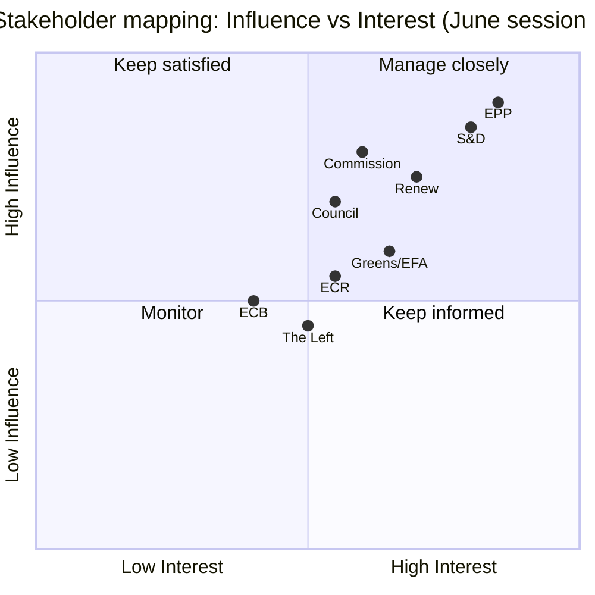
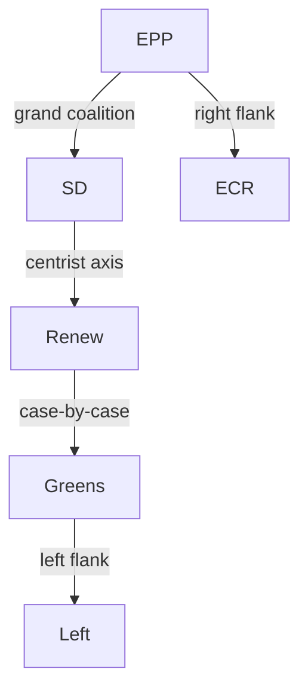

<!-- SPDX-FileCopyrightText: 2024-2026 Hack23 AB -->
<!-- SPDX-License-Identifier: Apache-2.0 -->

# Stakeholder Map — Week Ahead (2026-05-31)

Maps the institutional actors shaping the week of 1–7 June 2026 and the 15–18 June
Strasbourg part-session, their interests, current positions, and likely moves. Each
perspective is evidenced and confidence-labelled. Coalition geometry is the centrist
**EPP–S&D–Renew** axis flanked by Greens/EFA and ECR/PfE.

## 1 · Political Groups

### EPP (European People's Party) — largest group
**Interest:** competitiveness, fiscal discipline, enforcement of existing digital rules.
**Position:** drives the AI-trade/competitiveness strategy (TA-0183) and a
consolidation-leaning read of the 2027 budget guidelines. With France's deficit at
−4.9 % of GDP (IMF WEO), the EPP's fiscal-prudence framing gains rhetorical traction.
**Likely June move:** champion the competitiveness and budget-restraint lines; support
trade consents. 🟢 High on orientation; 🟡 Medium on specific amendments.

### S&D (Socialists & Democrats)
**Interest:** social protection, industrial-transition support, worker rights.
**Position:** links the weak-growth backdrop to a case for investment and EGF support
for displaced workers (Audi, plant closures). Resists pure-consolidation budget framing.
**Likely June move:** push social-conditionality amendments; back EGF mobilisations.
🟡 Medium.

### Renew Europe
**Interest:** single-market deepening, digital enforcement, rule-of-law.
**Position:** pivotal swing bloc on the centrist axis; aligns with EPP on
competitiveness, with S&D on rule-of-law and digital-rights enforcement.
**Likely June move:** broker the budget-guidelines compromise. 🟡 Medium.

### Greens/EFA
**Interest:** climate ambition, sustainable fisheries, corporate accountability.
**Position:** scrutinises the fisheries-protocol consents (TA-0178/0179) on
sustainability grounds; pushes environmental-standards conditionality.
**Likely June move:** table sustainability amendments to trade/fisheries files. 🟡 Medium.

### ECR / PfE (right flank)
**Interest:** subsidiarity, migration control, scepticism of further integration.
**Position:** likely to oppose elements of the trade-consent and budget files;
amplify sovereignty framings. **Likely June move:** procedural friction, oppositional
votes on consents. 🟡 Medium.

## 2 · EP Institutional Actors

| Actor | Role this cycle | Interest |
|-------|-----------------|----------|
| Conference of Presidents | Fixes 15–18 June order of business (Thu before) | Agenda control |
| Committee chairs (ECON, INTA, JURI, PECH) | Adopt reports, table amendments this week | Throughput |
| Rapporteurs / shadows | Negotiate compromises 1–7 June | File ownership |
| EP President | Chairs plenary, signs adopted acts | Institutional order |
| JURI | Processes immunity waivers (Braun, Pappas) | Legal integrity |

## 3 · External / Inter-Institutional

- **European Commission** — defends 2027 budget proposal and competitiveness agenda;
  responds to EP questions. Interest: securing EP backing. 🟢 High relevance.
- **European Central Bank** — subject of annual-report scrutiny (TA-0034); the
  re-accelerating ~2.6 % inflation complicates its easing path. Interest: independence,
  credibility. 🟢 High.
- **Council / Member States** — France (deficit politics), Germany (defence/infra
  spending crossing 3 %), trade-partner states (Uzbekistan, Cook Islands, São Tomé,
  Lebanon). Interest: ratification, fiscal latitude. 🟡 Medium.
- **Third countries with pending consents** — Uzbekistan (EPCA TA-0174), Lebanon
  (Eurojust TA-0177). Interest: EP ratification. 🟡 Medium.

## 4 · Influence × Interest Grid

| Actor | Influence | Interest in June agenda | Quadrant |
|-------|:---------:|:-----------------------:|----------|
| EPP | High | High | Manage closely |
| S&D | High | High | Manage closely |
| Renew | High | High | Manage closely (broker) |
| Commission | High | High | Manage closely |
| ECB | Medium | High | Keep informed |
| Greens/EFA | Medium | Medium | Keep satisfied |
| ECR/PfE | Medium | Medium | Monitor |
| Third countries | Low | High | Keep informed |

## 5 · Coalition Stress Points

The highest cross-group friction in June is forecast on (a) **trade/fisheries consents**
(Greens sustainability vs. EPP/Renew market access) and (b) **2027 budget framing**
(EPP consolidation vs. S&D investment), with **Renew brokering**. Immunity waivers are
typically broad-majority but can expose group discipline. Cross-ref
`intelligence/scenario-forecast.md` §scenarios and `risk-scoring/risk-matrix.md`.

## 6 · Group-by-Group Deep Profiles

### EPP — extended position read

The EPP enters June as the agenda's centre of gravity. Its competitiveness framing is
not merely rhetorical: it is anchored in the AI-trade strategy it shepherded (TA-0183)
and reinforced by the IMF macro picture (sub-1 % growth, see
`intelligence/economic-context.md`). The group's internal cohesion on economic files is
🟢 High; its cohesion on migration and rule-of-law files is 🟡 Medium, where national
delegations diverge. **June watch:** whether the EPP holds Renew on a
consolidation-leaning 2027-budget line or concedes investment language to keep the
centrist axis intact.

- **Leverage points:** committee chairs, rapporteurships on economic files.
- **Constraints:** dependence on S&D/Renew for floor majorities.
- **Most likely concession:** softened budget language in exchange for competitiveness wins.

### S&D — extended position read

S&D's strategic problem is that the weak-growth backdrop cuts both ways: it strengthens
the investment case but also the consolidation case. The group will emphasise the
**social cost of stagnation** — plant closures, EGF mobilisations — to reframe the debate
from "deficits" to "jobs". 🟡 Medium on whether this reframing lands.

- **Leverage points:** EGF files, social-conditionality amendments.
- **Constraints:** cannot block the centrist axis without defecting.
- **Most likely concession:** accept budget restraint if paired with social safeguards.

### Renew — the pivot

Renew is the **decisive broker**. On a left-right economic spectrum it sits between EPP
and S&D; on an integration axis it is the most consistently pro-European bloc. Its June
role is to **assemble the compromise** on the 2027-budget guidelines and to hold the line
on rule-of-law and digital-enforcement files. 🟢 High that Renew brokers; 🟡 Medium on
which side it tilts.

### Greens/EFA, ECR, PfE — the flanks

The flanks shape **votes at the margin** and **amendment pressure**, not the central
compromise. Greens push sustainability conditionality (fisheries, trade); ECR/PfE push
sovereignty and migration framings. Their combined effect is to **widen the amendment
debate** and occasionally to converge against a consent file (wildcard W3,
`intelligence/wildcards-blackswans.md`).

## 7 · Inter-Institutional Dynamics — Expanded

| Relationship | State entering June | Tension vector |
|--------------|---------------------|----------------|
| EP ↔ Commission | Cooperative on competitiveness | Budget headroom dispute |
| EP ↔ Council | Transactional on consents | Ratification pace |
| EP ↔ ECB | Scrutiny-based | Inflation/independence |
| EP ↔ Member States | Mixed (France fiscal politics) | Deficit framing |

The **EP–Commission** axis is the most consequential for June: the Commission needs EP
backing for the 2027 budget and competitiveness agenda, giving the Parliament leverage to
extract amendments. The **EP–ECB** relationship is scrutiny-based and low-conflict but
gains substance from the re-accelerating inflation (`intelligence/economic-context.md`).

## 8 · Stakeholder Movement Forecast (1–7 June)

| Actor | This-week action | Confidence |
|-------|------------------|:----------:|
| Committee chairs | Adopt reports, fix amendment slates | 🟢 High |
| Rapporteurs/shadows | Negotiate compromises | 🟢 High |
| Group leaders | Fix voting lines for 15–18 June | 🟢 High |
| Conference of Presidents | Draft order of business (late week) | 🟡 Medium |
| Commission | Respond to questions, defend budget | 🟡 Medium |

## 9 · Bottom Line

The stakeholder field is **stable and well-understood**: a centrist EPP–S&D–Renew axis
with Renew brokering, flanked by Greens (sustainability pressure) and ECR/PfE (sovereignty
pressure). The week's stakeholder action is **internal and preparatory**; the public
contest arrives at the 15–18 June session. The single most consequential relationship is
**EP–Commission** on the 2027 budget, load-bearing because of the IMF macro backdrop.
Cross-ref `intelligence/synthesis-summary.md`, `intelligence/scenario-forecast.md`, and
`risk-scoring/risk-matrix.md`.

## 7 · Stakeholder Influence-Interest Grid

## 8 · Group-by-Group June Posture

| Group | Likely priority | Budget stance | Trade-consent stance |
|-------|-----------------|---------------|----------------------|
| EPP | Fiscal discipline | Consolidation | Pro-market access |
| S&D | Social investment | Investment-protect | Conditional |
| Renew | Competitiveness | Reform-led | Pro, sustainability caveats |
| Greens/EFA | Climate/sustainability | Green conditionality | Sceptical |
| ECR | Sovereignty | National-flexibility | Selective |
| The Left | Social protection | Anti-austerity | Sceptical |

## 9 · Inter-Institutional Stakeholders

| Actor | June role | Leverage |
|-------|-----------|----------|
| Commission | Proposal author (budget, DMA) | Agenda-setting |
| Council | Co-legislator | Consent gatekeeping |
| ECB | Scrutiny subject | Independence shield |
| National parliaments | Subsidiarity watch | Indirect |

## 10 · Coalition-Formation Map

The **centrist axis (EPP–S&D–Renew)** remains the decisive bloc for the June budget and
consent votes. Greens/EFA are the swing partner on sustainability-linked files.

## 11 · Stakeholder Bottom Line

The June session's outcomes will be shaped primarily by the **centrist axis's internal
bargaining** over the 2027 budget, with Greens/EFA as the marginal vote on trade consents.
No single group can carry the session alone; compromise is structurally required. Cross-ref
`extended/media-framing-analysis.md` for how each group's frame plays in coverage.
